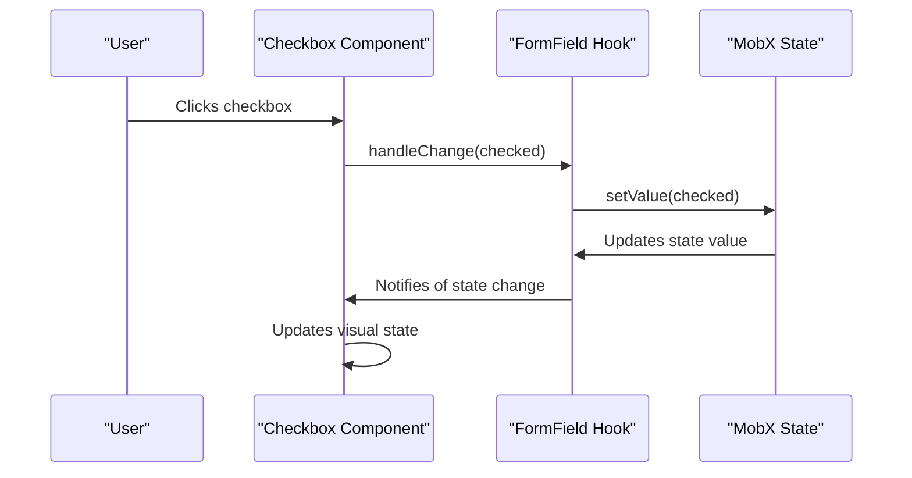
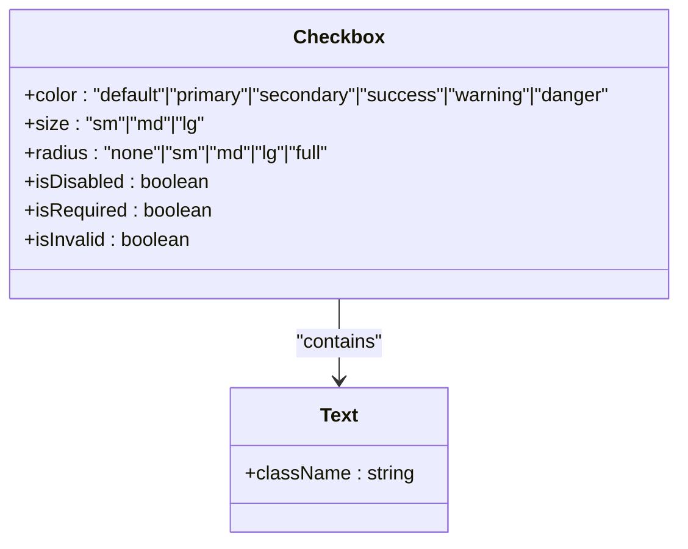
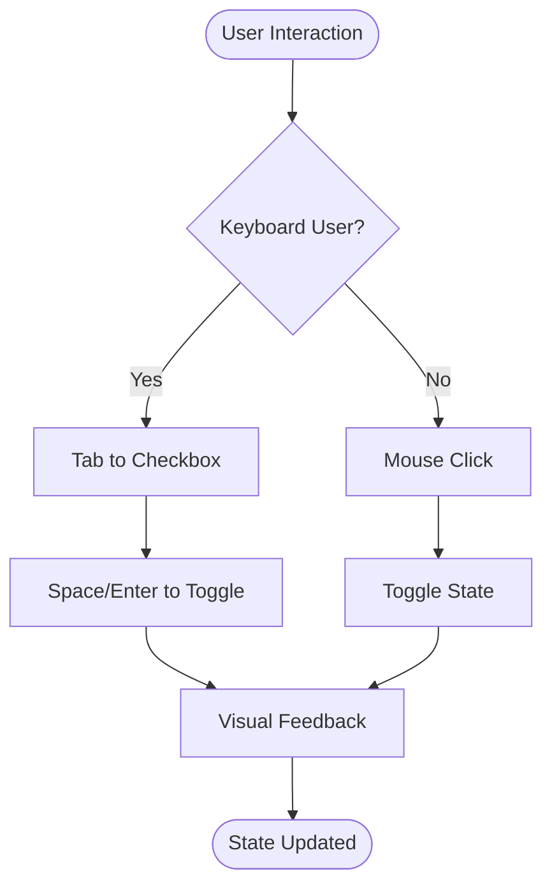
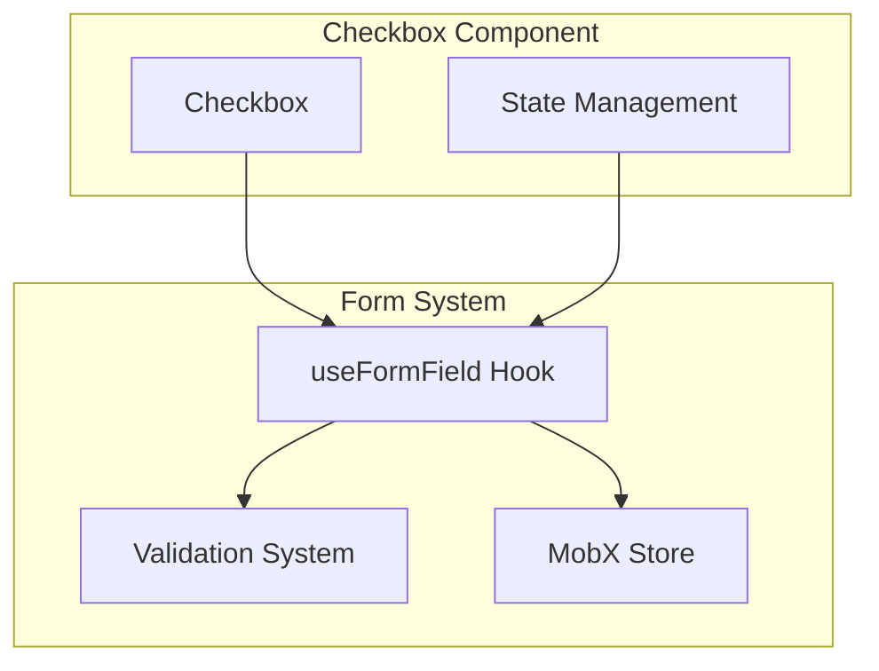
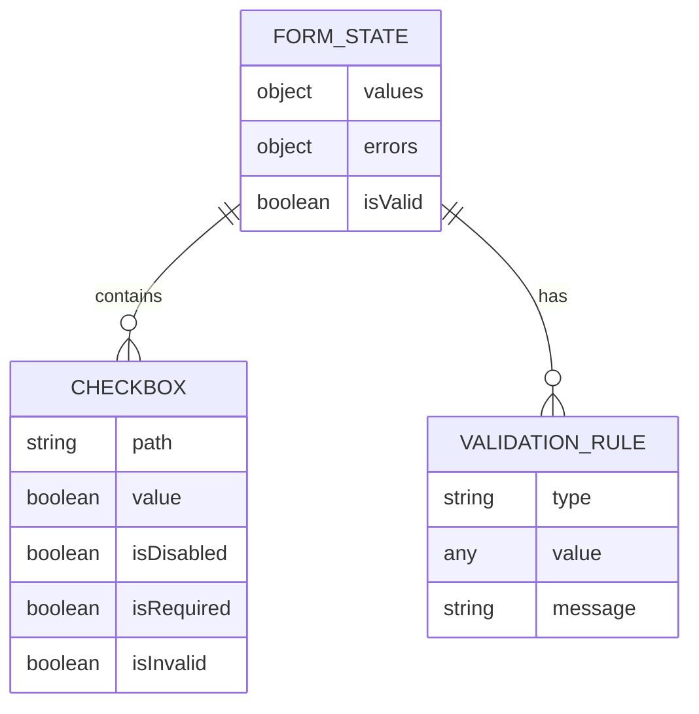
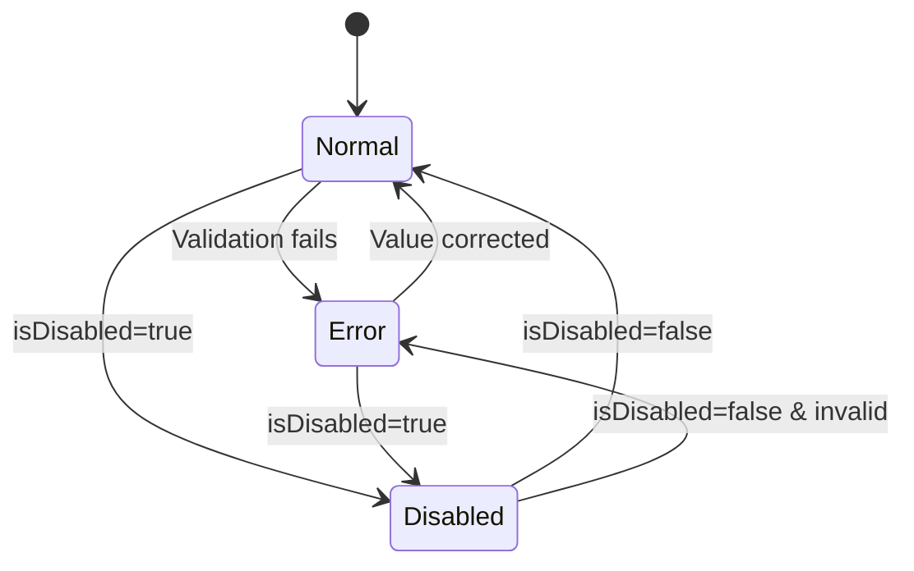
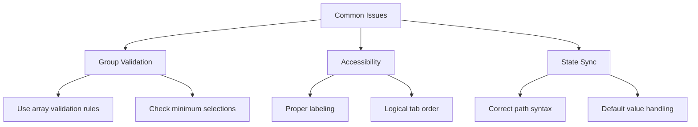

# Checkbox Component

<cite>
**Referenced Files in This Document**   
- [Checkbox.tsx](file://packages/ui/src/components/ui/inputs/Checkbox/Checkbox.tsx)
- [Checkbox.stories.tsx](file://packages/ui/src/components/ui/inputs/Checkbox/Checkbox.stories.tsx)
- [index.tsx](file://packages/ui/src/components/ui/inputs/Checkbox/index.tsx)
- [Form.ts](file://packages/toolkit/src/Form.ts)
</cite>

## Table of Contents
1. [Introduction](#introduction)
2. [Core Implementation](#core-implementation)
3. [Controlled State Management](#controlled-state-management)
4. [Visual Styling with Tailwind CSS](#visual-styling-with-tailwind-css)
5. [Accessibility Features](#accessibility-features)
6. [Integration with Form Libraries](#integration-with-form-libraries)
7. [Usage Patterns](#usage-patterns)
8. [Error State Handling](#error-state-handling)
9. [Common Issues and Solutions](#common-issues-and-solutions)
10. [Performance Optimization](#performance-optimization)

## Introduction
The Checkbox component in prj-core's shared-frontend package provides a flexible and accessible implementation for user input selection. Built as a wrapper around the @heroui/react Checkbox component, it offers enhanced functionality for state management, form integration, and accessibility compliance. This document details the component's architecture, implementation patterns, and best practices for usage across different scenarios.

## Core Implementation

The Checkbox component is implemented as a layered architecture with two main files: the base component (Checkbox.tsx) and the enhanced version with form integration (index.tsx). The base component handles visual rendering and basic interaction, while the enhanced version provides integration with the application's state management system.

```mermaid
graph TD
A[Checkbox Component] --> B[Base Implementation]
A --> C[Form Integration Layer]
B --> D[@heroui/react Checkbox]
C --> E[MobX State Management]
C --> F[useFormField Hook]
D --> G[Visual Rendering]
E --> H[State Synchronization]
F --> I[Form Validation]
```

**Diagram sources**
- [Checkbox.tsx](file://packages/ui/src/components/ui/inputs/Checkbox/Checkbox.tsx)
- [index.tsx](file://packages/ui/src/components/ui/inputs/Checkbox/index.tsx)

**Section sources**
- [Checkbox.tsx](file://packages/ui/src/components/ui/inputs/Checkbox/Checkbox.tsx#L1-L24)
- [index.tsx](file://packages/ui/src/components/ui/inputs/Checkbox/index.tsx#L1-L39)

## Controlled State Management

The Checkbox component implements controlled state management through the use of MobX and a custom useFormField hook. The component receives state and path props to determine its current value and updates the parent state through the formField.setValue method when changes occur.

The state management pattern uses a path-based approach to access nested properties in the state object, allowing for flexible integration with complex form structures. The default value is set to false when the path does not exist in the state object, ensuring predictable behavior.



**Diagram sources**
- [index.tsx](file://packages/ui/src/components/ui/inputs/Checkbox/index.tsx#L18-L26)
- [Checkbox.tsx](file://packages/ui/src/components/ui/inputs/Checkbox/Checkbox.tsx#L15-L17)

**Section sources**
- [index.tsx](file://packages/ui/src/components/ui/inputs/Checkbox/index.tsx#L18-L26)
- [Form.ts](file://packages/toolkit/src/Form.ts#L1-L47)

## Visual Styling with Tailwind CSS

The Checkbox component leverages Tailwind CSS for styling, providing multiple customization options including color themes, sizes, and radius settings. The component supports six color variants (default, primary, secondary, success, warning, danger) and three size options (sm, md, lg).

The visual implementation wraps the label text in a Text component with a font-bold class, ensuring consistent typography across the application. The base styling is inherited from the @heroui/react Checkbox component, with additional Tailwind classes applied for consistent design language.



**Diagram sources**
- [Checkbox.tsx](file://packages/ui/src/components/ui/inputs/Checkbox/Checkbox.tsx#L20-L22)
- [Checkbox.stories.tsx](file://packages/ui/src/components/ui/inputs/Checkbox/Checkbox.stories.tsx#L46-L67)

**Section sources**
- [Checkbox.tsx](file://packages/ui/src/components/ui/inputs/Checkbox/Checkbox.tsx#L8-L11)
- [Checkbox.stories.tsx](file://packages/ui/src/components/ui/inputs/Checkbox/Checkbox.stories.tsx#L46-L67)

## Accessibility Features

The Checkbox component includes comprehensive accessibility features to ensure compliance with WCAG standards. The implementation inherits ARIA roles and attributes from the @heroui/react Checkbox component, including proper labeling, keyboard navigation, and screen reader support.

Keyboard navigation is fully supported, allowing users to interact with the checkbox using tab, space, and enter keys. The component maintains proper focus states and provides visual feedback for keyboard users. Screen readers can accurately convey the checkbox state, label, and any validation messages to users with visual impairments.



**Diagram sources**
- [Checkbox.stories.tsx](file://packages/ui/src/components/ui/inputs/Checkbox/Checkbox.stories.tsx#L34-L45)
- [Checkbox.tsx](file://packages/ui/src/components/ui/inputs/Checkbox/Checkbox.tsx#L20-L22)

**Section sources**
- [Checkbox.stories.tsx](file://packages/ui/src/components/ui/inputs/Checkbox/Checkbox.stories.tsx#L34-L45)
- [Checkbox.tsx](file://packages/ui/src/components/ui/inputs/Checkbox/Checkbox.tsx#L20-L22)

## Integration with Form Libraries

The Checkbox component integrates seamlessly with the application's form management system through the useFormField hook from @cocrepo/hook. This integration enables automatic connection to the MobX state tree, validation handling, and form-level operations.

The component accepts a state object and path string to determine its location within the form state hierarchy. This pattern allows for easy integration with complex forms containing nested structures and arrays. The useFormField hook provides additional functionality such as validation, error handling, and form submission tracking.



**Diagram sources**
- [index.tsx](file://packages/ui/src/components/ui/inputs/Checkbox/index.tsx#L1-L39)
- [Form.ts](file://packages/toolkit/src/Form.ts#L1-L47)

**Section sources**
- [index.tsx](file://packages/ui/src/components/ui/inputs/Checkbox/index.tsx#L1-L39)
- [Form.ts](file://packages/toolkit/src/Form.ts#L1-L47)

## Usage Patterns

### Single Checkbox
The most basic usage pattern involves a single checkbox with a label. The component requires a state object and path to manage its value, along with optional properties for styling and behavior.

### Checkbox Groups
For multiple related checkboxes, the component can be used in groups by creating multiple instances with different path values pointing to properties within the same state object.

### Indeterminate State
While not explicitly shown in the implementation, the underlying @heroui/react Checkbox supports indeterminate states, which can be useful for parent checkboxes in tree structures that represent the state of child checkboxes.



**Diagram sources**
- [Checkbox.stories.tsx](file://packages/ui/src/components/ui/inputs/Checkbox/Checkbox.stories.tsx#L74-L193)
- [index.tsx](file://packages/ui/src/components/ui/inputs/Checkbox/index.tsx#L16-L22)

**Section sources**
- [Checkbox.stories.tsx](file://packages/ui/src/components/ui/inputs/Checkbox/Checkbox.stories.tsx#L74-L193)
- [index.tsx](file://packages/ui/src/components/ui/inputs/Checkbox/index.tsx#L16-L22)

## Error State Handling

The Checkbox component provides visual feedback for error states through the isInvalid prop. When validation fails, the component displays appropriate styling to indicate the error condition. The integration with the form validation system allows for automatic error state management based on defined validation rules.

Error messages are handled at the form level rather than within the checkbox component itself, maintaining separation of concerns. The component only concerns itself with visual representation of the error state, while the form system manages the error messages and validation logic.



**Diagram sources**
- [Checkbox.stories.tsx](file://packages/ui/src/components/ui/inputs/Checkbox/Checkbox.stories.tsx#L108-L115)
- [Form.ts](file://packages/toolkit/src/Form.ts#L1-L47)

**Section sources**
- [Checkbox.stories.tsx](file://packages/ui/src/components/ui/inputs/Checkbox/Checkbox.stories.tsx#L108-L115)
- [Form.ts](file://packages/toolkit/src/Form.ts#L1-L47)

## Common Issues and Solutions

### Group Validation
When validating groups of checkboxes, ensure that the validation rules are applied at the appropriate level in the state hierarchy. For required checkbox groups, validation should check that at least one checkbox is selected.

### Accessibility Compliance
Ensure that all checkboxes have descriptive labels and that the tab order follows a logical sequence. When using checkbox groups, consider using fieldset and legend elements to provide additional context for screen readers.

### State Synchronization
When working with complex state structures, ensure that the path prop accurately reflects the location of the checkbox value within the state object. Use the tools.get utility function to safely access nested properties.



**Diagram sources**
- [index.tsx](file://packages/ui/src/components/ui/inputs/Checkbox/index.tsx#L19-L20)
- [Form.ts](file://packages/toolkit/src/Form.ts#L1-L47)

**Section sources**
- [index.tsx](file://packages/ui/src/components/ui/inputs/Checkbox/index.tsx#L19-L20)
- [Form.ts](file://packages/toolkit/src/Form.ts#L1-L47)

## Performance Optimization

When rendering large numbers of checkboxes, consider the following optimization strategies:

1. Use React.memo to prevent unnecessary re-renders of individual checkbox components
2. Implement virtual scrolling for very large lists of checkboxes
3. Batch state updates when multiple checkboxes need to be modified simultaneously
4. Use efficient path lookups with the tools.get utility function

The current implementation already leverages MobX's reactivity system to minimize re-renders, only updating components when their specific state values change.

**Section sources**
- [index.tsx](file://packages/ui/src/components/ui/inputs/Checkbox/index.tsx#L4-L5)
- [Checkbox.tsx](file://packages/ui/src/components/ui/inputs/Checkbox/Checkbox.tsx#L12-L24)