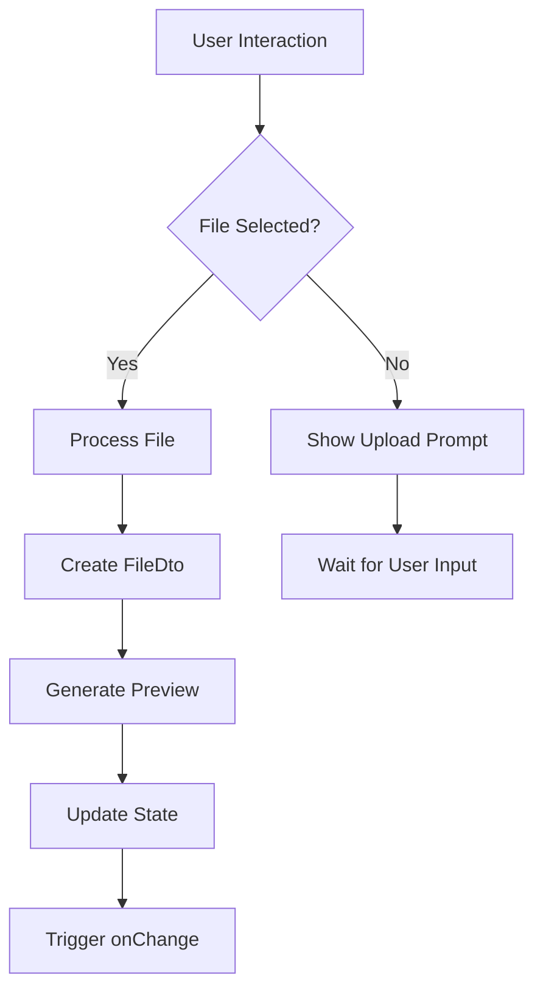
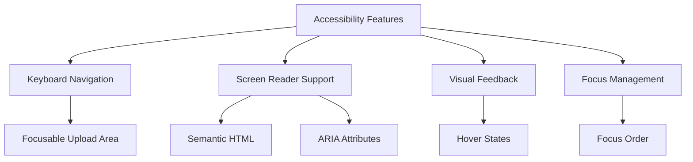
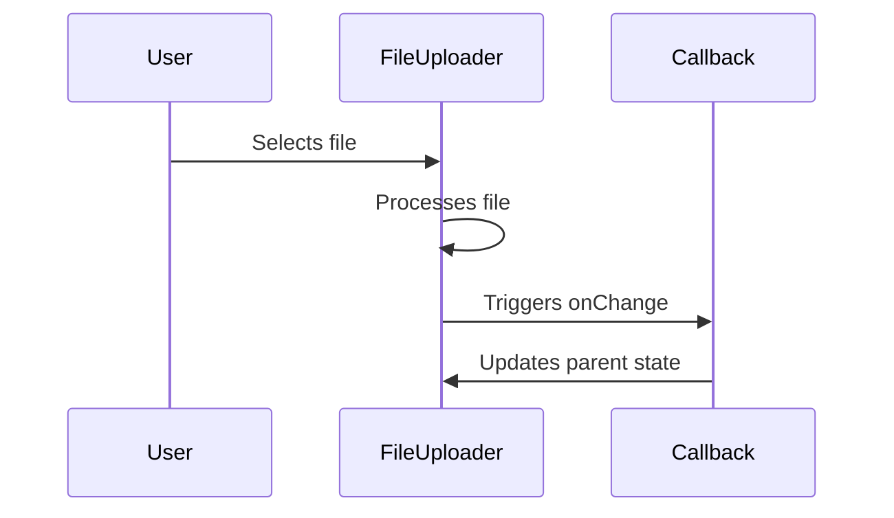
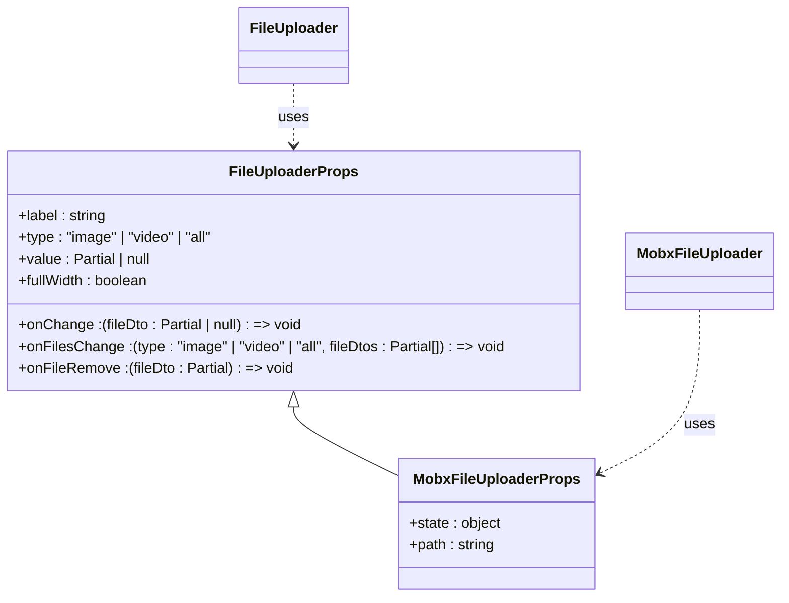

# FileUploader Component

<cite>
**Referenced Files in This Document**   
- [FileUploader.tsx](file://packages/ui/src/components/ui/inputs/FileUploader/FileUploader.tsx)
- [FileUploader.stories.tsx](file://packages/ui/src/components/ui/inputs/FileUploader/FileUploader.stories.tsx)
- [index.tsx](file://packages/ui/src/components/ui/inputs/FileUploader/index.tsx)
</cite>

## Table of Contents
1. [Introduction](#introduction)
2. [Core Features](#core-features)
3. [Implementation Details](#implementation-details)
4. [Accessibility Features](#accessibility-features)
5. [Usage Patterns](#usage-patterns)
6. [Integration with Form Libraries](#integration-with-form-libraries)
7. [Visual Feedback and Styling](#visual-feedback-and-styling)
8. [Error Handling and Edge Cases](#error-handling-and-edge-cases)
9. [Performance Considerations](#performance-considerations)
10. [Best Practices](#best-practices)

## Introduction
The FileUploader component is a reusable UI element designed to facilitate file upload functionality across the prj-core application. It provides a user-friendly interface for uploading files with support for various file types, visual previews, and seamless integration with form management systems. The component is built with accessibility in mind and offers comprehensive feedback mechanisms through Tailwind CSS styling.

**Section sources**
- [FileUploader.tsx](file://packages/ui/src/components/ui/inputs/FileUploader/FileUploader.tsx#L1-L197)

## Core Features
The FileUploader component offers several key features:

- **Drag-and-drop functionality**: Users can upload files by dragging and dropping them onto the upload area.
- **File type validation**: Supports image, video, or all file types with appropriate MIME type filtering.
- **Visual file previews**: Displays thumbnails for images and videos, with fallback icons for other file types.
- **File size display**: Shows file size in appropriate units (bytes, KB, MB).
- **File removal**: Allows users to remove uploaded files with a clear visual indicator.
- **Responsive design**: Adapts to different screen sizes with appropriate styling.

**Diagram sources**
- [FileUploader.tsx](file://packages/ui/src/components/ui/inputs/FileUploader/FileUploader.tsx#L30-L46)

## Implementation Details
The FileUploader component is implemented as a React functional component with the following key aspects:

- **File handling**: Uses the HTML5 File API to process uploaded files and create object URLs for previews.
- **State management**: Manages file state through props and callbacks rather than internal state.
- **Type safety**: Utilizes TypeScript interfaces to ensure type safety for file data and component props.
- **UUID generation**: Assigns unique identifiers to uploaded files using the uuid library.

The component accepts a FileDto object that contains file metadata such as name, URL, MIME type, and size. When a file is uploaded, it creates a FileDto object and passes it to the onChange callback.

**Section sources**
- [FileUploader.tsx](file://packages/ui/src/components/ui/inputs/FileUploader/FileUploader.tsx#L6-L197)

## Accessibility Features
The FileUploader component includes several accessibility features:

- **Keyboard navigation**: The upload area is focusable and can be activated with keyboard input.
- **Screen reader compatibility**: Uses semantic HTML elements and ARIA attributes to provide context to assistive technologies.
- **Visual feedback**: Provides clear visual indicators for hover states and interactive elements.
- **Focus management**: Maintains proper focus order within the component.

The component uses a label element with an associated hidden file input, ensuring that screen readers can properly identify the upload functionality. The delete button includes appropriate ARIA labels and is only visible on hover to reduce visual clutter while maintaining accessibility.

**Diagram sources**
- [FileUploader.tsx](file://packages/ui/src/components/ui/inputs/FileUploader/FileUploader.tsx#L152-L175)

## Usage Patterns
The FileUploader component supports multiple usage patterns:

### Basic Usage
For simple file upload scenarios, the component can be used with minimal configuration:

### Single File Upload
The component is designed primarily for single file uploads, where the value prop represents the currently uploaded file (or null if no file is uploaded).

### Multiple File Uploads
While the current implementation focuses on single file uploads, the onFilesChange callback suggests potential support for multiple file scenarios.

### Custom Validation
The component can be extended with custom validation rules by wrapping it or using the onFilesChange callback to implement additional validation logic.

**Section sources**
- [FileUploader.stories.tsx](file://packages/ui/src/components/ui/inputs/FileUploader/FileUploader.stories.tsx#L18-L55)

## Integration with Form Libraries
The FileUploader component integrates with form management systems through its MobX-based wrapper:

- **MobX integration**: The index.tsx file exports a MobX-connected version of the component that automatically handles form state management.
- **Form field binding**: Uses the useFormField hook to connect the component to form state.
- **Path-based state management**: Supports binding to specific paths within a state object.

The wrapper component abstracts away the direct state management, allowing the FileUploader to be used seamlessly within forms that use MobX for state management.

**Diagram sources**
- [index.tsx](file://packages/ui/src/components/ui/inputs/FileUploader/index.tsx#L1-L33)
- [FileUploader.tsx](file://packages/ui/src/components/ui/inputs/FileUploader/FileUploader.tsx#L6-L17)

## Visual Feedback and Styling
The FileUploader component uses Tailwind CSS for styling with the following visual feedback mechanisms:

- **Hover effects**: The upload area changes border color and background on hover.
- **File previews**: Images display with a checkered background pattern to show transparency.
- **Progressive disclosure**: The delete button is hidden by default and appears on hover.
- **Responsive layout**: Adapts to different screen sizes with appropriate spacing and sizing.

The component uses a card-based layout with consistent spacing and typography. File previews are displayed with appropriate aspect ratios, and file information is clearly presented below the preview.

**Section sources**
- [FileUploader.tsx](file://packages/ui/src/components/ui/inputs/FileUploader/FileUploader.tsx#L64-L135)

## Error Handling and Edge Cases
The FileUploader component handles several edge cases:

- **Empty file lists**: Checks for null or empty file lists before processing.
- **File input reset**: Clears the file input value after processing to allow re-upload of the same file.
- **Missing file properties**: Uses optional chaining when accessing file properties to prevent runtime errors.
- **Large file names**: Truncates long file names with ellipsis in the preview.

The component relies on browser-level file type filtering through the accept attribute, but does not implement client-side file size limits or additional validation beyond MIME type filtering.

**Section sources**
- [FileUploader.tsx](file://packages/ui/src/components/ui/inputs/FileUploader/FileUploader.tsx#L30-L46)

## Performance Considerations
The FileUploader component implements several performance optimizations:

- **Object URL creation**: Uses URL.createObjectURL() to create temporary URLs for file previews, avoiding the need to read file contents.
- **Minimal re-renders**: The component is designed to minimize unnecessary re-renders by using callback functions rather than internal state.
- **Efficient event handling**: Uses standard DOM events for file input without additional listeners.

However, for very large files, the creation of object URLs could impact memory usage, and the component does not currently implement chunked uploads or progress tracking.

**Section sources**
- [FileUploader.tsx](file://packages/ui/src/components/ui/inputs/FileUploader/FileUploader.tsx#L37-L38)

## Best Practices
When using the FileUploader component, consider the following best practices:

- **Provide clear labels**: Use descriptive labels to guide users on what type of file to upload.
- **Handle file removal**: Implement the onFileRemove callback to properly clean up resources.
- **Validate on the server**: While the component provides basic client-side filtering, always validate file types and sizes on the server.
- **Consider file size limits**: For production applications, implement server-side file size validation and consider chunked uploads for large files.
- **Provide feedback**: Use the component's callbacks to provide additional feedback to users about upload status.

The component is designed to be extensible, allowing developers to build upon its core functionality for more complex upload scenarios.

**Section sources**
- [FileUploader.tsx](file://packages/ui/src/components/ui/inputs/FileUploader/FileUploader.tsx#L1-L197)
- [FileUploader.stories.tsx](file://packages/ui/src/components/ui/inputs/FileUploader/FileUploader.stories.tsx#L1-L55)