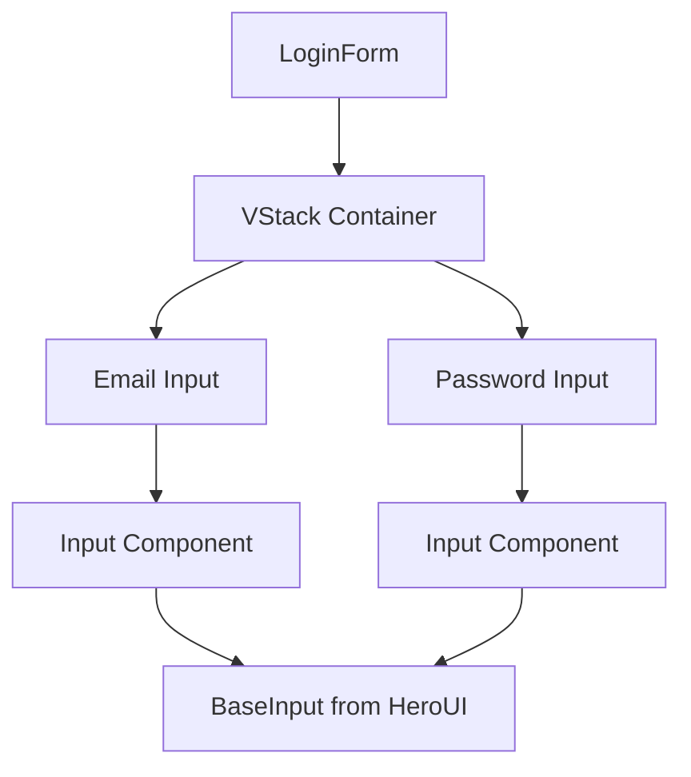
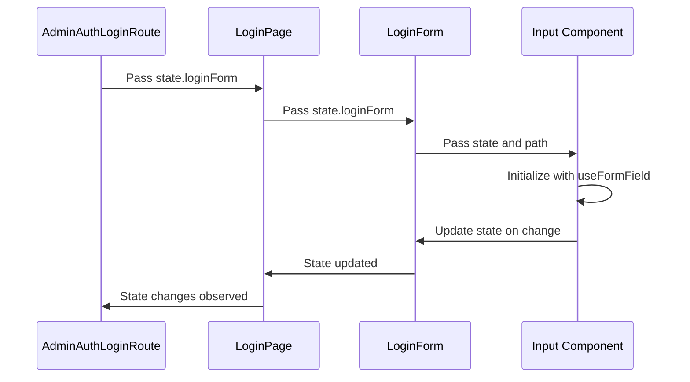
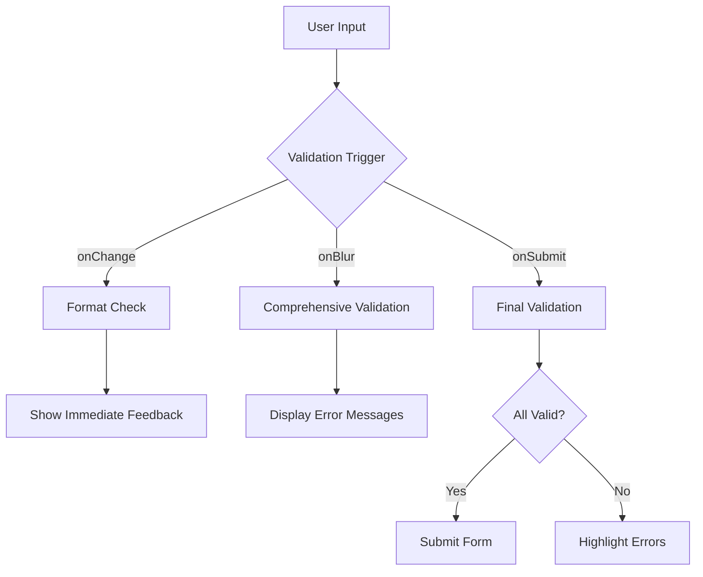
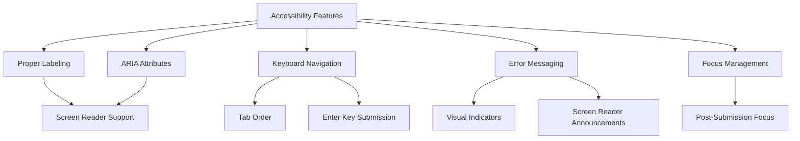
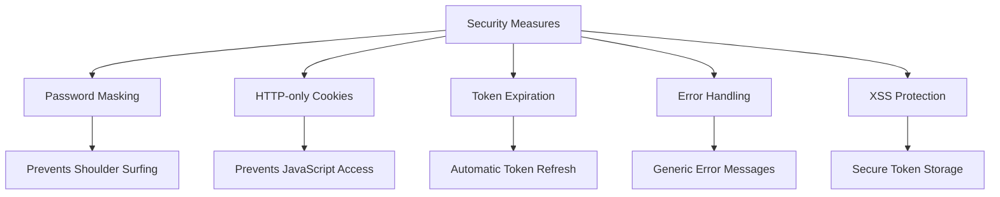
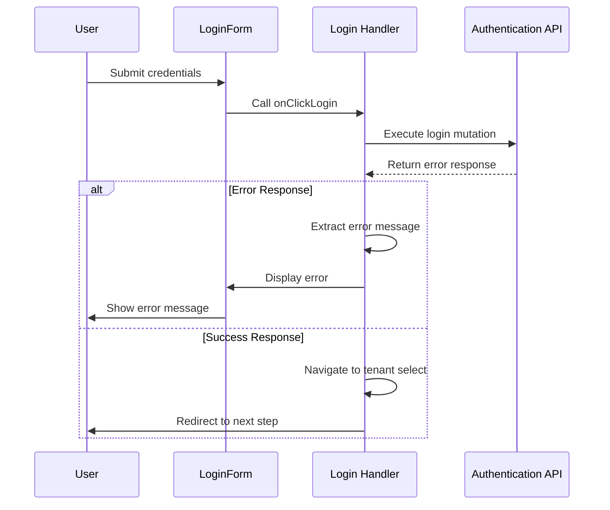
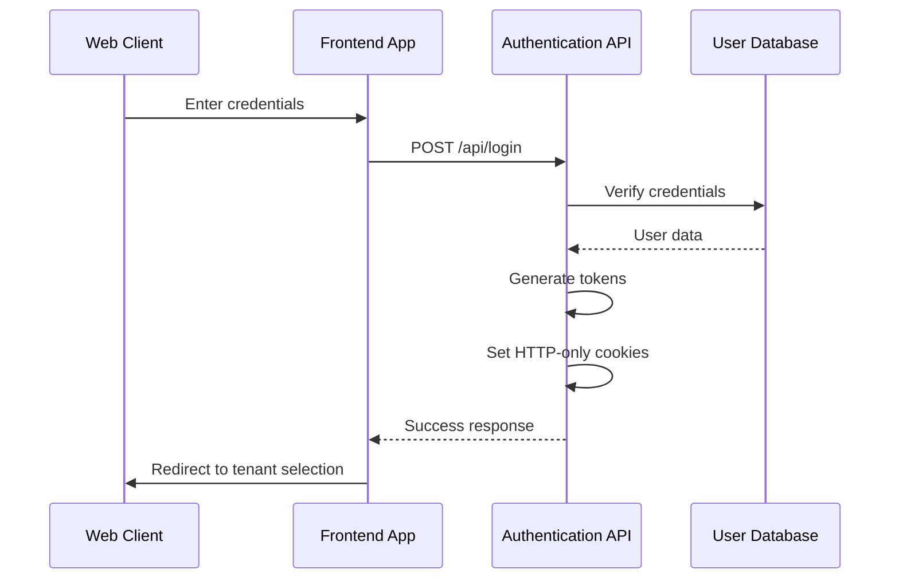
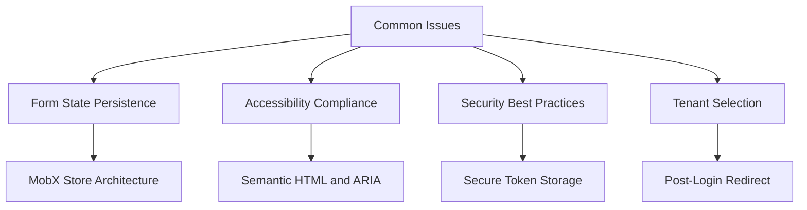

# LoginForm Component

<cite>
**Referenced Files in This Document**   
- [LoginForm.tsx](file://packages/ui/src/components/form/LoginForm/LoginForm.tsx)
- [LoginPage.tsx](file://packages/ui/src/components/page/LoginPage.tsx)
- [login.tsx](file://apps/admin/src/routes/admin/auth/login.tsx)
- [authStore.ts](file://packages/store/src/stores/authStore.ts)
- [tokenStore.ts](file://packages/store/src/stores/tokenStore.ts)
- [Input.tsx](file://packages/ui/src/components/ui/inputs/Input/index.tsx)
- [Form.ts](file://packages/toolkit/src/Form.ts)
</cite>

## Table of Contents
1. [Introduction](#introduction)
2. [Form Composition and Structure](#form-composition-and-structure)
3. [State Management and Data Flow](#state-management-and-data-flow)
4. [Validation Patterns](#validation-patterns)
5. [Authentication State Integration](#authentication-state-integration)
6. [Accessibility Features](#accessibility-features)
7. [Security Considerations](#security-considerations)
8. [Error Handling and Feedback](#error-handling-and-feedback)
9. [Integration with Backend APIs](#integration-with-backend-apis)
10. [Common Issues and Solutions](#common-issues-and-solutions)

## Introduction

The LoginForm component is a core authentication interface within the prj-core's shared-frontend package, designed to provide a consistent and secure login experience across applications. This component serves as the primary entry point for user authentication, handling credential input, validation, and integration with the global authentication state management system. The LoginForm is built using a component composition pattern, leveraging reusable Input components and a centralized state management approach through MobX stores.

The component is designed with accessibility, security, and maintainability as primary concerns, following modern React patterns and best practices for form handling. It integrates seamlessly with the application's authentication workflow, including tenant selection processes and token management systems.

## Form Composition and Structure

The LoginForm component is composed of two primary input fields: email and password, structured using a VStack layout container for vertical alignment. Each input field is implemented using the reusable Input component from the shared UI library, which provides consistent styling and behavior across the application.

The component accepts a state prop containing the email and password values, enabling controlled input behavior. The email field is configured with type="email" for proper keyboard display on mobile devices and browser-level validation, while the password field uses type="password" to mask input characters for security.



**Diagram sources**
- [LoginForm.tsx](file://packages/ui/src/components/form/LoginForm/LoginForm.tsx#L1-L33)
- [Input.tsx](file://packages/ui/src/components/ui/inputs/Input/index.tsx#L1-L37)

**Section sources**
- [LoginForm.tsx](file://packages/ui/src/components/form/LoginForm/LoginForm.tsx#L1-L33)

## State Management and Data Flow

The LoginForm component operates within a MobX-based state management system, where form state is managed at the route level and passed down as props. The state flows from the route component through the LoginPage container to the LoginForm itself, creating a unidirectional data flow pattern.

In the admin application, the login route uses a custom hook `useAdminAuthLoginRoute` that initializes the form state with observable properties for email and password. This state is then passed to the LoginPage component, which renders the LoginForm with the appropriate state object.

The Input components within the LoginForm use the `useFormField` hook from the shared-hooks package to create field-specific observables that sync with the parent state object. When input values change, the hook updates the corresponding path in the state object, ensuring that the form state remains synchronized.



**Diagram sources**
- [login.tsx](file://apps/admin/src/routes/admin/auth/login.tsx#L1-L89)
- [LoginPage.tsx](file://packages/ui/src/components/page/LoginPage.tsx#L1-L26)
- [Input.tsx](file://packages/ui/src/components/ui/inputs/Input/index.tsx#L1-L37)

**Section sources**
- [login.tsx](file://apps/admin/src/routes/admin/auth/login.tsx#L1-L89)
- [LoginPage.tsx](file://packages/ui/src/components/page/LoginPage.tsx#L1-L26)

## Validation Patterns

The validation system for the LoginForm is implemented through a combination of inline validation rules and utility functions from the shared-toolkit package. The Input components support validation through the `useFormField` hook, which can be configured with validation rules for required fields, minimum/maximum lengths, and pattern matching.

The shared toolkit provides a `validateSingleField` function that checks various validation rules including required fields, minimum and maximum length, numerical ranges, and regular expression patterns. For the LoginForm, email validation is likely implemented using a pattern rule that ensures the input matches a valid email format.

Validation occurs at multiple points in the user interaction:
- On change: Immediate feedback for format validation
- On blur: Comprehensive validation when the user leaves a field
- On submit: Final validation before processing the login request



**Diagram sources**
- [Form.ts](file://packages/toolkit/src/Form.ts#L1-L96)
- [Input.tsx](file://packages/ui/src/components/ui/inputs/Input/index.tsx#L1-L37)

**Section sources**
- [Form.ts](file://packages/toolkit/src/Form.ts#L1-L96)

## Authentication State Integration

The LoginForm integrates with the global authentication state management system through the MobX-based store architecture. The authentication state is managed by the AuthStore, which is part of the PlateStore composition that serves as the root store for the application.

When a user submits the login form, the handler function calls the login mutation, which upon success, triggers updates to the authentication state. The AuthStore maintains the authentication status through its `isAuthenticated` getter, which checks whether the access token has expired by consulting the TokenStore.

The TokenStore is responsible for managing JWT tokens, storing them in secure HTTP-only cookies, and providing methods to check token validity and refresh expired tokens. This integration ensures that authentication state is consistently maintained across the application and persists through page refreshes.

```mermaid
classDiagram
class LoginForm {
+state : {email, password}
+render()
}
class AuthStore {
-plateStore : Store
+isLoggingOut : boolean
+isAuthenticated() : boolean
+handleAuthError(error)
+logout()
}
class TokenStore {
-cookieStore : CookieStore
+store : Store
+setAccessToken(token)
+getAccessToken()
+isAccessTokenExpired()
+refreshToken()
}
class Store {
+navigation : NavigationStore
+tokenStore : TokenStore
+authStore : AuthStore
+cookieStore : CookieStore
}
LoginForm --> AuthStore : "triggers login"
AuthStore --> TokenStore : "checks token validity"
TokenStore --> Store : "part of store composition"
Store --> AuthStore : "dependency"
```

**Diagram sources**
- [authStore.ts](file://packages/store/src/stores/authStore.ts#L1-L84)
- [tokenStore.ts](file://packages/store/src/stores/tokenStore.ts#L1-L67)
- [Store.ts](file://packages/store/src/stores/Store.ts#L1-L24)

**Section sources**
- [authStore.ts](file://packages/store/src/stores/authStore.ts#L1-L84)
- [tokenStore.ts](file://packages/store/src/stores/tokenStore.ts#L1-L67)

## Accessibility Features

The LoginForm component incorporates several accessibility features to ensure an inclusive user experience. The component uses proper form labeling with the label prop on Input components, ensuring that screen readers can correctly identify each field. The VStack layout provides semantic structure and proper tab navigation order.

Each input field includes appropriate ARIA attributes and follows WCAG guidelines for color contrast and interactive element sizing. The error messaging system is designed to provide clear, descriptive feedback that can be announced by screen readers, with visual indicators that are distinguishable for users with color vision deficiencies.

Keyboard navigation is fully supported, allowing users to tab between fields and submit the form using the Enter key. The component also manages focus appropriately during the login process, ensuring that users are directed to the appropriate element after form submission or error display.



**Diagram sources**
- [LoginForm.tsx](file://packages/ui/src/components/form/LoginForm/LoginForm.tsx#L1-L33)
- [Input.tsx](file://packages/ui/src/components/ui/inputs/Input/index.tsx#L1-L37)

**Section sources**
- [LoginForm.tsx](file://packages/ui/src/components/form/LoginForm/LoginForm.tsx#L1-L33)

## Security Considerations

The LoginForm implements several security measures to protect user credentials and prevent common vulnerabilities. Password fields use the password input type to mask characters and prevent shoulder surfing. The component integrates with a secure token management system that stores authentication tokens in HTTP-only cookies, preventing access via JavaScript and mitigating XSS attacks.

The authentication flow includes proper error handling that avoids revealing specific details about why a login attempt failed, preventing user enumeration attacks. Instead of indicating whether a username or password was incorrect, the system returns generic error messages.

The TokenStore implements token expiration checks and automatic token refresh mechanisms to maintain secure sessions without requiring frequent re-authentication. Access tokens are validated on the client side by checking their expiration time, and refresh tokens are used to obtain new access tokens when needed.



**Diagram sources**
- [LoginForm.tsx](file://packages/ui/src/components/form/LoginForm/LoginForm.tsx#L1-L33)
- [tokenStore.ts](file://packages/store/src/stores/tokenStore.ts#L1-L67)
- [authStore.ts](file://packages/store/src/stores/authStore.ts#L1-L84)

**Section sources**
- [tokenStore.ts](file://packages/store/src/stores/tokenStore.ts#L1-L67)
- [authStore.ts](file://packages/store/src/stores/authStore.ts#L1-L84)

## Error Handling and Feedback

The LoginForm implements a comprehensive error handling system that provides clear feedback to users during the authentication process. When validation errors occur, the component displays descriptive error messages near the relevant fields, using both visual indicators and ARIA attributes for screen readers.

For authentication failures, the system catches errors from the login mutation and displays appropriate messages. The error handling in the login route specifically checks for Axios errors and extracts meaningful messages from the response data, ensuring that users receive helpful feedback rather than technical error details.

The component also handles loading states during the authentication process, disabling the submit button and showing a loading indicator to prevent multiple submissions. This prevents race conditions and provides visual feedback that the system is processing the request.



**Diagram sources**
- [login.tsx](file://apps/admin/src/routes/admin/auth/login.tsx#L1-L89)
- [authStore.ts](file://packages/store/src/stores/authStore.ts#L1-L84)

**Section sources**
- [login.tsx](file://apps/admin/src/routes/admin/auth/login.tsx#L1-L89)

## Integration with Backend APIs

The LoginForm integrates with backend authentication APIs through the shared-api-client package, which provides a standardized interface for authentication operations. The login process is implemented as a mutation using React Query, allowing for efficient data fetching, caching, and error handling.

When the user submits the form, the login mutation sends the email and password to the authentication endpoint, which validates the credentials and returns an authentication response. Upon successful authentication, the backend sets HTTP-only cookies containing the access and refresh tokens, which are then managed by the client-side TokenStore.

The integration follows a secure authentication flow that protects against common vulnerabilities such as CSRF attacks by using secure cookie settings (SameSite=strict, Secure=true) and proper token validation on both client and server sides.



**Diagram sources**
- [login.tsx](file://apps/admin/src/routes/admin/auth/login.tsx#L1-L89)
- [tokenStore.ts](file://packages/store/src/stores/tokenStore.ts#L1-L67)

**Section sources**
- [login.tsx](file://apps/admin/src/routes/admin/auth/login.tsx#L1-L89)

## Common Issues and Solutions

The LoginForm implementation addresses several common issues encountered in authentication workflows. For form state persistence across navigation, the component relies on the MobX store architecture, which maintains state in memory and can be persisted to localStorage or sessionStorage through the StorageStore.

Accessibility compliance is ensured through proper semantic HTML, ARIA attributes, and keyboard navigation support. The component follows WCAG guidelines for color contrast, interactive element sizing, and error messaging to provide an inclusive experience for all users.

Security best practices for credential handling are implemented through password masking, secure token storage, and proper error handling that avoids information leakage. The integration with the TokenStore ensures that authentication tokens are stored securely in HTTP-only cookies and validated on the client side to prevent unauthorized access.

For tenant selection workflows, the login process is designed to redirect users to a tenant selection screen after successful authentication, allowing users with access to multiple tenants to choose their context before proceeding to the main application.



**Diagram sources**
- [login.tsx](file://apps/admin/src/routes/admin/auth/login.tsx#L1-L89)
- [Store.ts](file://packages/store/src/stores/Store.ts#L1-L24)
- [authStore.ts](file://packages/store/src/stores/authStore.ts#L1-L84)

**Section sources**
- [login.tsx](file://apps/admin/src/routes/admin/auth/login.tsx#L1-L89)
- [Store.ts](file://packages/store/src/stores/Store.ts#L1-L24)