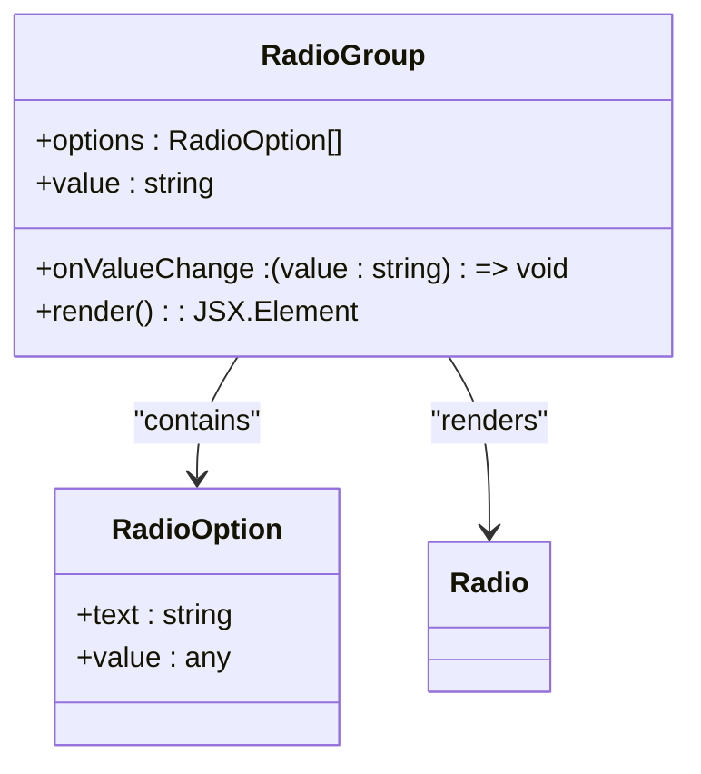
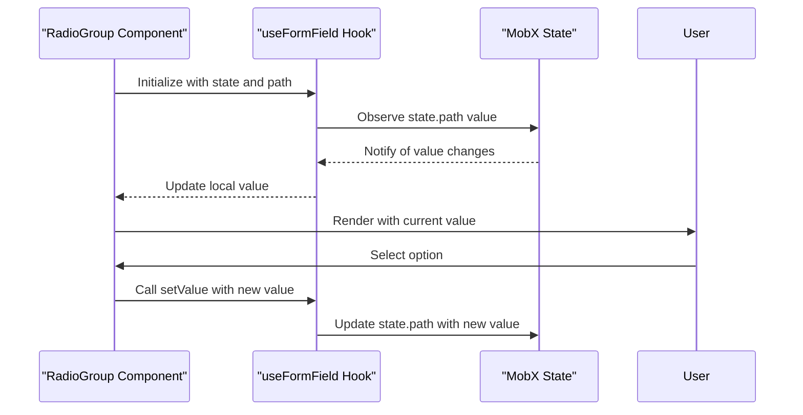
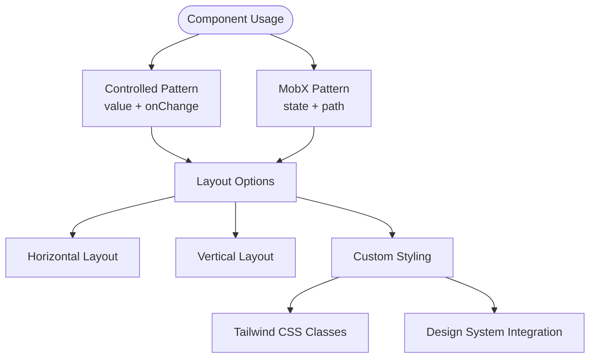

# RadioGroup Component

<cite>
**Referenced Files in This Document**   
- [RadioGroup.tsx](file://packages/ui/src/components/ui/inputs/RadioGroup/RadioGroup.tsx)
- [index.tsx](file://packages/ui/src/components/ui/inputs/RadioGroup/index.tsx)
- [RadioGroup.stories.tsx](file://packages/ui/src/components/ui/inputs/RadioGroup/RadioGroup.stories.tsx)
- [useFormField.ts](file://packages/hook/src/useFormField.ts)
- [base.css](file://packages/design-system/src/styles/base.css)
</cite>

## Table of Contents
1. [Introduction](#introduction)
2. [Core Implementation](#core-implementation)
3. [State Management](#state-management)
4. [Accessibility Features](#accessibility-features)
5. [Usage Patterns](#usage-patterns)
6. [Integration with Form Systems](#integration-with-form-systems)
7. [Common Issues and Solutions](#common-issues-and-solutions)
8. [Performance Considerations](#performance-considerations)

## Introduction
The RadioGroup component in the shared-frontend package provides a flexible and accessible way to present multiple choice options where only one selection is allowed. Built on top of the @heroui/react library, this component offers both basic and advanced usage patterns for handling user selections in forms and interfaces. The implementation supports controlled state management, MobX integration, and customizable styling through Tailwind CSS.

**Section sources**
- [RadioGroup.tsx](file://packages/ui/src/components/ui/inputs/RadioGroup/RadioGroup.tsx#L1-L45)
- [index.tsx](file://packages/ui/src/components/ui/inputs/RadioGroup/index.tsx#L1-L41)

## Core Implementation
The RadioGroup component is implemented as a wrapper around the NextUI RadioGroup component from @heroui/react, providing an abstraction layer that standardizes the interface and adds additional functionality. The core implementation defines a RadioOption interface with text and value properties, allowing for flexible option configuration.

The component accepts an array of options that are mapped to individual Radio components within the RadioGroup container. Each Radio element is assigned a unique key based on its value and renders the corresponding text label. The component maintains the selected state through the value prop and communicates changes via the onValueChange callback.

**Diagram sources**
- [RadioGroup.tsx](file://packages/ui/src/components/ui/inputs/RadioGroup/RadioGroup.tsx#L7-L45)

**Section sources**
- [RadioGroup.tsx](file://packages/ui/src/components/ui/inputs/RadioGroup/RadioGroup.tsx#L1-L45)

## State Management
The RadioGroup component supports two primary state management patterns: controlled component usage and MobX integration. For standard controlled usage, the component accepts value and onChange props to manage selection state externally.

For MobX integration, the component provides a specialized wrapper that connects to MobX observables through the useFormField hook. This wrapper automatically synchronizes the radio group value with a specific path in a MobX state object, eliminating the need for manual state updates. The integration uses tools.get and tools.set from @cocrepo/toolkit to access and modify nested properties in the state tree.

**Diagram sources**
- [index.tsx](file://packages/ui/src/components/ui/inputs/RadioGroup/index.tsx#L14-L37)
- [useFormField.ts](file://packages/hook/src/useFormField.ts#L62-L168)

**Section sources**
- [index.tsx](file://packages/ui/src/components/ui/inputs/RadioGroup/index.tsx#L14-L37)
- [useFormField.ts](file://packages/hook/src/useFormField.ts#L62-L168)

## Accessibility Features
The RadioGroup component implements comprehensive accessibility features to ensure usability for all users, including those relying on assistive technologies. The underlying @heroui/react implementation provides proper ARIA roles, including role="radiogroup" for the container and role="radio" for individual options.

Keyboard navigation is fully supported, allowing users to navigate between options using arrow keys and select an option with the Space or Enter key. The component maintains proper focus management and ensures that screen readers can announce the current selection state and available options.

The implementation also supports labeling through the label prop, which creates an accessible name for the radio group that is properly associated with the control for screen readers. Each individual radio button receives a unique ID that is programmatically linked to its label text.

**Section sources**
- [RadioGroup.tsx](file://packages/ui/src/components/ui/inputs/RadioGroup/RadioGroup.tsx#L1-L45)
- [base.css](file://packages/design-system/src/styles/base.css#L1-L100)

## Usage Patterns
The RadioGroup component supports multiple usage patterns for different layout requirements and styling needs. For basic usage, the component can be used with a simple array of options and controlled state management.

Horizontal and vertical layouts are supported through CSS classes and props that control the orientation of the radio buttons. Custom styling of radio buttons is achieved through Tailwind CSS classes passed via the className prop, allowing for consistent design system integration.

The component also supports dynamic option rendering, where the options array can be generated programmatically based on application state or data from an API. Default values can be set by initializing the state with a specific option value.

**Diagram sources**
- [RadioGroup.stories.tsx](file://packages/ui/src/components/ui/inputs/RadioGroup/RadioGroup.stories.tsx#L1-L44)
- [RadioGroup.tsx](file://packages/ui/src/components/ui/inputs/RadioGroup/RadioGroup.tsx#L1-L45)

**Section sources**
- [RadioGroup.stories.tsx](file://packages/ui/src/components/ui/inputs/RadioGroup/RadioGroup.stories.tsx#L1-L44)

## Integration with Form Systems
The RadioGroup component integrates seamlessly with form validation libraries and state management systems through its flexible API. The MobX integration pattern demonstrates how the component can be connected to complex state management systems, automatically synchronizing form values with application state.

When used with form validation libraries, the component can be wrapped with higher-order components or hooks that provide validation functionality. The onChange callback allows validation to be triggered on value changes, and the value prop enables the form system to control the displayed state.

The component's design supports integration with both uncontrolled and controlled form patterns, making it compatible with various form libraries and approaches. The useFormField hook provides a standardized interface for connecting form inputs to different state management solutions.

**Section sources**
- [index.tsx](file://packages/ui/src/components/ui/inputs/RadioGroup/index.tsx#L14-L37)
- [useFormField.ts](file://packages/hook/src/useFormField.ts#L62-L168)

## Common Issues and Solutions
Common issues with the RadioGroup component include problems with dynamic option rendering, accessibility compliance for keyboard users, and performance with large option sets. For dynamic options, ensuring that each option has a stable and unique value is critical for proper React rendering and state management.

Accessibility issues can be addressed by ensuring proper labeling and testing keyboard navigation thoroughly. When dealing with large option sets, virtualization techniques or pagination can be implemented to maintain performance, though this would require custom implementation outside the base component.

Another common issue is ensuring that only one option can be selected at a time, which is handled automatically by the underlying RadioGroup implementation but can be compromised if multiple RadioGroup instances are used incorrectly.

**Section sources**
- [RadioGroup.tsx](file://packages/ui/src/components/ui/inputs/RadioGroup/RadioGroup.tsx#L1-L45)
- [index.tsx](file://packages/ui/src/components/ui/inputs/RadioGroup/index.tsx#L1-L41)

## Performance Considerations
The RadioGroup component performs efficiently for typical use cases with a moderate number of options. The implementation uses React's key prop to optimize rendering of the option list, ensuring that only changed elements are re-rendered.

For applications requiring very large option sets, performance can be optimized by implementing virtual scrolling or pagination, though these would require custom solutions beyond the base component. The MobX integration is optimized with reaction and useMemo hooks to minimize unnecessary re-renders and state updates.

The component's lightweight implementation and reliance on the optimized @heroui/react library ensure good performance characteristics for most use cases. Bundle size is minimized by tree-shaking unused components and leveraging the modular architecture of the design system.

**Section sources**
- [RadioGroup.tsx](file://packages/ui/src/components/ui/inputs/RadioGroup/RadioGroup.tsx#L1-L45)
- [useFormField.ts](file://packages/hook/src/useFormField.ts#L62-L168)