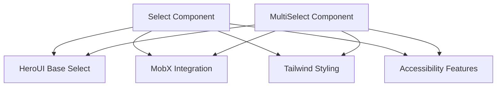
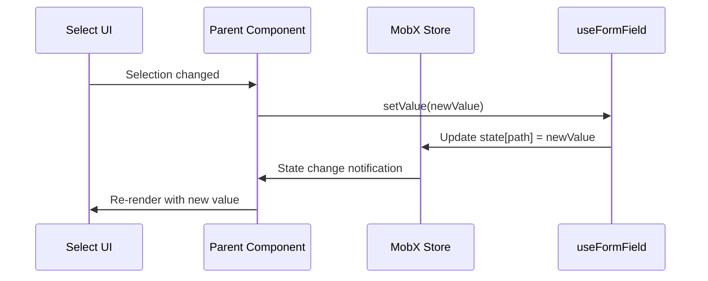
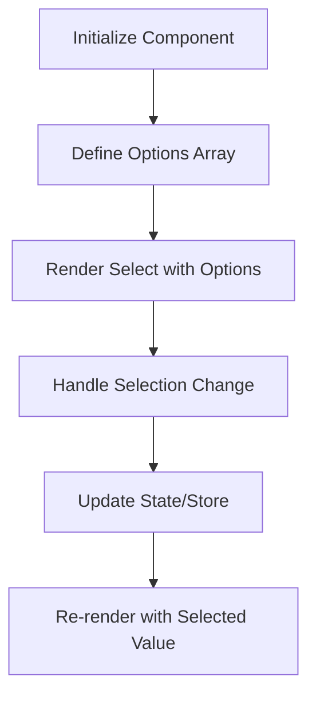

# Select Component

<cite>
**Referenced Files in This Document**   
- [Select.tsx](file://packages/ui/src/components/ui/inputs/Select/Select.tsx)
- [index.tsx](file://packages/ui/src/components/ui/inputs/Select/index.tsx)
- [MultiSelect.tsx](file://packages/ui/src/components/ui/inputs/MultiSelect/MultiSelect.tsx)
- [MultiSelect/index.tsx](file://packages/ui/src/components/ui/inputs/MultiSelect/index.tsx)
- [Select.stories.tsx](file://packages/ui/src/components/ui/inputs/Select/Select.stories.tsx)
</cite>

## Table of Contents
1. [Introduction](#introduction)
2. [Core Implementation](#core-implementation)
3. [Controlled State Management](#controlled-state-management)
4. [Styling with Tailwind CSS](#styling-with-tailwind-css)
5. [Accessibility Features](#accessibility-features)
6. [Usage Examples](#usage-examples)
7. [Form Integration and Validation](#form-integration-and-validation)
8. [Performance Optimization](#performance-optimization)
9. [Advanced Usage Patterns](#advanced-usage-patterns)
10. [Troubleshooting Guide](#troubleshooting-guide)

## Introduction
The Select component in the prj-core's shared-frontend package provides a flexible and accessible dropdown selection interface with support for single and multiple selection modes. Built on top of HeroUI components and enhanced with MobX integration, this component offers a robust solution for form inputs with various customization options and accessibility features.

## Core Implementation

The Select component is implemented as a wrapper around the HeroUI Select component, providing additional functionality and integration with the application's state management system. The implementation consists of two main files: the base Select component and a MobX-connected wrapper.

The base Select component (`Select.tsx`) extends the HeroUI Select with additional props for options management and value handling. It accepts an array of Option objects and manages the selection state through controlled component patterns. The component uses the `selectedKeys` prop to manage the currently selected value(s) and provides onChange callbacks for value updates.

For multiple selection scenarios, the package provides a dedicated MultiSelect component that sets the `selectionMode` to "multiple" and handles array-based state management. This separation allows for specialized behavior and type safety for different selection use cases.



**Diagram sources**
- [Select.tsx](file://packages/ui/src/components/ui/inputs/Select/Select.tsx)
- [MultiSelect.tsx](file://packages/ui/src/components/ui/inputs/MultiSelect/MultiSelect.tsx)

**Section sources**
- [Select.tsx](file://packages/ui/src/components/ui/inputs/Select/Select.tsx#L1-L43)
- [MultiSelect.tsx](file://packages/ui/src/components/ui/inputs/MultiSelect/MultiSelect.tsx#L1-L35)

## Controlled State Management

The Select component implements a controlled state pattern with two layers of state management. The base component accepts a `value` prop and `onChange` callback, allowing parent components to fully control the selection state.

For integration with MobX state stores, the component provides an observer wrapper that connects to MobX stores through the `useFormField` hook. This wrapper automatically synchronizes the select value with a specific path in a MobX state object, eliminating the need for manual state updates.

The state management flow follows this pattern:
1. The component reads the current value from the MobX store using `tools.get(state, path)`
2. It creates a form field context with `useFormField` for validation and change tracking
3. When a selection changes, the `handleChange` function updates the MobX store through `formField.setValue`
4. The component re-renders when the store value changes, maintaining synchronization

This approach enables both controlled and uncontrolled usage patterns while providing seamless integration with the application's global state management system.



**Diagram sources**
- [index.tsx](file://packages/ui/src/components/ui/inputs/Select/index.tsx#L14-L37)
- [Select.tsx](file://packages/ui/src/components/ui/inputs/Select/Select.tsx#L17-L24)

**Section sources**
- [index.tsx](file://packages/ui/src/components/ui/inputs/Select/index.tsx#L14-L37)
- [Select.tsx](file://packages/ui/src/components/ui/inputs/Select/Select.tsx#L17-L24)

## Styling with Tailwind CSS

The Select component leverages Tailwind CSS for styling, providing a consistent and customizable appearance across the application. The component uses the `variant="bordered"` property by default, which applies a bordered style to the select input.

Styling is implemented through a combination of HeroUI's built-in variants and custom Tailwind classes that can be passed via the `className` prop. The component supports all standard Tailwind utility classes for spacing, colors, typography, and responsive design.

The styling system allows for both global theme consistency and local customization:
- Default styles are defined in the component implementation
- Additional classes can be passed through props
- The component respects the application's color palette and spacing scale
- Responsive variants can be applied for different screen sizes

This approach ensures visual consistency while maintaining flexibility for specific use cases that require custom styling.

**Section sources**
- [Select.tsx](file://packages/ui/src/components/ui/inputs/Select/Select.tsx#L28)
- [MultiSelect.tsx](file://packages/ui/src/components/ui/inputs/MultiSelect/MultiSelect.tsx#L24)

## Accessibility Features

The Select component includes comprehensive accessibility features to ensure usability for all users, including those using assistive technologies. The component inherits accessibility features from HeroUI and enhances them with additional ARIA attributes and keyboard navigation support.

Key accessibility features include:
- Proper ARIA roles and attributes for screen reader compatibility
- Full keyboard navigation support (arrow keys, Enter, Escape)
- Focus management for improved keyboard accessibility
- Semantic HTML structure with appropriate labels and form associations

The component automatically manages ARIA attributes based on its state and props, including:
- `aria-label` and `aria-labelledby` for proper labeling
- `aria-invalid` for error states
- `aria-required` for required fields
- `aria-describedby` for helper text and error messages

Keyboard navigation follows standard web conventions:
- Arrow keys navigate through options
- Enter selects the focused option
- Escape closes the dropdown
- Typing filters options in searchable variants

These features ensure the component meets WCAG 2.1 AA standards and provides an inclusive user experience.

**Section sources**
- [Select.tsx](file://packages/ui/src/components/ui/inputs/Select/Select.tsx)
- [MultiSelect.tsx](file://packages/ui/src/components/ui/inputs/MultiSelect/MultiSelect.tsx)

## Usage Examples

### Basic Select
The basic Select component can be used for simple dropdown selections with a predefined set of options. It accepts an array of Option objects with key, value, and label properties.



### Searchable Select
For scenarios with large option sets, the component can be enhanced with searchable functionality. While not explicitly shown in the core implementation, the component's architecture supports integration with search capabilities through custom filtering and async data loading patterns.

### Multi-Select
The MultiSelect component provides support for selecting multiple values simultaneously. It manages an array of selected values and displays them as chips or a comma-separated list.

```mermaid
graph TD
A[MultiSelect Component] --> B[selectionMode="multiple"]
A --> C[selectedKeys as Set]
A --> D[Array State Management]
A --> E[Multiple Selection UI]
```

**Diagram sources**
- [MultiSelect.tsx](file://packages/ui/src/components/ui/inputs/MultiSelect/MultiSelect.tsx#L25)
- [MultiSelect/index.tsx](file://packages/ui/src/components/ui/inputs/MultiSelect/index.tsx)

**Section sources**
- [Select.tsx](file://packages/ui/src/components/ui/inputs/Select/Select.tsx)
- [MultiSelect.tsx](file://packages/ui/src/components/ui/inputs/MultiSelect/MultiSelect.tsx)

## Form Integration and Validation

The Select component integrates seamlessly with form validation systems through the `useFormField` hook. This integration provides:
- Automatic connection to form state
- Validation rule application
- Error state management
- Helper text display
- Required field handling

When used within a form context, the component automatically receives validation props and error states from the parent form. The MobX integration ensures that validation results are properly synchronized with the application state.

Error states are visually indicated through:
- Red border color
- Error icon (if configured)
- Error message display
- ARIA-invalid attribute

The component also supports custom validation rules and async validation through the underlying form field system.

**Section sources**
- [index.tsx](file://packages/ui/src/components/ui/inputs/Select/index.tsx#L23)
- [MultiSelect/index.tsx](file://packages/ui/src/components/ui/inputs/MultiSelect/index.tsx#L19)

## Performance Optimization

The Select component implements several performance optimizations to handle various use cases efficiently:

1. **Memoization**: The component uses React.memo and MobX observer patterns to prevent unnecessary re-renders when props or state haven't changed.

2. **Options Cloning**: The component uses `tools.cloneDeep(options)` to prevent mutations of the original options array, ensuring predictable rendering behavior.

3. **Virtualization**: For large datasets, the underlying HeroUI Select component supports virtualization, rendering only visible options in the dropdown.

4. **Event Delegation**: Event handlers are properly bound and optimized to prevent memory leaks and excessive re-creation.

For searchable selects with large datasets, the recommended pattern is to implement async data loading with debounced search queries to minimize API calls and improve responsiveness.

**Section sources**
- [Select.tsx](file://packages/ui/src/components/ui/inputs/Select/Select.tsx#L20)
- [index.tsx](file://packages/ui/src/components/ui/inputs/Select/index.tsx#L17)

## Advanced Usage Patterns

### Custom Option Rendering
The component supports custom option rendering through the underlying HeroUI Select component's capabilities. While the default implementation renders simple text labels, the component can be extended to support rich option content including icons, badges, or complex layouts.

### Async Data Loading
For selects that load options from APIs, the component can be integrated with async data loading patterns using React Query or similar data fetching libraries. The options prop can be dynamically updated as data becomes available.

### Complex Form State Management
The MobX integration enables the Select component to work within complex form state management scenarios, including:
- Nested form structures
- Conditional field visibility
- Cross-field validation
- Dynamic option generation based on other field values

These advanced patterns leverage the component's flexible props system and MobX observer pattern to create responsive and interactive forms.

**Section sources**
- [Select.tsx](file://packages/ui/src/components/ui/inputs/Select/Select.tsx)
- [index.tsx](file://packages/ui/src/components/ui/inputs/Select/index.tsx)

## Troubleshooting Guide

### Common Issues and Solutions

**Issue: Select value not updating in UI**
- Ensure the MobX state path is correct
- Verify the state object is observable
- Check for proper observer wrapping in parent components

**Issue: Options not displaying correctly**
- Verify option objects have proper key, value, and label properties
- Check for duplicate keys in the options array
- Ensure options array is not null or undefined

**Issue: Performance problems with large datasets**
- Implement virtualization if not already enabled
- Consider using a searchable select with async loading
- Optimize option rendering with memoization

**Issue: Accessibility problems**
- Verify ARIA attributes are properly set
- Test keyboard navigation thoroughly
- Check screen reader compatibility

**Issue: Form validation not working**
- Ensure the component is properly integrated with the form context
- Verify validation rules are correctly defined
- Check for proper error state propagation

**Section sources**
- [Select.tsx](file://packages/ui/src/components/ui/inputs/Select/Select.tsx)
- [index.tsx](file://packages/ui/src/components/ui/inputs/Select/index.tsx)
- [MultiSelect.tsx](file://packages/ui/src/components/ui/inputs/MultiSelect/MultiSelect.tsx)
- [MultiSelect/index.tsx](file://packages/ui/src/components/ui/inputs/MultiSelect/index.tsx)