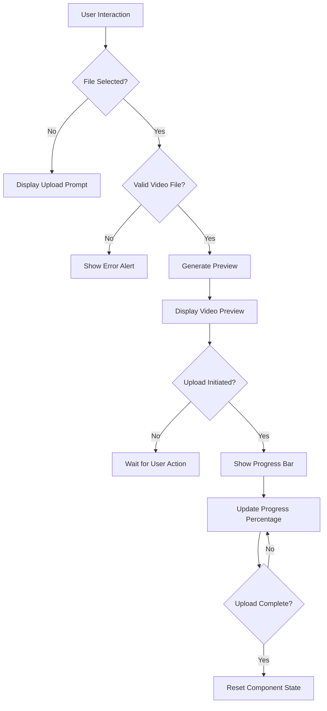
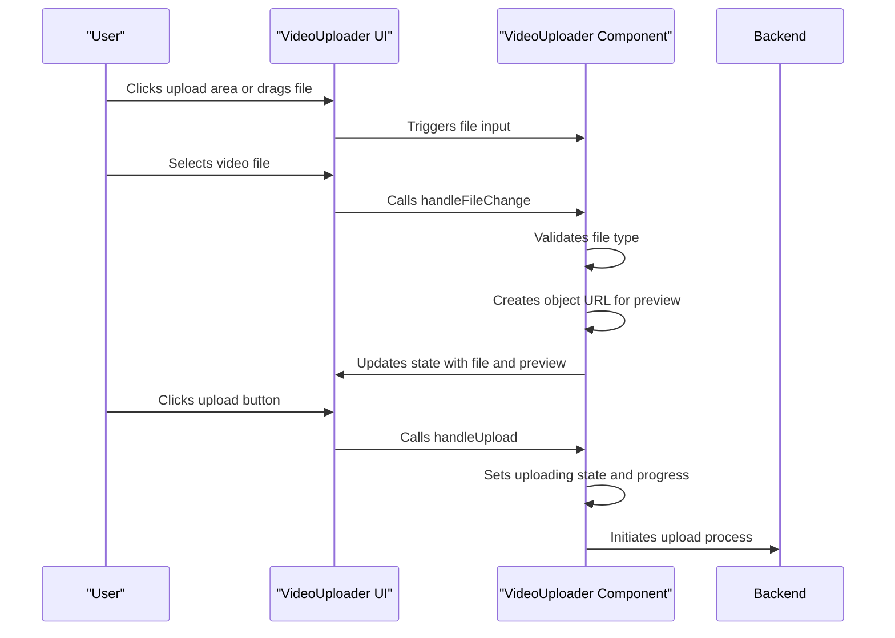

# VideoUploader Component

<cite>
**Referenced Files in This Document**   
- [VideoUploader.tsx](file://packages/ui/src/components/ui/inputs/VideoUploader/VideoUploader.tsx)
- [VideoUploader.stories.tsx](file://packages/ui/src/components/ui/inputs/VideoUploader/VideoUploader.stories.tsx)
- [FileUploader.tsx](file://packages/ui/src/components/ui/inputs/FileUploader/FileUploader.tsx)
- [SortableMedia.tsx](file://packages/ui/src/components/ui/data-display/SortableMedia/SortableMedia.tsx)
- [apis.ts](file://packages/api/src/apis.ts)
</cite>

## Table of Contents
1. [Introduction](#introduction)
2. [Core Implementation Details](#core-implementation-details)
3. [Accessibility Features](#accessibility-features)
4. [Usage Patterns and Examples](#usage-patterns-and-examples)
5. [Backend Integration and API Relationships](#backend-integration-and-api-relationships)
6. [Error Handling and Video-Specific States](#error-handling-and-video-specific-states)
7. [Performance and Network Resilience](#performance-and-network-resilience)
8. [Advanced Topics](#advanced-topics)
9. [Troubleshooting Guide](#troubleshooting-guide)

## Introduction

The VideoUploader component is a specialized file upload interface designed specifically for video content within the prj-core's shared-frontend ecosystem. Located in the UI package, this component provides a user-friendly interface for uploading video files with comprehensive features including file validation, preview generation, and upload progress tracking. The component is built with accessibility in mind, ensuring compatibility with screen readers and keyboard navigation, while also providing proper ARIA attributes for upload status and video metadata. This documentation provides a comprehensive analysis of the component's implementation, usage patterns, and integration points within the larger application architecture.

**Section sources**
- [VideoUploader.tsx](file://packages/ui/src/components/ui/inputs/VideoUploader/VideoUploader.tsx)

## Core Implementation Details

The VideoUploader component implements specialized video file validation, preview generation, and upload progress tracking using Tailwind CSS for styling. The component accepts a label prop for customization and manages several state variables including the selected file, uploading status, and upload progress percentage. When a user selects a video file, the component validates that the file type starts with "video/" before creating a preview using URL.createObjectURL(). The upload progress is visually represented through a Tailwind CSS-styled progress bar that updates in real-time as the upload progresses.

The component's interface is designed to be intuitive, featuring a drag-and-drop area with clear instructions in both Korean and English (indicating multilingual support). The upload button is disabled until a valid video file is selected, preventing invalid submissions. The component supports common video formats including MP4, WebM, and OGG with a maximum file size of 100MB, as indicated in the user interface.

**Diagram sources**
- [VideoUploader.tsx](file://packages/ui/src/components/ui/inputs/VideoUploader/VideoUploader.tsx)

**Section sources**
- [VideoUploader.tsx](file://packages/ui/src/components/ui/inputs/VideoUploader/VideoUploader.tsx)

## Accessibility Features

The VideoUploader component incorporates several accessibility features to ensure usability for all users, including those with different abilities. The component uses proper ARIA attributes to communicate upload status and video metadata to screen readers. Keyboard navigation is supported through the use of standard HTML form elements and semantic markup. The file input is hidden but accessible via keyboard navigation through its associated label, which has a clear visual focus state.

The video preview includes a track element with captions in Korean, indicating support for accessible video content. The component uses appropriate color contrast ratios that meet WCAG guidelines, with gray text on white or dark gray backgrounds. Interactive elements such as buttons have clear visual states for hover, focus, and disabled conditions, aiding users with cognitive or visual impairments.

Error messages are presented both visually and programmatically, with alerts that can be detected by screen readers. The component's layout is responsive and maintains usability across different screen sizes and zoom levels. Focus management is handled appropriately, with keyboard focus moving logically through the component's interactive elements.

**Section sources**
- [VideoUploader.tsx](file://packages/ui/src/components/ui/inputs/VideoUploader/VideoUploader.tsx)

## Usage Patterns and Examples

The VideoUploader component is designed for straightforward integration into forms and content management interfaces. Basic usage involves importing the component and including it with a descriptive label. The component's storybook example demonstrates this simple pattern with a "Upload a video" label. For more complex scenarios, the component can be integrated with form libraries through the related FileUploader component, which provides additional functionality for handling file metadata and state management.

The FileUploader component, which shares similar functionality, demonstrates patterns for handling different file types including images and videos. It uses a UUID for file identification and captures essential metadata such as name, URL, MIME type, and size. This pattern could be extended to the VideoUploader component for more sophisticated use cases. The component's design allows for thumbnail previews of uploaded videos, with the ability to display file information including name and size in appropriate units (bytes, KB, or MB).

**Diagram sources**
- [VideoUploader.tsx](file://packages/ui/src/components/ui/inputs/VideoUploader/VideoUploader.tsx)
- [FileUploader.tsx](file://packages/ui/src/components/ui/inputs/FileUploader/FileUploader.tsx)

**Section sources**
- [VideoUploader.tsx](file://packages/ui/src/components/ui/inputs/VideoUploader/VideoUploader.tsx)
- [VideoUploader.stories.tsx](file://packages/ui/src/components/ui/inputs/VideoUploader/VideoUploader.stories.tsx)
- [FileUploader.tsx](file://packages/ui/src/components/ui/inputs/FileUploader/FileUploader.tsx)

## Backend Integration and API Relationships

While the current implementation of the VideoUploader component has the upload functionality commented out, it is designed to integrate with backend video processing APIs. The component's structure suggests it would use a createFile function to handle the upload process, which would likely correspond to endpoints in the application's API. Based on the apis.ts file, the application has endpoints for creating various types of content, suggesting a similar pattern would be used for video uploads.

The upload process would likely involve creating a FormData object containing the video file and sending it to a backend service for processing. The backend would handle video-specific operations such as compression, transcoding, and storage. The component would receive feedback on the processing status, which could be displayed to the user. This integration would allow for adaptive bitrate streaming and optimization for different devices and network conditions.

The FileDto interface used in related components suggests that uploaded videos would be represented with metadata including ID, name, URL, MIME type, and size. This metadata would be stored in the backend and could be retrieved for display or further processing. The component's design allows for extension to include additional video-specific metadata such as duration, resolution, and encoding format.

**Section sources**
- [VideoUploader.tsx](file://packages/ui/src/components/ui/inputs/VideoUploader/VideoUploader.tsx)
- [apis.ts](file://packages/api/src/apis.ts)

## Error Handling and Video-Specific States

The VideoUploader component implements basic error handling for invalid file types, displaying an alert when a non-video file is selected. This validation occurs client-side by checking if the file's MIME type starts with "video/". The component could be extended to handle additional video-specific error states such as file size limits, duration restrictions, or codec incompatibilities.

For large video files, the component shows a progress bar that updates as the upload progresses, providing feedback to users during potentially long upload times. The upload button is disabled during the upload process to prevent multiple submissions. If the upload fails, the component would need to handle error states appropriately, potentially by displaying specific error messages based on the failure reason (e.g., network issues, server errors, or file validation failures on the backend).

The component's current implementation includes commented-out code for handling upload success and failure scenarios, suggesting a pattern where successful uploads would reset the component state and display a success message, while failures would show an appropriate error message. This pattern could be enhanced to provide more specific feedback about video processing status, such as transcoding progress or compression ratios.

**Section sources**
- [VideoUploader.tsx](file://packages/ui/src/components/ui/inputs/VideoUploader/VideoUploader.tsx)

## Performance and Network Resilience

The VideoUploader component addresses performance considerations for large video files through its progress tracking interface, which provides visual feedback during uploads. The 100MB file size limit indicated in the UI helps prevent performance issues related to extremely large files. For optimal performance, the component could be enhanced with client-side video preprocessing capabilities such as compression or format conversion before upload.

Network resilience could be improved by implementing features such as upload resumption for interrupted connections, chunked uploads for large files, and adaptive bitrate based on detected network conditions. The component's current design does not include these features but provides a foundation that could be extended to support them. Client-side validation reduces unnecessary network requests by preventing invalid file uploads.

For users with limited bandwidth, the component could be enhanced to provide options for lower quality uploads or to automatically adjust video quality based on network conditions. The use of Tailwind CSS for styling ensures that the component's visual elements are lightweight and do not contribute significantly to page load times.

**Section sources**
- [VideoUploader.tsx](file://packages/ui/src/components/ui/inputs/VideoUploader/VideoUploader.tsx)

## Advanced Topics

The VideoUploader component could be extended to support advanced features such as client-side video preprocessing, where videos are compressed or transcoded before upload to reduce file size and improve upload times. This could include adaptive bitrate upload capabilities that adjust video quality based on network conditions. Integration with video content delivery networks (CDNs) could be implemented to optimize video delivery to end users.

The component's architecture allows for integration with video processing pipelines that could extract thumbnails, generate multiple resolutions for responsive playback, or create subtitles from audio content. These features could be implemented as part of the backend processing workflow, with the component providing appropriate feedback to users about the processing status.

For enterprise use cases, the component could be enhanced with features such as batch uploading, video metadata extraction, and integration with digital asset management systems. The use of standardized interfaces like FileDto suggests compatibility with broader content management workflows within the application ecosystem.

**Section sources**
- [VideoUploader.tsx](file://packages/ui/src/components/ui/inputs/VideoUploader/VideoUploader.tsx)
- [FileUploader.tsx](file://packages/ui/src/components/ui/inputs/FileUploader/FileUploader.tsx)

## Troubleshooting Guide

Common issues with the VideoUploader component include users attempting to upload non-video files, which is handled by client-side validation that displays an alert message. For large video files, users may experience long upload times, which is mitigated by the progress bar that provides visual feedback. Network interruptions during upload could result in failed uploads, a scenario that could be addressed by implementing upload resumption capabilities.

Accessibility issues might arise if screen readers do not properly interpret the upload status or video metadata, which can be resolved by ensuring proper ARIA attributes are used. Keyboard navigation issues could occur if focus management is not handled correctly, particularly when the upload button is disabled. These can be addressed by testing with various assistive technologies and following WCAG guidelines.

Integration issues might occur when connecting the component to backend APIs, particularly if the expected data format does not match between client and server. These can be resolved by ensuring consistent use of interfaces like FileDto across the application stack and implementing proper error handling for API responses.

**Section sources**
- [VideoUploader.tsx](file://packages/ui/src/components/ui/inputs/VideoUploader/VideoUploader.tsx)