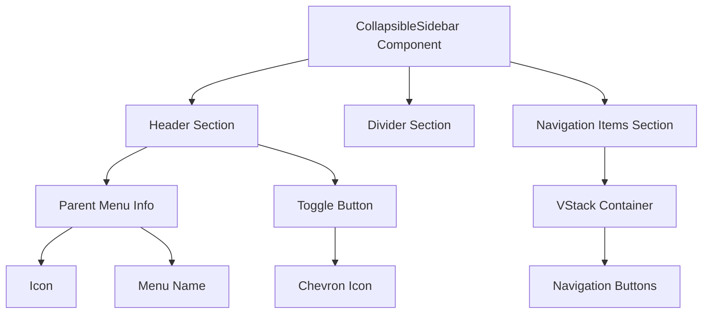
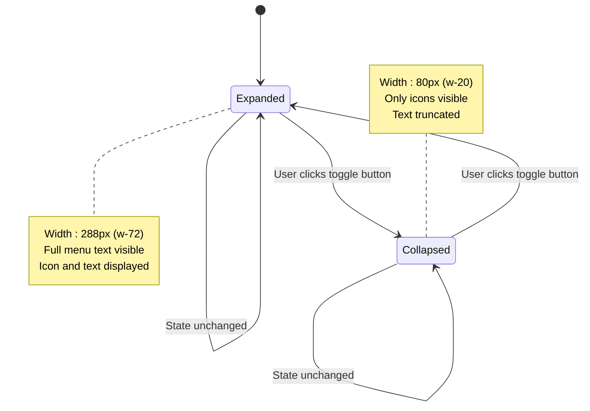
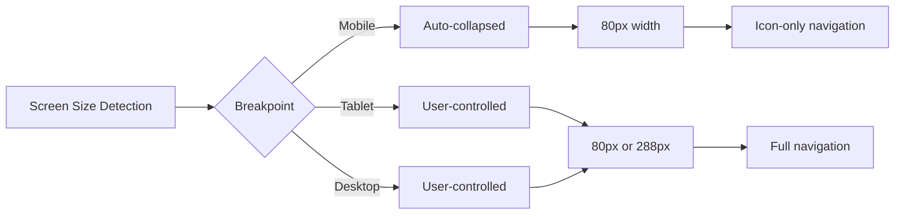
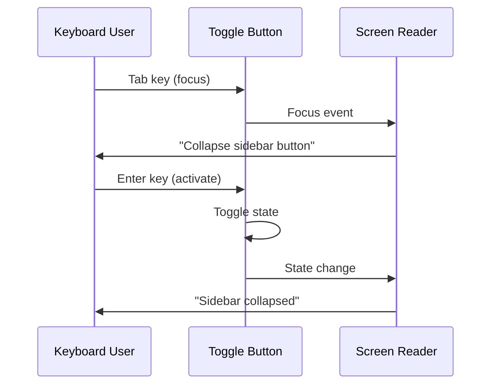
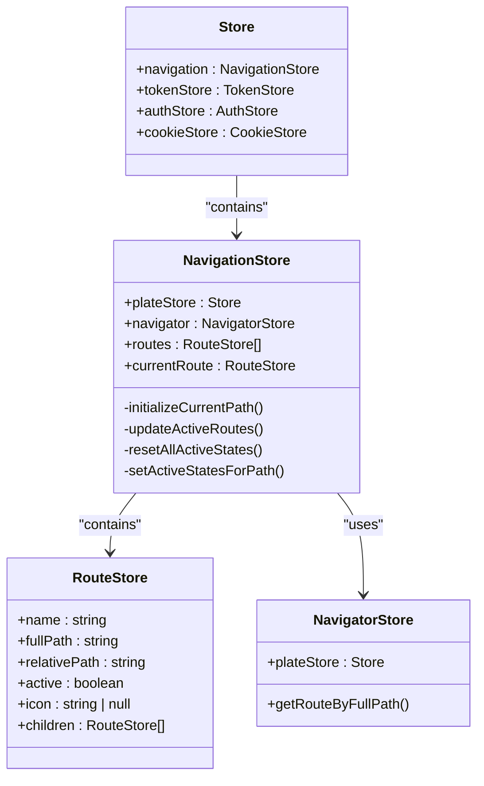
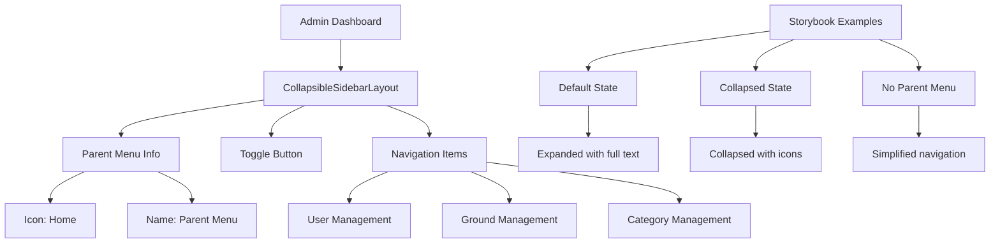
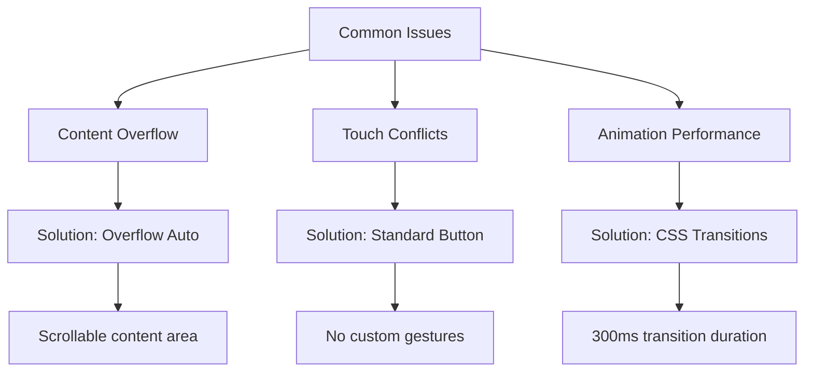
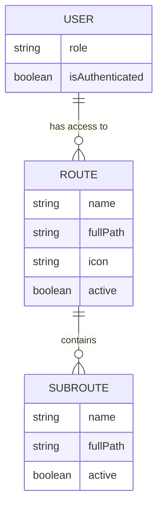

# Collapsible Sidebar Layout Component

<cite>
**Referenced Files in This Document**   
- [CollapsibleSidebarLayout.tsx](file://packages/ui/src/components/ui/layouts/CollapsibleSidebar/CollapsibleSidebarLayout.tsx)
- [CollapsibleSidebarLayout.stories.tsx](file://packages/ui/src/components/ui/layouts/CollapsibleSidebar/CollapsibleSidebarLayout.stories.tsx)
- [navigationStore.ts](file://packages/store/src/stores/navigationStore.ts)
- [navigatorStore.ts](file://packages/store/src/stores/navigatorStore.ts)
- [routeStore.ts](file://packages/store/src/stores/routeStore.ts)
- [Store.ts](file://packages/store/src/stores/Store.ts)
- [dashboard.tsx](file://apps/admin/src/routes/admin/dashboard.tsx)
- [App.tsx](file://apps/admin/src/App.tsx)
</cite>

## Table of Contents
1. [Introduction](#introduction)
2. [Core Implementation](#core-implementation)
3. [State Management](#state-management)
4. [Responsive Design](#responsive-design)
5. [Accessibility Features](#accessibility-features)
6. [Integration with Navigation Store](#integration-with-navigation-store)
7. [Usage Examples](#usage-examples)
8. [Common Issues and Solutions](#common-issues-and-solutions)
9. [Advanced Patterns](#advanced-patterns)
10. [Conclusion](#conclusion)

## Introduction
The CollapsibleSidebarLayout component is a responsive navigation container designed for dashboard interfaces in the prj-core application. This component provides a collapsible sidebar functionality that enhances user experience by allowing users to toggle between expanded and collapsed states, optimizing screen real estate. The component is implemented as a reusable UI element within the shared-frontend package, making it available across different applications in the monorepo.

The CollapsibleSidebarLayout serves as a critical navigation component in admin dashboard interfaces, providing a consistent user experience across different routes and pages. It supports both desktop and mobile devices with responsive design principles, ensuring usability across various screen sizes and input methods.

**Section sources**
- [CollapsibleSidebarLayout.tsx](file://packages/ui/src/components/ui/layouts/CollapsibleSidebar/CollapsibleSidebarLayout.tsx#L1-L82)

## Core Implementation
The CollapsibleSidebarLayout component is implemented as a React functional component with TypeScript typing. It accepts several props that define its behavior and appearance, including children elements, parent menu information, collapse state, and toggle handler.

The component's core functionality revolves around its ability to transition between collapsed and expanded states with smooth animations. The width of the sidebar changes from 80px (w-20) in the collapsed state to 288px (w-72) in the expanded state, utilizing Tailwind CSS utility classes for responsive design. The transition is animated with a 300ms duration, providing a smooth visual experience when toggling states.

The layout is structured into three main sections: a header containing parent menu information and the toggle button, an optional divider, and a scrollable content area for navigation items. The header adapts its layout based on the collapse state, centering content when collapsed and justifying between elements when expanded.

**Diagram sources**
- [CollapsibleSidebarLayout.tsx](file://packages/ui/src/components/ui/layouts/CollapsibleSidebar/CollapsibleSidebarLayout.tsx#L23-L82)

**Section sources**
- [CollapsibleSidebarLayout.tsx](file://packages/ui/src/components/ui/layouts/CollapsibleSidebar/CollapsibleSidebarLayout.tsx#L1-L82)

## State Management
The CollapsibleSidebarLayout component implements a controlled state pattern, where the collapse/expand state is managed externally rather than internally. This design decision allows parent components to control the sidebar state, enabling synchronization with other UI elements and persistence across page transitions.

The component receives two key props for state management: `isCollapsed` (boolean) and `onToggle` (function). The `isCollapsed` prop determines the current visual state of the sidebar, while the `onToggle` function is called when the user interacts with the toggle button. This separation of state and behavior follows React best practices for reusable components.

In the storybook examples, the state is managed using React's useState hook within a template component, demonstrating how the CollapsibleSidebar can be integrated into different contexts. This pattern allows for flexible state management strategies, whether using local component state, React context, or global state management solutions like MobX.

**Diagram sources**
- [CollapsibleSidebarLayout.tsx](file://packages/ui/src/components/ui/layouts/CollapsibleSidebar/CollapsibleSidebarLayout.tsx#L15-L16)
- [CollapsibleSidebarLayout.stories.tsx](file://packages/ui/src/components/ui/layouts/CollapsibleSidebar/CollapsibleSidebarLayout.stories.tsx#L20-L26)

**Section sources**
- [CollapsibleSidebarLayout.tsx](file://packages/ui/src/components/ui/layouts/CollapsibleSidebar/CollapsibleSidebarLayout.tsx#L15-L16)
- [CollapsibleSidebarLayout.stories.tsx](file://packages/ui/src/components/ui/layouts/CollapsibleSidebar/CollapsibleSidebarLayout.stories.tsx#L19-L41)

## Responsive Design
The CollapsibleSidebarLayout component implements responsive design principles to ensure optimal user experience across different device sizes. The component's width transitions are designed to work seamlessly with various screen resolutions, from mobile devices to large desktop monitors.

The responsive behavior is primarily achieved through CSS classes that control the width and layout of the sidebar. When collapsed, the sidebar maintains a narrow profile (80px) that minimizes screen space usage while still providing access to navigation through icons. When expanded, the sidebar provides ample space (288px) for displaying menu text and additional information.

The component also adapts its internal layout based on the collapse state. In the collapsed state, the header content is centered to maintain visual balance, while in the expanded state, the content is justified between the menu information and the toggle button. This adaptive layout ensures that the component remains visually appealing and functional in both states.

**Diagram sources**
- [CollapsibleSidebarLayout.tsx](file://packages/ui/src/components/ui/layouts/CollapsibleSidebar/CollapsibleSidebarLayout.tsx#L24-L25)

**Section sources**
- [CollapsibleSidebarLayout.tsx](file://packages/ui/src/components/ui/layouts/CollapsibleSidebar/CollapsibleSidebarLayout.tsx#L24-L25)

## Accessibility Features
The CollapsibleSidebarLayout component incorporates several accessibility features to ensure it is usable by all users, including those with disabilities. These features follow Web Content Accessibility Guidelines (WCAG) and ARIA (Accessible Rich Internet Applications) standards.

The toggle button includes an `aria-label` attribute that dynamically changes based on the current state, providing screen reader users with clear information about the button's function. When collapsed, the label reads "Expand sidebar", and when expanded, it reads "Collapse sidebar". This contextual information helps users understand the action that will occur when they activate the button.

Keyboard navigation is supported through standard button interactions, allowing users to focus the toggle button and activate it using the Enter or Space keys. The component does not implement custom keyboard shortcuts, relying on standard web navigation patterns to avoid conflicts with browser or assistive technology shortcuts.

Focus management is handled by the underlying Button component from the UI library, which ensures proper focus states and visual indicators. The sidebar content area is scrollable, and the VStack component manages tab order for navigation items, ensuring logical keyboard navigation through the menu options.

**Diagram sources**
- [CollapsibleSidebarLayout.tsx](file://packages/ui/src/components/ui/layouts/CollapsibleSidebar/CollapsibleSidebarLayout.tsx#L59-L60)

**Section sources**
- [CollapsibleSidebarLayout.tsx](file://packages/ui/src/components/ui/layouts/CollapsibleSidebar/CollapsibleSidebarLayout.tsx#L59-L60)

## Integration with Navigation Store
The CollapsibleSidebarLayout component integrates with the global navigation store to maintain consistent navigation state across page transitions. The navigation store, implemented with MobX, manages the application's routing state and provides a centralized location for navigation-related data.

The NavigationStore class contains a collection of RouteStore objects that represent the application's navigation structure. Each RouteStore contains information about a specific route, including its name, path, icon, and active state. The store maintains the current route and updates the active state of routes based on the current URL, ensuring that the correct navigation items are highlighted.

When a user navigates to a different page, the NavigationStore updates the currentRoute property, which triggers updates to all subscribed components, including the CollapsibleSidebarLayout. This reactive pattern ensures that the sidebar's content and state remain synchronized with the application's navigation state, even during programmatic navigation or browser history changes.

**Diagram sources**
- [navigationStore.ts](file://packages/store/src/stores/navigationStore.ts#L9-L113)
- [routeStore.ts](file://packages/store/src/stores/routeStore.ts#L3-L22)
- [navigatorStore.ts](file://packages/store/src/stores/navigatorStore.ts#L4-L30)
- [Store.ts](file://packages/store/src/stores/Store.ts#L8-L23)

**Section sources**
- [navigationStore.ts](file://packages/store/src/stores/navigationStore.ts#L9-L113)
- [routeStore.ts](file://packages/store/src/stores/routeStore.ts#L3-L22)

## Usage Examples
The CollapsibleSidebarLayout component is used in various contexts throughout the admin dashboard application. In the dashboard route, it provides navigation between different administrative functions such as user management, ground management, and category management.

The component is designed to be flexible and adaptable to different use cases. It can display parent menu information with an icon and name, or it can be used without parent information for simpler navigation scenarios. The children prop accepts any React nodes, allowing for custom navigation items beyond simple buttons.

In the storybook examples, the component demonstrates three primary usage patterns: default (expanded with parent menu), collapsed (narrow with icons only), and no parent menu (simplified navigation). These examples illustrate the component's versatility and provide guidance for developers implementing the sidebar in different contexts.

**Diagram sources**
- [dashboard.tsx](file://apps/admin/src/routes/admin/dashboard.tsx#L7-L36)
- [CollapsibleSidebarLayout.stories.tsx](file://packages/ui/src/components/ui/layouts/CollapsibleSidebar/CollapsibleSidebarLayout.stories.tsx#L43-L72)

**Section sources**
- [dashboard.tsx](file://apps/admin/src/routes/admin/dashboard.tsx#L7-L36)
- [CollapsibleSidebarLayout.stories.tsx](file://packages/ui/src/components/ui/layouts/CollapsibleSidebar/CollapsibleSidebarLayout.stories.tsx#L43-L72)

## Common Issues and Solutions
The CollapsibleSidebarLayout component addresses several common issues encountered in sidebar navigation implementations. One common issue is sidebar content overflow, which is mitigated by the component's built-in overflow handling. The navigation items section uses `overflow-y-auto` to enable scrolling when content exceeds the available space, ensuring all navigation options remain accessible.

Another common issue is touch gesture conflicts on mobile devices. The component avoids implementing custom touch gestures that might interfere with browser navigation or scrolling. Instead, it relies on standard button interactions that are universally supported across devices and platforms.

Performance optimization during collapse/expand animations is achieved through CSS transitions rather than JavaScript-based animations. The component uses Tailwind's transition utilities to animate the width change, leveraging the browser's rendering engine for smooth performance. The 300ms duration provides a noticeable but not distracting animation that enhances the user experience without causing performance issues.

**Diagram sources**
- [CollapsibleSidebarLayout.tsx](file://packages/ui/src/components/ui/layouts/CollapsibleSidebar/CollapsibleSidebarLayout.tsx#L77-L79)

**Section sources**
- [CollapsibleSidebarLayout.tsx](file://packages/ui/src/components/ui/layouts/CollapsibleSidebar/CollapsibleSidebarLayout.tsx#L77-L79)

## Advanced Patterns
The CollapsibleSidebarLayout component supports advanced patterns for complex navigation requirements. One such pattern is nested navigation, where the sidebar can display hierarchical menu structures through the RouteStore's children property. This allows for organizing related functionality into logical groups with expandable sections.

Dynamic menu generation is supported through the navigation store's reactive properties. As the application state changes, the navigation store can update the available routes, and the sidebar will automatically reflect these changes. This pattern is useful for role-based access control, where different users see different navigation options based on their permissions.

The component's design also facilitates integration with touch gesture handling for mobile devices. While the current implementation relies on standard button interactions, the architecture allows for extending the component with swipe gestures to collapse or expand the sidebar, providing a more native mobile experience.

**Diagram sources**
- [navigationStore.ts](file://packages/store/src/stores/navigationStore.ts#L12-L13)
- [routeStore.ts](file://packages/store/src/stores/routeStore.ts#L9-L21)

**Section sources**
- [navigationStore.ts](file://packages/store/src/stores/navigationStore.ts#L12-L13)
- [routeStore.ts](file://packages/store/src/stores/routeStore.ts#L9-L21)

## Conclusion
The CollapsibleSidebarLayout component is a robust and flexible navigation solution for dashboard interfaces in the prj-core application. Its implementation demonstrates thoughtful design decisions around state management, responsive behavior, and accessibility. By separating state control from the component itself, it enables integration with various state management patterns while maintaining a consistent user experience.

The component's integration with the global navigation store ensures that navigation state is preserved across page transitions and application reloads. Its responsive design adapts to different screen sizes and input methods, making it suitable for both desktop and mobile users. The accessibility features ensure that all users can effectively navigate the application, regardless of their preferred interaction method.

For developers, the component provides a clear API and well-documented usage patterns through storybook examples. The implementation follows React best practices and leverages the capabilities of the UI library and state management system to create a cohesive and maintainable solution. As the application evolves, the component's architecture allows for extension and customization to meet changing requirements.

**Section sources**
- [CollapsibleSidebarLayout.tsx](file://packages/ui/src/components/ui/layouts/CollapsibleSidebar/CollapsibleSidebarLayout.tsx#L1-L82)
- [navigationStore.ts](file://packages/store/src/stores/navigationStore.ts#L9-L113)