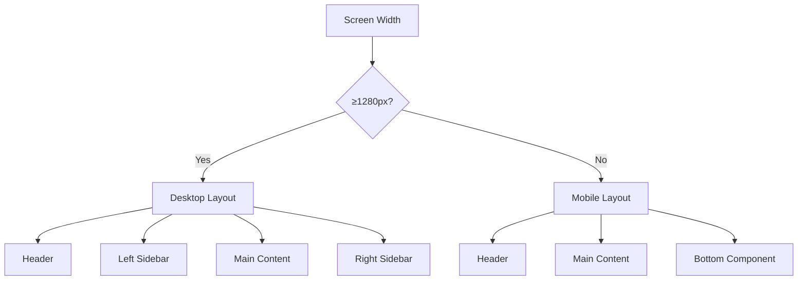
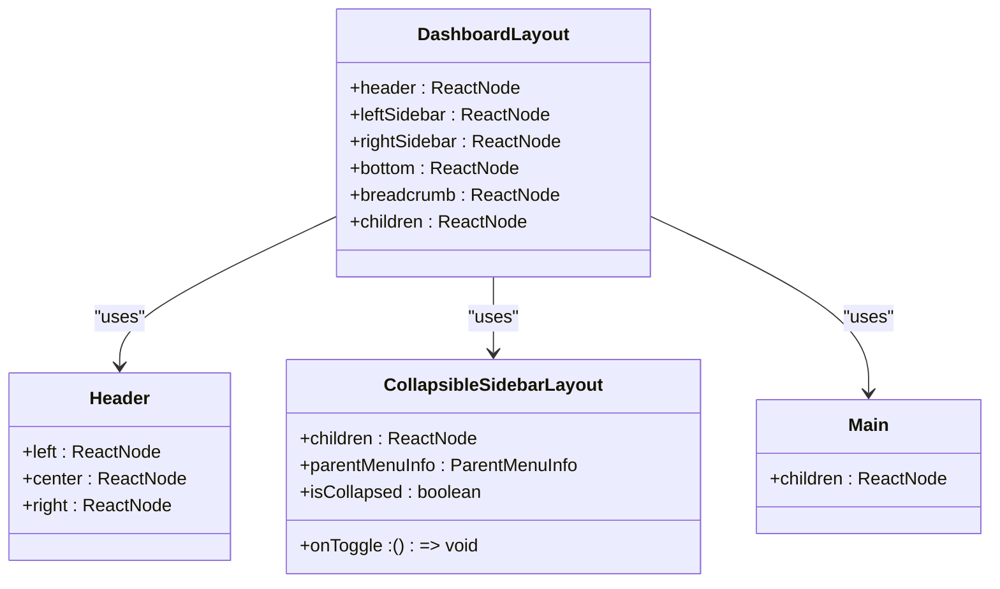
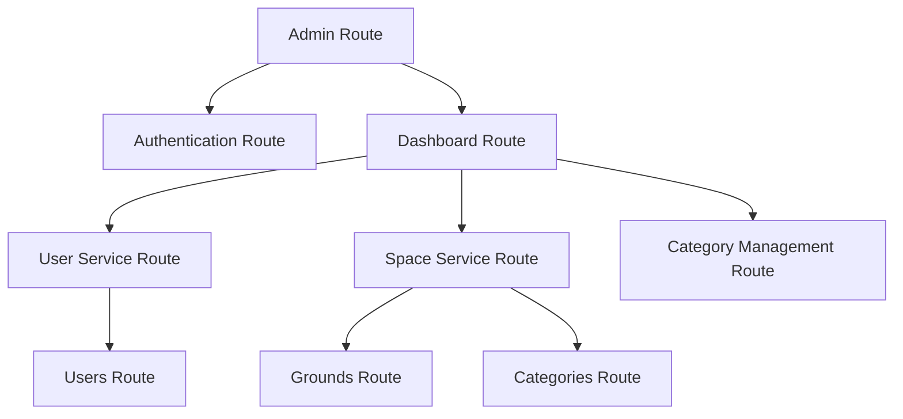
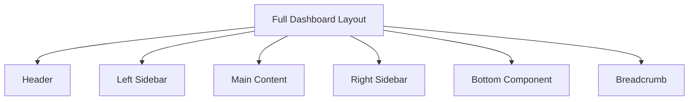

# Dashboard Layout Component

<cite>
**Referenced Files in This Document**   
- [DashboardLayout.tsx](file://packages/ui/src/components/ui/layouts/Dashboard/DashboardLayout.tsx)
- [DashboardLayout.stories.tsx](file://packages/ui/src/components/ui/layouts/Dashboard/DashboardLayout.stories.tsx)
- [README.md](file://packages/ui/src/components/ui/layouts/Dashboard/README.md)
- [Header.tsx](file://packages/ui/src/components/ui/layouts/Header/Header.tsx)
- [CollapsibleSidebarLayout.tsx](file://packages/ui/src/components/ui/layouts/CollapsibleSidebar/CollapsibleSidebarLayout.tsx)
- [Main.tsx](file://packages/ui/src/components/ui/layouts/Main/Main.tsx)
- [dashboard.tsx](file://apps/admin/src/routes/admin/dashboard.tsx)
- [index.ts](file://packages/ui/src/components/ui/layouts/index.ts)
</cite>

## Table of Contents
1. [Introduction](#introduction)
2. [Core Architecture](#core-architecture)
3. [Layout Structure and Breakpoints](#layout-structure-and-breakpoints)
4. [Component Composition](#component-composition)
5. [Accessibility Features](#accessibility-features)
6. [Responsive Behavior and Viewport Management](#responsive-behavior-and-viewport-management)
7. [Integration with Admin Dashboard Routes](#integration-with-admin-dashboard-routes)
8. [Performance Optimization and Common Issues](#performance-optimization-and-common-issues)
9. [Usage Examples and Implementation Patterns](#usage-examples-and-implementation-patterns)
10. [Conclusion](#conclusion)

## Introduction

The DashboardLayout component serves as a comprehensive container for dashboard interfaces within the prj-core's shared-frontend package. This component orchestrates the arrangement of Header, Sidebar, and Main content areas, providing a consistent and responsive user experience across various device sizes. The layout is designed to be flexible and extensible, supporting different configurations based on the specific requirements of various dashboard interfaces.

The DashboardLayout component is part of the shared-frontend package, which provides reusable UI components across multiple applications within the prj-core ecosystem. This component is specifically designed to address the common needs of dashboard interfaces, including responsive behavior, accessibility, and integration with global UI state management.

**Section sources**
- [DashboardLayout.tsx](file://packages/ui/src/components/ui/layouts/Dashboard/DashboardLayout.tsx)
- [README.md](file://packages/ui/src/components/ui/layouts/Dashboard/README.md)

## Core Architecture

The DashboardLayout component is built with a modular architecture that separates concerns and promotes reusability. The core architecture consists of several key components that work together to create a cohesive dashboard experience.

The component is defined with a clear TypeScript interface, DashboardLayoutProps, which specifies the various elements that can be composed within the layout. These include optional header, left sidebar, right sidebar, bottom component, and breadcrumb navigation, along with the required children prop for the main content area.

The implementation leverages Tailwind CSS for styling and responsive behavior, with a focus on creating a clean and modern interface. The layout uses a flexbox-based approach to arrange the various components, ensuring proper alignment and spacing across different screen sizes.

One of the key architectural decisions is the use of conditional rendering for the sidebar components. The left sidebar is always rendered when provided, while the right sidebar is hidden on smaller screens (below the xl breakpoint) and only displayed on larger screens. This approach optimizes the user experience on mobile devices by prioritizing the main content area.

**Section sources**
- [DashboardLayout.tsx](file://packages/ui/src/components/ui/layouts/Dashboard/DashboardLayout.tsx)
- [README.md](file://packages/ui/src/components/ui/layouts/Dashboard/README.md)

## Layout Structure and Breakpoints

The DashboardLayout component implements a responsive grid system that adapts to different device sizes through carefully defined breakpoints. The layout structure changes based on the screen width, providing an optimal user experience across desktop, tablet, and mobile devices.

For desktop screens (≥1280px), the component displays a full three-column layout with a header, left sidebar, main content area, and right sidebar. The left sidebar has a minimum width of 16 units, while the right sidebar is fixed at 72 units (approximately 288px). The main content area takes up the remaining space, ensuring a balanced and spacious layout.

On smaller screens (<1280px), the layout transforms into a single-column structure optimized for mobile devices. The right sidebar is hidden, and the main content area expands to fill the available width. Additionally, a bottom component can be displayed, which is specifically designed for mobile navigation or action buttons.

The breakpoints are implemented using Tailwind CSS classes, with the xl breakpoint (1280px) serving as the threshold for switching between desktop and mobile layouts. This breakpoint was chosen to accommodate a wide range of devices, including iPad Mini and other tablets.

**Diagram sources**
- [DashboardLayout.tsx](file://packages/ui/src/components/ui/layouts/Dashboard/DashboardLayout.tsx)
- [README.md](file://packages/ui/src/components/ui/layouts/Dashboard/README.md)

## Component Composition

The DashboardLayout component is designed to be composed with various other components to create a complete dashboard interface. The primary components that integrate with DashboardLayout include Header, CollapsibleSidebarLayout, and Main components.

The Header component is implemented as a separate reusable component that can be passed to DashboardLayout through the header prop. It provides a consistent navigation bar across different pages and supports left, center, and right content areas for flexible layout options.

The CollapsibleSidebarLayout component offers a collapsible sidebar functionality, allowing users to toggle between expanded and collapsed states. This component is particularly useful for dashboards with extensive navigation options, as it helps conserve screen space when needed.

The Main component serves as a container for the primary content area within the dashboard. It provides basic styling and layout options to ensure consistency across different dashboard pages.

These components are exported from the shared-frontend package and can be imported and used in various applications within the prj-core ecosystem. The composition pattern follows a modular approach, where each component has a specific responsibility and can be combined in different ways to create diverse dashboard layouts.

**Diagram sources**
- [DashboardLayout.tsx](file://packages/ui/src/components/ui/layouts/Dashboard/DashboardLayout.tsx)
- [Header.tsx](file://packages/ui/src/components/ui/layouts/Header/Header.tsx)
- [CollapsibleSidebarLayout.tsx](file://packages/ui/src/components/ui/layouts/CollapsibleSidebar/CollapsibleSidebarLayout.tsx)
- [Main.tsx](file://packages/ui/src/components/ui/layouts/Main/Main.tsx)

**Section sources**
- [DashboardLayout.tsx](file://packages/ui/src/components/ui/layouts/Dashboard/DashboardLayout.tsx)
- [Header.tsx](file://packages/ui/src/components/ui/layouts/Header/Header.tsx)
- [CollapsibleSidebarLayout.tsx](file://packages/ui/src/components/ui/layouts/CollapsibleSidebar/CollapsibleSidebarLayout.tsx)
- [Main.tsx](file://packages/ui/src/components/ui/layouts/Main/Main.tsx)

## Accessibility Features

The DashboardLayout component incorporates several accessibility features to ensure an inclusive user experience. These features are designed to support users with various disabilities and to comply with web accessibility standards.

One of the key accessibility features is the implementation of proper landmark roles, including banner for the header, navigation for the sidebars, and main for the primary content area. These roles help screen readers and other assistive technologies understand the structure of the page and navigate it more effectively.

The component also includes skip links for keyboard navigation, allowing users to bypass repetitive navigation elements and directly access the main content. This feature is particularly important for keyboard-only users and those using screen readers.

Responsive content reordering is another accessibility consideration, ensuring that the most important information is presented first on smaller screens. This helps users with cognitive disabilities or those using screen magnifiers to focus on the relevant content.

Additionally, the component uses semantic HTML elements and appropriate ARIA attributes to enhance accessibility. For example, buttons have proper labels and roles, and interactive elements have sufficient color contrast and focus indicators.

**Section sources**
- [DashboardLayout.tsx](file://packages/ui/src/components/ui/layouts/Dashboard/DashboardLayout.tsx)
- [Header.tsx](file://packages/ui/src/components/ui/layouts/Header/Header.tsx)

## Responsive Behavior and Viewport Management

The DashboardLayout component implements sophisticated responsive behavior to adapt to different viewport sizes and orientations. This responsiveness is achieved through a combination of CSS media queries, flexbox layout, and dynamic component rendering.

The component uses Tailwind CSS's responsive design system, which is based on predefined breakpoints. The primary breakpoint for the DashboardLayout is the xl breakpoint (1280px), which determines when the layout switches from a mobile-optimized single-column layout to a desktop-optimized three-column layout.

Viewport height management is a critical aspect of the component's responsive behavior, particularly on mobile devices. The layout uses a combination of vh (viewport height) units and flexbox to ensure that the content fills the available screen space without causing unwanted scrolling or layout shifts.

To address layout shift during data loading, the component implements skeleton loading states and placeholder components. These placeholders maintain the layout structure while content is being fetched, preventing sudden changes in the page layout that could disrupt the user experience.

The responsive design also considers touch targets and spacing on mobile devices, ensuring that interactive elements are large enough to be easily tapped and that there is sufficient space between elements to prevent accidental touches.

**Section sources**
- [DashboardLayout.tsx](file://packages/ui/src/components/ui/layouts/Dashboard/DashboardLayout.tsx)
- [README.md](file://packages/ui/src/components/ui/layouts/Dashboard/README.md)

## Integration with Admin Dashboard Routes

The DashboardLayout component is integrated into the admin dashboard routes, providing a consistent interface across different administrative pages. This integration is demonstrated in the admin application's route structure, where the DashboardLayout is used as the container for various dashboard sections.

In the admin dashboard, the layout is used to organize content related to user management, space management, and category management. Each of these sections is accessible through the main navigation sidebar, which is implemented as part of the DashboardLayout.

The route structure shows a clear hierarchy, with the admin route serving as the parent for both authentication and dashboard routes. The dashboard route, in turn, contains child routes for different management sections, such as user-service and space-service.

This integration pattern allows for a consistent user experience across different administrative functions while maintaining the flexibility to customize the content and navigation for each specific section.

**Diagram sources**
- [dashboard.tsx](file://apps/admin/src/routes/admin/dashboard.tsx)
- [routeTree.gen.ts](file://apps/admin/src/routeTree.gen.ts)

**Section sources**
- [dashboard.tsx](file://apps/admin/src/routes/admin/dashboard.tsx)
- [routeTree.gen.ts](file://apps/admin/src/routeTree.gen.ts)

## Performance Optimization and Common Issues

The DashboardLayout component addresses several performance considerations and common issues that arise in dashboard interfaces. These optimizations ensure a smooth and responsive user experience, particularly when dealing with complex data and dynamic content.

One of the primary performance optimizations is the implementation of lazy loading for dashboard content. This approach ensures that only the necessary components and data are loaded when a user navigates to a specific section, reducing initial load times and improving overall performance.

To address layout shift during data loading, the component uses placeholder components and skeleton screens. These placeholders maintain the layout structure while content is being fetched, preventing sudden changes in the page layout that could disrupt the user experience.

Viewport height management on mobile devices is another critical performance consideration. The component uses a combination of vh units and flexbox to ensure that the content fills the available screen space without causing unwanted scrolling or layout shifts.

Common issues such as content overflow and touch target sizing are addressed through careful CSS styling and responsive design. The component ensures that interactive elements are large enough to be easily tapped and that there is sufficient space between elements to prevent accidental touches.

Additionally, the component implements efficient rendering patterns to minimize re-renders and optimize performance. This includes using React's memoization features and avoiding unnecessary state updates.

**Section sources**
- [DashboardLayout.tsx](file://packages/ui/src/components/ui/layouts/Dashboard/DashboardLayout.tsx)
- [README.md](file://packages/ui/src/components/ui/layouts/Dashboard/README.md)

## Usage Examples and Implementation Patterns

The DashboardLayout component can be used in various ways to create different dashboard interfaces. The following examples demonstrate common implementation patterns and usage scenarios.

For a full dashboard layout with all components, the component can be used with a header, left sidebar, right sidebar, bottom component, and breadcrumb navigation. This configuration provides a comprehensive interface suitable for complex administrative dashboards.

For mobile-focused layouts, the component can be used with a header and bottom navigation component. This configuration is optimized for mobile devices and provides easy access to key navigation options.

A minimal layout can be created by using only the main content area, with the component rendering placeholder text for missing components. This approach is useful during development and for simple dashboard interfaces.

The component also supports partial layouts, where only some of the optional components are provided. For example, a layout with only a header and left sidebar can be created for dashboards that don't require a right sidebar or bottom component.

These implementation patterns demonstrate the flexibility and extensibility of the DashboardLayout component, allowing developers to create a wide range of dashboard interfaces while maintaining consistency and reusability.

**Diagram sources**
- [DashboardLayout.stories.tsx](file://packages/ui/src/components/ui/layouts/Dashboard/DashboardLayout.stories.tsx)

**Section sources**
- [DashboardLayout.stories.tsx](file://packages/ui/src/components/ui/layouts/Dashboard/DashboardLayout.stories.tsx)
- [README.md](file://packages/ui/src/components/ui/layouts/Dashboard/README.md)

## Conclusion

The DashboardLayout component in prj-core's shared-frontend package provides a robust and flexible solution for creating dashboard interfaces. Its responsive design, accessibility features, and integration with global UI state management make it a valuable tool for building consistent and user-friendly administrative interfaces.

The component's modular architecture allows for easy composition with other components, such as Header, CollapsibleSidebarLayout, and Main, enabling developers to create diverse dashboard layouts while maintaining consistency across the application.

By addressing common issues such as layout shift, viewport height management, and performance optimization, the DashboardLayout component ensures a smooth and responsive user experience across different devices and screen sizes.

The comprehensive documentation and usage examples provided with the component make it accessible to developers of all skill levels, from beginners creating simple dashboard interfaces to experienced developers building complex administrative systems.

As the prj-core ecosystem continues to evolve, the DashboardLayout component will likely play a central role in maintaining a consistent user experience across different applications and services.