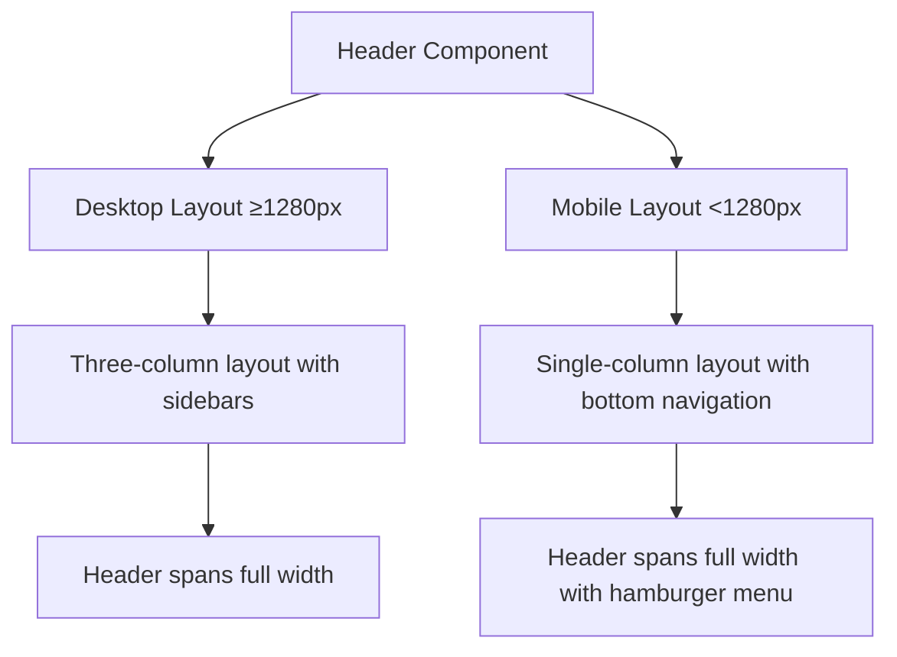
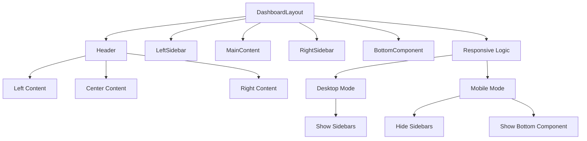
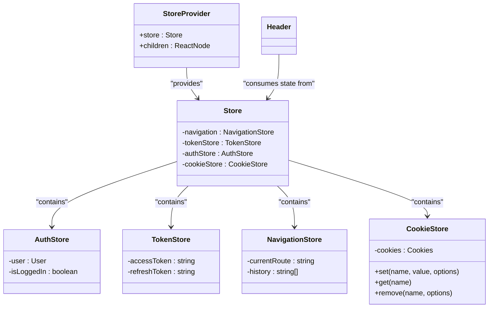
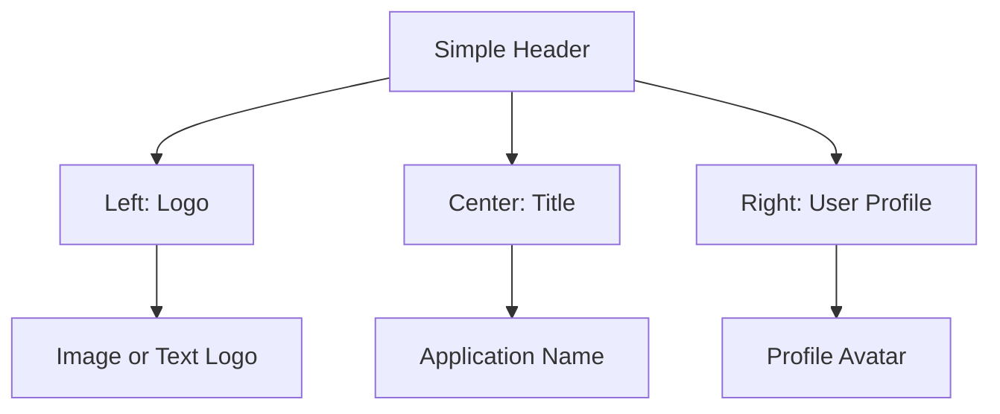
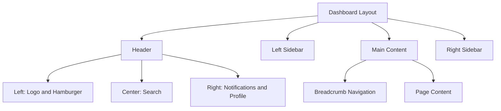

# Header Component

<cite>
**Referenced Files in This Document**   
- [Header.tsx](file://packages/ui/src/components/ui/layouts/Header/Header.tsx)
- [DashboardLayout.tsx](file://packages/ui/src/components/ui/layouts/Dashboard/DashboardLayout.tsx)
- [DashboardLayout.stories.tsx](file://packages/ui/src/components/ui/layouts/Dashboard/DashboardLayout.stories.tsx)
- [index.ts](file://packages/ui/src/components/ui/layouts/index.ts)
- [Store.ts](file://packages/store/src/stores/Store.ts)
- [cookieStore.ts](file://packages/store/src/stores/cookieStore.ts)
- [StoreProvider.tsx](file://packages/store/src/providers/StoreProvider.tsx)
</cite>

## Table of Contents
1. [Introduction](#introduction)
2. [Core Implementation](#core-implementation)
3. [Responsive Design Patterns](#responsive-design-patterns)
4. [Integration with DashboardLayout](#integration-with-dashboardlayout)
5. [Global State Integration](#global-state-integration)
6. [Accessibility Considerations](#accessibility-considerations)
7. [Common Issues and Solutions](#common-issues-and-solutions)
8. [Usage Examples](#usage-examples)
9. [Performance Optimization](#performance-optimization)

## Introduction
The Header component in the prj-core's shared-frontend package serves as a reusable navigation header that appears across different application layouts. This documentation provides a comprehensive analysis of its implementation, responsive design patterns, mobile hamburger menu functionality, and integration with global state for dynamic content rendering. The component is designed to be flexible and adaptable to various layout contexts while maintaining consistent user experience across devices.

## Core Implementation

The Header component is implemented as a functional React component that leverages the HeroUI library's Navbar components. It accepts three optional props—`left`, `center`, and `right`—which allow for flexible content placement within the header. The component uses a responsive flexbox layout to distribute content across the header space, with each section taking equal width (flex-1) to ensure balanced distribution.

The implementation uses Tailwind CSS classes for styling, including backdrop blur effects, border styling, and responsive height settings. The header has a fixed height of 4rem and uses a semi-transparent background with a backdrop blur effect to create a modern, glass-morphism aesthetic. The component is designed to be lightweight and focused on providing a clean navigation interface without imposing specific styling requirements on its children.

**Section sources**
- [Header.tsx](file://packages/ui/src/components/ui/layouts/Header/Header.tsx#L1-L37)

## Responsive Design Patterns

The Header component is designed to work seamlessly within responsive layouts, particularly when integrated with the DashboardLayout component. The responsive behavior is primarily managed by the parent DashboardLayout rather than the Header itself, allowing the Header to remain a pure presentation component.

On desktop screens (≥1280px), the header appears as part of a three-column layout with left and right sidebars. On mobile devices (<1280px), the layout transitions to a single-column format where the header occupies the full width of the screen, followed by the main content area and an optional bottom component for mobile navigation.

The header's responsive behavior is enhanced by its use of flexbox layout, which automatically adjusts the spacing and alignment of its content based on available screen width. The component does not contain media queries or device-specific logic, making it truly responsive and adaptable to any screen size.

**Diagram sources**
- [DashboardLayout.tsx](file://packages/ui/src/components/ui/layouts/Dashboard/DashboardLayout.tsx#L46-L53)
- [Header.tsx](file://packages/ui/src/components/ui/layouts/Header/Header.tsx#L14-L32)

**Section sources**
- [DashboardLayout.tsx](file://packages/ui/src/components/ui/layouts/Dashboard/DashboardLayout.tsx#L46-L53)

## Integration with DashboardLayout

The Header component is designed to work in conjunction with the DashboardLayout component, which manages the overall page structure and responsive behavior. When used within DashboardLayout, the header is passed as a prop and rendered in the designated header area.

The integration pattern allows for dynamic content rendering based on the current layout context. For example, when the layout switches to mobile mode, the DashboardLayout passes a hamburger menu button as children to the Header component, which must be rendered by the custom header implementation to maintain consistent navigation functionality.

This parent-child relationship between DashboardLayout and Header enables a clean separation of concerns, where DashboardLayout handles structural and responsive logic while Header focuses on presentation and navigation content. The integration also supports optional breadcrumb navigation above the main content area, providing additional context for users.

**Diagram sources**
- [DashboardLayout.tsx](file://packages/ui/src/components/ui/layouts/Dashboard/DashboardLayout.tsx#L16-L103)
- [Header.tsx](file://packages/ui/src/components/ui/layouts/Header/Header.tsx#L4-L8)

**Section sources**
- [DashboardLayout.tsx](file://packages/ui/src/components/ui/layouts/Dashboard/DashboardLayout.tsx#L16-L103)
- [DashboardLayout.stories.tsx](file://packages/ui/src/components/ui/layouts/Dashboard/DashboardLayout.stories.tsx#L23-L40)

## Global State Integration

The Header component integrates with global state management through the MobX-based store system implemented in the shared packages. While the Header component itself does not directly access global state, it renders content that is dynamically updated based on application state changes.

The global state integration is achieved through the StoreProvider component, which wraps the application and provides access to various store instances including AuthStore, TokenStore, and NavigationStore. These stores manage user authentication state, token information, and navigation state, respectively.

When rendering user profile information or notification badges in the header's right section, components can subscribe to the relevant store properties and automatically update when state changes occur. This reactive pattern ensures that the header content remains synchronized with the application's global state without requiring manual updates or re-renders.

**Diagram sources**
- [StoreProvider.tsx](file://packages/store/src/providers/StoreProvider.tsx#L8-L15)
- [Store.ts](file://packages/store/src/stores/Store.ts#L8-L24)
- [cookieStore.ts](file://packages/store/src/stores/cookieStore.ts#L3-L25)

**Section sources**
- [StoreProvider.tsx](file://packages/store/src/providers/StoreProvider.tsx#L8-L15)
- [Store.ts](file://packages/store/src/stores/Store.ts#L8-L24)

## Accessibility Considerations

The Header component and its integration with DashboardLayout incorporate several accessibility features to ensure an inclusive user experience. The component follows proper heading hierarchy by using appropriate HTML elements for navigation content, with the main application title typically rendered as an h1 element within the left section.

ARIA labels are implemented on navigation controls to provide meaningful descriptions for screen readers. The hamburger menu button on mobile devices includes appropriate ARIA attributes to indicate its function and current state (expanded or collapsed). Keyboard navigation is supported through standard tab ordering and focus management, allowing users to navigate through header elements using keyboard input.

The component also considers color contrast and visual focus indicators to assist users with visual impairments. The backdrop blur effect and semi-transparent background are designed to maintain sufficient contrast with text content while creating a modern visual aesthetic. Focus states are clearly visible to help keyboard users track their position within the interface.

**Section sources**
- [DashboardLayout.tsx](file://packages/ui/src/components/ui/layouts/Dashboard/DashboardLayout.tsx#L50-L53)
- [Header.tsx](file://packages/ui/src/components/ui/layouts/Header/Header.tsx#L14-L32)

## Common Issues and Solutions

Several common issues arise when implementing and using the Header component across different layouts, with corresponding solutions established in the codebase.

Header overlap with page content is addressed through the use of sticky positioning and proper z-index management. The header is given a z-index of 40 (via z-40 class) to ensure it appears above other content while allowing modals and dialogs to appear above it when necessary. This prevents the header from obscuring important content while maintaining its visibility during scrolling.

Z-index conflicts with modals are resolved by establishing a clear z-index hierarchy in the design system. Modals and dialogs are assigned higher z-index values than the header, ensuring they appear on top when activated. This is particularly important for mobile interfaces where the header's hamburger menu might otherwise be obscured by modal content.

Responsive behavior issues are mitigated through the use of Tailwind CSS's responsive breakpoints and the DashboardLayout's conditional rendering logic. The component automatically adapts to different screen sizes without requiring additional configuration, and the mobile hamburger menu is only rendered when the layout switches to mobile mode.

## Usage Examples

The Header component can be used in various contexts, from simple standalone implementations to complex dashboard layouts with multiple navigation elements.

In a basic implementation, the header can be used with minimal configuration to provide a clean navigation bar:

In more complex dashboard layouts, the header integrates with sidebars and breadcrumb navigation:

**Diagram sources**
- [DashboardLayout.stories.tsx](file://packages/ui/src/components/ui/layouts/Dashboard/DashboardLayout.stories.tsx#L23-L40)
- [DashboardLayout.stories.tsx](file://packages/ui/src/components/ui/layouts/Dashboard/DashboardLayout.stories.tsx#L42-L60)

**Section sources**
- [DashboardLayout.stories.tsx](file://packages/ui/src/components/ui/layouts/Dashboard/DashboardLayout.stories.tsx#L23-L200)

## Performance Optimization

The Header component incorporates several performance optimization techniques to ensure efficient rendering and minimal impact on application performance.

Memoization is used to prevent unnecessary re-renders of header content, particularly for dynamic elements like notification badges and user profile information. By wrapping expensive computations or frequently updated components with React.memo, the header avoids re-rendering when props have not changed.

The component also leverages the stable API of the HeroUI library, which is optimized for performance and accessibility. The use of atomic CSS classes from Tailwind CSS reduces the size of CSS bundles and improves rendering performance by minimizing style recalculations.

For applications with complex header content, code splitting can be implemented to load header-related components only when needed. This is particularly useful for features like search functionality or advanced user profile menus that may not be required on initial page load.

**Section sources**
- [Header.tsx](file://packages/ui/src/components/ui/layouts/Header/Header.tsx#L10-L34)
- [DashboardLayout.tsx](file://packages/ui/src/components/ui/layouts/Dashboard/DashboardLayout.tsx#L16-L103)