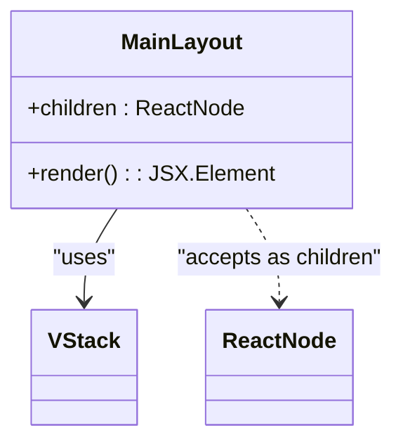
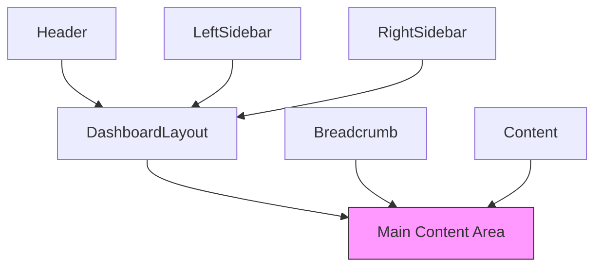
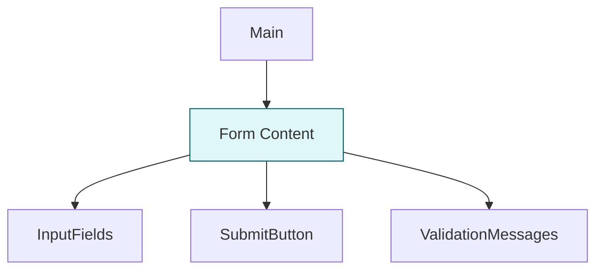
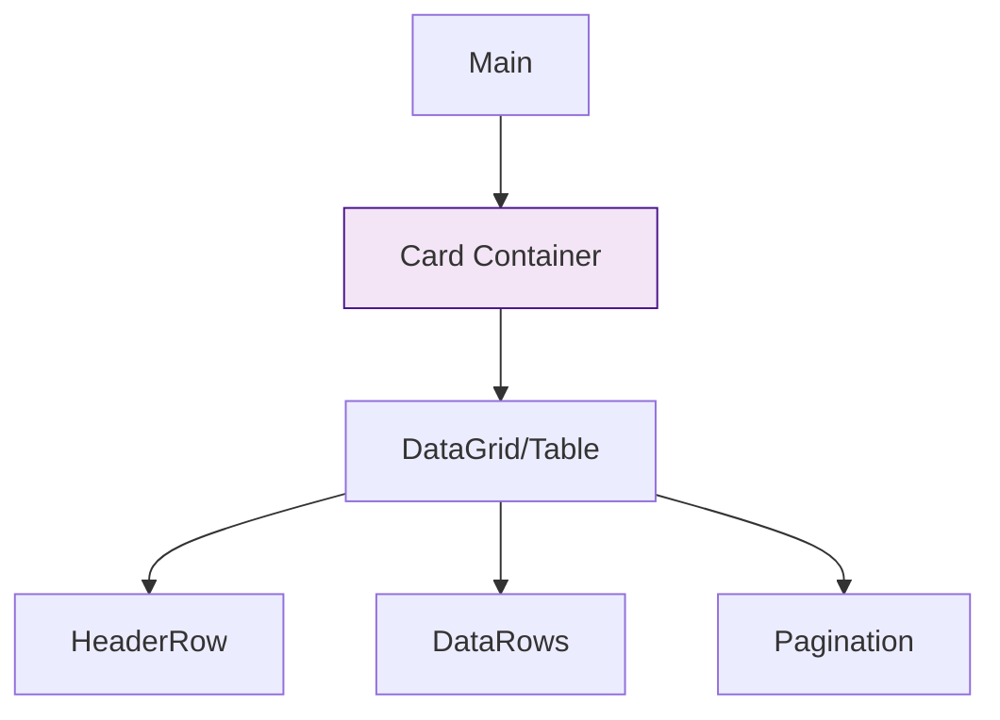
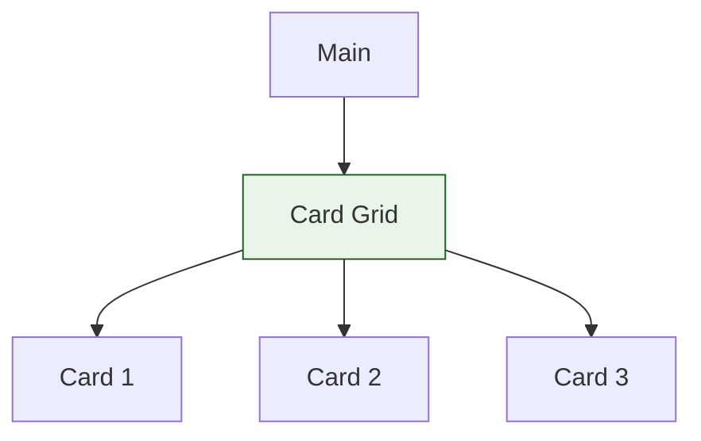
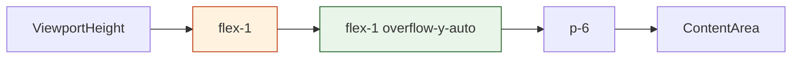

# Main Content Component

<cite>
**Referenced Files in This Document**   
- [Main.tsx](file://packages/ui/src/components/ui/layouts/Main/Main.tsx)
- [DashboardLayout.tsx](file://packages/ui/src/components/ui/layouts/Dashboard/DashboardLayout.tsx)
- [AuthLayout.tsx](file://packages/ui/src/components/ui/layouts/Auth/AuthLayout.tsx)
- [Main.stories.tsx](file://packages/ui/src/components/ui/layouts/Main/Main.stories.tsx)
</cite>

## Table of Contents
1. [Introduction](#introduction)
2. [Core Implementation](#core-implementation)
3. [Responsive Design and Layout Integration](#responsive-design-and-layout-integration)
4. [Content Type Support](#content-type-support)
5. [Accessibility Features](#accessibility-features)
6. [Common Issues and Solutions](#common-issues-and-solutions)
7. [Performance Optimization](#performance-optimization)

## Introduction
The Main component in the shared-frontend package serves as the primary content container for various application layouts. It provides a flexible, responsive foundation for displaying different types of content while maintaining consistent styling and behavior across the application. This documentation details its implementation, usage patterns, and integration with other layout components.

## Core Implementation

The Main component is implemented as a simple yet powerful layout container that wraps content with consistent styling and structure. It uses a VStack (vertical stack) layout to organize content with predefined margins and visual styling.

**Diagram sources**
- [Main.tsx](file://packages/ui/src/components/ui/layouts/Main/Main.tsx#L3-L11)

**Section sources**
- [Main.tsx](file://packages/ui/src/components/ui/layouts/Main/Main.tsx#L1-L12)

## Responsive Design and Layout Integration

The Main component integrates seamlessly with different layout contexts, adapting its behavior based on the parent container. It works in conjunction with both dashboard and authentication layouts, adjusting its presentation according to the sidebar state and screen size.

In dashboard layouts, the Main component is nested within a larger layout structure that includes header, sidebars, and breadcrumb navigation. It automatically adjusts its sizing based on the presence of sidebars and the current viewport width.

**Diagram sources**
- [DashboardLayout.tsx](file://packages/ui/src/components/ui/layouts/Dashboard/DashboardLayout.tsx#L66-L81)

The component's responsive behavior is managed through CSS classes that handle different screen sizes and layout configurations. It maintains consistent padding (p-6) and utilizes flexbox for proper height distribution within the layout.

## Content Type Support

The Main component supports various content types including forms, tables, and cards. It serves as a neutral container that preserves the integrity of different content types while providing a consistent outer structure.

For form content:

For table content:

For card-based content:

**Diagram sources**
- [Main.stories.tsx](file://packages/ui/src/components/ui/layouts/Main/Main.stories.tsx#L218-L263)

## Accessibility Features

The Main component implements proper semantic HTML structure and landmark roles to enhance accessibility. While the component itself is a div element, it participates in the overall accessibility hierarchy of the page.

The component supports screen readers through:
- Proper document structure with logical heading hierarchy
- Sufficient color contrast for text and background
- Keyboard navigation support through parent layout components
- ARIA landmark roles when used within appropriate context

When used in conjunction with the DashboardLayout, the main content area inherits accessibility features such as:
- Sticky header with proper z-index for screen reader navigation
- Consistent focus management across layout components
- Semantic grouping of related content

## Common Issues and Solutions

### Content Overflow
One common issue is content overflow when dealing with large datasets or complex layouts. The Main component addresses this through:

- Built-in vertical scrolling (overflow-y-auto)
- Flex-based height calculation that respects parent container constraints
- Proper handling of the scrollbar with "scrollbar-thin" class

### Scrolling Behavior Conflicts
Scrolling conflicts between parent containers are resolved by:
- Using "overflow-hidden" on parent flex containers
- Implementing "overflow-y-auto" only on the main content area
- Proper z-index management for sticky elements

### Responsive Height Calculations
The component handles responsive height calculations through:
- Flexbox layout with flex-1 to fill available space
- CSS classes that adapt to different viewport sizes
- Integration with parent layout's height management system

**Diagram sources**
- [DashboardLayout.tsx](file://packages/ui/src/components/ui/layouts/Dashboard/DashboardLayout.tsx#L56-L81)

## Performance Optimization

The Main component contributes to performance optimization through several patterns:

### Virtualization Support
While the Main component itself doesn't implement virtualization, it provides the proper container structure for virtualized content:

- Consistent height calculations for virtualized lists
- Proper overflow handling for scroll-based virtualization
- Integration with virtualization libraries through standard DOM interfaces

### Rendering Efficiency
The component maintains rendering efficiency by:
- Using pure functional component pattern
- Minimizing re-renders through proper props handling
- Leveraging React's built-in optimization features

### Memory Management
The simple implementation with minimal state reduces memory footprint and improves garbage collection efficiency.

**Section sources**
- [Main.tsx](file://packages/ui/src/components/ui/layouts/Main/Main.tsx)
- [DashboardLayout.tsx](file://packages/ui/src/components/ui/layouts/Dashboard/DashboardLayout.tsx)
- [AuthLayout.tsx](file://packages/ui/src/components/ui/layouts/Auth/AuthLayout.tsx)