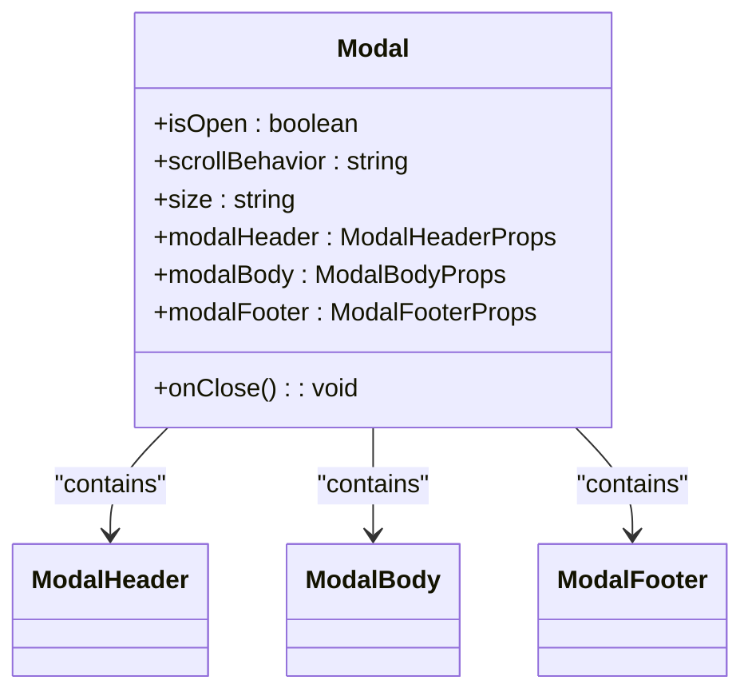
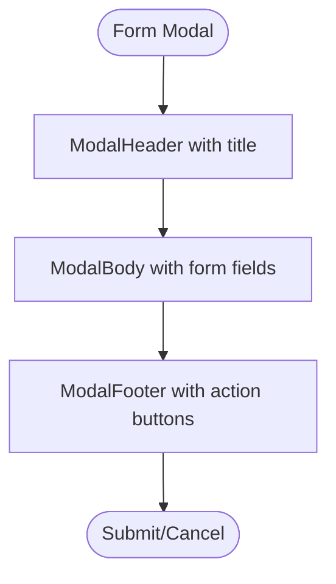
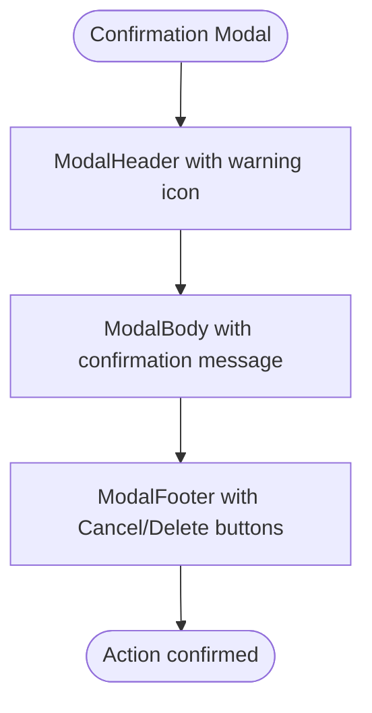
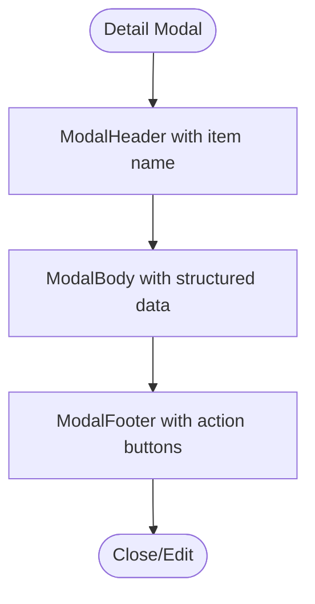

# Modal Component

<cite>
**Referenced Files in This Document**   
- [Modal.tsx](file://packages/ui/src/components/ui/layouts/Modal/Modal.tsx)
- [Modal.stories.tsx](file://packages/ui/src/components/ui/layouts/Modal/Modal.stories.tsx)
</cite>

## Table of Contents
1. [Introduction](#introduction)
2. [Core Implementation](#core-implementation)
3. [Portal Rendering and Backdrop](#portal-rendering-and-backdrop)
4. [State Management Integration](#state-management-integration)
5. [Usage Patterns](#usage-patterns)
6. [Accessibility Considerations](#accessibility-considerations)
7. [Common Issues and Solutions](#common-issues-and-solutions)
8. [Advanced Topics](#advanced-topics)
9. [Conclusion](#conclusion)

## Introduction
The Modal component in the prj-core's shared-frontend package is a reusable overlay component designed to display content above the main interface. It provides a flexible and accessible way to present forms, confirmations, detailed views, and other content that requires user attention. This document thoroughly explains its implementation, usage patterns, accessibility features, and solutions to common issues.

## Core Implementation
The Modal component is implemented as a wrapper around the `@heroui/react` Modal component, providing a consistent interface and default configuration for the application. It uses a layout-based approach with separate props for header, body, and footer content, allowing for flexible composition of modal content.

**Diagram sources**
- [Modal.tsx](file://packages/ui/src/components/ui/layouts/Modal/Modal.tsx#L1-L37)

**Section sources**
- [Modal.tsx](file://packages/ui/src/components/ui/layouts/Modal/Modal.tsx#L1-L37)

## Portal Rendering and Backdrop
The Modal component uses portal rendering to ensure that the modal is rendered at the root of the document, preventing z-index conflicts and ensuring proper stacking order. The backdrop is implemented as part of the underlying `@heroui/react` Modal component, providing a semi-transparent overlay that dims the background content and captures clicks outside the modal to close it.

The component uses the `ModalProvider` from `@heroui/react` to manage the modal context and ensure proper rendering in the React tree. The portal functionality is handled internally by the base Modal component, which renders the modal content into a separate DOM node.

**Section sources**
- [Modal.tsx](file://packages/ui/src/components/ui/layouts/Modal/Modal.tsx#L1-L37)

## State Management Integration
The Modal component integrates with global state management through the use of React context and props passed from parent components. While the Modal component itself doesn't manage state directly, it's designed to be controlled by parent components that manage the open/close state.

The component receives its open state and close handler as props from parent components, which typically manage this state using React's useState hook or through a global state management solution like MobX (as indicated in the admin app's README). This allows for centralized control of modal visibility and enables features like modal stacking and coordinated opening/closing of multiple modals.

**Section sources**
- [Modal.tsx](file://packages/ui/src/components/ui/layouts/Modal/Modal.tsx#L1-L37)
- [apps/admin/README.md](file://apps/admin/README.md#L97-L113)

## Usage Patterns
The Modal component is used for various purposes throughout the application, including forms, confirmations, and detailed views. The stories file demonstrates several usage patterns with sample content components.

### Form Modal
The form modal pattern is used for data entry and collection. It typically includes a header with a title, a body with form fields, and a footer with action buttons.

**Diagram sources**
- [Modal.stories.tsx](file://packages/ui/src/components/ui/layouts/Modal/Modal.stories.tsx#L33-L77)

### Confirmation Modal
The confirmation modal pattern is used for critical actions that require user confirmation. It includes visual indicators of the action type (e.g., warning icon) and clear action buttons.

**Diagram sources**
- [Modal.stories.tsx](file://packages/ui/src/components/ui/layouts/Modal/Modal.stories.tsx#L79-L98)

### Detail Modal
The detail modal pattern is used for displaying comprehensive information about an item. It often uses a larger size and includes structured data presentation.

**Diagram sources**
- [Modal.stories.tsx](file://packages/ui/src/components/ui/layouts/Modal/Modal.stories.tsx#L101-L209)

**Section sources**
- [Modal.stories.tsx](file://packages/ui/src/components/ui/layouts/Modal/Modal.stories.tsx#L32-L326)

## Accessibility Considerations
The Modal component implements several accessibility features to ensure it's usable by all users, including those using screen readers or keyboard navigation.

### ARIA Roles and Properties
The component uses the `role="dialog"` attribute to identify the modal as a dialog to assistive technologies. It also manages `aria-labelledby` and `aria-describedby` attributes to associate the modal with its header and description content.

### Focus Management
The Modal component implements focus trapping, ensuring that keyboard navigation remains within the modal while it's open. When the modal opens, focus is moved to the first interactive element within the modal. The component also handles the Escape key to close the modal, providing a standard keyboard interaction pattern.

### Screen Reader Announcements
The component ensures that screen readers announce the modal's opening and provide context about its purpose and how to interact with it. This is handled by the underlying `@heroui/react` Modal component, which implements proper ARIA patterns for dialogs.

**Section sources**
- [Modal.tsx](file://packages/ui/src/components/ui/layouts/Modal/Modal.tsx#L1-L37)

## Common Issues and Solutions
### Modal Stacking
When multiple modals need to be displayed simultaneously, proper stacking order and focus management are critical. The solution implemented in the application uses a modal stack managed by the parent component, ensuring that each modal is properly layered and that focus is correctly managed between stacked modals.

### Scroll Locking
The Modal component prevents background scrolling when open, ensuring that users don't accidentally scroll the underlying content. This is implemented through CSS classes applied to the body element and handled by the underlying `@heroui/react` Modal component.

### Z-Index Conflicts
To avoid z-index conflicts with other overlays, the Modal component uses a consistent z-index strategy defined in the application's design system. The portal rendering ensures that modals are rendered at a consistent level in the DOM, preventing stacking issues.

**Section sources**
- [Modal.tsx](file://packages/ui/src/components/ui/layouts/Modal/Modal.tsx#L1-L37)

## Advanced Topics
### Nested Modals
The Modal component supports nested modals through proper context management and focus handling. When a modal opens another modal, the focus trap is updated to include the new modal, and the backdrop layers are managed to provide visual feedback about the modal hierarchy.

### Animation Performance Optimization
The component uses CSS transitions and the Framer Motion library (indicated in the node_modules search results) to provide smooth animations while maintaining performance. Animations are optimized to use hardware-accelerated properties like transform and opacity to minimize layout recalculations.

### Touch Gesture Support
For mobile dismissal, the component supports touch gestures through the underlying `@heroui/react` Modal implementation. This includes swipe gestures to dismiss the modal and proper touch target sizing for mobile devices.

**Section sources**
- [Modal.tsx](file://packages/ui/src/components/ui/layouts/Modal/Modal.tsx#L1-L37)

## Conclusion
The Modal component in prj-core's shared-frontend package provides a robust, accessible, and flexible solution for displaying overlay content. Its implementation leverages the `@heroui/react` library to handle complex interactions and accessibility requirements while providing a simple interface for common use cases. The component is designed to be reusable across the application, supporting various patterns from simple alerts to complex forms and detailed views.