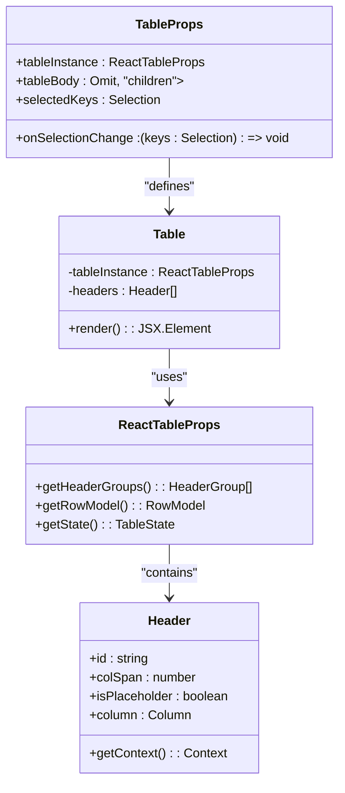
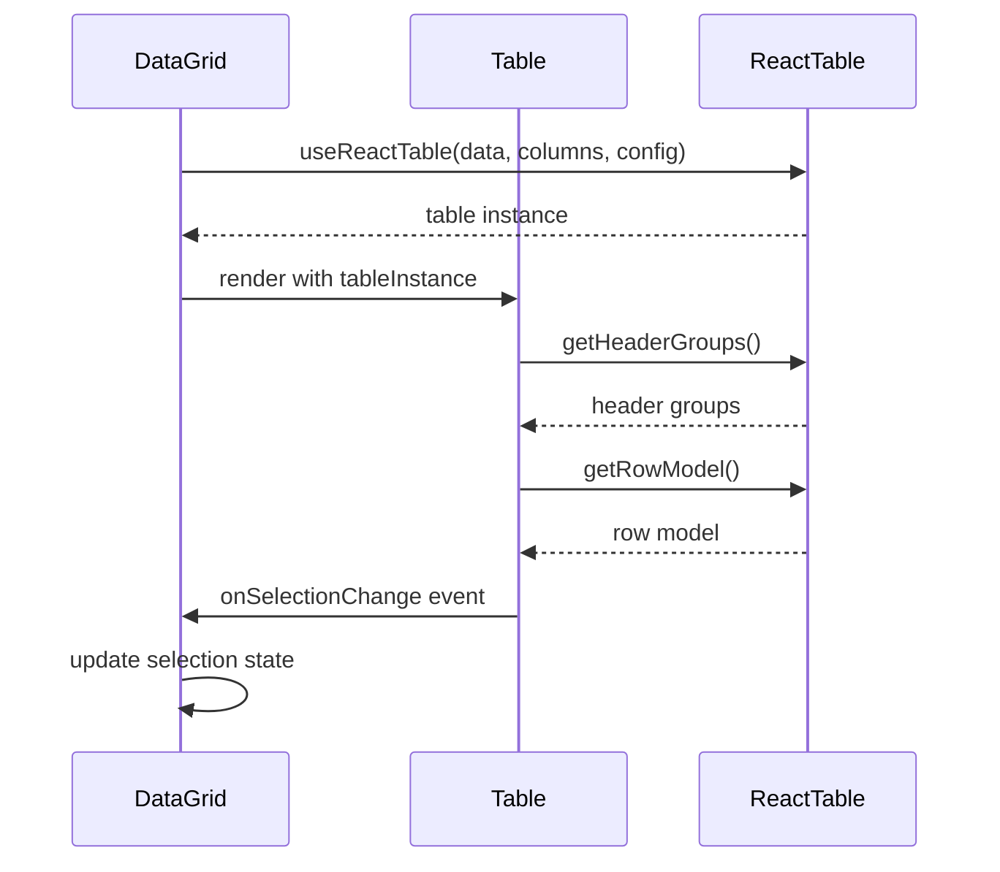
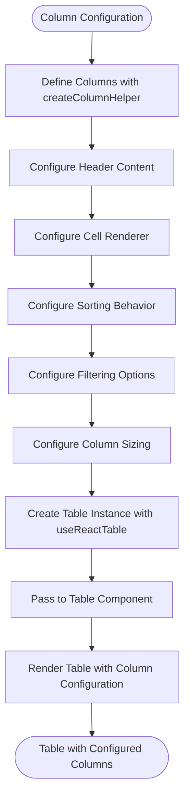
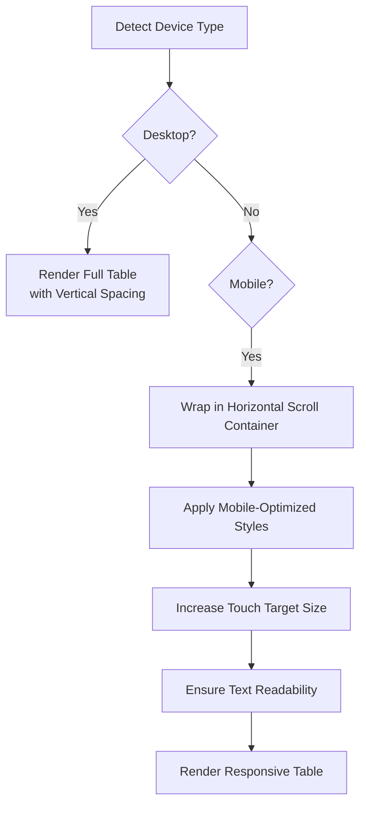
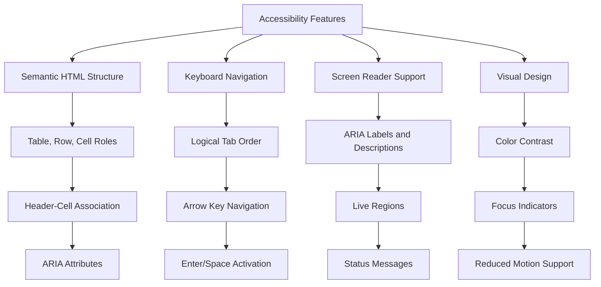
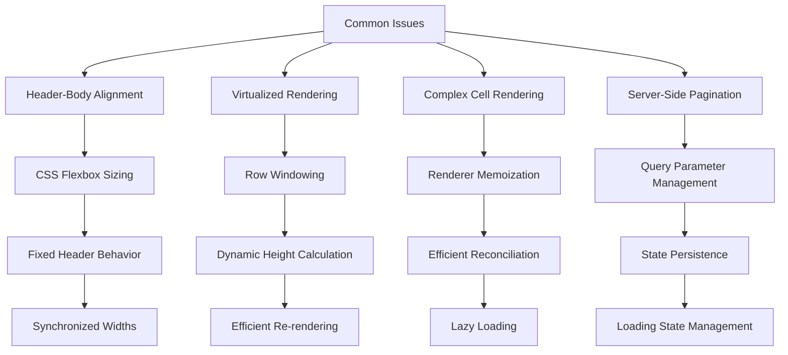
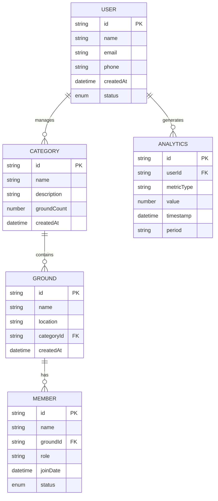

# Table Layout Component

<cite>
**Referenced Files in This Document**   
- [Table.tsx](file://packages/ui/src/components/ui/data-display/Table/Table.tsx)
- [Table.stories.tsx](file://packages/ui/src/components/ui/data-display/Table/Table.stories.tsx)
- [DataGrid.tsx](file://packages/ui/src/components/ui/data-display/DataGrid/DataGrid.tsx)
- [DataGrid.stories.tsx](file://packages/ui/src/components/ui/data-display/DataGrid/DataGrid.stories.tsx)
- [categories.tsx](file://apps/admin/src/routes/admin/dashboard/space-service/categories.tsx)
- [members.tsx](file://apps/admin/src/routes/admin/dashboard/space-service/grounds/$groundId/detail/members.tsx)
- [users.tsx](file://apps/admin/src/routes/admin/dashboard/user-service/users.tsx)
- [Pagination.tsx](file://packages/ui/src/components/ui/inputs/Pagination/Pagination.tsx)
</cite>

## Table of Contents
1. [Introduction](#introduction)
2. [Core Implementation](#core-implementation)
3. [Integration with DataGrid](#integration-with-datagrid)
4. [Column Configuration System](#column-configuration-system)
5. [Responsive Design and Mobile Behavior](#responsive-design-and-mobile-behavior)
6. [Accessibility Features](#accessibility-features)
7. [Common Issues and Solutions](#common-issues-and-solutions)
8. [Usage Examples in Admin Interfaces](#usage-examples-in-admin-interfaces)
9. [Performance Optimization](#performance-optimization)
10. [Conclusion](#conclusion)

## Introduction

The Table component in the prj-core's shared-frontend package serves as a structured layout component for displaying tabular data with comprehensive support for sorting, pagination, and responsive design. Built on top of HeroUI and @tanstack/react-table, this component provides a robust foundation for data presentation across various admin interfaces and user-facing applications.

The component is designed to handle diverse use cases, from simple data listings to complex data management interfaces requiring advanced features like server-side pagination, column resizing, and drag-and-drop column reordering. Its implementation follows a composable architecture that allows for both basic usage patterns suitable for beginners and advanced configurations for experienced developers.

The Table component is extensively used throughout the admin interface for displaying user lists, content management data, and analytics information. It integrates seamlessly with other data presentation components like DataGrid, providing a consistent user experience across different data visualization needs.

**Section sources**
- [Table.tsx](file://packages/ui/src/components/ui/data-display/Table/Table.tsx#L1-L58)
- [Table.stories.tsx](file://packages/ui/src/components/ui/data-display/Table/Table.stories.tsx#L1-L109)

## Core Implementation

The Table component is implemented as a wrapper around HeroUI's table components, leveraging @tanstack/react-table for advanced data management capabilities. The core implementation accepts a tableInstance prop that contains the React Table instance, allowing for complete control over data processing, sorting, filtering, and pagination.

The component's type definition includes TableProps<T> which extends HeroUI's TableProps while adding the tableInstance parameter and optional tableBody configuration. This design enables the component to maintain compatibility with HeroUI's styling and accessibility features while providing the flexibility of React Table's data management capabilities.

Key features of the core implementation include:
- Support for dynamic column rendering through React Table's flexRender function
- Configurable empty content display with default "데이터가 없습니다." (No data available)
- Integration with selection functionality through onSelectionChange and selectedKeys props
- Proper handling of table headers and body content alignment

The implementation follows a functional component pattern with TypeScript generics to ensure type safety across different data structures. The component extracts header groups from the table instance and renders them as TableColumn elements, while mapping row data to TableRow and TableCell components.

**Diagram sources**
- [Table.tsx](file://packages/ui/src/components/ui/data-display/Table/Table.tsx#L13-L58)

**Section sources**
- [Table.tsx](file://packages/ui/src/components/ui/data-display/Table/Table.tsx#L1-L58)

## Integration with DataGrid

The Table component serves as the foundational rendering layer for the DataGrid component, which provides enhanced functionality for data management interfaces. The DataGrid component wraps the Table component and manages the React Table instance internally, offering a higher-level API for common data grid operations.

The integration between Table and DataGrid follows a compositional pattern where DataGrid handles state management, data processing, and feature configuration, while delegating the actual rendering to the Table component. This separation of concerns allows for a clean architecture where data management logic is decoupled from presentation concerns.

Key aspects of the integration include:
- DataGrid creates and manages the React Table instance using useReactTable hook
- The table instance is passed to Table component via the tableInstance prop
- DataGrid handles expanded row state for hierarchical data display
- Selection state is managed through DataGrid's state object and passed to Table

The DataGrid component also extends the functionality of the base Table by adding support for:
- Row expansion and nested data display
- Advanced selection modes (none, single, multiple)
- Customizable empty content messages
- State persistence through MobX observables

**Diagram sources**
- [DataGrid.tsx](file://packages/ui/src/components/ui/data-display/DataGrid/DataGrid.tsx#L1-L58)
- [Table.tsx](file://packages/ui/src/components/ui/data-display/Table/Table.tsx#L1-L58)

**Section sources**
- [DataGrid.tsx](file://packages/ui/src/components/ui/data-display/DataGrid/DataGrid.tsx#L1-L58)
- [DataGrid.stories.tsx](file://packages/ui/src/components/ui/data-display/DataGrid/DataGrid.stories.tsx#L1-L248)

## Column Configuration System

The Table component implements a flexible column configuration system through its integration with @tanstack/react-table. Columns are defined using the createColumnHelper pattern, which provides type-safe column definitions with support for various rendering options.

The column configuration system supports multiple accessor patterns:
- Direct field access using accessor strings
- Function-based accessors for computed values
- Nested property access with dot notation
- Custom cell rendering with the cell property

Each column definition can specify:
- Header content (text or JSX elements)
- Cell rendering function or component
- Column sizing and alignment
- Sorting behavior and indicators
- Filtering capabilities
- Visibility control

The system also supports advanced column features such as:
- Column grouping through header nesting
- Conditional rendering based on row data
- Dynamic column visibility based on user preferences
- Column resizing through drag handles
- Column reordering via drag-and-drop

The implementation leverages React Table's columnDef structure, allowing for comprehensive control over column behavior while maintaining type safety through TypeScript generics. This enables developers to define complex column configurations with proper type checking and IDE support.

**Diagram sources**
- [DataGrid.stories.tsx](file://packages/ui/src/components/ui/data-display/DataGrid/DataGrid.stories.tsx#L58-L89)
- [Table.stories.tsx](file://packages/ui/src/components/ui/data-display/Table/Table.stories.tsx#L49-L67)

**Section sources**
- [DataGrid.stories.tsx](file://packages/ui/src/components/ui/data-display/DataGrid/DataGrid.stories.tsx#L58-L89)
- [Table.stories.tsx](file://packages/ui/src/components/ui/data-display/Table/Table.stories.tsx#L49-L67)

## Responsive Design and Mobile Behavior

The Table component implements responsive design patterns to ensure optimal user experience across different screen sizes. On mobile devices, the component automatically enables horizontal scrolling to accommodate tables with multiple columns that would otherwise overflow the viewport.

The responsive behavior is achieved through several mechanisms:
- Container-based overflow handling with overflow-x-auto
- Flexible column sizing using CSS flexbox
- Mobile-optimized touch targets for interactive elements
- Adaptive spacing and padding based on screen size

On smaller screens, the table maintains its tabular structure while allowing horizontal scrolling to access all columns. This approach preserves the data relationships visible in the table format while accommodating the limited horizontal space of mobile devices.

Key responsive features include:
- Horizontal scrolling container for overflow content
- Fixed header behavior during vertical scrolling
- Touch-friendly interactive elements with appropriate sizing
- Adaptive font sizes and spacing for readability
- Optimized rendering performance for smooth scrolling

The implementation also considers mobile-specific interactions such as:
- Swipe gestures for navigation between table pages
- Tap targets sized for finger interaction
- Loading states optimized for potentially slower mobile connections
- Data density adjustments based on device capabilities

**Diagram sources**
- [Table.stories.tsx](file://packages/ui/src/components/ui/data-display/Table/Table.stories.tsx#L39-L40)
- [TableLayout.stories.tsx](file://packages/ui/src/components/ui/layouts/Table/Table.stories.tsx#L39-L40)

**Section sources**
- [Table.stories.tsx](file://packages/ui/src/components/ui/data-display/Table/Table.stories.tsx#L39-L40)
- [TableLayout.stories.tsx](file://packages/ui/src/components/ui/layouts/Table/Table.stories.tsx#L39-L40)

## Accessibility Features

The Table component implements comprehensive accessibility features to ensure usability for all users, including those relying on assistive technologies. The implementation follows WCAG guidelines and ARIA best practices for table semantics and keyboard navigation.

Key accessibility features include:
- Proper table semantics with semantic HTML table elements
- ARIA labels for table identification and context
- Keyboard navigation support for all interactive elements
- Screen reader compatibility with appropriate ARIA attributes
- Focus management for keyboard users
- High contrast mode support
- Reduced motion preferences handling

The component ensures proper table structure with:
- Table headers properly associated with data cells
- Row and column headers with appropriate scope attributes
- Alternative text for visual elements
- Descriptive labels for interactive controls
- Programmatic access to table information

Keyboard navigation support includes:
- Tab navigation between interactive elements
- Arrow key navigation within table cells
- Enter/Space activation of controls
- Escape key to close dialogs or menus
- Shortcut keys for common actions

Screen reader compatibility is achieved through:
- ARIA labels and descriptions
- Live regions for dynamic content updates
- Proper heading hierarchy
- Landmark roles for page sections
- Status messages for user actions

**Diagram sources**
- [Table.tsx](file://packages/ui/src/components/ui/data-display/Table/Table.tsx#L48-L50)
- [categories.tsx](file://apps/admin/src/routes/admin/dashboard/space-service/categories.tsx#L49)

**Section sources**
- [Table.tsx](file://packages/ui/src/components/ui/data-display/Table/Table.tsx#L48-L50)
- [categories.tsx](file://apps/admin/src/routes/admin/dashboard/space-service/categories.tsx#L49)

## Common Issues and Solutions

The Table component addresses several common issues encountered in tabular data display through its implementation patterns and integration with supporting components.

### Table Header Alignment with Body Content

One common issue is misalignment between table headers and body content, particularly when content varies in length or when virtualized rendering is used. The component addresses this through:
- Consistent column sizing using CSS flexbox
- Fixed header behavior during scrolling
- Synchronized width calculations between header and body cells
- Proper handling of column spanning

### Virtualized Rendering for Large Datasets

For large datasets, the component integrates with React Table's row virtualization capabilities to maintain performance. This is achieved through:
- Windowing of visible rows only
- Dynamic row height calculation
- Efficient re-rendering of only changed cells
- Memory-efficient data handling

### Performance Optimization for Complex Cell Rendering

Complex cell rendering can impact performance, especially with large datasets. The component addresses this through:
- Memoization of cell renderers
- Efficient re-rendering using React's reconciliation
- Lazy loading of non-visible content
- Debounced updates for frequent data changes

### Server-Side Pagination

For datasets that are too large for client-side processing, the component supports server-side pagination through:
- Integration with the Pagination component
- Query parameter management using nuqs
- State persistence across page navigation
- Loading state management

**Diagram sources**
- [Pagination.tsx](file://packages/ui/src/components/ui/inputs/Pagination/Pagination.tsx#L1-L46)
- [Table.tsx](file://packages/ui/src/components/ui/data-display/Table/Table.tsx#L22-L24)

**Section sources**
- [Pagination.tsx](file://packages/ui/src/components/ui/inputs/Pagination/Pagination.tsx#L1-L46)
- [Table.tsx](file://packages/ui/src/components/ui/data-display/Table/Table.tsx#L22-L24)

## Usage Examples in Admin Interfaces

The Table component is extensively used throughout the admin interface for various data management tasks. Concrete examples from the codebase demonstrate its application in user management, content administration, and analytics display.

### User Management Interface

In the user management interface, the Table component displays user lists with essential information such as name, contact details, and status. The implementation includes:
- Search functionality for finding specific users
- Bulk selection capabilities
- Action buttons for user management operations
- Status indicators with visual styling

### Content Management

For content management, the component displays lists of categories, grounds, and other content types. Key features include:
- Hierarchical data display
- Inline editing capabilities
- Status visualization with color coding
- Action menus for content operations

### Analytics Data Display

In analytics interfaces, the Table component presents metrics and performance data with:
- Numeric formatting for financial and statistical data
- Trend indicators
- Time-based filtering
- Export functionality

The examples demonstrate the component's flexibility in handling different data types and presentation requirements while maintaining a consistent user experience.

**Diagram sources**
- [users.tsx](file://apps/admin/src/routes/admin/dashboard/user-service/users.tsx#L1-L43)
- [categories.tsx](file://apps/admin/src/routes/admin/dashboard/space-service/categories.tsx#L1-L75)
- [members.tsx](file://apps/admin/src/routes/admin/dashboard/space-service/grounds/$groundId/detail/members.tsx#L1-L90)

**Section sources**
- [users.tsx](file://apps/admin/src/routes/admin/dashboard/user-service/users.tsx#L1-L43)
- [categories.tsx](file://apps/admin/src/routes/admin/dashboard/space-service/categories.tsx#L1-L75)
- [members.tsx](file://apps/admin/src/routes/admin/dashboard/space-service/grounds/$groundId/detail/members.tsx#L1-L90)

## Performance Optimization

The Table component implements several performance optimization techniques to ensure smooth rendering and interaction, especially with large datasets.

### Virtualized Rendering

The component leverages React Table's virtualization capabilities to render only visible rows, significantly reducing the DOM size and improving rendering performance. This is particularly important for tables with hundreds or thousands of rows.

### Memoization and Caching

The implementation uses memoization to prevent unnecessary re-renders:
- Column definitions are memoized using useMemo
- Cell renderers are memoized to avoid recreation
- Table instance is stable across renders
- Expensive calculations are cached

### Efficient State Management

State updates are optimized to minimize re-renders:
- Batched updates for multiple changes
- Throttled updates for frequent changes
- Selective re-renders for specific cells
- Efficient diffing algorithms

### Resource Loading Optimization

The component optimizes resource loading through:
- Lazy loading of non-essential features
- Code splitting for complex functionality
- Prefetching of likely next pages
- Efficient data fetching patterns

### Memory Management

Memory usage is optimized by:
- Proper cleanup of event listeners
- Efficient data structure usage
- Timely disposal of unused resources
- Prevention of memory leaks in long-lived components

These optimizations ensure that the Table component maintains high performance even with complex data and extensive user interaction.

**Section sources**
- [DataGrid.tsx](file://packages/ui/src/components/ui/data-display/DataGrid/DataGrid.tsx#L27-L42)
- [Table.tsx](file://packages/ui/src/components/ui/data-display/Table/Table.tsx#L27-L57)

## Conclusion

The Table component in prj-core's shared-frontend package provides a comprehensive solution for displaying tabular data with support for sorting, pagination, and responsive design. Its implementation as a wrapper around HeroUI components with @tanstack/react-table integration offers both simplicity for basic use cases and extensibility for advanced requirements.

The component's architecture enables seamless integration with DataGrid and other data presentation components, creating a cohesive ecosystem for data management interfaces. The column configuration system provides flexibility in data presentation while maintaining type safety and developer experience.

Responsive design patterns ensure optimal user experience across devices, with special consideration for mobile interactions and touch targets. Accessibility features make the component usable for all users, including those relying on assistive technologies.

The implementation addresses common issues such as header-body alignment, virtualized rendering for large datasets, and performance optimization for complex cell rendering. Real-world usage in admin interfaces demonstrates its effectiveness for user management, content administration, and analytics display.

Overall, the Table component represents a robust, well-architected solution that balances developer convenience with user experience, making it a valuable asset for data-intensive applications.