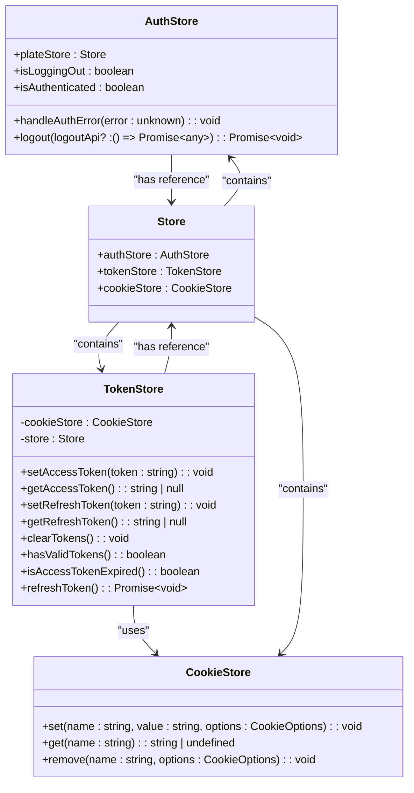
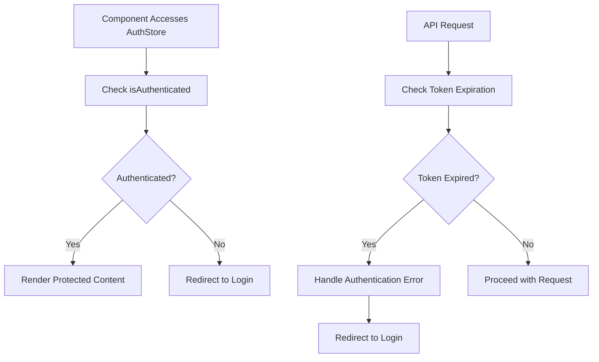
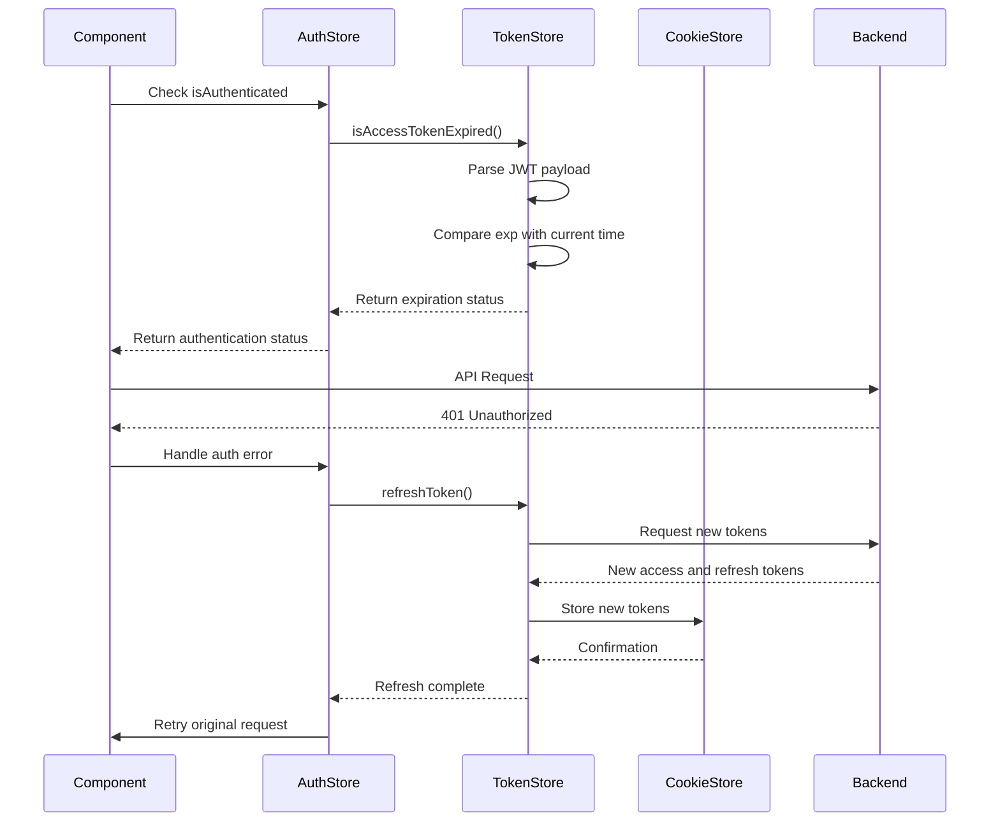
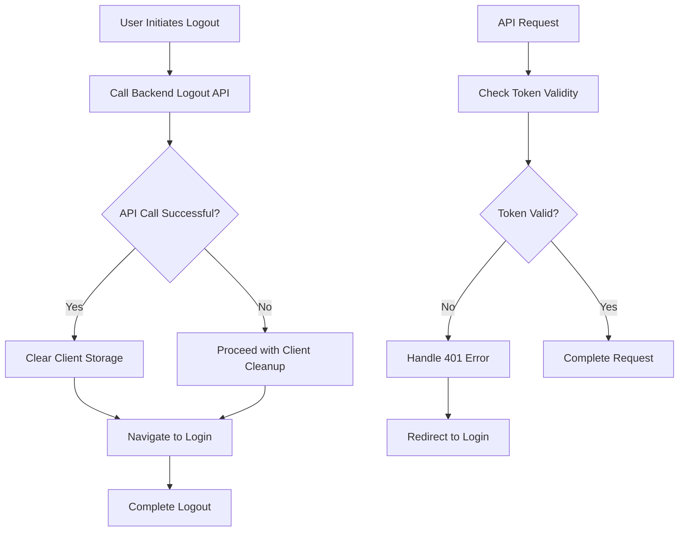
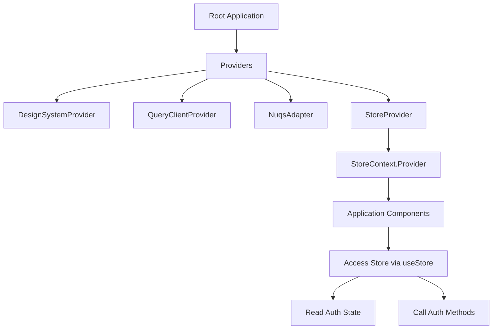

# Authentication Provider and Store

<cite>
**Referenced Files in This Document**   
- [authStore.ts](file://packages/store/src/stores/authStore.ts)
- [tokenStore.ts](file://packages/store/src/stores/tokenStore.ts)
- [StoreProvider.tsx](file://packages/store/src/providers/StoreProvider.tsx)
- [Providers.tsx](file://packages/provider/src/Providers.tsx)
- [Store.ts](file://packages/store/src/stores/Store.ts)
- [cookieStore.ts](file://packages/store/src/stores/cookieStore.ts)
</cite>

## Table of Contents
1. [Introduction](#introduction)
2. [Core Components](#core-components)
3. [Authentication State Management](#authentication-state-management)
4. [Token Management and Persistence](#token-management-and-persistence)
5. [Authentication Flow and Error Handling](#authentication-flow-and-error-handling)
6. [Provider Integration and Component Tree](#provider-integration-and-component-tree)
7. [Security Considerations](#security-considerations)
8. [Common Issues and Solutions](#common-issues-and-solutions)
9. [Conclusion](#conclusion)

## Introduction
The Authentication Provider and MobX store system in prj-core provides a comprehensive solution for managing user authentication state across the application. This system leverages MobX for reactive state management, implementing a centralized store pattern to maintain authentication state, handle token persistence, and manage session lifecycle. The architecture is designed to provide seamless integration between frontend components and backend authentication services, ensuring secure and reliable user sessions.

**Section sources**
- [authStore.ts](file://packages/store/src/stores/authStore.ts)
- [tokenStore.ts](file://packages/store/src/stores/tokenStore.ts)

## Core Components

The authentication system consists of several key components that work together to manage user authentication state:

1. **AuthStore**: Manages the authentication state and provides methods for authentication operations
2. **TokenStore**: Handles token storage, retrieval, and validation
3. **StoreProvider**: React context provider that injects the store into the component tree
4. **CookieStore**: Utility for managing cookies with security best practices

These components follow the MobX state management pattern, using observables and computed values to create a reactive system that automatically updates UI components when authentication state changes.

**Diagram sources**
- [authStore.ts](file://packages/store/src/stores/authStore.ts)
- [tokenStore.ts](file://packages/store/src/stores/tokenStore.ts)
- [cookieStore.ts](file://packages/store/src/stores/cookieStore.ts)
- [Store.ts](file://packages/store/src/stores/Store.ts)

**Section sources**
- [authStore.ts](file://packages/store/src/stores/authStore.ts#L8-L83)
- [tokenStore.ts](file://packages/store/src/stores/tokenStore.ts#L4-L66)
- [Store.ts](file://packages/store/src/stores/Store.ts)

## Authentication State Management

The AuthStore class serves as the central authority for authentication state within the application. It exposes a computed property `isAuthenticated` that determines whether the user is currently authenticated by checking if the access token has expired. This reactive property automatically updates when the underlying token state changes, triggering UI updates in components that depend on authentication status.

The store implements a clean separation of concerns, with the AuthStore focusing on authentication state and flow management while delegating token storage and validation to the TokenStore. This modular design enhances testability and maintainability. The store also includes error handling mechanisms to respond to authentication-related errors, particularly HTTP 401 Unauthorized responses, which trigger automatic redirection to the login page.

**Diagram sources**
- [authStore.ts](file://packages/store/src/stores/authStore.ts#L38-L40)
- [authStore.ts](file://packages/store/src/stores/authStore.ts#L42-L52)

**Section sources**
- [authStore.ts](file://packages/store/src/stores/authStore.ts#L8-L52)

## Token Management and Persistence

The TokenStore class implements a secure token management system that handles both access and refresh tokens. Tokens are stored in HTTP-only cookies with secure flags and strict same-site policies to mitigate cross-site scripting (XSS) and cross-site request forgery (CSRF) attacks. The store provides methods for setting, retrieving, and clearing tokens, as well as validating token expiration.

Token validation is performed by parsing the JWT access token and checking its expiration claim against the current time. This client-side validation allows for proactive token refresh before requests fail due to expired tokens. The system also includes a `hasValidTokens` method that checks for the presence of both access and refresh tokens, ensuring complete authentication state validation.

**Diagram sources**
- [tokenStore.ts](file://packages/store/src/stores/tokenStore.ts#L13-L41)
- [tokenStore.ts](file://packages/store/src/stores/tokenStore.ts#L47-L62)
- [authStore.ts](file://packages/store/src/stores/authStore.ts#L38-L40)

**Section sources**
- [tokenStore.ts](file://packages/store/src/stores/tokenStore.ts#L4-L66)

## Authentication Flow and Error Handling

The authentication system implements a robust error handling mechanism that automatically responds to authentication failures. When an API request returns a 401 Unauthorized status, the error is caught by the Axios interceptor (currently commented out but designed for implementation), which triggers the `handleAuthError` method in AuthStore. This method redirects the user to the login page, ensuring a consistent user experience when authentication fails.

The logout process is carefully orchestrated to ensure complete session termination. The `logout` method first calls the backend logout API (if provided) to clear server-side session state and HTTP-only cookies. It then clears client-side storage and navigates to the login page. The method includes error handling to ensure that even if the backend API call fails, the client-side session is still terminated and the user is redirected to the login page.

**Diagram sources**
- [authStore.ts](file://packages/store/src/stores/authStore.ts#L54-L82)
- [authStore.ts](file://packages/store/src/stores/authStore.ts#L42-L52)

**Section sources**
- [authStore.ts](file://packages/store/src/stores/authStore.ts#L54-L82)

## Provider Integration and Component Tree

The StoreProvider component implements the React Context API to make the MobX store available throughout the component tree. It creates a single instance of the Store class using useState with a function initializer, ensuring the store is only created once during the application's lifetime. This provider wraps the entire application, allowing any component to access the authentication state and methods.

The system is designed to be integrated with other providers through the Providers component, which composes multiple context providers including the DesignSystemProvider, QueryClientProvider, and NuqsAdapter. This layered provider architecture enables separation of concerns while ensuring all necessary context is available to components.

**Diagram sources**
- [StoreProvider.tsx](file://packages/store/src/providers/StoreProvider.tsx)
- [Providers.tsx](file://packages/provider/src/Providers.tsx)

**Section sources**
- [StoreProvider.tsx](file://packages/store/src/providers/StoreProvider.tsx#L8-L15)
- [Providers.tsx](file://packages/provider/src/Providers.tsx#L34-L48)

## Security Considerations

The authentication system implements several security best practices to protect user credentials and session data. Tokens are stored in HTTP-only cookies with the secure flag, preventing access via JavaScript and ensuring transmission only over HTTPS connections. The same-site strict policy further mitigates CSRF attacks by preventing the browser from sending cookies with cross-site requests.

The system also includes proactive token expiration checking, which helps prevent requests with expired tokens and enables seamless token refresh. Error handling is designed to maintain security by ensuring that authentication failures result in session termination, even if the backend API call fails during logout.

For enhanced security, the system could implement additional measures such as:
- Shorter access token expiration times
- Refresh token rotation
- Device fingerprinting
- Rate limiting for authentication endpoints
- Multi-factor authentication integration

**Section sources**
- [tokenStore.ts](file://packages/store/src/stores/tokenStore.ts#L14-L18)
- [tokenStore.ts](file://packages/store/src/stores/tokenStore.ts#L26-L31)

## Common Issues and Solutions

### Authentication State Persistence Across Page Reloads
The system maintains authentication state across page reloads through cookie-based token storage. Since tokens are stored in persistent cookies (rather than memory or sessionStorage), the authentication state survives browser refreshes. The MobX store rehydrates its state from cookies when the application initializes.

### Token Expiration Handling
The system proactively checks token expiration before making API requests. The `isAccessTokenExpired` method parses the JWT token to check its expiration claim, allowing the application to refresh tokens before they expire and prevent failed requests.

### Concurrent State Updates
The MobX-based state management system handles concurrent updates through its transactional update mechanism. When multiple state changes occur, MobX batches them into a single transaction, ensuring consistent state and preventing race conditions. The use of `makeAutoObservable` ensures that all state changes are properly tracked and observed.

### Race Conditions in Token Refresh
While the current implementation does not show the complete token refresh logic, a potential race condition could occur when multiple requests trigger token refresh simultaneously. This could be addressed by implementing a token refresh promise that is shared across all requests, ensuring only one refresh operation occurs at a time.

**Section sources**
- [tokenStore.ts](file://packages/store/src/stores/tokenStore.ts#L47-L62)
- [authStore.ts](file://packages/store/src/stores/authStore.ts#L38-L40)

## Conclusion
The Authentication Provider and MobX store system in prj-core provides a robust, secure, and maintainable solution for managing user authentication state. By leveraging MobX for reactive state management and implementing security best practices for token storage, the system ensures a seamless user experience while maintaining high security standards. The modular architecture separates concerns between authentication state management, token handling, and provider integration, making the system easy to understand, test, and extend. Future enhancements could include more sophisticated token refresh strategies, enhanced error handling, and additional security features to further strengthen the authentication system.