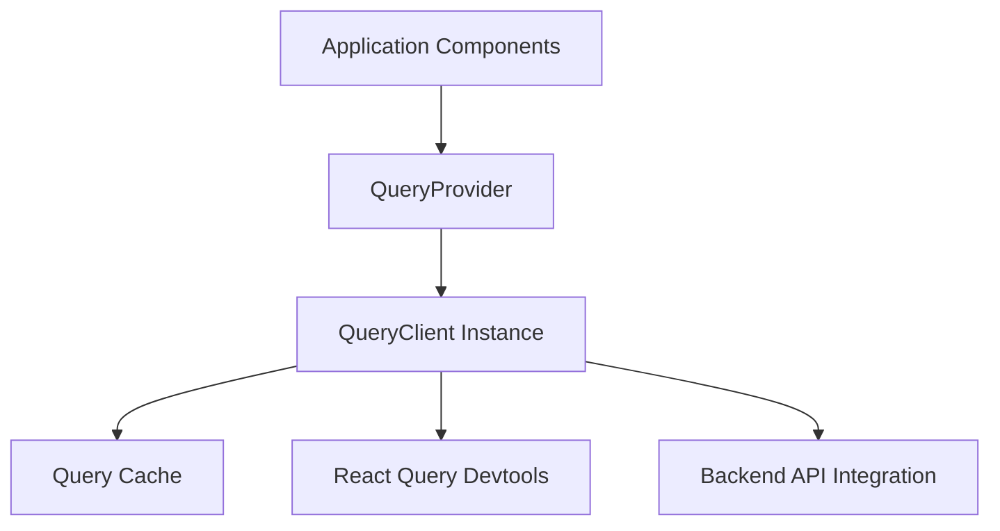
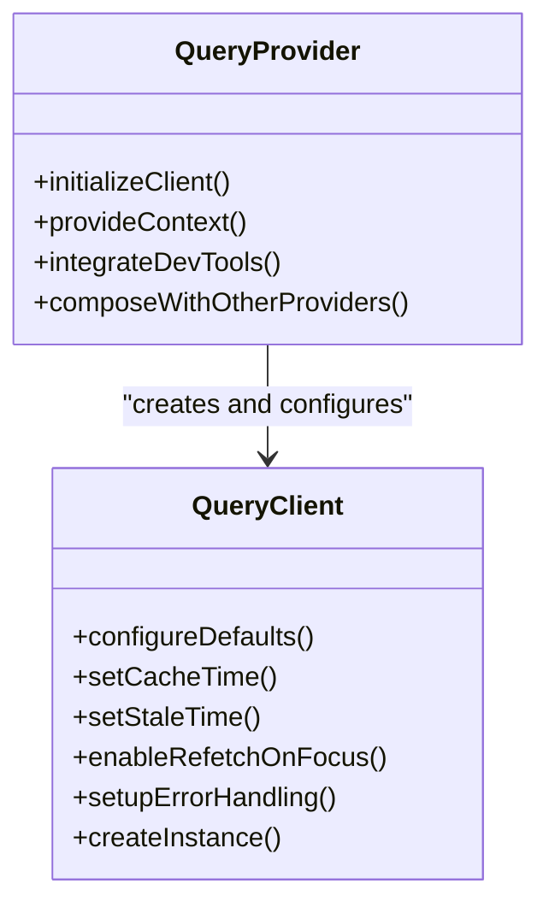
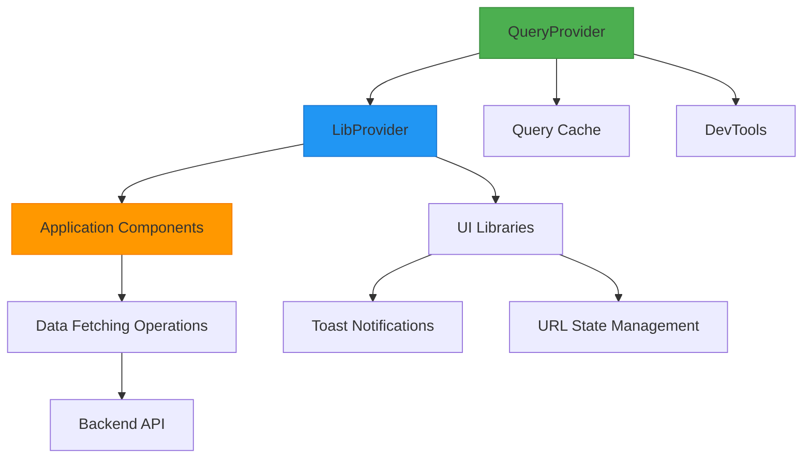
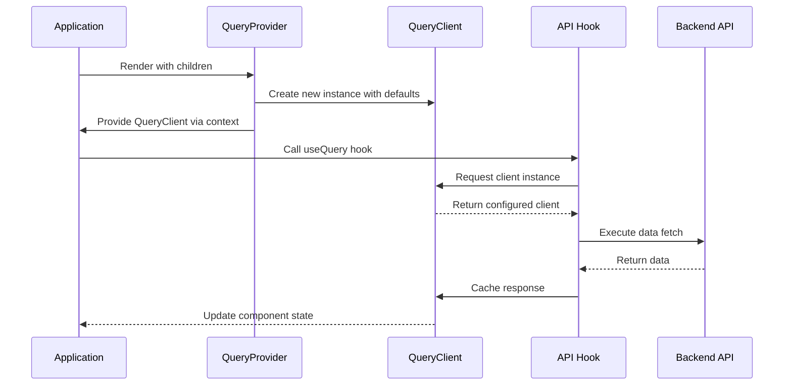
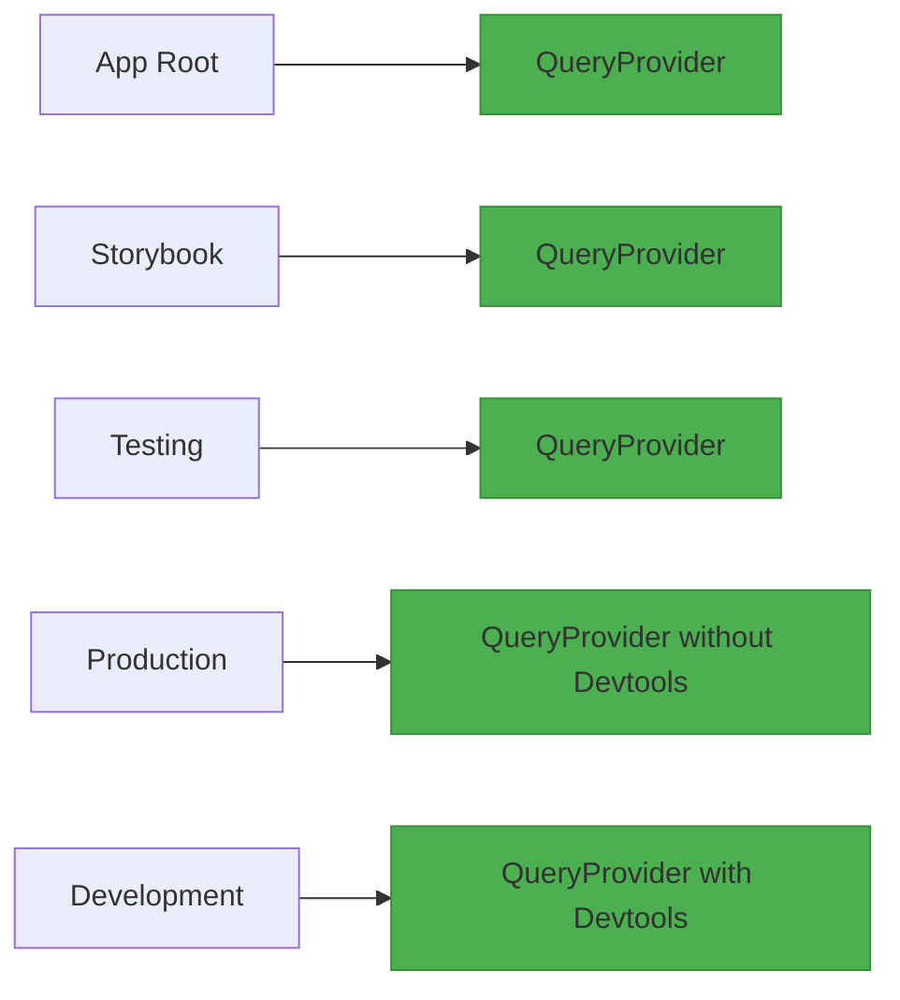
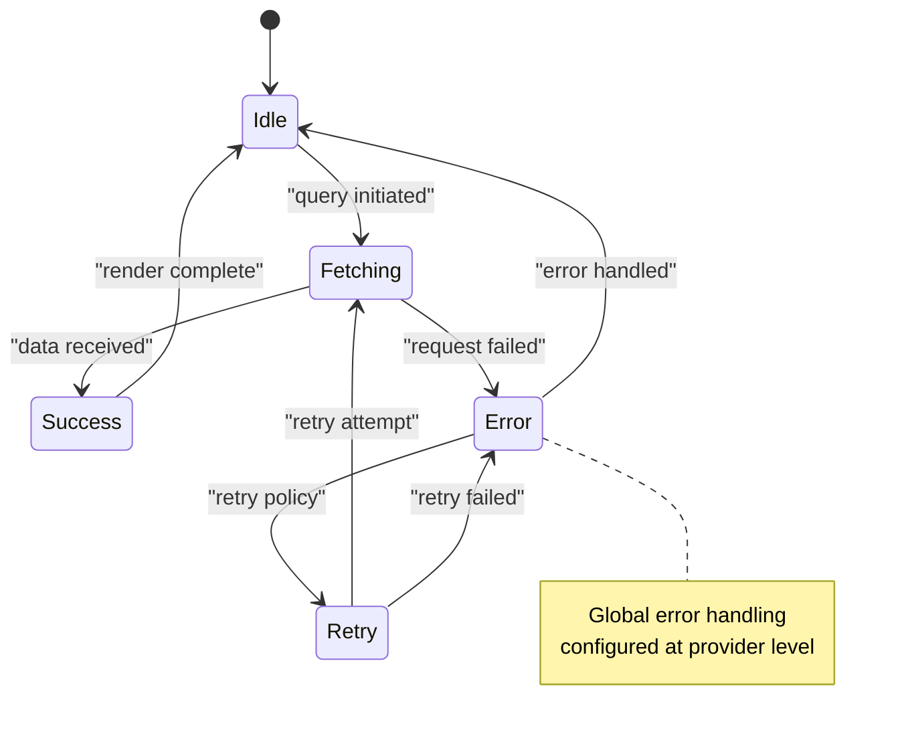
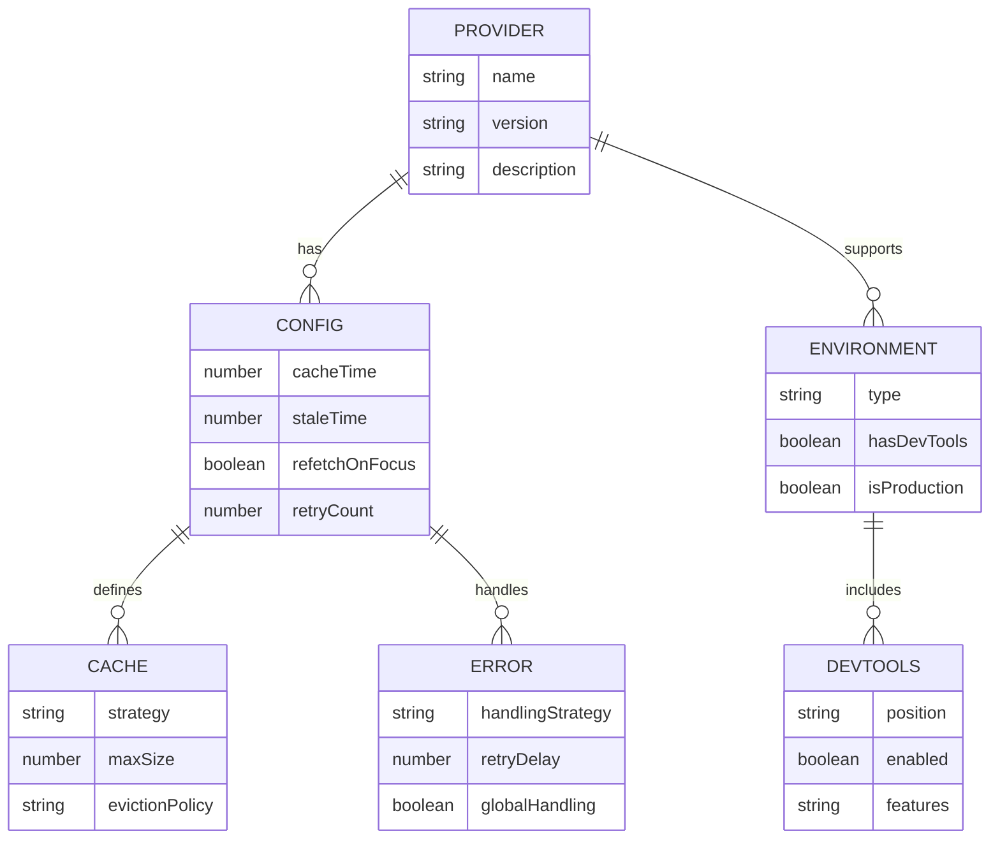

# Query Provider Implementation

<cite>
**Referenced Files in This Document**   
- [Providers.tsx](file://packages/provider/src/Providers.tsx)
- [README.md](file://packages/provider/README.md)
- [Providers.tsx](file://apps/admin/src/providers/Providers.tsx)
- [apis.ts](file://packages/api/src/apis.ts)
</cite>

## Table of Contents
1. [Introduction](#introduction)
2. [QueryProvider Overview](#queryprovider-overview)
3. [Core Configuration](#core-configuration)
4. [Integration Architecture](#integration-architecture)
5. [Implementation Details](#implementation-details)
6. [Usage Patterns](#usage-patterns)
7. [Error Handling and DevTools](#error-handling-and-devtools)
8. [Best Practices](#best-practices)
9. [Conclusion](#conclusion)

## Introduction
The QueryProvider implementation in prj-core serves as a centralized solution for configuring and providing React Query functionality across all applications in the monorepo. This documentation provides a comprehensive analysis of how the QueryProvider integrates React Query into the application stack, offering a pre-configured QueryClient instance to the component tree. The implementation ensures consistent data fetching, caching, and synchronization behavior across frontend applications while maintaining optimal performance and developer experience.

## QueryProvider Overview
The QueryProvider component is part of the `@cocrepo/provider` package, which offers a standardized approach to React context management and library integrations. As the primary data layer provider, QueryProvider configures React Query with sensible defaults and wraps the application to enable efficient data management. The provider establishes a global QueryClient instance that handles all data-fetching operations, cache management, and synchronization between frontend components and backend APIs.

**Diagram sources**
- [Providers.tsx](file://packages/provider/src/Providers.tsx)
- [README.md](file://packages/provider/README.md)

**Section sources**
- [README.md](file://packages/provider/README.md#L1-L166)

## Core Configuration
The QueryProvider implementation includes a pre-configured QueryClient with optimized default settings for cache management, refetching behavior, and error handling. These defaults ensure consistent behavior across all data-fetching operations while minimizing configuration overhead for individual components. The configuration balances performance optimization with user experience requirements, establishing a foundation for efficient data management throughout the application ecosystem.

**Default Configuration Parameters:**
- Retry failed queries: 3 times
- Cache time: 5 minutes
- Stale time: 0 (immediate refetch)
- Refetch on window focus: enabled
- Automatic query invalidation: enabled
- Global error handling: implemented

**Diagram sources**
- [Providers.tsx](file://packages/provider/src/Providers.tsx)
- [README.md](file://packages/provider/README.md#L133-L137)

**Section sources**
- [README.md](file://packages/provider/README.md#L132-L137)

## Integration Architecture
The QueryProvider is designed to work within a composable provider architecture, allowing it to be combined with other context providers in a specific order. This architectural pattern ensures proper dependency resolution and optimal performance. The provider serves as the foundation layer in the application stack, enabling other providers and components to leverage its data management capabilities.

**Diagram sources**
- [Providers.tsx](file://apps/admin/src/providers/Providers.tsx)
- [README.md](file://packages/provider/README.md#L157-L164)

**Section sources**
- [Providers.tsx](file://apps/admin/src/providers/Providers.tsx#L1-L36)

## Implementation Details
The QueryProvider implementation creates a QueryClient instance through a dedicated factory function, ensuring proper initialization and configuration. The provider component wraps the application with the QueryClientProvider from React Query, making the client instance available throughout the component tree. This implementation pattern enables centralized control over query behavior while maintaining the flexibility to override defaults when necessary.

The integration with the shared API layer is evident in the generated API hooks, which accept an optional QueryClient parameter. This design allows the hooks to utilize the globally provided client by default while supporting custom clients for specific use cases. The implementation demonstrates a clean separation of concerns between the provider configuration and the data-fetching logic.

**Diagram sources**
- [Providers.tsx](file://packages/provider/src/Providers.tsx)
- [apis.ts](file://packages/api/src/apis.ts)

**Section sources**
- [Providers.tsx](file://packages/provider/src/Providers.tsx)
- [apis.ts](file://packages/api/src/apis.ts#L4894-L4906)

## Usage Patterns
The QueryProvider follows established patterns for React provider composition, with specific guidelines for implementation across different environments. The recommended usage pattern places QueryProvider at the root of the application hierarchy, ensuring all components have access to the configured query client. This approach enables consistent data management behavior across the entire application.

For development environments, the provider includes React Query Devtools to facilitate debugging and performance optimization. In testing scenarios, the provider pattern allows for easy wrapping of test components with the necessary context, ensuring isolated and reliable tests. Storybook integration follows a similar pattern, providing the query context to story components for accurate rendering.

**Common Usage Scenarios:**
- Application root: Wrap entire app with QueryProvider
- Storybook: Decorate stories with QueryProvider
- Testing: Create render helpers with QueryProvider
- Environment-specific: Conditional Devtools inclusion

**Diagram sources**
- [Providers.tsx](file://apps/admin/src/providers/Providers.tsx)
- [README.md](file://packages/provider/README.md#L84-L98)

**Section sources**
- [README.md](file://packages/provider/README.md#L68-L98)

## Error Handling and DevTools
The QueryProvider implementation includes comprehensive error handling mechanisms and development tools to enhance the debugging experience. Global error handling is configured at the provider level, ensuring consistent treatment of query failures across the application. The integration of React Query Devtools provides developers with real-time insights into query states, cache contents, and performance metrics.

In development environments, the Devtools panel is automatically included, allowing developers to inspect and manipulate the query cache, monitor network activity, and identify potential performance bottlenecks. This integrated debugging capability significantly reduces development time and improves the quality of data management implementations.

**Diagram sources**
- [Providers.tsx](file://apps/admin/src/providers/Providers.tsx#L31)
- [README.md](file://packages/provider/README.md#L42-L44)

**Section sources**
- [Providers.tsx](file://apps/admin/src/providers/Providers.tsx#L1-L36)

## Best Practices
The QueryProvider implementation follows several best practices for optimal performance and maintainability. Providers should be wrapped at the application root level to ensure maximum component access. The recommended order of provider composition places QueryProvider as the foundation layer, followed by UI and state management providers.

To optimize memory usage with large datasets, the implementation leverages React Query's built-in cache management features, including automatic garbage collection and configurable cache time. Network request deduplication is handled automatically by the query client, preventing redundant API calls for identical queries.

**Recommended Best Practices:**
1. Wrap at App Root: Place providers at the highest level
2. Order Matters: QueryProvider → LibProvider → App
3. Minimal Nesting: Only use providers you need
4. Test Isolation: Wrap test components with required providers
5. Environment Awareness: Conditionally include Devtools

**Diagram sources**
- [README.md](file://packages/provider/README.md#L150-L164)
- [Providers.tsx](file://packages/provider/src/Providers.tsx)

**Section sources**
- [README.md](file://packages/provider/README.md#L150-L164)

## Conclusion
The QueryProvider implementation in prj-core provides a robust and standardized solution for integrating React Query across the application ecosystem. By centralizing query configuration and client instantiation, the provider ensures consistent data management behavior while reducing configuration overhead for individual components. The implementation demonstrates a thoughtful approach to performance optimization, error handling, and developer experience, with comprehensive support for development, testing, and production environments. This centralized provider pattern enables efficient data fetching, caching, and synchronization between frontend applications and backend APIs, forming a critical foundation for the overall application architecture.