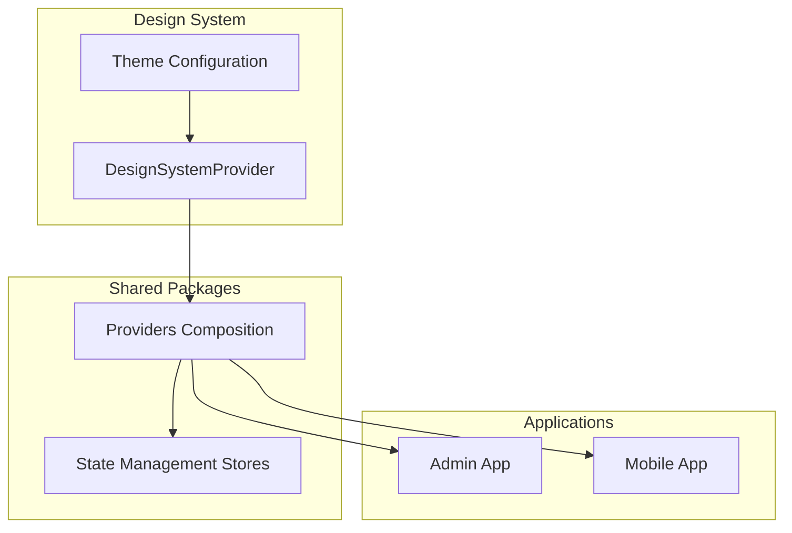
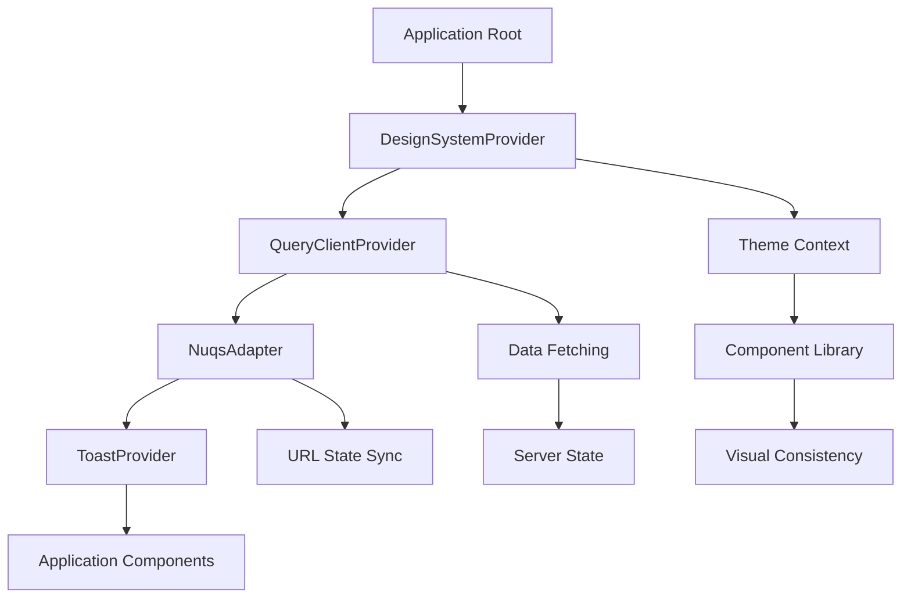
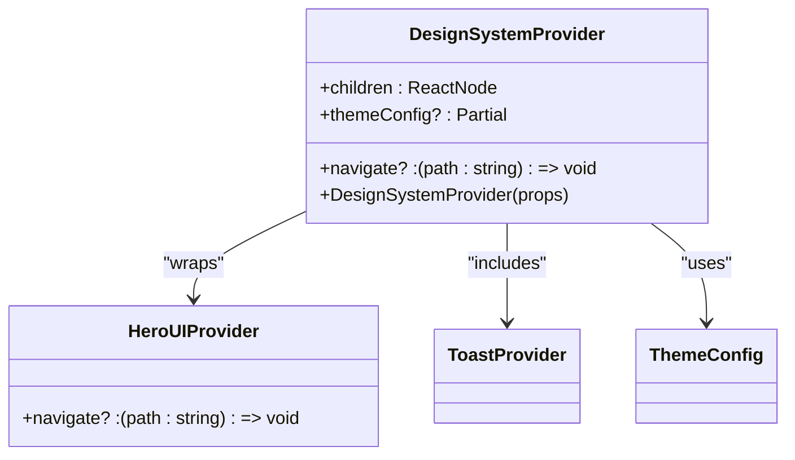
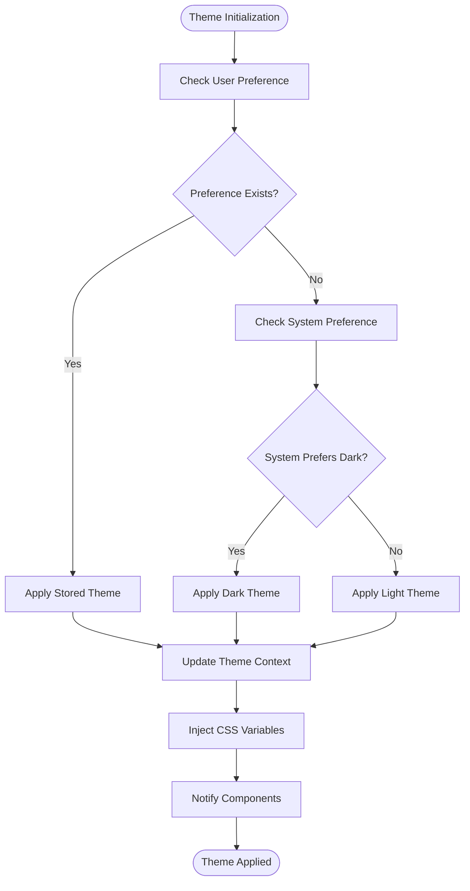
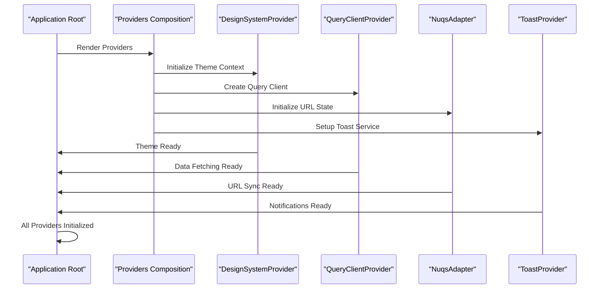
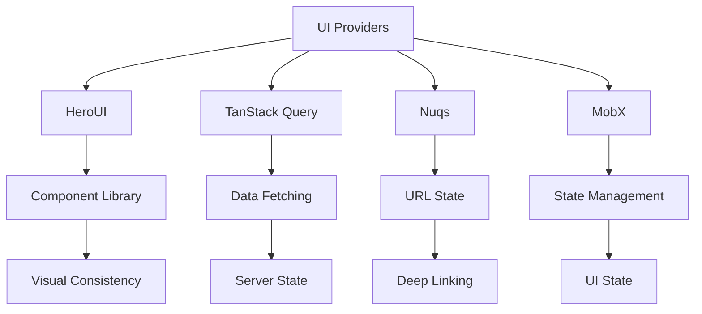

# UI Providers System

<cite>
**Referenced Files in This Document**   
- [DesignSystemProvider.tsx](file://packages/design-system/src/provider/DesignSystemProvider.tsx)
- [heroui.config.ts](file://packages/design-system/src/theme/heroui.config.ts)
- [Providers.tsx](file://packages/provider/src/Providers.tsx)
- [navigationStore.ts](file://packages/store/src/stores/navigationStore.ts)
- [context.provider.ts](file://apps/server/src/shared/provider/context.provider.ts)
</cite>

## Table of Contents
1. [Introduction](#introduction)
2. [Project Structure](#project-structure)
3. [Core Components](#core-components)
4. [Architecture Overview](#architecture-overview)
5. [Detailed Component Analysis](#detailed-component-analysis)
6. [Dependency Analysis](#dependency-analysis)
7. [Performance Considerations](#performance-considerations)
8. [Troubleshooting Guide](#troubleshooting-guide)
9. [Conclusion](#conclusion)

## Introduction
The UI Providers system in prj-core is a centralized architecture for managing presentation-layer contexts across both admin and mobile applications. This system enables consistent theming, navigation state, and UI state management while maintaining separation between UI concerns and business logic. The implementation leverages React context providers, MobX stores, and a layered architecture to ensure visual consistency, accessibility compliance, and dynamic theme switching capabilities.

## Project Structure
The UI Providers system is organized across multiple packages in the monorepo, with a clear separation of concerns between design system components, application providers, and shared state management. The core UI provider functionality resides in the design-system package, while application-specific providers are implemented in individual app directories.

**Diagram sources**
- [DesignSystemProvider.tsx](file://packages/design-system/src/provider/DesignSystemProvider.tsx)
- [heroui.config.ts](file://packages/design-system/src/theme/heroui.config.ts)

**Section sources**
- [DesignSystemProvider.tsx](file://packages/design-system/src/provider/DesignSystemProvider.tsx)
- [Providers.tsx](file://packages/provider/src/Providers.tsx)

## Core Components
The UI Providers system consists of several core components that work together to manage presentation-layer contexts. The DesignSystemProvider serves as the foundation, wrapping the HeroUI Provider to centralize theme management. This provider is composed with other providers such as QueryClientProvider and NuqsAdapter to create a comprehensive context management solution. The system also includes specialized stores for navigation and route management, ensuring consistent state across the application.

**Section sources**
- [DesignSystemProvider.tsx](file://packages/design-system/src/provider/DesignSystemProvider.tsx)
- [Providers.tsx](file://packages/provider/src/Providers.tsx)
- [navigationStore.ts](file://packages/store/src/stores/navigationStore.ts)

## Architecture Overview
The UI Providers system implements a layered architecture that separates concerns between theme management, state management, and application routing. At the core is the DesignSystemProvider which manages theme context and propagates it to all child components. This provider integrates with HeroUI to ensure consistent styling and accessibility compliance across both admin and mobile applications.

**Diagram sources**
- [DesignSystemProvider.tsx](file://packages/design-system/src/provider/DesignSystemProvider.tsx)
- [Providers.tsx](file://packages/provider/src/Providers.tsx)

## Detailed Component Analysis

### Design System Provider Analysis
The DesignSystemProvider is the cornerstone of the UI Providers system, responsible for managing theme context and ensuring visual consistency across applications. It wraps the HeroUI Provider to centralize theme configuration and provides utilities for theme switching and preference persistence.

**Diagram sources**
- [DesignSystemProvider.tsx](file://packages/design-system/src/provider/DesignSystemProvider.tsx)
- [heroui.config.ts](file://packages/design-system/src/theme/heroui.config.ts)

### Theme Management Implementation
The theme management system implements a comprehensive solution for theme context propagation, dark mode toggling, and responsive design state management. It uses CSS custom properties and React context to ensure theme variables are available throughout the component tree.

**Diagram sources**
- [DesignSystemProvider.tsx](file://packages/design-system/src/provider/DesignSystemProvider.tsx)
- [heroui.config.ts](file://packages/design-system/src/theme/heroui.config.ts)

### Provider Composition Pattern
The system implements a provider composition pattern that combines multiple context providers into a single entry point. This approach simplifies the application root component and ensures consistent provider ordering across different applications.

**Diagram sources**
- [Providers.tsx](file://packages/provider/src/Providers.tsx)
- [DesignSystemProvider.tsx](file://packages/design-system/src/provider/DesignSystemProvider.tsx)

**Section sources**
- [Providers.tsx](file://packages/provider/src/Providers.tsx)
- [DesignSystemProvider.tsx](file://packages/design-system/src/provider/DesignSystemProvider.tsx)

## Dependency Analysis
The UI Providers system has well-defined dependencies that ensure separation of concerns while enabling integration with various application components. The system depends on HeroUI for base component styling, TanStack Query for data fetching, and Nuqs for URL state synchronization.

**Diagram sources**
- [DesignSystemProvider.tsx](file://packages/design-system/src/provider/DesignSystemProvider.tsx)
- [Providers.tsx](file://packages/provider/src/Providers.tsx)

**Section sources**
- [DesignSystemProvider.tsx](file://packages/design-system/src/provider/DesignSystemProvider.tsx)
- [Providers.tsx](file://packages/provider/src/Providers.tsx)

## Performance Considerations
The UI Providers system is designed with performance in mind, minimizing re-renders and optimizing theme updates. The implementation uses memoization and selective context updates to prevent unnecessary component re-renders when theme changes occur. CSS custom properties are used for theme variables to enable efficient style updates without requiring React re-renders for style changes.

## Troubleshooting Guide
Common issues with the UI Providers system include theme hydration mismatches and CSS injection order problems. These can be addressed by ensuring proper server-side rendering setup and maintaining consistent provider ordering. For theme hydration issues, ensure that the initial theme is determined before component mounting, typically by checking localStorage or user preferences during application initialization.

**Section sources**
- [DesignSystemProvider.tsx](file://packages/design-system/src/provider/DesignSystemProvider.tsx)
- [heroui.config.ts](file://packages/design-system/src/theme/heroui.config.ts)

## Conclusion
The UI Providers system in prj-core provides a robust solution for managing presentation-layer contexts across multiple applications. By centralizing theme management, navigation state, and UI state, the system ensures visual consistency and accessibility compliance while enabling dynamic theme switching and user preference persistence. The layered architecture and provider composition pattern make it easy to maintain and extend, providing a solid foundation for both current and future applications.