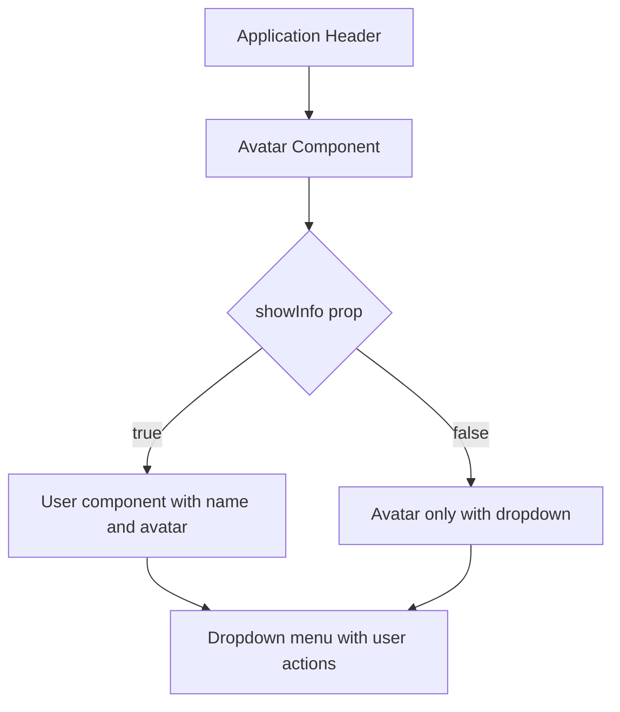
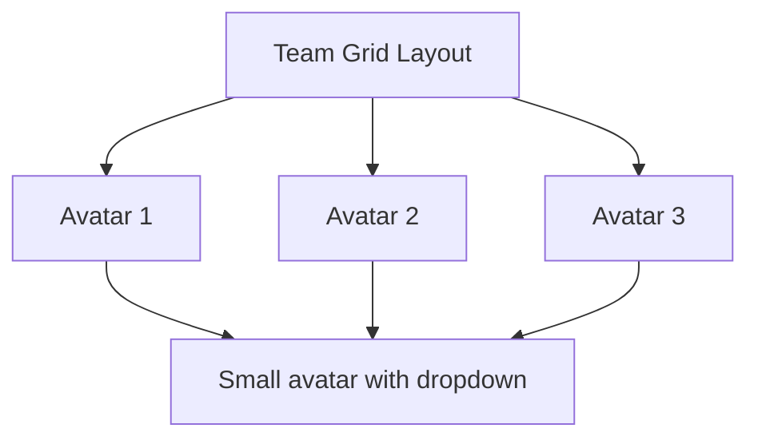

# Avatar Component

<cite>
**Referenced Files in This Document**   
- [Avatar.tsx](file://packages/ui/src/components/ui/data-display/Avatar/Avatar.tsx)
- [Avatar.stories.tsx](file://packages/ui/src/components/ui/data-display/Avatar/Avatar.stories.tsx)
- [Header.stories.tsx](file://packages/ui/src/components/ui/layouts/Header/Header.stories.tsx)
- [CircularImage.tsx](file://packages/ui/src/components/ui/data-display/CircularImage/CircularImage.tsx)
</cite>

## Table of Contents
1. [Introduction](#introduction)
2. [Core Implementation](#core-implementation)
3. [Props API Documentation](#props-api-documentation)
4. [Usage Examples](#usage-examples)
5. [Styling Architecture](#styling-architecture)
6. [Common Issues and Solutions](#common-issues-and-solutions)
7. [Performance Optimization](#performance-optimization)

## Introduction
The Avatar component in the prj-core's shared-frontend package (located in the @cocrepo/ui library) provides a user representation element that displays user information with interactive capabilities. The component serves as a user identity indicator in various application contexts including headers, user lists, and team displays. It combines visual representation with functional dropdown menus for user actions and environment information.

The component is designed to be flexible, supporting different display modes based on context and screen size. It leverages the @heroui/react library's Avatar and User components while adding additional functionality specific to the prj-core application ecosystem.

## Core Implementation

The Avatar component is implemented as a wrapper around the @heroui/react Avatar component with additional functionality for user interaction and environment display. The implementation follows a conditional rendering pattern based on the `showInfo` prop, which determines whether to display just the avatar or the avatar with full user information.

The component integrates with the application's environment system through the @cocrepo/toolkit's environment module, displaying the current environment context to users. It also implements a dropdown menu system with predefined actions including profile access, settings, help, and logout functionality.

The implementation uses a composition pattern, combining the HeroUI Avatar component with a Button trigger and Dropdown component to create an interactive user menu. For desktop views with `showInfo` enabled, it uses the User component to display name and description alongside the avatar.

**Section sources**
- [Avatar.tsx](file://packages/ui/src/components/ui/data-display/Avatar/Avatar.tsx#L10-L127)

## Props API Documentation

The Avatar component accepts the following props:

| Prop | Type | Default | Description |
|------|------|---------|-------------|
| showInfo | boolean | true | Controls whether to display full user information (name, description) alongside the avatar or just the avatar image |
| onMenuAction | (key: string) => void | undefined | Callback function triggered when a menu item is selected, receiving the key of the selected item |

The component does not directly expose image source, alt text, name, or size props because it uses hardcoded values for demonstration purposes (`src: "/moka.webp"`, `name: "슈퍼매니저"`). In a production implementation, these would typically be passed as props to make the component reusable.

The status indicator functionality is implemented through the environment display in the dropdown menu, showing the current environment name and color-coded chip. This serves as a status indicator for developers and administrators to identify which environment they are working in.

**Section sources**
- [Avatar.tsx](file://packages/ui/src/components/ui/data-display/Avatar/Avatar.tsx#L5-L8)
- [Avatar.stories.tsx](file://packages/ui/src/components/ui/data-display/Avatar/Avatar.stories.tsx#L17-L25)

## Usage Examples

### User Profiles
In user profile contexts, the Avatar component is used with `showInfo={true}` to display the full user information. This is typically used in application headers and user management interfaces.



**Diagram sources**
- [Header.stories.tsx](file://packages/ui/src/components/ui/layouts/Header/Header.stories.tsx#L60)
- [Avatar.tsx](file://packages/ui/src/components/ui/data-display/Avatar/Avatar.tsx#L82-L103)

### Comment Sections
For comment sections, a simplified avatar-only version is used with `showInfo={false}` to conserve space while still providing access to user actions through the dropdown menu.

### Team Displays
In team displays, multiple Avatar components can be used in a grid layout to represent team members. The component's compact size variants make it suitable for displaying multiple users in a limited space.



**Diagram sources**
- [User.stories.tsx](file://packages/ui/src/components/ui/data-display/User/User.stories.tsx#L146-L190)

## Styling Architecture

The Avatar component leverages Tailwind CSS for styling, using utility classes for layout, spacing, and visual properties. The styling architecture follows these principles:

1. **Consistent Sizing**: Uses predefined size classes (sm, md, lg) that map to specific width and height values
2. **Responsive Design**: Adapts presentation based on context (showInfo prop) rather than screen size directly
3. **Theme Integration**: Integrates with the @heroui/react theme system for consistent appearance
4. **Accessibility**: Uses semantic HTML elements and ARIA attributes through the underlying UI library components

The component uses the `cn` utility function from @heroui/react for conditional class composition, combining base styles with size-specific classes and any additional className props.

For the circular image rendering, the component relies on the underlying HeroUI Avatar component which applies `rounded-full` and `object-cover` classes to ensure the image is properly styled as a circle with appropriate aspect ratio.

```mermaid
classDiagram
class Avatar {
+showInfo : boolean
+onMenuAction : (key : string) => void
-currentEnvironment : Environment
-userMenuItems : DropdownItemProps[]
+render() : JSX.Element
}
class EnvironmentChip {
+environment : {name : string, color : string}
+render() : JSX.Element
}
class ProfileIcon {
+render() : JSX.Element
}
class SettingsIcon {
+render() : JSX.Element
}
class HelpIcon {
+render() : JSX.Element
}
class LogoutIcon {
+render() : JSX.Element
}
Avatar --> EnvironmentChip : "uses"
Avatar --> ProfileIcon : "uses"
Avatar --> SettingsIcon : "uses"
Avatar --> HelpIcon : "uses"
Avatar --> LogoutIcon : "uses"
Avatar --> "Button" : "wraps"
Avatar --> "Dropdown" : "uses"
Avatar --> "User" : "uses when showInfo=true"
Avatar --> "HeroUIAvatar" : "uses when showInfo=false"
```

**Diagram sources**
- [Avatar.tsx](file://packages/ui/src/components/ui/data-display/Avatar/Avatar.tsx)
- [CircularImage.tsx](file://packages/ui/src/components/ui/data-display/CircularImage/CircularImage.tsx#L10-L14)

**Section sources**
- [Avatar.tsx](file://packages/ui/src/components/ui/data-display/Avatar/Avatar.tsx#L1-L218)
- [CircularImage.tsx](file://packages/ui/src/components/ui/data-display/CircularImage/CircularImage.tsx#L1-L29)

## Common Issues and Solutions

### Broken Image Handling
The current implementation does not include explicit fallback mechanisms for broken images. Since the image source is hardcoded to "/moka.webp", this reduces the risk of broken images in production. However, in a more flexible implementation, fallback mechanisms would be necessary.

Potential solutions include:
- Implementing an onError handler for the image element
- Using a fallback avatar component when the image fails to load
- Generating initials from the user name as a fallback display

### Accessibility for Screen Readers
The component provides basic accessibility through the use of semantic elements in the underlying @heroui/react components. The Button wrapper provides keyboard navigation and screen reader announcements. The alt text for the avatar image should be properly set to describe the user.

Enhancements could include:
- Adding aria-label attributes for the dropdown trigger
- Ensuring proper focus management within the dropdown menu
- Providing descriptive labels for all interactive elements

### Performance Optimization
For pages with multiple avatars, performance considerations include:

1. **Image Optimization**: Ensure avatar images are properly sized and compressed
2. **Lazy Loading**: Implement lazy loading for avatars that are not in the initial viewport
3. **Caching**: Leverage browser caching and CDN distribution for avatar images
4. **Memory Management**: Avoid memory leaks in event handlers and component cleanup

The current implementation does not include explicit lazy loading or advanced caching strategies, relying instead on browser defaults and the application's overall image optimization pipeline.

**Section sources**
- [Avatar.tsx](file://packages/ui/src/components/ui/data-display/Avatar/Avatar.tsx)
- [CircularImage.tsx](file://packages/ui/src/components/ui/data-display/CircularImage/CircularImage.tsx)

## Performance Optimization

While the current Avatar component implementation is straightforward, several performance optimization strategies could be applied in high-density scenarios:

### Image Loading Strategies
For applications displaying many avatars simultaneously, implementing lazy loading would improve initial page load performance. This could be achieved by:
- Using the native `loading="lazy"` attribute on img elements
- Implementing intersection observers to load images as they enter the viewport
- Using placeholder images or skeletons during loading

### Caching Strategies
The application can leverage multiple caching layers:
1. **Browser Caching**: Configure proper cache headers for avatar images
2. **CDN Caching**: Distribute avatar images through a content delivery network
3. **Memory Caching**: Cache frequently accessed avatar data in memory
4. **Service Worker Caching**: Implement offline caching for frequently accessed avatars

### Rendering Optimization
To optimize rendering performance:
- Memoize the Avatar component using React.memo to prevent unnecessary re-renders
- Use virtualization for long lists of avatars
- Debounce or throttle dropdown interactions in high-frequency usage scenarios

These optimizations would be particularly beneficial in team display views or comment sections with many user avatars.

**Section sources**
- [Avatar.tsx](file://packages/ui/src/components/ui/data-display/Avatar/Avatar.tsx)
- [CircularImage.tsx](file://packages/ui/src/components/ui/data-display/CircularImage/CircularImage.tsx)