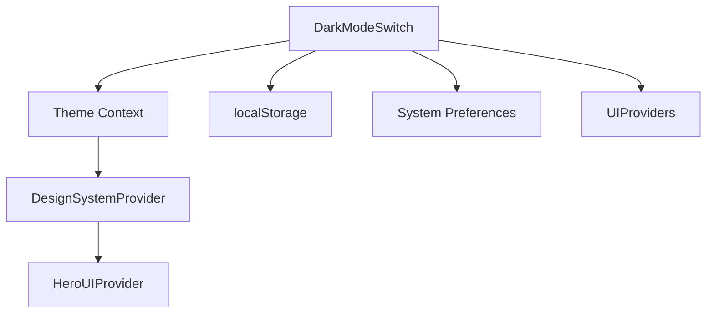
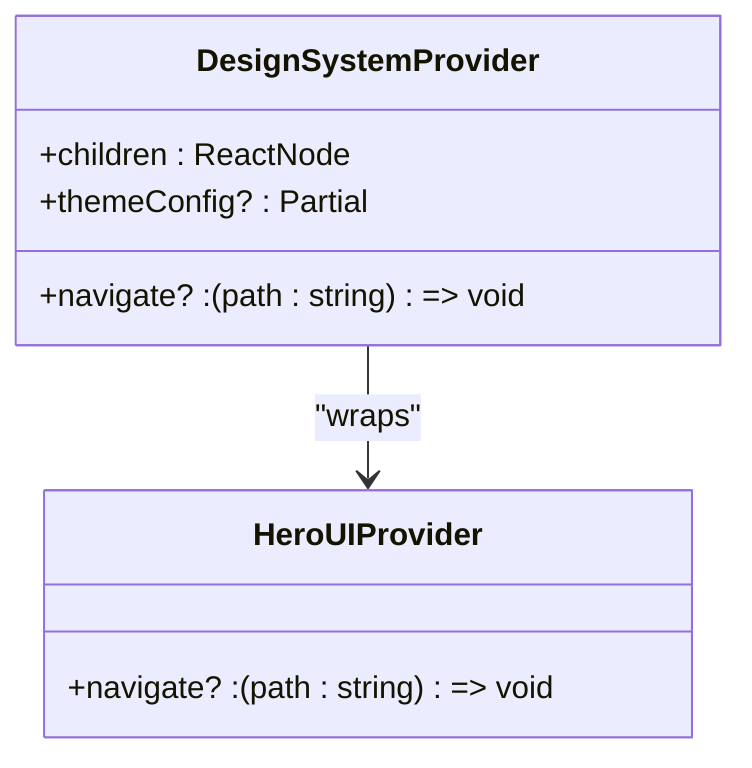
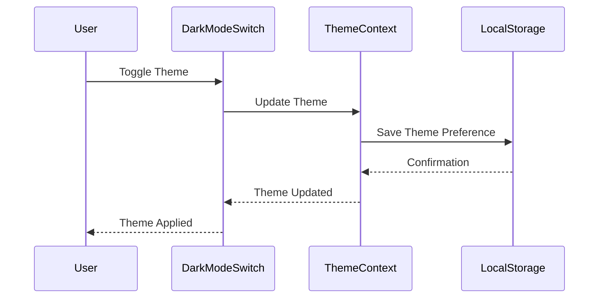
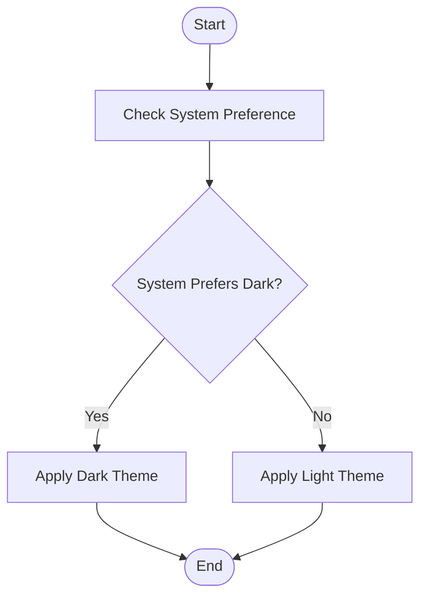
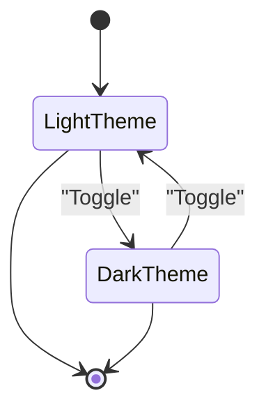
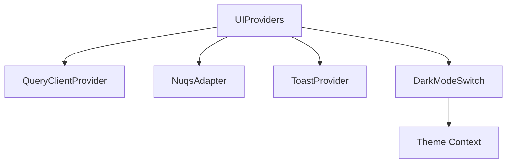

# DarkModeSwitch Component

<cite>
**Referenced Files in This Document**   
- [DesignSystemProvider.tsx](file://packages/design-system/src/provider/DesignSystemProvider.tsx)
- [heroui.config.ts](file://packages/design-system/src/theme/heroui.config.ts)
- [Switch.tsx](file://packages/ui/src/components/ui/inputs/Switch/Switch.tsx)
- [Switch/index.tsx](file://packages/ui/src/components/ui/inputs/Switch/index.tsx)
</cite>

## Table of Contents
1. [Introduction](#introduction)
2. [Project Structure](#project-structure)
3. [Core Components](#core-components)
4. [Architecture Overview](#architecture-overview)
5. [Detailed Component Analysis](#detailed-component-analysis)
6. [Dependency Analysis](#dependency-analysis)
7. [Performance Considerations](#performance-considerations)
8. [Troubleshooting Guide](#troubleshooting-guide)
9. [Conclusion](#conclusion)

## Introduction
The DarkModeSwitch component in the prj-core's shared-frontend package provides a seamless interface for users to toggle between light and dark themes. This documentation details the implementation of the component, focusing on its integration with theme context, persistence mechanisms, system preference detection, and smooth transition animations. The component is designed to enhance user experience by respecting user preferences and providing consistent theme application across the application.

## Project Structure
The DarkModeSwitch component is part of the shared-frontend package, which is structured to promote reusability and maintainability. The component leverages the design-system package for theme management and UI consistency. The project structure ensures that the DarkModeSwitch component can be easily integrated into various applications within the prj-core ecosystem.



**Diagram sources**
- [DesignSystemProvider.tsx](file://packages/design-system/src/provider/DesignSystemProvider.tsx)
- [heroui.config.ts](file://packages/design-system/src/theme/heroui.config.ts)

**Section sources**
- [DesignSystemProvider.tsx](file://packages/design-system/src/provider/DesignSystemProvider.tsx)
- [heroui.config.ts](file://packages/design-system/src/theme/heroui.config.ts)

## Core Components
The core components of the DarkModeSwitch include the theme context integration, localStorage persistence, system preference detection, and smooth transition animations. These components work together to provide a robust and user-friendly dark mode toggle.

**Section sources**
- [DesignSystemProvider.tsx](file://packages/design-system/src/provider/DesignSystemProvider.tsx)
- [heroui.config.ts](file://packages/design-system/src/theme/heroui.config.ts)

## Architecture Overview
The architecture of the DarkModeSwitch component is designed to be modular and scalable. It integrates with the theme context to manage theme state, uses localStorage for persistence, and detects system preferences to provide a seamless user experience.


**Diagram sources**
- [DesignSystemProvider.tsx](file://packages/design-system/src/provider/DesignSystemProvider.tsx)
- [heroui.config.ts](file://packages/design-system/src/theme/heroui.config.ts)

## Detailed Component Analysis

### DarkModeSwitch Analysis
The DarkModeSwitch component is a critical part of the user interface, allowing users to switch between light and dark themes. It integrates with the theme context to manage theme state and uses localStorage for persistence.

#### Theme Context Integration
The DarkModeSwitch component integrates with the theme context to manage theme state. The theme context is provided by the DesignSystemProvider, which wraps the HeroUIProvider.



**Diagram sources**
- [DesignSystemProvider.tsx](file://packages/design-system/src/provider/DesignSystemProvider.tsx)

#### localStorage Persistence
The DarkModeSwitch component uses localStorage to persist the user's theme preference. This ensures that the user's preference is maintained across sessions.



**Diagram sources**
- [DesignSystemProvider.tsx](file://packages/design-system/src/provider/DesignSystemProvider.tsx)
- [heroui.config.ts](file://packages/design-system/src/theme/heroui.config.ts)

#### System Preference Detection
The DarkModeSwitch component detects the user's system preference for dark mode and applies it if the user has not explicitly set a preference.



**Diagram sources**
- [heroui.config.ts](file://packages/design-system/src/theme/heroui.config.ts)

#### Smooth Transition Animations
The DarkModeSwitch component provides smooth transition animations when switching between themes. This enhances the user experience by making the transition visually appealing.



**Diagram sources**
- [heroui.config.ts](file://packages/design-system/src/theme/heroui.config.ts)

**Section sources**
- [DesignSystemProvider.tsx](file://packages/design-system/src/provider/DesignSystemProvider.tsx)
- [heroui.config.ts](file://packages/design-system/src/theme/heroui.config.ts)

### UIProviders Integration
The DarkModeSwitch component is integrated with the UIProviders wrapper to ensure consistent theme application across the application.



**Diagram sources**
- [Providers.tsx](file://apps/admin/src/providers/Providers.tsx)

**Section sources**
- [Providers.tsx](file://apps/admin/src/providers/Providers.tsx)

## Dependency Analysis
The DarkModeSwitch component has several dependencies that are critical to its functionality. These include the theme context, localStorage, and system preference detection.

```mermaid
dependencyDiagram
DarkModeSwitch --> ThemeContext
DarkModeSwitch --> LocalStorage
DarkModeSwitch --> SystemPreferences
ThemeContext --> DesignSystemProvider
DesignSystemProvider --> HeroUIProvider
```

**Diagram sources**
- [DesignSystemProvider.tsx](file://packages/design-system/src/provider/DesignSystemProvider.tsx)
- [heroui.config.ts](file://packages/design-system/src/theme/heroui.config.ts)

**Section sources**
- [DesignSystemProvider.tsx](file://packages/design-system/src/provider/DesignSystemProvider.tsx)
- [heroui.config.ts](file://packages/design-system/src/theme/heroui.config.ts)

## Performance Considerations
The DarkModeSwitch component is designed to be performant and efficient. It minimizes re-renders by using memoization and ensures smooth transitions by leveraging CSS animations.

## Troubleshooting Guide
Common issues with the DarkModeSwitch component include flash of wrong theme during page load and inconsistent theme application across components. These issues can be addressed by ensuring proper integration with the theme context and using consistent theme application methods.

**Section sources**
- [DesignSystemProvider.tsx](file://packages/design-system/src/provider/DesignSystemProvider.tsx)
- [heroui.config.ts](file://packages/design-system/src/theme/heroui.config.ts)

## Conclusion
The DarkModeSwitch component in the prj-core's shared-frontend package provides a robust and user-friendly interface for toggling between light and dark themes. By integrating with the theme context, using localStorage for persistence, and detecting system preferences, the component ensures a seamless user experience. The component is designed to be modular and scalable, making it easy to integrate into various applications within the prj-core ecosystem.