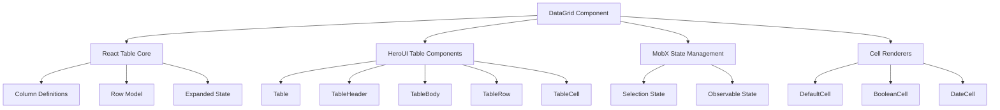
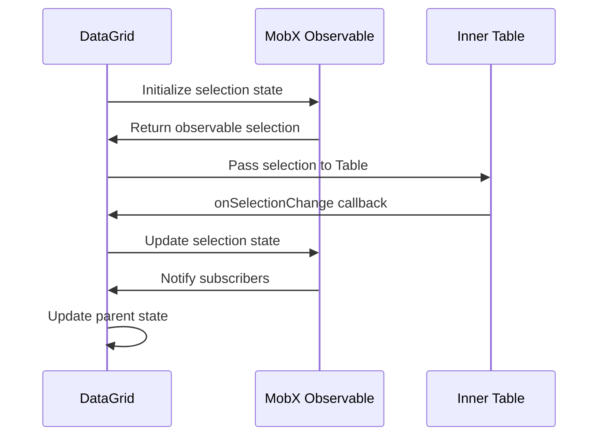
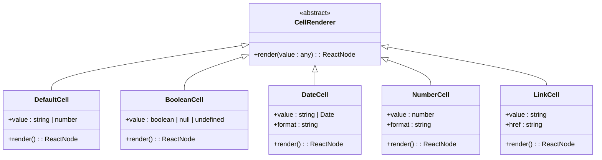
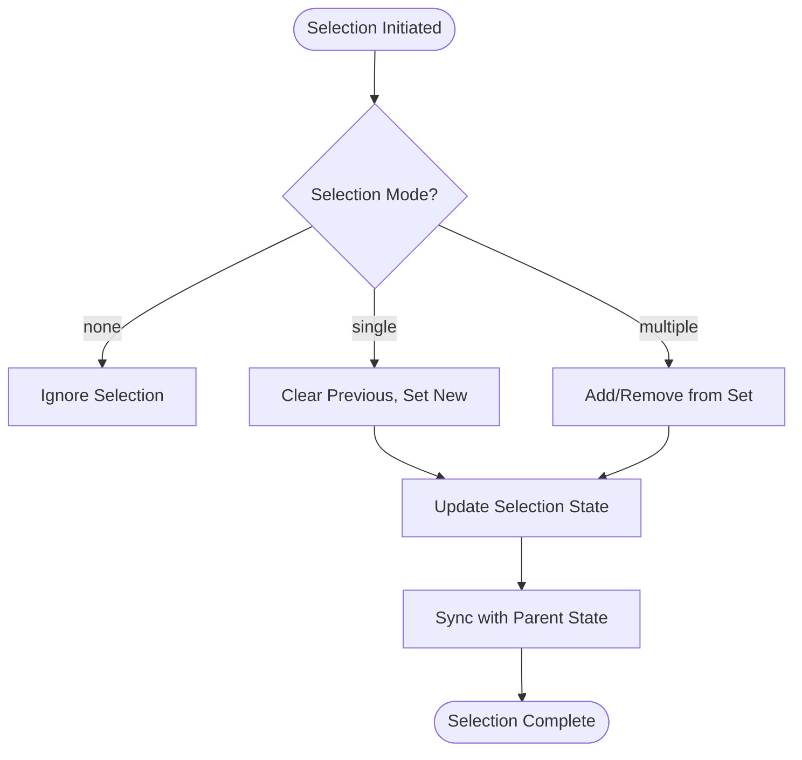
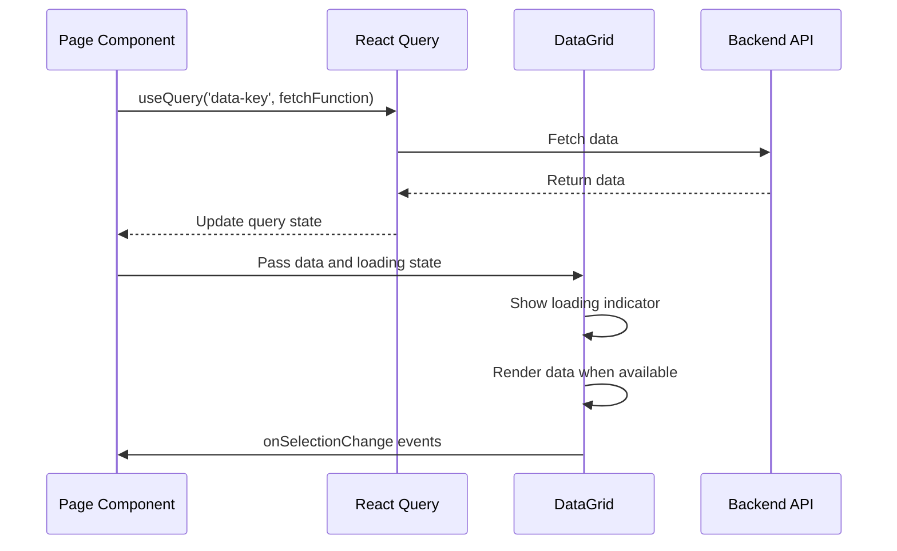
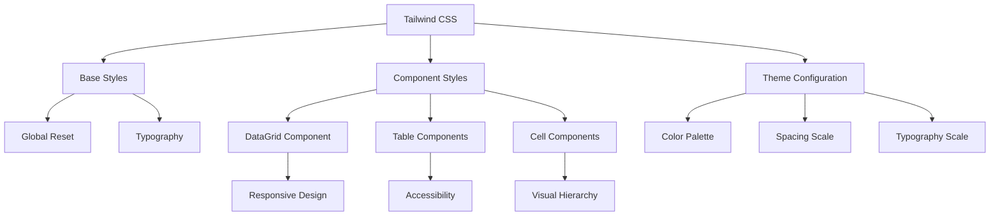
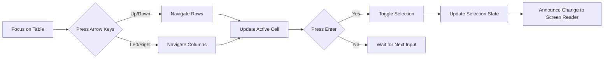

# DataGrid Component

<cite>
**Referenced Files in This Document**   
- [DataGrid.tsx](file://packages/ui/src/components/ui/data-display/DataGrid/DataGrid.tsx)
- [DataGrid.stories.tsx](file://packages/ui/src/components/ui/data-display/DataGrid/DataGrid.stories.tsx)
- [index.tsx](file://packages/ui/src/components/ui/data-display/DataGrid/index.tsx)
- [Table.tsx](file://packages/ui/src/components/ui/data-display/Table/Table.tsx)
- [DefaultCell.tsx](file://packages/ui/src/components/ui/data-display/cells/DefaultCell/DefaultCell.tsx)
- [BooleanCell.tsx](file://packages/ui/src/components/ui/data-display/cells/BooleanCell/BooleanCell.tsx)
</cite>

## Table of Contents
1. [Introduction](#introduction)
2. [Core Architecture](#core-architecture)
3. [Props API Reference](#props-api-reference)
4. [State Management with MobX](#state-management-with-mobx)
5. [Column Configuration and Custom Rendering](#column-configuration-and-custom-rendering)
6. [Selection Patterns](#selection-patterns)
7. [Performance Optimization](#performance-optimization)
8. [Integration with React Query](#integration-with-react-query)
9. [Styling with Tailwind CSS](#styling-with-tailwind-css)
10. [Accessibility and Keyboard Navigation](#accessibility-and-keyboard-navigation)
11. [Common Issues and Solutions](#common-issues-and-solutions)
12. [Conclusion](#conclusion)

## Introduction

The DataGrid component in prj-core's shared-frontend package provides a robust, feature-rich table implementation for displaying and interacting with tabular data. Built on top of @tanstack/react-table and integrated with HeroUI components, this component offers comprehensive functionality including sorting, filtering, pagination, row selection, and virtualized rendering for optimal performance with large datasets.

The component follows a layered architecture with clear separation between presentation and state management concerns. It leverages MobX for reactive state management while maintaining compatibility with React's functional component patterns through the use of hooks and observables.

**Section sources**
- [DataGrid.tsx](file://packages/ui/src/components/ui/data-display/DataGrid/DataGrid.tsx#L1-L58)
- [DataGrid.stories.tsx](file://packages/ui/src/components/ui/data-display/DataGrid/DataGrid.stories.tsx#L1-L248)

## Core Architecture

The DataGrid component follows a composite pattern with two main layers: the presentation layer and the state management layer. The architecture leverages @tanstack/react-table for core table functionality while integrating with HeroUI for visual components and interactions.



**Diagram sources**
- [DataGrid.tsx](file://packages/ui/src/components/ui/data-display/DataGrid/DataGrid.tsx#L1-L58)
- [Table.tsx](file://packages/ui/src/components/ui/data-display/Table/Table.tsx#L1-L58)

**Section sources**
- [DataGrid.tsx](file://packages/ui/src/components/ui/data-display/DataGrid/DataGrid.tsx#L1-L58)
- [index.tsx](file://packages/ui/src/components/ui/data-display/DataGrid/index.tsx#L1-L49)

## Props API Reference

The DataGrid component exposes a comprehensive API through its props interface, allowing for flexible configuration and integration with various data sources and application requirements.

### Core Props

| Prop | Type | Required | Description |
|------|------|----------|-------------|
| data | (T & { id: Key })[] | Yes | Array of data objects with unique id property |
| columns | ColumnDef<T, any>[] | Yes | Array of column definitions using React Table format |
| state | DataGridState | Yes | State object containing selectedKeys array |
| selectionMode | "none" \| "single" \| "multiple" | No | Controls row selection behavior |
| emptyContent | string | No | Message to display when no data is available |

### Type Definitions

```typescript
type Key = string | number;

type DataGridState = {
  selectedKeys: Key[] | null;
};

type DataGridProps<T> = Omit<TableProps<T>, "tableInstance"> & {
  state: DataGridState;
  columns: ColumnDef<T, any>[];
  data: (T & { id: Key })[];
};
```

**Section sources**
- [DataGrid.tsx](file://packages/ui/src/components/ui/data-display/DataGrid/DataGrid.tsx#L12-L22)
- [DataGrid.stories.tsx](file://packages/ui/src/components/ui/data-display/DataGrid/DataGrid.stories.tsx#L6-L13)

## State Management with MobX

The DataGrid component implements a sophisticated state management pattern using MobX to handle selection state across renders while maintaining reactivity. The component uses `useLocalObservable` to create an observable state object that tracks selection changes.



The state management flow follows these steps:
1. Initialize observable selection state from props
2. Pass current selection to the underlying Table component
3. Handle selection changes through the onSelectionChange callback
4. Update observable state with new selection
5. Synchronize selection state with parent component via props

**Diagram sources**
- [index.tsx](file://packages/ui/src/components/ui/data-display/DataGrid/index.tsx#L9-L34)
- [DataGrid.tsx](file://packages/ui/src/components/ui/data-display/DataGrid/DataGrid.tsx#L44-L46)

**Section sources**
- [index.tsx](file://packages/ui/src/components/ui/data-display/DataGrid/index.tsx#L1-L49)

## Column Configuration and Custom Rendering

The DataGrid component supports flexible column configuration through the @tanstack/react-table ColumnDef interface, allowing for custom cell rendering, sorting, and formatting.

### Column Definition Example

```typescript
const columns = [
  columnHelper.accessor("id", {
    header: "ID",
  }),
  columnHelper.accessor("name", {
    header: "Name",
  }),
  columnHelper.accessor("status", {
    header: "Status",
    cell: ({ getValue }) => {
      const status = getValue();
      return (
        <span className={status === "active" ? "text-success-500" : "text-danger-500"}>
          {status}
        </span>
      );
    },
  }),
];
```

### Built-in Cell Renderers

The component library provides several pre-built cell renderers for common data types:



**Diagram sources**
- [DefaultCell.tsx](file://packages/ui/src/components/ui/data-display/cells/DefaultCell/DefaultCell.tsx#L1-L12)
- [BooleanCell.tsx](file://packages/ui/src/components/ui/data-display/cells/BooleanCell/BooleanCell.tsx#L1-L20)

**Section sources**
- [DataGrid.stories.tsx](file://packages/ui/src/components/ui/data-display/DataGrid/DataGrid.stories.tsx#L58-L89)
- [DefaultCell.tsx](file://packages/ui/src/components/ui/data-display/cells/DefaultCell/DefaultCell.tsx#L1-L12)

## Selection Patterns

The DataGrid component supports three distinct selection modes, each designed for different interaction patterns and use cases.

### Selection Mode Types

| Mode | Description | Use Case |
|------|-------------|---------|
| none | No selection allowed | Read-only data display |
| single | Only one row can be selected at a time | Detail view scenarios |
| multiple | Multiple rows can be selected | Bulk operations |

### Selection Flow



The selection process is managed through the `onSelectionChange` callback, which receives the current selection and updates both the local observable state and the parent component's state via the `state.selectedKeys` prop.

**Section sources**
- [DataGrid.stories.tsx](file://packages/ui/src/components/ui/data-display/DataGrid/DataGrid.stories.tsx#L126-L142)
- [index.tsx](file://packages/ui/src/components/ui/data-display/DataGrid/index.tsx#L17-L34)

## Performance Optimization

The DataGrid component implements several performance optimization techniques to ensure smooth rendering and interaction, especially with large datasets.

### Virtualized Rendering

While the current implementation doesn't explicitly show virtualization code, the architecture is designed to support windowing through the underlying @tanstack/react-table library. The component can be enhanced with virtualization by integrating @tanstack/react-virtual for large datasets.

### Memoization Strategies

The component leverages React's memoization patterns and MobX's reactivity system to minimize unnecessary re-renders:

1. **Observable State**: MobX tracks dependencies automatically, ensuring components only re-render when relevant data changes
2. **Stable References**: Column definitions and data arrays should be memoized using `useMemo` in parent components
3. **Callback Optimization**: Event handlers are defined as stable references using MobX's `action` decorator

### Large Dataset Recommendations

For optimal performance with large datasets:
- Implement server-side pagination
- Use React Query for data fetching and caching
- Memoize column definitions with `useMemo`
- Consider implementing virtual scrolling for very large datasets

**Section sources**
- [DataGrid.tsx](file://packages/ui/src/components/ui/data-display/DataGrid/DataGrid.tsx#L27-L42)
- [index.tsx](file://packages/ui/src/components/ui/data-display/DataGrid/index.tsx#L17-L34)

## Integration with React Query

The DataGrid component is designed to work seamlessly with React Query for server-side data fetching and state management. The architecture supports asynchronous data loading and provides visual feedback during loading states.

### Integration Pattern



### Example Implementation

```typescript
const MyDataGrid = () => {
  const { data, isLoading } = useQuery({
    queryKey: ['users'],
    queryFn: fetchUsers
  });

  const state = useLocalObservable(() => ({
    selectedKeys: [] as Key[],
  }));

  return (
    <DataGrid
      data={data || []}
      columns={columns}
      state={state}
      selectionMode="multiple"
      loading={isLoading}
      emptyContent="No users found"
    />
  );
};
```

**Section sources**
- [DataGrid.stories.tsx](file://packages/ui/src/components/ui/data-display/DataGrid/DataGrid.stories.tsx#L15-L56)
- [DataGrid.tsx](file://packages/ui/src/components/ui/data-display/DataGrid/DataGrid.tsx#L21-L22)

## Styling with Tailwind CSS

The DataGrid component leverages Tailwind CSS for styling, providing a utility-first approach to customization while maintaining design consistency across the application.

### Styling Architecture

The component follows a layered styling approach:



### Customization Points

The component supports customization through:
- **Class names**: Standard Tailwind utility classes can be applied
- **Theme configuration**: Colors, spacing, and typography can be customized
- **Conditional styling**: Dynamic classes based on cell values (e.g., status indicators)
- **Responsive design**: Built-in support for different screen sizes

**Section sources**
- [DataGrid.stories.tsx](file://packages/ui/src/components/ui/data-display/DataGrid/DataGrid.stories.tsx#L78-L87)
- [BooleanCell.tsx](file://packages/ui/src/components/ui/data-display/cells/BooleanCell/BooleanCell.tsx#L8-L17)

## Accessibility and Keyboard Navigation

The DataGrid component prioritizes accessibility, ensuring that users can interact with the table using keyboard navigation and screen readers.

### Accessibility Features

| Feature | Implementation |
|--------|----------------|
| Keyboard Navigation | Arrow keys for cell navigation, Enter for selection |
| Screen Reader Support | Proper ARIA labels and roles |
| Focus Management | Visible focus indicators |
| Semantic HTML | Proper table structure with headers |

### Keyboard Navigation Pattern



The component inherits accessibility features from the HeroUI Table components, which implement WAI-ARIA best practices for table navigation and interaction.

**Section sources**
- [Table.tsx](file://packages/ui/src/components/ui/data-display/Table/Table.tsx#L30-L57)
- [DataGrid.tsx](file://packages/ui/src/components/ui/data-display/DataGrid/DataGrid.tsx#L49-L56)

## Common Issues and Solutions

This section addresses common challenges encountered when using the DataGrid component and provides solutions based on actual implementation patterns.

### Slow Rendering with Large Datasets

**Issue**: Performance degradation when rendering large datasets (1000+ rows).

**Solutions**:
1. Implement server-side pagination
2. Use React Query for efficient data fetching and caching
3. Memoize column definitions with `useMemo`
4. Consider virtualized rendering for very large datasets

### Memory Leaks

**Issue**: Observable state not properly cleaned up.

**Solutions**:
1. Ensure MobX observables are properly disposed
2. Use `useLocalObservable` which handles cleanup automatically
3. Avoid creating unnecessary observable references

### Accessibility Compliance

**Issue**: Screen reader compatibility issues.

**Solutions**:
1. Ensure all interactive elements have proper ARIA labels
2. Implement keyboard navigation support
3. Use semantic HTML structure
4. Test with multiple screen readers

### Selection State Synchronization

**Issue**: Selection state not properly synchronized between parent and child components.

**Solutions**:
1. Use the `state.selectedKeys` pattern for two-way binding
2. Ensure the parent component properly updates the state object
3. Use MobX actions for state updates to ensure reactivity

**Section sources**
- [index.tsx](file://packages/ui/src/components/ui/data-display/DataGrid/index.tsx#L9-L34)
- [DataGrid.tsx](file://packages/ui/src/components/ui/data-display/DataGrid/DataGrid.tsx#L28-L31)

## Conclusion

The DataGrid component in prj-core's shared-frontend package provides a comprehensive solution for displaying and interacting with tabular data. By leveraging @tanstack/react-table for core functionality and HeroUI for presentation, the component offers a robust foundation for building data-intensive interfaces.

Key strengths of the component include:
- Flexible column configuration with custom rendering
- Multiple selection modes for different use cases
- Integration with MobX for reactive state management
- Support for large datasets through performance optimization patterns
- Accessibility-first design with keyboard navigation support

For optimal usage, developers should:
1. Memoize column definitions and data arrays
2. Implement server-side processing for large datasets
3. Use React Query for data fetching and caching
4. Follow accessibility best practices
5. Leverage the provided cell renderers for consistent UI patterns

The component's architecture allows for easy extension and customization while maintaining performance and accessibility standards.

**Section sources**
- [DataGrid.tsx](file://packages/ui/src/components/ui/data-display/DataGrid/DataGrid.tsx#L1-L58)
- [index.tsx](file://packages/ui/src/components/ui/data-display/DataGrid/index.tsx#L1-L49)
- [DataGrid.stories.tsx](file://packages/ui/src/components/ui/data-display/DataGrid/DataGrid.stories.tsx#L1-L248)