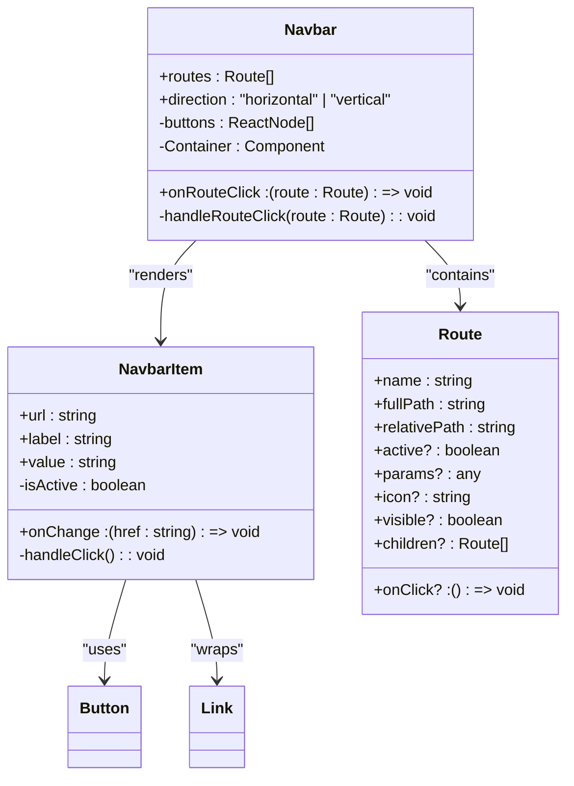
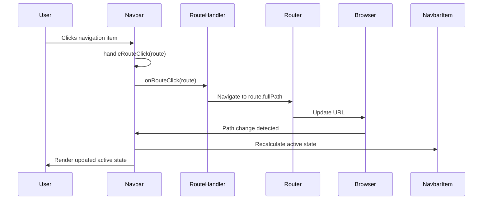

# Navbar Component

<cite>
**Referenced Files in This Document**   
- [Navbar.tsx](file://packages/ui/src/components/ui/layouts/Navbar/Navbar.tsx)
- [types.ts](file://packages/ui/src/components/ui/layouts/Navbar/types.ts)
- [utils.ts](file://packages/ui/src/components/ui/layouts/Navbar/utils.ts)
- [NavbarItem.tsx](file://packages/ui/src/components/ui/layouts/NavbarItem/NavbarItem.tsx)
- [Header.tsx](file://packages/ui/src/components/ui/layouts/Header/Header.tsx)
</cite>

## Table of Contents
1. [Introduction](#introduction)
2. [Core Architecture](#core-architecture)
3. [Props API Reference](#props-api-reference)
4. [Responsive Design Implementation](#responsive-design-implementation)
5. [Navigation and Routing Integration](#navigation-and-routing-integration)
6. [Styling and Theme Architecture](#styling-and-theme-architecture)
7. [Common Implementation Patterns](#common-implementation-patterns)
8. [Accessibility and Performance Considerations](#accessibility-and-performance-considerations)
9. [Troubleshooting Guide](#troubleshooting-guide)

## Introduction
The Navbar component in the prj-core shared-frontend package provides a flexible navigation system for web applications. Built with React and integrated with the HeroUI component library, this component supports both horizontal and vertical layouts, dynamic route handling, and responsive design patterns. The implementation focuses on accessibility, performance, and seamless integration with React Router for active link management. The component is designed to handle complex navigation structures while maintaining simplicity for basic use cases.

## Core Architecture
The Navbar component follows a modular architecture with clear separation of concerns between the main navigation container and individual navigation items. The implementation leverages React's memoization and useCallback hooks to optimize rendering performance, particularly important for navigation systems with multiple items that may update frequently.

**Diagram sources**
- [Navbar.tsx](file://packages/ui/src/components/ui/layouts/Navbar/Navbar.tsx)
- [types.ts](file://packages/ui/src/components/ui/layouts/Navbar/types.ts)
- [NavbarItem.tsx](file://packages/ui/src/components/ui/layouts/NavbarItem/NavbarItem.tsx)

**Section sources**
- [Navbar.tsx](file://packages/ui/src/components/ui/layouts/Navbar/Navbar.tsx#L1-L50)
- [types.ts](file://packages/ui/src/components/ui/layouts/Navbar/types.ts#L1-L19)

## Props API Reference
The Navbar component exposes a comprehensive API for configuring navigation behavior and appearance. The primary interface is defined through the NavbarProps and Route types, which support hierarchical navigation structures, icon integration, and custom click handling.

### Main Navbar Props
| Property | Type | Default | Description |
|---------|------|---------|-------------|
| routes | Route[] | [] | Array of route objects defining navigation items |
| direction | "horizontal" \| "vertical" | "horizontal" | Layout orientation of navigation items |
| onRouteClick | (route: Route) => void | undefined | Callback function triggered when a route is clicked |

### Route Object Properties
| Property | Type | Required | Description |
|---------|------|---------|-------------|
| name | string | Yes | Display text for the navigation item |
| fullPath | string | Yes | Complete path for route matching and navigation |
| relativePath | string | Yes | Relative path segment for the route |
| active | boolean | No | Explicitly sets active state (overrides automatic detection) |
| icon | string | No | Icon identifier from Lucide icon library |
| visible | boolean | No | Controls visibility of the navigation item |
| onClick | () => void | No | Custom click handler for the route |
| children | Route[] | No | Nested routes for dropdown or hierarchical navigation |

### NavbarItem Props
The NavbarItem component provides a lower-level interface for individual navigation items with automatic active state detection based on the current URL path.

| Property | Type | Description |
|---------|------|-------------|
| label | string | Text displayed in the navigation item |
| value | string | Path value compared with window.location.pathname to determine active state |
| onChange | (href: string) => void | Callback function called with the value when clicked |
| url | string | Deprecated; use value instead |

**Section sources**
- [types.ts](file://packages/ui/src/components/ui/layouts/Navbar/types.ts#L1-L19)
- [NavbarItem.tsx](file://packages/ui/src/components/ui/layouts/NavbarItem/NavbarItem.tsx#L1-L37)

## Responsive Design Implementation
The Navbar component supports responsive design through flexible layout options and integration with higher-level layout components. While the Navbar itself provides the horizontal/vertical direction toggle, responsive behavior is typically managed by parent components like Header that adapt the navigation layout based on screen size.

The component uses Tailwind CSS utility classes for responsive styling, with the container className adapting based on the direction prop. Horizontal layouts use flex-1 to distribute space evenly among navigation items, while vertical layouts use fixed gap spacing. The implementation leverages HeroUI's responsive design system, allowing the navbar to integrate seamlessly with responsive layout containers.

For mobile-specific navigation patterns, the component can be combined with other UI elements like bottom navigation bars or hamburger menus, as demonstrated in the DashboardLayout component's mobile-focused implementation. The Navbar's lightweight design and prop-based configuration make it adaptable to various responsive navigation patterns.

**Section sources**
- [Navbar.tsx](file://packages/ui/src/components/ui/layouts/Navbar/Navbar.tsx#L40-L45)
- [Header.tsx](file://packages/ui/src/components/ui/layouts/Header/Header.tsx#L14-L32)

## Navigation and Routing Integration
The Navbar component integrates with routing systems through its onRouteClick callback and Route object structure. The component does not handle routing directly but provides the necessary hooks for integration with React Router or similar routing libraries.

Active state management is implemented through multiple mechanisms:
1. **Explicit active flag**: Routes can have an active property set directly
2. **Automatic detection**: NavbarItem components automatically detect active state by comparing their value prop with window.location.pathname
3. **Route-based detection**: The parent application can determine active routes based on the current route configuration

The component supports hierarchical navigation through the children property in the Route interface, enabling dropdown menus or nested navigation structures. Click handling is managed through the onRouteClick callback, which receives the complete Route object, allowing for custom navigation logic, analytics tracking, or permission checks.

**Diagram sources**
- [Navbar.tsx](file://packages/ui/src/components/ui/layouts/Navbar/Navbar.tsx#L11-L18)
- [NavbarItem.tsx](file://packages/ui/src/components/ui/layouts/NavbarItem/NavbarItem.tsx#L16-L18)

**Section sources**
- [Navbar.tsx](file://packages/ui/src/components/ui/layouts/Navbar/Navbar.tsx#L11-L18)
- [NavbarItem.tsx](file://packages/ui/src/components/ui/layouts/NavbarItem/NavbarItem.tsx#L16-L18)

## Styling and Theme Architecture
The Navbar component leverages Tailwind CSS for styling with a utility-first approach that enables extensive customization while maintaining consistency with the application's design system. The component integrates with the HeroUI theme system, inheriting color schemes, spacing, and typography from the global theme configuration.

Styling is applied at multiple levels:
- **Container level**: Layout and spacing controlled by conditional className application
- **Item level**: Button styling with variant="light" for consistent appearance
- **State level**: Active state indicated by color="primary" versus color="default" or color="foreground"
- **Icon level**: Icons rendered using the renderLucideIcon utility with standardized sizing

The component uses HeroUI's Button component as the base for navigation items, ensuring consistent hover states, focus rings, and transition effects. The light variant provides a subtle appearance that works well in header contexts, while the primary color for active states provides clear visual feedback.

Theme adaptation is handled through the global theme configuration in the HeroUI system, with the navbar automatically responding to theme changes. Custom styling can be applied through className overrides or by modifying the theme configuration.

**Section sources**
- [Navbar.tsx](file://packages/ui/src/components/ui/layouts/Navbar/Navbar.tsx#L25-L27)
- [NavbarItem.tsx](file://packages/ui/src/components/ui/layouts/NavbarItem/NavbarItem.tsx#L31-L32)

## Common Implementation Patterns
The Navbar component supports several common implementation patterns for different navigation requirements:

### Basic Horizontal Navigation
The most common usage pattern combines the Navbar with the Header component to create a standard horizontal navigation bar with logo, navigation items, and user controls.

### Vertical Sidebar Navigation
By setting the direction prop to "vertical", the Navbar can be used as a sidebar navigation component, often within a CollapsibleSidebar layout.

### Mobile Navigation
For mobile interfaces, the Navbar can be integrated with bottom navigation patterns or hamburger menu implementations, adapting the layout based on screen size.

### Hierarchical Navigation
The Route interface's children property enables multi-level navigation structures, which can be rendered as dropdown menus or accordion-style expandable sections.

### Dynamic Navigation
The component supports dynamic route generation based on user permissions, authentication state, or application configuration, with the visible property controlling item visibility.

These patterns are demonstrated in various storybook examples and layout components throughout the application, showing the flexibility of the Navbar implementation.

**Section sources**
- [Header.tsx](file://packages/ui/src/components/ui/layouts/Header/Header.tsx#L14-L32)
- [Navbar.tsx](file://packages/ui/src/components/ui/layouts/Navbar/Navbar.tsx#L10-L11)
- [NavbarItem.stories.tsx](file://packages/ui/src/components/ui/layouts/NavbarItem/NavbarItem.stories.tsx#L95-L126)

## Accessibility and Performance Considerations
The Navbar component addresses accessibility and performance through several implementation choices:

### Accessibility Features
- **Keyboard navigation**: Built on HeroUI Button components that support standard keyboard interactions
- **Screen reader support**: Semantic HTML structure with appropriate ARIA attributes
- **Focus management**: Visual focus indicators for keyboard navigation
- **Color contrast**: Sufficient contrast between text and background colors
- **Responsive design**: Adapts to different screen sizes and input methods

### Performance Optimizations
- **Memoization**: The Navbar component uses React.memo to prevent unnecessary re-renders
- **Callback optimization**: useCallback ensures stable function references for event handlers
- **Memoized rendering**: useMemo optimizes the rendering of navigation buttons
- **Conditional rendering**: Items can be hidden with the visible property rather than unmounted

### Potential Issues and Solutions
- **Mobile menu accessibility**: Ensure touch targets are sufficiently large (minimum 44px)
- **Viewport overflow**: Use responsive containers to prevent horizontal scrolling on small screens
- **Complex navigation performance**: Implement virtualization or lazy loading for large navigation structures
- **Server-side rendering compatibility**: Ensure window.location.pathname checks are wrapped in useEffect or similar to avoid SSR errors

The component's design prioritizes performance with minimal re-renders and efficient event handling, making it suitable for applications with complex navigation requirements.

**Section sources**
- [Navbar.tsx](file://packages/ui/src/components/ui/layouts/Navbar/Navbar.tsx#L9-L50)
- [NavbarItem.tsx](file://packages/ui/src/components/ui/layouts/NavbarItem/NavbarItem.tsx#L16-L18)

## Troubleshooting Guide
This section addresses common issues encountered when implementing the Navbar component and provides solutions based on the actual implementation patterns.

### Active State Not Updating
**Issue**: Navigation items do not reflect the current route's active state.
**Solution**: Ensure the value prop in NavbarItem matches the current window.location.pathname exactly, or use the active property in the Route object to explicitly control active state.

### Mobile Menu Overflow
**Issue**: Navigation items overflow the viewport on mobile devices.
**Solution**: Wrap the Navbar in a responsive container that applies horizontal scrolling or use a mobile-specific navigation pattern like bottom navigation.

### Dropdown Menu Accessibility
**Issue**: Dropdown menus are not accessible via keyboard navigation.
**Solution**: Ensure dropdown triggers have proper focus management and that dropdown content is programmatically associated with the trigger element.

### Performance with Large Navigation Structures
**Issue**: Slow rendering with many navigation items.
**Solution**: Implement virtualization for large lists or use conditional rendering to only display relevant sections of the navigation.

### Server-Side Rendering Errors
**Issue**: Reference to window.location.pathname causes errors during server-side rendering.
**Solution**: Wrap pathname checks in useEffect or use a router-aware approach that doesn't rely on browser globals during SSR.

**Section sources**
- [NavbarItem.tsx](file://packages/ui/src/components/ui/layouts/NavbarItem/NavbarItem.tsx#L16-L18)
- [Navbar.tsx](file://packages/ui/src/components/ui/layouts/Navbar/Navbar.tsx#L20-L38)