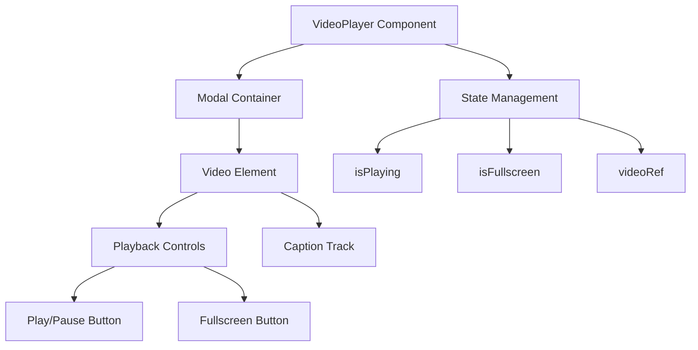
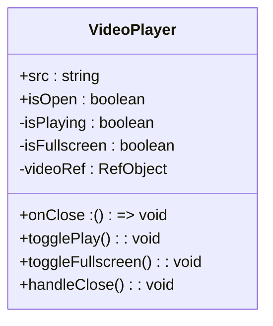
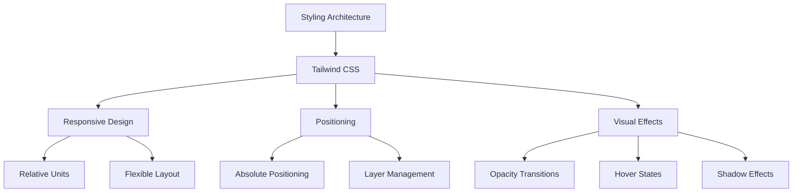
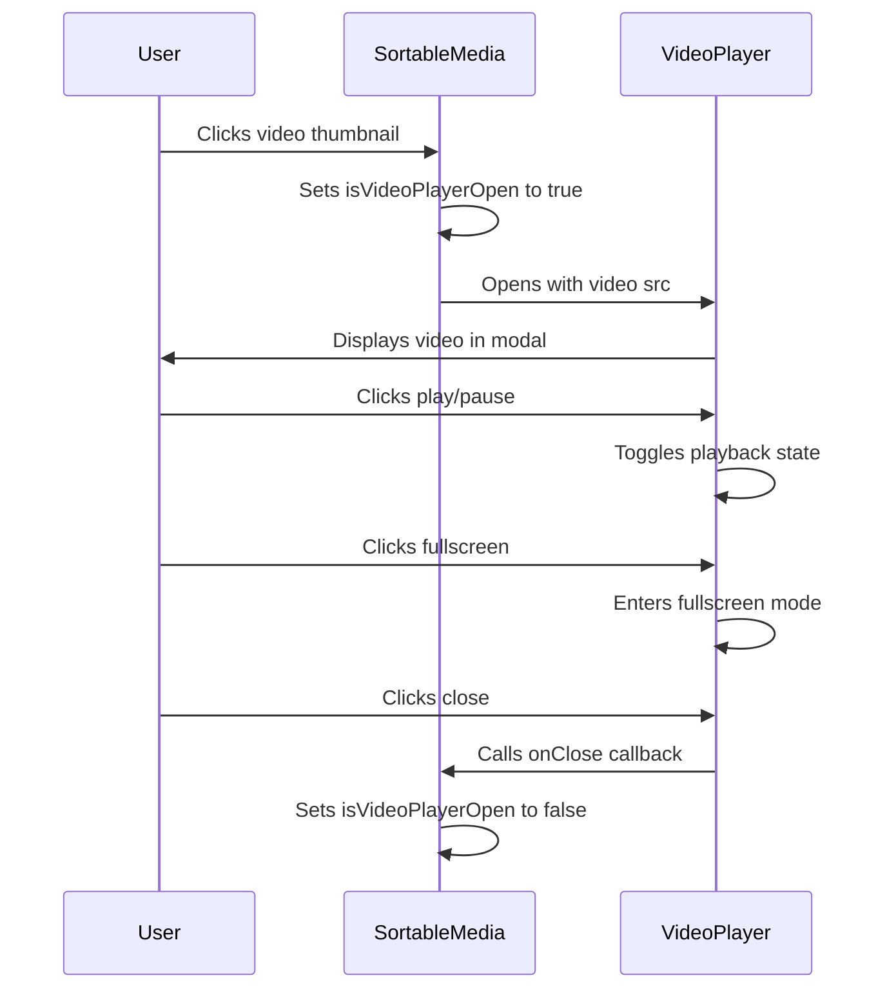
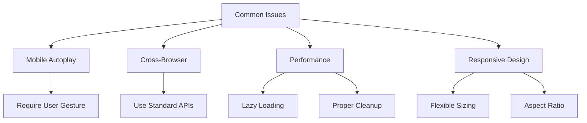
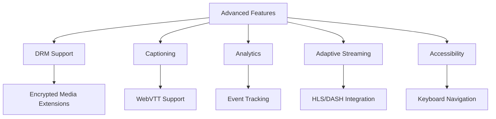

# VideoPlayer Component

<cite>
**Referenced Files in This Document**   
- [VideoPlayer.tsx](file://packages/ui/src/components/ui/data-display/VideoPlayer/VideoPlayer.tsx)
- [VideoPlayer.stories.tsx](file://packages/ui/src/components/ui/data-display/VideoPlayer/VideoPlayer.stories.tsx)
- [SortableMedia.tsx](file://packages/ui/src/components/ui/data-display/SortableMedia/SortableMedia.tsx)
- [FileUploader.tsx](file://packages/ui/src/components/ui/inputs/FileUploader/FileUploader.tsx)
</cite>

## Table of Contents
1. [Introduction](#introduction)
2. [Core Implementation](#core-implementation)
3. [Props API](#props-api)
4. [Styling Architecture](#styling-architecture)
5. [Integration Examples](#integration-examples)
6. [Common Issues and Solutions](#common-issues-and-solutions)
7. [Advanced Features](#advanced-features)
8. [Conclusion](#conclusion)

## Introduction
The VideoPlayer component is a modal-based video player implementation within the prj-core's UI library. It provides a clean, responsive interface for playing video content with essential controls for playback and fullscreen functionality. The component is designed to be reusable across different applications within the prj-core ecosystem, offering a consistent user experience for video playback.

**Section sources**
- [VideoPlayer.tsx](file://packages/ui/src/components/ui/data-display/VideoPlayer/VideoPlayer.tsx#L1-L95)

## Core Implementation

The VideoPlayer component is built using React and leverages the HTML5 video element for native video playback capabilities. It's implemented as a controlled component that manages its own playback state while being controlled by parent components through props.

The component uses React hooks extensively:
- `useState` for managing playback state (playing/paused) and fullscreen state
- `useRef` to maintain a reference to the video element for direct DOM manipulation
- `useEffect` for handling side effects when the modal isOpen state changes

The implementation follows a modal pattern, using the Modal and ModalContent components from the @heroui/react library to provide the container for the video player. This ensures consistent styling and behavior with other modal components in the application.

**Diagram sources**
- [VideoPlayer.tsx](file://packages/ui/src/components/ui/data-display/VideoPlayer/VideoPlayer.tsx#L12-L95)

**Section sources**
- [VideoPlayer.tsx](file://packages/ui/src/components/ui/data-display/VideoPlayer/VideoPlayer.tsx#L12-L95)

## Props API

The VideoPlayer component accepts three essential props that control its behavior and content:

- `src`: A string representing the URL of the video file to be played
- `isOpen`: A boolean that controls the visibility of the modal player
- `onClose`: A callback function that is called when the player is closed

These props follow a controlled component pattern, where the parent component manages the isOpen state and handles the onClose event. This design allows for flexible integration with various state management approaches and routing patterns.

The component also handles video playback internally, managing the play/pause state and providing visual feedback through icon changes (Play/Pause icons). The fullscreen functionality is implemented using the browser's native fullscreen API, with state synchronization to update the UI accordingly.

**Diagram sources**
- [VideoPlayer.tsx](file://packages/ui/src/components/ui/data-display/VideoPlayer/VideoPlayer.tsx#L6-L10)

**Section sources**
- [VideoPlayer.tsx](file://packages/ui/src/components/ui/data-display/VideoPlayer/VideoPlayer.tsx#L6-L10)

## Styling Architecture

The VideoPlayer component utilizes Tailwind CSS for styling, following a utility-first approach that enables rapid development and consistent design. The styling architecture combines several key techniques:

- **Responsive Design**: The player uses relative units (h-full, w-full) to ensure it adapts to different screen sizes and container dimensions
- **Layered Positioning**: Absolute positioning is used for the control overlay, allowing it to float over the video content
- **Visual Feedback**: Hover effects and opacity transitions enhance the user experience, with the control bar becoming more prominent on hover
- **Consistent Theme**: The component uses a dark theme with black background and white text/icons, providing good contrast for video content

The control overlay is implemented as a semi-transparent black bar positioned at the bottom of the video, containing playback controls. The opacity of this overlay increases on hover, providing a subtle visual cue that controls are available.

**Diagram sources**
- [VideoPlayer.tsx](file://packages/ui/src/components/ui/data-display/VideoPlayer/VideoPlayer.tsx#L58-L91)

**Section sources**
- [VideoPlayer.tsx](file://packages/ui/src/components/ui/data-display/VideoPlayer/VideoPlayer.tsx#L58-L91)

## Integration Examples

The VideoPlayer component is designed for flexible integration across different contexts within the application. It's used in various scenarios, including media galleries and file upload interfaces.

In the SortableMedia component, the VideoPlayer is used to provide a preview functionality for uploaded video files. When a user clicks on a video thumbnail, the VideoPlayer modal opens, allowing them to view the video in a larger format. This pattern separates the thumbnail display from the full player, optimizing performance by only loading the full player when needed.

Similarly, in the FileUploader component, the VideoPlayer could be integrated to provide previews of uploaded video files, following the same modal pattern. This consistent approach ensures a uniform user experience across different parts of the application.

**Diagram sources**
- [SortableMedia.tsx](file://packages/ui/src/components/ui/data-display/SortableMedia/SortableMedia.tsx#L37-L85)
- [VideoPlayer.tsx](file://packages/ui/src/components/ui/data-display/VideoPlayer/VideoPlayer.tsx#L56-L93)

**Section sources**
- [SortableMedia.tsx](file://packages/ui/src/components/ui/data-display/SortableMedia/SortableMedia.tsx#L37-L85)
- [FileUploader.tsx](file://packages/ui/src/components/ui/inputs/FileUploader/FileUploader.tsx#L90-L96)

## Common Issues and Solutions

The VideoPlayer implementation addresses several common challenges in video playback:

**Mobile Autoplay Restrictions**: While not explicitly handled in the current implementation, the component's design allows for easy adaptation to mobile autoplay policies by implementing user gesture requirements before playback initiation.

**Cross-Browser Compatibility**: By relying on the native HTML5 video element and standard fullscreen API, the component maintains good compatibility across modern browsers. The use of React refs ensures consistent access to the video element regardless of rendering patterns.

**Performance Optimization**: The modal-based approach ensures that video resources are only loaded when the player is opened, reducing initial page load time and memory usage. The component also properly cleans up playback state when closed, preventing memory leaks.

**Responsive Sizing**: The use of Tailwind's object-contain class ensures that videos maintain their aspect ratio while fitting within the available space, preventing distortion on different screen sizes.

**Section sources**
- [VideoPlayer.tsx](file://packages/ui/src/components/ui/data-display/VideoPlayer/VideoPlayer.tsx#L40-L46)
- [VideoPlayer.tsx](file://packages/ui/src/components/ui/data-display/VideoPlayer/VideoPlayer.tsx#L62-L63)

## Advanced Features

While the current implementation focuses on core playback functionality, the architecture supports potential enhancements for advanced features:

**DRM Support**: The component could be extended to support DRM-protected content by integrating with specialized media players or using encrypted media extensions (EME) API.

**Captioning and Subtitles**: The implementation already includes a captions track element, providing a foundation for supporting multiple subtitle languages and customizable caption styling.

**Analytics Integration**: The component's event callbacks could be extended to include analytics tracking for video engagement metrics such as play events, completion rates, and user interactions.

**Adaptive Bitrate Streaming**: Future versions could support adaptive streaming protocols like HLS or DASH by integrating with specialized libraries while maintaining the same API surface.

**Accessibility Features**: The component could be enhanced with additional accessibility features such as keyboard navigation, screen reader support, and customizable control sizes for users with motor impairments.

**Section sources**
- [VideoPlayer.tsx](file://packages/ui/src/components/ui/data-display/VideoPlayer/VideoPlayer.tsx#L65)
- [VideoPlayer.stories.tsx](file://packages/ui/src/components/ui/data-display/VideoPlayer/VideoPlayer.stories.tsx#L39)

## Conclusion
The VideoPlayer component provides a solid foundation for video playback within the prj-core ecosystem. Its clean implementation, use of standard web APIs, and integration with the UI library's design system make it a reliable choice for displaying video content. The component's architecture allows for both simple usage patterns and potential extensions for more advanced requirements. By following consistent patterns for state management and event handling, it integrates seamlessly with the rest of the application while providing a good user experience for video playback.