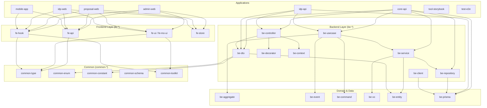

# PRJ Core 모노레포

> 현대적인 풀스택 예약 플랫폼을 위한 모노레포 아키텍처

[](https://www.typescriptlang.org/)
[](https://nodejs.org/)
[](https://pnpm.io/)
[](https://turbo.build/)
[](https://nestjs.com/)
[](https://react.dev/)
[](https://www.prisma.io/)
[](https://opensource.org/licenses/ISC)

## 📋 목차

- [프로젝트 개요](#-프로젝트-개요)
- [주요 기능](#-주요-기능)
- [기술 스택](#-기술-스택)
- [프로젝트 구조](#-프로젝트-구조)
- [시작하기](#-시작하기)
- [환경 설정](#-환경-설정)
- [개발 가이드](#-개발-가이드)
- [배포](#-배포)
- [라이선스](#-라이선스)

## 🎯 프로젝트 개요

**PRJ Core**는 필라테스, 헬스, 요가 등 다양한 피트니스 및 서비스 예약을 지원하는 멀티 도메인 예약 플랫폼입니다. Turborepo와 pnpm 워크스페이스를 활용한 Monorepo 아키텍처로 구성되어 있으며, 코드 재사용성과 개발 효율성을 극대화합니다.

> **⚠️ 중요 안내**  
> 이 프로젝트는 **학습 및 연구 목적**으로 제작되었습니다.
>
> - SI 프로젝트 수행을 위한 기본 기술 스택 학습
> - 모노레포 아키텍처 및 현대적인 개발 방법론 연구
> - 보안상 모든 환경 변수는 커밋되어 있지 않으며, 이미 커밋된 환경 변수는 전부 무효화(invalid)되었습니다.
> - 실제 배포용 프로젝트가 아닌 기술 학습을 위한 레퍼런스 프로젝트입니다.

### 핵심 설계 원칙

- **도메인 독립성**: 운동, 헤어샵, 마사지 등 다양한 비즈니스 도메인 확장 가능
- **타입 안정성**: TypeScript와 Prisma를 통한 end-to-end 타입 안정성
- **코드 재사용**: 공유 패키지를 통한 최대 코드 재사용
- **확장 가능성**: 멀티 테넌트 아키텍처로 무한 확장 가능

## ✨ 주요 기능

### 예약 관리

- 📅 **Timeline 기반 일정 관리**: 논리적 그룹으로 세션 관리
- 🔄 **반복 일정 지원**: 일회성/반복(주간, 월간) 세션
- 👥 **프로그램 관리**: 강사 배정, 정원 관리, 레벨 설정
- 🏃 **루틴 재사용**: 운동 루틴을 여러 프로그램에서 재사용

### 운동 관리

- 💪 **Exercise 시스템**: 운동별 세부 정보 (시간, 횟수, 이미지, 영상)
- 📊 **Activity 설정**: 운동 순서, 반복 횟수, 휴식 시간 커스터마이징
- 🎯 **Task 추상화**: 도메인 독립적 작업 관리

### 사용자 & 권한

- 🔐 **역할 기반 접근 제어 (RBAC)**: Space, Tenant 레벨 권한 관리
- 👤 **멀티 테넌트**: 여러 비즈니스를 하나의 플랫폼에서 관리
- 📱 **반응형 UI**: Admin 웹, 모바일 앱 지원

### 파일 관리

- 📁 **S3 통합**: AWS S3를 통한 이미지/영상 관리
- 📤 **업로드 UX**: react-dropzone 기반 드래그 앤 드롭 업로드

### 인증 & IDP

- 🔑 **자체 OIDC 인증 서버**: `idp-api`/`idp-web` 앱으로 로그인·동의·로그아웃(end_session) 플로우 제공
- 🎫 **OIDC 클라이언트 관리**: 멀티 클라이언트 등록/관리 — [oidc-client-ids 가이드](./docs/oidc-client-ids.guide.md)
- 📱 **모바일 OIDC 플로우**: Expo 앱 연동 — [mobile-oidc-flow 가이드](./docs/mobile-oidc-flow.guide.md)

### 품질 & 테스트

- 🧪 **테스트 피라미드**: Vitest 단위 테스트 + Playwright 관리자 e2e(`apps/test/e2e`) + 모바일 Detox E2E
- 🏗 **CI 게이트**: 타입 체크, Biome 린트/포맷, 퍼블릭 패키지 경계 검사

## 🛠 기술 스택

### Frontend

| 카테고리             | 기술            | 버전      | 설명                    |
| -------------------- | --------------- | --------- | ----------------------- |
| **Framework**        | React           | 19.2      | UI 라이브러리           |
| **Build Tool**       | Vite            | 6.4       | 번들러 및 개발 서버     |
| **Routing**          | TanStack Router | 1.x       | 타입 안전 라우팅        |
| **State Management** | MobX            | 6.13      | 반응형 상태 관리         |
| **Data Fetching**    | TanStack Query  | 5.83      | 서버 상태 관리          |
| **API Client**       | Orval 생성 클라이언트 | 8.x  | OpenAPI 기반 자동 생성 (`fe-api`) |
| **UI Components**    | HeroUI          | 3.1       | 컴포넌트 라이브러리     |
| **Styling**          | Tailwind CSS    | 4.3       | 유틸리티 CSS 프레임워크 |
| **Animations**       | Framer Motion   | 12.x      | 애니메이션 라이브러리   |
| **File Upload**      | react-dropzone  | 14.x      | 드래그 앤 드롭 업로드  |
| **Icons**            | Lucide React    | latest    | 아이콘 라이브러리       |

### Backend

| 카테고리             | 기술            | 버전      | 설명                |
| -------------------- | --------------- | --------- | ------------------- |
| **Framework**        | NestJS          | 11.2 | Node.js 프레임워크  |
| **Runtime**          | Node.js         | 22.18+ | JavaScript 런타임 |
| **Language**         | TypeScript      | 5.9  | 타입스크립트        |
| **ORM**              | Prisma          | 7.10 | 데이터베이스 ORM    |
| **Database**         | PostgreSQL      | 14+  | 관계형 데이터베이스 |
| **Cache**            | Redis (ioredis) | -    | 캐시/세션           |
| **Architecture**     | CQRS (@nestjs/cqrs) | 11.x | 커맨드/쿼리 분리 |
| **Authentication**   | Passport.js     | 0.7  | 인증 미들웨어       |
| **Authorization**    | CASL            | 6.x  | 권한 관리           |
| **Validation**       | class-validator | 0.14 | DTO 검증            |
| **API Docs**         | Swagger         | 11.4 | OpenAPI 문서화      |
| **File Storage**     | AWS S3          | 3.x  | 파일 스토리지       |
| **Email**            | Nodemailer      | 7.x  | 이메일 발송         |
| **Logging**          | Pino (nestjs-pino) | 4.x | 고성능 로깅       |

### DevOps & Tools

| 카테고리              | 기술          | 버전          | 설명               |
| --------------------- | ------------- | ------------- | ------------------ |
| **Monorepo**          | Turborepo     | latest        | 빌드 시스템        |
| **Package Manager**   | pnpm          | 10.34         | 패키지 매니저 + catalog |
| **Linter**            | Biome         | 2.1           | 린터 및 포매터     |
| **Testing**           | Vitest / Playwright / Detox | 4.x | 단위·e2e·모바일 E2E |
| **Secret Management** | OpenBao       | latest        | 환경 변수 관리     |
| **Storybook**         | Storybook     | 10.6          | UI 컴포넌트 문서화 |
| **CI/CD**             | Jenkins       | -             | 빌드 → Harbor push → GitOps 태그 범프 |

## 📁 프로젝트 구조

```
prj-core/
├── apps/                          # 애플리케이션
│   ├── core/api/                  # Core API — 메인 백엔드 (NestJS, http://localhost:3006)
│   ├── idp/api/                   # IDP API — OIDC 인증 서버 백엔드
│   ├── idp/web/                   # IDP Web — 로그인/동의 화면 (React + Vite)
│   ├── admin/web/                 # Admin 웹 (React + Vite, http://localhost:3000)
│   ├── proposal/web/              # Proposal 웹 (http://localhost:3011/proposal)
│   ├── mobile/                    # 모바일 앱 (Expo + Detox E2E)
│   ├── tool/storybook/            # 웹 UI 컴포넌트 문서화 (http://localhost:6006)
│   ├── tool/mobile-storybook/     # 모바일 UI 컴포넌트 문서화
│   └── test/e2e/                  # Playwright 기반 관리자 e2e (test-e2e)
├── packages/                      # 공유 패키지 (@cocrepo/* 스코프)
│   ├── be-prisma/                 # Prisma 스키마(schema/*.prisma)·마이그레이션·시드
│   ├── be-entity/                 # 데이터베이스 엔티티 타입
│   ├── be-vo/                     # Value Object (도메인 불변 값)
│   ├── be-aggregate/              # 도메인 집합체 (Aggregate)
│   ├── be-event/                  # 도메인 이벤트
│   ├── be-command/                # 쓰기 명령 (Command)
│   ├── be-dto/                    # Data Transfer Objects
│   ├── be-input/                  # 입력 모델/검증
│   ├── be-decorator/              # NestJS 데코레이터 모음
│   ├── be-controller/             # 컨트롤러 계층
│   ├── be-context/                # 요청 컨텍스트
│   ├── be-client/                 # 외부 클라이언트 (S3, Redis 등)
│   ├── be-repository/             # Repository 패턴 구현
│   ├── be-service/                # 비즈니스 로직 & 서비스 레이어
│   ├── be-usecase/                # CQRS UseCase/Handler 계층
│   ├── be-common/                 # 백엔드 공통 유틸
│   ├── fe-api/                    # Orval 자동 생성 API 클라이언트 (@cocrepo/api)
│   ├── fe-ui/                     # 공유 웹 UI 컴포넌트
│   ├── fe-mo-ui/                  # 공유 모바일 UI 컴포넌트
│   ├── fe-hook/                   # 공유 React Hook
│   ├── fe-store/                  # 공유 상태 관리 (MobX)
│   ├── fe-e2e/                    # e2e 지원 유틸
│   ├── common-type/               # 공유 TypeScript 타입
│   ├── common-enum/               # 공유 열거형
│   ├── common-constant/           # 공통 상수
│   ├── common-schema/             # 공유 스키마
│   ├── common-toolkit/            # 유틸리티 함수
│   └── common-tsconfig/           # 공유 tsconfig 프리셋
├── devops/                        # 앱별 Dockerfile·Jenkinsfile (+ ops 문서)
├── scripts/                       # 기동/릴리스/검증 스크립트
├── docs/                          # 가이드 문서 (env, OIDC, CQRS 마이그레이션 등)
├── biome.json                     # Biome 설정
├── pnpm-workspace.yaml            # pnpm 워크스페이스 + catalog 정의
├── turbo.json                     # Turborepo 설정
└── package.json                   # Root 패키지
```

### 패키지 의존성 다이어그램



> **📝 참고**: 패키지는 접두사로 계층을 구분합니다 — `be-*`(백엔드), `fe-*`(프론트엔드), `common-*`(양쪽 공용).
> 모든 워크스페이스 패키지는 `@cocrepo/*` 스코프로 참조하며, 의존성 버전은 `pnpm-workspace.yaml`의 catalog로 일괄 관리합니다.

## 🚀 시작하기

### 로컬 핵심 서비스 한 번에 실행

Docker Desktop과 Node.js 22+, pnpm 10+를 준비한 뒤 clean clone에서 실행합니다.

```bash
pnpm install --frozen-lockfile
cp apps/core/api/.env.example apps/core/api/.env
cp apps/admin/web/.env.example apps/admin/web/.env.local
cp apps/proposal/web/.env.example apps/proposal/web/.env.local
cp packages/be-prisma/.env.example packages/be-prisma/.env
pnpm start -- core-api admin-web proposal-web
```

위 명령은 로컬 PostgreSQL/Redis 컨테이너를 readiness까지 기동하고 migration과 멱등 bootstrap을 실행합니다. API는 `http://localhost:3006`, Admin은 `http://localhost:3000`, Proposal은 `http://localhost:3011`에서 확인합니다. Docker를 직접 관리하거나 원격 인프라를 사용할 때만 `START_SKIP_INFRA_START=1`과 `START_SKIP_INFRA_CHECK=1`을 명시합니다.

기동 실패 시 출력된 PostgreSQL/Redis 주소와 서비스명을 먼저 확인합니다. Docker daemon이 꺼져 있으면 Docker Desktop을 시작하고, 포트가 사용 중이면 해당 프로세스를 종료한 뒤 같은 명령을 다시 실행합니다.

### 사전 요구사항

- **Node.js**: 22.18.0 이상
- **pnpm**: 10.34.0 이상
- **PostgreSQL**: 14.x 이상

### 설치

1. **저장소 클론**

```bash
git clone https://github.com/kimjoongwon/prj-core.git
cd prj-core
```

1. **의존성 설치**

```bash
pnpm install
```

2. **환경 변수 설정**

로컬 개발에서는 각 앱/패키지 디렉터리의 `.env.example`을 `.env`로 복사합니다.
`.env.local`과 `.env.development.local`은 사용하지 않습니다.

```bash
cp apps/core/api/.env.example apps/core/api/.env
cp packages/be-prisma/.env.example packages/be-prisma/.env
```

> **💡 참고**: `.env.example`는 커밋되는 템플릿이고, 실제 로컬 실행은 각 디렉터리의 `.env`만 사용합니다.
> 배포 환경 변수는 `prj-devops`의 OpenBao를 통해 주입됩니다.

3. **데이터베이스 마이그레이션**

```bash
cd packages/be-prisma
pnpm db:migrate
pnpm db:seed
```

### 개발 서버 실행

```bash
# 대화형 실행기
pnpm start

# 개별 실행
pnpm start:core-api        # Core API (http://localhost:3006)
pnpm start:admin-web       # Admin 웹앱 (http://localhost:3000)
pnpm start:proposal-web    # Proposal 웹앱 (http://localhost:3011/proposal)
pnpm start:idp-api         # OIDC IDP API
pnpm start:idp-web         # OIDC IDP 웹 (로그인/동의 화면)
pnpm start:tool-storybook  # Storybook (http://localhost:6006)
pnpm start:mobile          # Expo 모바일 앱
```

> 인증/OIDC는 별도 앱(`idp-api`, `idp-web`)으로 분리되어 있습니다. 모바일은 `pnpm start:mobile`, 모바일 Storybook은 `pnpm start:mobile-storybook`으로 실행합니다.

## 🔧 환경 설정

### 환경 변수 관리

이 프로젝트의 환경 변수 규칙은 다음과 같습니다.

- 로컬 실행은 각 앱/패키지 디렉터리의 `.env`만 사용합니다.
- `.env.example`는 커밋되는 템플릿이며 런타임에서 직접 읽지 않습니다.
- `.env.local`, `.env.development.local`은 사용하지 않습니다.
- 배포 환경 변수는 `prj-devops`에서 관리하는 OpenBao를 통해 주입됩니다.

### 예제 파일

- `apps/core/api/.env.example`
- `packages/be-prisma/.env.example`
- 프로젝트별 env 키 표: [docs/env-reference.md](./docs/env-reference.md)

## 💻 개발 가이드

### 주요 명령어

```bash
# 빌드
pnpm build                    # 모든 패키지 및 앱 빌드
pnpm build:core-api           # Core API만 빌드
pnpm build:admin-web          # Admin 웹만 빌드
pnpm build:proposal-web       # Proposal 웹만 빌드
pnpm build:idp-api            # IDP API만 빌드
pnpm build:packages           # 패키지만 빌드

# 테스트
pnpm test                     # 모든 단위 테스트 (Vitest)
pnpm test:e2e                 # Playwright 관리자 e2e 전체
pnpm test:api:e2e             # API e2e
pnpm test:e2e:idp:local       # IDP 로컬 e2e

# 린트 & 포맷 (Biome)
pnpm lint                     # 린트 검사
pnpm lint:fix                 # 린트 자동 수정
pnpm format                   # 코드 포맷팅

# 타입 체크
pnpm type-check               # TypeScript 타입 검사

# 클린업
pnpm clean                    # 빌드 산출물 제거
```

### 패키지 관리

```bash
# 퍼블릭 패키지 버전 업데이트
pnpm version:patch           # 패치 버전 업데이트 (0.0.x)
pnpm version:minor           # 마이너 버전 업데이트 (0.x.0)
pnpm version:major           # 메이저 버전 업데이트 (x.0.0)

# 퍼블릭 패키지 배포
pnpm publish:packages        # 퍼블릭 패키지 배포
pnpm publish:dry             # Dry run (실제 배포 X)
pnpm public-packages:check   # 퍼블릭 경계 검사

# 릴리즈 (버전 업데이트 + 빌드 + 배포 + 앱 의존성 갱신)
pnpm release:patch
pnpm release:minor
pnpm release:major
```

### 데이터베이스 관리

```bash
cd packages/be-prisma

pnpm db:migrate              # 마이그레이션 생성 및 적용 (prisma migrate dev)
pnpm db:migrate:deploy       # 마이그레이션 배포 (stg/prod 변형 지원)
pnpm db:seed                 # 시드 + 멱등 bootstrap (db:bootstrap)
pnpm db:studio               # Prisma Studio 실행
pnpm generate                # Prisma Client 재생성
```

스키마는 `packages/be-prisma/schema/*.prisma`의 멀티파일로 관리하며, `pnpm schema:check`로 네이밍 컨벤션을 검증합니다.

### API 클라이언트 재생성

```bash
# 루트에서 실행 (packages/fe-api — Orval)
pnpm codegen:api
```

### 코드 스타일 가이드

- **네이밍 컨벤션**
  - 코드: `camelCase` (TypeScript, JavaScript)
  - DB 테이블/컬럼: `snake_case` (PostgreSQL)
  - 컴포넌트: `PascalCase` (React)
  - 상수: `UPPER_SNAKE_CASE`

- **파일 구조**
  - 기능별 모듈화
  - 도메인 기반 디렉토리 구조
  - 공유 코드는 `packages/`에 위치

- **커밋 메시지**

  커밋 메시지 형식과 허용 타입은 [프로젝트 공통 규칙](./AGENTS.md#커밋-메시지-규칙)을 따릅니다.

## 🏗 아키텍처

### 도메인 모델

```
[도메인 독립 계층]
Timeline → Session → Program → Routine → Activity → Task (추상)
                                           ↓
[도메인 전용 계층]                        Exercise (운동)
                                          Treatment (헤어샵 - 미래)
                                          Service (기타 - 미래)
```

- **Timeline**: 논리적 그룹핑 (예: "2025년 10월 첫째 주")
- **Session**: 실제 일정 (시작/종료 시간 포함)
- **Program**: 강사 배정, 정원 관리
- **Routine**: 재사용 가능한 운동 루틴
- **Activity**: 운동 순서, 반복 횟수, 휴식 시간
- **Task**: 도메인 독립적 추상 계층
- **Exercise**: 운동 도메인 (시간, 횟수, 이미지, 영상)

### 권한 관리 (RBAC)

```
Tenant (최상위 조직)
  ├── Space (하위 조직/지점)
  │   ├── Role (역할: OWNER, ADMIN, MEMBER)
  │   └── User (사용자)
  └── Permissions (CASL 기반 권한 관리)
```

## 🚢 배포

### Jenkins를 통한 배포 (운영)

앱별 Jenkinsfile이 `devops/`에 형상 관리됩니다(각 파일 옆에 `.ops.md` 운영 문서 동반).

```bash
# Jenkins 파이프라인 (예)
devops/Jenkinsfile.core-api        # Core API 빌드 → Harbor push → prj-deploy 태그 범프
devops/Jenkinsfile.admin-web       # Admin 웹
devops/Jenkinsfile.idp-api         # IDP API
devops/Jenkinsfile.gitops-update   # GitOps 변경 승인 잡
```

### 도커를 이용한 로컬 빌드

```bash
# 프로덕션 빌드
pnpm build

# 도커 이미지 빌드 (앱별 Dockerfile)
docker build -t prj-core-core-api:latest -f devops/Dockerfile.core-api .
docker build -t prj-core-admin-web:latest -f devops/Dockerfile.admin-web .
```

### Kubernetes 배포 (GitOps)

Kubernetes 배포에서는 런타임 `.env` 파일을 사용하지 않습니다.

- 차트·환경 설정: [prj-devops](https://github.com/kimjoongwon/prj-devops) (Helm + ArgoCD)
- 이미지 태그: [prj-deploy](https://github.com/kimjoongwon/prj-deploy) (Jenkins 빌드가 커밋 SHA 태그를 범프)
- 환경 변수: `prj-devops`에서 관리하는 OpenBao를 통해 주입

## 📚 추가 문서

- [환경 변수 참조](./docs/env-reference.md)
- [OIDC 클라이언트 ID 가이드](./docs/oidc-client-ids.guide.md)
- [모바일 OIDC 플로우 가이드](./docs/mobile-oidc-flow.guide.md)
- [CQRS UseCase 마이그레이션](./docs/backend/cqrs-usecase-migration.md)
- [로컬 개발 환경 다이어그램](./docs/local-dev-environment.diagram.md)
- [오케스트레이션 에이전트 관계 플로우](./docs/orchestration-agent-relationship-flow.md)
- API 문서: `http://localhost:3006/api/docs` (core-api 실행 후 접속)
- Storybook: `http://localhost:6006` (실행 후 접속)

## 🤝 기여하기

1. Fork the Project
2. Create your Feature Branch (`git checkout -b feature/AmazingFeature`)
3. Commit your Changes (`git commit -m 'feat: Add some AmazingFeature'`)
4. Push to the Branch (`git push origin feature/AmazingFeature`)
5. Open a Pull Request

## 📝 라이선스

이 프로젝트는 [ISC License](https://opensource.org/licenses/ISC) 하에 배포됩니다.

## 📧 문의

프로젝트 관련 문의사항은 이슈를 등록해주세요.

---

**타입스크립트, 리액트, NestJS, Prisma로 만들어졌습니다 ❤️**
```
