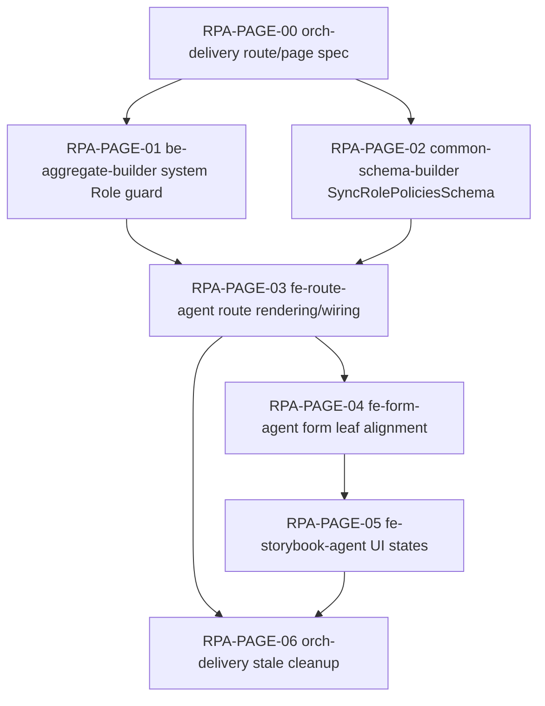

# Role Detail Policy Assignment Page Spec

## 목표

| 항목 | 내용 |
|------|------|
| route | `/roles/[roleId]` |
| route 파일 | `apps/admin/web/src/app/(admin)/roles/[roleId]/page.tsx` |
| 사용자 목표 | 운영자가 Role aggregate root 기준으로 최종 Policy assignment 상태를 보고, 변경하고, 저장합니다. |
| 운영 목표 | Role 상세 route 하나가 Role 기본 정보, 정책 할당 렌더링, API wiring, 저장 확인, 검증 계약을 단일 소유합니다. |
| 성공 기준 | `/roles/[roleId]`에서 현재 할당/미할당/활성/우선순위/변경 요약이 보이고, 저장 전 확인 후 `syncRolePolicies`로 전체 동기화합니다. |
| 범위 포함 | Role 상세 화면, 정책 할당 편집, 저장 확인 modal, 삭제 modal, 권한/시스템 Role readOnly 처리, route-local state와 테스트 |
| 범위 제외 | Policy 내부 Ability 구성 화면, Policy CRUD 자체 개편, Ability/Action/Subject CRUD 개편, 새 권한 엔진 |
| 기존 구현 재사용 후보 | `RoleEditScreen`, `RolePolicyAssignmentForm`, `RoleForm`, `getRoleById`, `getPolicies`, `getRolePolicies`, `syncRolePolicies`, `deleteRole` |
| 신규 생성/정리 사유 | Screen/Feature/Form 렌더링 계약을 route가 직접 소유하도록 정리하고, 중복 기획 문서를 제거합니다. |

## 사용자 / 역할 / 권한

| 사용자/역할 | 목적 | 허용 행동 | 제한/금지 | 관련 API | 비고 |
|-------------|------|-----------|-----------|----------|------|
| `PLATFORM_ADMIN` | Role 정책 할당 관리 | Role 조회, Policy 목록 조회, RolePolicy 조회, 비시스템 Role 정책 편집/저장, 비시스템 Role 수정/삭제 이동 | 시스템 Role 정책 저장/삭제 금지 | `getRoleById`, `getPolicies`, `getRolePolicies`, `syncRolePolicies`, `deleteRole` | primary actor |
| `COMPANY_MANAGER` | Role 기본 정보 확인 | Role 상세 조회 | 정책 할당 조회/수정 API 호출 금지 | `getRoleById` | route에서 assignment section을 숨기거나 readOnly 권한 안내로 처리합니다. |
| 시스템 Role | seed/권한 체계 보호 대상 | 조회 | 기본 정보 수정, 삭제, 정책 할당 저장 금지 | `getRoleById` | `role.isSystem=true`이면 정책 편집 CTA disabled |

## 도메인 모델 / 생명주기

| 도메인 객체 | 책임 | 주요 필드/값 | 상태/lifecycle | 정책/검증 | 소유 패키지 | 비고 |
|-------------|------|--------------|----------------|-----------|-------------|------|
| `Role` | 정책 할당 화면의 aggregate root | `id`, `name`, `displayName`, `description`, `isSystem`, `removedAt` | 조회 -> readOnly 표시 -> 비시스템 Role만 편집/삭제 | 시스템 Role은 삭제/수정/assignment 저장 금지 | `packages/be-prisma/schema/access-control/role.prisma`, `packages/be-aggregate/src/role/role.aggregate.ts` | route canonical root |
| `Policy` | Role에 할당 가능한 정책 후보 | `id`, `name`, `displayName`, `description`, `isSystem`, `policyAbilities` | 목록 조회 -> 검색/필터 -> 선택/해제 | 현재 scope에서 조회 가능한 Policy만 후보 | `packages/be-prisma/schema/access-control/policy.prisma` | row 렌더링 후보 |
| `RolePolicy` | Role과 Policy의 최종 할당 결과 | `roleId`, `policyId`, `isActive`, `priority` | baseline 조회 -> local edit -> 저장 확인 -> 전체 동기화 | 중복 `policyId` 제거, missing assignment soft remove, priority number 검증 | `packages/be-aggregate/src/policy/policy-assignment.aggregate.ts`, `packages/be-repository/src/role-policies.repository.ts` | 핵심 편집 대상 |

## 사용자 여정

| 여정 | 행위자 | 시작점 | 단계 | 완료 조건 | 실패/복구 | 관련 API |
|------|--------|--------|------|-----------|-----------|----------|
| Role 상세 확인 | `PLATFORM_ADMIN`, `COMPANY_MANAGER` | `/roles` 목록 | 상세 진입 -> Role 기본 정보 확인 -> 상태/시스템 여부 확인 | Role title, metadata, 상태가 보임 | 404면 목록 이동 CTA | `getRoleById` |
| 정책 할당 확인 | `PLATFORM_ADMIN` | Role 상세 | 정책 할당 section 확인 -> 현재 할당 수/활성 수/priority 확인 | 후보 Policy와 assignment 상태가 한 화면에서 보임 | policy API 실패 시 section error와 재시도 | `getPolicies`, `getRolePolicies` |
| 정책 할당 편집 | `PLATFORM_ADMIN` | 정책 할당 section | 편집 시작 -> 검색/필터 -> 선택/해제 -> active/priority 조정 -> 변경 요약 확인 | 저장 CTA가 dirty 상태에서 활성화 | 취소 시 baseline 복원 | local route state |
| 정책 할당 저장 | `PLATFORM_ADMIN` | 저장 CTA | 저장 확인 modal -> PUT -> 재조회 -> 성공 toast | 서버 baseline과 local state가 일치 | 400/403/404는 modal 유지 또는 section error 표시 | `syncRolePolicies`, `getRolePolicies` invalidation |
| 보호 Role 접근 | `PLATFORM_ADMIN` | 시스템 Role 상세 | 정책 할당 상태 확인 | 편집/삭제 CTA disabled | 강제 PUT 시 backend guard가 거부 | `getRoleById`, `getRolePolicies` |

## 백엔드 / API / 기반 계약

| 그룹 | 재사용/수정/신규 | 대상 파일 | 계약 | 소스 담당 `agent_type` | 소비/Wiring `agent_type` | 검증 `agent_type` |
|------|------------------|-----------|------|-------------------------|---------------------------|-------------------|
| Prisma / Database | 재사용 | `packages/be-prisma/schema/access-control/role.prisma`, `packages/be-prisma/schema/access-control/policy.prisma` | `Role` root, `Policy` root, `RolePolicy` assignment join 유지 | `be-prisma-builder` | `be-repository-builder` | `be-prisma-builder` |
| Common Schema | 신규 | `packages/common-schema/src/schemas/access-control/sync-role-policies.schema.ts` | route 저장 전 `rolePolicies[].policyId/isActive/priority` 검증에 사용할 `SyncRolePoliciesSchema` | `common-schema-builder` | `fe-route-agent` | `common-schema-builder` |
| DTO / Query DTO | 재사용 | `packages/be-dto/src/policy-assignments/*` | `SyncRolePoliciesDto`, `PolicyAssignmentResponseDto` 유지 | `be-dto-builder` | `be-controller-builder` | `be-dto-builder` |
| Repository | 재사용 | `packages/be-repository/src/role-policies.repository.ts` | 전체 동기화와 missing assignment soft remove 유지 | `be-repository-builder` | `be-aggregate-builder` | `be-repository-builder` |
| Aggregate | 수정 | `packages/be-aggregate/src/policy/policy-assignment.aggregate.ts` | `syncRolePolicies`에 시스템 Role assignment 변경 금지 guard 추가 | `be-aggregate-builder` | `be-usecase-builder` | `be-aggregate-builder` |
| UseCase / Command | 재사용 | `packages/be-usecase/src/core/policy-assignment/*`, `packages/be-command/src/core/*role-policies*` | 조회/저장 message 유지 | `be-usecase-builder` | `be-controller-builder` | `be-usecase-builder` |
| Controller | 재사용 | `packages/be-controller/src/policy-assignments/policy-assignments.controller.ts`, `packages/be-controller/src/roles/roles.controller.ts`, `packages/be-controller/src/policies/policies.controller.ts` | `getRoleById`, `getPolicies`, `getRolePolicies`, `syncRolePolicies`, `deleteRole` 소비 | `be-controller-builder` | `fe-route-agent` | `be-controller-builder` |
| Codegen / API Client | 재사용 | `packages/fe-api/src/core/**` | API shape 변경이 없으면 재생성 없음 | `fe-hook-agent` | `fe-route-agent` | `fe-hook-agent` |
| Route / UI State | 수정 | `apps/admin/web/src/app/(admin)/roles/[roleId]/page.tsx`, 필요 시 route-local util | route가 API, modal, dirty 계산, screen/feature/form 렌더링 계약을 단일 소유 | `fe-route-agent` | `fe-form-agent`, `fe-storybook-agent` | `fe-route-agent` |
| Form Component | 수정 가능 | `packages/fe-ui/src/form/RolePolicyAssignmentForm/*`, `packages/fe-ui/src/form/RoleForm/*` | 별도 spec 없이 이 route spec의 렌더링 계약에 맞춰 입력 leaf를 정리 | `fe-form-agent` | `fe-route-agent` | `fe-form-agent` |

## 디자인 정렬

- 정보 위계: Role 식별 정보 -> 시스템/삭제 상태 -> 정책 할당 요약 -> 정책 후보 목록 -> 변경 요약/저장 순서로 읽힙니다.
- Navigation: `/roles/[roleId]`가 Role Policy assignment의 canonical route입니다. Policy 이름은 `/policies/[policyId]`로 이동하되, Policy 생성/수정 form을 이 route 안에 중첩하지 않습니다.
- Platform density: Admin desktop 화면이므로 table/list density를 우선합니다. 카드형 반복보다 한 줄에서 policy name, ability count, assigned, active, priority를 스캔할 수 있어야 합니다.
- Visual safety: 저장 전 변경 건수와 위험 문구를 modal과 sticky summary에 반복 노출합니다. `primary`는 저장, `warning`은 해제/변경, `danger`는 삭제에만 사용합니다.
- Lazyweb quick reference: `role permissions admin` desktop 검색에서 Clerk, Hygraph, Roadie, Conduktor, Teachable 화면이 공통적으로 sidebar + role header + permission table/list + search/filter + checkbox/toggle 조합을 사용합니다. 이 route는 그 패턴을 기존 Admin density와 HeroUI token 안에서 적용합니다.

## 컴포넌트 재사용 / 렌더링 인벤토리

### route 조합 컴포넌트

| 컴포넌트 | 상태 | 경로 | route에서 맡길 계약 | 수정 owner | 비고 |
|----------|------|------|---------------------|------------|------|
| `RoleEditScreen` | 재사용 | `packages/fe-ui/src/screen/RoleEditScreen/RoleEditScreen.tsx` | Role 상세 page shell, `title`, `description`, `actions`, `readOnly`, `isLoading`, `notFound`, `children` 주입 | `fe-route-agent` 소비 | 별도 spec 없이 이 route spec의 화면 계약을 따릅니다. |
| `RoleForm` | 재사용 | `packages/fe-ui/src/form/RoleForm/RoleForm.tsx` | Role 기본 정보 readOnly 렌더링, name/displayName/description/isSystem 표시 | `fe-form-agent` 수정 가능 | 기본 정보 form 자체 구조는 유지합니다. |
| `RolePolicyAssignmentForm` | 수정 | `packages/fe-ui/src/form/RolePolicyAssignmentForm/RolePolicyAssignmentForm.tsx` | Policy 후보 목록, 선택/해제, active switch, priority input, loading/empty/readOnly 표시 | `fe-form-agent` | 검색/필터/정렬/table-like density는 이 route spec 기준으로 보강합니다. |
| route page | 수정 | `apps/admin/web/src/app/(admin)/roles/[roleId]/page.tsx` | API query/mutation, permission guard, modal open/close, baseline/current assignment state, dirty summary 계산 | `fe-route-agent` | screen/feature/form 렌더링 계약의 최종 owner입니다. |

### layout / widget / input 재사용

| 컴포넌트 | 상태 | 경로 | 사용 위치 | route 계약 | 비고 |
|----------|------|------|-----------|-------------|------|
| `Screen.Header` / `Section.Header` | 재사용 | `packages/fe-ui/src/layout/Screen/Screen.tsx`, `packages/fe-ui/src/layout/Section/Section.tsx` | 상단 title/actions, 정책 할당 section header | title, description, actions 전달 | 별도 title bar 컴포넌트 없이 각 layout slot에서 처리 |
| `Section` | 재사용 | `packages/fe-ui/src/layout/Section/Section.tsx` | Role 기본 정보, 추가 정보, 정책 할당 section | `Section.Header`, `Section.Body`, 필요 시 `Section.Footer` | page section 구조만 담당 |
| `SectionSurface` | 재사용 | `packages/fe-ui/src/surface/SectionSurface/SectionSurface.tsx` | page-level surface | 기존 screen shell surface 유지 | 중첩 card처럼 보이지 않게 section-level만 사용 |
| `Button` | 재사용 | `packages/fe-ui/src/input/Button/Button.tsx` | 목록/수정/삭제/정책 편집/취소/저장 | lucide icon을 `startContent`로 전달 | icon 없는 긴 설명 버튼 금지 |
| `AlertDialog` | 우선 재사용 | `packages/fe-ui/src/feedback/AlertDialog/AlertDialog.tsx` | Role 삭제, 정책 저장 확인 | `Heading`, `Body`, `Footer`, confirm button 조합 | 변경 summary가 복잡해도 custom widget을 만들지 않고 AlertDialog slot으로 표현 |
| `Modal` | 조건부 재사용 | `@heroui/react` | 복잡한 저장 summary modal | AlertDialog로 표현이 어려운 경우만 사용 | route-local modal state는 `useOverlayState` |
| `Chip` | 재사용 | `packages/fe-ui/src/data-display/Chip/Chip.tsx` | Role/system/status, assigned/active/dirty count | 색상 역할: primary/success/warning/default | summary와 row 상태 표시 |
| `TextField` | 재사용 | `packages/fe-ui/src/input/TextField/TextField.tsx` | 검색 입력, priority number input | 검색은 route-local state, priority는 assignment state 수정 | priority input width 고정 |
| `Checkbox` | 재사용 | `packages/fe-ui/src/input/Checkbox/Checkbox.tsx` | Policy row 선택/해제 | readOnly에서는 숨김 | row 전체 layout이 흔들리지 않게 고정 영역 유지 |
| `Switch` | 재사용 | `packages/fe-ui/src/input/Switch/Switch.tsx` | assignment active toggle | 선택된 policy row에서만 enabled | readOnly에서는 static text로 대체 가능 |
| `EmptyState` | 재사용 가능 | `packages/fe-ui/src/feedback/EmptyState/EmptyState.tsx` | empty policies, permission 안내 | 기존 empty 문구와 CTA 표현 | 단순 문구면 form 내부 empty block 허용 |

### 신규 생성 금지 / 수정 기준

| 항목 | 결정 |
|------|------|
| 신규 Screen spec | 만들지 않습니다. 화면 렌더링은 이 route/page spec이 소유합니다. |
| 신규 Feature spec | 만들지 않습니다. 정책 할당 feature 렌더링은 이 route/page spec이 소유합니다. |
| 신규 `RolePolicyAssignmentPanel` | 만들지 않습니다. route가 section/header/dirty summary/modal을 소유하고, `RolePolicyAssignmentForm`은 입력 leaf로 유지합니다. |
| 신규 DataGrid | 이번 scope에서는 만들지 않습니다. table-like list를 `RolePolicyAssignmentForm` 내부 markup으로 구현합니다. 이후 공용화가 필요할 때 별도 승인합니다. |
| 기존 `RolePolicyAssignmentForm` 수정 기준 | 검색/필터/정렬, dense row, readOnly/static row, loading/empty를 이 spec의 화면 러프에 맞춰 보강합니다. |

## 화면 렌더링

### 읽기 모드 화면

```text
+--------------------------------------------------------------------------------+
| Role 상세                                             [목록으로] [수정] [삭제] |
| 운영 관리자 Role의 상세 정보입니다.                                            |
+--------------------------------------------------------------------------------+

+--------------------------------------------------------------------------------+
| 운영 관리자                                                [사용자 Role] [사용 중] |
| Role ID  7c0...91a     name  space-admin                                  |
| 설명     워크스페이스 운영을 관리하는 Role                                      |
| 생성일   2026-03-18     수정일 2026-07-04                                      |
+--------------------------------------------------------------------------------+

+--------------------------------------------------------------------------------+
| 정책 할당                                      할당 4  활성 3  비활성 1          |
| 현재 Role에 연결된 Policy assignment를 관리합니다.                 [정책 편집] |
+--------------------------------------------------------------------------------+
| 검색 [ 정책명, 설명 검색                                           ]  정렬 [우선순위 v] |
| 필터 [전체] [할당됨] [미할당] [활성] [비활성] [시스템]                          |
+--------------------------------------------------------------------------------+
| 상태      Policy                         Ability   활성 상태      우선순위       |
|--------------------------------------------------------------------------------|
| 할당됨    사용자 관리                    12        활성          10             |
|           사용자를 조회하고 기본 정보를 수정합니다.               [시스템]       |
|--------------------------------------------------------------------------------|
| 할당됨    예약 운영                       8        활성           20             |
|           예약 생성, 변경, 취소를 운영합니다.                    [공간]         |
|--------------------------------------------------------------------------------|
| 미할당    운영 리포트                     5        -              -             |
|           운영 지표와 처리 상태를 확인합니다.                    [공간]         |
|--------------------------------------------------------------------------------|
| 할당됨    보안 설정                       4        비활성         90             |
|           인증 정책과 세션 정책을 관리합니다.                    [시스템]       |
+--------------------------------------------------------------------------------+
```

읽기 모드에서 `Policy` row는 선택 checkbox와 입력 control을 숨깁니다. 운영자가 현 상태를 빠르게 스캔할 수 있게 `할당 상태`, `활성 상태`, `우선순위`, `Ability 수`를 table-like list로 고정합니다.

### 편집 모드 화면

```text
+--------------------------------------------------------------------------------+
| Role 상세                                             [목록으로] [수정] [삭제] |
| 운영 관리자 Role의 상세 정보입니다.                                            |
+--------------------------------------------------------------------------------+

+--------------------------------------------------------------------------------+
| 정책 할당                    할당 5  활성 4  비활성 1  추가 1  해제 0  수정 2   |
| 현재 Role에 연결된 Policy assignment를 관리합니다.             [취소] [저장]    |
+--------------------------------------------------------------------------------+
| 검색 [ 예약                                               ]  정렬 [우선순위 v]  |
| 필터 [전체] [할당됨] [미할당] [활성] [비활성] [시스템]                          |
+--------------------------------------------------------------------------------+
| 선택   Policy                         Ability   Active          Priority        |
|--------------------------------------------------------------------------------|
| [x]    사용자 관리                    12        (on) 활성       [10       ]     |
|        사용자를 조회하고 기본 정보를 수정합니다.                 [시스템]       |
|--------------------------------------------------------------------------------|
| [x]    예약 운영                       8        (on) 활성       [20       ]     |
|        예약 생성, 변경, 취소를 운영합니다.                      [공간]         |
|--------------------------------------------------------------------------------|
| [x]    예약 감사                       3        (on) 활성       [30       ]     |
|        예약 변경 이력을 조회합니다.                              [공간] [추가] |
|--------------------------------------------------------------------------------|
| [ ]    운영 리포트                     5        disabled         -              |
|        운영 지표와 처리 상태를 확인합니다.                      [공간]         |
+--------------------------------------------------------------------------------+
| 변경 요약: 추가 1개 | 해제 0개 | 수정 2개                         [저장 확인] |
+--------------------------------------------------------------------------------+
```

편집 모드에서 route는 baseline assignment와 current assignment를 둘 다 보존합니다. row 선택은 assignment 생성/제거를 의미하고, active switch와 priority input은 선택된 row에서만 활성화됩니다.

### 시스템 Role / 권한 없음 화면

```text
+--------------------------------------------------------------------------------+
| Role 상세                                                      [목록으로]       |
| 플랫폼 관리자 Role의 상세 정보입니다.                                           |
+--------------------------------------------------------------------------------+

+--------------------------------------------------------------------------------+
| 플랫폼 관리자                                      [시스템 Role] [보호됨]       |
| 시스템 Role은 권한 체계 보호 대상입니다.                                        |
+--------------------------------------------------------------------------------+

+--------------------------------------------------------------------------------+
| 정책 할당                                      할당 6  활성 6  비활성 0          |
| 시스템 Role의 정책 할당은 조회만 가능합니다.                                    |
+--------------------------------------------------------------------------------+
| 상태      Policy                         Ability   활성 상태      우선순위       |
|--------------------------------------------------------------------------------|
| 할당됨    전체 플랫폼 관리                25        활성           0             |
| 할당됨    보안 정책 관리                  11        활성          10             |
+--------------------------------------------------------------------------------+
```

`COMPANY_MANAGER`처럼 assignment 권한이 없는 사용자는 정책 할당 API를 호출하지 않습니다. 이 경우 route는 Role 기본 정보만 렌더링하거나 아래 안내를 표시합니다.

```text
+--------------------------------------------------------------------------------+
| 정책 할당                                                                       |
| 이 Role의 정책 할당을 볼 권한이 없습니다.                                       |
| 필요한 경우 플랫폼 관리자에게 권한을 요청하세요.                                |
+--------------------------------------------------------------------------------+
```

### 로딩 / 빈 상태 / 오류 화면

```text
loading role
+--------------------------------------------------------------------------------+
| Role 상세                                                                       |
| [title skeleton]                                                                |
+--------------------------------------------------------------------------------+
| [Role summary skeleton]                                                         |
| [Policy assignment skeleton rows]                                                |
+--------------------------------------------------------------------------------+

not found
+--------------------------------------------------------------------------------+
| Role을 찾을 수 없습니다.                                                        |
| 삭제되었거나 접근할 수 없는 Role입니다.                              [목록으로] |
+--------------------------------------------------------------------------------+

empty policies
+--------------------------------------------------------------------------------+
| 정책 할당                                                        [정책 편집]    |
| 사용 가능한 정책이 없습니다.                                                     |
| 먼저 Policy를 생성한 뒤 Role에 할당할 수 있습니다.                              |
+--------------------------------------------------------------------------------+

save error
+--------------------------------------------------------------------------------+
| 정책 할당 저장                                                                  |
| 저장하지 못했습니다. 변경 내용을 유지한 상태로 다시 시도할 수 있습니다.          |
| 원인: 시스템 Role은 정책 할당을 변경할 수 없습니다.                 [다시 시도] |
+--------------------------------------------------------------------------------+
```

### 저장 확인 modal

```text
+----------------------------------------------+
| 정책 할당 저장                               |
+----------------------------------------------+
| 다음 변경을 저장합니다.                      |
|                                              |
| 추가 1개                                     |
| 해제 0개                                     |
| 수정 2개                                     |
|                                              |
| 저장 후 RolePolicy가 서버 기준으로 전체      |
| 동기화됩니다.                                |
+----------------------------------------------+
|                              [취소] [저장]   |
+----------------------------------------------+
```

### 삭제 modal

```text
+----------------------------------------------+
| Role 삭제                                    |
+----------------------------------------------+
| 운영 관리자 Role을 삭제하시겠습니까?         |
| 이 작업은 되돌릴 수 없습니다.                |
+----------------------------------------------+
|                              [취소] [삭제]   |
+----------------------------------------------+
```

### 상태별 렌더링

| 상태 | 화면 렌더링 | 이벤트 |
|------|-------------|--------|
| loading role | title skeleton, body loading | route param 유지 |
| role not found | "Role을 찾을 수 없습니다."와 목록 CTA | 목록으로 이동 |
| loading policies | Policy Assignment body loading | 편집 CTA disabled |
| empty policies | "사용 가능한 정책이 없습니다." | 저장 disabled |
| permission denied | Role 기본 정보만 표시, assignment section 숨김 또는 권한 안내 | assignment API 호출 금지 |
| readOnly system role | 정책 목록은 표시, 편집/삭제 CTA disabled | PUT/DELETE 호출 금지 |
| editing clean | 취소 표시, 저장 disabled | baseline 복원 가능 |
| editing dirty | 변경 summary 표시, 저장 enabled | 저장 확인 modal open |
| saving | 저장 modal button loading | 성공 시 modal close, editing false, query invalidation |
| save error | modal 또는 section error 표시 | modal 유지, 재시도 가능 |

## 상태 / 이벤트 / 데이터 계약

| 계약 | 소유 위치 | 입력 | 출력/이벤트 | 비고 |
|------|-----------|------|-------------|------|
| route param | `page.tsx` | `roleId` | API path param | UUID 검증은 route/schema에서 보강 가능 |
| role query | `page.tsx` | `roleId` | `role`, `isLoading`, `notFound` | `getRoleById` |
| policy candidate query | `page.tsx` | current auth scope | `policies` | 권한 없는 사용자는 호출하지 않습니다. |
| assignment query | `page.tsx` | `roleId` | baseline assignments | 권한 없는 사용자는 호출하지 않습니다. |
| local assignment state | `page.tsx` 또는 route-local state file | baseline assignments | current assignments, dirty counts | route가 baseline/current 원천을 보존합니다. |
| policy row rendering | `RolePolicyAssignmentForm` leaf | policy, assignment, readOnly | toggle/select/priority event | 렌더링 계약은 이 route spec이 소유합니다. |
| save event | `page.tsx` | current assignments | `syncRolePolicies({ roleId, data })` | 저장 전 `SyncRolePoliciesSchema` 검증 |
| cancel event | `page.tsx` | baseline assignments | current reset, editing false | modal close 포함 |
| delete event | `page.tsx` | roleId | `deleteRole`, 목록 이동 | 시스템 Role에서는 CTA 숨김/disabled |

## 딜리버리

### 산출물 시뮬레이션 / 인계 계약

| 단계 id | 단계 | 담당 `agent_type` | 입력 spec/파일 | 예상 산출물 | 생성/수정 예정 경로 | 소비 단계 / `agent_type` | 인계 조건 | 검증 기준 |
|---------|------|-------------------|----------------|-------------|----------------------|---------------------------|-----------|-----------|
| RPA-PAGE-00 | route/page spec 확정 | `orch-delivery` | 사용자 요청, 기존 route 조사 | 단일 route/page spec | `apps/admin/web/src/app/(admin)/roles/[roleId]/page.spec.md` | RPA-PAGE-01, RPA-PAGE-02, RPA-PAGE-03 / owners | 화면 러프와 산출물 경로가 route spec 안에 존재 | `rg -n "화면 렌더링|산출물 시뮬레이션" apps/admin/web/src/app/\\(admin\\)/roles/\\[roleId\\]/page.spec.md` |
| RPA-PAGE-01 | backend guard | `be-aggregate-builder` | 이 spec, `packages/be-aggregate/src/policy/policy-assignment.aggregate.ts` | 시스템 Role assignment 변경 금지 guard/test | `packages/be-aggregate/src/policy/policy-assignment.aggregate.ts`, `packages/be-aggregate/__tests__/policy-assignment.aggregate.spec.ts` | RPA-PAGE-03 / `fe-route-agent` | sync 시 system role이면 forbidden, 조회는 허용 | aggregate unit test |
| RPA-PAGE-02 | common schema | `common-schema-builder` | 이 spec | `SyncRolePoliciesSchema`와 export/test | `packages/common-schema/src/schemas/access-control/sync-role-policies.schema.ts`, `packages/common-schema/src/schemas/access-control/index.ts`, `packages/common-schema/src/schemas/index.ts`, `packages/common-schema/src/schemas/access-control/sync-role-policies.schema.test.ts` | RPA-PAGE-03 / `fe-route-agent` | schema export name 확정 | common-schema typecheck/test |
| RPA-PAGE-03 | route rendering/wiring | `fe-route-agent` | 이 spec, RPA-PAGE-01, RPA-PAGE-02 | Role detail route refactor | `apps/admin/web/src/app/(admin)/roles/[roleId]/page.tsx`, 필요 시 `apps/admin/web/src/app/(admin)/roles/[roleId]/*.ts` | RPA-PAGE-04, RPA-PAGE-06 / `fe-form-agent`, `fe-route-agent` | route가 API, modal, dirty, screen/feature/form 렌더링을 소유 | admin-web typecheck |
| RPA-PAGE-04 | form leaf alignment | `fe-form-agent` | 이 spec, RPA-PAGE-03 | assignment input leaf 정리 | `packages/fe-ui/src/form/RolePolicyAssignmentForm/*`, `packages/fe-ui/src/form/RoleForm/*` | RPA-PAGE-05, RPA-PAGE-06 / `fe-storybook-agent`, `fe-route-agent` | 검색/필터/선택/활성/우선순위 입력 이벤트가 route 계약과 일치 | ui typecheck/unit test |
| RPA-PAGE-05 | Storybook states | `fe-storybook-agent` | 이 spec, RPA-PAGE-04 | route 계약 기반 UI 상태 stories | `packages/fe-ui/src/form/RolePolicyAssignmentForm/*.stories.tsx` 또는 기존 story 위치 | RPA-PAGE-06 / `fe-route-agent` | loading/empty/readOnly/dirty/long text 포함 | storybook check 또는 build |
| RPA-PAGE-06 | stale cleanup | `orch-delivery` | 완료 보고 | 중복 기획 문서 제거 확인 | none-cleanup | none-cleanup | route/page spec 외 중복 화면 spec 없음 | 금지 grep 0건 |

### 에이전트 배정 매트릭스

| 단계 id | 단계 | 담당 `agent_type` | 입력 파일 | 출력 파일 또는 생성 결과 경로 | 수정 허용 파일 | 의존 단계 | 소비 단계 | 산출물 행 id | 병렬 | 완료 조건 |
|---------|------|-------------------|-----------|-------------------------------|----------------|-----------|-----------|---------------|------|-----------|
| RPA-PAGE-00 | spec 확정 | `orch-delivery` | repo 조사 결과 | `apps/admin/web/src/app/(admin)/roles/[roleId]/page.spec.md` | route spec, 중복 spec 삭제 | none | RPA-PAGE-01, RPA-PAGE-02, RPA-PAGE-03 | RPA-PAGE-00 | false | 단일 route/page spec 존재 |
| RPA-PAGE-01 | backend guard | `be-aggregate-builder` | route spec | aggregate guard/test | aggregate/test 파일 | RPA-PAGE-00 | RPA-PAGE-03 | RPA-PAGE-01 | true | aggregate test 통과 |
| RPA-PAGE-02 | common schema | `common-schema-builder` | route spec | schema/test/export | common-schema access-control 파일 | RPA-PAGE-00 | RPA-PAGE-03 | RPA-PAGE-02 | true | schema 검증 통과 |
| RPA-PAGE-03 | route wiring | `fe-route-agent` | route spec, backend/schema 결과 | page route | route 파일과 route-local util | RPA-PAGE-01, RPA-PAGE-02 | RPA-PAGE-04, RPA-PAGE-06 | RPA-PAGE-03 | false | admin route 검증 |
| RPA-PAGE-04 | form leaf | `fe-form-agent` | route spec | form leaf | form 파일 | RPA-PAGE-03 | RPA-PAGE-05, RPA-PAGE-06 | RPA-PAGE-04 | false | ui 검증 |
| RPA-PAGE-05 | stories | `fe-storybook-agent` | route spec, form 결과 | stories | story 파일 | RPA-PAGE-04 | RPA-PAGE-06 | RPA-PAGE-05 | true | story 검증 |
| RPA-PAGE-06 | cleanup | `orch-delivery` | 완료 보고 | cleanup report | 중복 spec/legacy spec 삭제 | RPA-PAGE-03, RPA-PAGE-05 | none | RPA-PAGE-06 | false | 금지 grep 0건 |

### 실행 그래프



### 단계 순서 표

| 순서 | 단계 id | 단계 | 직렬/병렬 | 의존 단계 | 완료 조건 |
|------|---------|------|-----------|-----------|-----------|
| 1 | RPA-PAGE-00 | route/page spec | 직렬 | none | 승인 |
| 2 | RPA-PAGE-01 | backend guard | 병렬 가능 | RPA-PAGE-00 | aggregate 검증 |
| 3 | RPA-PAGE-02 | common schema | 병렬 가능 | RPA-PAGE-00 | schema 검증 |
| 4 | RPA-PAGE-03 | route wiring | 직렬 | RPA-PAGE-01, RPA-PAGE-02 | admin-web 검증 |
| 5 | RPA-PAGE-04 | form leaf | 직렬 | RPA-PAGE-03 | ui 검증 |
| 6 | RPA-PAGE-05 | stories | 병렬 가능 | RPA-PAGE-04 | story 검증 |
| 7 | RPA-PAGE-06 | cleanup | 직렬 | RPA-PAGE-03, RPA-PAGE-05 | 금지 grep 0건 |

## 테스트 인벤토리 / owner 검증

### 단위 테스트 인벤토리

| 테스트 대상 | 검증 항목 | 테스트 파일 | mock/stub | 작성 agent_type | 검증 agent_type | 통과 기준 |
|-------------|-----------|-------------|-----------|------------------|------------------|-----------|
| `SyncRolePoliciesSchema` | UUID, boolean, priority number, empty array, duplicate policy handling | `packages/common-schema/src/schemas/access-control/sync-role-policies.schema.test.ts` | none | `common-schema-builder` | `common-schema-builder` | Given-When-Then 통과 |
| `PolicyAssignmentAggregate` | 시스템 Role sync 금지, non-system sync 허용, 조회 허용 | `packages/be-aggregate/__tests__/policy-assignment.aggregate.spec.ts` | repository mock | `be-aggregate-builder` | `be-aggregate-builder` | forbidden/pass 케이스 통과 |
| route dirty mapper | added/removed/updated count, baseline reset | `apps/admin/web/src/app/(admin)/roles/[roleId]/page.test.tsx` 또는 route-local util test | policy fixture | `fe-route-agent` | `fe-route-agent` | dirty summary 계산 일치 |
| `RolePolicyAssignmentForm` | 선택/해제, active toggle, priority change, readOnly guard | `packages/fe-ui/src/form/RolePolicyAssignmentForm/RolePolicyAssignmentForm.test.tsx` | local state fixture | `fe-form-agent` | `fe-form-agent` | event와 disabled guard 통과 |

### E2E 테스트 인벤토리

| 시나리오 | 검증 흐름 | 테스트 파일 | mock/stub | 작성 agent_type | 검증 agent_type | 통과 기준 |
|----------|-----------|-------------|-----------|------------------|------------------|-----------|
| Role 정책 할당 조회 | `/roles` -> 상세 -> 정책 할당 요약/목록 확인 | `apps/admin/web/src/app/(admin)/roles/[roleId]/page.e2e.ts` | existing seed | `fe-route-agent` | `fe-route-agent` | heading, summary, list visible |
| Role 정책 변경 저장 | 편집 -> policy 선택/해제 -> 저장 확인 -> PUT -> 성공 toast -> 재조회 | `apps/admin/web/src/app/(admin)/roles/[roleId]/page.e2e.ts` | policy/role seed | `fe-route-agent` | `fe-route-agent` | 변경 건수와 저장 결과 확인 |
| 시스템 Role 보호 | 시스템 Role 상세 -> 정책 편집/삭제 CTA disabled -> PUT/DELETE 호출 없음 | `apps/admin/web/src/app/(admin)/roles/[roleId]/page.e2e.ts` | system role seed | `fe-route-agent` | `fe-route-agent` | 보호 UI와 no mutation 확인 |
| 권한 없는 사용자 | `COMPANY_MANAGER`로 상세 접근 -> assignment API 미호출/권한 안내 | `apps/admin/web/src/app/(admin)/roles/[roleId]/page.e2e.ts` | auth fixture | `fe-route-agent` | `fe-route-agent` | 403 toast 없이 기본 정보 표시 |

### 정적 검증 / 금지 grep

| 검증 항목 | 명령 | 검증 agent_type | 통과 기준 |
|-----------|------|------------------|-----------|
| admin web typecheck | `pnpm --filter=admin-web run type-check` | `fe-route-agent` | 0 errors |
| ui typecheck | `pnpm --filter=@cocrepo/ui run type-check` | `fe-form-agent` | 0 errors |
| common schema typecheck | `pnpm --filter=@cocrepo/common-schema run type-check` | `common-schema-builder` | 0 errors |
| aggregate guard test | `pnpm --filter=@cocrepo/aggregate exec vitest run packages/be-aggregate/__tests__/policy-assignment.aggregate.spec.ts` | `be-aggregate-builder` | 0 failures |
| 단일 spec 확인 | `find docs apps packages -path '*node_modules*' -prune -o -name '*Role*Policy*.spec.md' -print` | `orch-delivery` | 이 `page.spec.md` 외 중복 화면 spec 0건 |
| legacy route spec 제거 | `find apps/admin/web/src/app -path '*roles/[roleId]*' -name '03-interactions.md' -print` | `orch-delivery` | 0건 |

### owner 검증 표

| owner agent_type | 입력 파일 | 산출물 | 재실행 조건 |
|------------------|-----------|--------|-------------|
| `orch-delivery` | 이 route/page spec | 실행 계약, cleanup | route scope, 화면 계약 변경 |
| `be-aggregate-builder` | 이 route/page spec Aggregate 행 | system Role guard/test | 시스템 Role 정책 변경 허용 여부 변경 |
| `common-schema-builder` | 이 route/page spec Common Schema 행 | schema/test/export | payload shape 변경 |
| `fe-route-agent` | 이 route/page spec | page route wiring/e2e | API, 권한, navigation, dirty state 변경 |
| `fe-form-agent` | 이 route/page spec 화면/상태 계약 | form leaf/test | 입력 leaf 변경 |
| `fe-storybook-agent` | 이 route/page spec 화면 렌더링 | stories | UI 상태 추가/삭제 |

## 검증 / 승인 기준

- spec acceptance: Role 정책 할당 화면 계약은 이 `page.spec.md` 하나만 소유합니다.
- route acceptance: `/roles/[roleId]`는 Role aggregate root 기준으로 Role 기본 정보와 Policy assignment를 같은 화면에서 렌더링합니다.
- UI acceptance: 현재 할당 수, 활성/비활성 수, 추가/해제/수정 수, 저장 전 확인이 명확히 보입니다.
- permission acceptance: 권한 없는 사용자는 assignment API를 호출하지 않고, 시스템 Role은 mutation CTA가 disabled/hidden 됩니다.
- cleanup acceptance: 이 route/page spec 외에 같은 화면 계약을 소유하는 중복 기획 문서가 남지 않습니다.
