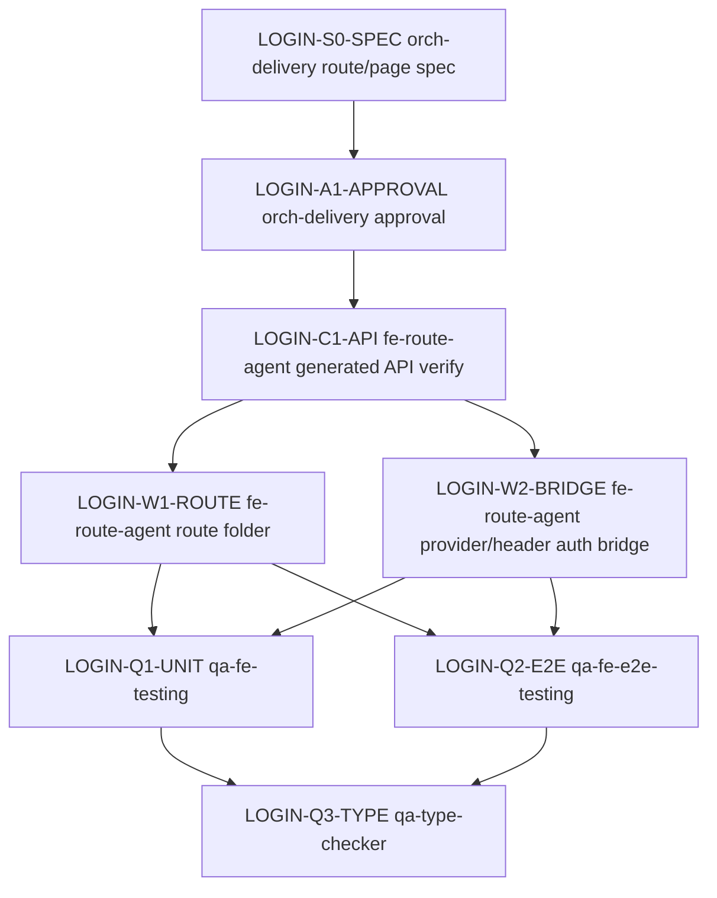

# 관리자 native login Route/Page Delivery Spec

> 생성일: 2026-02-18
> 갱신일: 2026-06-06
> 타입: `next-route-delivery`
> route: `/auth/login`
> owner route file: `apps/admin/web/src/app/auth/login/page.tsx`
> 상위 service spec: `docs/services/admin-auth.delivery.spec.md`
> 상태: 참조형 route/page delivery spec으로 재정렬

## 딜리버리

### 상위 서비스 Spec

| row id | 항목 | 내용 |
|--------|------|------|
| LOGIN-ROUTE-SERVICE | service spec | `docs/services/admin-auth.delivery.spec.md` |
| LOGIN-ROUTE-SERVICE-ROW | service row id | `AUTH-ROUTE-LOGIN`, `AUTH-FE-CODEGEN`, `AUTH-FE-STATE`, `AUTH-REF-ROUTE` |
| LOGIN-ROUTE-ROLE | route 역할 | Admin web `/auth/login` route wiring, `@cocrepo/hook` login state/helper/API slice, route-local E2E 계약 소유 |
| LOGIN-ROUTE-BOUNDARY | ownership | 서비스 목표/권한/service-level backend build order는 service spec이 소유하고, `LoginScreen` 화면 러프/props/event/상태별 렌더링은 screen planning spec이 소유한다. |

### 목표

`/auth/login`은 OIDC redirect 진입점이 아니라 관리자 first-party native email/password login form을 렌더링한다. 이 route/page spec은 thin route page, root `app/layout.tsx` shell 소비, `useAuthLogin` shared hook, generated native auth API 소비, PersistStore session write, route-local E2E를 소유한다.

| row id | 항목 | 내용 |
|--------|------|------|
| LOGIN-ROUTE-GOAL-USER | 사용자 목표 | 관리자가 이메일/비밀번호로 로그인하고 native session을 저장한 뒤 `/dashboard` 또는 안전한 내부 `returnTo` 경로로 이동한다. |
| LOGIN-ROUTE-GOAL-SUCCESS | 성공 기준 | route page는 `LoginScreen` screen에 state/event/loading/title/caption을 주입하고, native login 성공/실패/unsafe return path를 route-local 계약대로 처리한다. |
| LOGIN-ROUTE-GOAL-IN | in scope | `page.tsx`, `packages/fe-ui/src/feature/LoginFrame`, `packages/fe-ui/src/feature/UtilityActions`, `packages/fe-hook/src`, `page.e2e.ts`, provider/header auth wiring 참조, generated native auth hooks 소비 |
| LOGIN-ROUTE-GOAL-OUT | 범위 제외 | `LoginScreen` 세부 UI props/event/상태별 렌더링 복제, 신규 backend endpoint, OIDC protocol 제거, 신규 reusable Feature planning, mobile route 변경 |

### Screen/Feature Spec 참조

| row id | 참조 대상 | planning spec | section/row id | 소유 계약 | route 소비 방식 | 비고 |
|--------|-----------|---------------|----------------|-----------|----------------|------|
| LOGIN-ROUTE-SCREEN-LOGIN | `LoginScreen` Screen | `packages/fe-ui/src/screen/LoginScreen/LoginScreen.spec.md` | `LOGIN-SCREEN-GOAL`, `LOGIN-SCREEN-PROPS-*`, `LOGIN-SCREEN-STATE-*`, `LOGIN-SCREEN-COMP-*` | 화면 러프, props/event, rhythm/rendering, 상태별 렌더링, 하위 `LoginForm` 조합, story/unit 계약 | `page.tsx`가 state/event/loading/title/caption을 주입 | route spec은 screen 내부 wireframe과 props 상세를 복제하지 않음 |
| LOGIN-ROUTE-FEATURE-AUTH-FRAME | reusable Feature | `packages/fe-ui/src/feature/LoginFrame/LoginFrame.tsx`, `packages/fe-ui/src/feature/UtilityActions/UtilityActions.tsx` | auth frame/action wiring | root `app/layout.tsx` shell 기준으로 소비 | route page는 직접 import하지 않음 | package feature가 shell/action UI를 소유 |
| LOGIN-ROUTE-FORM-NO-SPEC | `LoginForm` form | `none-created` | `LoginScreen.spec.md#LOGIN-SCREEN-COMP-FORM`, `LoginScreen.spec.md#LOGIN-SCREEN-NO-FORM-SPEC` | `LoginScreen` 하위 component 조합 안에서 충분히 소유 | route가 직접 `LoginForm`에 props를 전달하지 않음 | `packages/fe-ui/src/form/LoginForm/LoginForm.spec.md`는 생성하지 않음 |

### 디자인 정렬

| row id | 항목 | route 기준 | 상세 owner |
|--------|------|------------|------------|
| LOGIN-ROUTE-DESIGN-SHELL | auth shell | `DESIGN.md`의 상태 우선/다음 행동 우선 원칙을 `LoginFrame`의 auth large section으로 드러낸다. | `LoginFrame`, `LoginScreen.spec.md#화면-러프` |
| LOGIN-ROUTE-DESIGN-ACTION | top-right actions | language/theme action은 package feature `UtilityActions`가 소유한다. | `UtilityActions.tsx` |
| LOGIN-ROUTE-DESIGN-SURFACE | form surface | form surface 내부 구조와 상태별 feedback은 `LoginScreen` planning spec을 따른다. | `LoginScreen.spec.md#LOGIN-SCREEN-STATE-*` |
| LOGIN-ROUTE-DESIGN-COLOR | 색상 역할 | route shell은 `canvas`, `surface`, `muted`, `border` 역할만 설명한다. | service spec `AUTH-DESIGN-COLOR`, screen spec |
| LOGIN-ROUTE-DESIGN-RHYTHM | rhythm | `LoginFrame`은 auth intro와 child slot 배치만 소유하고, form 내부 rhythm은 screen spec이 소유한다. | `LoginFrame`, `LoginScreen.spec.md#리듬-/-레이아웃-계약` |

### Route Shell / 조합 러프

이 러프는 route shell과 screen 조합만 표현한다. `LoginScreen` 내부 필드, CTA, error feedback의 상세 출력물은 `packages/fe-ui/src/screen/LoginScreen/LoginScreen.spec.md#화면-러프`를 참조한다.

```text
LOGIN-ROUTE-SHELL

┌─ `/auth/login` route viewport ───────────────────────────────┐
│ UtilityActions                                             │
│   └─ LanguageSelectButton / ThemeToggleButton                │
│                                                              │
│ LoginFrame                                             │
│   ├─ desktop intro/status rail                               │
│   └─ child slot                                              │
│       └─ AuthLoginPage route page                            │
│           └─ LoginScreen screen                                │
│              (screen 내부 출력물은 LoginScreen.spec.md 참조)    │
└──────────────────────────────────────────────────────────────┘
```

| row id | route 영역 | owner 파일 | 책임 | 참조 |
|--------|------------|------------|------|------|
| LOGIN-ROUTE-SHELL-LAYOUT | auth layout | `packages/fe-ui/src/feature/LoginFrame/LoginFrame.tsx` | viewport shell, desktop intro/status rail, child slot centering | service spec `AUTH-DESIGN-*` |
| LOGIN-ROUTE-SHELL-ACTIONS | auth actions | `packages/fe-ui/src/feature/UtilityActions/UtilityActions.tsx` | locale/theme action wiring | no Feature planning spec |
| LOGIN-ROUTE-SHELL-PAGE | page container | `apps/admin/web/src/app/auth/login/page.tsx` | route hook 호출, `LoginScreen` props 주입, `observer` export | `LOGIN-ROUTE-SCREEN-LOGIN` |

### Route-local 상태 / 이벤트

| row id | 상태/이벤트 | owner 파일 | 계약 | 입력 | 출력/효과 | 검증 |
|--------|-------------|------------|------|------|-----------|------|
| LOGIN-ROUTE-STATE-FORM | `state.loginForm` | `packages/fe-hook/src/useAuthLogin.ts` | route-local observable email/password state | development default credentials or empty production values | `LoginScreen` state prop으로 전달 | helper/unit/E2E |
| LOGIN-ROUTE-STATE-ERROR | `state.errorMessage` | `packages/fe-hook/src/useAuthLogin.ts`, `packages/fe-hook/src/resolveLoginErrorMessage.ts` | generated/API error shape를 사용자 표시 메시지로 변환 | unknown error | screen error state에 표시 | `resolveLoginErrorMessage.test.ts` |
| LOGIN-ROUTE-EVENT-SUBMIT | `onSubmitLoginForm` | `packages/fe-hook/src/useAuthLogin.ts` | `useNativeLogin` mutation 호출, response 검증, session 저장, safe route 이동 | email/password | `PersistStore.setNativeAuthSession`, `router.replace(resolveReturnPath())` | route helper/unit/E2E |
| LOGIN-ROUTE-HELPER-RETURN | `resolveReturnPath` | `packages/fe-hook/src/resolveReturnPath.ts` | same-origin 내부 경로만 허용하고 admin basePath를 정리 | search, origin, basePath | 내부 path 또는 `/dashboard` | `resolveReturnPath.test.ts`, E2E |
| LOGIN-ROUTE-HELPER-DEFAULTS | `getDefaultLoginCredentials` | `packages/fe-hook/src/getDefaultLoginCredentials.ts` | development에서만 기본 계정 제공 | `NODE_ENV` | email/password defaults or empty strings | `getDefaultLoginCredentials.test.ts` |

### 컴포넌트 인벤토리

| row id | 영역 | 컴포넌트/파일 | 계층 | 재사용/신규 | route 책임 | props/event 상세 owner | 소스 담당 `agent_type` | 소비/Wiring `agent_type` |
|--------|------|----------------|------|-------------|------------|------------------------|-------------------------|---------------------------|
| LOGIN-ROUTE-COMP-PAGE | route page | `AuthLoginPage` / `page.tsx` | Route | reuse/verify | hook 호출 후 `LoginScreen`로 state/event/loading/title/caption 주입 | route wiring은 이 spec, screen prop 상세는 `LoginScreen.spec.md` | `fe-route-agent` | `fe-route-agent` |
| LOGIN-ROUTE-COMP-HOOK | shared hook | `useAuthLogin` | Hook | reuse/verify | native login mutation, error message, safe return path, session store write | this spec `LOGIN-ROUTE-STATE-*` | `fe-hook-agent` | `fe-route-agent` |
| LOGIN-ROUTE-COMP-LAYOUT | auth frame | `LoginFrame` | Feature | reuse/verify | auth shell and child slot | this spec `LOGIN-ROUTE-SHELL-LAYOUT` | `fe-feature-agent` | `fe-route-layout-agent` |
| LOGIN-ROUTE-COMP-ACTIONS | utility actions | `UtilityActions` | Feature | reuse/verify | locale/theme button wiring | this spec `LOGIN-ROUTE-SHELL-ACTIONS` | `fe-feature-agent` | `fe-route-layout-agent` |
| LOGIN-ROUTE-COMP-SCREEN | screen | `LoginScreen` | Screen | reuse/modify planning | screen을 소비만 함 | `packages/fe-ui/src/screen/LoginScreen/LoginScreen.spec.md` | `fe-screen-agent` | `fe-route-agent` |
| LOGIN-ROUTE-COMP-FORM | form | `LoginForm` | Form | reuse | route가 직접 소비하지 않음 | `LoginScreen.spec.md#LOGIN-SCREEN-COMP-FORM` | `fe-screen-agent` | `fe-screen-agent` |
| LOGIN-ROUTE-COMP-PROVIDER | app auth bridge | `apps/admin/web/src/app/providers.tsx` | Provider Wiring | reuse/verify | native refresh handler and verify-token bootstrap 소비 계약 | service spec `AUTH-FE-STATE` | `fe-route-agent` | `fe-route-agent` |
| LOGIN-ROUTE-COMP-LOGOUT | header logout | `TopBar` | Header Wiring | reuse/verify | native logout mutation + local session clear 소비 계약 | service spec `AUTH-JOURNEY-LOGOUT` | `fe-route-agent` | `fe-route-agent` |

### 기반 Slice

#### Hook / Helper / State Slice

| row id | slice | 범위 | 재사용/신규 | 파일/대상 | 입력/반환 계약 | 의존 요소 | 소스 담당 `agent_type` | 검증 `agent_type` |
|--------|-------|------|-------------|-----------|----------------|-----------|-------------------------|-------------------|
| LOGIN-SLICE-HOOK | `useAuthLogin` | shared hook | reuse/verify | `packages/fe-hook/src/useAuthLogin.ts` | `{ state, isLoading, onSubmitLoginForm }` | `useNativeLogin`, `usePersistStore`, router adapter | `fe-hook-agent` | `qa-fe-testing`, `qa-fe-e2e-testing` |
| LOGIN-SLICE-RETURN | `resolveReturnPath` | shared helper | reuse/verify | `packages/fe-hook/src/resolveReturnPath.ts` | search/origin/basePath -> safe path | URL parsing | `fe-hook-agent` | `qa-fe-testing`, `qa-fe-e2e-testing` |
| LOGIN-SLICE-ERROR | `resolveLoginErrorMessage` | shared helper | reuse/verify | `packages/fe-hook/src/resolveLoginErrorMessage.ts` | unknown error -> display string | generated Axios error shape | `fe-hook-agent` | `qa-fe-testing` |
| LOGIN-SLICE-DEFAULTS | `getDefaultLoginCredentials` | shared helper | reuse/verify | `packages/fe-hook/src/getDefaultLoginCredentials.ts`, `packages/fe-hook/src/auth-login.constants.ts` | node env -> default credentials | `NODE_ENV` | `fe-hook-agent` | `qa-fe-testing`, `qa-fe-e2e-testing` |
| LOGIN-SLICE-STORE | `PersistStore` native session | shared store consumed by route | reuse/verify | `packages/fe-store/src/stores/persistStore.ts` | `setNativeAuthSession`, `setSpaceSelectionResolved(false)` | app store provider | `fe-store-agent` | `qa-fe-testing`, `qa-type-checker` |

#### Type / Toolkit Slice

| row id | slice | 범위 | 재사용/신규 | 파일/대상 | 소비 패키지 | 의존 방향 | 소스 담당 `agent_type` | 검증 `agent_type` |
|--------|-------|------|-------------|-----------|-------------|-----------|-------------------------|-------------------|
| LOGIN-SLICE-TYPE-SCREEN | `LoginScreenState` / `LoginFormState` | UI package | reuse | `LoginScreen.tsx`, `LoginForm.tsx` | admin route | route consumes UI state contract, UI does not import route | `fe-screen-agent` | `qa-fe-testing`, `qa-type-checker` |
| LOGIN-SLICE-TYPE-GENERATED | generated native auth DTOs | generated API | reuse | `packages/fe-api/src/idp/model/**` | admin route/provider/header | generated from backend DTO | `fe-route-agent` | `qa-type-checker` |
| LOGIN-SLICE-TOOLKIT-SHARED | shared toolkit | shared | none-current | none | none | `@cocrepo/hook` helper로 충분 | none | none |

### Storybook / 테스트 계약

Route page, route layout, route actions는 Storybook 대상이 아니다. Reusable UI story/unit 계약은 `LoginScreen` planning spec이 소유하고, 이 spec은 route-local unit/E2E 계약만 소유한다.

| row id | 대상 | Story/Test 파일 | 소유 계약 | 작성 담당 `agent_type` | 검증 담당 `agent_type` | 비고 |
|--------|------|-----------------|-----------|-------------------------|-------------------------|------|
| LOGIN-TEST-ROUTE-HELPER | login helpers | `packages/fe-hook/src/{getDefaultLoginCredentials,resolveLoginErrorMessage,resolveReturnPath}.test.ts` | safe return path, error parsing, development defaults | `fe-hook-agent` | `qa-fe-testing` | shared hook package |
| LOGIN-TEST-ROUTE-E2E | route flow | `apps/admin/web/src/app/auth/login/page.e2e.ts` | form visible, success, failure, unsafe returnTo | `qa-fe-e2e-testing` | `qa-fe-e2e-testing` | route-local |
| LOGIN-TEST-SCREEN-REF | reusable screen | `packages/fe-ui/src/screen/LoginScreen/LoginScreen.stories.tsx`, `LoginScreen.test.tsx` | ready/loading/error/long/narrow and screen event contract | `fe-screen-agent` | `qa-fe-testing` | 상세는 `LoginScreen.spec.md#Storybook-/-Test-Contract` |
| LOGIN-TEST-FORM-REF | form under screen | `packages/fe-ui/src/form/LoginForm/LoginForm.stories.tsx`, `LoginForm.test.tsx` | email/password bound input composition | `fe-screen-agent` | `qa-fe-testing` | 별도 form planning spec 없음 |

### 백엔드 / API Slice

이 route는 기존 IDP native auth endpoints와 generated Orval client만 소비한다. Backend build order와 endpoint 소유권은 `docs/services/admin-auth.delivery.spec.md#백엔드-/-API-/-기반-계약`이 소유한다.

| row id | 필요 | Method/Path | operationId | 재사용/신규 | route 소비 파일 | 소비/Wiring `agent_type` | 검증 `agent_type` | 비고 |
|--------|------|-------------|-------------|-------------|-----------------|---------------------------|---------------------|------|
| LOGIN-API-NATIVE-LOGIN | login submit | `POST /api/v1/auth/native/login` | `nativeLogin` | reuse/verify | `packages/fe-hook/src/useAuthLogin.ts` | `fe-route-agent` | `qa-fe-testing`, `qa-fe-e2e-testing` | `useNativeLogin` hook 소비 |
| LOGIN-API-REFRESH | token refresh | `POST /api/v1/auth/native/token/refresh` | `nativeRefreshToken` | reuse/verify | `apps/admin/web/src/app/providers.tsx` | `fe-route-agent` | `qa-fe-testing`, `qa-type-checker` | provider refresh bridge 소비 |
| LOGIN-API-LOGOUT | logout | `POST /api/v1/auth/native/logout` | `nativeLogout` | reuse/verify | `TopBar` auth wiring | `fe-route-agent` | `qa-fe-testing`, `qa-fe-e2e-testing` | header logout flow 소비 |
| LOGIN-API-VERIFY | token verify | `GET /api/v1/auth/verify-token` | `verifyToken` | reuse/verify | `apps/admin/web/src/app/providers.tsx` | `fe-route-agent` | `qa-fe-testing`, `qa-type-checker` | ability bootstrap 소비 |
| LOGIN-API-OIDC | OIDC login protocol | `GET /api/v1/auth/login` | `login` | reuse/out-of-route-flow | none | none | none | `/auth/login` native form은 이 endpoint로 redirect하지 않음 |

### 필수 요소

| row id | 분류 | 필요 요소 | 재사용/신규 | 담당 `agent_type` | 완료 조건 |
|--------|------|-----------|-------------|-------------------|-----------|
| LOGIN-REQUIRED-BE | Backend endpoint | existing native login/refresh/logout/verify endpoints | reuse | none | generated client에서 hook/operation 유지 |
| LOGIN-REQUIRED-API | API client | generated Orval native auth hooks | reuse/verify | `fe-route-agent` | route imports generated hooks only |
| LOGIN-REQUIRED-ROUTE | Route wiring | page + shared hook/frame/action consumption | reuse/verify | `fe-route-agent` | native login route flow matches this spec |
| LOGIN-REQUIRED-SCREEN | Reusable screen | `LoginScreen` screen planning spec | reuse/modify planning | `fe-screen-agent` | route consumes `LoginScreen` contract without duplicating UI details |
| LOGIN-REQUIRED-FEATURE | Feature | `LoginFrame`, `UtilityActions` | reuse/verify | `fe-feature-agent` | route page does not create app-local action/layout components |
| LOGIN-REQUIRED-FORM-SPEC | Form planning spec | none | none-created | none | `LoginScreen.spec.md#LOGIN-SCREEN-NO-FORM-SPEC`에 사유 기록 |
| LOGIN-REQUIRED-QA | QA | helper unit, screen/form unit reference, route E2E, type check | reuse/verify | `qa-fe-testing`, `qa-fe-e2e-testing`, `qa-type-checker` | pass or blocked reason recorded |

### 에이전트 배정 매트릭스

| step id | phase | 담당 `agent_type` | 입력 파일 | 출력 파일 | 수정 허용 파일 | 의존 step | parallel | 완료 조건 |
|---------|-------|-------------------|-----------|-----------|----------------|-----------|----------|-----------|
| LOGIN-S0-SPEC | planning | `orch-delivery` | service spec, current route/page spec, `LoginScreen.spec.md`, current implementation references | route/page spec 갱신 | `apps/admin/web/src/app/auth/login/page.spec.md` | none | false | route/page spec이 route-local slice만 소유하고 하위 UI 상세는 planning spec으로 참조 |
| LOGIN-A1-APPROVAL | approval | `orch-delivery` | service/route/screen spec | approval log | spec 문서 | `LOGIN-S0-SPEC` | false | 구현/QA 진행 승인 확보 |
| LOGIN-C1-API | codegen | `fe-route-agent` | `LOGIN-API-*`, generated API files | generated client verify | `packages/fe-api/src/idp/**` only if drift found | `LOGIN-A1-APPROVAL` | true | native auth hooks available |
| LOGIN-W1-ROUTE | web | `fe-route-agent` | this spec, current route folder, generated hooks | route/hook/layout/action reconciliation | `apps/admin/web/src/app/auth/login/**` | `LOGIN-C1-API` | false | native login submit/session/error/returnTo flow verified |
| LOGIN-W2-BRIDGE | web | `fe-route-agent` | service spec auth foundation rows | provider/header auth wiring reconciliation | approved provider/header auth wiring files | `LOGIN-C1-API` | false | refresh/logout/verify-token wiring verified |
| LOGIN-Q1-UNIT | qa | `qa-fe-testing` | route helpers, screen/form references, store references | unit/story 결과 | approved test/story files | `LOGIN-W1-ROUTE`, `LOGIN-W2-BRIDGE` | false | route helper and referenced UI/store tests pass |
| LOGIN-Q2-E2E | qa | `qa-fe-e2e-testing` | `page.e2e.ts`, route implementation | E2E 결과 | `apps/admin/web/src/app/auth/login/page.e2e.ts`, approved fixtures/mocks | `LOGIN-W1-ROUTE`, `LOGIN-W2-BRIDGE` | false | visible/success/failure/unsafe returnTo pass or blocked reason recorded |
| LOGIN-Q3-TYPE | qa | `qa-type-checker` | route/generated/UI/store changed files | type-check 결과 | files already approved by prior steps | `LOGIN-Q1-UNIT`, `LOGIN-Q2-E2E` | false | type errors resolved |

### 실행 그래프

#### 시각 실행 흐름



#### 병렬 그룹 표

| 그룹 | 병렬 step | 병렬 가능 사유 | 공유 파일 lock | 합류 step |
|------|-----------|----------------|----------------|-----------|
| none-current | none | route folder와 provider/header auth bridge는 auth flow 공유 상태를 소비하므로 직렬 검증을 우선한다. | `apps/admin/web/src/app/auth/login/**`, provider/header auth wiring files | none |

#### 단계 순서 표

| 순서 | step id | phase | `agent_type` | 직렬/병렬 | 의존 step | 산출물 | 완료 조건 |
|------|---------|-------|--------------|-----------|-----------|--------|-----------|
| 1 | `LOGIN-S0-SPEC` | planning | `orch-delivery` | 직렬 | none | route/page spec | 참조형 계층 정리 |
| 2 | `LOGIN-A1-APPROVAL` | approval | `orch-delivery` | 직렬 | `LOGIN-S0-SPEC` | 승인 결정 | 구현/QA 진행 여부 확정 |
| 3 | `LOGIN-C1-API` | codegen | `fe-route-agent` | 직렬 | `LOGIN-A1-APPROVAL` | generated API verify | native auth hooks 확인 |
| 4 | `LOGIN-W1-ROUTE` | web | `fe-route-agent` | 직렬 | `LOGIN-C1-API` | route folder reconciliation | native login route flow verified |
| 5 | `LOGIN-W2-BRIDGE` | web | `fe-route-agent` | 직렬 | `LOGIN-C1-API` | provider/header auth bridge verification | refresh/logout/verify wiring verified |
| 6 | `LOGIN-Q1-UNIT` | qa | `qa-fe-testing` | 직렬 | `LOGIN-W1-ROUTE`, `LOGIN-W2-BRIDGE` | unit/story results | pass or blocked reason |
| 7 | `LOGIN-Q2-E2E` | qa | `qa-fe-e2e-testing` | 직렬 | `LOGIN-W1-ROUTE`, `LOGIN-W2-BRIDGE` | route-local E2E results | pass or blocked reason |
| 8 | `LOGIN-Q3-TYPE` | qa | `qa-type-checker` | 직렬 | `LOGIN-Q1-UNIT`, `LOGIN-Q2-E2E` | type-check results | no type errors |

#### Skipped Phase

| phase | 사유 |
|-------|------|
| backend | existing native auth endpoints are reused; no route-local backend build order |
| mobile | admin web route only |
| new reusable Feature | no Feature output is changed |
| form planning spec | `LoginForm` is sufficiently owned by `LoginScreen` planning spec as a subordinate composition |

### 공유 파일 잠금

| 파일/영역 | lock owner | rule |
|-----------|------------|------|
| `apps/admin/web/src/app/auth/login/page.spec.md` | `LOGIN-S0-SPEC` | route/page delivery spec owner; 하위 UI 상세 복제 금지 |
| `apps/admin/web/src/app/auth/login/page.tsx` | `LOGIN-W1-ROUTE` | thin route container only; private JSX section component 추가 금지 |
| `packages/fe-ui/src/feature/LoginFrame/LoginFrame.tsx` | `LOGIN-W1-ROUTE` | auth shell/child slot only; `LoginScreen` 내부 UI 소유 금지 |
| `packages/fe-ui/src/feature/UtilityActions/UtilityActions.tsx` | `LOGIN-W1-ROUTE` | locale/theme package feature action wiring only |
| `packages/fe-hook/src/` | `LOGIN-W1-ROUTE` | shared hook/helper/state owner |
| `apps/admin/web/src/app/auth/login/page.e2e.ts` | `LOGIN-Q2-E2E` | route-local E2E scenarios only |
| `packages/fe-ui/src/screen/LoginScreen/**` | `LOGIN-ROUTE-SCREEN-LOGIN` | screen planning/source owner; route spec references only |
| `packages/fe-ui/src/form/LoginForm/**` | `LOGIN-ROUTE-FORM-NO-SPEC` | `LoginScreen` 하위 조합으로 관리; route는 직접 수정하지 않음 |
| provider/header auth wiring files | `LOGIN-W2-BRIDGE` | native refresh/logout/verify-token auth wiring only; unrelated layout/header 변경 금지 |

### 테스트 인벤토리 / 검증 에이전트

#### 단위 테스트 인벤토리

| row id | 테스트 대상 | 검증 항목 | 테스트 파일 | mock/stub | 작성 agent_type | 검증 agent_type | 통과 기준 |
|--------|-------------|-----------|-------------|-----------|------------------|------------------|-----------|
| LOGIN-UNIT-DEFAULTS | default credential helper | development default, production empty | `packages/fe-hook/src/getDefaultLoginCredentials.test.ts` | node env | `fe-route-agent` | `qa-fe-testing` | development only 기본 계정 제공 |
| LOGIN-UNIT-RETURN | return path helper | same-origin 허용, external origin fallback, basePath strip | `packages/fe-hook/src/resolveReturnPath.test.ts` | URL input | `fe-route-agent` | `qa-fe-testing` | unsafe return path 차단 |
| LOGIN-UNIT-ERROR | error message helper | nested displayMessage/message priority, fallback | `packages/fe-hook/src/resolveLoginErrorMessage.test.ts` | generated error shape | `fe-route-agent` | `qa-fe-testing` | 표시 메시지 우선순위 유지 |
| LOGIN-UNIT-SCREEN-REF | `LoginScreen` | screen rendering/event/loading/error | `packages/fe-ui/src/screen/LoginScreen/LoginScreen.test.tsx` | observable state | `fe-screen-agent` | `qa-fe-testing` | `LoginScreen.spec.md` 상태별 계약 통과 |
| LOGIN-UNIT-FORM-REF | `LoginForm` | email/password bound field update | `packages/fe-ui/src/form/LoginForm/LoginForm.test.tsx` | observable state | `fe-screen-agent` | `qa-fe-testing` | 하위 form 조합 계약 통과 |

#### E2E 테스트 인벤토리

| row id | 시나리오 | 검증 흐름 | 테스트 파일 | mock/stub | 작성 agent_type | 검증 agent_type | 통과 기준 |
|--------|----------|-----------|-------------|-----------|------------------|------------------|-----------|
| LOGIN-E2E-VISIBLE | native login form visible | `/auth/login` 진입 -> heading/field/button 표시 | `apps/admin/web/src/app/auth/login/page.e2e.ts` | none | `qa-fe-e2e-testing` | `qa-fe-e2e-testing` | native form visible |
| LOGIN-E2E-SUCCESS | local dev native login success | default credentials 확인 -> submit -> native login request/response -> session 저장 -> `/dashboard` | `apps/admin/web/src/app/auth/login/page.e2e.ts` | shell API route mock or seeded service | `qa-fe-e2e-testing` | `qa-fe-e2e-testing` | request payload/session/localStorage/redirect 통과 |
| LOGIN-E2E-FAILURE | native login failure | invalid submit -> server error 표시 -> route 유지 | `apps/admin/web/src/app/auth/login/page.e2e.ts` | native login 401/400 mock | `qa-fe-e2e-testing` | `qa-fe-e2e-testing` | error feedback visible and retry possible |
| LOGIN-E2E-RETURNTO | unsafe returnTo blocked | external origin returnTo + success -> fallback route 이동 | `apps/admin/web/src/app/auth/login/page.e2e.ts` | native login success mock | `qa-fe-e2e-testing` | `qa-fe-e2e-testing` | external navigation not used |

#### 정적 검증 / 금지 grep

| row id | 검증 항목 | 명령 | 검증 agent_type | 통과 기준 |
|--------|-----------|------|------------------|-----------|
| LOGIN-STATIC-SECTIONS | route spec 필수 섹션 | `rg -n "^(### 상위 서비스 Spec|### Screen/Feature Spec 참조|### Route-local 상태 / 이벤트|### 테스트 인벤토리 / 검증 에이전트)" apps/admin/web/src/app/auth/login/page.spec.md` | `orch-delivery` | route/page delivery 필수 섹션 존재 |
| LOGIN-STATIC-NO-FORM-SPEC | form spec 미생성 사유 | `rg -n "LOGIN-ROUTE-FORM-NO-SPEC|none-created|LoginForm.spec.md" apps/admin/web/src/app/auth/login/page.spec.md packages/fe-ui/src/screen/LoginScreen/LoginScreen.spec.md` | `orch-delivery` | form spec 생성 없이 사유와 owner 참조 존재 |
| LOGIN-STATIC-OBSERVER | client observer | `rg -n "\"use client\"|observer\\(" apps/admin/web/src/app/auth/login packages/fe-ui/src/screen/LoginScreen packages/fe-ui/src/form/LoginForm` | `qa-type-checker` | client component observer 규칙 확인 |
| LOGIN-STATIC-MEMO | 수동 memo 금지 | `rg -n "useMemo|useCallback" apps/admin/web/src/app/auth/login packages/fe-ui/src/screen/LoginScreen packages/fe-ui/src/form/LoginForm` | `qa-type-checker` | 승인 없는 수동 memo 없음 |

#### 테스트 검증 agent 표

| 테스트 그룹 | 최종 확인 `agent_type` | 입력 파일 | 산출물 | 재실행 조건 |
|-------------|------------------------|-----------|--------|-------------|
| route helper unit | `qa-fe-testing` | `packages/fe-hook/src/*.test.ts` | unit test 결과 | helper/state/error contract 변경 시 |
| screen/form referenced unit | `qa-fe-testing` | `LoginScreen.test.tsx`, `LoginForm.test.tsx` | unit/story 결과 | `LoginScreen.spec.md` 또는 UI source 변경 시 |
| route E2E | `qa-fe-e2e-testing` | `page.e2e.ts` | Playwright 결과 | login flow, session storage, returnTo behavior 변경 시 |
| type contract | `qa-type-checker` | route/generated/store/UI source | type-check 결과 | generated DTO/UI props/store session 변경 시 |

### QA / 승인 기준

| row id | 영역 | 명령/검증 | 기준 |
|--------|------|-----------|------|
| LOGIN-QA-SPEC | Spec | manual review + `LOGIN-STATIC-SECTIONS` | route spec이 route-local slice만 소유하고 service/screen 상세를 참조 |
| LOGIN-QA-HELPER | Helper unit | route helper tests | defaults/error/returnTo 통과 |
| LOGIN-QA-SCREEN | Screen/form reference | UI tests/stories per `LoginScreen.spec.md` | `LoginScreen` state/rendering contract 통과 |
| LOGIN-QA-E2E | Route E2E | Playwright route-local test | visible/success/failure/unsafe returnTo 통과 또는 blocked 사유 기록 |
| LOGIN-QA-TYPE | Type | admin/web and package type-check if changed | type 오류 없음 |
| LOGIN-QA-MANUAL | Manual acceptance | browser smoke after implementation | `/auth/login` native form 유지, OIDC protocol login으로 redirect하지 않음 |

### 차단 / 재진입 규칙

| blocker | 재진입 대상 | 처리 |
|---------|-------------|------|
| generated API에서 native operationId가 사라짐 | service spec `AUTH-FE-CODEGEN`, route `LOGIN-API-*` | service spec 먼저 갱신 후 codegen/route wiring 재승인 |
| `LoginScreen` props/event 변경 필요 | `packages/fe-ui/src/screen/LoginScreen/LoginScreen.spec.md` | screen planning spec을 먼저 갱신하고 route wiring을 뒤따르게 함 |
| `LoginForm`이 독립 reusable planning owner가 필요해짐 | service spec `Screen/Feature Spec 인덱스` | 현 기준에서는 생성하지 않음. 필요성이 생기면 상위 spec에서 owner 계층 재검토 |
| provider/header auth wiring에 unrelated active edits 존재 | route `LOGIN-W2-BRIDGE` | 사용자 변경을 보존하고 auth wiring 범위만 좁히거나 blocked로 보고 |
| E2E seed credentials 없음 | `qa-fe-e2e-testing` | route-level network mock 사용 또는 fixture requirement를 blocked로 기록 |