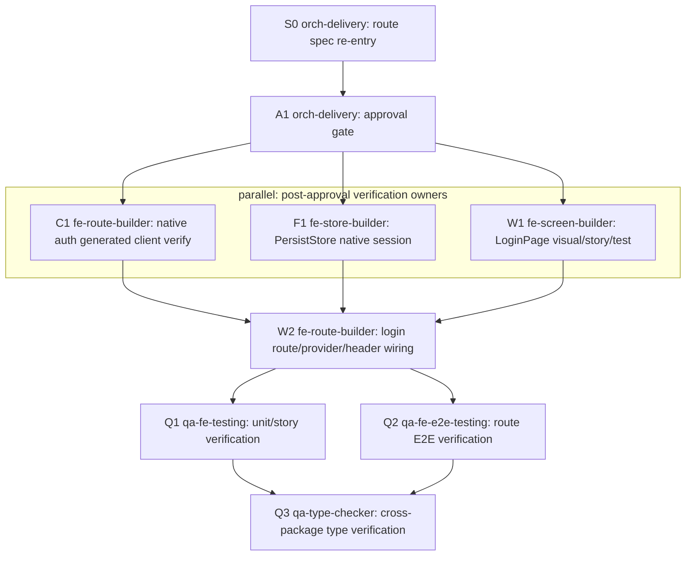

# admin native login route delivery spec

> 생성일: 2026-02-18
> 수정일: 2026-05-31
> 타입: next-route-delivery
> route: `/auth/login`
> owner route file: `apps/admin/web/src/app/auth/login/page.tsx`
> source of truth: route delivery spec

## Delivery

### Goal

Admin web 로그인 화면을 OIDC redirect 진입점이 아니라 first-party native email/password login form으로 운영한다. 이 spec은 `/auth/login` route의 화면, route-local hook, PersistStore native session 저장, provider refresh bridge, header logout, QA 재검증 범위를 `orch-delivery` 기준으로 다시 정리한다.

| 항목 | 내용 |
|------|------|
| 사용자 목표 | 관리자가 이메일/비밀번호로 로그인하고, native access/refresh/session을 저장한 뒤 `/dashboard` 또는 안전한 `returnTo` 내부 경로로 이동한다. |
| 대상 app/domain/platform | `apps/admin/web`, auth, Next.js App Router admin web |
| 성공 기준 | login form이 ready/loading/error 상태를 명확히 보여주고, native login 성공 시 session 저장/refresh/logout/verify-token 흐름과 연결된다. |
| in scope | `/auth/login` route, `useAuthLoginPage`, `PersistStore` native session contract, app provider native refresh bridge, admin header native logout wiring, existing Orval hooks 재사용 검증, route-local E2E/test contract. |
| out of scope | OIDC login/callback/interaction endpoint 제거, IDP/OIDC protocol flow 변경, 신규 backend endpoint, 신규 Prisma/DTO/usecase/controller, mobile native login route 변경. |

Native login 정책은 이 route delivery spec 안에서만 실행 계약으로 관리한다. Admin web은 `/api/v1/auth/login` OIDC redirect route가 아니라 `POST /api/v1/auth/native/login` 기반 form을 사용한다.

OIDC login/callback/interaction은 IDP/OIDC protocol boundary로 유지한다. 이 delivery는 `GET /api/v1/auth/login`, OIDC callback, interaction endpoint를 삭제하거나 약화하는 작업이 아니며, IDP/OIDC 클라이언트 관리와 프로토콜 호환성은 별도 boundary에서 계속 소유한다.

### Planning Spec References

| 대상 | Planning Spec | Source 파일 | 역할 | 재사용/신규 | 갱신 여부 | 담당 `agent_type` | 비고 |
|------|---------------|-------------|------|-------------|-----------|-------------------|------|
| login route | this route delivery spec | `apps/admin/web/src/app/auth/login/page.tsx` | route execution source of truth, native login policy, route/hook/store/API/QA 실행 계약 | modify | done in this re-entry | `orch-delivery` | 별도 delivery plan 파일 없음 |
| login visual owner | `packages/fe-ui/src/screen/LoginPage/LoginPage.spec.md` | `packages/fe-ui/src/screen/LoginPage/LoginPage.tsx` | title/caption/form/error/CTA visual contract | reuse/modify | 승인 후 visual reconciliation 필요 시 갱신 | `fe-screen-builder` | 실행 순서와 approval log는 이 route spec만 소유 |
| login input form | none-current | `packages/fe-ui/src/form/LoginForm/LoginForm.tsx` | email/password input composition | reuse | no planning spec change in this re-entry | `fe-screen-builder` | source 변경이 필요하면 LoginPage planning spec 하위 계약으로만 보강 |
| app auth bridge | none-current | `apps/admin/web/src/app/providers.tsx` | native refresh handler, verify-token bootstrap | reuse/modify | route delivery spec에서만 실행 계약 기록 | `fe-route-builder` | provider source 자체 별도 spec 없음 |
| admin header logout | none-current | `apps/admin/web/src/app/(admin)/_layout/AdminHeaderSlot.tsx` | native logout mutation + local session clear | reuse/modify | route delivery spec에서만 실행 계약 기록 | `fe-route-builder` | header route layout owner와 lock 분리 |

### Design Alignment

| 항목 | 기준 |
|------|------|
| 제품 인상 | 루트 `DESIGN.md`의 따뜻한 예약 운영 플랫폼. 로그인은 장식보다 신뢰, 현재 상태, 다음 행동을 먼저 보여주는 auth large section으로 구성한다. |
| 플랫폼 기준 | Admin web. CRUD table 화면은 아니지만 운영자가 반복적으로 진입하는 보안 관문이므로 빠르게 스캔 가능한 제목, 설명, 필드, primary CTA, 오류 복구 동선을 유지한다. |
| 상태와 다음 행동 | ready에서는 "관리자 로그인"과 email/password 입력, 다음 행동인 "로그인" CTA를 가장 가까이에 둔다. loading은 CTA loading state로 표시하고 중복 제출을 막는다. error는 form 하단 `danger` 역할 text와 재시도 가능한 CTA를 함께 둔다. |
| 색상 역할 | `canvas`, `surface`, `primary`, `muted`, `danger`, `border` 역할 token만 사용한다. 외부 palette, 임의 hex, 장식용 gradient/blur/orb를 추가하지 않는다. |
| role-token 색상 | 상태/역할 색상은 `primary`=로그인 CTA, `danger`=서버/검증 오류, `muted`=caption/helper, `border`=surface/input 구분으로만 설명한다. |
| 타이포그래피 | auth 화면의 첫 제목은 `display` 또는 `headline` 역할로 허용하고, field label/helper/error는 form 근처에서 읽히게 한다. 사용자-facing 텍스트는 가능한 `@cocrepo/ui` Text primitive 또는 기존 screen typography contract로 정렬한다. |
| 표면/형태 | route body는 `canvas` 위 큰 auth section, form은 `surface` card 한 덩어리로 읽히게 한다. 동일 elevation 중첩과 작은 card 과잉 분할을 피한다. |
| 리듬 | auth/intro/loading은 `roomy`, form section은 `section`, title-copy/error는 `block`, action row는 `inline`/full-width CTA를 우선한다. Web layout은 가능한 `VStack`, `HStack`, `Spacer` semantic preset을 사용한다. |
| form/error/loading | label/input/error는 field와 가까이 둔다. loading은 CTA pending state로 충분하게 표시하고, error는 실패 이유와 재시도 행동을 같은 section 안에 둔다. |

### Screen Rough

```text
Visual Snapshot
┌─ Admin auth canvas ──────────────────────────────────────────┐
│                                            [언어] [테마]      │
│                                                              │
│                 관리자 운영에 다시 들어가기                  │
│             예약, 결제, 권한 상태를 이어서 확인합니다         │
│                                                              │
│              ┌────────────────────────────────┐              │
│              │ 관리자 로그인                  │              │
│              │ 관리자 계정으로 로그인해주세요. │              │
│              │                                │              │
│              │ Email                          │              │
│              │ [ ops@example.com           ]  │              │
│              │ Password                       │              │
│              │ [ ********                  ]  │              │
│              │                                │              │
│              │ ! 이메일 또는 비밀번호를 확인...│              │
│              │ [ 로그인 ]                     │              │
│              └────────────────────────────────┘              │
└──────────────────────────────────────────────────────────────┘

Annotated Wireframe
Visual: canvas background, auth large section, centered max form width, surface card, subtle border, medium radius, no decorative orb
[route layout] `apps/admin/web/src/app/auth/login/layout.tsx`: auth shell and top-right actions
[route page] `apps/admin/web/src/app/auth/login/page.tsx`: thin route container

┌─ `/auth/login` viewport ─────────────────────────────────────┐
│ [A AuthLoginActions HStack gap=inline]                       │
│   LanguageSelectButton  ThemeToggleButton                    │
│                                                              │
│ [B AuthLargeSection VStack gap=roomy]                        │
│   Text(display/headline) 관리자 운영에 다시 들어가기          │
│   Text(body muted) 예약, 결제, 권한 상태를 이어서 확인        │
│                                                              │
│   [C LoginSurface surface p-6 radius=medium border]          │
│     [C1 LoginHeader VStack gap=block]                        │
│       Text(title) 관리자 로그인                              │
│       Text(body muted) 관리자 계정으로 로그인해주세요.        │
│     [C2 LoginForm VStack gap=section]                        │
│       Input email label/helper                               │
│       Input password label/helper                            │
│     [C3 FeedbackText danger block] server/display error      │
│     [C4 Button primary full-width loading/disabled] 로그인   │
└──────────────────────────────────────────────────────────────┘

Legend: A=route-local auth actions, B=route layout large auth section, C=shared `LoginPage` screen composition, C2=reused `LoginForm`, C3=Feedback, C4=Action.
```

### Rhythm / Layout Contract

| 영역 | 리듬 컴포넌트 | 방향/정렬 | gap preset | 감싸는 대상 | 재사용/신규 | 소스/대상 | 담당 `agent_type` | 비고 |
|------|---------------|-----------|------------|-------------|-------------|-----------|-------------------|------|
| auth shell | `Section` + `VStack` 또는 route shell wrapper | vertical / center | `roomy` | intro copy, login surface | modify | `apps/admin/web/src/app/auth/login/layout.tsx` | `fe-route-builder` | 현재 raw flex centering은 구현 reconciliation 대상. full viewport centering 외 예외 raw gap 남용 금지 |
| top actions | `HStack` | horizontal / end | `inline` | language/theme action buttons | modify | `apps/admin/web/src/app/auth/login/AuthLoginActions.tsx` | `fe-route-builder` | 현재 raw `flex gap-2`는 승인 후 HStack 전환 검토 |
| route page | none thin container | n/a | n/a | `LoginPage` props | reuse | `apps/admin/web/src/app/auth/login/page.tsx` | `fe-route-builder` | page는 visual JSX를 소유하지 않음 |
| login screen root | `VStack` | vertical / stretch | `roomy` | title, form, error, submit | modify | `packages/fe-ui/src/screen/LoginPage/LoginPage.tsx` | `fe-screen-builder` | 현재 numeric gap은 semantic preset으로 reconciliation 필요 |
| title/caption | `VStack` | vertical / start | `block` | title, caption | modify | `LoginPage.tsx` | `fe-screen-builder` | auth large section의 첫 인상과 중복되지 않게 route/screen title hierarchy 확인 |
| form fields | `VStack` | vertical / stretch | `section` | email/password inputs | reuse/modify | `packages/fe-ui/src/form/LoginForm/LoginForm.tsx` | `fe-screen-builder` | field label/helper/error proximity 유지 |
| error feedback | `VStack` or Text role | vertical / start | `block` | server/display error | modify | `LoginPage.tsx` | `fe-screen-builder` | `danger` role + retry 가능한 submit CTA 근접 |
| submit action | full-width `Button` | action / stretch | n/a | login CTA | reuse/modify | `LoginPage.tsx` | `fe-screen-builder` | loading/disabled guard must not shift layout |

### Component Inventory

| 영역 | 컴포넌트 | 계층 | 재사용/신규 | 소스/대상 | Props/이벤트 | 소스 담당 `agent_type` | 소비/Wiring `agent_type` |
|------|-----------|------|-------------|-----------|--------------|-------------------------|---------------------------|
| route page | `AuthLoginPage` | Route | modify | `apps/admin/web/src/app/auth/login/page.tsx` | `state`, `isLoading`, `onSubmitLoginForm`, title/caption props to `LoginPage` | `fe-route-builder` | `fe-route-builder` |
| route hook | `useAuthLoginPage` | Hook/Route | modify | `apps/admin/web/src/app/auth/login/hooks/useAuthLoginPage.tsx` | native login mutation, error message, safe return path, session store writes | `fe-route-builder` | `fe-route-builder` |
| route layout | `LoginLayoutRoute` | Route/Layout | modify | `apps/admin/web/src/app/auth/login/layout.tsx` | auth large section, centering, children slot | `fe-route-builder` | `fe-route-builder` |
| route actions | `AuthLoginActions` | Action/Navigation | modify | `apps/admin/web/src/app/auth/login/AuthLoginActions.tsx` | language/theme action buttons | `fe-route-builder` | `fe-route-builder` |
| login screen | `LoginPage` | Screen | reuse/modify | `packages/fe-ui/src/screen/LoginPage/LoginPage.tsx` | `LoginPageState`, `title`, `caption`, `isLoading`, `onSubmitLoginForm` | `fe-screen-builder` | `fe-route-builder` |
| login form | `LoginForm` | Form/Input | reuse/modify | `packages/fe-ui/src/form/LoginForm/LoginForm.tsx` | `state.email`, `state.password` | `fe-screen-builder` | `fe-screen-builder` |
| primitive input | `Input` | Input | reuse | `packages/fe-ui/src/control/Input` | path-bound email/password input | none | `fe-screen-builder` |
| primitive action | `Button` | Action | reuse | `packages/fe-ui/src/control/Button/Button.tsx` | submit, loading, disabled | none | `fe-screen-builder` |
| auth bridge | `NativeAuthBridge` | Provider/Feature | modify | `apps/admin/web/src/app/providers.tsx` | native refresh handler registration for core/idp clients | `fe-route-builder` | `fe-route-builder` |
| ability bootstrap | `AbilityStoreBootstrapper` | Provider/Feature | reuse/modify | `apps/admin/web/src/app/providers.tsx` | `useVerifyToken`, ability rule refresh | `fe-route-builder` | `fe-route-builder` |
| header logout | `AdminHeaderSlot` | Navigation/Action | modify | `apps/admin/web/src/app/(admin)/_layout/AdminHeaderSlot.tsx` | `useNativeLogout`, session clear, redirect to login | `fe-route-builder` | `fe-route-builder` |
| persisted session | `PersistStore` | Store | modify | `packages/fe-store/src/stores/persistStore.ts` | native access/refresh/session fields and methods | `fe-store-builder` | `fe-route-builder` |
| API hooks | Orval generated idp auth hooks | API | reuse/verify | `packages/fe-api/src/idp/auth/auth.ts` | `useNativeLogin`, `nativeRefreshToken`, `useNativeLogout`, `useVerifyToken` | `fe-route-builder` | `fe-route-builder` |

### Foundation Contract

#### Hook 인벤토리

| 필요 | Hook | 범위 | 재사용/신규 | 소스/대상 | 입력/반환 계약 | 의존 요소 | 소스 담당 `agent_type` | 소비/Wiring `agent_type` | 검증 `agent_type` |
|------|------|------|-------------|-----------|----------------|-----------|-------------------------|---------------------------|-------------------|
| login route state/mutation | `useAuthLoginPage` | route-local | modify | `apps/admin/web/src/app/auth/login/hooks/useAuthLoginPage.tsx` | returns `{ state: { loginForm, errorMessage }, isLoading, onSubmitLoginForm }`; submit calls native login and stores session | `useNativeLogin`, `usePersistStore`, `next/navigation` | `fe-route-builder` | `fe-route-builder` | `qa-fe-testing`, `qa-fe-e2e-testing` |
| native login mutation | `useNativeLogin` | generated Orval | reuse/verify | `packages/fe-api/src/idp/auth/auth.ts` | payload `{ email, password }` -> `NativeAuthResponseDto` wrapped response | Swagger/Orval generated client | `fe-route-builder` | `fe-route-builder` | `qa-fe-testing` |
| native logout mutation | `useNativeLogout` | generated Orval | reuse/verify | `packages/fe-api/src/idp/auth/auth.ts` | payload `{ sessionId, refreshToken? }` -> boolean wrapped response | Swagger/Orval generated client | `fe-route-builder` | `fe-route-builder` | `qa-fe-testing`, `qa-fe-e2e-testing` |
| token verification query | `useVerifyToken` | generated Orval | reuse/verify | `packages/fe-api/src/idp/auth/auth.ts` | no body, auth header context -> `{ valid, hasFullAccess, expiresAt... }` | custom IDP axios auth header | `fe-route-builder` | `fe-route-builder` | `qa-fe-testing` |
| local store access | `usePersistStore` | app store provider | reuse | `apps/admin/web/src/app/stores` exports | returns injected `PersistStore` | RootStore/AppStoreProvider | none | `fe-route-builder` | `qa-fe-testing` |

#### Toolkit 인벤토리

| 필요 | Utility | 범주 | 재사용/신규 | 소스/대상 | 입력/출력 | 런타임 제약 | 소스 담당 `agent_type` | 소비 `agent_type` | 검증 `agent_type` |
|------|---------|------|-------------|-----------|-----------|-------------|-------------------------|-------------------|-------------------|
| safe return path | `resolveReturnPath` | route-local utility | modify/extract if approved | currently inside `hooks/useAuthLoginPage.tsx`; target `apps/admin/web/src/app/auth/login/hooks/resolveReturnPath.ts` if split | `window.location.search` -> same-origin path or `/dashboard` | SSR render must not depend on `window`; function returns fallback on server | `fe-route-builder` | `fe-route-builder` | `qa-fe-testing` |
| server error message | `resolveLoginErrorMessage` | route-local utility | modify/extract if approved | currently inside `hooks/useAuthLoginPage.tsx`; target `apps/admin/web/src/app/auth/login/hooks/resolveLoginErrorMessage.ts` if split | unknown error -> displayable string | handle generated Axios error shape without throwing | `fe-route-builder` | `fe-route-builder` | `qa-fe-testing` |
| native refresh handler | `refreshNativeSession` | provider-local utility | reuse/modify | `apps/admin/web/src/app/providers.tsx` | current sessionId/refreshToken -> new native session | must throw if session missing; registered/unregistered in effect | `fe-route-builder` | `fe-route-builder` | `qa-fe-testing` |
| shared toolkit | none | shared | none | no `@cocrepo/toolkit` change | no shared utility required | route-only behavior | none | none | none |

#### Type 인벤토리

| 필요 | Type/Interface | 범위 | 재사용/신규 | 소스/대상 | 소비 패키지 | 의존 방향 | 소스 담당 `agent_type` | 검증 `agent_type` |
|------|----------------|------|-------------|-----------|-------------|-----------|-------------------------|-------------------|
| screen state | `LoginPageState`, `LoginFormState` | UI package | reuse/verify | `packages/fe-ui/src/screen/LoginPage/LoginPage.tsx`, `packages/fe-ui/src/form/LoginForm/LoginForm.tsx` | admin route | route consumes UI state contract, UI does not import route | `fe-screen-builder` | `qa-fe-testing` |
| native session | `NativeAuthSession` | shared store | modify/verify | `packages/fe-store/src/stores/persistStore.ts` | admin web providers/header/login route | store owns persisted native session shape | `fe-store-builder` | `qa-fe-testing`, `qa-type-checker` |
| generated native response | `NativeAuthResponseDto`, `NativeLoginPayloadDto`, `NativeTokenRefreshPayloadDto`, `NativeLogoutPayloadDto`, `VerifyToken200AllOf` | generated API | reuse/done | `packages/fe-api/src/idp/model/**` | admin web route/provider/header | generated from backend DTO; frontend imports from `@cocrepo/api` only | `fe-route-builder` | `qa-type-checker` |
| shared type package | none | shared | none | no `@cocrepo/type` change | none | no cross-package hand-authored type needed beyond store/UI contracts | none | none |

#### Store / State 인벤토리

| 필요 | Store/State | 범위 | 재사용/신규 | 소스/대상 | 상태/액션/computed | 소비 화면 | 소스 담당 `agent_type` | 소비/Wiring `agent_type` | 검증 `agent_type` |
|------|-------------|------|-------------|-----------|--------------------|-----------|-------------------------|---------------------------|-------------------|
| native session persistence | `PersistStore` | shared MobX store | modify/verify | `packages/fe-store/src/stores/persistStore.ts` | `accessToken`, `refreshToken`, `sessionId`, expiry fields, `setNativeAuthSession`, `clearNativeAuthSession`, `clear`, `isAuthenticated`, `needsTokenRefresh` | login route, providers, admin header | `fe-store-builder` | `fe-route-builder` | `qa-fe-testing`, `qa-type-checker` |
| route form state | `useLocalObservable` state | route-local | modify/verify | `apps/admin/web/src/app/auth/login/hooks/useAuthLoginPage.tsx` | `loginForm.email`, `loginForm.password`, `errorMessage` | `/auth/login` only | `fe-route-builder` | `fe-route-builder` | `qa-fe-testing`, `qa-fe-e2e-testing` |
| ability bootstrap state | existing `AbilityStore` rules | shared app store | reuse | `apps/admin/web/src/app/providers.tsx`, `@cocrepo/store` | token verification result influences ability rules | admin app shell | none | `fe-route-builder` | `qa-fe-testing` |
| shared new store | none | shared | none | no new store | 단일 route state는 `@cocrepo/store`로 승격하지 않음 | none | none | none | none |

### Storybook / Test Contract

#### Storybook 인벤토리

| 대상 | Story 파일 | 필수 상태/Variant | Fixture/데이터 | 작성 담당 `agent_type` | 검증 담당 `agent_type` | 비고 |
|------|------------|-------------------|----------------|-------------------------|-------------------------|------|
| `LoginPage` | `packages/fe-ui/src/screen/LoginPage/LoginPage.stories.tsx` | ready, loading, server error, disabled/pending submit, long caption/error, narrow viewport | admin email/password fixture and Korean error message | `fe-screen-builder` | `qa-fe-testing` | 현재 Default/WithEmailError/Loading 있음. long/narrow/disabled coverage reconciliation 필요 |
| `LoginForm` | `packages/fe-ui/src/form/LoginForm/LoginForm.stories.tsx` | empty, with values, long placeholder/label if applicable | email/password fixture | `fe-screen-builder` | `qa-fe-testing` | input primitive state coverage 확인 |
| route page | none | n/a | n/a | none | none | `apps/admin/web/src/app/auth/login/page.tsx`는 Storybook 대상이 아닌 thin route container |

#### Unit Test 인벤토리

| 대상 | Test 파일 | 검증 관점 | 주요 케이스 | 작성 담당 `agent_type` | 검증 담당 `agent_type` | 비고 |
|------|-----------|-----------|-------------|-------------------------|-------------------------|------|
| `PersistStore` native session | `packages/fe-store/src/stores/__tests__/persistStore.test.ts` | session persistence, clear, expiry computed | `setNativeAuthSession`, `clearNativeAuthSession`, `clear`, expired/not expired branch | `fe-store-builder` | `qa-fe-testing`, `qa-type-checker` | 기존 test를 native session contract로 보강/검증 |
| route utilities | `apps/admin/web/src/app/auth/login/hooks/useAuthLoginPage.test.tsx` 또는 helper tests | return path safety, error message parsing | external origin blocked, invalid URL fallback, server displayMessage priority | `fe-route-builder` | `qa-fe-testing` | helper split 승인 시 파일별 단위 test 권장 |
| provider bridge | `apps/admin/web/src/app/providers.test.tsx` or existing provider tests | native refresh handler registration and cleanup | missing session throws, response stored, handler cleared on unmount | `fe-route-builder` | `qa-fe-testing` | provider test harness가 없으면 route QA에서 blocked 사유 기록 |
| `LoginPage` | `packages/fe-ui/src/screen/LoginPage/LoginPage.test.tsx` | rendering, submit event, loading guard, error feedback | title/caption/input/button render, submit prevents default, error danger text | `fe-screen-builder` | `qa-fe-testing` | current story-only이면 test 신규 필요 |

#### E2E Test 인벤토리

| 대상 Flow | E2E 파일 | 사용자 흐름 | Setup/데이터 | 주요 assertion | 작성 담당 `agent_type` | 검증 담당 `agent_type` | 비고 |
|-----------|----------|-------------|--------------|----------------|-------------------------|-------------------------|------|
| login form visible | `apps/admin/web/src/app/auth/login/page.e2e.ts` | `/auth/login` 진입 후 native login form 표시 | no auth required | heading, Email, Password, 로그인 button visible | `qa-fe-e2e-testing` | `qa-fe-e2e-testing` | 현재 smoke coverage 있음 |
| native login success | `apps/admin/web/src/app/auth/login/page.e2e.ts` | credentials 입력, `POST /api/v1/auth/native/login` mock/seed 성공, `/dashboard` 또는 safe `returnTo` 이동 | test user or network mock | local session persisted, route redirected, no OIDC `/api/v1/auth/login` navigation | `qa-fe-e2e-testing` | `qa-fe-e2e-testing` | 승인 후 보강 |
| native login failure | `apps/admin/web/src/app/auth/login/page.e2e.ts` | invalid credentials 제출 | API 401/400 mocked | server display message shown near form, user remains on login page | `qa-fe-e2e-testing` | `qa-fe-e2e-testing` | 승인 후 보강 |
| unsafe returnTo blocked | `apps/admin/web/src/app/auth/login/page.e2e.ts` | `?returnTo=https://evil.example` with successful login | API success mock | redirects to `/dashboard`, external origin not used | `qa-fe-e2e-testing` | `qa-fe-e2e-testing` | route-local security acceptance |

### Backend / API Contract

Backend endpoint contract는 이번 re-entry에서 변경하지 않는다. Admin native login은 이미 생성된 IDP auth endpoints와 Orval client를 재사용한다. Backend builder phase는 생략하며, API client shape가 stale이면 Orval generation verify/re-run만 승인 후 수행한다.

#### Prisma / Database 인벤토리

| 필요 | 모델/Enum/마이그레이션 | Prisma 파일 | DB/인덱스 영향 | 재사용/신규 | 소스/대상 | 소스 담당 `agent_type` | 소비 `agent_type` |
|------|------------------------|-------------|----------------|-------------|-----------|-------------------------|-------------------|
| native login route | none | none | no database change | none | no backend change | none | none |

#### Prisma Annotation 인벤토리

| 필요 | 대상 모델/필드 | 주석/표시명 | 재사용/신규 | 소스/대상 | 소스 담당 `agent_type` | 소비 `agent_type` |
|------|----------------|-----------|-------------|-----------|-------------------------|-------------------|
| native login route | none | none | none | no Prisma annotation change | none | none |

#### Common Schema 인벤토리

| 필요 | Schema/검증 계약 | Validation 메시지/i18n | 재사용/신규 | 소스/대상 | 의존 요소 | 소스 담당 `agent_type` | 소비 `agent_type` |
|------|------------------|------------------------|-------------|-----------|-----------|-------------------------|-------------------|
| login payload validation | existing backend login schema through DTO | existing email/password validation messages | reuse | `packages/be-dto/src/auth/native-login-payload.dto.ts`, inherited `LoginPayloadDto` | backend decorators/schema | none | `fe-route-builder` via generated client |
| frontend form schema | none | no frontend schema change in this route | none | visual form relies on API error display for now | n/a | none | none |

#### Entity / VO 인벤토리

| 도메인 객체 | 구조 | 책임 | 재사용/신규 | 소스/대상 | 의존 요소 | 소스 담당 `agent_type` | 소비 `agent_type` |
|-------------|------|------|-------------|-----------|-----------|-------------------------|-------------------|
| native auth session | backend response DTO + store session | token/session state transport | reuse | `NativeAuthResponseDto`, `PersistStore.NativeAuthSession` | token service/session storage | none | `fe-store-builder`, `fe-route-builder` |
| VO | none | no VO change | none | no backend change | none | none | none |

#### DTO / Query DTO 인벤토리

| API/유즈케이스 | DTO/Query DTO | 요청/응답/쿼리 | 재사용/신규 | 소스/대상 | Schema/Entity 의존 | 소스 담당 `agent_type` | 소비 `agent_type` |
|----------------|---------------|----------------|-------------|-----------|--------------------|-------------------------|-------------------|
| native login | `NativeLoginPayloadDto`, `NativeAuthResponseDto` | request/response | reuse | `packages/be-dto/src/auth/native-login-payload.dto.ts`, `native-auth-response.dto.ts` | Login payload, user DTO | none | `fe-route-builder` |
| native refresh | `NativeTokenRefreshPayloadDto`, `NativeAuthResponseDto` | request/response | reuse | `packages/be-dto/src/auth/native-token-refresh-payload.dto.ts` | sessionId/refreshToken | none | `fe-route-builder` |
| native logout | `NativeLogoutPayloadDto` | request | reuse | `packages/be-dto/src/auth/native-logout-payload.dto.ts` | sessionId/refreshToken | none | `fe-route-builder` |
| token verify | `VerifyTokenResponseDto` | response | reuse | `packages/be-dto/src/auth/verify-token-response.dto.ts` | auth context | none | `fe-route-builder` |
| query DTO | none | none | none | no query DTO change | none | none | none |

#### Repository 인벤토리

| 영속성 필요 | Repository | 모델/Aggregate | 메서드 | 재사용/신규 | 소스/대상 | 소스 담당 `agent_type` | 소비 `agent_type` |
|-------------|------------|----------------|--------|-------------|-----------|-------------------------|-------------------|
| native auth session | existing auth/user/session persistence | existing user/session/token storage | existing methods | reuse | backend auth repositories/services already wired | none | none |
| new repository | none | none | none | none | no repository change | none | none |

#### Service 인벤토리

| 도메인 기능 | Service | 메서드 | 재사용/신규 | 소스/대상 | 의존 요소 | 소스 담당 `agent_type` | 소비 `agent_type` |
|-------------|---------|--------|-------------|-----------|-----------|-------------------------|-------------------|
| native token issue/refresh/logout | existing auth/token services | native session issue/refresh/logout internals | reuse | `packages/be-service/src/auth/token-storage.service.ts`, `token.service.ts` | Redis/token storage | none | existing usecases |
| verify token | existing auth/token service | verify access token and full access | reuse | existing auth service/usecase wiring | Auth context | none | existing usecases |

#### UseCase 인벤토리

| 유즈케이스/워크플로 | Command/Query (`@cocrepo/command`) | UseCase Handler (`@cocrepo/usecase`) | 재사용/신규 | 소스/대상 | 의존 요소 | 소스 담당 `agent_type` | 소비 `agent_type` |
|---------------------|---------------|-----------------|-------------|-----------|-----------|-------------------------|-------------------|
| native login | `NativeLoginCommand` | `NativeLoginUseCase` | reuse | `packages/be-command/src/auth/native-login.command.ts`, `packages/be-usecase/src/auth/native-login.usecase.ts` | user validation, native token/session issue | none | `AuthController.nativeLogin` |
| native refresh | `RefreshNativeMobileSessionCommand` | `RefreshNativeMobileSessionUseCase` | reuse | `packages/be-command/src/auth/refresh-native-mobile-session.command.ts`, `packages/be-usecase/src/auth/refresh-native-mobile-session.usecase.ts` | token storage, refresh token validation | none | `AuthController.nativeRefreshToken` |
| native logout | `LogoutNativeMobileSessionCommand` | `LogoutNativeMobileSessionUseCase` | reuse | `packages/be-command/src/auth/logout-native-mobile-session.command.ts`, `packages/be-usecase/src/auth/logout-native-mobile-session.usecase.ts` | session delete, blacklist best effort | none | `AuthController.nativeLogout` |
| verify token | `VerifyTokenQuery` | `VerifyTokenUseCase` | reuse | `packages/be-command/src/auth/verify-token.query.ts`, `packages/be-usecase/src/auth/verify-token.usecase.ts` | auth context/token validation | none | `AuthController.verifyToken` |

#### Client 인벤토리

| 외부 연동 | Client | 메서드 | 재사용/신규 | 소스/대상 | 의존 요소 | 소스 담당 `agent_type` | 소비 `agent_type` |
|-----------|--------|--------|-------------|-----------|-----------|-------------------------|-------------------|
| native auth route | none | none | none | no external client change | no external integration | none | none |

#### 엔드포인트 인벤토리

| 필요 | Method/Path | operationId | Controller | DTO/Schema | 재사용/신규 | 소스/대상 | 소스 담당 `agent_type` | 소비/Wiring `agent_type` | codegen |
|------|-------------|-------------|------------|------------|-------------|-----------|-------------------------|---------------------------|---------|
| login submit | `POST /api/v1/auth/native/login` | `nativeLogin` | `AuthController.nativeLogin` | `NativeLoginPayloadDto`, `NativeAuthResponseDto` | reuse | `apps/idp/api/src/module/auth/auth.controller.ts` | none | `fe-route-builder` | generated `useNativeLogin`, verify |
| token refresh | `POST /api/v1/auth/native/token/refresh` | `nativeRefreshToken` | `AuthController.nativeRefreshToken` | `NativeTokenRefreshPayloadDto`, `NativeAuthResponseDto` | reuse | same | none | `fe-route-builder` | generated `nativeRefreshToken`, verify |
| logout | `POST /api/v1/auth/native/logout` | `nativeLogout` | `AuthController.nativeLogout` | `NativeLogoutPayloadDto`, `Boolean` | reuse | same | none | `fe-route-builder` | generated `useNativeLogout`, verify |
| token verify | `GET /api/v1/auth/verify-token` | `verifyToken` | `AuthController.verifyToken` | `VerifyTokenResponseDto` | reuse | same | none | `fe-route-builder` | generated `useVerifyToken`, verify |
| OIDC protocol login | `GET /api/v1/auth/login` | `login` | `AuthController.login` | `LoginParams` | reuse, out of route flow | same | none | none for admin native login | keep generated client, not used by `/auth/login` |
| OIDC callback/interaction | existing OIDC paths | existing operationIds | IDP/OIDC controllers | existing DTOs | reuse, protocol boundary | IDP/OIDC modules | none | none for admin native login | no removal |

#### Module / Bootstrap 인벤토리

| 필요 | Module/Provider | Router/Wiring | 재사용/신규 | 소스/대상 | 의존 요소 | 소스 담당 `agent_type` | 소비 `agent_type` |
|------|-----------------|----------------|-------------|-----------|-----------|-------------------------|-------------------|
| backend auth module | `AuthModule` | existing controller/usecase wiring | reuse | `apps/idp/api/src/module/auth/auth.module.ts` | command/query bus providers | none | existing API |
| admin provider bridge | `Providers` / `NativeAuthBridge` | app-level native refresh handler | modify/verify | `apps/admin/web/src/app/providers.tsx` | generated API clients, PersistStore | `fe-route-builder` | admin app |

#### Seed 인벤토리

| 필요 | Seed 데이터 | 목적 | 재사용/신규 | 소스/대상 | 의존 요소 | 소스 담당 `agent_type` | 검증 `agent_type` |
|------|-------------|------|-------------|-----------|-----------|-------------------------|-------------------|
| E2E login user | existing or test mock | native login success/failure flow | reuse/verify | test fixture or network mock | test environment | none | `qa-fe-e2e-testing` |
| backend seed | none | no backend seed change in this re-entry | none | no backend change | none | none | none |

#### Codegen / API Client 인벤토리

| 필요 | Trigger | 생성 대상 | 영향 Hook/Client | 실행 명령 | 소비 `agent_type` | 검증 `agent_type` |
|------|---------|-----------|----------------|-----------|-------------------|-------------------|
| native auth generated hooks | verify existing generated output | `packages/fe-api/src/idp/auth/auth.ts`, `packages/fe-api/src/idp/model/**` | `useNativeLogin`, `nativeRefreshToken`, `useNativeLogout`, `useVerifyToken` | `pnpm --filter=@cocrepo/api codegen` only if Swagger/generated output drift is found | `fe-route-builder` | `fe-route-builder`, `qa-type-checker` |
| core API refresh handler | verify existing client exports | `@cocrepo/api/core/client`, `@cocrepo/api/idp/client` | `setApiNativeRefreshHandler`, `setIdpNativeRefreshHandler` | none-current | `fe-route-builder` | `qa-type-checker` |

### Required Elements

| 분류 | 필요 요소 | 재사용/신규 | 담당 `agent_type` | 완료 조건 |
|------|-----------|-------------|-------------------|-----------|
| Prisma / Database / annotation | none | none | none | backend DB schema unchanged |
| Common schema / DTO / Query DTO / Entity / VO | existing native auth DTOs | reuse | none | endpoint response shape matches generated API |
| Repository / Service / UseCase / Client / Controller / Module / Bootstrap / Seed | existing IDP native auth backend chain | reuse | none | no backend builder required |
| API endpoint / Orval hook | native login/refresh/logout/verify-token hooks | reuse/verify | `fe-route-builder`, `qa-type-checker` | generated hooks available and route imports from `@cocrepo/api/idp/auth` |
| Hook / route-local hook | `useAuthLoginPage` | modify/verify | `fe-route-builder` | safe returnTo, native mutation, session write, error display |
| Toolkit utility | `resolveReturnPath`, `resolveLoginErrorMessage` route-local helpers | modify/extract if approved | `fe-route-builder` | helper behavior covered by unit tests or route tests |
| Shared type / local type | `NativeAuthSession`, `LoginPageState`, generated DTO types | reuse/modify | `fe-store-builder`, `fe-screen-builder`, `fe-route-builder` | no hand-written duplicate API type |
| Web screen / feature / widget / form | `LoginPage`, `LoginForm`, auth route shell/actions | reuse/modify | `fe-screen-builder`, `fe-route-builder` | DESIGN rhythm/status/form contract reconciled |
| Mobile screen / feature / widget / action / input / selection / feedback / route | none | none | none | no mobile change |
| Rhythm / layout primitive | `VStack`, `HStack`, `Section`, route shell centering | modify/verify | `fe-screen-builder`, `fe-route-builder` | semantic gap presets or documented low-level exception |
| Shared Store / route-local state | `PersistStore`, route `useLocalObservable` state | modify/verify | `fe-store-builder`, `fe-route-builder` | native session persists and clears predictably |
| Storybook story | `LoginPage`, `LoginForm` stories | modify/verify | `fe-screen-builder` | ready/loading/error/long/narrow variants covered |
| Unit / E2E test | PersistStore, route hook/helpers, provider bridge, login route E2E | modify/new as approved | `qa-fe-testing`, `qa-fe-e2e-testing` | smoke/success/error/unsafe returnTo covered |

### Agent Assignment Matrix

| step id | phase | 담당 `agent_type` | 입력 파일 | 출력 파일 | 수정 허용 파일 | 의존 step | parallel | 완료 조건 |
|---------|-------|-------------------|-----------|-----------|----------------|-----------|----------|-----------|
| S0 | planning | `orch-delivery` | user request, `DESIGN.md`, `AGENTS.md`, current implementation references | route delivery spec update | `apps/admin/web/src/app/auth/login/page.spec.md` | none | false | 기존 역기획 spec을 route delivery spec으로 보강하고 approval 상태 기록 |
| A1 | approval | `orch-delivery` | this spec | approval log | `apps/admin/web/src/app/auth/login/page.spec.md` | S0 | false | 사용자가 승인/수정/중단 중 하나를 선택 |
| C1 | api-client-verify | `fe-route-builder` | `packages/fe-api/src/idp/auth/auth.ts`, Swagger output if available | generated client verify or regenerated files | `packages/fe-api/src/idp/**`, generated index files only if drift found | A1 | false | native endpoints generated hooks가 현재 endpoint contract와 일치 |
| F1 | store | `fe-store-builder` | this spec, `packages/fe-store/src/stores/persistStore.ts` | store/session reconciliation + tests if approved | `packages/fe-store/src/stores/persistStore.ts`, `packages/fe-store/src/stores/__tests__/persistStore.test.ts` | A1 | true | native session fields/actions/clear/expiry contract verified |
| W1 | web screen | `fe-screen-builder` | this spec, `LoginPage.spec.md`, current `LoginPage`/`LoginForm` stories | screen/form visual reconciliation + stories/tests if approved | `packages/fe-ui/src/screen/LoginPage/**`, `packages/fe-ui/src/form/LoginForm/**` | A1 | true | auth large section form/error/loading story/test contract satisfied |
| W2 | web route | `fe-route-builder` | this spec, current route/hook/provider/header files, C1/F1 outputs | route/hook/provider/header reconciliation + route tests if approved | `apps/admin/web/src/app/auth/login/**`, `apps/admin/web/src/app/providers.tsx`, `apps/admin/web/src/app/(admin)/_layout/AdminHeaderSlot.tsx` | C1, F1, W1 | false | native login/refresh/logout/verify wiring matches route spec and OIDC redirect is not used for admin login |
| Q1 | qa | `qa-fe-testing` | F1/W1/W2 changed files | unit/story test fixes if approved | related `*.test.tsx`, `*.stories.tsx`, test setup only within approved files | W2 | false | frontend unit/story tests pass or blocked reason recorded |
| Q2 | qa | `qa-fe-e2e-testing` | W2, current `page.e2e.ts` | route-local E2E scenarios if approved | `apps/admin/web/src/app/auth/login/page.e2e.ts`, E2E fixtures/mocks if already owned | W2 | false | form visible, success, failure, unsafe returnTo flows pass or blocked reason recorded |
| Q3 | qa | `qa-type-checker` | generated/store/route/screen changes | type fixes if approved | files already touched by C1/F1/W1/W2 or type-only adjacent files approved by spec | Q1, Q2 | false | TypeScript contract errors resolved |

### Execution Graph

#### Visual Execution Flow



#### Parallel Group Table

| 그룹 | 병렬 step | 병렬 가능 사유 | 공유 파일 lock | 합류 step |
|------|-----------|----------------|----------------|-----------|
| P1 | `C1`, `F1`, `W1` | generated API verify, store source, UI screen source가 서로 다른 owner/file 영역 | generated barrel, `packages/fe-store/src/stores/persistStore.ts`, `packages/fe-ui/src/screen/LoginPage/**`는 각 step 단일 writer | `W2` |

#### Step Order Table

| 순서 | step id | phase | `agent_type` | 직렬/병렬 | 의존 step | 산출물 | 완료 조건 |
|------|---------|-------|--------------|-----------|-----------|--------|-----------|
| 1 | `S0` | planning | `orch-delivery` | serial | none | `page.spec.md` route delivery spec | 문서 re-entry 완료 |
| 2 | `A1` | approval | `orch-delivery` | serial | `S0` | approval log | 승인/수정/중단 결정 |
| 3 | `C1` | api-client-verify | `fe-route-builder` | parallel | `A1` | generated client verify | native auth hooks drift 없음 또는 Orval generation 완료 |
| 4 | `F1` | store | `fe-store-builder` | parallel | `A1` | PersistStore reconciliation | native session store contract verified |
| 5 | `W1` | web screen | `fe-screen-builder` | parallel | `A1` | LoginPage/LoginForm visual contract | auth screen story/test contract verified |
| 6 | `W2` | web route | `fe-route-builder` | serial | `C1`, `F1`, `W1` | route/hook/provider/header reconciliation | native login flow wired without OIDC redirect |
| 7 | `Q1` | qa | `qa-fe-testing` | serial | `W2` | frontend unit/story verification | unit/story tests pass or blocked reason recorded |
| 8 | `Q2` | qa | `qa-fe-e2e-testing` | serial | `W2` | route-local E2E verification | visible/success/failure/returnTo scenarios pass or blocked reason recorded |
| 9 | `Q3` | qa | `qa-type-checker` | serial | `Q1`, `Q2` | type verification | TypeScript errors resolved or blocked reason recorded |

#### Skipped Phase

| phase | 사유 |
|-------|------|
| backend | existing native auth endpoints are reused; no Prisma/DTO/usecase/controller/module change in this delivery |
| mobile | admin web route only; mobile native login route remains out of scope |
| seed | no backend seed change; E2E can use existing fixture or network mock |
| new shared toolkit/type | route-local helpers and existing store/generated types are sufficient |

### Shared File Locks

| 파일/영역 | lock owner | rule |
|-----------|------------|------|
| `apps/admin/web/src/app/auth/login/page.spec.md` | S0/A1 | route delivery source of truth; approval/execution log must be updated before implementation follow-up |
| `apps/admin/web/src/app/auth/login/page.tsx` | W2 | thin route container only; no private JSX section components added |
| `apps/admin/web/src/app/auth/login/hooks/useAuthLoginPage.tsx` | W2 | route-local hook owner; helper extraction allowed only within approved route folder |
| `apps/admin/web/src/app/auth/login/layout.tsx` | W2 | auth shell/centering only; do not move PageSurface responsibility into layout |
| `apps/admin/web/src/app/auth/login/AuthLoginActions.tsx` | W2 | language/theme auth actions only |
| `apps/admin/web/src/app/providers.tsx` | W2 | native refresh bridge and verify-token bootstrap only; avoid unrelated provider refactors |
| `apps/admin/web/src/app/(admin)/_layout/AdminHeaderSlot.tsx` | W2 | native logout/current header wiring only; if concurrent header work exists, mark blocked instead of overwriting |
| `packages/fe-store/src/stores/persistStore.ts` | F1 | single writer for native session fields/actions; preserve unrelated existing changes |
| `packages/fe-store/src/stores/__tests__/persistStore.test.ts` | F1/Q1 | store contract tests only |
| `packages/fe-ui/src/screen/LoginPage/**` | W1/Q1 | visual screen/story/test owner; no route/API imports |
| `packages/fe-ui/src/form/LoginForm/**` | W1/Q1 | form input composition owner; no route/API imports |
| `packages/fe-api/src/idp/**` | C1 | generated output only; do not hand-edit generated files |
| `.codex/agents/orch-delivery.toml` | blocked | explicitly out of scope; do not modify role file |

### QA / Acceptance

| 영역 | 명령/검증 | 기준 |
|------|-----------|------|
| Spec | manual review | required delivery sections exist, no 별도 delivery plan, role/agent/agent_type 용어 준수 |
| API generated verify | `pnpm --filter=@cocrepo/api codegen` only if drift found | `useNativeLogin`, `nativeRefreshToken`, `useNativeLogout`, `useVerifyToken` remain generated from existing endpoints |
| Store unit | `pnpm --filter=@cocrepo/store test -- persistStore` | native session set/clear/expiry persistence passes |
| UI unit/story | `pnpm --filter=@cocrepo/ui test -- LoginPage` or existing UI test command | LoginPage/LoginForm ready/loading/error/submit contract passes |
| Admin route unit | `pnpm --filter=admin-web test -- auth/login` if harness exists | route helper/provider bridge behavior passes |
| Admin E2E | route-local Playwright for `apps/admin/web/src/app/auth/login/page.e2e.ts` | form visible, success redirect/session, failure message, unsafe returnTo fallback |
| Type check | `pnpm --filter=admin-web type-check`, package type checks if changed | generated/store/UI/route contracts compile |
| Manual acceptance | browser check after implementation | no OIDC redirect on `/auth/login`; native form remains visible; error/loading states do not shift layout incoherently |

### Blocked / Re-entry Rules

| blocker | re-entry 대상 | 처리 |
|---------|---------------|------|
| generated API lacks native endpoints or operationId changed | `orch-delivery` + `fe-route-builder` | update endpoint/Orval generation inventory, run codegen only after approval, then route import reconciliation |
| backend endpoint response differs from `NativeAuthSession` | `orch-delivery` | mark contract-gap and decide whether backend DTO or store contract is source; do not patch backend without spec approval |
| OIDC protocol endpoint removal is requested during implementation | `orch-delivery` | mark out-of-scope; IDP/OIDC boundary requires separate route/API delivery spec |
| `PersistStore` has concurrent edits | `orch-delivery` + `fe-store-builder` | use shared file lock; stop and record blocked rather than reverting other changes |
| `providers.tsx` or `AdminHeaderSlot.tsx` has unrelated active edits | `fe-route-builder` | preserve user changes, narrow patch to native auth bridge/logout, or request re-entry if conflict prevents safe edit |
| auth layout requires a new reusable UI primitive | `orch-delivery` + `fe-screen-builder` | update Planning Spec References and Component Inventory before implementation |
| E2E environment has no seeded admin credentials | `qa-fe-e2e-testing` | use route-level network mock or mark E2E success flow blocked with fixture requirement |
| route helper tests require splitting helpers from hook file | `fe-route-builder` | allowed only within `apps/admin/web/src/app/auth/login/hooks/**` after approval; update locks and test inventory |

### Approval / Execution Log

| 날짜 | 단계 | 상태 | 내용 | 작성자 |
|------|------|------|------|--------|
| 2026-05-31 | planning re-entry | completed | 기존 단순 역기획 spec을 `orch-delivery` route delivery spec으로 보강. `DESIGN.md`, `AGENTS.md`, current route/hook/provider/header/store/generated API를 참고함. | Codex |
| 2026-05-31 | scope correction | completed | `.codex/agents/orch-delivery.toml` 및 구현 코드 수정 없이 `page.spec.md`만 갱신. | Codex |
| 2026-05-31 | native login policy | approved | Admin web `/auth/login`은 OIDC redirect가 아니라 native login form으로 유지하고, OIDC login/callback/interaction은 IDP/OIDC protocol boundary로 유지한다고 명시. | Codex |
| 2026-05-31 | implementation reconciliation | completed | `fe-route-builder`, `fe-store-builder`, `fe-screen-builder`, API client verify slice 기준으로 route/store/screen/provider/header/test reconciliation을 진행함. | Codex |
| 2026-05-31 | QA gate | completed | route helper tests, `PersistStore` tests, `LoginPage/LoginForm` tests, admin/API type-check, route-local Playwright E2E, browser screenshot check 통과. | Codex |

## 기존 역기획 요약

### 사용자 시나리오

1. 관리자가 로그인 페이지에 진입한다.
2. 이메일/비밀번호를 입력하고 native login을 요청한다.
3. 로그인 성공 시 native access/refresh/session 정보를 저장하고 `/dashboard` 또는 `returnTo` 내부 경로로 이동한다.
4. 로그인 실패 시 서버의 표시 메시지를 form 하단에 노출한다.

### API 호출

| 시점 | API | 설명 |
|------|-----|------|
| 로그인 제출 | `POST /api/v1/auth/native/login` | native access/refresh/session 발급 |
| access token refresh | `POST /api/v1/auth/native/token/refresh` | provider bridge에서 native session 갱신 |
| 로그아웃 | `POST /api/v1/auth/native/logout` | native session 삭제 후 local persisted state clear |
| 권한 bootstrap | `GET /api/v1/auth/verify-token` | 현재 token/space 기준 full access 여부 확인 |

### 이벤트 핸들러

| 이벤트 | 동작 |
|--------|------|
| `onSubmitLoginForm` | native login mutation 실행 후 `PersistStore`에 session 저장 및 safe route 이동 |
| `onClickLogoutButton` | native logout mutation 후 `PersistStore.clear()` 및 `/admin/auth/login` 이동 |
| native refresh handler | 401 refresh 시 sessionId/refreshToken으로 native token 재발급 후 store 갱신 |

### Rendering Decision

- 기본 패턴: `pure screen + thin route container`
- page role: `form route wiring`
- reusable target: `screen`
- screen component path: `packages/fe-ui/src/screen/LoginPage/LoginPage.tsx`
- SSR/prefetch 예외 승인 여부: 없음
- 추가 예외 파일: 없음 (`_client.tsx`, `_prefetch.ts` 미사용)
- `"use client"` route component는 `observer`로 래핑한다.
- `returnTo`는 같은 origin 내부 경로만 허용한다.

## 변경 이력

| 일자 | 내용 | 작성자 |
|------|------|--------|
| 2026-05-31 | `orch-delivery` route delivery spec으로 re-entry하고 Delivery 실행 계약, API/store/QA/lock/approval log를 추가 | Codex |
| 2026-05-31 | admin 로그인 플로우를 OIDC redirect에서 native login 폼으로 전환한 현재 구현을 spec에 reconciliation 대상으로 기록 | codex |
| 2026-04-22 | semantic pure screen naming sweep에 맞춰 pure screen 경로와 component 명 계약을 semantic 이름 기준으로 갱신 | codex |
| 2026-03-26 | `LoginRedirectPage` 경로를 page 폴더 기반 sidecar 구조에 맞게 갱신 | codex |
| 2026-03-25 | `LoginRedirectPage`로 상태 UI를 page 레이어로 이동하고 route page를 thin container로 정리 | codex |
| 2026-03-21 | page.tsx default export를 `observer(...)`로 정리해 client page 규칙을 맞춤 | codex |
| 2026-03-21 | page.tsx 단일 CSR 계약과 현재 surface/rendering decision 기준으로 stale 예외 문구를 정리 | codex |
| 2026-03-21 | fe-route-builder 계약에 맞춰 consumed layout / rendering decision 섹션을 보강 | codex |
| 2026-02-18 | 초기 생성 (역기획) | req-reverse-engineer |
