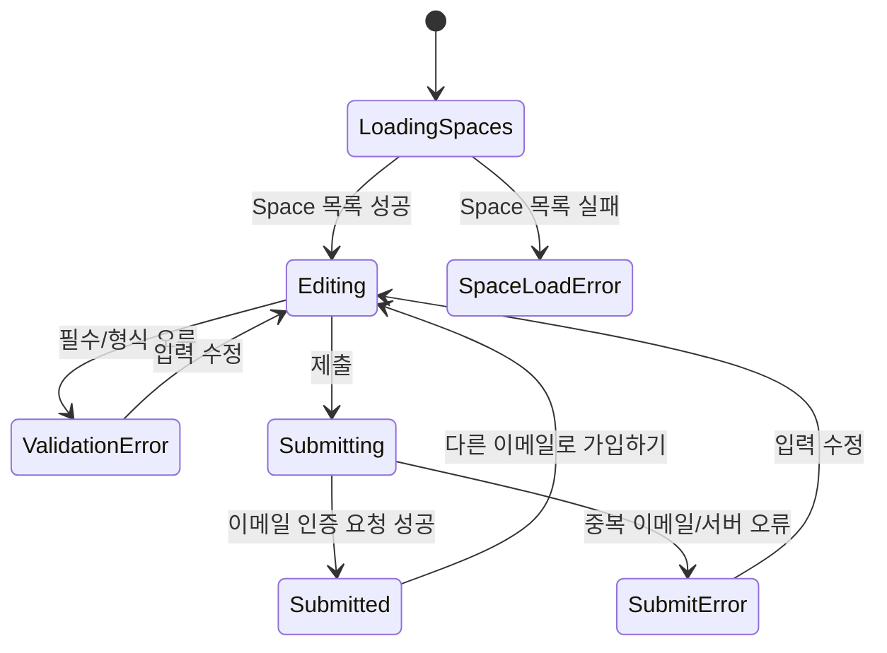

# 회원가입 페이지

## 목적

IDP 공개 인증 플로우에서 사용자가 가입할 Space를 선택하고 계정 정보를 입력한 뒤 이메일 인증 요청을 생성하는 CSR route page입니다.

## Route

| 항목 | 값 |
|------|----|
| URL | `/sign-up` |
| 파일 | `apps/idp/web/src/app/(auth)/sign-up/page.tsx` |
| 레이아웃 | `(auth)/layout.tsx` |
| 렌더링 | CSR, Orval React Query hook |

## 조사 결과

- 현재 idp/web 인증 구조는 `/auth/login` OIDC redirect route와 `(auth)` group의 `/forgot-password`, `/reset-password/[token]`, `/interaction/[uid]`, `/error` route로 구성됩니다.
- 기존 공개 인증 route는 route-local MobX state class를 만들고 `@cocrepo/ui` pure page에 state와 handler를 주입합니다.
- `useSignUp`은 `@cocrepo/api/idp/auth`의 Orval 생성 mutation이며 `SignUpPayloadDto`는 `email`, `password`, `name`, `nickname`, `phone`, `address`, `spaceId`를 받습니다.
- 기존 인증된 Space 목록 API는 회원가입 전 호출에 맞지 않아 `GET /api/v1/auth/sign-up/spaces` public endpoint와 Orval 생성 `useGetSignUpSpaces` hook을 사용합니다.

## API

| 용도 | Hook/API | 비고 |
|------|----------|------|
| 가입 가능 Space 조회 | `useGetSignUpSpaces` | public `GET /api/v1/auth/sign-up/spaces` |
| 회원가입 이메일 인증 요청 | `useSignUp` | `POST /api/v1/auth/sign-up` |

## `x-space-id` Header

- 사용자가 선택한 `spaceId`를 `useSignUp` request option의 `headers[REQUEST_HEADER_KEYS.SPACE_ID]`에 설정합니다.
- body에도 동일한 `spaceId`를 전송합니다.
- 백엔드는 body `spaceId`와 `x-space-id`가 함께 온 경우 값이 다르면 `SIGN_UP_SPACE_HEADER_MISMATCH`로 거절합니다.

## 입력 항목

| 항목 | 상태 path | API 반영 |
|------|-----------|----------|
| 가입 Space | `signUpForm.spaceId` | `body.spaceId`, `x-space-id` |
| 이메일 | `signUpForm.email` | `body.email` |
| 비밀번호 | `signUpForm.password` | `body.password` |
| 비밀번호 확인 | `signUpForm.confirmPassword` | route-local validation |
| 이름 | `signUpForm.name` | `body.name`, `body.nickname` |
| 전화번호 | `signUpForm.phone` | `body.phone` |
| 주소 | `signUpForm.address` | `body.address`, 이메일 인증 후 Profile 저장 |

## 상태 전이

## 다크모드/다국어

- `(auth)/layout.tsx`의 HeroUI dark theme와 배경을 그대로 사용합니다.
- 화면 문구, validation, 상태/버튼 문구는 `@cocrepo/ui`의 `useT()`와 translation catalog key를 사용합니다.
- 신규 문구는 `packages/be-prisma/src/reference-data/definitions/translation-seed-data.ts`에 한국어/영어 리소스로 추가합니다.

## UI 계층

- route page: `apps/idp/web/src/app/(auth)/sign-up/page.tsx`
- pure page: `packages/fe-ui/src/page/SignUpPage/SignUpPage.tsx`
- form widget: `packages/fe-ui/src/form/SignUpForm/SignUpForm.tsx`
- 앱 내부에는 재사용 UI 컴포넌트를 만들지 않습니다.

## E2E 관점

- `/sign-up` 렌더링과 Space select 표시
- 필수 입력 미완료 시 submit disabled
- 전체 입력 후 `POST /api/v1/auth/sign-up` body와 `x-space-id` header 검증
- 성공 후 이메일 인증 안내 표시
- 영어 catalog mock 적용 시 주요 문구 번역 확인

## 백엔드 계약

- `POST /api/v1/auth/sign-up`는 선택 Space가 가입 가능한 Ground 보유 Space인지 확인합니다.
- `EmailVerification`은 이메일 인증 대기 중 `spaceId`와 `address`를 내부 저장합니다.
- `confirmEmailVerification`은 저장된 `spaceId`로 Tenant를 만들고, `address`는 User Profile에 저장합니다.
- `EmailVerificationDto` 응답에는 주소를 노출하지 않습니다.

## 변경 이력

| 일자 | 내용 | 작성자 |
|------|------|--------|
| 2026-05-06 | 회원가입 route page 신규 작성 | Codex |
| 2026-05-06 | 선택 Space/address 영속화 및 Orval 생성 hook 기준 반영 | Codex |
