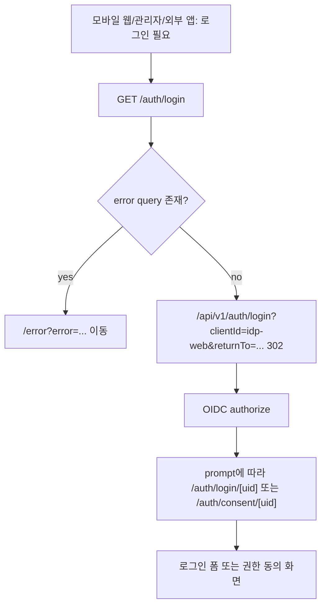
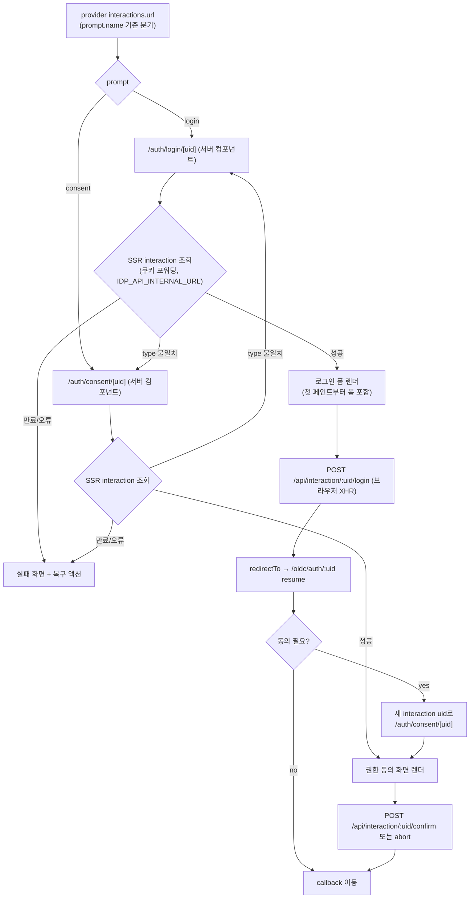
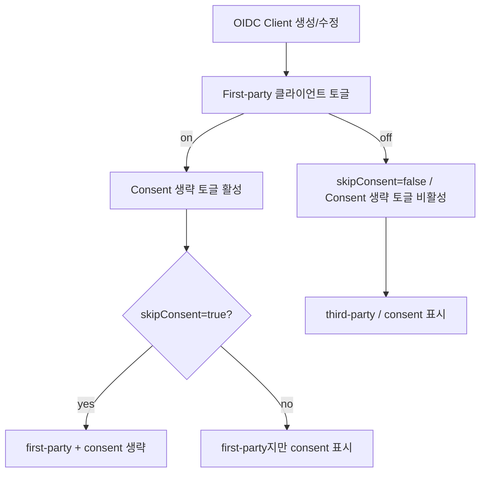
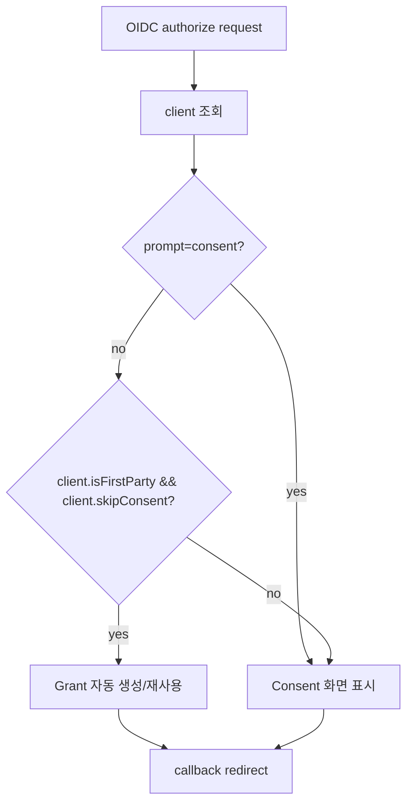

# IDP 인증 및 Consent 흐름 컨텍스트

> 타입: app-context
> 위치: apps/idp/web/src/app/auth-flow.context.md

## /auth/login redirect-only entrypoint

- `/auth/login`은 사용자가 머무르는 화면이 아니라 IDP Web의 로그인 진입 URL입니다.
- `returnTo`는 같은 origin의 URL만 허용하고, 외부 origin은 `/dashboard`로 대체합니다.
- callback 실패처럼 `error` query가 붙은 요청은 `/error` 화면으로 넘깁니다.

## /auth/login/[uid] · /auth/consent/[uid] 라우팅과 렌더

- 모바일 웹 공통 로그인 화면은 `/auth/login/[uid]`가, 권한 동의 화면은 `/auth/consent/[uid]`가 소유합니다.
- 두 페이지 모두 서버 컴포넌트로 interaction을 조회(SSR)해 첫 페인트부터 폼/동의 화면을 렌더합니다. 제출(로그인·동의·취소)은 세션 쿠키가 브라우저에 심겨야 하므로 브라우저 XHR로만 수행합니다.
- URL과 interaction type이 어긋나면 서버가 반대 라우트로 redirect합니다.
- 작은 viewport에서도 입력, 권한 목록, 주요 CTA가 넘치지 않아야 합니다.

## Admin OIDC Client first-party 설정

- First-party는 플랫폼이 소유하거나 신뢰하는 client를 FULL_ACCESS 관리자가 수동 지정합니다.
- `skipConsent`는 별도 값이지만, `isFirstParty=true`일 때만 유효합니다.

## Runtime consent skip 판단

- consent skip 판단은 DB의 `isFirstParty && skipConsent`만 사용합니다.
- `prompt=consent`는 항상 우선하며, first-party + skipConsent 설정도 무시하고 동의 화면을 표시합니다.
