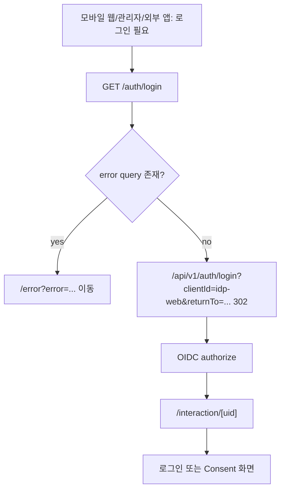
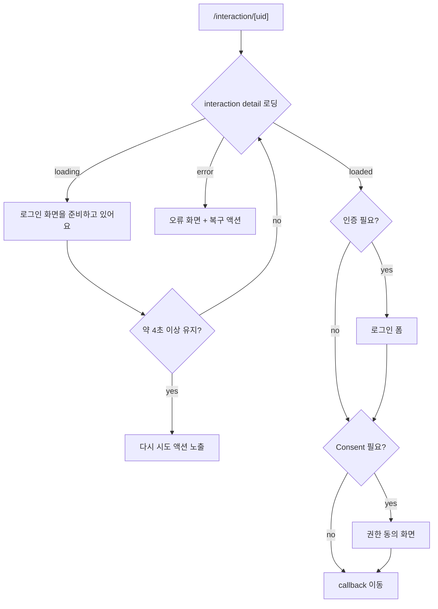
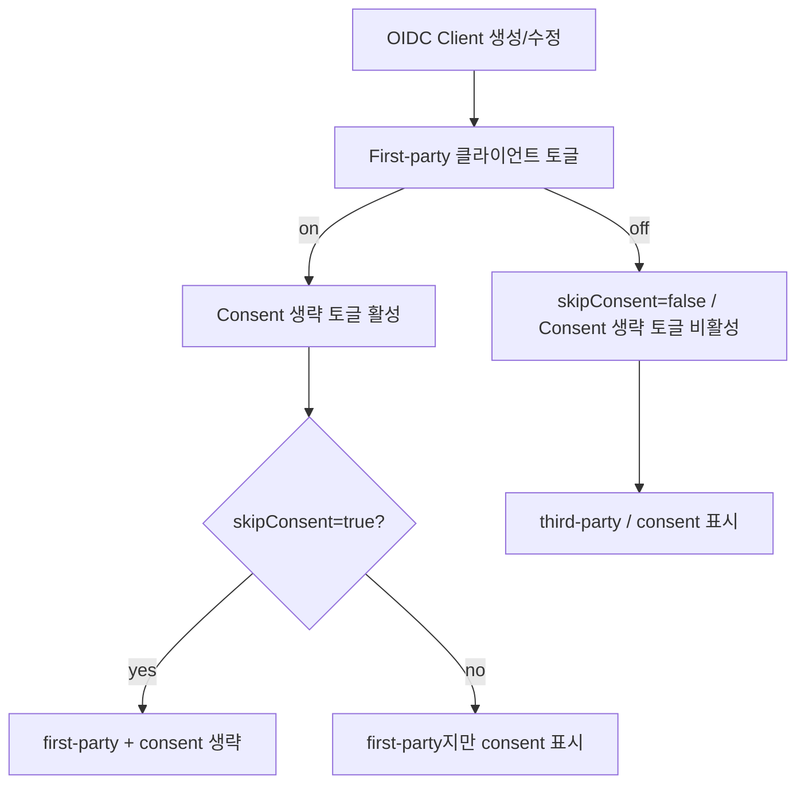
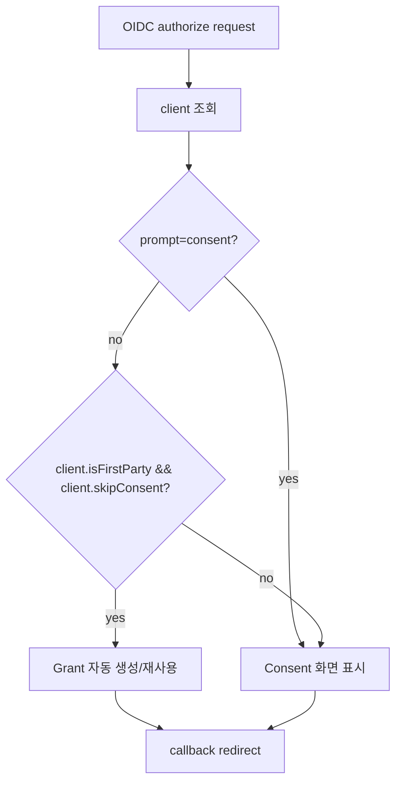

# IDP 인증 및 Consent 흐름 컨텍스트

> 타입: app-context
> 위치: apps/idp/web/src/app/auth-flow.context.md

## /auth/login redirect-only entrypoint

- `/auth/login`은 사용자가 머무르는 화면이 아니라 IDP Web의 로그인 진입 URL입니다.
- `returnTo`는 같은 origin의 URL만 허용하고, 외부 origin은 `/dashboard`로 대체합니다.
- callback 실패처럼 `error` query가 붙은 요청은 `/error` 화면으로 넘깁니다.

## /interaction/[uid] 화면 전환

- 모바일 웹 공통 로그인 화면은 `/interaction/[uid]`가 소유합니다.
- 준비 상태 문구는 "로그인 화면을 준비하고 있어요"와 "잠시 후 안전한 인증 화면으로 이동합니다."를 사용합니다.
- 작은 viewport에서도 입력, 권한 목록, 주요 CTA가 넘치지 않아야 합니다.

## Admin OIDC Client first-party 설정

- First-party는 플랫폼이 소유하거나 신뢰하는 client를 FULL_ACCESS 관리자가 수동 지정합니다.
- `skipConsent`는 별도 값이지만, `isFirstParty=true`일 때만 유효합니다.

## Runtime consent skip 판단

- consent skip 판단은 DB의 `isFirstParty && skipConsent`만 사용합니다.
- `prompt=consent`는 항상 우선하며, first-party + skipConsent 설정도 무시하고 동의 화면을 표시합니다.
