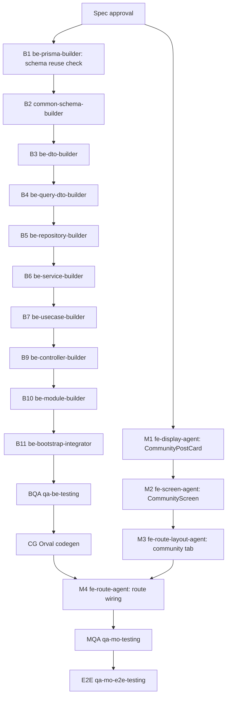

# mobile community route delivery spec

> 생성일: 2026-05-27
> 타입: expo-route-delivery
> route: `/community`
> owner route file: `apps/mobile/src/app/(tabs)/community.tsx`
> source of truth: route delivery spec

## Delivery

### Goal

모바일 사용자가 현재 선택된 지점의 커뮤니티 게시글을 확인하고, 짧은 게시글을 작성할 수 있는 `/community` 하단 탭을 만든다.

| 항목 | 내용 |
|------|------|
| 사용자 목표 | 예약 전후로 지점 공지, 운영 안내, 회원 간 짧은 소식을 편하게 확인한다. |
| 대상 app/domain/platform | `apps/mobile`, `content/community`, Expo Router mobile tab |
| 성공 기준 | `/community` 탭에서 게시글 목록, loading/empty/error, 작성 bottom sheet, 작성 성공 후 feed 갱신이 동작한다. |
| in scope | community feed 조회, 게시글 작성, tab wiring, mobile screen/story/unit/route test, backend API + Orval codegen |
| out of scope | 댓글, 좋아요, 신고, 파일 첨부, 게시글 상세 route, push notification, admin moderation UI |

### Planning Spec References

| 대상 | Planning Spec | Source 파일 | 역할 | 재사용/신규 | 갱신 여부 | 담당 `agent_type` | 비고 |
|------|---------------|-------------|------|-------------|-----------|-------------------|------|
| `/community` visual owner | `packages/fe-mo-ui/src/screen/CommunityScreen/CommunityScreen.spec.md` | `packages/fe-mo-ui/src/screen/CommunityScreen/CommunityScreen.tsx` | 커뮤니티 화면 visual/props/state rendering 계약 | new | build 시 신규 작성 | `fe-screen-agent` | 실행 순서와 backend 계약은 이 route spec만 소유 |
| 게시글 카드 | none | `packages/fe-mo-ui/src/data-display/CommunityPostCard/index.tsx` | feed 반복 게시글 카드 | new | spec 없음 | `fe-display-agent` | component story/test는 builder가 함께 작성 |

### Design Alignment

| 항목 | 기준 |
|------|------|
| 제품 인상 | 따뜻한 예약 운영 플랫폼. 커뮤니티는 SNS처럼 과하게 시끄럽지 않고, 지점 안의 소식과 다음 행동을 편하게 이어준다. |
| 플랫폼 기준 | Mobile 우선. safe area, 44px 이상 touch target, 하단 탭과 작성 CTA가 겹치지 않게 한다. |
| 상태와 다음 행동 | 첫 영역에서 `오늘의 커뮤니티` 상태와 작성 CTA를 보여주고, feed가 비었을 때는 작성/새로고침 행동을 가까이에 둔다. |
| 색상 역할 | `background`, `surface`, `foreground`, `muted`, `primary`, `danger`, `border` 역할만 사용한다. 임의 hex와 외부 palette는 사용하지 않는다. |
| 타이포그래피 | route header가 title을 소유한다. 화면 내부는 `Text` primitive의 `title/body/caption/label` 역할로 구성한다. |
| 표면/형태 | 게시글은 `surface` card, 작성 영역은 bottom sheet, 주요 작성 action은 `ScreenActionBar`/primary button 계열을 사용한다. |
| 큰 섹션 | 커뮤니티 홈은 큰 hero가 아니라 compact intro + feed 중심이다. Empty/Error 상태에서만 roomy한 안내 영역을 허용한다. |

### Screen Rough

```text
Visual Snapshot
┌─ 커뮤니티 · 광화문 스튜디오 ───────────────────┐
│ ┌──────────────────────────────────────────┐ │
│ │ 오늘의 커뮤니티                  [글쓰기] │ │
│ │ 지점 소식과 회원 이야기를 확인해요        │ │
│ └──────────────────────────────────────────┘ │
│ ┌──────────────────────────────────────────┐ │
│ │ 운영 안내                                │ │
│ │ 이번 주 토요일은 단축 운영합니다.         │ │
│ │ 관리자 · 12분 전                         │ │
│ └──────────────────────────────────────────┘ │
│ ┌──────────────────────────────────────────┐ │
│ │ 오늘 수업 좋았어요                       │ │
│ │ 처음 들은 수업인데 호흡이 편했어요.       │ │
│ │ 김회원 · 1시간 전                        │ │
│ └──────────────────────────────────────────┘ │
└──────────────────────────────────────────────┘

Annotated Wireframe
Visual tone: bg-background, px-4, gap=section, surface cards, subtle border, no decorative blur
[route/layout] CustomHeader title="커뮤니티" subtitle=currentSpaceName
[tab] bottom tab icon users, label="커뮤니티"

┌─ CommunityScreen / ScreenFrame ─────────────────────┐
│ [A IntroCard Card bg-surface p-4]                   │
│   Text(title) 오늘의 커뮤니티       Button 글쓰기    │
│   Text(body muted) 지점 소식과 회원 이야기를 확인    │
│ [B FeedState StatusFeedback] loading/empty/error     │
│ [C CommunityPostCard List]                           │
│   Text(label) 작성자 · 시간        Chip 공지/내 글    │
│   Text(title) 게시글 제목                            │
│   Text(body) 2~3줄 preview                           │
│ [D Composer BottomSheet]                             │
│   Text label + TextInput title                       │
│   Text label + TextInput multiline body              │
│   Button primary="등록" secondary="취소"              │
└──────────────────────────────────────────────────────┘

Legend: A=screen-local intro, B=reuse Feedback, C=new DataDisplay, D=screen-local composer composition using existing Input/Feedback/Layout.
```

### Rhythm / Layout Contract

| 영역 | 리듬 컴포넌트 | 방향/정렬 | gap preset | 감싸는 대상 | 재사용/신규 | 소스/대상 | 담당 `agent_type` | 비고 |
|------|---------------|-----------|------------|-------------|-------------|-----------|-------------------|------|
| screen root | `VStack` | vertical/stretch | `section` | IntroCard, FeedState, FeedList | reuse | `@cocrepo/mo-ui` rhythm | `fe-screen-agent` | raw `gap-*` 남발 금지 |
| intro card | `VStack` + `HStack` | vertical + header row | `block`, `inline` | title, description, write action | reuse | `@cocrepo/mo-ui` rhythm | `fe-screen-agent` | title/action row는 compact |
| feed list | `VStack` | vertical/stretch | `block` | `CommunityPostCard[]` | reuse | `@cocrepo/mo-ui` rhythm | `fe-screen-agent` | list row 사이 간격은 카드 rhythm |
| post card | `VStack` + `HStack` | vertical + meta row | `dense`, `block` | author/time/chip/title/body | reuse | `@cocrepo/mo-ui` rhythm | `fe-display-agent` | text preview는 3줄 이하 |
| composer sheet | `VStack` | vertical/stretch | `block` | title field, text field, actions | reuse | `BottomSheet`, `Text`, `TextInput`, `Button` | `fe-screen-agent` | controlled field는 route-local state를 props로 받음 |
| route tab | n/a | tab layout | n/a | community tab icon/label | modify | `apps/mobile/src/app/(tabs)/_layout.tsx` | `fe-route-layout-agent` | icon은 기존 `users` 재사용 |

### Component Inventory

| 영역 | 컴포넌트 | 계층 | 재사용/신규 | 소스/대상 | Props/이벤트 | 소스 담당 `agent_type` | 소비/Wiring `agent_type` |
|------|-----------|------|-------------|-----------|--------------|-------------------------|---------------------------|
| route | `community.tsx` | Route | new | `apps/mobile/src/app/(tabs)/community.tsx` | Orval hooks, route-local composer state, screen props | `fe-route-agent` | `fe-route-agent` |
| tab | `Tabs.Screen name="community"` | Route/Layout | modify | `apps/mobile/src/app/(tabs)/_layout.tsx` | title `"커뮤니티"`, tabBarLabel `"커뮤니티"`, icon `users` | `fe-route-layout-agent` | `fe-route-agent` |
| screen | `CommunityScreen` | Screen | new | `packages/fe-mo-ui/src/screen/CommunityScreen/CommunityScreen.tsx` | `status`, `posts`, `isRefreshing`, `isComposerOpen`, handlers | `fe-screen-agent` | `fe-route-agent` |
| intro | `Card` + `Button` | Layout/Action | reuse | `@cocrepo/mo-ui` | title, description, `onPressWrite` | none | `fe-screen-agent` |
| feed state | `StatusFeedback` | Feedback | reuse | `packages/fe-mo-ui/src/feedback/StatusFeedback` | loading/empty/error, retry/write action | `fe-display-agent` | `fe-screen-agent` |
| post card | `CommunityPostCard` | DataDisplay | new | `packages/fe-mo-ui/src/data-display/CommunityPostCard/index.tsx` | `title`, `text`, `authorName`, `createdAtLabel`, `isPinned`, `isMine` | `fe-display-agent` | `fe-screen-agent` |
| composer | `BottomSheet` | Feedback/Layout | reuse | `packages/fe-mo-ui/src/layout/BottomSheet` | open/close, title/description | `fe-display-agent` | `fe-screen-agent` |
| composer title | `TextInput` + `Text` label | Input composition | screen-local | `packages/fe-mo-ui/src/screen/CommunityScreen/CommunityScreen.tsx` | title value/change/error | `fe-screen-agent` | `fe-screen-agent` |
| composer body | `TextInput(multiline)` + `Text` label | Input composition | screen-local | same | body value/change/error | `fe-screen-agent` | `fe-screen-agent` |
| composer action | `ScreenActionBar` | Layout/Action | reuse | `packages/fe-mo-ui/src/layout/ScreenActionBar` | primary submit, secondary cancel, loading label | `fe-display-agent` | `fe-screen-agent` |
| text | `Text` | DataDisplay | reuse | `packages/fe-mo-ui/src/data-display/Text` | all user-facing copy | `fe-display-agent` | all mobile builders |

### Foundation Contract

#### Hook 인벤토리

| 필요 | Hook | 범위 | 재사용/신규 | 소스/대상 | 입력/반환 계약 | 의존 요소 | 소스 담당 `agent_type` | 소비/Wiring `agent_type` | 검증 `agent_type` |
|------|------|------|-------------|-----------|----------------|-----------|-------------------------|---------------------------|-------------------|
| community list | `useGetCommunityPosts` | Orval generated | new generated | `packages/fe-api/src/core/community` | query `{ skip, take }` -> `CommunityPostDto[]` | Swagger codegen | `be-controller-builder` + codegen | `fe-route-agent` | `qa-mo-testing` |
| create post | `useCreateCommunityPost` | Orval generated | new generated | `packages/fe-api/src/core/community` | payload `{ title?, text }` -> `CommunityPostDto` | Swagger codegen | `be-controller-builder` + codegen | `fe-route-agent` | `qa-mo-testing` |
| route-local composer state | none | route-local | new | `apps/mobile/src/app/(tabs)/community.tsx` | title/text/open/validation local state | React state | `fe-route-agent` | `fe-route-agent` | `qa-mo-testing` |

#### Toolkit 인벤토리

| 필요 | Utility | 범주 | 재사용/신규 | 소스/대상 | 입력/출력 | 런타임 제약 | 소스 담당 `agent_type` | 소비 `agent_type` | 검증 `agent_type` |
|------|---------|------|-------------|-----------|-----------|-------------|-------------------------|-------------------|-------------------|
| 작성 시각 표시 | `formatCommunityCreatedAtLabel` | route-local formatter | new | `apps/mobile/src/app/(tabs)/community.tsx` | ISO date -> `"12분 전"` 또는 날짜 | locale/timezone mismatch 주의 | `fe-route-agent` | `fe-route-agent` | `qa-mo-testing` |
| 본문 preview | none | component-local | none | `CommunityPostCard` props에서 `numberOfLines` 처리 | string -> visual clipping | RN Text line clamp | `fe-display-agent` | `fe-screen-agent` | `qa-mo-testing` |

#### Type 인벤토리

| 필요 | Type | 범위 | 재사용/신규 | 소스/대상 | 필드 | 소스 담당 `agent_type` | 소비/Wiring `agent_type` | 검증 `agent_type` |
|------|------|------|-------------|-----------|------|-------------------------|---------------------------|-------------------|
| API 응답 | `CommunityPostDto` | backend/generated | new | `packages/be-dto/src/community/community-post.dto.ts`, generated `@cocrepo/api` model | id, title, text, authorName, createdAt, isMine, isPinned | `be-dto-builder` | `fe-route-agent` | `qa-be-testing`, `qa-mo-testing` |
| 작성 payload | `CreateCommunityPostPayloadDto` | backend/generated | new | `packages/be-dto/src/community/create-community-post.dto.ts` | title?, text | `be-dto-builder` | `fe-route-agent` | `qa-be-testing`, `qa-mo-testing` |
| screen item | `CommunityPostCardItem` | UI-local | new | `packages/fe-mo-ui/src/data-display/CommunityPostCard/index.tsx` | id, title, text, authorName, createdAtLabel, isMine, isPinned | `fe-display-agent` | `fe-screen-agent` | `qa-mo-testing` |

#### Store / State 인벤토리

| 필요 | Store/State | 범위 | 재사용/신규 | 소스/대상 | 계약 | 소스 담당 `agent_type` | 소비/Wiring `agent_type` | 검증 `agent_type` |
|------|-------------|------|-------------|-----------|------|-------------------------|---------------------------|-------------------|
| composer draft | route-local state | single route | new | `apps/mobile/src/app/(tabs)/community.tsx` | title/text/open/submitting | `fe-route-agent` | `fe-route-agent` | `qa-mo-testing` |
| shared MobX store | none | shared | none | no shared store | 단일 route 전용 상태이므로 `@cocrepo/store` 만들지 않음 | none | none | none |

### Storybook / Test Contract

#### Storybook 인벤토리

| 대상 | Story 파일 | 필수 상태/Variant | Fixture/데이터 | 작성 담당 `agent_type` | 검증 담당 `agent_type` | 비고 |
|------|------------|-------------------|----------------|-------------------------|-------------------------|------|
| `CommunityPostCard` | `packages/fe-mo-ui/src/data-display/CommunityPostCard/CommunityPostCard.stories.tsx` | default, pinned, mine, long text | 운영 안내/회원 후기 fixture | `fe-display-agent` | `qa-mo-testing` | repeated feed item |
| `CommunityScreen` | `packages/fe-mo-ui/src/screen/CommunityScreen/CommunityScreen.stories.tsx` | ready, loading, empty, error, composer open, submit pending | posts fixture + handler mocks | `fe-screen-agent` | `qa-mo-testing` | mobile visual owner |

#### Unit Test 인벤토리

| 대상 | Test 파일 | 검증 관점 | 주요 케이스 | 작성 담당 `agent_type` | 검증 담당 `agent_type` | 비고 |
|------|-----------|-----------|-------------|-------------------------|-------------------------|------|
| `CommunityPostCard` | `packages/fe-mo-ui/src/data-display/CommunityPostCard/CommunityPostCard.test.tsx` | text wrapping, status chip, author/time | pinned/mine/long text | `fe-display-agent` | `qa-mo-testing` | 문자열은 `Text` primitive로 감싸야 함 |
| `CommunityScreen` | `packages/fe-mo-ui/src/screen/CommunityScreen/CommunityScreen.test.tsx` | 상태별 렌더링과 action event | ready, empty write, error retry, composer submit/cancel | `fe-screen-agent` | `qa-mo-testing` | screen은 API/router 직접 import 금지 |
| `/community` route | `apps/mobile/src/route-tests/community.test.tsx` | Orval hook 매핑, mutation payload, invalidate | feed render, create success, error retry | `fe-route-agent` | `qa-mo-testing` | route-local state와 navigation만 검증 |

#### E2E 인벤토리

| ID | 대상 | 검증 관점 | 작성 담당 `agent_type` | 비고 |
|----|------|-----------|-------------------------|------|
| `MO-E2E-COMMUNITY-001` | `/community` | 로그인 후 커뮤니티 탭 진입, feed 표시 | `qa-mo-e2e-testing` | E2E 환경에서 API seed/mock 가능할 때 작성 |
| `MO-E2E-COMMUNITY-002` | `/community` | 글쓰기 sheet 열기, 필수값 검증, 게시 성공 후 feed 반영 | `qa-mo-e2e-testing` | backend seed 준비 후 활성화 |

### Backend / API Contract

#### 엔드포인트 인벤토리

| 필요 | Method/Path | operationId | Controller | DTO/Schema | 재사용/신규 | 소스/대상 | 소스 담당 `agent_type` | 소비/Wiring `agent_type` | codegen |
|------|-------------|-------------|------------|------------|-------------|-----------|-------------------------|---------------------------|---------|
| 커뮤니티 게시글 목록 | `GET /api/v1/community/posts` | `getCommunityPosts` | `CommunityController.getCommunityPosts` | `QueryCommunityPostsDto`, `CommunityPostDto[]` | new | `apps/core/api/src/module/community/community.controller.ts` | `be-controller-builder` | `fe-route-agent` | 필요 |
| 커뮤니티 게시글 작성 | `POST /api/v1/community/posts` | `createCommunityPost` | `CommunityController.createCommunityPost` | `CreateCommunityPostPayloadDto`, `CommunityPostDto` | new | same | `be-controller-builder` | `fe-route-agent` | 필요 |

#### Prisma / Schema 인벤토리

| 필요 | 모델 | 재사용/신규 | 소스/대상 | 역할 | 담당 `agent_type` | 비고 |
|------|------|-------------|-----------|------|-------------------|------|
| 콘텐츠 루트 | `Content` | reuse | `packages/be-prisma/schema/content/content.prisma` | 제목/본문/space/creator 소유 | none | 기존 schema 활용 |
| 게시물 상세 | `Post` | reuse | same | Content를 게시글로 materialize | none | v1 댓글/좋아요 없음 |
| 댓글/반응 | none | none | none | out of scope | none | 다음 phase에서 별도 설계 |

#### DTO / Schema 인벤토리

| 필요 | DTO/Schema | 재사용/신규 | 소스/대상 | 역할 | 담당 `agent_type` | 비고 |
|------|------------|-------------|-----------|------|-------------------|------|
| 목록 query | `QueryCommunityPostsDto` | new | `packages/be-dto/src/community/community-query.dto.ts` | `skip`, `take` | `be-query-dto-builder` | `QueryDto` 상속 |
| 작성 payload | `CreateCommunityPostPayloadDto` | new | `packages/be-dto/src/community/create-community-post.dto.ts` | title optional, text required max 1000 | `be-dto-builder` | validation message는 한국어 기준 |
| 응답 | `CommunityPostDto` | new | `packages/be-dto/src/community/community-post.dto.ts` | feed card read model | `be-dto-builder` | Swagger/Orval 모델 생성 대상 |
| 공통 검증 | `CommunityPostSchema` | new | `packages/common-schema/src/schemas/community/community-post.schema.ts` | title/text 검증 재사용 | `common-schema-builder` | DTO와 모바일 form 검증 메시지 공유 |

#### Repository 인벤토리

| 영속성 필요 | Repository | 모델/Aggregate | 메서드 | 재사용/신규 | 소스/대상 | 소스 담당 `agent_type` | 소비 `agent_type` |
|-------------|------------|----------------|--------|-------------|-----------|-------------------------|---------------------|
| 게시글 목록 | `ContentsRepository` | `Content` + `Post` | `findCommunityPostsBySpaceId` | modify | `packages/be-repository/src/contents.repository.ts` | `be-repository-builder` | `be-service-builder` |
| 게시글 작성 | `ContentsRepository` | `Content` + `Post` | `createCommunityPost` | modify | same | `be-repository-builder` | `be-service-builder` |

#### Service 인벤토리

| 도메인 기능 | Service | 메서드 | 재사용/신규 | 소스/대상 | 의존 요소 | 소스 담당 `agent_type` | 소비 `agent_type` |
|-------------|---------|--------|-------------|-----------|-----------|-------------------------|---------------------|
| 커뮤니티 목록 | `ContentService` | `listCommunityPosts` | new | `packages/be-service/src/content/content.service.ts` | `ContentsRepository` | `be-service-builder` | `be-usecase-builder` |
| 커뮤니티 작성 | `ContentService` | `createCommunityPost` | new | same | validation, repository transaction | `be-service-builder` | `be-usecase-builder` |

#### UseCase 인벤토리

| 유즈케이스/워크플로 | UseCase handler | Command/Query | 재사용/신규 | 소스/대상 | 의존 요소 | 소스 담당 `agent_type` | 소비 `agent_type` |
|---------------------|-----------------|---------------|-------------|-----------|-----------|-------------------------|---------------------|
| 모바일 커뮤니티 조회 | `GetCommunityPostsUseCase` | `GetCommunityPostsQuery` | new | `packages/be-usecase/src/core/get-community-posts.usecase.ts` | `SpaceContext`, `AuthContext`, `ContentService` | `be-usecase-builder` | `be-controller-builder` |
| 모바일 커뮤니티 작성 | `CreateCommunityPostUseCase` | `CreateCommunityPostCommand` | new | `packages/be-usecase/src/core/create-community-post.usecase.ts` | userId/spaceId 확정, service 호출 | `be-usecase-builder` | `be-controller-builder` |

#### Read Model 인벤토리

| 경계 조합 | Owner | 메서드 | 재사용/신규 | 소스/대상 | 역할 | 담당 `agent_type` |
|-----------|-------|--------|-------------|-----------|------|-------------------|
| 응답 shaping | `GetCommunityPostsUseCase` | `toCommunityPostDto` | new | `packages/be-usecase/src/core/get-community-posts.usecase.ts` | Content/Post/User read model을 mobile DTO로 변환 | `be-usecase-builder` |

#### Controller / Module 인벤토리

| 필요 | 대상 | 재사용/신규 | 소스/대상 | 역할 | 담당 `agent_type` |
|------|------|-------------|-----------|------|-------------------|
| REST endpoint | `CommunityController` | new | `apps/core/api/src/module/community/community.controller.ts` | `/api/v1/community/posts` 노출 | `be-controller-builder` |
| Nest module | `CommunityModule` | new | `apps/core/api/src/module/community/community.module.ts` | controller/usecase/service provider wiring | `be-module-builder` |
| AppModule 등록 | `CoreApiModule` 또는 root module | modify | core api module tree | community module import | `be-bootstrap-integrator` |

### Required Elements

| 분류 | 필요 요소 | 재사용/신규 | 담당 `agent_type` | 완료 조건 |
|------|-----------|-------------|-------------------|-----------|
| Backend | DTO/query/common schema | new | `be-dto-builder`, `be-query-dto-builder`, `common-schema-builder` | Swagger schema가 Orval 모델 생성 가능 |
| Backend | Content repository/service/usecase/controller/module | new/modify | backend builders | `/api/v1/community/posts` list/create 동작 |
| Codegen | `@cocrepo/api` Orval generated hooks | new generated | main Codex 또는 `fe-route-agent` | `useGetCommunityPosts`, `useCreateCommunityPost` 사용 가능 |
| Mobile UI | `CommunityPostCard` | new | `fe-display-agent` | story/test 포함 |
| Mobile Screen | `CommunityScreen` + planning spec | new | `fe-screen-agent` | ready/loading/empty/error/composer 상태 |
| Mobile Route | tab + route file + route test | new/modify | `fe-route-agent`, `fe-route-layout-agent` | `/community` 탭 진입과 작성 mutation |
| QA | backend/mobile unit + mobile E2E 계획 | new/modify | `qa-be-testing`, `qa-mo-testing`, `qa-mo-e2e-testing` | contract drift 없음 |

### Agent Assignment Matrix

| step id | phase | 담당 `agent_type` | 입력 파일 | 출력 파일 | 수정 허용 파일 | 의존 step | 병렬 가능 여부 | 완료 조건 |
|---------|-------|-------------------|-----------|-----------|----------------|-----------|----------------|-----------|
| B1 | backend/schema check | `be-prisma-builder` | `packages/be-prisma/schema/content/content.prisma` | none | none | none | no | 기존 `Content/Post` 재사용 가능 판단 기록 |
| B2 | backend/common schema | `common-schema-builder` | this spec | `packages/common-schema/src/schemas/community/community-post.schema.ts` | `packages/common-schema/src/**` | B1 | no | title/text validation export |
| B3 | backend/dto | `be-dto-builder` | B2 | `packages/be-dto/src/community/*.dto.ts` | `packages/be-dto/src/community/**`, barrel | B2 | no | request/response DTO |
| B4 | backend/query dto | `be-query-dto-builder` | B3 | `packages/be-dto/src/community/community-query.dto.ts` | same | B3 | no | pagination query |
| B5 | backend/repository | `be-repository-builder` | B1, B3 | `packages/be-repository/src/contents.repository.ts` | repository + barrel | B4 | no | list/create post methods |
| B6 | backend/service | `be-service-builder` | B5 | `packages/be-service/src/content/content.service.ts` | service + barrel | B5 | no | repository-only persistence access |
| B7 | backend/usecase | `be-usecase-builder` | B6, B3 | `packages/be-usecase/src/core/get-community-posts.usecase.ts`, `packages/be-usecase/src/core/create-community-post.usecase.ts` | usecase + barrel | B6 | no | space/user workflow + read model shaping |
| B9 | backend/controller | `be-controller-builder` | B7, B3 | `apps/core/api/src/module/community/community.controller.ts` | community controller | B7 | no | Swagger operationId 확정 |
| B10 | backend/module | `be-module-builder` | B9 | `apps/core/api/src/module/community/community.module.ts` | community module | B9 | no | providers/imports wired |
| B11 | backend/bootstrap | `be-bootstrap-integrator` | B10 | core API module imports | app module tree | B10 | no | module registered |
| BQA | backend QA | `qa-be-testing` | B2-B11 | backend unit tests | backend test files | B11 | no | list/create tests pass |
| CG | codegen | main Codex | running Swagger | `packages/fe-api/src/core/community/**` | generated API only | BQA | no | Orval hooks generated |
| M1 | mobile data display | `fe-display-agent` | this spec, `DESIGN.md` | `CommunityPostCard` files | `packages/fe-mo-ui/src/data-display/CommunityPostCard/**`, barrel | none | yes | story/test included |
| M2 | mobile screen | `fe-screen-agent` | this spec, M1 | `CommunityScreen` files + planning spec | `packages/fe-mo-ui/src/screen/CommunityScreen/**`, barrel | M1 | no | screen states and composer |
| M3 | mobile route layout | `fe-route-layout-agent` | this spec | `(tabs)/_layout.tsx` | `apps/mobile/src/app/(tabs)/_layout.tsx` | M2 | no | community tab added |
| M4 | mobile route | `fe-route-agent` | CG, M2, M3 | `(tabs)/community.tsx`, route test | mobile route + route-tests | CG, M3 | no | hooks/mutation/invalidate wired |
| MQA | mobile QA | `qa-mo-testing` | M1-M4 | test fixes if needed | mobile test files only | M4 | no | mo-ui + mobile-app tests pass |
| E2E | mobile E2E | `qa-mo-e2e-testing` | M4 | E2E spec/test | E2E files | MQA | no | seed/mock 가능 시 활성화 |

### Execution Graph



병렬 가능:

| 병렬 그룹 | step | 조건 |
|-----------|------|------|
| UI leaf | `M1` | backend/API와 파일 ownership이 겹치지 않으므로 spec 승인 후 병렬 가능 |
| backend chain | 없음 | DTO/repository/service/usecase/controller 의존성이 있어 직렬 |
| mobile route | 없음 | Orval codegen과 screen 산출물 이후 진행 |

### Shared File Locks

| 파일/영역 | lock 사유 | 소유 step |
|-----------|-----------|-----------|
| `packages/be-dto/src/index.ts`, `packages/be-dto/src/community/index.ts` | DTO barrel export 충돌 | B3/B4 |
| `packages/be-repository/src/index.ts` | repository export | B5 |
| `packages/be-service/src/index.ts` | service export | B6 |
| `packages/be-usecase/src/core/get-community-posts.usecase.ts`, `packages/be-usecase/src/core/create-community-post.usecase.ts`, `packages/be-usecase/src/core/index.ts`, `packages/be-usecase/src/index.ts` | usecase handler export | B7 |
| `apps/core/api/src/module/**` | controller/module/bootstrap route registration | B9-B11 |
| `packages/fe-api/src/core/**` | generated output | CG |
| `packages/fe-mo-ui/src/data-display/index.ts` | mobile data-display barrel | M1 |
| `packages/fe-mo-ui/src/screen/index.ts` | mobile screen barrel | M2 |
| `apps/mobile/src/app/(tabs)/_layout.tsx` | bottom tab catalog | M3 |
| `apps/mobile/src/app/(tabs)/community.tsx` | route owner | M4 |

### QA / Acceptance

| 영역 | 명령/검증 | 기준 |
|------|-----------|------|
| TOML/spec | n/a | 이 spec만 실행 source of truth, screen spec은 planning contract |
| Backend unit | `pnpm --filter=@cocrepo/dto type-check`, service/usecase/controller tests | community DTO/service/usecase/controller type/test pass |
| API client | generated-shape client files under `packages/fe-api/src/core/community/**` | `useGetCommunityPosts`, `useCreateCommunityPost` available to mobile route |
| Mobile UI | `pnpm --filter=@cocrepo/mo-ui test`, `pnpm --filter=@cocrepo/mo-ui type-check` | CommunityPostCard/CommunityScreen tests pass |
| Mobile app | `pnpm --filter=mobile-app test`, `pnpm --filter=mobile-app type-check` | `/community` route tests pass |
| Storybook | story 목록 확인 | CommunityPostCard/CommunityScreen ready/loading/empty/error/composer 상태 등록 |
| E2E | `qa-mo-e2e-testing` 판단 | seed/mock 준비 후 탭 진입 + 작성 흐름 검증 |

### Blocked / Re-entry Rules

| blocker | re-entry 대상 | 처리 |
|---------|---------------|------|
| `Content/Post` schema만으로 커뮤니티 요구를 표현할 수 없음 | `orch-delivery` + `be-prisma-builder` | 댓글/반응/공지 pinning 같은 추가 모델 필요 여부를 spec 보강 후 재승인 |
| 모바일 작성 UX가 bottom sheet로 부족함 | `orch-delivery` + `fe-screen-agent` | full route composer 전환 여부를 screen rough 갱신 후 확인 |
| Orval operationId가 다르게 생성됨 | `be-controller-builder` + `fe-route-agent` | Swagger operationId 고정 또는 route import 갱신 |
| generated API가 mobile route에서 타입 불일치 | `qa-type-checker` 또는 `fe-route-agent` | DTO/response/read model 중 source를 확인해 재진입 |
| tab이 4개가 되어 하단 폭/라벨이 답답함 | `fe-route-layout-agent` | label 축약 또는 탭 우선순위 재검토 |

### Approval / Execution Log

| 날짜 | 단계 | 상태 | 내용 | 작성자 |
|------|------|------|------|--------|
| 2026-05-27 | planning | approved | `/community` mobile route delivery spec 신규 작성. | orch-delivery |
| 2026-05-27 | implementation | completed | backend/API/mobile UI/route/test 산출물을 spec 기준으로 작성하고 타입/테스트 검증 완료. | Codex |
