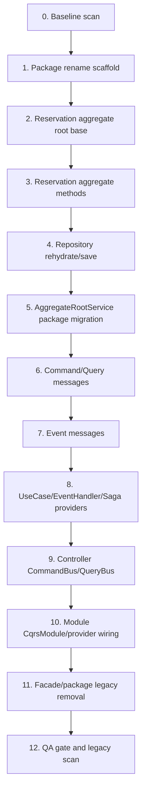
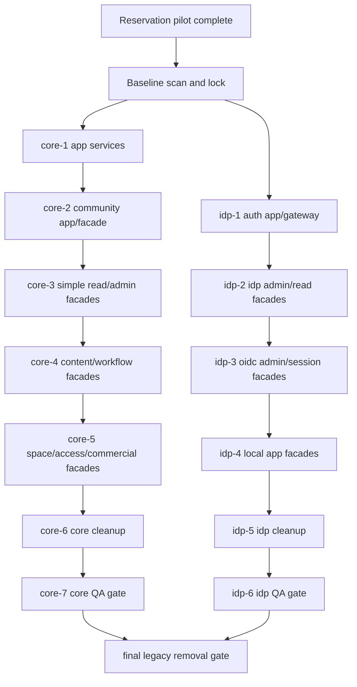

# CQRS / UseCase Migration Runbook

이 문서는 CQRS / UseCase 전환의 실행 source of truth이다. 실행 agent는 이 runbook의 phase, ownership, lock, QA gate 안에서만 작업하고, 누락된 계약은 임의 구현하지 않고 `Feedback:` packet으로 보고한다.

## 용어

| 용어 | 의미 | 예시 |
|---|---|---|
| `role` | `.codex/config.toml`에 등록된 역할 이름 | `mig-be-usecase-builder`, `be-usecase-builder` |
| `agent` | agent 생성 도구로 만들어진 실행 주체 | Reservation pilot을 수행하는 실행 agent |
| `agent_type` | agent 생성 도구 호출 시 사용하는 role 선택 파라미터 | `agent_type: "mig-be-usecase-builder"` |

규칙:

- migration role 파일은 `.codex/agents/mig/` 아래에만 둔다.
- migration role 등록명은 `mig-` prefix를 사용한다.
- 실행 agent는 peer role을 직접 호출하지 않는다.
- 실행 agent는 peer role 책임 파일을 임의 수정하지 않는다.
- `*.toml.guide.md` 보조 문서를 만들지 않는다.

## 목표 구조

backend write/read entrypoint를 Nest CQRS 기반 UseCase handler로 통일하고, legacy application/facade/gateway boundary 명칭을 제거한다.

```txt
Controller
  -> CommandBus.execute(command) / QueryBus.execute(query)
  -> Command / Query message (@cocrepo/command)
  -> UseCase Handler (@CommandHandler / @QueryHandler)
  -> AggregateRootService (@cocrepo/aggregate)
  -> AggregateRootEntity (@cocrepo/entity)
  -> Repository
```

transaction-critical 흐름에 필요하지 않은 후속 작업은 Event로 분리한다.

```txt
UseCase Handler
  -> EventBus.publish(event)
  -> Event message (@cocrepo/event)
  -> EventHandler (@EventsHandler, side effect)
  -> Saga (@Saga, Event -> Command orchestration)
```

외부 연동은 provider 단일 연동과 조합 판단을 분리한다.

```txt
NaverMapClient / KakaoMapClient
  -> MapService or UseCase Handler
  -> AggregateRootService (@cocrepo/aggregate)
```

목표 기준:

- Controller는 HTTP protocol adapter이며 `CommandBus`와 `QueryBus`만 주입한다.
- Controller는 Service, Repository, Client, legacy boundary provider, UseCase handler를 직접 주입하지 않는다.
- Command/Query message는 `@cocrepo/command`에서만 export한다.
- Event message는 `@cocrepo/event`에서만 export한다.
- app-local `*.cqrs.ts` 파일과 `packages/be-usecase/src/**/*.command.ts`, `packages/be-usecase/src/**/*.query.ts`는 남기지 않는다.
- `CommandHandler` / `QueryHandler`가 application layer의 UseCase이다.
- UseCase handler, EventHandler, Saga class는 class당 하나의 파일을 가진다.
- 여러 handler를 `core.usecase.ts` 같은 단일 파일에 묶지 않는다.
- handler/EventHandler/Saga provider array와 barrel export는 domain `index.ts`에서만 조립한다.
- `EventHandler`는 side effect 전용이고, `Saga`는 Event -> Command orchestration 전용이다.
- EventHandler 안에서 `CommandBus`를 호출하지 않는다.
- UseCase handler는 workflow orchestration을 수행하고, 도메인 규칙은 AggregateRootService 또는 AggregateRootEntity에 위임한다.
- AggregateRootService는 `@cocrepo/aggregate`의 Nest provider이며 class 이름은 `{Domain}AggregateRoot`이다.
- AggregateRootService 파일은 `packages/be-aggregate/src/{domain}/{domain}.aggregate-root.ts` 형태로 배치한다.
- `@cocrepo/entity`의 AggregateRootEntity와 `@cocrepo/aggregate`의 AggregateRootService를 혼동하지 않는다.
- Service는 aggregate root service가 아닌 support/domain helper service만 담당한다.
- Service 파일은 `packages/be-service/src/{domain}/{domain}.service.ts` 형태로 배치하고, `packages/be-service/src/*.service.ts` flat 배치를 남기지 않는다.
- Entity는 순수 상태 전이와 불변식만 가진다.
- Repository는 aggregate rehydrate/save와 read projection query를 담당한다.
- Client는 외부 시스템 하나와의 protocol adapter이다.
- 여러 Client 조합, fallback, provider 선택은 Service 또는 UseCase가 담당한다.

Backend value source rule:

- Controller, UseCase handler, Service, Repository, Client에서 여러 출처 값을 조합할 때는 값의 원천이 드러나야 한다.
- `command.params.timelineId`, `context.userId`, `entity.id`, `input.address`, `config.apiKey`처럼 source path를 유지한다.
- 반복이 길면 `const params = command.params`, `const context = this.context.requireContext()`처럼 출처명 alias까지만 사용한다.
- `const { timelineId } = command.params`처럼 원천이 사라지는 destructuring은 짧고 단일 출처인 지역 코드에서만 제한적으로 사용한다.
- Service/Repository input object, external API params/body/header, response mapping은 어떤 값이 command/query, context, entity, config, repository row 중 어디서 왔는지 코드에서 바로 보여야 한다.

## Package Rename Matrix

| 현재 | 목표 | 처리 기준 | migration role |
|---|---|---|---|
| 신규 | `packages/be-command` | 프로젝트 전체 Command/Query message contract package | `mig-be-package-migration-builder`, `mig-be-command-builder` |
| 신규 | `@cocrepo/command` | Controller와 UseCase handler가 공유하는 request intent package | `mig-be-package-migration-builder`, `mig-be-command-builder` |
| 신규 | `packages/be-event` | 프로젝트 전체 Event message contract package | `mig-be-package-migration-builder`, `mig-be-event-builder` |
| 신규 | `@cocrepo/event` | UseCase handler, EventHandler, Saga가 공유하는 발생 사실 package | `mig-be-package-migration-builder`, `mig-be-event-builder` |
| `apps/*/api/src/module/**/*.cqrs.ts` | 제거 | message는 `@cocrepo/command`, handler는 `@cocrepo/usecase`로 분리 이동 | `mig-be-command-builder`, `mig-be-usecase-builder` |
| `packages/be-app` | `packages/be-usecase` | ApplicationService 제거, UseCase handler package로 전환 | `mig-be-package-migration-builder`, `mig-be-usecase-builder` |
| `@cocrepo/app` | `@cocrepo/usecase` | import, package name, dependency, export 전체 변경 | `mig-be-package-migration-builder` |
| `packages/be-gateway` | `packages/be-client` | 외부 API 단일 연동 Client package로 전환 | `mig-be-package-migration-builder`, `mig-be-client-builder` |
| `@cocrepo/gateway` | `@cocrepo/client` | import, package name, dependency, export 전체 변경 | `mig-be-package-migration-builder` |
| `packages/be-facade` | 제거 | Controller boundary 조합은 UseCase로 이동, read model shaping은 Query UseCase로 이동 | `mig-be-package-migration-builder`, `mig-be-cqrs-controller-builder`, `mig-be-usecase-builder` |
| `@cocrepo/facade` | 제거 | legacy import가 남으면 migration incomplete | `mig-be-package-migration-builder` |
| 신규 | `packages/be-aggregate` | aggregate root service provider package | `mig-be-package-migration-builder`, `mig-be-aggregate-service-builder` |
| 신규 | `@cocrepo/aggregate` | `{Domain}AggregateRoot` provider package. entity가 아니라 aggregate root service | `mig-be-package-migration-builder`, `mig-be-aggregate-service-builder` |
| `packages/be-service` | 유지 | aggregate root service가 아닌 support/domain helper service 유지 | `be-service-builder` |
| `packages/be-entity` | 유지 | aggregate root entity만 `AbstractAggregateRootEntity`로 전환 | `mig-be-aggregate-entity-builder` |
| `packages/be-repository` | 유지 | aggregate rehydrate/save method와 read projection query 구분 | `mig-be-cqrs-repository-builder` |
| `@nestjs/cqrs` | 추가 | `CqrsModule`, `CommandBus`, `QueryBus`, `AggregateRoot`, handler decorator 사용 | `mig-be-package-migration-builder`, `mig-be-cqrs-module-builder` |

Package migration 원칙:

- 하위호환 wrapper, deprecated alias, legacy re-export를 만들지 않는다.
- `@cocrepo/command`를 먼저 만들고, 모든 command/query class를 이 package로 이동한다.
- `@cocrepo/event`를 만들고, 모든 event class를 이 package로 이동한다.
- Controller와 UseCase handler는 command/query를 `@cocrepo/command`에서 import한다.
- UseCase handler, EventHandler, Saga는 event를 `@cocrepo/event`에서 import한다.
- Aggregate root service provider는 `@cocrepo/aggregate`에서 export하고, UseCase handler 또는 module provider wiring에서 import한다.
- `@cocrepo/usecase`는 handler, event handler, saga와 provider array만 export하며, handler class source는 class당 하나의 파일로 유지한다.
- `@cocrepo/app -> @cocrepo/usecase`, `@cocrepo/gateway -> @cocrepo/client`는 package name, folder path, tsconfig reference, workspace dependency, barrel export를 한 번에 맞춘다.
- `@cocrepo/facade`는 Reservation pilot validation 후 domain phase별로 제거한다.
- pilot 이후 facade package가 임시 잔존하면 잔존 사유, 제거 phase, owner role을 이 문서에 기록해야 한다.
- Reservation pilot 완료 기준은 Reservation path에 legacy import가 없는 것이다.
- 전체 backend app migration 완료 후 `@cocrepo/facade`, `@cocrepo/app`, `@cocrepo/gateway` import가 하나라도 남으면 migration incomplete이다.

## Active Backend Role Rename

활성 backend role은 이미 CQRS 명칭으로 전환됐다.

| 구분 | active role | 용도 |
|---|---|---|
| Command | `be-command-builder` | 신규 backend delivery에서 Command/Query message 생성 |
| Event | `be-event-builder` | 신규 backend delivery에서 Event message 생성 |
| UseCase | `be-usecase-builder` | 신규 backend delivery에서 UseCase handler 생성 |
| Client | `be-client-builder` | 신규 backend delivery에서 외부 시스템 단일 연동 Client 생성 |

Legacy active role은 신규 실행에 사용하지 않는다. 아래 이름은 제거 또는 rename 대상 설명으로만 언급한다.

| legacy active role | 목표 | 처리 기준 |
|---|---|---|
| `be-app-builder` | `be-usecase-builder` + `be-command-builder` | ApplicationService 지시 제거, UseCase handler와 Command/Query message role로 분리 전환 |
| `be-gateway-builder` | `be-client-builder` | Gateway/Adapter 중심 지시 제거, 단일 외부 연동 Client role로 전환 |
| `be-facade-builder` | 제거 | facade layer는 신규 실행 role에서 제거 |

Migration pilot에는 active backend role 대신 `.codex/agents/mig/` 아래 migration role을 사용한다. 예를 들어 Reservation UseCase migration agent를 만들 때의 `agent_type`은 `mig-be-usecase-builder`이다.

## Role별 책임

| role | 책임 파일 | 책임 |
|---|---|---|
| `mig-arch-cqrs-migration-spec-writer` | `docs/backend/cqrs-usecase-migration.md` | runbook, execution graph, lock, QA gate 갱신 |
| `mig-be-package-migration-builder` | package.json, tsconfig, barrel, import path | package rename, dependency, export, legacy package 제거 |
| `mig-be-command-builder` | `packages/be-command/src/**`, app-local `*.cqrs.ts` message source | Command/Query message package 이동/생성 |
| `mig-be-event-builder` | `packages/be-event/src/**` | Event message package 이동/생성 |
| `mig-be-aggregate-entity-builder` | `packages/be-entity/src/**` | `AbstractAggregateRootEntity`, aggregate root entity 전환 |
| `mig-be-cqrs-repository-builder` | `packages/be-repository/src/**` | `plainToInstance(AggregateEntity, row)` rehydrate, aggregate save, read projection query 구분 |
| `mig-be-aggregate-service-builder` | `packages/be-aggregate/src/**`, legacy `packages/be-service/src/{domain}/{domain}.service.ts` | aggregate root service를 `{Domain}AggregateRoot` provider로 이동/정리, workflow orchestration 제거 |
| `mig-be-usecase-builder` | `packages/be-usecase/src/**` | UseCase handler, EventHandler, Saga, provider array |
| `mig-be-cqrs-controller-builder` | `apps/*/api/src/**/*.controller.ts`, `apps/server/src/**/*.controller.ts` | facade/service 주입 제거, `CommandBus`/`QueryBus` 전환 |
| `mig-be-cqrs-module-builder` | `apps/*/api/src/**/*.module.ts`, `apps/server/src/**/*.module.ts` | `CqrsModule`, handler providers, service/repository/client wiring |
| `mig-be-client-builder` | `packages/be-client/src/**` | 외부 API 단일 연동 Client 전환 |

## AbstractEntity / AggregateRoot 전환 기준

Reservation pilot 이전에는 `packages/be-entity/src/reservation.entity.ts`가 `AbstractEntity`를 상속했다. Reservation pilot에서는 Reservation을 aggregate root로 확정하고 다음 기준으로 전환했다. 이후 domain phase도 같은 기준을 반복 적용한다.

1. `packages/be-entity/src/abstract-aggregate-root.entity.ts`를 추가한다.
2. `AbstractAggregateRootEntity`는 Nest CQRS `AggregateRoot`를 직접 상속한다.
3. `AbstractAggregateRootEntity`는 기존 `AbstractEntity`의 외부 shape인 `id`, `createdAt`, `updatedAt`, `removedAt`, `toDto`를 유지한다.
4. `Reservation`은 `extends AbstractEntity`에서 `extends AbstractAggregateRootEntity`로 전환한다.
5. Reservation 하위 값/child entity가 있고 독립 aggregate root가 아니면 기존 `AbstractEntity`를 유지한다.
6. aggregate root가 아닌 entity는 pilot에서 `AggregateRoot`로 바꾸지 않는다.
7. entity 내부에는 sync 상태 전이와 불변식만 둔다.
8. entity 내부에서 Repository, Service, Client, Prisma, HTTP, async 작업을 호출하지 않는다.
9. repository의 `plainToInstance(Reservation, row)` 결과는 `Reservation -> AbstractAggregateRootEntity -> AggregateRoot` prototype chain을 가져야 한다.
10. aggregate event를 발행해야 하는 상태 전이는 `Reservation` instance method에서 수행하고, event commit 위치는 UseCase handler 또는 AggregateRootService 중 해당 phase에서 하나로 고정한다.

Pilot 후 중복이 커지면 `AbstractEntity`와 `AbstractAggregateRootEntity`가 공유하는 DTO 변환 helper를 추출한다. helper 추출이 필요하지만 owner가 불명확하면 실행 agent는 구현하지 않고 `Feedback:` packet으로 보고한다.

예상 형태:

```typescript
import type { BaseEntityFields } from "@cocrepo/type";
import { AggregateRoot } from "@nestjs/cqrs";

export abstract class AbstractAggregateRootEntity<DTO = unknown, O = never>
  extends AggregateRoot
  implements BaseEntityFields
{
  id!: string;
  createdAt!: Date;
  updatedAt!: Date | null;
  removedAt!: Date | null;

  toDto?(options?: O): DTO {
    return transformEntityToDto(this, options);
  }
}
```

## Reservation Pilot Scope

Reservation pilot의 목적은 package rename, aggregate root 전환, UseCase handler, controller bus entrypoint, module wiring, QA gate를 한 번에 검증하는 것이다.

Pilot 이전 핵심 파일:

- `apps/core/api/src/module/reservations/reservations.controller.ts`
- `apps/core/api/src/module/reservations/reservations.module.ts`
- `packages/be-facade/src/reservation.facade.ts`
- `packages/be-service/src/reservation/reservation.service.ts`
- `packages/be-repository/src/reservations.repository.ts`
- `packages/be-entity/src/reservation.entity.ts`
- `packages/be-service/__tests__/reservation.service.spec.ts`

Pilot 완료 후 목표 핵심 파일:

- `apps/core/api/src/module/reservations/reservations.controller.ts`
- `apps/core/api/src/module/reservations/reservations.module.ts`
- `packages/be-command/src/reservation/**/*.command.ts`
- `packages/be-command/src/reservation/**/*.query.ts`
- `packages/be-command/src/reservation/index.ts`
- `packages/be-command/src/index.ts`
- `packages/be-event/src/reservation/**/*.event.ts`
- `packages/be-event/src/reservation/index.ts`
- `packages/be-event/src/index.ts`
- `packages/be-usecase/src/reservation/**/*.usecase.ts`
- `packages/be-usecase/src/reservation/**/*.event-handler.ts`
- `packages/be-usecase/src/reservation/**/*.saga.ts`
- `packages/be-usecase/src/reservation/index.ts`
- `packages/be-usecase/src/index.ts`
- `packages/be-aggregate/src/reservation/reservation.aggregate-root.ts`
- `packages/be-aggregate/src/reservation/index.ts`
- `packages/be-aggregate/src/index.ts`
- `packages/be-repository/src/reservations.repository.ts`
- `packages/be-entity/src/abstract-aggregate-root.entity.ts`
- `packages/be-entity/src/reservation.entity.ts`

Pilot 결과:

- `apps/core/api/src/module/reservations/reservations.controller.ts`는 `CommandBus`와 `QueryBus`만 주입하고 `@cocrepo/command` command/query를 실행한다.
- `apps/core/api/src/module/reservations/reservations.module.ts`는 `CqrsModule`과 `ReservationUseCaseProviders`를 연결한다.
- `packages/be-command/src/reservation/**`에는 Reservation command/query message가 생성됐다.
- `packages/be-event/src/reservation/**`에는 Reservation event message가 생성됐다.
- `packages/be-usecase/src/reservation/**`에는 Reservation usecase handler, event handler, saga provider array가 생성됐다.
- `packages/be-facade/src/reservation.facade.ts`는 현재 repo에서 제거됐다.
- `packages/be-command`, `packages/be-event`, `packages/be-usecase`, `packages/be-client` package scaffold는 존재한다.
- 현재 repo 기준으로 `apps/core/api`와 `apps/idp/api` controller는 `@cocrepo/command` message와 `CommandBus`/`QueryBus` entrypoint를 사용한다.
- `apps/idp/api/src/module/**/*.cqrs.ts` app-local CQRS 파일은 제거됐고, message는 `@cocrepo/command`, handler는 `@cocrepo/usecase`로 이동했다.

## Reservation Pilot Execution Graph



| phase | owner role | input | required output | blocked if |
|---|---|---|---|---|
| 0. Baseline scan | `mig-be-package-migration-builder` | current imports, package refs, Reservation files | scan summary in final report | Reservation files or package refs cannot be located |
| 1. Package rename scaffold | `mig-be-package-migration-builder` | `packages/be-app`, `packages/be-gateway`, `packages/be-facade` refs | `packages/be-usecase`, `packages/be-client`, `@nestjs/cqrs` dependency wiring ready for pilot | package rename would require touching files outside ownership without lock |
| 2. Aggregate root base | `mig-be-aggregate-entity-builder` | `AbstractEntity`, `Reservation` | `AbstractAggregateRootEntity` exported, `Reservation` extends it | `BaseEntityFields` or DTO transform contract is unclear |
| 3. Aggregate methods | `mig-be-aggregate-entity-builder` | Reservation workflow currently in facade/service | pure Reservation state transition methods | method requires async dependency inside entity |
| 4. Repository rehydrate/save | `mig-be-cqrs-repository-builder` | Prisma row mapping, current repository methods | aggregate rehydrate/save methods and read projection methods separated | aggregate save contract or transaction boundary is unclear |
| 5. AggregateRootService package migration | `mig-be-aggregate-service-builder` | current `ReservationService` | `ReservationAggregateRoot` provider in `@cocrepo/aggregate`, domain inputs, repository load/save, aggregate rules | service still needs controller DTO or facade workflow |
| 6. Command/Query messages | `mig-be-command-builder` | endpoint mapping, DTO/input contract | `@cocrepo/command` Command/Query classes and barrel exports | message contract is missing |
| 7. Event messages | `mig-be-event-builder` | side-effect/orchestration contract | `@cocrepo/event` Event classes and barrel exports | no event contract is needed |
| 8. UseCase/EventHandler/Saga providers | `mig-be-usecase-builder` | command/query/event message, service contract | `@CommandHandler`/`@QueryHandler`, `@EventsHandler`, `@Saga`, provider arrays | service/repository contract is missing |
| 9. Controller bus entrypoint | `mig-be-cqrs-controller-builder` | current controller, `@cocrepo/command` messages | constructor has only `CommandBus` and `QueryBus`, methods execute command/query | handler command/query contract is missing |
| 10. Module wiring | `mig-be-cqrs-module-builder` | provider arrays, service/repository/client providers | `CqrsModule` import, providers include handler/event/saga arrays | package rename or handler export missing |
| 11. Legacy removal | `mig-be-package-migration-builder` | pilot migrated imports | Reservation facade removed, legacy package refs removed from pilot path | any active import still uses legacy package |
| 12. QA gate | QA role | migrated pilot | type-check/test/legacy scans pass | any required check fails |

Execution rules:

- 각 phase의 실행 agent는 phase 시작 전 owner 파일을 `rg`로 검색한다.
- phase output이 다음 phase의 input이므로 phase 순서를 건너뛰지 않는다.
- blocker가 발생하면 peer role 파일을 수정하지 않고 `Feedback:` packet을 남긴다.
- pilot 중 shared file lock 충돌이 있으면 가장 먼저 lock owner role에 re-entry가 필요하다고 보고한다.

## Reservation Endpoint Mapping

| endpoint | 현재 | 목표 |
|---|---|---|
| `GET booking-feed` | `ReservationFacade.getBookingFeed` | `QueryBus.execute(new GetReservationBookingFeedQuery(...))` |
| `GET checkout/bootstrap` | `ReservationFacade.getCheckoutBootstrap` | `QueryBus.execute(new GetReservationCheckoutBootstrapQuery(...))` |
| `POST checkout` | `ReservationFacade.createCheckout` | `CommandBus.execute(new CreateReservationCheckoutCommand(...))` |
| `POST /` | `ReservationFacade.create` | `CommandBus.execute(new CreateReservationCommand(...))` |
| `GET me` | `ReservationFacade.getMine` | `QueryBus.execute(new GetMyReservationsQuery(...))` |

Controller acceptance:

- constructor에는 `CommandBus`와 `QueryBus`만 남긴다.
- method body는 request param/body/user를 command/query input으로 변환한 뒤 `execute`를 호출한다.
- Swagger decorator, route path, response DTO contract는 pilot 목적상 유지한다.
- Controller에서 Service, Repository, Client, Facade, UseCase handler를 직접 주입하면 실패이다.

## Post-Pilot Backend App Inventory

기준 scan:

```bash
rg -n "@cocrepo/(facade|app|gateway)" apps/core/api apps/idp/api
rg -n "(Facade|ApplicationService|Gateway)" apps/core/api/src/module apps/idp/api/src/module
```

현재 상태:

- `@cocrepo/command`는 core, reservation, auth, idp Command/Query message를 가진다.
- `@cocrepo/usecase`는 core, reservation, auth, idp UseCase handler를 가진다.
- `apps/core/api`와 `apps/idp/api` controller는 `@cocrepo/command`에서 Command/Query를 import한다.
- `apps/idp/api/src/module/**/*.cqrs.ts` app-local CQRS 파일은 제거됐다.
- `@cocrepo/client` package scaffold는 있으나 legacy `OidcGateway` package 자체는 아직 잔존할 수 있다.
- `@cocrepo/app` package는 `AbilityApplicationService`, `AuthApplicationService`, `CommunityApplicationService`를 export한다.
- `@cocrepo/gateway` package는 `OidcGateway`를 export한다.
- `@cocrepo/facade` package는 Reservation을 제외한 facade를 export한다.
- `apps/core/api`와 `apps/idp/api`의 active controller/module path에는 `@cocrepo/facade`, `@cocrepo/app`, `@cocrepo/gateway` import가 없어야 한다.

Core API 남은 migration 목록:

| phase | domain / legacy provider | current files | target output | QA gate |
|---|---|---|---|---|
| core-0 | post-pilot baseline | `apps/core/api/package.json`, `apps/core/api/src/module/**`, `apps/core/api/test/**` | Reservation 완료 상태 보존, core legacy import 목록 확정 | `rg "@cocrepo/facade|@cocrepo/app|@cocrepo/gateway" apps/core/api` 결과를 final report에 첨부 |
| core-1 | `AbilityApplicationService` | `apps/core/api/src/module/abilities/**`, `packages/be-app/src/ability.application-service.ts` | ability command/query usecase, controller bus entrypoint, module `CqrsModule` wiring | `rg "@cocrepo/app|AbilityApplicationService" apps/core/api/src/module/abilities packages/be-usecase packages/be-app/src`에서 migrated path legacy 없음 |
| core-2 | `CommunityApplicationService`, `CommunityFacade` | `apps/core/api/src/module/community/**`, `packages/be-app/src/community.application-service.ts`, `packages/be-facade/src/community.facade.ts` | community usecase handlers, controller bus entrypoint, facade/application removal | `rg "@cocrepo/app|@cocrepo/facade|CommunityApplicationService|CommunityFacade" apps/core/api/src/module/community packages/be-usecase packages/be-app/src packages/be-facade/src`에서 migrated path legacy 없음 |
| core-3 | simple read/admin facades: `ActionFacade`, `RoleFacade`, `SubjectFacade`, `TemplateFacade`, `RoutineFacade`, `TranslationFacade` | `apps/core/api/src/module/{actions,roles,subjects,templates,routines,translations,i18n-catalog}/**`, matching `packages/be-facade/src/*.facade.ts` | query/command usecase split, shared translation usecase reused by `translations` and `i18n-catalog` routes | migrated domain별 `rg "@cocrepo/facade|Facade" apps/core/api/src/module/{domain} packages/be-facade/src/{domain}.facade.ts packages/be-usecase/src/{domain}` |
| core-4 | content/workflow facades: `AssetFacade`, `FolderFacade`, `ServiceDocumentFacade`, `TaskFacade`, `InquiryFacade`, `TimelineFacade` | `apps/core/api/src/module/{assets,folders,service-documents,tasks,inquiries,timelines}/**`, matching facade files, `apps/core/api/test/exercises.e2e-spec.ts` | asset/document/task/inquiry/timeline usecase handlers, controller bus entrypoint, module wiring, E2E provider update | `pnpm --filter core-api test -- exercises.e2e-spec.ts` plus migrated domain legacy scan |
| core-5 | space/access/commercial facades: `SpaceFacade`, `UserFacade`, `TenantAccessRequestFacade`, `CourseFacade`, `PaymentFacade`, `PolicyFacade`, `PolicyAssignmentFacade` | `apps/core/api/src/module/{spaces,users,tenant-access-requests,courses,payments,policies,policy-assignments}/**`, matching facade files, `apps/core/api/test/grounds.e2e-spec.ts` | cross-domain usecase handlers with explicit service/repository boundaries, no facade orchestration | `pnpm --filter core-api test -- grounds.e2e-spec.ts` plus migrated domain legacy scan |
| core-6 | core package/test cleanup | `apps/core/api/package.json`, `apps/core/api/test/jest-e2e.json`, `packages/be-app/src/index.ts`, `packages/be-facade/src/index.ts` | remove `@cocrepo/app` and `@cocrepo/facade` from core-api deps/mappers after all core imports are gone | `rg "@cocrepo/facade|@cocrepo/app|@cocrepo/gateway" apps/core/api` has no result |
| core-7 | core QA gate | all core migrated files | type-check, unit/e2e smoke, operationId/DTO contract retained | `pnpm --filter @cocrepo/usecase type-check`; `pnpm --filter core-api type-check`; `pnpm --filter core-api test --passWithNoTests` |

IDP API 남은 migration 목록:

| phase | domain / legacy provider | current files | target output | QA gate |
|---|---|---|---|---|
| idp-0 | post-pilot baseline | `apps/idp/api/package.json`, `apps/idp/api/jest.config.js`, `apps/idp/api/src/module/**` | idp legacy import 목록 확정, auth external boundary lock 설정 | `rg "@cocrepo/facade|@cocrepo/app|@cocrepo/gateway" apps/idp/api` 결과를 final report에 첨부 |
| idp-1 | `AuthApplicationService`, `OidcGateway` | `apps/idp/api/src/module/auth/**`, `packages/be-app/src/auth.application-service.ts`, `packages/be-gateway/src/oidc.gateway.ts` | auth command/query usecases, `OidcGateway -> @cocrepo/client` protocol Client, controller bus entrypoint, module `CqrsModule` wiring | `rg "@cocrepo/app|@cocrepo/gateway|AuthApplicationService|OidcGateway" apps/idp/api/src/module/auth packages/be-usecase packages/be-client packages/be-app/src packages/be-gateway/src`에서 migrated path legacy 없음 |
| idp-2 | admin/read facades: `IdpDashboardFacade`, `IdpAccountFacade`, `SecurityPolicyFacade`, `EmailVerificationFacade` | `apps/idp/api/src/module/{idp-dashboard,idp-accounts,security-policy,email-verification}/**`, matching `packages/be-facade/src/*.facade.ts` | idp admin query/command usecases, module wiring, controller bus entrypoint | migrated domain별 `rg "@cocrepo/facade|Facade" apps/idp/api/src/module/{domain} packages/be-facade/src/{domain}.facade.ts packages/be-usecase/src/{domain}` |
| idp-3 | OIDC admin/session facades: `OidcClientFacade`, `OidcSessionFacade`, `TranslationFacade` | `apps/idp/api/src/module/{oidc-client,oidc-session,i18n-catalog}/**`, matching facade files | oidc client/session/i18n query/command usecases, no facade export | migrated domain legacy scan plus `pnpm --filter idp-api type-check` |
| idp-4 | local app facades: `InteractionFacade`, `OidcFacade`, `PasswordResetFacade` | `apps/idp/api/src/module/{interaction,oidc,password-reset}/**/*.facade.ts`, matching controllers/modules | local facade workflow moved to usecase handlers; app-local facade files removed or renamed out of facade pattern | `rg "Facade|ApplicationService" apps/idp/api/src/module/{interaction,oidc,password-reset}` has no controller/module provider result |
| idp-5 | idp package/test cleanup | `apps/idp/api/package.json`, `apps/idp/api/jest.config.js`, `packages/be-app/src/index.ts`, `packages/be-gateway/src/index.ts`, `packages/be-facade/src/index.ts` | remove `@cocrepo/app`, `@cocrepo/gateway`, `@cocrepo/facade` deps and Jest mappers after all idp imports are gone | `rg "@cocrepo/facade|@cocrepo/app|@cocrepo/gateway" apps/idp/api` has no result |
| idp-6 | idp QA gate | all idp migrated files | type-check, auth controller tests, operationId/DTO contract retained | `pnpm --filter @cocrepo/usecase type-check`; `pnpm --filter @cocrepo/client type-check`; `pnpm --filter idp-api type-check`; `pnpm --filter idp-api test --passWithNoTests` |

Post-pilot app execution graph:



Post-pilot execution rules:

- core-api와 idp-api phase는 app boundary가 다르면 병렬 실행할 수 있다.
- 같은 package barrel(`packages/be-usecase/src/index.ts`, `packages/be-facade/src/index.ts`, `packages/be-app/src/index.ts`, `packages/be-gateway/src/index.ts`, `packages/be-client/src/index.ts`)을 수정하는 phase는 병렬 실행하지 않는다.
- package dependency cleanup은 app별 import scan이 0이 된 뒤에만 수행한다.
- `@cocrepo/facade` 제거는 domain별 controller/module/usecase migration이 끝난 뒤 matching facade export와 file을 제거하는 방식으로 진행한다.
- WebSocket 같은 Nest protocol adapter class의 `Gateway` suffix는 `@cocrepo/gateway` legacy package와 구분한다. 예를 들어 `InquiriesGateway`는 external Client migration 대상이 아니라 protocol adapter QA 확인 대상이다.

## File Ownership / Lock

| 파일/패턴 | lock owner role | 병렬 여부 | 기준 |
|---|---|---|---|
| `.codex/agents/mig/*.toml` | read-only | false | migration role 파일은 여기에만 두며 pilot 실행 중 수정하지 않음 |
| `docs/backend/cqrs-usecase-migration.md` | `mig-arch-cqrs-migration-spec-writer` | false | 이 runbook |
| package rename 관련 `package.json`, `tsconfig*.json`, workspace import | `mig-be-package-migration-builder` | false | package rename은 atomic하게 진행 |
| `packages/be-entity/src/abstract-aggregate-root.entity.ts` | `mig-be-aggregate-entity-builder` | false | 신규 aggregate root base |
| `packages/be-entity/src/reservation.entity.ts` | `mig-be-aggregate-entity-builder` | false | Reservation aggregate root 전환 |
| `packages/be-entity/src/index.ts` | `mig-be-aggregate-entity-builder` | false | entity barrel export |
| `packages/be-repository/src/reservations.repository.ts` | `mig-be-cqrs-repository-builder` | false | rehydrate/save/query separation |
| `packages/be-repository/src/index.ts` | `mig-be-cqrs-repository-builder` | false | repository export가 필요할 때만 |
| `packages/be-aggregate/src/reservation/reservation.aggregate-root.ts` | `mig-be-aggregate-service-builder` | false | Reservation aggregate root service provider |
| `packages/be-aggregate/src/index.ts` | `mig-be-aggregate-service-builder` | false | aggregate provider export |
| legacy `packages/be-service/src/reservation/reservation.service.ts` | `mig-be-aggregate-service-builder` | false | aggregate root service 이동 후 cleanup |
| `packages/be-service/src/index.ts` | `mig-be-aggregate-service-builder` | false | legacy service export cleanup |
| `packages/be-command/src/reservation/**` | `mig-be-command-builder` | false | Reservation command/query message |
| `packages/be-command/src/{domain}/**` | `mig-be-command-builder` | domain별 독립 시 true | domain command/query message |
| `packages/be-command/src/index.ts` | `mig-be-command-builder` | false | command package barrel |
| `packages/be-event/src/reservation/**` | `mig-be-event-builder` | false | Reservation event message |
| `packages/be-event/src/{domain}/**` | `mig-be-event-builder` | domain별 독립 시 true | domain event message |
| `packages/be-event/src/index.ts` | `mig-be-event-builder` | false | event package barrel |
| `packages/be-usecase/src/reservation/**` | `mig-be-usecase-builder` | false | Reservation usecase/event handler/saga |
| `packages/be-usecase/src/index.ts` | `mig-be-usecase-builder` | false | usecase package barrel |
| `packages/be-usecase/src/{domain}/**` | `mig-be-usecase-builder` | domain별 독립 시 true | domain usecase/event handler/saga |
| `packages/be-app/src/*.application-service.ts` | `mig-be-usecase-builder` | false | workflow를 usecase로 이동한 뒤 제거 |
| `packages/be-app/src/index.ts` | `mig-be-package-migration-builder` | false | app package legacy export 제거 |
| `packages/be-facade/src/*.facade.ts` | `mig-be-usecase-builder`, `mig-be-cqrs-controller-builder` | domain별 독립 시 true | facade workflow/read shaping을 usecase로 이동한 뒤 제거 |
| `packages/be-facade/src/index.ts` | `mig-be-package-migration-builder` | false | facade package legacy export 제거 |
| `packages/be-gateway/src/*.gateway.ts` | `mig-be-client-builder` | false | external gateway를 client로 이동한 뒤 제거 |
| `packages/be-gateway/src/index.ts` | `mig-be-package-migration-builder` | false | gateway package legacy export 제거 |
| `apps/core/api/src/module/reservations/reservations.controller.ts` | `mig-be-cqrs-controller-builder` | false | controller bus entrypoint |
| `apps/core/api/src/module/reservations/reservations.module.ts` | `mig-be-cqrs-module-builder` | false | module provider wiring |
| `apps/core/api/src/module/**/*.controller.ts` | `mig-be-cqrs-controller-builder` | domain별 독립 시 true | controller bus entrypoint |
| `apps/core/api/src/module/**/*.module.ts` | `mig-be-cqrs-module-builder` | domain별 독립 시 true | `CqrsModule` and provider wiring |
| `apps/core/api/package.json`, `apps/core/api/test/**` | `mig-be-package-migration-builder`, `qa-be-e2e-testing` | false | dependency/test mapper cleanup and E2E provider update |
| `apps/idp/api/src/module/**/*.controller.ts` | `mig-be-cqrs-controller-builder` | domain별 독립 시 true | controller bus entrypoint |
| `apps/idp/api/src/module/**/*.module.ts` | `mig-be-cqrs-module-builder` | domain별 독립 시 true | `CqrsModule` and provider wiring |
| `apps/idp/api/src/module/**/*.facade.ts` | `mig-be-usecase-builder`, `mig-be-cqrs-controller-builder` | domain별 독립 시 true | app-local facade workflow extraction/removal |
| `apps/idp/api/package.json`, `apps/idp/api/jest.config.js` | `mig-be-package-migration-builder`, `qa-be-testing` | false | dependency/test mapper cleanup |
| `packages/be-client/src/**` | `mig-be-client-builder` | domain별 독립 시 true | provider별 Client 파일 |

## QA Gate

Reservation pilot acceptance gate:

```bash
rg "@cocrepo/facade|ReservationFacade" apps/core/api/src/module/reservations packages/be-usecase packages/be-service packages/be-repository packages/be-entity
rg "@cocrepo/app|@cocrepo/gateway" apps/core/api/src/module/reservations packages/be-usecase/src/reservation
rg 'from "@cocrepo/usecase"' apps/*/api/src/module -g "*.controller.ts"
rg "\\.cqrs|packages/be-usecase/src/.*\\.(command|query)\\.ts" apps packages -g "!dist/**"
rg "packages/be-facade/src/reservation.facade.ts"
rg "be-app-builder|be-gateway-builder|be-facade-builder" .codex/config.toml .codex/agents || true
pnpm --filter @cocrepo/command type-check
pnpm --filter @cocrepo/event type-check
pnpm --filter @cocrepo/entity type-check
pnpm --filter @cocrepo/repository type-check
pnpm --filter @cocrepo/service type-check
pnpm --filter @cocrepo/usecase type-check
pnpm --filter core-api type-check
pnpm --filter @cocrepo/service test -- reservation.service.spec.ts
```

QA 해석:

- `@cocrepo/command`, `@cocrepo/event`, `@cocrepo/usecase` package 생성 전에는 해당 filter가 실패하는 것이 정상이다.
- phase 1 완료 후 `pnpm --filter @cocrepo/command type-check`, `pnpm --filter @cocrepo/event type-check`, `pnpm --filter @cocrepo/usecase type-check`가 실패하면 QA failure이다.
- Reservation pilot 완료 후 첫 번째와 두 번째 `rg`는 결과가 없어야 한다.
- Reservation pilot 완료 후 controller에서 `@cocrepo/usecase` message를 import하면 실패이다.
- Reservation pilot 완료 후 app-local `*.cqrs.ts`나 `packages/be-usecase/src/**/*.command.ts`, `packages/be-usecase/src/**/*.query.ts`가 남으면 실패이다.
- legacy active role scan에서 legacy active role이 active 설정이나 role 파일로 나오면 실패이다.

Acceptance 기준:

- Reservation controller constructor에는 `CommandBus`와 `QueryBus`만 남는다.
- Reservation controller는 Command/Query를 `@cocrepo/command`에서 import한다.
- Reservation module은 `CqrsModule`을 import하고 handler arrays를 providers에 등록한다.
- `@cocrepo/command`는 provider로 등록하지 않는다.
- `packages/be-facade/src/reservation.facade.ts`는 pilot 완료 후 삭제된다.
- Reservation aggregate root method는 entity에 있고, repository/client/service async 호출은 entity에 없다.
- Repository는 aggregate write method와 read projection method를 구분한다.
- Service는 controller DTO를 직접 받지 않는다.
- Handler는 command/query field를 service input으로 변환한다.
- Handler에서 Prisma를 직접 호출하지 않는다.
- Transaction boundary는 UseCase handler 또는 Service method 중 한 곳에만 둔다.
- Swagger operationId와 DTO response contract는 유지한다.

Core API phase gate:

```bash
rg "@cocrepo/facade|@cocrepo/app|@cocrepo/gateway" apps/core/api
rg "Facade|ApplicationService" apps/core/api/src/module
pnpm --filter @cocrepo/usecase type-check
pnpm --filter core-api type-check
pnpm --filter core-api test --passWithNoTests
```

Core QA 해석:

- core-1부터 core-5까지는 migrated domain path의 `rg` 결과가 없어야 한다.
- core-6 완료 후 첫 번째 `rg`는 결과가 없어야 한다.
- 두 번째 `rg`에서 `InquiriesGateway` 같은 Nest protocol adapter가 나오면 external gateway legacy가 아니므로 controller/module direct-injection 여부만 확인한다.
- core package dependency cleanup은 첫 번째 `rg`가 0일 때만 통과한다.

IDP API phase gate:

```bash
rg "@cocrepo/facade|@cocrepo/app|@cocrepo/gateway" apps/idp/api
rg "Facade|ApplicationService|OidcGateway" apps/idp/api/src/module
pnpm --filter @cocrepo/usecase type-check
pnpm --filter @cocrepo/client type-check
pnpm --filter idp-api type-check
pnpm --filter idp-api test --passWithNoTests
```

IDP QA 해석:

- idp-1 완료 후 auth path와 `packages/be-gateway/src/oidc.gateway.ts`에는 `AuthApplicationService`와 `OidcGateway` active usage가 없어야 한다.
- idp-2부터 idp-4까지는 migrated domain path의 facade direct injection이 없어야 한다.
- idp-5 완료 후 첫 번째 `rg`는 결과가 없어야 한다.
- idp package dependency cleanup은 first-party imports와 Jest mapper가 모두 `@cocrepo/usecase`/`@cocrepo/client` 기준으로 바뀐 뒤에만 통과한다.

Final cross-app legacy gate:

```bash
rg "@cocrepo/facade|@cocrepo/app|@cocrepo/gateway" apps/core/api apps/idp/api packages
rg 'from "@cocrepo/usecase"' apps/core/api/src/module apps/idp/api/src/module -g "*.controller.ts"
rg "\\.cqrs|packages/be-usecase/src/.*\\.(command|query)\\.ts" apps packages -g "!dist/**"
rg "packages/be-app|packages/be-gateway|packages/be-facade" .
rg "be-app-builder|be-gateway-builder|be-facade-builder" .codex/config.toml .codex/agents || true
pnpm --filter @cocrepo/command type-check
pnpm --filter @cocrepo/event type-check
pnpm --filter @cocrepo/entity type-check
pnpm --filter @cocrepo/repository type-check
pnpm --filter @cocrepo/service type-check
pnpm --filter @cocrepo/usecase type-check
pnpm --filter @cocrepo/client type-check
pnpm --filter core-api type-check
pnpm --filter idp-api type-check
```

Final QA 해석:

- 첫 번째 `rg`는 결과가 없어야 한다.
- Controller가 `@cocrepo/usecase`에서 Command/Query를 import하면 실패이다.
- app-local `*.cqrs.ts`나 `packages/be-usecase/src/**/*.command.ts`, `packages/be-usecase/src/**/*.query.ts`가 남으면 실패이다.
- legacy package path scan은 migration history 문서와 git metadata 외 결과가 없어야 한다.
- legacy active role scan에서 legacy active role이 active 설정이나 role 파일로 나오면 실패이다.
- `@cocrepo/command`, `@cocrepo/event`, `@cocrepo/usecase`, `@cocrepo/client`가 app dependency, workspace, tsconfig, package export에 등록돼야 한다.

## Legacy 제거 기준

Reservation pilot과 core-api/idp-api phase QA 통과 후 다음 조건을 모두 만족하면 legacy 제거를 완료로 본다.

- `rg "@cocrepo/facade|@cocrepo/app|@cocrepo/gateway" apps packages` 결과가 없다.
- `rg "packages/be-facade|packages/be-app|packages/be-gateway" .` 결과가 docs의 migration history 또는 git metadata 외에 없다.
- `packages/be-facade`, `packages/be-app`, `packages/be-gateway`가 pnpm workspace references에서 제거됐다.
- `packages/be-facade`, `packages/be-app`, `packages/be-gateway`가 tsconfig references에서 제거됐다.
- `packages/be-command`, `packages/be-event`, `packages/be-usecase`, `packages/be-client`가 workspace, tsconfig references, package exports, app module dependency에 등록됐다.
- 기존 facade/application service/gateway 테스트가 usecase/client/service 테스트로 이동했다.
- Controller가 legacy facade/service/application direct injection 없이 `CommandBus`/`QueryBus`만 호출한다.
- Controller와 UseCase handler가 Command/Query를 `@cocrepo/command`에서 import한다.
- Orval Swagger operationId와 DTO contract가 유지된다.
- active backend role 참조는 `be-command-builder`, `be-event-builder`, `be-usecase-builder`, `be-client-builder`를 사용한다.
- legacy active role인 `be-app-builder`, `be-facade-builder`, `be-gateway-builder`는 제거/rename 대상으로만 남는다.

## Feedback Packet

실행 agent 최종 보고에는 항상 아래 packet을 포함한다. finding이 없으면 모든 값을 `none`으로 둔다.

```yaml
Feedback:
  feedback_type: none|contract-gap|dependency-missing|implementation-blocker|qa-failure
  affected_phase: package|package-migration|entity|aggregate-entity|aggregate-root-service|repository|service|usecase|controller|module|client|qa|none
  affected_roles: mig-role-name-or-none
  affected_files: path-or-none
  required_action: none-or-action
```

이 runbook을 수정하는 `mig-arch-cqrs-migration-spec-writer` role의 최종 보고 packet은 finding이 없을 때 반드시 아래 형식을 사용한다.

```yaml
Feedback:
  feedback_type: none
  affected_phase: none
  affected_roles: none
  affected_files: none
  required_action: none
```
