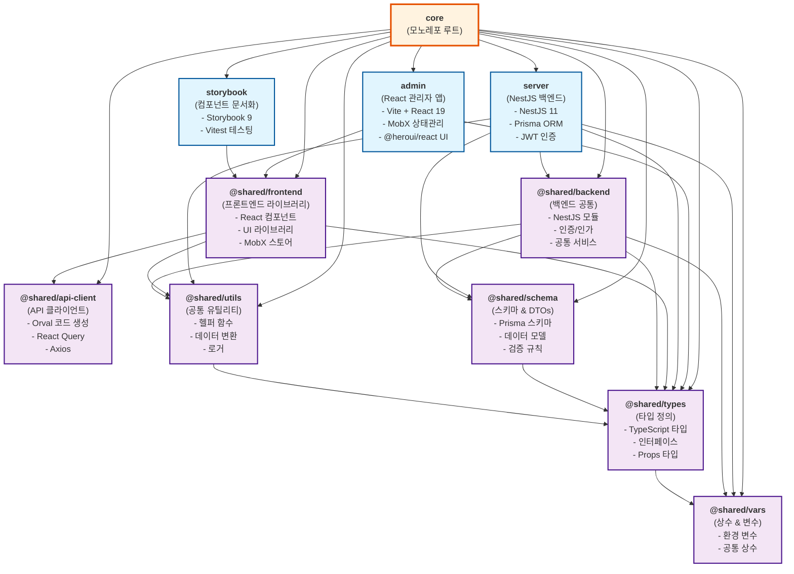

# 모노레포 의존성 그래프

이 문서는 현재 프로젝트의 전체 의존성 구조를 시각화한 그래프입니다.

## 프로젝트 구조 개요

```
core (모노레포 루트)
├── apps/
│   ├── admin (React 관리자 앱)
│   ├── server (NestJS 백엔드)
│   └── storybook (컴포넌트 문서화)
└── packages/
    ├── shared-api-client (API 클라이언트)
    ├── shared-backend (백엔드 공통 유틸리티)
    ├── shared-frontend (프론트엔드 컴포넌트 라이브러리)
    ├── shared-schema (Prisma 스키마 & DTOs)
    ├── shared-types (TypeScript 타입 정의)
    ├── shared-utils (공통 유틸리티)
    └── shared-vars (공통 상수 & 변수)
```

## 의존성 그래프

### Mermaid 다이어그램



## 주요 의존성 설명

### 🎯 Apps (애플리케이션)

#### **admin** (React 관리자 앱)
- **주요 기술**: React 19, Vite, MobX, TailwindCSS
- **UI 라이브러리**: @heroui/react
- **의존성**:
  - `@shared/frontend`: 공통 컴포넌트 및 스토어
  - `@shared/types`: TypeScript 타입 정의

#### **server** (NestJS 백엔드)
- **주요 기술**: NestJS 11, Prisma, JWT, AWS SDK
- **의존성**:
  - `@shared/backend`: 공통 백엔드 모듈
  - `@shared/schema`: 데이터베이스 스키마
  - `@shared/utils`: 공통 유틸리티
  - `@shared/vars`: 환경 변수 및 상수
  - `@shared/types`: TypeScript 타입 정의

#### **storybook** (컴포넌트 문서화)
- **주요 기술**: Storybook 9, Vitest
- **의존성**:
  - `@shared/frontend`: 문서화할 컴포넌트들

### 📦 Shared Packages (공유 패키지)

#### **@shared/frontend** (프론트엔드 라이브러리)
- **역할**: 재사용 가능한 React 컴포넌트, 스토어, 훅
- **주요 기술**: React 19, MobX, @heroui/react, TailwindCSS
- **의존성**:
  - `@shared/api-client`: API 호출
  - `@shared/utils`: 공통 유틸리티
  - `@shared/types`: TypeScript 타입

#### **@shared/backend** (백엔드 공통)
- **역할**: NestJS 공통 모듈, 인증/인가, 공통 서비스
- **주요 기술**: NestJS, CASL, Passport
- **의존성**:
  - `@shared/schema`: 데이터 모델
  - `@shared/utils`: 공통 유틸리티
  - `@shared/vars`: 환경 변수
  - `@shared/types`: TypeScript 타입

#### **@shared/api-client** (API 클라이언트)
- **역할**: 백엔드 API 클라이언트 자동 생성
- **주요 기술**: Orval, React Query, Axios
- **의존성**: 없음 (독립적)

#### **@shared/schema** (스키마 & DTOs)
- **역할**: Prisma 데이터베이스 스키마, DTO 클래스
- **주요 기술**: Prisma, class-validator
- **의존성**:
  - `@shared/types`: TypeScript 타입

#### **@shared/types** (타입 정의)
- **역할**: 전역 TypeScript 타입, 인터페이스, Props 타입
- **의존성**:
  - `@shared/vars`: 상수 타입

#### **@shared/utils** (공통 유틸리티)
- **역할**: 헬퍼 함수, 데이터 변환, 로거
- **주요 기술**: dayjs, remeda, class-transformer
- **의존성**:
  - `@shared/types`: TypeScript 타입

#### **@shared/vars** (상수 & 변수)
- **역할**: 환경 변수, 공통 상수
- **의존성**: 없음 (최하위 레벨)

## 빌드 순서

Turbo.json 기반 빌드 순서:

1. **@shared/vars** (상수)
2. **@shared/types** (타입)
3. **@shared/utils** (유틸리티)
4. **@shared/schema** (스키마)
5. **@shared/api-client** (API 클라이언트)
6. **@shared/backend** (백엔드 공통)
7. **@shared/frontend** (프론트엔드 라이브러리)
8. **apps/server** (백엔드 앱)
9. **apps/admin** (프론트엔드 앱)
10. **apps/storybook** (문서화)

## 패키지 관리

- **패키지 매니저**: pnpm 9.6.0
- **모노레포 도구**: Turbo
- **의존성 해결**: workspace 프로토콜 사용

## 주요 외부 의존성

### 프론트엔드
- **React**: 19.1.0
- **UI 라이브러리**: @heroui/react 2.7.8
- **상태 관리**: MobX 6.13.6
- **라우팅**: React Router 7.6.1
- **빌드 도구**: Vite 6.3.5

### 백엔드
- **프레임워크**: NestJS 11.0.10
- **ORM**: Prisma 6.4.1
- **인증**: JWT, Passport
- **데이터베이스**: PostgreSQL (Prisma 지원)

### 개발 도구
- **TypeScript**: 5.7.3+
- **테스팅**: Vitest 3.2.3, Jest 29.7.0
- **문서화**: Storybook 9.0.10
- **코드 품질**: ESLint, Prettier

이 의존성 그래프는 프로젝트의 전체적인 아키텍처와 패키지 간의 관계를 명확히 보여주며, 새로운 기능 개발이나 리팩토링 시 참고할 수 있습니다.
