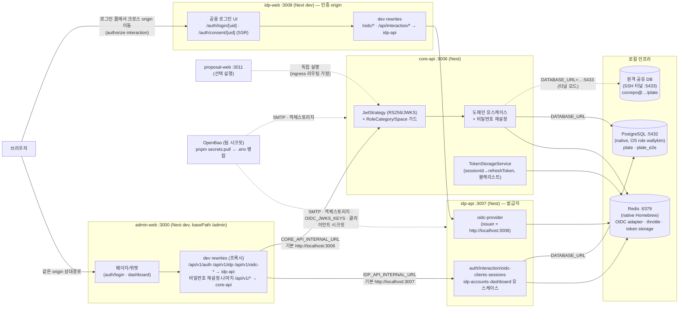
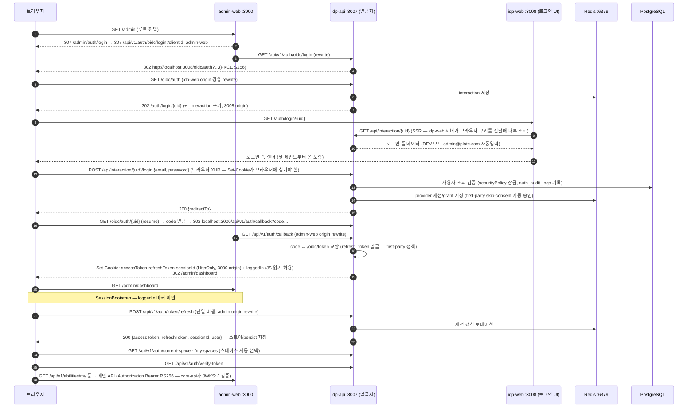

# 로컬 개발 환경 구성도

로컬 개발 환경의 서비스 구성, 통신 경로, 인증 흐름을 그린 문서입니다.
(2026-09-23 기준 — 발급자 단일화: idp-api가 발급자, idp-web이 공용 로그인 UI,
core-api는 비즈니스 API + 토큰 검증만 담당. prod ingress 구조와 동형)

## 서비스 구성 다이어그램

## 로그인 인증 시퀀스

## 구성 요소 표

| 구성 요소 | 포트 | 역할 | 비고 |
|---|---|---|---|
| admin-web | 3000 | 어드민 프론트엔드(Next.js dev) | basePath `/admin`. dev 전용 rewrites로 `/api/v1/auth`·`/api/v1/idp`·`/api/v1/oidc-*`는 idp-api로, 비밀번호 재설정과 나머지 `/api/v1/*`는 core-api로 프록시(배포 환경은 ingress가 같은 경로 계약을 담당) |
| idp-api | 3007 | 발급자(oidc-provider) + 인증/IDP 관리 API | issuer `http://localhost:3008`(idp-web 오리진). 공유 DB/Redis 필요, 자체 `.env`(SMTP/OIDC 시크릿). `pnpm start` 선택지 7 — admin-web 선택 시 자동 포함 |
| idp-web | 3008 | 공용 로그인 UI(모든 클라이언트) | `/auth/login/[uid]`·`/auth/consent/[uid]` 소유(SSR — 서버가 `IDP_API_INTERNAL_URL`로 interaction 조회). `/oidc/*`·`/api/interaction/*`·`/api/v1/*`를 idp-api로 프록시. `pnpm start` 선택지 8 — admin-web 선택 시 자동 포함 |
| core-api | 3006 | 백엔드 도메인 API + 비밀번호 재설정 | 발급자 없음 — `OIDC_JWKS_URI`로 idp 발급 토큰을 RS256 검증만 함 |
| proposal-web | 3011 | 퍼블릭 제안 랜딩 | 선택 실행 |
| Redis | 6379 | OIDC 어댑터(interaction/grant/session/code), rate limit, 세션 저장소 | native Homebrew. 여러 세션에서 공유 |
| PostgreSQL (native) | 5432 | 로컬 DB `plate`, e2e DB `plate_e2e` | OS role `wallykim`(trust). `DATABASE_URL` 미지정 시 자동 탐색으로 선택됨 |
| PostgreSQL (터널) | 5433 | 원격 공유 dev DB | SSH 포워딩. 사용하려면 `DATABASE_URL` 명시 |
| OpenBao | — | 팀 시크릿 원천 | `pnpm secrets:pull`이 core-api/idp-api `.env`에 병합(SMTP, 객체스토리지, OIDC 서명 키, 클라이언트 시크릿 — 두 `.env`는 같은 JWKS/쿠키 시크릿 값을 공유) |

## 브라우저 측 인증 상태

- **HttpOnly 쿠키(앱 origin 3000)**: `accessToken`(RS256 at+jwt), `refreshToken`, `sessionId` — JS가 읽을 수 없고 모든 요청에 자동 첨부
- **HttpOnly 쿠키(발급자 origin 3008)**: `_session` 등 OP 세션 쿠키 — SSO 재개·RP-Initiated Logout에 사용
- **`loggedIn` 마커 쿠키**: 비민감 값, JS 읽기 허용. SessionBootstrap/fetch 클라이언트(customFetch)가 이 표시가 없으면 갱신 요청 없이 로그인 화면으로 이동
- **localStorage `admin-persist`**: MobX 스토어 부트스트랩 결과(토큰 세션, 선택 스페이스, 가용 스페이스 목록)

## 주의사항

- **issuer = idp-web 오리진(3008)**: 발급자 엔드포인트(`/oidc/*`)와 로그인 UI는 같은 origin이어야 interaction 세션 쿠키가 로그인 제출 XHR에 실려갑니다. 포트를 바꿀 때는 `OIDC_ISSUER`·`OIDC_INTERACTION_BASE_URL`·`IDP_WEB_PORT`를 함께 맞춰야 합니다(start.sh가 idp-web이 세션에 있으면 자동으로 덮어씁니다).
- **admin-web 로컬 개발은 서버 4개**: admin-web + core-api + idp-api + idp-web — `pnpm start`에서 admin-web을 선택하면 나머지 셋이 자동으로 포함됩니다.
- **Next dev는 프로젝트 디렉터리당 1개만 실행 가능**(`.next/dev` 락). 포트를 바꿔도 두 번째 인스턴스는 뜨지 않습니다.
- **DB는 `DATABASE_URL`이 없으면 자동 탐색** — probe 순서: `DATABASE_URL` → `POSTGRES_*` → 로컬 OS role(native PG 5432) → cocrepo 기본값(docker-compose용). 원격 터널(5433)을 쓰려면 `DATABASE_URL`을 명시하면 됩니다. 계정도 DB에 맞게 사용(5432: `admin@plate.com`, 원격: `local-admin@example.com`).
- 실행은 루트에서 `pnpm start` — OpenBao 시크릿 pull 후 인프라 기동(docker)/마이그레이션/부트스트랩을 거쳐 선택 서비스를 띄웁니다. Docker를 쓰지 않는 머신에서는 `START_SKIP_INFRA_START=1`을 지정합니다. OpenBao가 봉인(sealed) 상태면 pull이 안내 메시지와 함께 실패합니다(봉인 해제: `kubectl exec -n openbao openbao-0 -- bao operator unseal <UNSEAL_KEY>`).
