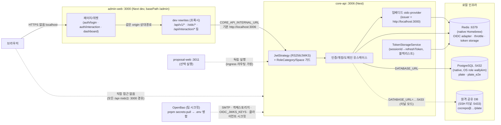
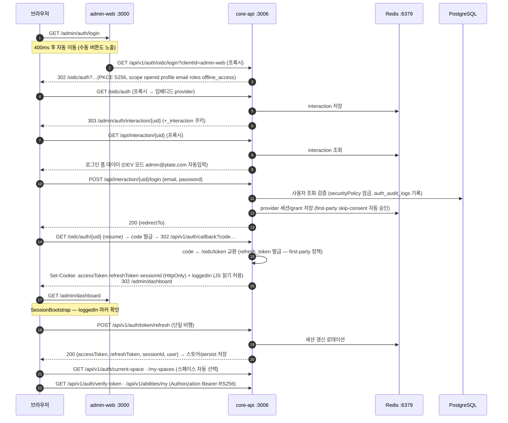

# 로컬 개발 환경 구성도

로컬 개발 환경의 서비스 구성, 통신 경로, 인증 흐름을 그린 문서입니다.
(2026-09-19 기준 — native 인증 경로 제거 후 OIDC 단일 체계)

## 서비스 구성 다이어그램

## 로그인 인증 시퀀스

## 구성 요소 표

| 구성 요소 | 포트 | 역할 | 비고 |
|---|---|---|---|
| admin-web | 3000 | 어드민 프론트엔드(Next.js dev) | basePath `/admin`. dev 전용 rewrites로 `/api`, `/oidc`를 core-api로 프록시(배포 환경은 ingress가 같은 경로 처리) |
| core-api | 3006 | 백엔드 API + 임베디드 oidc-provider | issuer는 `http://localhost:3000`(admin-web 오리진). 토큰 검증은 RS256/JWKS 단일 전략 |
| proposal-web | 3011 | 퍼블릭 제안 랜딩 | 선택 실행 |
| Redis | 6379 | OIDC 어댑터(interaction/grant/session/code), rate limit, 세션 저장소 | native Homebrew. 여러 세션에서 공유 |
| PostgreSQL (native) | 5432 | 로컬 DB `plate`, e2e DB `plate_e2e` | OS role `wallykim`(trust). `pnpm start` 시 `DATABASE_URL` 명시 필요 |
| PostgreSQL (터널) | 5433 | 원격 공유 dev DB | SSH 포워딩. 병렬 세션 등에서 이쪽을 바라보고 실행되기도 함 |
| OpenBao | — | 팀 시크릿 원천 | `pnpm secrets:pull`이 core-api `.env`에 병합(SMTP, 객체 스토리지, OIDC 서명 키, 클라이언트 시크릿) |

## 브라우저 측 인증 상태

- **HttpOnly 쿠키**: `accessToken`(RS256 at+jwt), `refreshToken`, `sessionId` — JS가 읽을 수 없고 모든 요청에 자동 첨부
- **`loggedIn` 마커 쿠키**: 비민감 값, JS 읽기 허용. SessionBootstrap/axios 인터셉터가 이 표시가 없으면 갱신 요청 없이 로그인 화면으로 이동
- **localStorage `admin-persist`**: MobX 스토어 부트스트랩 결과(토큰 세션, 선택 스페이스, 가용 스페이스 목록)

## 주의사항

- **issuer·redirect_uri는 admin-web 오리진(3000)**: provider 엔드포인트(`/oidc/*`)의 물리적 처리는 core-api지만 URL은 3000을 경유합니다. core-api를 다른 포트로 띄우면 `OIDC_ISSUER`/`OIDC_ADMIN_BASE_URL`/`ADMIN_WEB_URL`을 함께 맞춰야 합니다.
- **Next dev는 프로젝트 디렉터리당 1개만 실행 가능**(`.next/dev` 락). 포트를 바꿔도 두 번째 인스턴스는 뜨지 않습니다.
- **DB는 `DATABASE_URL`이 없으면 자동 탐색** — probe 순서: `DATABASE_URL` → `POSTGRES_*` → 로컬 OS role(native PG 5432) → cocrepo 기본값(docker-compose용). 원격 터널(5433)을 쓰려면 `DATABASE_URL`을 명시하면 됩니다. 계정도 DB에 맞게 사용(5432: `admin@plate.com`, 원격: `local-admin@example.com`).
- 실행은 루트에서 `pnpm start` — OpenBao 시크릿 pull 후 인프라 기동(docker)/마이그레이션/부트스트랩을 거쳐 선택 서비스를 띄웁니다. Docker를 쓰지 않는 머신에서는 `START_SKIP_INFRA_START=1`을 지정합니다. OpenBao가 봉인(sealed) 상태면 pull이 안내 메시지와 함께 실패합니다(봉인 해제: `kubectl exec -n openbao openbao-0 -- bao operator unseal <UNSEAL_KEY>`).
