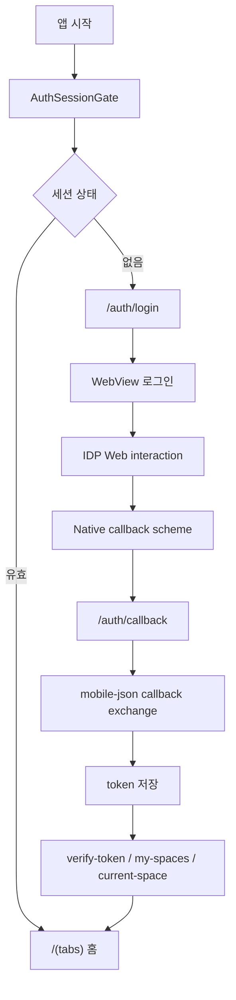
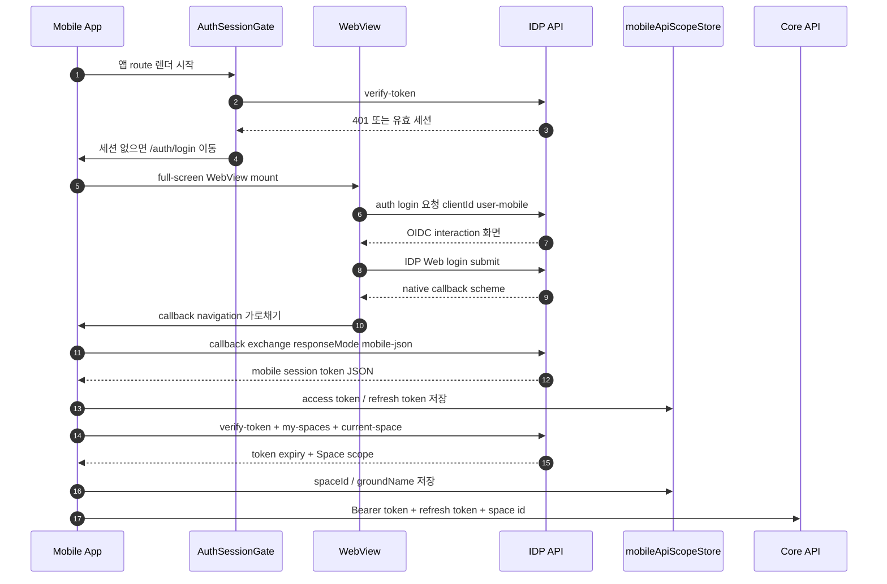
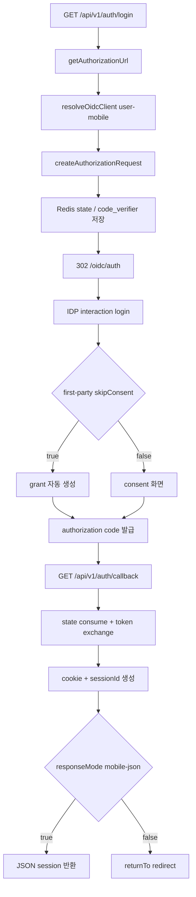
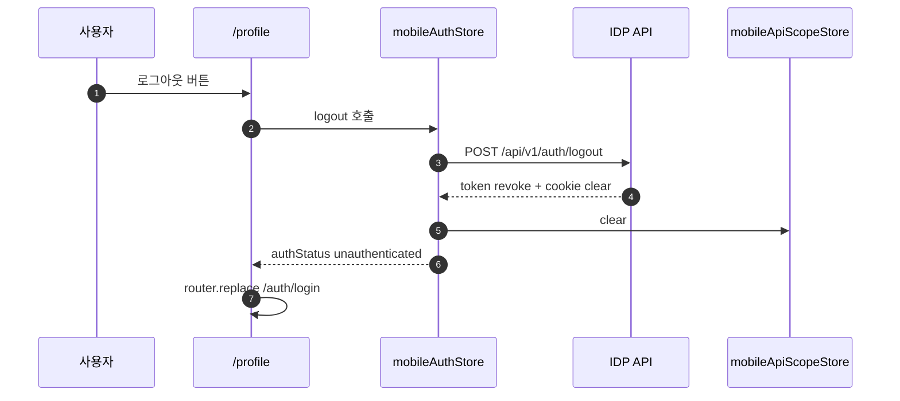

# Mobile OIDC Flow Guide

> Updated: 2026-05-11
> Scope: `apps/mobile`, `apps/idp/api`, `packages/be-app`, `packages/fe-api`

이 문서는 모바일 앱의 OIDC 로그인 흐름을 실제 코드 기준으로 설명합니다. 모바일 앱은 Expo Router 화면 안에서 IDP Web 로그인 화면을 `WebView`로 열고, native custom scheme callback을 앱 내부 route로 변환한 뒤, IDP API의 `mobile-json` 응답으로 token과 Space scope를 구성합니다.

## 한 줄 요약



Mermaid가 렌더되지 않는 viewer에서는 아래 텍스트 흐름을 기준으로 읽습니다.

```text
앱 시작
  -> AuthSessionGate
    -> 세션 유효: /(tabs) 홈
    -> 세션 없음: /auth/login
      -> WebView: IDP /api/v1/auth/login?clientId=user-mobile
      -> IDP Web interaction
      -> kr.co.cocdev.onoramobile://auth/callback
      -> Expo Router /auth/callback
      -> IDP /api/v1/auth/callback?responseMode=mobile-json
      -> mobileApiScopeStore token 저장
      -> verify-token + my-spaces + current-space
      -> /(tabs) 홈
```

## 주요 코드 위치

| 영역 | 파일 | 역할 |
|------|------|------|
| 모바일 인증 설정 | `apps/mobile/src/auth/auth-config.ts` | IDP/Core API base URL, `user-mobile`, login/callback path, 보호 route 목록 |
| 루트 셸 | `apps/mobile/src/app/_layout.tsx` | `QueryClientProvider`, design system, `AuthSessionGate`, API client bootstrap |
| 세션 게이트 | `apps/mobile/src/auth/AuthSessionGate.tsx` | 앱 최초 route 진입 전 세션 확인, 로그인/홈 redirect, splash hide |
| 로그인 route | `apps/mobile/src/app/auth/login.tsx` | full-screen WebView 로그인 컨테이너, callback scheme interception |
| callback route | `apps/mobile/src/app/auth/callback.tsx` | code/state 교환, token 저장, native session 검증 후 redirect |
| auth utility | `apps/mobile/src/auth/_utils/auth.ts` | login URL 생성, callback URL 판별, `mobile-json` callback exchange |
| mobile API scope | `apps/mobile/src/auth/mobile-api-scope.ts` | access/refresh token, token expiry, Space 목록/current Space 보관 |
| mobile auth store | `apps/mobile/src/auth/auth-store.ts` | `verifySession()`, `logout()`, 인증 상태 관리 |
| IDP auth controller | `apps/idp/api/src/module/auth/auth.controller.ts` | `/api/v1/auth/login`, `/api/v1/auth/callback`, token/space/logout endpoint |
| auth application service | `packages/be-app/src/auth.application-service.ts` | OIDC state/PKCE, token exchange, cookie/session 생성, verify/refresh/logout |
| Orval Axios clients | `packages/fe-api/src/libs/customAxios.ts`, `packages/fe-api/src/libs/customIdpAxios.ts` | Bearer token, refresh token, `x-space-id` header 주입 |

## Client 계약

모바일 OIDC client는 `user-mobile`입니다.

| 항목 | 값 |
|------|----|
| client id | `user-mobile` |
| redirect URI | `kr.co.cocdev.onoramobile://auth/callback` |
| Expo scheme | `kr.co.cocdev.onoramobile` |
| client type | public native client |
| token endpoint auth | `none` |
| grant types | `authorization_code`, `refresh_token` |
| response types | `code` |
| scope | `openid profile email` |
| consent | first-party + `skipConsent=true` |

기준 파일:

- `apps/mobile/app.json`
- `packages/be-prisma/src/reference-data/definitions/oidc.ts`
- `packages/be-service/src/oidc-runtime-client-config/index.ts`

`user-mobile`은 public client라 client secret이 없습니다. 서버 쪽 OIDC callback은 저장된 state의 PKCE `code_verifier`로 authorization code를 token으로 교환합니다.

## URL과 환경 변수

모바일 런타임은 기본값과 환경 변수를 함께 봅니다.

| 대상 | 기본 iOS/local | 기본 Android emulator | 주요 env |
|------|----------------|------------------------|----------|
| IDP API | `http://localhost:3007` | `http://10.0.2.2:3007` | `EXPO_PUBLIC_IDP_API_URL`, `EXPO_PUBLIC_IDP_API_INTERNAL_URL`, `IDP_API_URL`, `IDP_API_INTERNAL_URL` |
| Core API | `http://localhost:3006` | `http://10.0.2.2:3006` | `EXPO_PUBLIC_CORE_API_URL`, `EXPO_PUBLIC_CORE_API_INTERNAL_URL`, `EXPO_PUBLIC_CORE_API_BASE_URL`, `CORE_API_URL`, `CORE_API_INTERNAL_URL` |
| native redirect | `kr.co.cocdev.onoramobile://auth/callback` | same | 서버 reference-data override: `OIDC_USER_MOBILE_REDIRECT_URI` |

Android emulator 안의 `localhost`는 emulator 자신을 가리키므로, 모바일 코드는 IDP/Core API URL의 `localhost` 또는 `127.0.0.1`을 `10.0.2.2`로 보정합니다.

## 정상 로그인 상세



| 순서 | 주체 | 동작 |
|------|------|------|
| 1 | Mobile App | 앱 route 렌더를 시작합니다. |
| 2 | `AuthSessionGate` | `GET /api/v1/auth/verify-token`으로 기존 세션을 확인합니다. |
| 3 | `AuthSessionGate` | 세션이 없으면 `/auth/login`으로 이동합니다. |
| 4 | `/auth/login` | full-screen WebView를 mount합니다. |
| 5 | WebView | `GET /api/v1/auth/login?clientId=user-mobile&returnTo=native-callback`을 로드합니다. |
| 6 | IDP | `/oidc/auth` 또는 `/interaction/[uid]`로 로그인 interaction을 진행합니다. |
| 7 | IDP | 로그인 성공 후 `kr.co.cocdev.onoramobile://auth/callback?code=...&state=...`로 이동합니다. |
| 8 | WebView shell | custom scheme navigation을 가로채고 Expo Router `/auth/callback`으로 변환합니다. |
| 9 | `/auth/callback` | `GET /api/v1/auth/callback?clientId=user-mobile&code=...&state=...&responseMode=mobile-json`을 호출합니다. |
| 10 | IDP API | `{ data: accessToken, refreshToken, expiresAt, user }`를 반환합니다. |
| 11 | Mobile App | `mobileApiScopeStore`에 token을 저장합니다. |
| 12 | Mobile App | `verify-token`, `my-spaces`, `current-space`를 다시 호출합니다. |
| 13 | Mobile App | `spaceId`, `groundName`을 저장하고 홈으로 이동합니다. |
| 14 | Core API 요청 | 이후 요청에 `Authorization`, `x-refresh-token`, `x-space-id` header가 붙습니다. |

```text
Mobile App
  -> AuthSessionGate
    -> IDP API: verify-token
    -> /auth/login
      -> WebView
        -> IDP API: /api/v1/auth/login?clientId=user-mobile
        -> IDP Web interaction
        -> native callback scheme
      -> /auth/callback
        -> IDP API: /api/v1/auth/callback?responseMode=mobile-json
        -> mobileApiScopeStore: token 저장
        -> IDP API: verify-token + my-spaces + current-space
      -> /(tabs) 홈
```

### 1. 앱 bootstrap

`apps/mobile/src/app/_layout.tsx`는 앱 시작 시 다음을 수행합니다.

- `configureMobileApiScope()`로 Core/IDP Orval Axios client가 같은 `mobileApiScopeStore`를 보도록 설정합니다.
- `setLoginRedirectUrl("/auth/login")`, `setIdpLoginRedirectUrl("/auth/login")`을 설정합니다.
- `setIdpBaseUrl(getIdpApiBaseUrl())`로 IDP API base URL을 설정합니다.
- `AuthSessionGate`로 전체 route tree를 감쌉니다.

### 2. 초기 session gate

`AuthSessionGate`는 callback route가 아닌 경우 `mobileAuthStore.verifySession()`을 먼저 호출합니다.

| 상태 | 동작 |
|------|------|
| `authStatus=unknown` | `verifySession()` 실행 |
| 인증 성공 + `/auth/*`에 있음 | `/`로 이동 |
| 인증 성공 + 보호 route | 현재 route 렌더 |
| 인증 성공 + 모바일 route가 아닌 경로 | `/`로 정규화 |
| 비인증 + `/auth/*`가 아님 | `/auth/login?returnTo=...`로 이동 |
| `/auth/callback` | gate 검증을 건너뛰고 callback route가 직접 처리 |

보호 route는 현재 `/`, `/payments/checkout`, `/profile`, `/reservations`입니다.

### 3. WebView login route

`/auth/login`은 native form을 렌더링하지 않습니다. 로그인 UI와 문구는 IDP Web interaction 화면이 소유하고, 모바일 route는 full-screen WebView shell만 제공합니다.

생성되는 login URL의 형태:

```txt
{IDP_API_BASE_URL}/api/v1/auth/login
  ?clientId=user-mobile
  &returnTo=kr.co.cocdev.onoramobile://auth/callback?returnTo=/
```

WebView 설정의 의도:

| 설정 | 이유 |
|------|------|
| `incognito` | 이전 로그인 interaction cookie가 다음 로그인에 섞이지 않게 함 |
| `sharedCookiesEnabled={false}` | native cookie jar 공유 차단 |
| `thirdPartyCookiesEnabled={false}` | third-party cookie 의존 축소 |
| `originWhitelist`에 custom scheme 포함 | `kr.co.cocdev.onoramobile://*` callback 감지 |

### 4. Login flow drift 방지

WebView는 다음 drift를 감지하면 현재 navigation을 막고 `user-mobile` login URL을 다시 로드합니다.

| 감지 대상 | 막는 이유 |
|-----------|----------|
| `/auth/login` | IDP Web shell route로 잘못 이동하는 경우 방지 |
| `/api/v1/auth/login`인데 `clientId !== user-mobile` | 다른 client flow 혼입 방지 |
| `/oidc/auth`인데 `client_id !== user-mobile` | `idp-web` 등 web client authorization으로 drift 방지 |
| Android에서 `localhost` redirect | `10.0.2.2`로 보정해 host dev server 연결 유지 |

### 5. Native callback interception

WebView가 다음 URL로 이동하려고 하면:

```txt
kr.co.cocdev.onoramobile://auth/callback?code=...&state=...&returnTo=...
```

`apps/mobile/src/app/auth/login.tsx`가 navigation을 중단하고 Expo Router 내부 route로 변환합니다.

```txt
/auth/callback?code=...&state=...&returnTo=...
```

이 덕분에 OS deep link handler에만 의존하지 않고 WebView 내부 navigation도 앱 route에서 안정적으로 처리합니다.

### 6. Callback exchange

`/auth/callback`은 `apps/mobile/src/auth/_utils/auth.ts`의 `exchangeAuthCallback()`을 통해 IDP API callback endpoint를 직접 호출합니다.

```txt
GET {IDP_API_BASE_URL}/api/v1/auth/callback
  ?clientId=user-mobile
  &code=...
  &state=...
  &responseMode=mobile-json
```

서버의 `apps/idp/api/src/module/auth/auth.controller.ts`는 다음 조건을 만족하면 redirect 대신 JSON을 반환합니다.

```ts
clientId === "user-mobile" &&
responseMode === "mobile-json" &&
mobileSession
```

응답 데이터는 모바일이 API header에 사용할 session token입니다.

```ts
{
  accessToken: string;
  refreshToken: string;
  accessTokenExpiresAt: number;
  refreshTokenExpiresAt: number;
  user: UserDto;
}
```

### 7. Token 저장과 session 재검증

callback route는 성공 응답의 token을 `mobileApiScopeStore.setSessionTokens()`로 저장한 뒤, 반드시 `mobileAuthStore.verifySession()`을 다시 실행합니다.

로그인 성공 판별은 2단계입니다.

| 단계 | 성공 조건 | 실패 처리 |
|------|-----------|-----------|
| callback 처리 성공 | `resolveAuthCallbackResult()`가 IDP `error` 파라미터를 받지 않고, `code/state` callback exchange가 `error`가 아닌 결과를 반환해 `nextState.status === "success"`가 됩니다. | `nextState.status !== "success"`이면 기존 native session을 한 번 더 검증하고, 그것도 실패하면 에러 UI를 표시합니다. |
| native session 최종 성공 | callback 응답의 `session` token을 저장한 뒤 `mobileAuthStore.verifySession()`이 `true`를 반환합니다. | `verifySession()`이 `false`이면 홈으로 보내지 않고 "로그인은 완료됐지만 앱에서 세션을 확인하지 못했습니다" 에러 UI를 표시합니다. |

따라서 최종 로그인 성공은 아래 조건을 모두 만족해야 합니다.

```ts
nextState.status === "success" &&
mobileAuthStore.verifySession() === true
```

`nextState.status === "success"`는 "callback을 처리할 수 있었다"는 뜻에 가깝고, 앱에서 실제 로그인 완료로 보는 최종 기준은 `mobileAuthStore.verifySession()` 통과입니다.

`verifySession()`은 다음 API를 순서대로 호출합니다.

| 순서 | API | 목적 |
|------|-----|------|
| 1 | `GET /api/v1/auth/verify-token` | access token 유효성 및 만료 시간 확인 |
| 2 | `GET /api/v1/auth/my-spaces` | 사용자가 접근 가능한 Space 목록 조회 |
| 3 | `GET /api/v1/auth/current-space` | 현재 요청의 `x-space-id` 또는 기본 Space 확정 |

이 과정이 모두 성공해야 `authStatus`가 `authenticated`가 되고 홈 route로 이동합니다.

### 8. Core API 요청 scope

`configureMobileApiScope()`는 같은 `mobileApiScopeStore`를 Core API와 IDP API Axios client에 주입합니다.

이후 Orval client 요청은 자동으로 다음 header를 붙입니다.

| Header | 값 출처 | 용도 |
|--------|---------|------|
| `Authorization` | `mobileApiScopeStore.accessToken` | Bearer access token |
| `x-refresh-token` | `mobileApiScopeStore.refreshToken` | token refresh |
| `x-space-id` | `mobileApiScopeStore.spaceId` | Space scope |
| `x-language` | locale store가 설정된 경우 | 응답 언어 |

홈/예약/결제 route는 `mobileApiScopeStore.isSpaceSelectionResolved`와 `spaceId`를 보고 query 실행 여부를 결정합니다. Space가 확정되기 전에는 Core API 예약 query를 시작하지 않습니다.

## 서버 측 OIDC 처리



```text
GET /api/v1/auth/login
  -> AuthApplicationService.getAuthorizationUrl()
  -> resolveOidcClient("user-mobile")
  -> OidcGateway.createAuthorizationRequest()
  -> Redis에 state + code_verifier + returnTo + clientId 저장
  -> 302 /oidc/auth?...
  -> IDP interaction login
    -> first-party + skipConsent=true: grant 자동 생성
    -> 그 외: consent 화면
  -> authorization code 발급
  -> GET /api/v1/auth/callback
  -> state consume + code/token exchange
  -> HttpOnly cookie + sessionId 생성
  -> responseMode=mobile-json: JSON session 반환
  -> 그 외: returnTo redirect
```

서버에서 중요한 점:

- state와 PKCE `code_verifier`는 callback에서 한 번만 consume합니다.
- `user-mobile` session id는 client id prefix를 포함해 생성됩니다.
- refresh는 session id에서 client id를 복원해서 같은 client 설정으로 token refresh를 수행합니다.
- `first-party + skipConsent` client는 interaction service와 provider configuration 양쪽에서 consent grant 자동 생성을 지원합니다.

## 실패와 복구

| 상황 | 처리 |
|------|------|
| callback에 `error` 또는 `error_description` 있음 | `/auth/callback`에서 사용자용 실패 메시지와 재시도 버튼 표시 |
| `code` 또는 `state` 없음 | `returnTo`만 있으면 기존 session 검증을 시도하고, 없으면 invalid 처리 |
| callback exchange 실패 | 기존 native session이 유효하면 홈으로 복귀, 아니면 실패 상태 표시 |
| callback 성공 후 `verify-token` 실패 | 홈으로 이동하지 않고 "앱에서 세션을 확인하지 못했습니다" 메시지 표시 |
| IDP Web returnTo(`/dashboard` 등)가 섞임 | 모바일 route whitelist 기준으로 `/`로 정규화 |
| 로그아웃 | IDP logout 호출 후 `mobileApiScopeStore.clear()`, `/auth/login`으로 이동 |

## 로그아웃 흐름



| 순서 | 주체 | 동작 |
|------|------|------|
| 1 | 사용자 | `/profile`에서 로그아웃 버튼을 누릅니다. |
| 2 | `/profile` | `mobileAuthStore.logout()`을 호출합니다. |
| 3 | `mobileAuthStore` | `POST /api/v1/auth/logout`을 호출합니다. |
| 4 | IDP API | token revoke, cookie clear를 수행합니다. |
| 5 | `mobileAuthStore` | `mobileApiScopeStore.clear()`로 token/space scope를 비웁니다. |
| 6 | `/profile` | `router.replace("/auth/login")`으로 로그인 route로 이동합니다. |

## 테스트 기준

모바일 OIDC 흐름은 route unit test에 주요 계약이 잡혀 있습니다.

| 테스트 파일 | 검증 |
|-------------|------|
| `apps/mobile/src/route-tests/auth/login.test.tsx` | WebView login URL, custom scheme interception, drift 방지, Android localhost 보정 |
| `apps/mobile/src/route-tests/auth/callback.test.tsx` | callback 성공/실패, token 저장, session 재검증, retry |
| `apps/mobile/src/route-tests/auth/AuthSessionGate.test.tsx` | 초기 session gate, 로그인/홈 redirect, splash hide |
| `apps/mobile/src/route-tests/auth/auth-utils.test.ts` | login URL 생성, `mobile-json` callback exchange |

관련 검증 명령:

```bash
pnpm --filter mobile-app test
pnpm --filter mobile-app type-check
```

## 운영 체크리스트

- `user-mobile` redirect URI가 서버 reference-data와 Expo scheme에 모두 같은 값인지 확인합니다.
- Android emulator에서 IDP/Core API base URL이 `10.0.2.2`로 보정되는지 확인합니다.
- callback URL에 `responseMode=mobile-json`이 포함되는지 확인합니다.
- callback 성공 후 token 저장만으로 끝내지 말고 `verify-token`, `my-spaces`, `current-space`까지 통과하는지 확인합니다.
- 보호 route 추가 시 `AUTHENTICATED_ROUTE_PATHS`에 route를 추가하고 AuthSessionGate test를 갱신합니다.
- 로그인 route가 `idp-web` client로 drift하지 않는지 WebView navigation test를 유지합니다.
