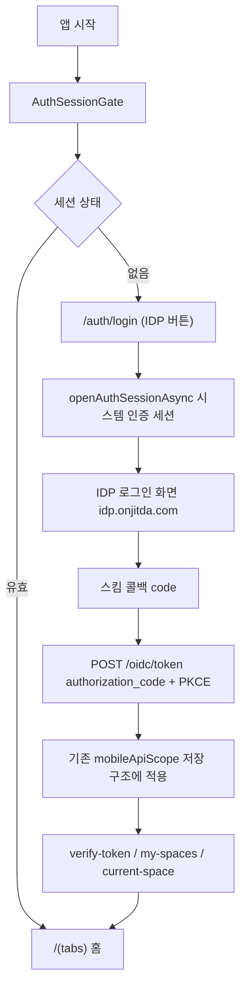

# Mobile OIDC Flow Guide

> Updated: 2026-09-19
> Scope: `apps/mobile`, `packages/common-constant`, `apps/idp`(발급자/idp-web)

이 문서는 모바일 앱의 OIDC 로그인 흐름을 실제 코드 기준으로 설명합니다.
모바일 앱은 **WebView 없이** 시스템 인증 세션(iOS 앱 시트 / Android Custom Tabs)으로
IDP 로그인 화면(idp-web)을 띄우고, 앱 스킴 콜백으로 authorization code를 받아
클라이언트 PKCE(S256)로 발급자 토큰 엔드포인트에서 직접 토큰을 교환합니다.

## 한 줄 요약



Mermaid가 렌더되지 않는 viewer에서는 아래 텍스트 흐름을 기준으로 읽습니다.

```text
앱 시작
  -> AuthSessionGate
     -> 세션 없음: /auth/login
        -> [IDP로 로그인] 버튼
           -> loginWithOidcSheet()  (apps/mobile/src/auth/oidc/oidc-login.ts)
              1) PKCE code_verifier/code_challenge(S256) + state 생성
              2) openAuthSessionAsync(authorize URL, 스킴 리다이렉트 URI)
              3) IDP 로그인 화면(idp-web)에서 자격증명 입력
              4) 스킴 콜백 code + state 검증
              5) POST {OIDC_ISSUER_URL}/oidc/token (public client, code_verifier)
           -> MobileSession.loginWithOidc()
              -> applySession (기존 토큰 저장 구조 재사용, sessionId=null)
              -> verifySession
     -> 유효: /(tabs) 홈
```

## 핵심 구성 요소

| 요소 | 위치 | 역할 |
|---|---|---|
| 발급자 URL | `packages/common-constant/src/oidc/options.ts` `OIDC_ISSUER_URL` | `https://idp.onjitda.com` 기본, `EXPO_PUBLIC_OIDC_ISSUER_URL`로 재정의 |
| 시트 로그인 + PKCE + 토큰 교환 | `apps/mobile/src/auth/oidc/oidc-login.ts` | `openAuthSessionAsync` + `/oidc/token` 직접 호출 |
| OIDC 클라이언트 | `user-mobile` (public, `token_endpoint_auth_method: none`) | 시드: `packages/be-prisma/src/reference-data/definitions/oidc.ts` |
| 리다이렉트 URI | `kr.co.cocdev.onoramobile://auth/callback` | 앱 스킴(식별자)과 동일하게 유지 |
| 세션 적용 | `apps/mobile/src/auth/mobile-session.ts` `loginWithOidc()` | 기존 `mobileApiScope`/SecureStore 구조 재사용 |
| 토큰 갱신 | `refreshOidcSession()` | `/oidc/token` refresh_token 그랜트 (sessionId 없는 세션) |

## 이전 구조(2026-05 표준화)와의 차이

- 2026-05-14 `b49831f9b4` 이후 모바일은 native email/password 직접 로그인을 사용했다.
- 이제 자격증명 검증은 IDP가 수행한다: 앱은 IDP 로그인 화면을 시트로 띄우고
  토큰은 발급자가 교환해 준다. 앱 안에 자격증명 입력 폼/WebView는 없다.
- 토큰 저장/검증/Space 선택 체인(`mobileApiScope`, SecureStore,
  verify-token → my-spaces → current-space)은 그대로 재사용한다.

## 로컬 개발

- 발급자 기본값은 운영(`https://idp.onjitda.com`)이다. 로컬 idp-api를 쓰려면
  모바일 빌드 환경변수로 `EXPO_PUBLIC_OIDC_ISSUER_URL=http://localhost:3007`을 지정한다.
- 로컬 시트 콜백은 앱 스킴이 등록된 dev 클라이언트 빌드에서만 동작한다
  (Expo Go의 커스텀 스킴 지원 제한 참고).
