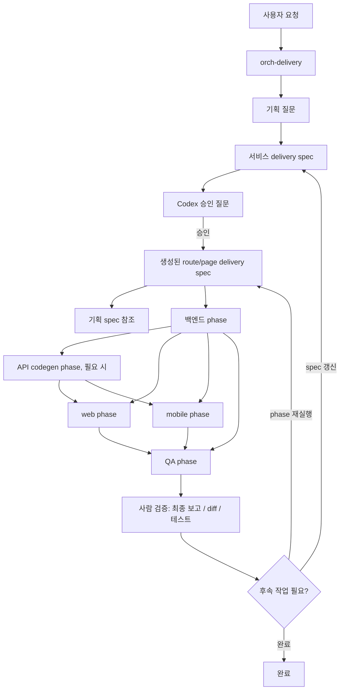
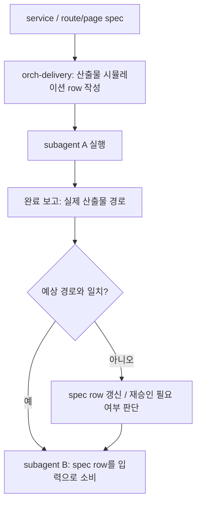
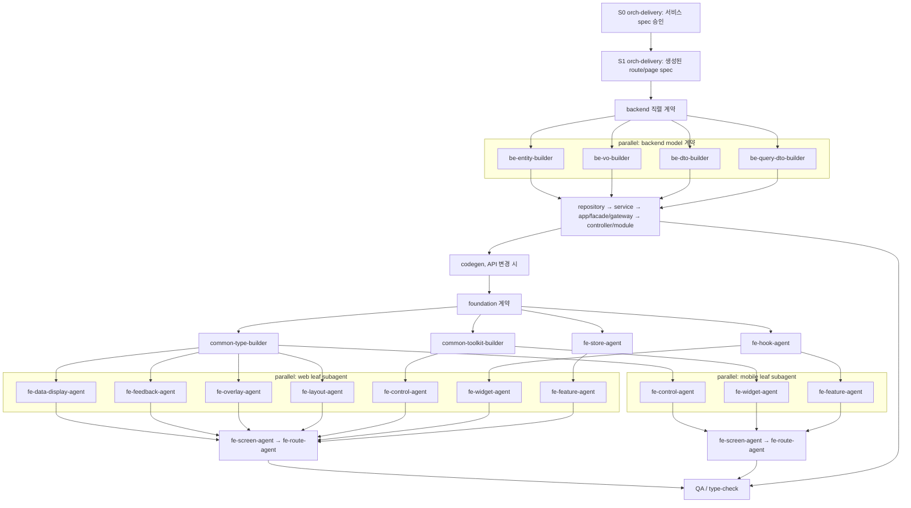
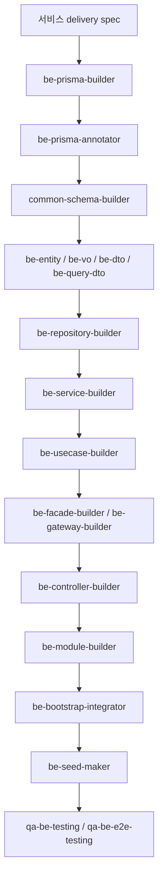
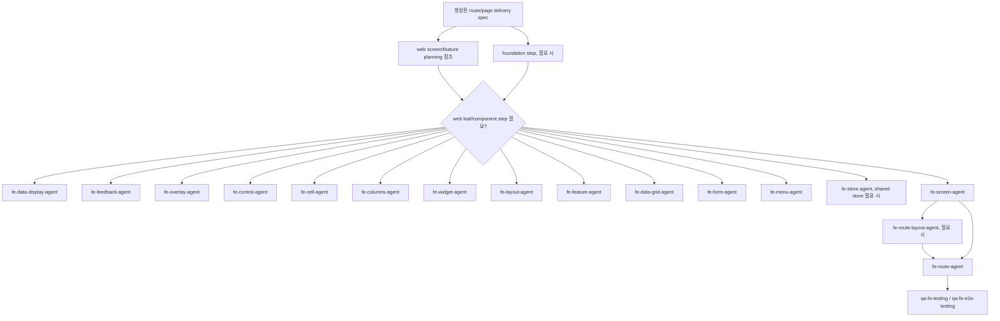
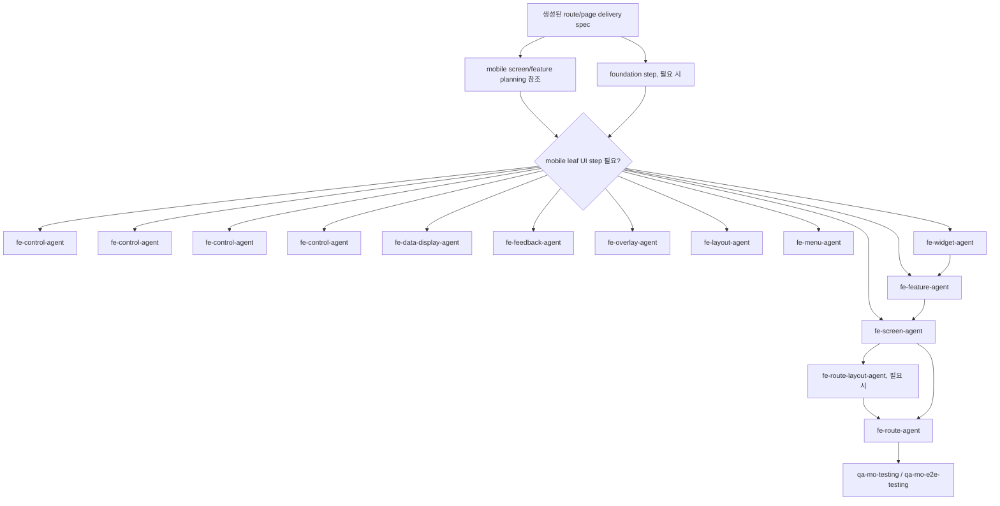

# 서비스 Delivery Spec Subagent 관계 흐름

이 문서는 Codex subagent 간 관계를 서비스 delivery spec 중심으로 설명합니다.
별도 도메인/Web/Mobile 기획 분기나 Delivery Plan 문서를 두지 않고, 서비스 delivery spec이 서비스 전체 설계와 실행 그래프를 소유합니다.
route/page delivery spec은 승인된 service delivery spec에서 생성된 page/route 실행 slice입니다.
Screen/Feature spec은 planning spec으로 남겨 시각/조합 계약을 설명하지만 실행 순서와 승인 gate는 소유하지 않습니다.

## 핵심 모델

## Spec 필수 항목

서비스 delivery spec은 다음 항목을 소유합니다.

- 서비스 목표와 성공 기준
- 사용자/역할/권한
- 도메인 모델과 생명주기
- 사용자 여정
- 필요한 모든 web/mobile page/route 목록
- Backend/API/Foundation 계약
- `DESIGN.md` 기반 서비스 디자인 방향
- 생성된 route/page spec 목록
- subagent 배정 매트릭스
- 산출물 시뮬레이션 / 인계 계약
- backend부터 frontend/mobile/QA까지의 실행 그래프
- 공유 파일 잠금
- QA/승인 기준
- 차단/재실행 규칙
- 승인/실행 로그

생성된 route/page delivery spec은 다음 항목을 소유합니다.

- 상위 service spec
- route/page 목표와 사용자 시나리오
- 기획 spec 참조
- component가 표시된 주석 화면 러프
- 재사용/신규/계층/담당 `agent_type`이 보이는 component 인벤토리
- route-local Hook/Toolkit/Type/Store slice
- Storybook/Test 인벤토리와 필수 상태/검증 케이스
- 해당 route가 소비하는 Backend/API slice
- route-level subagent 배정 매트릭스
- route-level 산출물 시뮬레이션 / 인계 계약
- route-level 공유 파일 잠금

## Storybook / Test 소유권

| 책임 | 담당 |
|------|------|
| story/test 계약 작성 | `orch-delivery`가 spec의 `Storybook / 테스트 계약`에 작성 |
| story/test 파일 작성 | component source를 소유한 subagent |
| 누락/실패/회귀 검증 | `qa-fe-testing`, `qa-mo-testing`, E2E subagent |

UI subagent가 신규/수정 UI component를 만들면 같은 step에서 story와 unit test를 함께 작성하거나 갱신합니다.
QA subagent는 subagent 산출물을 재검증하고, 누락된 story/test는 최종 보고에 사람이 확인할 수 있는 이슈로 남깁니다.

PC/Web과 Mobile 모두 같은 방식입니다.

- PC/Web: `packages/fe-ui/src/**` component 소스 담당 subagent가 story/test를 작성합니다.
- Mobile: `packages/fe-mo-ui/src/**` component 소스 담당 subagent가 story/test를 작성합니다.
- route container, route layout, Store, backend-only step은 Storybook 대상이 아니며 unit/E2E 검증만 spec에 남깁니다.

## Delivery Subagent

| subagent | 책임 |
|------|------|
| `orch-delivery` | 기획 질문 → 서비스 Spec → 승인 → Route/Page Spec → Screen/Feature Spec → 구현 → QA를 단일 흐름으로 소유 |

`orch-delivery`는 승인된 service delivery spec과 연결된 route/page delivery spec에 없는 subagent를 호출하지 않고, 허용 파일 범위 밖 파일을 수정하지 않습니다.

## 산출물 시뮬레이션 / 인계 계약

`orch-delivery`는 실행 전에 각 subagent step이 만들 산출물과 경로를 spec에 먼저 시뮬레이션합니다.
직렬 다음 subagent는 이전 subagent의 대화 요약이 아니라 spec의 산출물 row와 실제 완료 보고의 경로를 입력으로 사용합니다.

| 계약 항목 | 설명 |
|-----------|------|
| 입력 spec/파일 | 현재 step이 반드시 읽어야 하는 service/route/page/planning spec과 source/generated 파일 |
| 예상 산출물 | spec, source, generated output, story, test, config, route wiring 등 다음 step이 소비할 단위 |
| 생성/수정 예정 경로 | 다음 subagent가 열 수 있는 구체 파일/폴더 경로와 파일명 패턴 |
| 소비 step | 산출물을 읽어야 하는 다음 `step id`와 `agent_type` |
| 인계 조건 | operationId, export name, generated hook name, component name, test path 같은 handoff key |
| 검증 기준 | 산출물 존재와 계약 일치를 확인할 명령, grep, typecheck, test, codegen 기준 |

경로가 비어 있거나 소비 step이 없는 신규/수정 step은 승인과 실행을 통과할 수 없습니다.
cleanup/delete처럼 소비자가 없는 step은 `소비 step`에 `none-cleanup`과 사유를 남깁니다.

## 시각 실행 그래프

spec의 `실행 그래프`는 직렬 순서와 병렬 가능 구간을 같이 보여야 합니다.

그래프와 함께 `병렬 그룹 표`를 두어 병렬 step, 병렬 가능 사유, 공유 파일 잠금, 합류 step을 명시합니다.

## 백엔드 Phase

백엔드 phase는 service delivery spec의 `백엔드 / API / 기반 계약` 아래 구조별 인벤토리를 기준으로 실행합니다.

| 인벤토리 | 주 담당 subagent | 소비 예시 |
|----------|--------------|----------|
| `Prisma / Database 인벤토리` | `be-prisma-builder` | `be-repository-builder`, `common-schema-builder`, QA |
| `Prisma Annotation 인벤토리` | `be-prisma-annotator` | Swagger/관리 UI 표시 계약 |
| `Common Schema 인벤토리` | `common-schema-builder` | `be-dto-builder`, `fe-route-agent` |
| `Entity / VO 인벤토리` | `be-entity-builder`, `be-vo-builder` | `be-service-builder`, `be-usecase-builder` |
| `DTO / Query DTO 인벤토리` | `be-dto-builder`, `be-query-dto-builder` | `be-controller-builder`, codegen |
| `Repository 인벤토리` | `be-repository-builder` | `be-service-builder` |
| `Service 인벤토리` | `be-service-builder` | `be-usecase-builder`, `be-facade-builder`, `be-controller-builder` |
| `UseCase 인벤토리` | `be-usecase-builder` | `be-controller-builder` |
| `Facade / Gateway 인벤토리` | `be-facade-builder`, `be-gateway-builder` | `be-controller-builder`, `be-service-builder` |
| `엔드포인트 인벤토리` | `be-controller-builder` | `fe-route-agent`, `qa-*-testing` |
| `Module / Bootstrap 인벤토리` | `be-module-builder`, `be-bootstrap-integrator` | 앱 부트스트랩 |
| `Seed 인벤토리` | `be-seed-maker` | QA, local dev |
| `Codegen / API Client 인벤토리` | command step | `fe-route-agent` |

각 row는 `재사용/신규`, `소스/대상`, 소스 담당 `agent_type`, 소비 `agent_type`을 포함해야 하며, 누락된 backend element는 builder가 추측해 만들지 않습니다.

## 기반 Phase

기반 phase는 service delivery spec의 `백엔드 / API / 기반 계약`과 생성된 route/page delivery spec의 route-local slice를 기준으로 실행합니다.

| 인벤토리 | 주 담당 subagent | 소비 예시 |
|----------|--------------|----------|
| `Hook 인벤토리` | `fe-hook-agent` | `fe-route-agent`, UI subagent |
| `Toolkit 인벤토리` | `common-toolkit-builder` | backend/web/mobile/common packages |
| `Type 인벤토리` | `common-type-builder` | backend/web/mobile/store/hook/toolkit |
| `Store / State 인벤토리` | `fe-store-agent` 또는 route subagent | Feature, route container, screen props |

route-local hook/util/type/state는 공용 subagent를 호출하지 않고 Web/Mobile 모두 `fe-route-agent`가 처리합니다.
shared foundation row가 `new` 또는 `modify`이면 `subagent 배정 매트릭스`와 `실행 그래프`에 반드시 같은 step을 둡니다.

## Web Phase

## Mobile Phase

## 실행 결과 검증

- 실행 결과는 각 subagent의 최종 보고, 변경 diff, 테스트 결과를 사람이 검증합니다.
- 실행 결과는 spec의 `산출물 시뮬레이션 / 인계 계약` row와 실제 생성/수정 경로가 맞는지 확인합니다.
- `spawn_agent`, `wait_agent`, `send_input`은 자동 라우팅 보장 기능이 아니라 부모 Codex가 필요할 때 사용하는 운영 도구입니다.
- 부모 Codex는 다음 subagent에 승인된 spec 경로, 산출물 row id, 실제 완료 경로를 전달합니다. 채팅 요약은 보조 맥락일 뿐 산출물 위치의 기준이 아닙니다.
- spec 갱신, phase 재실행, agent 재배정, 차단 처리는 사람이 검증한 뒤 결정합니다.

## 운영 규칙

- service delivery spec 없이 subagent를 실행하지 않습니다.
- service delivery spec 작성과 사용자 승인 없이 route/page spec 생성 또는 subagent 실행을 하지 않습니다.
- 생성된 route/page delivery spec 없이 route/page leaf subagent를 실행하지 않습니다.
- 산출물 시뮬레이션 / 인계 계약 없이 직렬 다음 subagent를 실행하지 않습니다.
- 병렬 실행은 spec에서 `parallel: true`이고 파일 ownership이 겹치지 않는 leaf/component step에만 허용합니다.
- 테스트 전략 전용 intermediate subagent 없이 QA subagent가 spec 기준으로 테스트를 구현합니다.
- service delivery spec이 상위 실행 기준이며, 별도 Delivery Plan 문서는 만들지 않습니다.
- Screen/Feature planning spec에는 `subagent 배정 매트릭스`, `실행 그래프`, backend build order, foundation 세부 실행표를 쓰지 않습니다.

## 시나리오 점검

| 시나리오 | spec 판단 기준 |
|----------|-------------------------|
| 신규 도메인 + web 화면 | backend phase를 Prisma부터 controller/module까지 포함하고, API 변경이면 codegen 후 web leaf/page/route/QA step을 배치합니다. |
| 기존 API 변경 + web 화면 | 변경 endpoint와 Orval hook 영향을 필수 요소에 기록하고, backend/codegen/web route wiring/QA step만 포함합니다. |
| mobile route 추가 | mobile screen/leaf/route/native wiring/QA step을 우선 배치하고, API contract gap이 있으면 backend/codegen step을 선행시킵니다. |
| web/mobile 동시 화면 추가 | backend와 codegen은 한 번만 실행하고, web phase와 mobile phase는 파일 ownership이 분리된 step만 병렬 허용한 뒤 QA에서 합류합니다. |
| shared hook/toolkit/type/store 변경 | service delivery spec의 백엔드/API/기반 계약에 row와 step을 추가하고, 필요한 생성 route/page spec에는 slice로 연결합니다. |
