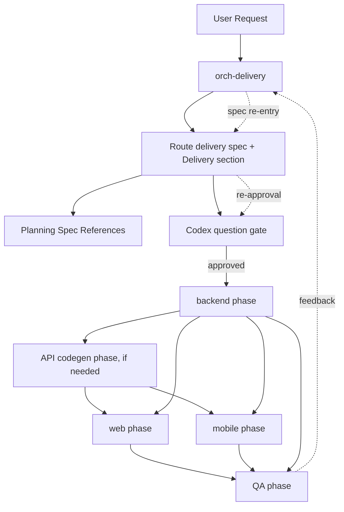
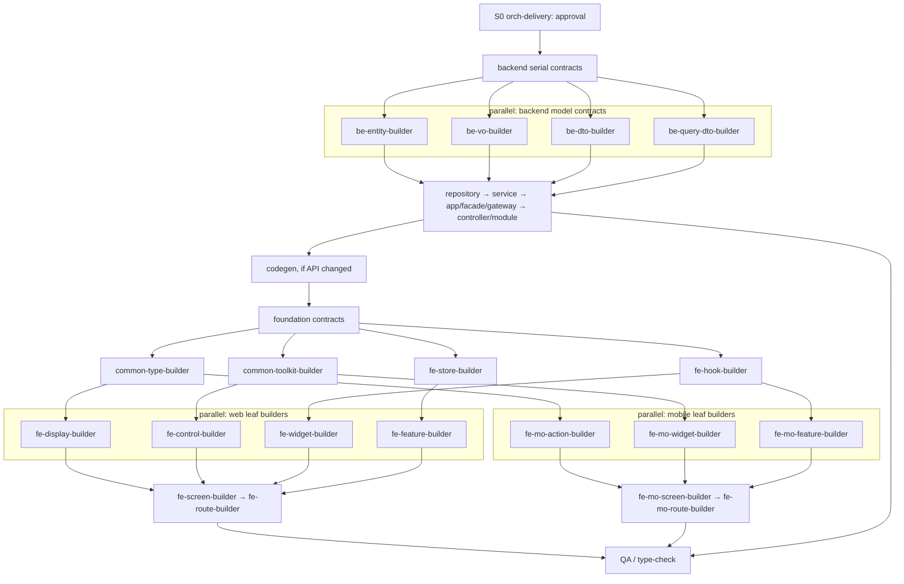
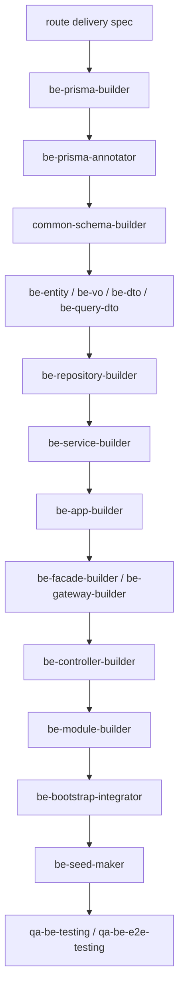
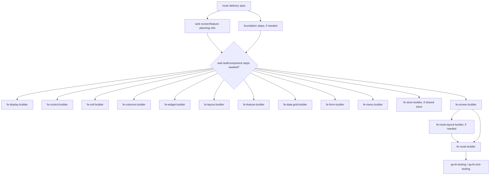
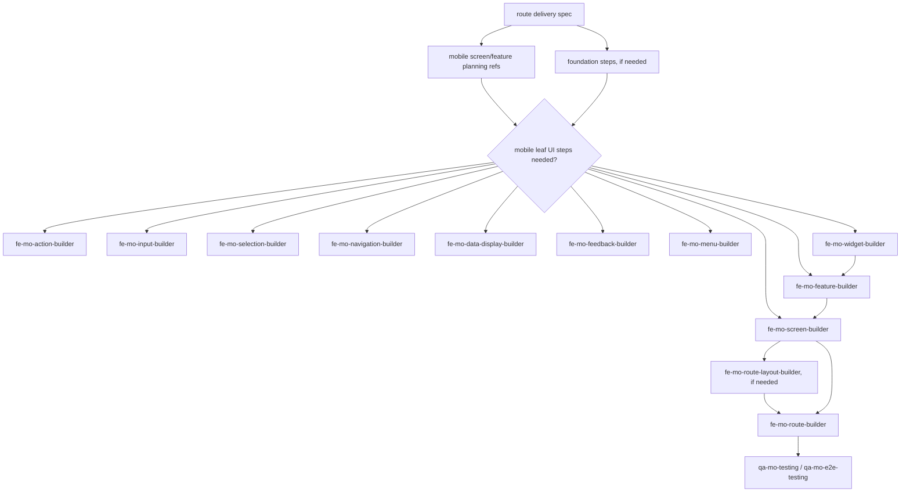

# Route Delivery Spec Agent Relationship Flow

이 문서는 Codex role 간 관계를 route delivery spec 중심으로 설명합니다.
별도 Domain/Web/Mobile 기획 분기나 Delivery Plan 문서를 두지 않고, route delivery spec이 실행 그래프를 소유합니다.
Screen/Feature spec은 planning spec으로 남겨 시각/조합 계약을 설명하지만 실행 순서와 승인 gate는 소유하지 않습니다.

## Core Model

## Spec 필수 항목

- 목표와 사용자 시나리오
- web/mobile screen map
- planning spec references
- component가 표시된 annotated 화면 러프
- 재사용/신규/계층/담당 `agent_type`이 보이는 component inventory
- Hook/Toolkit/Type/Store가 분리된 foundation inventory
- Storybook/Test 인벤토리와 필수 상태/검증 케이스
- Prisma/Common Schema/DTO/Repository/Service/Application/Facade/Gateway/Controller/Module/Seed/Codegen이 분리된 Backend/API inventory
- 각 backend inventory의 재사용/수정/신규 여부, 소스 담당 `agent_type`, 소비 `agent_type`
- 필요한 backend/API/foundation/state/UI/test 요소
- `Agent Assignment Matrix`
- backend부터 frontend/mobile/QA까지의 실행 그래프
- shared file lock
- QA/acceptance 기준
- blocked/re-entry 규칙
- approval/execution log

## Storybook / Test Ownership

| 책임 | 담당 |
|------|------|
| story/test 계약 작성 | `orch-delivery`가 spec의 `Storybook / Test Contract`에 작성 |
| story/test 파일 작성 | component source를 소유한 builder role |
| 누락/실패/회귀 검증 | `qa-fe-testing`, `qa-mo-testing`, E2E role |

UI builder가 신규/수정 UI component를 만들면 같은 step에서 story와 unit test를 함께 작성하거나 갱신합니다.
QA role은 builder 산출물을 재검증하고, 누락된 story/test는 `test-failure` 또는 `spec-drift`로 보고합니다.

PC/Web과 Mobile 모두 같은 방식입니다.

- PC/Web: `packages/fe-ui/src/**` component source owner builder가 story/test를 작성합니다.
- Mobile: `packages/fe-mo-ui/src/**` component source owner builder가 story/test를 작성합니다.
- route container, route layout, Store, backend-only step은 Storybook 대상이 아니며 unit/E2E 검증만 spec에 남깁니다.

## Delivery Role

| role | 책임 |
|------|------|
| `orch-delivery` | Spec → Ask → Build → QA를 단일 흐름으로 소유 |

`orch-delivery`는 승인된 route delivery spec에 없는 agent를 호출하지 않고, 허용 파일 범위 밖 파일을 수정하지 않습니다.

## Visual Execution Graph

spec의 `Execution Graph`는 직렬 순서와 병렬 가능 구간을 같이 보여야 합니다.

그래프와 함께 `Parallel Group Table`을 두어 병렬 step, 병렬 가능 사유, shared file lock, 합류 step을 명시합니다.

## Backend Phase

Backend phase는 spec의 `Backend / API Contract` 아래 구조별 inventory를 기준으로 실행합니다.

| 인벤토리 | 주 담당 role | 소비 예시 |
|----------|--------------|----------|
| `Prisma / Database 인벤토리` | `be-prisma-builder` | `be-repository-builder`, `common-schema-builder`, QA |
| `Prisma Annotation 인벤토리` | `be-prisma-annotator` | Swagger/관리 UI 표시 계약 |
| `Common Schema 인벤토리` | `common-schema-builder` | `be-dto-builder`, `fe-route-builder`, `fe-mo-route-builder` |
| `Entity / VO 인벤토리` | `be-entity-builder`, `be-vo-builder` | `be-service-builder`, `be-app-builder` |
| `DTO / Query DTO 인벤토리` | `be-dto-builder`, `be-query-dto-builder` | `be-controller-builder`, codegen |
| `Repository 인벤토리` | `be-repository-builder` | `be-service-builder` |
| `Service 인벤토리` | `be-service-builder` | `be-app-builder`, `be-facade-builder`, `be-controller-builder` |
| `ApplicationService 인벤토리` | `be-app-builder` | `be-controller-builder` |
| `Facade / Gateway 인벤토리` | `be-facade-builder`, `be-gateway-builder` | `be-controller-builder`, `be-service-builder` |
| `엔드포인트 인벤토리` | `be-controller-builder` | `fe-route-builder`, `fe-mo-route-builder`, `qa-*-testing` |
| `Module / Bootstrap 인벤토리` | `be-module-builder`, `be-bootstrap-integrator` | 앱 부트스트랩 |
| `Seed 인벤토리` | `be-seed-maker` | QA, local dev |
| `Codegen / API Client 인벤토리` | command step | `fe-route-builder`, `fe-mo-route-builder` |

각 row는 `재사용/신규`, `소스/대상`, 소스 담당 `agent_type`, 소비 `agent_type`을 포함해야 하며, 누락된 backend element는 builder가 추측해 만들지 않습니다.

## Foundation Phase

Foundation phase는 route delivery spec의 `Foundation Contract` 아래 구조별 inventory를 기준으로 실행합니다.

| 인벤토리 | 주 담당 role | 소비 예시 |
|----------|--------------|----------|
| `Hook 인벤토리` | `fe-hook-builder` | `fe-route-builder`, `fe-mo-route-builder`, UI builder |
| `Toolkit 인벤토리` | `common-toolkit-builder` | backend/web/mobile/common packages |
| `Type 인벤토리` | `common-type-builder` | backend/web/mobile/store/hook/toolkit |
| `Store / State 인벤토리` | `fe-store-builder` 또는 route builder | Feature, route container, screen props |

route-local hook/util/type/state는 공용 builder를 호출하지 않고 `fe-route-builder` 또는 `fe-mo-route-builder`가 처리합니다.
shared foundation row가 `new` 또는 `modify`이면 `Agent Assignment Matrix`와 `Execution Graph`에 반드시 같은 step을 둡니다.

## Web Phase

## Mobile Phase

## Feedback Routing

| feedback type | 처리 |
|---------------|------|
| `spec-gap` | `orch-delivery`가 spec을 보강하고 승인 gate 재진입 |
| `contract-gap` | spec의 affected step 보강 |
| `api-integration-gap` | API contract 문제면 spec 보강, wiring 문제면 route/page builder follow-up |
| `ui-composition-gap` | spec의 Required Elements와 Agent Assignment Matrix 보강 후 담당 builder follow-up |
| `implementation-blocker` | 같은 agent가 해결 가능하면 follow-up, role 경계 밖이면 spec re-entry |
| `test-failure` | 제품 contract 문제와 테스트 기대값 문제를 분리해 spec re-entry 또는 QA follow-up |
| `spec-drift` | spec을 먼저 갱신한 뒤 구현/테스트 follow-up |
| `shared-file-conflict` | 병렬 쓰기를 중단하고 single writer 지정 |
| `dependency-missing` | 현재 phase 전제조건이면 blocked, downstream 전제면 spec의 downstream step에 required input 기록 |

## Operating Rule

- route delivery spec 없이 builder를 실행하지 않습니다.
- route delivery spec 작성과 사용자 승인 없이 builder를 실행하지 않습니다.
- 병렬 실행은 spec에서 `parallel: true`이고 파일 ownership이 겹치지 않는 leaf/component step에만 허용합니다.
- 테스트 전략 전용 intermediate role 없이 QA role이 spec 기준으로 테스트를 구현합니다.
- route delivery spec은 실행 source of truth이며, `.codex/plans/**/*.delivery-plan.md` 같은 별도 기획서는 만들지 않습니다.
- Screen/Feature planning spec에는 `Agent Assignment Matrix`, `Execution Graph`, backend build order, foundation 세부 실행표를 쓰지 않습니다.

## Scenario Checks

| scenario | spec 판단 기준 |
|----------|-------------------------|
| 신규 도메인 + web 화면 | backend phase를 Prisma부터 controller/module까지 포함하고, API 변경이면 codegen 후 web leaf/page/route/QA step을 배치합니다. |
| 기존 API 변경 + web 화면 | 변경 endpoint와 Orval hook 영향을 Required Elements에 기록하고, backend/codegen/web route wiring/QA step만 포함합니다. |
| mobile route 추가 | mobile screen/leaf/route/native wiring/QA step을 우선 배치하고, API contract gap이 있으면 backend/codegen step을 선행시킵니다. |
| web/mobile 동시 화면 추가 | backend와 codegen은 한 번만 실행하고, web phase와 mobile phase는 파일 ownership이 분리된 step만 병렬 허용한 뒤 QA에서 합류합니다. |
| shared hook/toolkit/type/store 변경 | route delivery spec의 Foundation Contract에 row와 step을 추가하고 필요한 planning spec은 reference로만 연결합니다. |
