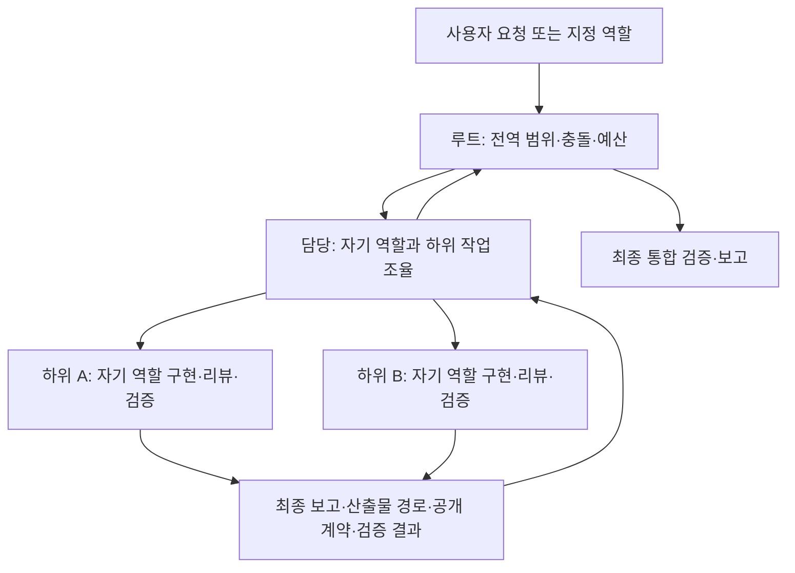
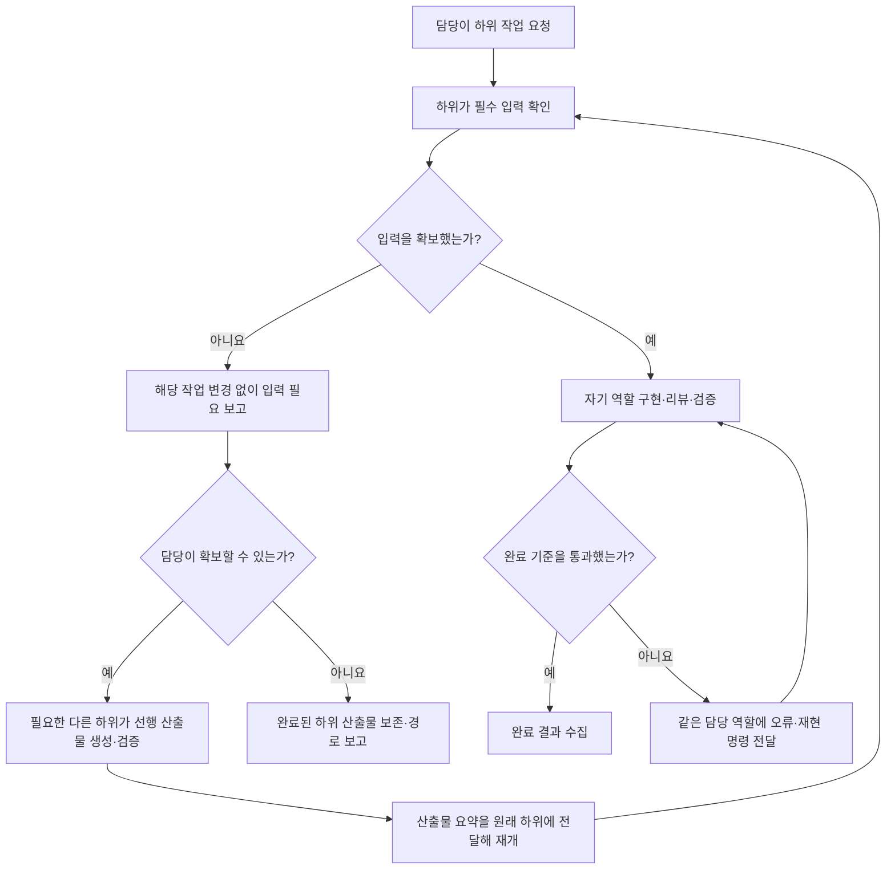

# Agent 실행 관계

## 목적과 근거

이 문서는 루트, 담당, 하위의 책임과 결과 전달을 설명합니다. 공통 정책과 정의 편집 완료 절차는 [AGENTS.md](../AGENTS.md)가 소유하고, 각 역할의 절차·기술 계약은 자가완결 Codex 원본이 소유합니다.

[공식 Codex subagents 문서](https://learn.chatgpt.com/docs/agent-configuration/subagents)는 subagent 호출, 후속 지시, 결과 대기·수집과 custom agent TOML 설정을 설명합니다. 아래의 담당/하위 구분, 깊이 제한, 부모 문맥에 의존하지 않는 요청, write/read-only 예산은 프로젝트 규칙입니다. 정적 문서 검사가 실제 런타임의 호출 깊이나 문맥 격리를 증명하지는 않습니다.

## 정의 구조

- Codex 원본은 `.codex/agents/*.toml`의 `name`, `description`, `model`, `model_reasoning_effort`, `developer_instructions`로 유지합니다. 기존 모델·추론 설정은 보존합니다.
- ZCode 정의는 Codex 원본에서 생성한 `.zcode/agents/*.md`입니다. YAML frontmatter에는 `name`, `description`만 두고 모델 설정은 추가하지 않습니다. Frontmatter 주석에는 원본 경로와 생성 명령이 표시됩니다.
- 원본과 생성본은 같은 35개 역할이며 파일명과 `name`으로 대응하고 각 역할의 이름과 모델·추론 설정을 유지합니다. 생성기는 name·description과 TOML의 `developer_instructions`를 Markdown 본문에 그대로 옮깁니다. `pnpm agents:contracts:check`는 생성본의 최신 상태와 역할 계약을 검사합니다.
- 정의문의 최상위 절은 역할·수정 범위, 입력 계약, 기술 규칙, 단독 실행 계약, 생성·리뷰·수정, 검증·보고 순서입니다. 필요한 역할 계약은 정의문 안에 넣으며 별도 외부 지침 파일을 읽게 하지 않습니다.
- ZCode의 실제 중첩 호출과 부모 문맥 격리 지원은 이 변경에서 검증하지 않았습니다. 파일 형식의 일치는 런타임 지원 확인과 별개입니다.

## 원본과 생성본의 연결

새 세션이나 ZCode 경로를 지정한 편집 요청은 생성본 frontmatter의 원본 경로에서 대응 Codex 파일을 찾습니다. 편집·충돌 처리와 같은 turn의 완료 기준은 [AGENTS.md의 Agent 정의 관리](../AGENTS.md#agent-정의-관리)를 따릅니다. [.zcode/agents/README](../.zcode/agents/README)는 파일 형식과 생성·검사 명령을 안내합니다.

정의 파일을 재생성해도 현재 실행 중인 agent 지시문의 실시간 갱신 여부는 보장하지 않습니다. 행동 계약은 대표 새 호출로 확인할 수 있으며, 정적 동기화가 아래에 기록한 Codex 도구 부재나 ZCode 런타임 미검증을 해소하지는 않습니다.

## Agent 정의 생성·개선 요청

새 세션에서도 서브에이전트 생성과 정의의 명령·지시·역할·절차 개선 요청은 `etc-agent-builder`를 진입점으로 선택합니다. 이 역할은 사용자 피드백을 공통 원칙으로 정리해 정의를 생성·검토·개선하며, 상세 행동 계약은 [Codex 원본](../.codex/agents/etc-agent-builder.toml)이 소유하고 [ZCode 생성본](../.zcode/agents/etc-agent-builder.md)에 동일하게 반영합니다. 제품 구현은 해당 제품 역할이 소유합니다.

호출 요청 예시는 다음과 같습니다.

- `etc-agent-builder로 이번 명명 피드백의 의도와 적용 조건을 공통 원칙으로 정리하고 fe-widget-agent 정의를 개선해 줘.`
- `etc-agent-builder로 배치 작업 리뷰를 담당할 서브에이전트를 만들어 줘. 기존 역할과 책임이 겹치는지 확인하고 원본과 생성본을 검증해 줘.`

호출 예시와 파일 연결은 대상 런타임의 새 역할 호출 가능성을 검증한 근거가 아닙니다. 원본 편집 후 동기화·계약 검사·필요한 테스트를 완료하는 절차는 [AGENTS.md](../AGENTS.md#agent-정의-관리)를 따릅니다.

## 책임과 호출 단계

| 주체 | 책임 |
|---|---|
| 루트 | 전역 범위, 담당 간 수정 충돌, 전체 트리 예산, 최종 통합 검증·보고 |
| 담당 | 자기 역할의 생성·리뷰·수정·검증, 필요한 하위 작업 분할·호출·수집·재작업 |
| 하위 | 지정한 수정 범위에서 자기 역할의 생성·리뷰·수정·검증, 최종 보고. 추가 agent 호출 금지 |
| Hook | Agent 경계 raw 이벤트의 로컬 기록 |
| 실제 산출물과 검증 결과 | 후속 작업이 소비하고 완료 판정에 사용하는 근거 |

호출 단계가 지정되지 않으면 담당 단계로 실행합니다. 사용자가 특정 역할을 직접 요청하면 그 역할이 진입점이며, 담당이 name과 description으로 필요한 하위를 선택합니다. 사용자에게 하위 목록을 요구하지 않습니다. 사용자가 명시한 read-only 또는 추가 호출 제한이 우선합니다.



호출 깊이는 루트 → 담당 → 하위까지입니다. 담당의 직접 구현은 자기 역할에 한정하고, 다른 역할의 파일 생성·수정은 그 하위에 맡깁니다. 같은 산출물의 생성·리뷰·규칙 위반 수정·기본 검증을 같은 역할이 소유합니다.

## 입력 확보와 재개

담당은 기존 산출물과 사용처를 확인해 재사용하고, 경로가 없으면 저장소에서 직접 찾습니다. 확보 가능한 다른 역할의 선행 산출물이 없다는 이유만으로 작업을 종료하지 않습니다.



제품 결정, 사용자 호출 제한이나 실제 접근 실패 때문에 입력을 확보할 수 없으면 `입력 필요`로 보고합니다. 입력 확인에서 멈춘 해당 작업은 변경이 없어야 합니다. 이미 완료된 하위 산출물은 보존하고 경로·공개 계약·검증 결과를 보고하여 부분 진행 상태를 알립니다.

## 요청 전달과 동시 실행

- 하위 요청에는 `호출 단계: 하위`, 목표, 수정 범위, 사용자 결정, 선행 산출물, 완료 기준과 동시 실행 예산을 넣습니다. AGENTS.md의 요청 템플릿을 사용합니다.
- 부모의 전체 대화나 지시문을 전달하거나 안다고 가정하지 않습니다. 선행 산출물 요약은 경로, 공개 export 또는 계약, 용도와 검증 결과로 구성합니다.
- 전체 작업 트리에서 동시 write는 최대 4개, read-only는 최대 8개이며 부모의 직접 작업도 포함합니다. 담당은 부모가 배정한 범위와 예산 안에서만 위임합니다.
- 같은 파일·공개 export의 수정과 선행 의존 작업은 직렬로 실행합니다. 같은 batch의 필수 결과가 모두 `완료`일 때만 후속 연결을 진행합니다.
- 하위 결과의 규칙 위반·검증 실패는 같은 산출물 담당 에이전트에 핵심 오류와 재현 명령을 전달하여 수정·재검증합니다.
- 루트는 모든 담당 작업이 끝난 뒤 통합 검증을 한 번 수행합니다. 충돌이나 불일치 근거가 있을 때만 추가 확인합니다.

## 최종 보고와 완료 판정

각 역할은 자기 정의문의 다음 5섹션으로 결과를 반환합니다.

```markdown
## 작업 결과
완료 | 입력 필요 | 검증 실패

## 작업 요약
5문장 이내의 결과 요약

## 변경 산출물
경로, 공개 export 또는 계약, 소비 용도. 이미 완료한 하위 산출물도 포함.

## 수행한 검증
실행한 명령과 성공·실패 결과

## 남은 문제
없음 또는 실제 차단 사항
```

`완료`는 실제 산출물, 정의문의 기본 검증과 요청의 추가 완료 기준을 모두 충족한 결과입니다. `입력 필요`는 확보할 수 없는 필수 입력 때문에 해당 작업 구현 전에 멈춘 결과입니다. 구현 후 완료 기준을 통과하지 못하면 변경 경로와 첫 핵심 오류·재현 명령을 포함해 `검증 실패`로 보고합니다.

런타임 `Completed`와 프로젝트 결과를 분리합니다. 부모는 최종 보고, 산출물 경로, 공개 계약과 검증 결과를 확인하고 필수 하위 결과가 모두 완료일 때만 연결합니다. 상세 탐색, 전체 diff·source code와 성공 로그는 역할 thread에 두고 요약만 반환합니다. 루트의 최종 보고는 owner별 결과·핵심 산출물·통합 검증·남은 위험을 담습니다.

## 정적 검사와 런타임 검증

`pnpm agents:sync`는 Codex 원본에서 ZCode 파일을 생성합니다. `pnpm agents:sync:check`는 파일 누락·추가·내용 불일치를 읽기 전용으로 검사하고, `pnpm agents:sync:test`는 생성기의 회귀 조건을 검사합니다.

`pnpm agents:contracts:check`는 생성본의 최신 상태를 검사한 뒤 35쌍의 metadata·본문 일치, 절 구조, 담당 기본값, 하위 단계 명시, 입력 재개, 부모 문맥 비의존, 생성·리뷰·수정, 수정 범위·예산과 보고 계약을 검사합니다. 기존 config와 logging-only Hook·logger 설정 검사도 유지합니다. `pnpm agents:contracts:test`는 독립 fixture로 이 검사와 의미 있는 실패 조건을 테스트합니다.

`lint:repo`와 `lint:repo:fix`는 계약 검사를 먼저 실행합니다. Root `pnpm test`도 `agents:contracts:check`로 현재 원본·생성본의 불일치를 먼저 검사하고, `agents:contracts:test` → `agents:sync:test` → `turbo test` 순서로 실행합니다. 따라서 lint와 test를 각각 호출해도 정의 불일치를 검출하며, 기존 Jenkins public CI의 `pnpm lint`·`pnpm test` 경로에서도 같은 검사를 수행합니다. lint·test·CI는 자동으로 생성본을 수정하지 않습니다. 현재 공개 CI가 이 명령을 호출한다는 확인이며, 실제 Jenkins 실행 검증 결과가 아닙니다.

`pnpm agents:flow:test`는 raw log Hook의 로컬 동작을 확인합니다. 이 명령이나 정적 검사 통과는 실제 agent tree의 nesting, 문맥 격리, 동시 실행 제한 준수 또는 역할 구현 품질을 검증한 결과가 아닙니다. 그런 결과를 주장하려면 대상 Codex/ZCode 런타임에서 단계 요청, 선행 입력 생성·재개, 하위 호출 제한, 결과 수집을 실제로 실행하고 근거를 남겨야 합니다.

### 2026-09-30 실제 호출 관찰

현재 Codex 세션에서 `fork_turns=none`으로 호출하고 임시 fixture에서 확인한 범위입니다. 정적 계약 검사 37쌍과 계약 테스트 45개는 통과했습니다.

| 확인 대상 | 관찰 결과 |
|---|---|
| 직접 진입 시 도구 노출 | `fe-route-agent`, `fe-widget-agent`에는 협업 namespace가 노출되지 않아 최초 요청을 `입력 필요`로 보고했고 목표 산출물은 생성하지 못했습니다. 정의문의 담당 지시와 실제 도구 노출이 일치하지 않았습니다. |
| 담당의 하위 호출·결과 수집 | `fe-screen-agent`가 Widget 하위를 호출하고 생성·검증 결과를 회수한 뒤 Screen을 생성·검증했습니다. 루트 → Screen 담당 → Widget 하위 tree를 확인했고 하위의 추가 위임은 없었습니다. |
| 입력 부족과 동일 에이전트 재개 | Screen 하위는 Widget 부재 시 변경 없이 `입력 필요`를 보고했고, 이후 산출물 요약으로 재개해 기존 산출물 리뷰와 행동 테스트 4개를 완료했습니다. Route와 Widget의 재개·완료는 루트가 선행 산출물을 전달한 수동 조율 결과이며 해당 담당의 자동 위임 성공으로 판정하지 않습니다. |
| 같은 owner의 검증·수정 | 임시 Widget에 disabled 결함을 주입하자 같은 owner의 read-only 검증이 `toBeDisabled`에서 실패했고, 같은 owner가 수정·재검증했습니다. 임시 Route에 금지된 `ScreenSurface` named import를 주입한 뒤 같은 owner가 제거하고 정규식·기본 검증을 완료했습니다. |
| 공유 파일 수정 직렬화 | Screen 담당이 기존 Widget 하위의 `packages/fe-ui/index.ts` 재작업 완료를 확인한 뒤 자신의 export를 수정·검증하여 공유 파일 동시 쓰기를 피했습니다. |
| 미확정 사용자 결정 | 이동 UX·콜백 확장 입력이 미확정이면 기존 Widget/type 산출물을 보존하고 해당 작업 변경 없이 `입력 필요`를 보고했습니다. |

관찰 fixture는 `/private/tmp/prj-core-agent-smoke-page-nnz7b3yb/repo`와 `/private/tmp/prj-core-agent-smoke-component-qiilqxq3/repo`입니다. 실제 primitive, strict TypeScript 검사, Vitest와 Biome을 사용했으며 Browser, 설치, build, 서비스 실행과 원본 제품 코드 변경은 수행하지 않았습니다.

루트가 두 fixture에서 실행한 `pnpm type-check`, `pnpm lint`, `pnpm test`, `pnpm check:source`는 모두 통과했습니다. page fixture는 4개 테스트 파일·7개 테스트, component fixture는 3개 테스트 파일·5개 테스트로, 실제 fixture 테스트 합계는 12개입니다. 원본 저장소 전체 검증 결과로 확대하지 않습니다.

이 관찰은 37개 역할 모두의 실제 단독 구현 성공을 증명하지 않습니다. 협업 도구 부재의 원인은 확정하지 않았고 모델·역할 설정은 유지합니다. write 4개/read-only 8개 상한은 정적 계약으로 확인했으며 런타임 강제 scheduler나 부하 테스트로 검증하지 않았습니다. ZCode 런타임이 없어 실제 동작은 미검증입니다.

## Raw log와 제외 기능

Project Hook은 `UserPromptSubmit`, Agent `PreToolUse`·`PostToolUse`, `SubagentStart`, `SubagentStop`, `Stop` payload를 로컬 JSONL에 기록합니다. Hook은 prompt를 수정하거나 작업을 차단하지 않습니다. 로그는 메인 context에 자동 주입하지 않고 실행 문제를 분석할 때만 읽습니다.

별도 실행 원장, prompt renderer, 자동 scheduler, 조율 전용 agent, 자동 task 복구와 이전 orchestration alias·wrapper는 만들지 않습니다.
