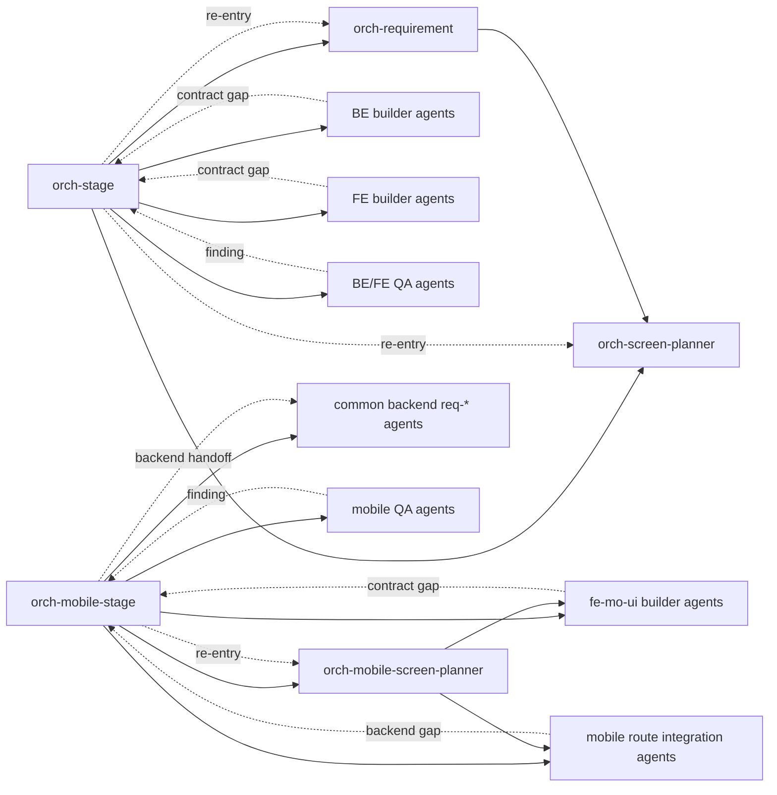
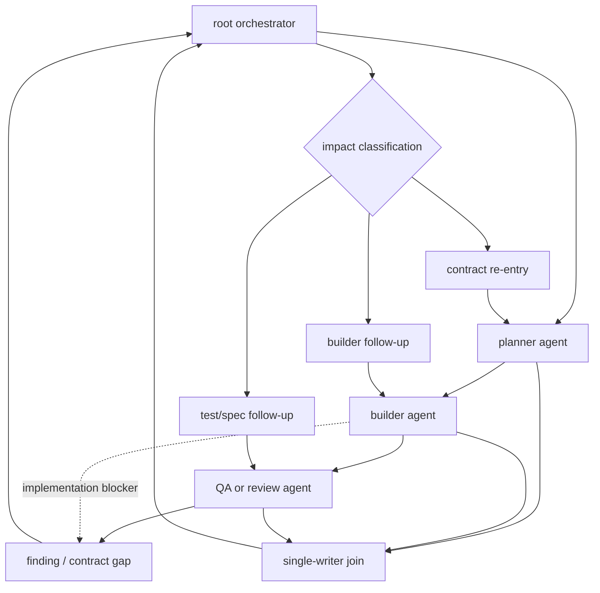
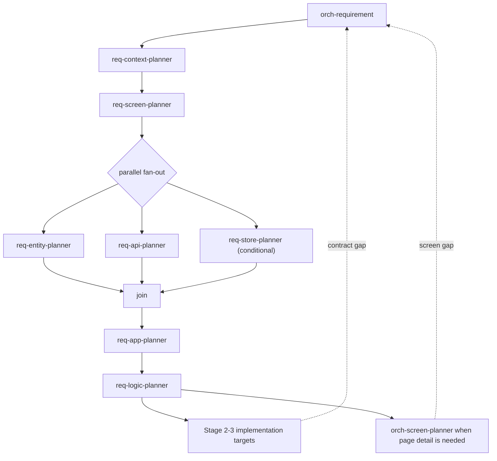
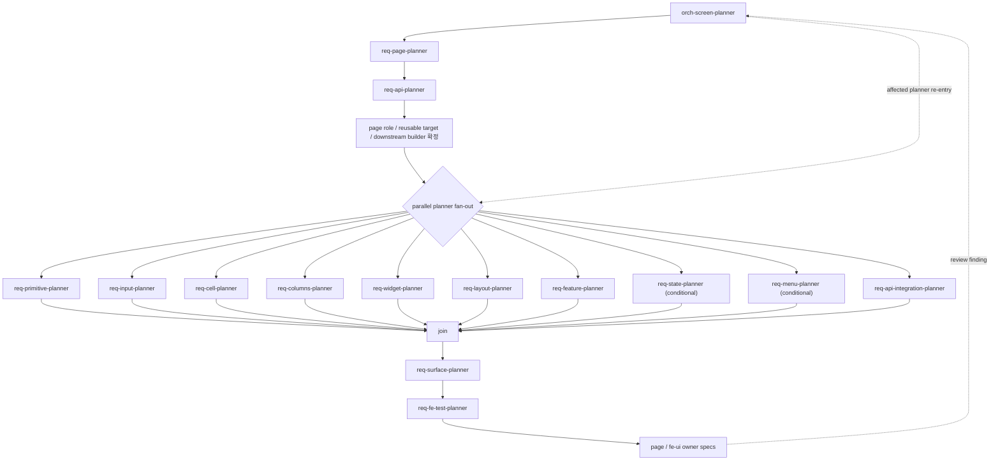
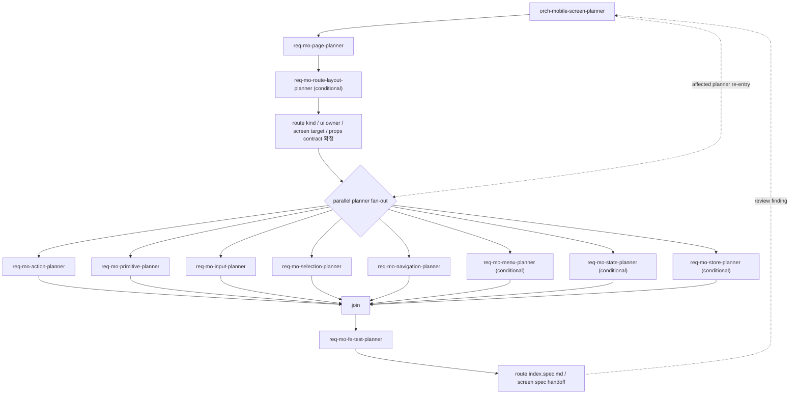

# Orchestration Agent Relationship Flow

## 목적

`orch-stage`와 `orch-mobile-stage`가 어떤 child role agent들을 호출하고, 각 agent 결과가 어디에서 합류하는지 보여주는 관계 지도입니다.
Stage 순서 자체가 아니라 orchestration tree, planner-to-builder mapping, test join chain을 파악하는 데 초점을 둡니다.
이 문서는 단방향 waterfall을 고정하지 않습니다. 현재 role 지시문은 root orchestrator가 실행 중인 agent의 결과를 받고, 필요하면 같은 agent에 추가 지시를 보내거나 관련 role의 agent를 다시 생성하는 방식으로 feedback loop를 구성하도록 업데이트되어 있습니다.

원본 source of truth는 아래 role 지시문입니다.

| root role | source |
|-----------|--------|
| `orch-stage` | `.codex/agents/orch-stage.toml` |
| `orch-mobile-stage` | `.codex/agents/mobile/orch-mobile-stage.toml` |
| `orch-requirement` | `.codex/agents/orch-requirement.toml` |
| `orch-screen-planner` | `.codex/agents/orch-screen-planner.toml` |
| `orch-mobile-screen-planner` | `.codex/agents/mobile/orch-mobile-screen-planner.toml` |

## 현재 반영 상태

2026-05-07 기준으로 아래 role 지시문에 feedback router / re-entry 계약이 실제 반영되어 있습니다.

| role | 반영된 계약 |
|------|-------------|
| `orch-stage` | child agent `Feedback` packet 수집, `feedback` / `reentry` 입력, feedback 분류, `send_input` follow-up, affected `agent_type` 재생성 |
| `orch-mobile-stage` | mobile route/backend/screen/test finding 수집, `feedback` / `reentry` 입력, mobile 전용 feedback 분류, 공통 backend handoff |
| `orch-requirement` | `feedback_mode=reentry` 입력, domain-level contract 최소 갱신, 화면 상세 변경은 `orch-screen-planner`로 handoff |
| `orch-screen-planner` | `feedback_mode=reentry` 입력, page-level affected owner spec만 최소 갱신, affected planner mapping 반환 |
| `orch-mobile-screen-planner` | `feedback_mode=reentry` 입력, route `index.spec.md` / screen owner spec 최소 갱신, backend gap handoff |

## 용어

| 용어 | 의미 |
|------|------|
| role | `.codex/config.toml`에 정의된 실행 역할 |
| agent | `spawn_agent`로 생성되는 실행 주체 |
| `agent_type` | agent 생성 시 지정하는 role 이름 |
| root orchestrator | `orch-stage`, `orch-mobile-stage`처럼 전체 흐름을 조율하는 role |
| child role | root orchestrator가 작업을 위임하는 planner, builder, QA role |
| fan-out | 독립 child role agent를 병렬로 실행하는 관계 |
| join | fan-out 결과를 합쳐 spec, 공유 파일, 테스트 상태를 정리하는 관계 |
| feedback router | QA, builder, reviewer의 발견사항을 root orchestrator가 받아 영향 role로 되돌려 보내는 관계 |
| re-entry | 실패한 gate 이후 전체를 처음부터 반복하지 않고 영향받은 planner/builder/test chain으로 재진입하는 관계 |
| single writer | 공유 파일 충돌을 막기 위해 join 시점에 한 agent만 최종 파일을 쓰는 규칙 |
| feedback packet | child agent가 최종 응답에 포함해야 하는 finding 구조 |
| `feedback_mode=reentry` | planner orchestrator를 전체 재기획이 아니라 affected contract 최소 갱신 모드로 호출하는 입력 |

## 전체 관계 개요



관계의 큰 방향은 다음과 같습니다.

| root | 1차 위임 | downstream |
|------|---------|------------|
| `orch-stage` | `orch-requirement` | domain planning에서 Entity/API/App/Logic contract를 만든 뒤 BE builder family가 소비 |
| `orch-stage` | `orch-screen-planner` | page planning에서 UI/Feature/Page/API/Test contract를 만든 뒤 FE builder family가 소비 |
| `orch-mobile-stage` | `orch-mobile-screen-planner` | route planning에서 screen props/native wiring/test contract를 만든 뒤 mobile builder family가 소비 |
| `orch-mobile-stage` | 공통 backend `req-*` role | 모바일 기능에 필요한 backend contract handoff 작성, backend 구현은 별도 BE flow로 처리 |

## Feedback Loop 운용 원칙

agent의 feedback은 peer-to-peer mesh가 아니라 root orchestrator-mediated loop로 운용합니다.
즉, child agent가 다른 child agent를 직접 수정 대상으로 삼지 않고, 발견사항을 root orchestrator에 반환합니다.
root orchestrator는 영향 범위를 분류한 뒤 같은 agent에 follow-up을 주거나 관련 `agent_type`으로 새 agent를 생성합니다.
이 규칙은 `orch-stage`와 `orch-mobile-stage`의 `Feedback Router / Re-entry 규칙`에 실제 실행 지침으로 들어가 있습니다.



| feedback source | root orchestrator 판단 | 재진입 대상 |
|-----------------|------------------------|-------------|
| builder가 API/DTO/route contract gap 발견 | 기획 누락인지 구현 누락인지 분류 | `req-api-planner`, `req-page-planner`, `req-mo-page-planner`, 이후 관련 builder |
| page 또는 route integration 중 props/state mismatch 발견 | UI owner spec과 route wiring 중 어느 쪽이 틀렸는지 분류 | `orch-screen-planner`, `orch-mobile-screen-planner`, 관련 page/screen/state builder |
| mobile integration 중 backend endpoint gap 발견 | 모바일 전용 handoff인지 공통 backend 구현 대상인지 분류 | `orch-mobile-stage → common backend req-*`, 필요 시 `orch-stage` backend flow |
| QA가 테스트 실패 또는 회귀 발견 | 테스트 기대값 문제인지 제품 contract 문제인지 분류 | affected builder, `req-*-test-planner`, `qa-*` 재검증 |
| shared file 충돌 가능성 발견 | fan-out 중 직접 쓰기 중단, join owner 지정 | root orchestrator의 single-writer join |

### Root Orchestrator 입력

root orchestrator는 Stage 실행 입력에 feedback 운용 파라미터를 받습니다.

| 입력 | 값 | 기본값 | 의미 |
|------|----|--------|------|
| `feedback` | `auto` / `off` | `auto` | 현재 Stage 내부에서 child agent finding follow-up을 허용할지 결정 |
| `reentry` | `review` / `auto` | `review` | 이전 Stage source of truth 변경이 필요한 finding을 자동 재진입할지, review pending으로 멈출지 결정 |

`feedback=auto`에서는 Stage 완료 전 finding 해결 follow-up이 현재 Stage 실행의 일부입니다.
완료/실패 메시지를 출력한 뒤에는 추가 agent 호출을 시작하지 않습니다.

### Web Feedback Packet

`orch-stage`가 child agent를 생성하거나 follow-up을 보낼 때 요구하는 packet입니다.

```text
Feedback:
- status: resolved | blocked | needs-contract | needs-implementation | needs-test | needs-reentry
- feedback_type: none | contract-gap | implementation-blocker | test-failure | spec-drift | shared-file-conflict | dependency-missing
- affected_stage: 1 | 2 | 3 | 4 | 5 | 6 | 7 | none
- affected_roles: <role list or none>
- affected_files: <file list or none>
- required_action: <short action or none>
```

| `feedback_type` | `orch-stage` 처리 |
|-----------------|-------------------|
| `none` | join 후보로 수집 |
| `contract-gap` | contract owner role을 찾아 planner re-entry 또는 현재 Stage 실패로 분류 |
| `implementation-blocker` | 같은 agent가 해결 가능하면 `send_input`, role 경계 밖이면 해당 builder `agent_type` 생성 |
| `test-failure` | 제품 contract 문제와 테스트 기대값 문제를 분리한 뒤 affected builder 또는 `req-*-test-planner`로 재진입 |
| `spec-drift` | owner spec을 먼저 갱신한 뒤 구현/테스트 follow-up |
| `shared-file-conflict` | fan-out 쓰기를 중단하고 join 단계 single writer 지정 |
| `dependency-missing` | 현재 Stage 전제조건이면 Stage 실패, 현재 Stage 내부 누락이면 해당 role follow-up |

### Mobile Feedback Packet

`orch-mobile-stage`가 child agent를 생성하거나 follow-up을 보낼 때 요구하는 packet입니다.

```text
Feedback:
- status: resolved | blocked | needs-route-contract | needs-backend-contract | needs-ui | needs-test | needs-reentry
- feedback_type: none | route-contract-gap | backend-contract-gap | screen-contract-gap | implementation-blocker | test-failure | spec-drift | shared-file-conflict | dependency-missing
- affected_stage: 1 | 2 | 3 | 4 | none
- affected_roles: <role list or none>
- affected_files: <file list or none>
- required_action: <short action or none>
```

| `feedback_type` | `orch-mobile-stage` 처리 |
|-----------------|--------------------------|
| `none` | join 후보로 수집 |
| `route-contract-gap` | `orch-mobile-screen-planner` 또는 관련 `req-mo-*` role로 re-entry |
| `backend-contract-gap` | 공통 backend `req-*` handoff로 되돌리고, 필요하면 web `orch-stage` backend flow 재시작 범위 보고 |
| `screen-contract-gap` | `orch-mobile-screen-planner`를 통해 shared screen props/spec만 최소 갱신 |
| `implementation-blocker` | 같은 agent가 해결 가능하면 `send_input`, role 경계 밖이면 해당 mobile builder `agent_type` 생성 |
| `test-failure` | 제품 contract 문제와 테스트 기대값 문제를 분리한 뒤 affected builder 또는 `req-mo-fe-test-planner`로 재진입 |
| `spec-drift` | route `index.spec.md` 또는 screen owner spec을 먼저 갱신한 뒤 구현/테스트 follow-up |
| `shared-file-conflict` | fan-out 쓰기를 중단하고 join 단계 single writer 지정 |
| `dependency-missing` | 현재 Stage 전제조건이면 Stage 실패, 현재 Stage 내부 누락이면 해당 role follow-up |

### Planner Re-entry 입력

planner orchestrator는 상위 root orchestrator가 finding 해결을 위해 다시 호출할 때 아래 입력을 받습니다.

| 입력 | 대상 role | 의미 |
|------|-----------|------|
| `feedback_mode=reentry` | `orch-requirement`, `orch-screen-planner`, `orch-mobile-screen-planner` | 전체 재기획 대신 affected contract만 최소 갱신 |
| `feedback_type` | 동일 | finding 유형 |
| `affected_files` | 동일 | 재검토해야 하는 파일 목록 |
| `affected_roles` | 동일 | 재검토해야 하는 role 목록 |

re-entry mode에서 planner orchestrator는 unrelated spec을 갱신하지 않고, owner를 찾아 필요한 planner만 실행합니다.
화면 상세 변경, backend handoff, test contract 변경은 각각 owner role로 escalation하거나 `Feedback Resolution` 형식으로 반환합니다.

### Waterfall 완화 규칙

- Stage gate는 완료 선언 지점이 아니라 feedback 수집 지점으로 봅니다.
- 큰 도메인 전체를 한 번에 밀지 않고 route/page 단위 thin vertical slice로 닫습니다.
- QA 실패는 전체 stage 재시작이 아니라 affected planner/builder/test chain으로 re-entry합니다.
- contract가 바뀌면 owner spec, Orval 생성물, page/screen props, 테스트 기대값을 같은 loop에서 동기화합니다.
- 공유 파일은 fan-out agent가 동시에 수정하지 않고 join에서 single writer가 정리합니다.

## `orch-stage` Agent 관계

`orch-stage`는 직접 세부 파일을 계속 구현하는 agent가 아니라, domain planning, backend 구현, frontend planning, page integration, QA agent를 조율합니다.

```mermaid
flowchart TD
  OS["orch-stage"]

  OS --> OR["orch-requirement"]
  OR --> RC["req-context-planner"]
  RC --> RS["req-screen-planner"]
  RS --> RE{"domain fan-out"}
  RE --> REP["req-entity-planner"]
  RE --> RAP["req-api-planner"]
  RE --> RSP["req-store-planner (conditional)"]
  REP --> RJ["requirement join"]
  RAP --> RJ
  RSP --> RJ
  RJ --> RAPP["req-app-planner"]
  RAPP --> RLOG["req-logic-planner"]
  RLOG --> OSP["orch-screen-planner (when page detail is needed)"]

  OS --> BESchema{"BE schema builder family"}
  BESchema --> BP["be-prisma-builder"]
  BESchema --> CS["common-schema-builder"]
  BESchema --> BE["be-entity-builder"]
  BESchema --> BD["be-dto-builder"]
  BESchema --> BQ["be-query-dto-builder"]
  BESchema --> BSeed["be-seed-maker"]
  BESchema --> BUT["be-unit-test-builder"]
  BUT --> RBT["req-be-test-planner"]
  RBT --> QBT["qa-be-testing"]

  OS --> BEImpl{"BE implementation builder family"}
  BEImpl --> BR["be-repository-builder"]
  BEImpl --> BS["be-service-builder"]
  BEImpl --> BA["be-app-builder"]
  BEImpl --> BF["be-facade-builder (conditional)"]
  BEImpl --> BI["be-integration-builder (conditional)"]
  BEImpl --> BC["be-controller-builder"]
  BEImpl --> BM["be-module-builder"]
  BEImpl --> BUT2["be-unit-test-builder"]
  BUT2 --> RBT2["req-be-test-planner"]
  RBT2 --> QBT2["qa-be-testing"]

  OS --> OSP
  OSP --> OSPJoin["screen planning join"]

  OS --> FEComp{"FE component builder family"}
  FEComp --> FD["fe-display-component-builder"]
  FEComp --> FCtrl["fe-control-component-builder"]
  FEComp --> FCell["fe-cell-builder"]
  FEComp --> FCol["fe-columns-builder"]
  FEComp --> FW["fe-widget-builder"]
  FEComp --> FL["fe-layout-builder"]
  FEComp --> FF["fe-feature-builder"]
  FEComp --> FDG["fe-data-grid-builder"]
  FEComp --> FDetail["fe-detail-builder"]
  FEComp --> FForm["fe-form-builder"]
  FEComp --> FState["fe-state-builder"]
  FEComp --> FStore["fe-store-builder"]
  FEComp --> FMenu["fe-menu-builder (conditional)"]
  FEComp --> FUT["fe-unit-test-builder"]
  FUT --> RFT["req-fe-test-planner"]
  RFT --> QFT["qa-fe-testing"]

  OS --> FEPage{"FE page integration family"}
  FEPage --> FRL["fe-route-layout-builder"]
  FEPage --> FUIP["fe-ui-page-builder"]
  FEPage --> FP["fe-page-builder"]
  FEPage --> FAPI["fe-api-integrator"]
  FEPage --> FState2["fe-state-builder (conditional)"]
  FEPage --> FUT2["fe-unit-test-builder"]
  FUT2 --> RFT2["req-fe-test-planner"]
  RFT2 --> QFT2["qa-fe-testing"]
  QFT2 --> RST["req-spec-tracker"]
  QFT2 -. finding .-> OS
  RST -. spec drift .-> OS

  OS --> E2E{"E2E QA family"}
  E2E --> BEE["be-e2e-builder"]
  BEE --> RBT3["req-be-test-planner"]
  RBT3 --> QBEE["qa-be-e2e-testing"]
  QBEE --> FEE["fe-e2e-builder"]
  FEE --> RFT3["req-fe-test-planner"]
  RFT3 --> QFEE["qa-fe-e2e-testing"]
  QFEE --> RST2["req-spec-tracker"]
  QFEE -. regression .-> OS
  QBEE -. regression .-> OS

  OS -. contract re-entry .-> OR
  OS -. screen re-entry .-> OSP
  OS -. implementation follow-up .-> FEComp
  OS -. implementation follow-up .-> FEPage
  OS -. implementation follow-up .-> BEImpl
```



### `orch-requirement` 내부 관계

`orch-requirement`는 domain-wide 기획의 첫 번째 fan-out owner입니다.



| relationship | 의미 |
|--------------|------|
| `req-context-planner → req-screen-planner` | 사용자/목표/도메인 맥락 이후 L3-L4 화면 구조 초안 작성 |
| `req-entity-planner ∥ req-api-planner` | Entity/API contract는 병렬 fan-out 가능 |
| `req-store-planner` | 공용 Store가 필요할 때만 조건부 fan-out |
| `req-app-planner → req-logic-planner` | fan-out 결과를 합쳐 ApplicationService/Service/Repository/test contract 정리 |
| `orch-screen-planner` | page-level L5-L12 상세 기획이 필요할 때 위임 |

### `orch-screen-planner` 내부 관계

`orch-screen-planner`는 web 단일 화면의 planner-to-builder mapping을 고정합니다.



| planner role | downstream builder role |
|--------------|-------------------------|
| `req-primitive-planner` | `fe-display-component-builder` |
| `req-input-planner` | `fe-control-component-builder` |
| `req-cell-planner` | `fe-cell-builder` |
| `req-columns-planner` | `fe-columns-builder` |
| `req-widget-planner` | `fe-widget-builder` |
| `req-layout-planner` | `fe-layout-builder` |
| `req-feature-planner` | `fe-feature-builder` |
| `req-state-planner` | `fe-state-builder`, `fe-store-builder` |
| `req-menu-planner` | `fe-menu-builder` |
| `req-api-integration-planner` | `fe-api-integrator` |
| `req-page-planner` | `fe-data-grid-builder`, `fe-detail-builder`, `fe-form-builder`, `fe-ui-page-builder`, `fe-page-builder` |
| `req-fe-test-planner` | `fe-unit-test-builder`, `qa-fe-testing`, `fe-e2e-builder`, `qa-fe-e2e-testing` |

## `orch-mobile-stage` Agent 관계

`orch-mobile-stage`는 mobile route planning, `fe-mo-ui` screen 구현, Expo Router route integration, mobile 검증 agent를 조율합니다.

```mermaid
flowchart TD
  OMS["orch-mobile-stage"]

  OMS --> MSP["orch-mobile-screen-planner"]
  OMS --> MBR{"common backend contract agents"}
  MBR --> MRE["req-entity-planner"]
  MBR --> MRA["req-api-planner"]
  MBR --> MRAPP["req-app-planner"]
  MBR --> MRLOG["req-logic-planner"]
  MBR --> MH["backend handoff only"]

  OMS --> MUI{"fe-mo-ui builder family"}
  MUI --> MDD["fe-mo-data-display-component-builder"]
  MUI --> MFB["fe-mo-feedback-component-builder"]
  MUI --> MAC["fe-mo-action-component-builder"]
  MUI --> MIC["fe-mo-input-component-builder"]
  MUI --> MSC["fe-mo-selection-component-builder"]
  MUI --> MNC["fe-mo-navigation-component-builder"]
  MUI --> MMM["fe-mo-menu-builder"]
  MUI --> MSB["fe-mo-screen-builder"]
  MUI --> MUT["fe-mo-unit-test-builder"]
  MUT --> MRFT["req-mo-fe-test-planner"]
  MRFT --> QMT["qa-mo-testing"]

  OMS --> MRT{"mobile route integration family"}
  MRT --> MRL["fe-mo-route-layout-builder"]
  MRT --> MPB["fe-mo-page-builder"]
  MRT --> MAI["fe-mo-api-integrator (conditional)"]
  MRT --> MST["fe-mo-state-builder (conditional)"]
  MRT --> MSTO["fe-mo-store-builder (conditional)"]
  MRT --> MUT2["fe-mo-unit-test-builder"]
  MUT2 --> MRFT2["req-mo-fe-test-planner"]
  MRFT2 --> QMT2["qa-mo-testing"]

  OMS --> ME2E{"mobile verification family"}
  ME2E --> MEE["fe-mo-e2e-builder"]
  MEE --> MRFT3["req-mo-fe-test-planner"]
  MRFT3 --> QME["qa-mo-e2e-testing"]
  QMT2 -. finding .-> OMS
  QME -. regression .-> OMS
  MPB -. backend gap .-> OMS
  MAI -. API gap .-> OMS
  OMS -. route re-entry .-> MSP
  OMS -. builder follow-up .-> MUI
  OMS -. route follow-up .-> MRT
  OMS -. backend contract re-entry .-> MBR
```



### `orch-mobile-screen-planner` 내부 관계

`orch-mobile-screen-planner`는 단일 Expo Router native route의 planning agent 관계를 고정합니다.



| mobile planner role | downstream builder role |
|---------------------|-------------------------|
| `req-mo-page-planner` | `fe-mo-screen-builder`, `fe-mo-page-builder`, `fe-mo-api-integrator` |
| `req-mo-route-layout-planner` | `fe-mo-route-layout-builder` |
| `req-mo-primitive-planner` | `fe-mo-data-display-component-builder`, `fe-mo-feedback-component-builder` |
| `req-mo-action-planner` | `fe-mo-action-component-builder` |
| `req-mo-input-planner` | `fe-mo-input-component-builder` |
| `req-mo-selection-planner` | `fe-mo-selection-component-builder` |
| `req-mo-navigation-planner` | `fe-mo-navigation-component-builder` |
| `req-mo-menu-planner` | `fe-mo-menu-builder` |
| `req-mo-state-planner` | `fe-mo-state-builder`, `fe-mo-store-builder` |
| `req-mo-store-planner` | `fe-mo-store-builder` |
| `req-mo-fe-test-planner` | `fe-mo-unit-test-builder`, `qa-mo-testing`, `fe-mo-e2e-builder`, `qa-mo-e2e-testing` |

## Test Join 관계

테스트 관련 agent는 builder 결과를 검증 가능한 계약으로 합류시키는 join chain입니다.

| context | relationship chain |
|---------|--------------------|
| backend unit | `be-unit-test-builder → req-be-test-planner → qa-be-testing` |
| backend E2E | `be-e2e-builder → req-be-test-planner → qa-be-e2e-testing` |
| frontend unit | `fe-unit-test-builder → req-fe-test-planner → qa-fe-testing` |
| frontend E2E | `fe-e2e-builder → req-fe-test-planner → qa-fe-e2e-testing → req-spec-tracker` |
| mobile unit | `fe-mo-unit-test-builder → req-mo-fe-test-planner → qa-mo-testing` |
| mobile E2E | `fe-mo-e2e-builder → req-mo-fe-test-planner → qa-mo-e2e-testing` |

## Feedback Join 관계

feedback join은 waterfall 흐름의 예외 처리가 아니라 기본 운용 경로입니다.
각 finding은 root orchestrator에서 아래 순서로 처리합니다.

1. source agent가 `Feedback` packet을 반환합니다.
2. root orchestrator가 contract, implementation, test, shared-file conflict, dependency 중 하나로 분류합니다.
3. 영향받은 owner spec 또는 shared file을 확인합니다.
4. 같은 실행 agent가 해결 가능하면 `send_input`으로 follow-up을 보냅니다.
5. 종료된 agent 또는 다른 role 책임이면 관련 `agent_type`의 agent를 생성합니다.
6. 수정 결과를 single-writer join으로 합칩니다.
7. QA agent가 같은 slice를 재검증합니다.

| loop | relationship chain |
|------|--------------------|
| web API contract gap | `fe-api-integrator / fe-page-builder → orch-stage → req-api-planner → fe-api-integrator → qa-fe-testing` |
| web page spec drift | `qa-fe-testing / qa-fe-e2e-testing → orch-stage → orch-screen-planner → affected planner → affected builder → qa-fe-testing` |
| backend contract gap | `be-controller-builder / qa-be-testing → orch-stage → req-api-planner → affected BE builder → qa-be-testing` |
| mobile route contract gap | `fe-mo-page-builder / qa-mo-testing → orch-mobile-stage → orch-mobile-screen-planner → affected mobile planner → affected builder → qa-mo-testing` |
| mobile backend gap | `fe-mo-api-integrator → orch-mobile-stage → common backend req-* handoff → orch-stage backend flow → fe-mo-api-integrator` |
| E2E regression | `qa-*-e2e-testing → root orchestrator → affected planner/builder/test planner → qa-*-e2e-testing → req-spec-tracker` |

## Shared File Join 관계

다음 파일은 여러 agent가 동시에 쓰기 쉬운 공유 지점입니다.
fan-out 중에는 수정 예약 또는 handoff만 남기고, join에서 단일 writer가 정리합니다.

| flow | shared file examples |
|------|----------------------|
| web app context | `apps/*/web/src/app/(admin)/app.context.md` |
| web route/page | `apps/*/web/src/app/**/page.spec.md`, `packages/fe-ui/src/page/**`, `packages/fe-ui/src/feature/**` |
| web package barrels | `packages/*/src/index.ts` |
| web menu/routing | `packages/common-constant/src/routing/admin-menu.ts` |
| mobile app context | `apps/mobile/src/app/app.context.md` |
| mobile route | `apps/mobile/src/app/**/index.spec.md` |
| mobile package barrels | `packages/fe-mo-ui/src/**/index.ts`, `packages/fe-mo-ui/src/index.ts` |
| mobile screen spec | `packages/fe-mo-ui/src/screen/[ScreenName]/[ScreenName].spec.md` |

## 읽는 법

- `orch-*` role은 관계를 조율하고 join을 관리합니다.
- `req-*` / `req-mo-*` role은 구현 전에 contract를 작성합니다.
- `be-*`, `fe-*`, `fe-mo-*` role은 contract를 실제 코드로 구현합니다.
- `qa-*` role은 테스트 코드 작성과 실행 관점의 최종 검증을 맡습니다.
- `req-*-test-planner`는 테스트 케이스를 owner spec에 동기화하는 중간 join 역할입니다.
