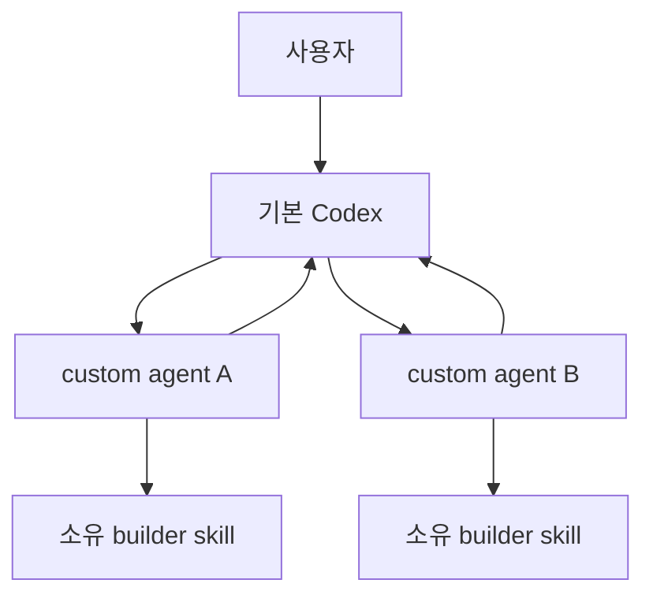
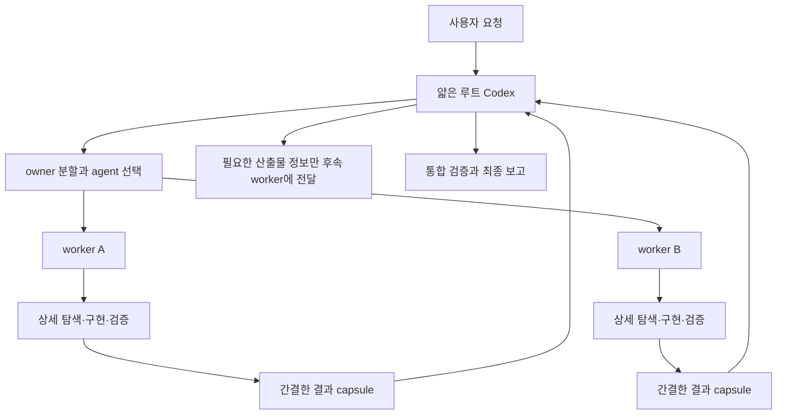

# Agent·Skill 실행 관계

## 목적

이 문서는 기본 Codex, custom agent와 builder skill의 실행 관계를 설명하고 공식 Codex 기능과 프로젝트 지침을 구분합니다.

## 공식 실행 모델



- Skill은 Codex가 읽고 따르는 지침입니다.
- Custom agent는 별도 agent thread에서 모델과 도구 작업을 수행합니다.
- 기본 Codex가 subagent를 호출하고 결과를 기다린 뒤 하나의 응답으로 통합합니다.
- Custom agent와 skill의 관계는 runtime binding이 아니라 `developer_instructions`입니다.
- Subagent 작업 메시지와 최종 결과는 일반 텍스트입니다.
- 상세 탐색과 명령 출력은 agent thread에 두고 메인 thread에는 요약을 반환합니다.

공식 문서:

- https://learn.chatgpt.com/docs/build-skills
- https://learn.chatgpt.com/docs/agent-configuration/subagents
- https://learn.chatgpt.com/docs/hooks

## 프로젝트 실행 구조



## 책임 경계

| 주체 | 책임 |
|---|---|
| 기본 Codex | 작업 분할, agent 선택, 의존성, 병렬 호출, 전체 결과 대기와 최종 판정 |
| Custom agent | 자기 skill 확인, 상세 저장소 탐색, owner 단위 구현과 기본 검증 |
| Builder skill | 역할별 입력 탐색, 구현 절차, 완료 기준과 검증 |
| Hook | Agent 경계 raw 이벤트의 로컬 기록 |
| 실제 코드와 테스트 | 후속 worker가 읽는 산출물의 source of truth |

루트는 worker 대신 상세 코드를 탐색하거나 선택된 `SKILL.md` 전체 내용을 prompt에 복사하지 않습니다. Worker는 다른 worker를 호출하거나 후속 순서를 선택하지 않습니다.

## 단일 실행

명시적으로 custom agent 하나를 요청하면 루트는 해당 worker만 호출합니다. Worker는 자기 skill을 읽고 저장소에서 입력을 찾습니다. 다른 owner의 필수 산출물이 없으면 변경 없이 `입력 필요`를 반환합니다.

## 다중 실행

- 같은 ownership의 탐색, 구현, wiring과 기본 검증은 하나의 worker 작업으로 묶습니다.
- 다른 owner의 선행 산출물이 있을 때만 별도 작업으로 나눕니다.
- 독립 write 작업은 기본 최대 4개, read-only 작업은 최대 8개까지 병렬 실행합니다.
- 같은 batch의 모든 결과를 기다린 뒤 다음 의존 작업을 시작합니다.
- 후속 worker에는 이전 결과 전체가 아니라 경로, export 또는 계약, 용도와 검증만 전달합니다.
- 모든 worker가 끝난 뒤 루트가 통합 검증을 한 번 수행합니다.

## Worker 최종 보고

```markdown
## 작업 결과
완료 | 입력 필요 | 검증 실패

## 작업 요약
5문장 이내의 결과 요약

## 변경 산출물
| 경로 | export 또는 계약 | 용도 |
|---|---|---|

## 수행한 검증
| 명령 | 결과 |
|---|---|

## 남은 문제
없음 또는 실제 차단 사항
```

전체 diff, source code, 탐색 과정과 성공한 명령의 전체 로그는 반환하지 않습니다. Runtime `Completed`와 프로젝트 작업 결과를 분리합니다.

## Raw log

Project Hook은 `UserPromptSubmit`, Agent `PreToolUse`·`PostToolUse`, `SubagentStart`, `SubagentStop`, `Stop` payload를 로컬 JSONL에 기록합니다.

Hook은 prompt를 수정하거나 작업을 차단하지 않습니다. 로그는 메인 context에 자동 주입하지 않고 실행 문제를 분석할 때만 읽습니다.

## 의도적으로 제공하지 않는 기능

- 별도 실행 상태 파일
- prompt 생성 script
- 자동 scheduler
- Worker 간 agent 호출
- 중단된 task의 자동 복구
- 이전 orchestration 형식의 alias와 wrapper
