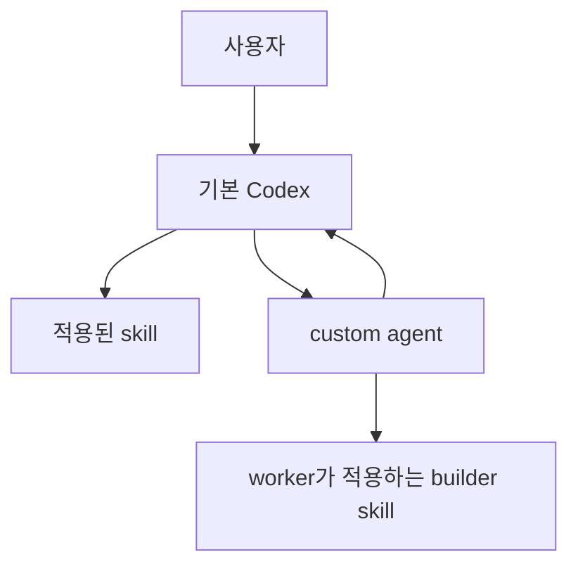
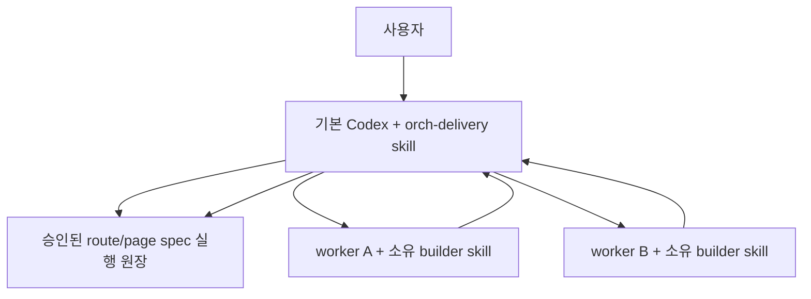

# Agent·Skill 실행 관계

## 목적

이 문서는 프로젝트의 skill, custom agent, 기본 Codex와 route/page spec이 어떤 관계로 동작하는지 설명한다. 공식 Codex 기능과 프로젝트 지침을 구분한다.

## 공식 실행 모델



- Skill은 지침, 참고 자료와 선택적 script의 묶음이다.
- 기본 Codex 또는 custom agent가 skill을 읽고 지침을 수행한다.
- Custom agent는 `.codex/agents/*.toml`의 `name`, `description`, `developer_instructions`로 구성한다.
- Subagent 작업 메시지와 최종 결과는 텍스트다.
- 메인 thread가 subagent 결과를 수집하고 최종 판단을 수행한다.
- Custom agent와 skill의 관계는 runtime binding이 아니라 developer instruction이다.

공식 문서:

- https://learn.chatgpt.com/docs/build-skills
- https://learn.chatgpt.com/docs/agent-configuration/subagents

공식 구현:

- https://github.com/openai/codex/blob/main/codex-rs/core/src/tools/handlers/multi_agents/spawn.rs
- https://github.com/openai/codex/blob/main/codex-rs/core/src/tools/handlers/multi_agents/wait.rs
- https://github.com/openai/codex/blob/main/codex-rs/core/src/agent/status.rs

## 프로젝트 실행 구조



- `orch-delivery` custom agent는 두지 않는다.
- 현재 기본 Codex가 `orch-delivery` skill을 적용하고 모든 worker를 직접 실행한다.
- Worker는 자신의 단위 구현과 기본 검증을 끝내고 기본 Codex에 보고한다.
- Worker는 다른 worker를 실행하거나 실행 순서를 결정하지 않는다.
- 병렬 작업은 선행 단계가 완료되고 수정 범위가 겹치지 않을 때만 수행한다.

## Skill 단독 실행

```text
사용자 요청
  -> builder skill 적용
  -> 프로젝트 파일에서 입력 탐색
  -> 필수 입력 사전 검사
  -> 소유 산출물 구현
  -> 기본 검증
  -> Markdown 결과 보고
```

경로가 명시되지 않았다는 이유만으로 멈추지 않는다. 프로젝트에서 먼저 찾고, 자신의 소유 범위에서 만들 수 있는 입력은 직접 만든다.

다른 owner의 필수 산출물이나 제품 결정이 없으면 구현 전에 `입력 필요`로 보고한다. 이 경우 변경 산출물은 없어야 한다.

## Worker 보고

```markdown
## 작업 결과
완료 | 입력 필요 | 검증 실패

## 작업 요약
수행한 단위 작업 요약

## 변경 산출물
생성, 수정, 삭제한 파일

## 수행한 검증
실행 명령, 결과, 확인 근거

## 남은 문제
누락 입력, 실패 원인, 필요한 결정
```

이 형식은 프로젝트의 텍스트 보고 규약이며 Codex가 강제하는 구조화 출력이 아니다. Codex 런타임의 `Completed`는 agent turn이 끝났다는 뜻이며 프로젝트 작업의 `완료` 여부는 최종 보고와 실제 검증 근거로 별도 판정한다.

## Route/Page 실행 원장

```markdown
| 단계 | owner | 목표 | 입력과 근거 | 수정 범위 | 산출물 | 선행 단계 | 완료 기준 | 작업 상태 | 검증 근거 |
|---|---|---|---|---|---|---|---|---|---|
```

- 원장은 실행 순서, 책임, 산출물과 검증 근거를 지속하는 프로젝트 문서다.
- 원장은 Codex 내부 scheduler나 자동 복구 기능이 아니다.
- 상태와 검증 근거는 실행 중 갱신한다.
- 제품 계약이나 단계 계약을 바꾸면 사용자 재승인을 받는다.
- 새로운 기본 Codex는 원장을 읽고 완료되지 않은 준비 단계부터 작업을 재개할 수 있다.

## 책임 경계

- `AGENTS.md`: 모든 agent와 skill에 적용되는 공통 불변 계약
- Builder skill: 한 종류의 산출물을 구현하고 검증하는 절차
- Custom agent TOML: 역할 선택과 session 지침
- `orch-delivery` skill: 승인된 여러 단위 작업을 기본 Codex가 조율하는 절차
- Route/page spec: 제품 결정과 프로젝트 실행 원장

수정 범위는 책임 계약이다. 실제 접근 제한이 필요하면 별도의 sandbox 설정을 사용한다.
