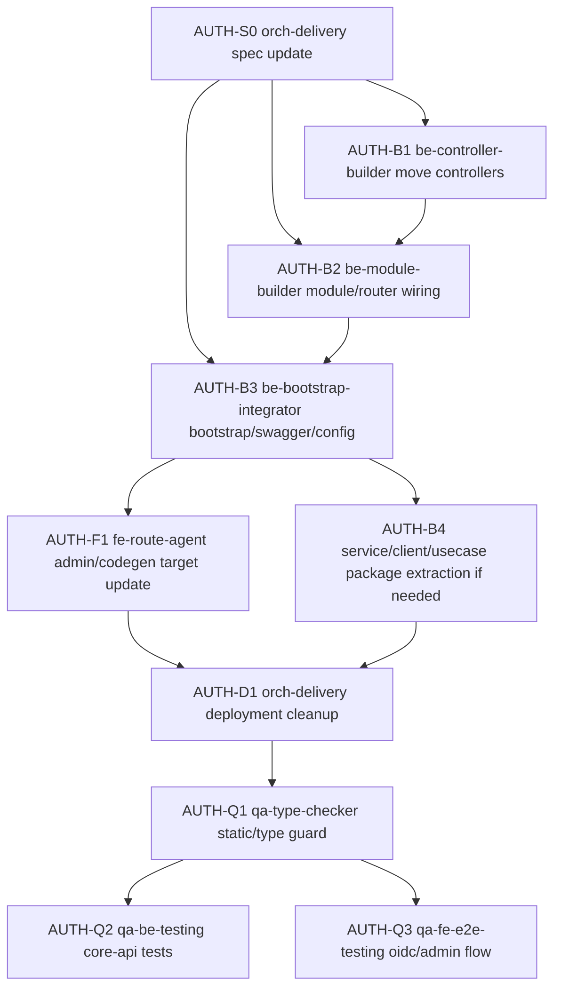

# 관리자 인증 서비스 딜리버리 Spec

> 생성일: 2026-06-01
> 갱신일: 2026-06-06
> 서비스: 관리자 인증
> 식별자: `admin-auth`
> 담당 role: `orch-delivery`
> 상태: 통합 인증 콘솔 + backend 물리 통합 실행 기준

## 서비스 목표

Admin web을 단일 인증 콘솔로 두고 native login을 기본 로그인으로 유지한다. 기존 IDP/OIDC protocol 기능은 삭제하지 않고 `core/api` 안으로 물리 통합하여 `/oidc/*`, `/api/interaction/*`, `/api/password-*`, `/api/reset-password/*`, `/api/v1/auth/*`, `/api/v1/idp/*`, `/api/v1/oidc-*` public endpoint를 계속 제공한다.

| 항목 | 내용 |
|------|------|
| 사용자 목표 | 관리자가 `/auth/login`에서 native login으로 로그인하고 admin console의 인증 설정과 protected resource를 한 origin에서 사용한다. |
| 운영 목표 | `apps/admin/web` + `apps/core/api`만 active web/backend target으로 두고, `apps/idp/web`과 `apps/idp/api` app target은 제거한다. |
| 대상 app/domain/platform | `apps/admin/web`, `apps/core/api`, `packages/be-command`, `packages/be-usecase`, `packages/be-aggregate`, `packages/be-repository`, `packages/be-service`, `packages/be-client`, `packages/fe-api` |
| 성공 기준 | native login, OIDC protocol, interaction, password reset, IDP admin settings API가 `core/api`에서 동작하고 Swagger/codegen IDP spec은 `/idp-api-json`으로 분리된다. |
| 범위 포함 | `idp/api` module의 `core/api` 물리 이동, AppModule/RouterModule/bootstrap/Swagger 통합, deployment/codegen/e2e/script target 정리, CQRS guard 검증 |
| 범위 제외 | OIDC protocol path 변경, generated `@cocrepo/api` idp namespace rename, backend 서버 논리 계층 우회, 하위호환 shim 유지 |
| 기존 구현 재사용 | `@cocrepo/command`, `@cocrepo/usecase`, `@cocrepo/aggregate`, `@cocrepo/repository`의 IDP/auth handler와 persistence 구현 |
| 신규 생성 판단 | 신규 controller business logic은 생성하지 않는다. app-local helper가 필요하면 service/client owner package로 이동하거나 module provider wiring으로만 연결한다. |

## 통합 결정

| row id | 결정 | 실행 기준 |
|--------|------|-----------|
| AUTH-MERGE-WEB | `apps/admin/web`이 단일 first-party web client다. | IDP 콘솔 화면은 `/admin/settings/auth/*`, 공개 auth flow는 `/admin/auth/*`에 둔다. |
| AUTH-MERGE-BE | `apps/idp/api`는 제거 대상이다. | IDP controller/module/runtime은 `apps/core/api/src/module/**`로 이동한다. |
| AUTH-MERGE-CQRS | CQRS 경계를 유지한다. | Controller -> `CommandBus`/`QueryBus` -> `@cocrepo/command` -> `@cocrepo/usecase` -> Aggregate/Service/Repository/Client. |
| AUTH-MERGE-SWAGGER | core spec과 idp spec을 분리한다. | core API Swagger는 `/api-json`, IDP/codegen Swagger는 `/idp-api-json`을 사용한다. |
| AUTH-MERGE-DEPLOY | 별도 idp app target을 제거한다. | root script, turbo, workspace, Dockerfile, Jenkinsfile, E2E server target에서 `idp-api`를 제거한다. |

## Public Endpoint Contract

| row id | path | owner module | 유지 이유 |
|--------|------|--------------|-----------|
| AUTH-ENDPOINT-OIDC | `/oidc/*` | `OidcModule` | 외부 OIDC client protocol compatibility |
| AUTH-ENDPOINT-INTERACTION | `/api/interaction/*` | `InteractionModule` | `oidc-provider` interaction login/consent flow |
| AUTH-ENDPOINT-PASSWORD | `/api/password-*`, `/api/reset-password/*` | `PasswordResetModule` | forgot/reset password public flow |
| AUTH-ENDPOINT-AUTH | `/api/v1/auth/*` | `AuthModule` | native login/refresh/logout/verify/current-space |
| AUTH-ENDPOINT-IDP | `/api/v1/idp/*` | `IdpAccountsModule`, `IdpDashboardModule`, `SecurityPolicyModule`, `EmailVerificationsModule` | admin auth settings console |
| AUTH-ENDPOINT-OIDC-ADMIN | `/api/v1/oidc-*` | `OidcClientsModule`, `OidcSessionsModule` | OIDC client/session admin console |

## 사용자 / 역할 / 권한

| row id | 사용자/역할 | 목적 | 허용 행동 | 제한/금지 | 관련 route/API |
|--------|-------------|------|-----------|-----------|----------------|
| AUTH-ACTOR-ADMIN | 관리자 | admin web 운영 콘솔 접속 | native login, current space 조회/선택, protected core API 호출, auth settings 관리 | 외부 origin `returnTo`, 만료 token 재사용 | `/auth/login`, `/admin/settings/auth/*`, `/api/v1/auth/*` |
| AUTH-ACTOR-OIDC-CLIENT | 외부 OIDC client | Authorization Code + PKCE flow | `/oidc/auth` redirect, interaction completion, callback return | protocol path 변경, inactive legacy client 사용 | `/oidc/*`, `/api/interaction/*`, `/admin/auth/interaction/[uid]` |
| AUTH-ACTOR-CORE | Core API | 단일 backend runtime | auth/idp/oidc controller bus entrypoint 제공, Swagger spec 분리 | controller 직접 repository/service 접근, app-local CQRS 파일 추가 | `apps/core/api/src/module/**` |

## Backend 역할 분배

| row id | 담당 `agent_type` | 책임 | 허용 파일/패키지 | 완료 조건 |
|--------|-------------------|------|------------------|-----------|
| AUTH-BE-CONTROLLER | `be-controller-builder` | `idp/api` controller를 `core/api` module로 이동하고 Bus 호출만 유지 | `apps/core/api/src/module/**/**/*.controller.ts` | constructor에 `CommandBus`/`QueryBus` 외 business dependency가 없다. |
| AUTH-BE-MODULE | `be-module-builder` | IDP/Auth/OIDC modules와 RouterModule path 등록 | `apps/core/api/src/module/**/**/*.module.ts`, `apps/core/api/src/module/app.module.ts` | public endpoint path가 유지되고 provider wiring이 끊기지 않는다. |
| AUTH-BE-USECASE | `be-usecase-builder` | workflow logic이 app-local에 남으면 `@cocrepo/usecase` handler로 이동 | `packages/be-usecase/src/**`, `packages/be-command/src/**` | handler는 Aggregate/Service/Client를 통해 동작하고 controller logic이 없다. |
| AUTH-BE-SERVICE | `be-service-builder` | OIDC runtime, password reset support, interaction helper 등 aggregate가 아닌 지원 서비스를 정리 | `packages/be-service/src/**`, approved module provider wiring | service는 protocol/helper 책임만 갖고 aggregate root 로직을 소유하지 않는다. |
| AUTH-BE-CLIENT | `be-client-builder` | `oidc-provider` SDK boundary가 필요하면 client wrapper로 분리 | `packages/be-client/src/**` | 외부 SDK 세부가 controller/usecase로 새지 않는다. |
| AUTH-BE-AGG-REPO | `be-aggregate-builder`, `be-repository-builder` | 기존 auth/idp aggregate/repository 재사용, 부족한 method만 추가 | `packages/be-aggregate/src/**`, `packages/be-repository/src/**` | persistence 직접 접근이 controller/module로 새지 않는다. |
| AUTH-BE-BOOTSTRAP | `be-bootstrap-integrator` | core bootstrap, Swagger, middleware, OIDC provider init 통합 | `apps/core/api/src/main.ts`, `apps/core/api/src/setNestApp.ts`, `apps/core/api/src/config/**` | `/api-json`과 `/idp-api-json`이 분리되고 OIDC headers-sent 예외가 처리된다. |

## Frontend / Codegen 역할 분배

| row id | 담당 `agent_type` | 책임 | 허용 파일/패키지 | 완료 조건 |
|--------|-------------------|------|------------------|-----------|
| AUTH-FE-ROUTE | `fe-route-agent` | admin auth/settings route와 auth public flow 유지 | `apps/admin/web/src/app/**`, route-local specs/tests | admin web build에서 auth/settings/public auth routes가 유지된다. |
| AUTH-FE-CODEGEN | `fe-route-agent` | `@cocrepo/api` idp namespace는 유지하고 spec source만 core `/idp-api-json`으로 변경 | `packages/fe-api/**` | codegen source가 `idp-api` app URL을 참조하지 않는다. |
| AUTH-FE-E2E | `qa-fe-e2e-testing` | OIDC/native login E2E target을 core backend로 변경 | `apps/test/e2e/**`, `packages/fe-e2e/**` | 별도 idp-api webServer 없이 core-api readiness로 테스트된다. |

## App / Deployment Cleanup

| row id | 제거/치환 대상 | 실행 기준 |
|--------|----------------|-----------|
| AUTH-CLEAN-APP | `apps/idp/api` | core 통합 후 workspace에서 제거한다. |
| AUTH-CLEAN-PACKAGE | root script, `pnpm-workspace.yaml`, `turbo.json`, `biome.json` | `idp-api` filter/target을 제거한다. |
| AUTH-CLEAN-DEVOPS | `devops/Dockerfile.idp-api`, `devops/Jenkinsfile.idp-api*`, GitOps app choices | separate image target을 제거한다. |
| AUTH-CLEAN-SCRIPT | `scripts/start.sh`, `scripts/rancher-build.sh`, `scripts/wt.js`, `scripts/check-local-infra.mjs` | `IDP_API_*`, `4008`, `apps/idp/api/.env` active target을 제거하거나 `CORE_API_*`로 치환한다. |
| AUTH-CLEAN-DOCS | docs/guides/spec references | active docs는 `core/api` 기준으로 갱신하고 historical migration docs는 legacy 문맥을 명시한다. |

## 실행 그래프

## 에이전트 배정 매트릭스

| step id | phase | 담당 `agent_type` | 입력 파일 | 출력 파일 | 수정 허용 파일 | 의존 step | parallel | 완료 조건 |
|---------|-------|-------------------|-----------|-----------|----------------|-----------|----------|-----------|
| AUTH-S0-SPEC | planning | `orch-delivery` | 사용자 승인 계획, 현재 repo | 통합 인증 콘솔 + backend 물리 통합 spec | `docs/services/admin-auth.delivery.spec.md` | none | false | backend 통합과 cleanup 대상이 spec에 명시됨 |
| AUTH-B1-CONTROLLERS | backend | `be-controller-builder` | `apps/idp/api/src/module/**` | core module controller 이동 | `apps/core/api/src/module/**` | `AUTH-S0-SPEC` | true | controller CQRS guard 통과 |
| AUTH-B2-MODULES | backend | `be-module-builder` | copied modules, core AppModule | module/provider/router registration | `apps/core/api/src/module/**` | `AUTH-B1-CONTROLLERS` | false | public path 유지 |
| AUTH-B3-BOOTSTRAP | backend | `be-bootstrap-integrator` | idp/core bootstrap/config/swagger | unified core bootstrap | `apps/core/api/src/main.ts`, `apps/core/api/src/setNestApp.ts`, `apps/core/api/src/config/**` | `AUTH-B2-MODULES` | false | `/api-json`, `/idp-api-json` 분리 |
| AUTH-B4-PACKAGES | backend | `be-usecase-builder`, `be-service-builder`, `be-client-builder`, `be-aggregate-builder`, `be-repository-builder` | app-local helper scan | package owner extraction or validated reuse | `packages/be-*`, approved provider wiring | `AUTH-B3-BOOTSTRAP` | true | CQRS/package boundary guard 통과 |
| AUTH-F1-FRONTEND | frontend | `fe-route-agent` | admin web, Orval config | single console/codegen source update | `apps/admin/web/**`, `packages/fe-api/**` | `AUTH-B3-BOOTSTRAP` | true | admin build and idp spec source point to core |
| AUTH-D1-CLEANUP | deployment | `orch-delivery` | workspace/devops/script refs | idp-api target removal | root config, scripts, devops, docs | `AUTH-B4-PACKAGES`, `AUTH-F1-FRONTEND` | false | no active `idp-api` target remains |
| AUTH-Q1-STATIC | qa | `qa-type-checker` | changed files | static guard result | none unless fixing guard failures | `AUTH-D1-CLEANUP` | false | forbidden active refs absent |
| AUTH-Q2-BE | qa | `qa-be-testing`, `qa-be-e2e-testing` | core-api modules | type/test/e2e result | backend tests if needed | `AUTH-Q1-STATIC` | false | core-api type/test pass or blocked reason |
| AUTH-Q3-FE | qa | `qa-fe-testing`, `qa-fe-e2e-testing` | admin/codegen/e2e | build/e2e result | frontend tests if needed | `AUTH-Q1-STATIC` | false | admin-web build pass or blocked reason |

## 정적 검증 / 금지 grep

| row id | 검증 항목 | 명령 | 통과 기준 |
|--------|-----------|------|-----------|
| AUTH-STATIC-CONTROLLER | controller CQRS guard | `rg "constructor\\(.*Service|Repository|Prisma" apps/core/api/src/module/**/**/*.controller.ts` | controller가 Service/Repository/Prisma를 직접 주입하지 않음 |
| AUTH-STATIC-FACADE | app/facade/gateway 우회 금지 | `rg "@cocrepo/(facade|app|gateway)" apps/core/api/src/module` | active core module에 우회 package import 없음 |
| AUTH-STATIC-IDP-APP | removed app refs | `rg "apps/idp/api|idp-api|IDP_API|localhost:4008|localhost:3007|apps/idp/web|idp-web"` | legacy allowlist 외 active app/deploy/codegen ref 없음 |
| AUTH-STATIC-SPEC | spec 기준 일치 | `rg -n "backend 물리 통합|/idp-api-json|be-bootstrap-integrator|apps/idp/api" docs/services/admin-auth.delivery.spec.md` | 통합 기준과 제거 대상이 문서에 남아 있음 |

## QA / 승인 기준

| row id | 영역 | 명령/검증 | 기준 |
|--------|------|-----------|------|
| AUTH-QA-CORE-TYPE | core-api type | `pnpm --filter=core-api type-check` | type 오류 없음 |
| AUTH-QA-CORE-TEST | core-api test | `pnpm --filter=core-api test --passWithNoTests` | moved IDP module tests 포함 통과 |
| AUTH-QA-ADMIN-BUILD | admin web build | `pnpm --filter=admin-web build` | auth/settings/public auth routes build 성공 |
| AUTH-QA-CODEGEN | IDP spec source | `pnpm --filter=@cocrepo/api codegen` 필요 시 | IDP namespace 유지, source는 core `/idp-api-json` |
| AUTH-QA-OIDC | protocol smoke | `/oidc/auth` -> `/admin/auth/interaction/[uid]` -> callback | core-api runtime에서 protocol path 유지 |

## 승인 / 실행 로그

| 일시 | 단계 | 결정/결과 | 작성자 | 비고 |
|------|------|-----------|--------|------|
| 2026-06-06 | backend physical merge approved | `idp/api` app 제거와 `core/api` 물리 통합으로 범위 확장 | 사용자 | 하위호환성 미고려, 전체 마이그레이션 |
| 2026-06-06 | spec rewrite | 통합 인증 콘솔 + backend 물리 통합 기준으로 service spec 갱신 | Codex | `orch-delivery` owner 산출물 |
| 2026-06-06 | web consolidation baseline | `admin/web` 단일 콘솔과 OIDC 기능 보존 기준 정리 | Codex | 이후 backend 통합 기준으로 확장 |
