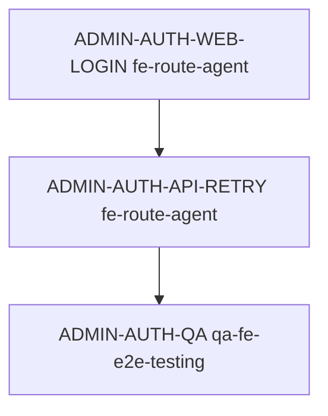

# 관리자 인증 서비스 딜리버리 Spec

> 생성일: 2026-06-01
> 서비스: 관리자 인증
> 식별자: `admin-auth`
> 담당 role: `orch-delivery`
> 상태: 기존 구현/route spec 기준 문서 보완

## 서비스 목표

Admin web 운영자가 로컬 개발과 운영 환경에서 안정적으로 로그인하고, native access/refresh/session 기반으로 core API를 사용할 수 있게 한다.

| 항목 | 내용 |
|------|------|
| 사용자 목표 | 관리자가 이메일/비밀번호로 로그인해 `/dashboard`와 admin route에 접근한다. |
| 운영 목표 | IDP native auth, PersistStore, axios refresh, core API 인증 헤더가 같은 세션 계약을 따른다. |
| 대상 app/domain/platform | `apps/admin/web`, `apps/idp/api`, `apps/core/api`, admin web auth |
| 성공 기준 | 로컬 개발 기본 계정이 폼에 채워지고, 로그인 후 `/api/v1/templates` 같은 core API가 200으로 응답한다. |
| 범위 제외 | OIDC protocol 제거, mobile auth flow 변경, 신규 인증 endpoint 설계 |

## 사용자 / 역할 / 권한

| 사용자/역할 | 목적 | 허용 행동 | 제한/금지 | 관련 route/API | 비고 |
|-------------|------|-----------|-----------|----------------|------|
| 관리자 | admin web 접속 | native login, current space 선택/조회, core API 호출 | 만료/오염 토큰 재사용 금지 | `/auth/login`, `POST /api/v1/auth/native/login`, `GET /api/v1/templates` | 로컬 dev 기본 계정 `admin@plate.com` |
| IDP API | token 발급/refresh | native access/refresh/session 발급 | secret mismatch 금지 | `/api/v1/auth/native/*` | core API와 `AUTH_JWT_SECRET` 일치 필요 |
| Core API | admin resource 보호 | bearer token + `x-space-id` 검증 | space header 누락 시 보호 resource 허용 금지 | `/api/v1/templates` | 인증 실패는 401, space 누락은 400 |

## 도메인 모델 / 생명주기

| 도메인 객체 | 책임 | 주요 필드/값 | 상태/lifecycle | 정책/검증 | 소유 패키지 | 비고 |
|-------------|------|--------------|----------------|-----------|-------------|------|
| Native session | admin web 세션 | accessToken, refreshToken, sessionId, expiresAt | login -> refresh -> logout/expire | retry 시 최신 token 헤더 재동기화 | `@cocrepo/store`, `@cocrepo/api` | stale Authorization 재사용 금지 |
| Space scope | core API scope | `x-space-id` | login 후 조회/선택 | 보호 API 호출에 필요 | `@cocrepo/store`, IDP/Core API | templates API 200 조건 |
| Local dev credentials | 개발 편의 | email/password | development only | production 빈 값 | admin login hook | 비밀값은 문서와 테스트 기본값으로만 사용 |

## 사용자 여정

| 여정 | 행위자 | 시작점 | 단계 | 완료 조건 | 실패/복구 | 관련 route/API |
|---------|-------|--------|------|-----------|-----------|----------------|
| 로컬 개발 로그인 | 관리자 | `/auth/login` | 기본 계정 확인 → 로그인 클릭 → session 저장 → dashboard 이동 | `/dashboard` 도달, localStorage session 존재 | login 401이면 오류 표시 | `POST /api/v1/auth/native/login` |
| 보호 API 접근 | 관리자 | `/templates` | access token, refresh token, `x-space-id` 헤더 포함 | templates 목록 200 | access 만료 시 refresh 후 최신 헤더로 재시도 | `GET /api/v1/templates` |
| token refresh | axios client | 401 응답 | refresh handler 실행 → store 갱신 → 원 요청 재시도 | 새 Authorization 사용 | refresh 실패 시 login redirect | `customAxios`, `customIdpAxios` |

## 필수 페이지 / 라우트

| 플랫폼 | route | 페이지/화면 | 목적 | 주요 상태 | 주요 행동 | route spec 경로 | 소스 담당 `agent_type` | 비고 |
|--------|-------|-------------|------|-----------|----------------|-----------------|---------------------------|------|
| web | `/auth/login` | 관리자 로그인 | native login form | 준비/로딩/오류 | 로그인 | `apps/admin/web/src/app/auth/login/page.spec.md` | `fe-route-agent` | 이 service spec에서 파생된 route slice |
| web | admin protected routes | dashboard/templates 등 | 인증 세션 소비 | 인증됨/refresh/오류 | resource 조회 | 기존 route spec | 각 route owner | auth header contract 소비 |

## 백엔드 / API / 기반 계약

| 영역 | 계약 | 재사용/수정 | 파일/대상 | 담당 `agent_type` | 검증 |
|------|------|-------------|-----------|-------------------|------|
| IDP auth | native login/refresh/logout 재사용 | 재사용 | `apps/idp/api/src/module/auth/auth.controller.ts` | `be-controller-builder` | IDP unit/E2E |
| Core JWT | IDP native token 검증 secret 일치 | env/local sync | `apps/core/api/.env`, config | `dev-service-starter` | templates direct/rewrite 200 |
| API client | 401 retry 전에 최신 session header 강제 동기화 | 수정 | `packages/fe-api/src/libs/customAxios.ts`, `packages/fe-api/src/libs/customIdpAxios.ts` | `fe-route-agent` | Vitest |
| Store | native session + space scope 저장 | 재사용 | `packages/fe-store/src/stores/persistStore.ts` | `fe-store-agent` | store tests |
| E2E | 로컬 dev 기본 로그인 성공 | 수정 | `apps/admin/web/src/app/auth/login/page.e2e.ts` | `qa-fe-e2e-testing` | Playwright |

## DESIGN.md 기반 디자인 방향

관리자 로그인은 운영자가 반복적으로 통과하는 보안 관문입니다. 큰 장식보다 현재 상태, 입력 필드, 오류 복구, 다음 행동인 로그인 CTA가 빠르게 읽히는 구성을 유지합니다. 색상은 `surface`, `primary`, `danger`, `muted`, `border` 역할만 사용하고, route spec은 구체 화면 리듬을 소유합니다.

## 생성된 라우트 Spec

| route spec | 플랫폼 | route 파일 | 역할 | 생성/갱신 | 상위 service spec | 담당 `agent_type` | 비고 |
|------------|--------|------------|------|-----------|---------------------|-------------------|------|
| `apps/admin/web/src/app/auth/login/page.spec.md` | web | `apps/admin/web/src/app/auth/login/page.tsx` | login route 실행 slice | 갱신 | 이 문서 | `orch-delivery` | 기존 route spec을 service 체계에 연결 |

## 에이전트 배정 매트릭스

| step id | phase | 담당 `agent_type` | 입력 파일 | 출력 파일 | 수정 허용 파일 | 의존 step | parallel | 완료 조건 |
|---------|-------|-------------------|-----------|-----------|----------------|-----------|----------|-----------|
| ADMIN-AUTH-WEB-LOGIN | web | `fe-route-agent` | 이 문서, route spec | login hook/page | login route folder | 없음 | false | 기본 계정과 session 저장 동작 |
| ADMIN-AUTH-API-RETRY | web | `fe-route-agent` | 이 문서, axios clients | retry header sync | `packages/fe-api/src/libs/**` | 없음 | false | refresh 후 새 Authorization 사용 |
| ADMIN-AUTH-QA | qa | `qa-fe-e2e-testing` | route spec, 테스트 로그 | E2E 결과 | route-local e2e | 이전 단계 | false | login E2E와 templates 200 |

## 실행 그래프

## QA / 승인 기준

| 영역 | 명령/검증 | 기준 |
|------|-----------|------|
| API client unit | `pnpm --filter=@cocrepo/api test` | retry header sync test 통과 |
| API client type | `pnpm --filter=@cocrepo/api type-check` | 타입 오류 없음 |
| route E2E | admin login Playwright | 기본 계정 로그인 성공 |
| 통합 smoke | native login + my-spaces + templates | `templatesStatus: 200` |

## 승인 / 실행 로그

| 일시 | 단계 | 결정/결과 | 작성자 | 비고 |
|------|------|-----------|--------|------|
| 2026-06-01 | 문서 보완 | 기존 admin auth route spec을 service delivery 체계에 연결 | Codex | 다음 신규 auth 변경 전 사용자 승인 필요 |
