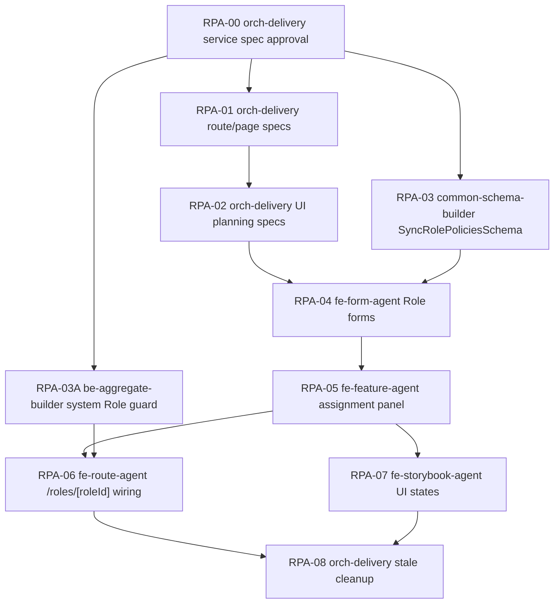

# Admin Role Policy Assignment Delivery Spec

## 서비스 목표

| 항목 | 내용 |
|------|------|
| 서비스 이름 | Admin Role Policy Assignment |
| slug | `admin-role-policy-assignment` |
| 대상 app/domain/platform | `admin-web` / access-control / desktop admin |
| 사용자 목표 | 운영자가 Role의 최종 Policy 할당 상태를 한 화면에서 확인하고 안전하게 저장합니다. |
| 운영 목표 | Role aggregate root 기준으로 정책 할당 흐름을 통합하고, route-local 비대화와 과거 Grant/Ability 흔적을 제거합니다. |
| 성공 기준 | `/roles/[roleId]`가 Role 기본 정보, 현재 할당 요약, Policy 선택/활성/우선순위 변경, 저장 확인을 일관된 흐름으로 제공합니다. |
| 범위 포함 | Role 상세의 Policy assignment refactor, route/page spec 생성 계획, reusable UI spec 생성 계획, 기존 API 소비 정렬, 테스트/정적 검증 계약 |
| 범위 제외 | Policy 자체의 Ability 구성 화면 개편, Ability/Action/Subject CRUD 개편, 새로운 권한 엔진 정책 |
| 기존 구현 재사용 후보 | `Role`, `Policy`, `RolePolicy` Prisma 모델, `PolicyAssignmentAggregate`, `getRolePolicies`, `syncRolePolicies`, `RoleEditScreen`, `RoleForm`, `RolePolicyAssignmentForm` |
| 신규 생성 사유 | 현재 route가 API 매핑, diff 계산, 모달, assignment UI를 직접 많이 소유하고 있어 Screen/Feature/Form 경계를 다시 잡아야 합니다. |

## 사용자 / 역할 / 권한

| 사용자/역할 | 목적 | 허용 행동 | 제한/금지 | 관련 route/API | 비고 |
|-------------|------|-----------|-----------|----------------|------|
| `PLATFORM_ADMIN` | Role의 최종 Policy 할당 관리 | Role 상세 조회, Policy 목록 조회, RolePolicy 조회, RolePolicy 전체 동기화, 비시스템 Role 수정/삭제 | 시스템 Role의 기본 정보/정책 할당 변경 금지 | `/roles/[roleId]`, `GET /roles/:id`, `GET /policies`, `GET/PUT /policy-assignments/roles/:roleId` | 최종 assignment owner |
| `COMPANY_MANAGER` | Role 기본 정보 확인 | Role 목록/상세 조회 | Policy assignment 조회/수정 금지, assignment 섹션 fetch 금지 | `/roles/[roleId]`, `GET /roles/:id` | 현재 API 권한 차이로 403이 날 수 있어 route에서 assignment 섹션을 숨깁니다. |
| 시스템 Role | seed/권한 체계 보호 대상 | 조회 | 수정, 삭제, assignment 저장 금지 | `/roles/[roleId]` | `role.isSystem=true`이면 편집 CTA 비활성/숨김 |

## 도메인 모델 / 생명주기

| 도메인 객체 | 책임 | 주요 필드/값 | 상태/lifecycle | 정책/검증 | 소유 패키지 | 비고 |
|-------------|------|--------------|----------------|-----------|-------------|------|
| `Role` | 권한 체계의 aggregate root | `id`, `name`, `displayName`, `description`, `isSystem` | 생성 -> 조회 -> 기본 정보 수정 -> 삭제/보호 | 시스템 Role은 수정/삭제/assignment 변경 금지 | `packages/be-prisma/schema/access-control/role.prisma`, `packages/be-aggregate/src/role/role.aggregate.ts` | 화면의 canonical root |
| `Policy` | 여러 Ability를 묶은 독립 root | `tenantId`, `name`, `displayName`, `description`, `isSystem` | 생성 -> Ability 구성 -> Role에 할당 -> 삭제 | 현재 tenant의 active Policy만 Role에 할당 가능 | `packages/be-prisma/schema/access-control/policy.prisma`, `packages/be-aggregate/src/policy/policy.aggregate.ts` | assignment 화면의 선택 후보 |
| `RolePolicy` | Role과 Policy의 최종 할당 결과 | `roleId`, `policyId`, `isActive`, `priority` | 조회 -> 로컬 변경 -> 전체 동기화 -> soft remove | 중복 `policyId` dedupe, tenant scope 검증, missing assignment soft remove, 시스템 Role assignment 변경 금지 | `packages/be-aggregate/src/policy/policy-assignment.aggregate.ts`, `packages/be-repository/src/role-policies.repository.ts` | 이 서비스의 핵심 변경 대상 |
| `PolicyAbility` | Policy 내부 Ability 구성 | `policyId`, `abilityId` | Policy 화면에서 별도 관리 | Role assignment 화면에서는 ability count/요약만 표시 | `packages/be-prisma/schema/access-control/policy.prisma` | 이 spec에서는 수정하지 않음 |

## 사용자 여정

| 여정 | 행위자 | 시작점 | 단계 | 완료 조건 | 실패/복구 | 관련 route/API |
|---------|-------|--------|------|-----------|-----------|----------------|
| Role 정책 확인 | `PLATFORM_ADMIN` | `/roles` 목록의 상세 액션 | Role 상세 진입 -> Role 기본 정보 확인 -> 현재 할당 요약 확인 -> Policy 후보 목록 스캔 | 할당/미할당/활성/우선순위 상태가 보임 | Role 없음이면 목록 이동, assignment API 실패면 섹션 오류와 재시도 | `/roles/[roleId]`, `getRoleById`, `getPolicies`, `getRolePolicies` |
| Role 정책 편집 | `PLATFORM_ADMIN` | Role 상세의 정책 할당 섹션 | 편집 시작 -> 검색/필터 -> Policy 선택/해제 -> 활성/우선순위 조정 -> 변경 요약 확인 | 저장 CTA가 변경 건수와 함께 활성화됨 | 변경 없으면 저장 비활성, 취소 시 baseline 복원 | `/roles/[roleId]`, local state |
| Role 정책 저장 | `PLATFORM_ADMIN` | 변경 요약 CTA | 저장 확인 모달 -> 전체 동기화 PUT -> 목록 재조회 -> 성공 피드백 | RolePolicy가 서버 기준과 일치 | 400/403/404는 모달 닫지 않고 error 표시, 재시도/취소 가능 | `syncRolePolicies`, `getRolePolicies` invalidation |
| 권한 없는 사용자 접근 | `COMPANY_MANAGER` | Role 상세 링크 | Role 기본 정보만 조회 -> 정책 할당 섹션은 숨김 또는 권한 안내 | assignment API를 호출하지 않음 | route 권한 판단 실패 시 access denied/section error | `/roles/[roleId]`, `getRoleById` |

## 필수 페이지 / 라우트

| 플랫폼 | route | 페이지/화면 | 목적 | 주요 상태 | 주요 행동 | route/page 스펙 경로 | Screen/Feature 스펙 참조 | 소스 담당 `agent_type` | 비고 |
|--------|-------|-------------|------|-----------|----------------|----------------------|---------------------------|---------------------------|------|
| admin-web | `/roles/[roleId]` | Role 상세 + 정책 할당 | Role aggregate 기준 최종 Policy assignment 관리 | loading, notFound, readOnly, editing, dirty, saving, saveError, permissionDenied | 편집 시작, 선택/해제, 활성 변경, 우선순위 변경, 저장, 취소, Role 수정/삭제 이동 | `apps/admin/web/src/app/(admin)/roles/[roleId]/page.spec.md` | `packages/fe-ui/src/screen/RoleEditScreen/RoleEditScreen.spec.md`, `packages/fe-ui/src/feature/RolePolicyAssignmentPanel/RolePolicyAssignmentPanel.spec.md`, `packages/fe-ui/src/form/RolePolicyAssignmentForm/RolePolicyAssignmentForm.spec.md` | `fe-route-agent` | primary surface |
| admin-web | `/roles/[roleId]/edit` | Role 기본 정보 수정 | Role metadata만 수정 | loading, notFound, readOnly(system), submitting | 표시명/설명 저장, 상세로 이동 | `apps/admin/web/src/app/(admin)/roles/[roleId]/edit/page.spec.md` | `packages/fe-ui/src/screen/RoleEditScreen/RoleEditScreen.spec.md`, `packages/fe-ui/src/form/RoleForm/RoleForm.spec.md` | `fe-route-agent` | assignment는 여기서 다루지 않음 |
| admin-web | `/roles/new` | Role 생성 | 새 Role 생성 | empty, validationError, submitting | name/displayName/description 입력, 생성 | `apps/admin/web/src/app/(admin)/roles/new/page.spec.md` | `packages/fe-ui/src/screen/RoleEditScreen/RoleEditScreen.spec.md`, `packages/fe-ui/src/form/RoleForm/RoleForm.spec.md` | `fe-route-agent` | Role aggregate create |
| admin-web | `/policies` | Policy 목록 | assignment 후보로 쓰일 Policy 관리 진입점 | current | Policy 상세/생성/수정으로 이동 | none-current | none-current | `fe-route-agent` | 이 spec에서는 소비 링크만 참조 |

## 백엔드 / API / 기반 계약

| 그룹 | 재사용/수정/신규 | 대상 파일 | 계약 | 소스 담당 `agent_type` | 소비/Wiring `agent_type` | 검증 `agent_type` | 관련 route/page 스펙 |
|------|------------------|-----------|------|-------------------------|---------------------------|-------------------|----------------------|
| Prisma / Database / Annotation | 재사용 | `packages/be-prisma/schema/access-control/role.prisma`, `packages/be-prisma/schema/access-control/policy.prisma` | `Role`은 root, `Policy`는 root, `RolePolicy`는 Role-Policy assignment join입니다. | `be-prisma-builder` | `be-repository-builder` | `be-prisma-builder` | `/roles/[roleId]` |
| Common Schema | 신규 | `packages/common-schema/src/schemas/access-control/sync-role-policies.schema.ts` | UI 저장 전 `rolePolicies[].policyId/isActive/priority`를 검증하는 `SyncRolePoliciesSchema`를 둡니다. | `common-schema-builder` | `fe-route-agent`, `fe-form-agent` | `common-schema-builder` | `/roles/[roleId]` |
| Entity / VO | 재사용 | `packages/be-entity/src/role-policy.entity.ts`, `packages/be-entity/src/policy.entity.ts`, `packages/be-entity/src/role.entity.ts` | 신규 entity 없음 | `be-entity-builder` | `be-usecase-builder` | `be-entity-builder` | `/roles/[roleId]` |
| DTO / Query DTO | 재사용 | `packages/be-dto/src/policy-assignments/*` | `SyncRolePoliciesDto`, `PolicyAssignmentResponseDto` 유지. DTO 변경은 common schema 도입 이후 별도 승인 필요. | `be-dto-builder` | `be-controller-builder` | `be-dto-builder` | `/roles/[roleId]` |
| Repository | 재사용 | `packages/be-repository/src/role-policies.repository.ts` | `syncByRoleId` 전체 동기화, missing assignment soft remove 유지 | `be-repository-builder` | `be-service-builder` | `be-repository-builder` | `/roles/[roleId]` |
| Service / Aggregate | 수정 | `packages/be-aggregate/src/policy/policy-assignment.aggregate.ts` | `getRolePolicies` 조회는 유지하고, `syncRolePolicies`에는 시스템 Role assignment 변경 금지 guard를 추가합니다. tenant scope, role exists, policy tenant 검증은 유지합니다. | `be-aggregate-builder` | `be-usecase-builder` | `be-aggregate-builder` | `/roles/[roleId]` |
| Command / Query Message | 재사용 | `packages/be-command/src/core/get-role-policies.query.ts`, `packages/be-command/src/core/sync-role-policies.command.ts` | 신규 message 없음 | `be-command-builder` | `be-usecase-builder` | `be-command-builder` | `/roles/[roleId]` |
| UseCase / Handler | 재사용 | `packages/be-usecase/src/core/policy-assignment/*` | `getRolePolicies`, `syncRolePolicies` 유지 | `be-usecase-builder` | `be-controller-builder` | `be-usecase-builder` | `/roles/[roleId]` |
| Controller Endpoint / operationId / Swagger | 재사용 | `packages/be-controller/src/policy-assignments/policy-assignments.controller.ts` | `getRolePolicies`, `syncRolePolicies` 소비. 권한은 `PLATFORM_ADMIN` 유지하고 route에서 비권한 fetch를 막습니다. | `be-controller-builder` | `fe-route-agent` | `be-controller-builder` | `/roles/[roleId]` |
| Module / Bootstrap | 재사용 | `apps/core/api/src/module/policy-assignments/policy-assignments.module.ts`, `apps/core/api/src/module/app.module.ts` | `/api/v1/policy-assignments` module 유지 | `be-bootstrap-integrator` | `fe-route-agent` | `be-bootstrap-integrator` | `/roles/[roleId]` |
| Codegen / API Client | 재사용 | `packages/fe-api/src/core/policy-assignments/policy-assignments.ts` | API 변경 없으면 codegen 없음. common schema만 UI에서 소비합니다. | `fe-hook-agent` | `fe-route-agent` | `fe-hook-agent` | `/roles/[roleId]` |
| Hook / Toolkit / Type / Store / State | 수정 | `apps/admin/web/src/app/(admin)/roles/[roleId]/page.tsx`, `packages/fe-ui/src/feature/RolePolicyAssignmentPanel/*` | route-local diff/mapper를 feature 또는 route util로 분리하고, route는 API wiring과 navigation만 소유합니다. | `fe-route-agent`, `fe-feature-agent` | `fe-screen-agent` | 각 owner | `/roles/[roleId]` |

## DESIGN.md 기반 디자인 방향

- 서비스 첫 인상: 권한 화면은 위험도가 높은 운영 화면이므로 따뜻함보다 명료한 상태와 다음 행동을 우선합니다. `Role` 상태, 현재 할당 수, 변경 건수, 저장 위험을 먼저 보여줍니다.
- 정보 위계: `Role 기본 정보 -> 정책 할당 요약 -> 검색/필터 -> Policy 목록 -> 변경 요약/저장` 순서로 읽히게 합니다.
- Navigation: `/roles/[roleId]`가 최종 assignment의 canonical route입니다. Policy 자체 편집은 `/policies/[policyId]`로 링크하되 assignment 화면 안에서 Policy 생성/수정 form을 중첩하지 않습니다.
- Platform density: Admin web에서는 카드 나열보다 table/list density를 우선합니다. Policy row는 이름, 설명, ability count, system/space, assigned/active, priority를 한 줄에서 스캔할 수 있어야 합니다.
- Shared component strategy: `RoleEditScreen`은 Role page shell, `RolePolicyAssignmentPanel`은 assignment workflow, `RolePolicyAssignmentForm`은 assignment input list, route는 API와 confirmation만 담당합니다.
- 색상 역할: `primary`는 저장, `warning`은 변경/해제 요약, `danger`는 삭제/권한 위험, `muted`는 metadata와 설명에만 사용합니다. 새 hex/gradient를 추가하지 않습니다.
- Lazyweb reference: Roadie, Clerk, Hygraph, Okta, Google Workspace, Teachable의 role/permission admin 화면은 권한 그룹화, 검색/필터, 체크 선택, 변경 전 확인 패턴을 공통적으로 사용합니다. 이 서비스는 그 패턴을 프로젝트의 Admin density와 기존 theme token 안에서 적용합니다.

## Spec 참조 맵

| 담당 스펙 | 섹션/행 id | 소유 계약 | 소비 spec | 비고 |
|-----------|------------|-----------|-----------|------|
| 이 파일 | `필수 페이지 / 라우트` `/roles/[roleId]` 행 | canonical route와 scope | `apps/admin/web/src/app/(admin)/roles/[roleId]/page.spec.md` | 승인 후 생성 |
| 이 파일 | `백엔드 / API / 기반 계약` Common Schema 행 | `SyncRolePoliciesSchema` 필요성 | `apps/admin/web/src/app/(admin)/roles/[roleId]/page.spec.md`, `packages/fe-ui/src/form/RolePolicyAssignmentForm/RolePolicyAssignmentForm.spec.md` | 승인 후 생성 |
| 이 파일 | `DESIGN.md 기반 디자인 방향` | 서비스 수준 정보 위계 | route/page spec, Screen/Feature spec | 세부 화면 러프는 하위 spec 소유 |
| `apps/admin/web/src/app/(admin)/roles/[roleId]/page.spec.md` | `Route Layout / 조합 러프` | route-local API/state/modal 흐름 | `packages/fe-ui/src/screen/RoleEditScreen/RoleEditScreen.spec.md` | 승인 후 생성 |
| `packages/fe-ui/src/feature/RolePolicyAssignmentPanel/RolePolicyAssignmentPanel.spec.md` | `화면 러프`, `props/event` | assignment workflow UI | `/roles/[roleId]` page spec | 승인 후 생성 |
| `packages/fe-ui/src/form/RolePolicyAssignmentForm/RolePolicyAssignmentForm.spec.md` | `props/event`, `상태별 렌더링` | Policy 선택/활성/우선순위 입력 계약 | `RolePolicyAssignmentPanel` spec | 승인 후 생성 |

## 생성된 Route/Page Spec

| route/page 스펙 | 플랫폼 | route 파일 | 역할 | 생성/갱신 | 상위 서비스 스펙 | 담당 `agent_type` | 비고 |
|-----------------|--------|------------|------|-----------|---------------------|-------------------|------|
| `apps/admin/web/src/app/(admin)/roles/[roleId]/page.spec.md` | admin-web | `apps/admin/web/src/app/(admin)/roles/[roleId]/page.tsx` | Role 상세 + 정책 할당 route delivery spec | 생성 | `docs/services/admin-role-policy-assignment.delivery.spec.md` | `orch-delivery` | approval 후 생성 |
| `apps/admin/web/src/app/(admin)/roles/[roleId]/edit/page.spec.md` | admin-web | `apps/admin/web/src/app/(admin)/roles/[roleId]/edit/page.tsx` | Role 기본 정보 수정 route delivery spec | 생성 | `docs/services/admin-role-policy-assignment.delivery.spec.md` | `orch-delivery` | approval 후 생성 |
| `apps/admin/web/src/app/(admin)/roles/new/page.spec.md` | admin-web | `apps/admin/web/src/app/(admin)/roles/new/page.tsx` | Role 생성 route delivery spec | 생성 | `docs/services/admin-role-policy-assignment.delivery.spec.md` | `orch-delivery` | approval 후 생성 |

## Screen/Feature Spec 인덱스

| 기획 스펙 | 계층 | 소스/대상 컴포넌트 | 생성/갱신 | 참조 route/page 스펙 | 소스 담당 `agent_type` | 비고 |
|---------------|------|--------------------|-----------|----------------------|-------------------------|------|
| `packages/fe-ui/src/screen/RoleEditScreen/RoleEditScreen.spec.md` | Screen | `packages/fe-ui/src/screen/RoleEditScreen/RoleEditScreen.tsx` | 갱신 | `/roles/[roleId]`, `/roles/[roleId]/edit`, `/roles/new` page spec | `fe-screen-agent` | 현재 단순 rough를 route별 shell 계약으로 확장 |
| `packages/fe-ui/src/feature/RolePolicyAssignmentPanel/RolePolicyAssignmentPanel.spec.md` | Feature | `packages/fe-ui/src/feature/RolePolicyAssignmentPanel/RolePolicyAssignmentPanel.tsx` | 생성 | `/roles/[roleId]` page spec | `fe-feature-agent` | route-local workflow를 feature로 분리 |
| `packages/fe-ui/src/form/RolePolicyAssignmentForm/RolePolicyAssignmentForm.spec.md` | Form | `packages/fe-ui/src/form/RolePolicyAssignmentForm/RolePolicyAssignmentForm.tsx` | 생성 | `/roles/[roleId]` page spec | `fe-form-agent` | 선택/활성/우선순위 입력 계약 |
| `packages/fe-ui/src/form/RoleForm/RoleForm.spec.md` | Form | `packages/fe-ui/src/form/RoleForm/RoleForm.tsx` | 생성 | `/roles/[roleId]/edit`, `/roles/new` page spec | `fe-form-agent` | 기본 정보 form 계약 보강 |

## 산출물 시뮬레이션 / 인계 계약

| 단계 id | 단계 | 담당 `agent_type` | 입력 spec/파일 | 예상 산출물 | 생성/수정 예정 경로 | 소비 단계 / `agent_type` | 인계 조건 | 검증 기준 |
|---------|-------|-------------------|----------------|-------------|----------------------|---------------------------|-----------|-----------|
| RPA-00 | service spec approval | `orch-delivery` | 사용자 요청, 현재 repo 조사 | 승인된 service delivery spec | `docs/services/admin-role-policy-assignment.delivery.spec.md` | RPA-01 / `orch-delivery` | 사용자 승인 | 필수 섹션 존재, 하위 spec 미생성 |
| RPA-01 | route/page spec 생성 | `orch-delivery` | RPA-00 | `/roles` 계열 route/page delivery spec | `apps/admin/web/src/app/(admin)/roles/[roleId]/page.spec.md`, `apps/admin/web/src/app/(admin)/roles/[roleId]/edit/page.spec.md`, `apps/admin/web/src/app/(admin)/roles/new/page.spec.md` | RPA-02, RPA-06 / `fe-screen-agent`, `fe-route-agent` | route spec가 상위 spec과 Screen/Feature spec 경로를 참조 | `rg -n "상위 서비스 Spec|산출물 시뮬레이션" apps/admin/web/src/app/\\(admin\\)/roles` |
| RPA-02 | Screen/Feature/Form planning spec 생성 | `orch-delivery` | RPA-00, RPA-01 | reusable UI planning spec | `packages/fe-ui/src/screen/RoleEditScreen/RoleEditScreen.spec.md`, `packages/fe-ui/src/feature/RolePolicyAssignmentPanel/RolePolicyAssignmentPanel.spec.md`, `packages/fe-ui/src/form/RolePolicyAssignmentForm/RolePolicyAssignmentForm.spec.md`, `packages/fe-ui/src/form/RoleForm/RoleForm.spec.md` | RPA-04, RPA-05, RPA-06 / UI agents | props/event/상태 계약이 route spec과 연결 | 각 spec에 화면 러프와 Storybook/test 계약 존재 |
| RPA-03A | system Role backend guard | `be-aggregate-builder` | RPA-00, `packages/be-aggregate/src/policy/policy-assignment.aggregate.ts` | 시스템 Role assignment 변경 금지 guard와 aggregate test | `packages/be-aggregate/src/policy/policy-assignment.aggregate.ts`, `packages/be-aggregate/__tests__/policy-assignment.aggregate.spec.ts` | RPA-06 / `fe-route-agent` | sync 시 system role이면 forbidden error, 조회는 유지 | `pnpm --filter=@cocrepo/aggregate exec vitest run packages/be-aggregate/__tests__/policy-assignment.aggregate.spec.ts` |
| RPA-03 | common schema | `common-schema-builder` | RPA-00, RPA-01 | `SyncRolePoliciesSchema`와 export | `packages/common-schema/src/schemas/access-control/sync-role-policies.schema.ts`, `packages/common-schema/src/schemas/access-control/index.ts`, `packages/common-schema/src/schemas/index.ts` | RPA-04, RPA-06 / `fe-form-agent`, `fe-route-agent` | schema export name `SyncRolePoliciesSchema` | `pnpm --filter=@cocrepo/common-schema run type-check` |
| RPA-04 | form refactor | `fe-form-agent` | RPA-02, RPA-03 | Role form과 assignment form state/input 정리 | `packages/fe-ui/src/form/RoleForm/*`, `packages/fe-ui/src/form/RolePolicyAssignmentForm/*` | RPA-05, RPA-07 / `fe-feature-agent`, `fe-storybook-agent` | assignment change event, disabled/readOnly/loading/empty 상태 | `pnpm --filter=@cocrepo/ui run type-check` |
| RPA-05 | assignment feature 생성 | `fe-feature-agent` | RPA-02, RPA-04 | 검색/필터/요약/diff/save CTA feature | `packages/fe-ui/src/feature/RolePolicyAssignmentPanel/*`, `packages/fe-ui/src/feature/index.ts` | RPA-06, RPA-07 / `fe-route-agent`, `fe-storybook-agent` | props key: `role`, `policies`, `assignments`, `baselineAssignments`, `onSave`, `onCancel` | feature unit test와 UI typecheck |
| RPA-06 | route wiring | `fe-route-agent` | RPA-01, RPA-03, RPA-03A, RPA-05 | `/roles/[roleId]` API/state/navigation 정리 | `apps/admin/web/src/app/(admin)/roles/[roleId]/page.tsx`, `apps/admin/web/src/app/(admin)/roles/[roleId]/page.e2e.ts`, 필요 시 route-local util 파일 | RPA-08 / `fe-route-agent` | assignment API는 권한 있는 사용자에게만 호출, save 후 query invalidation | `pnpm --filter=admin-web run type-check`, route E2E |
| RPA-07 | Storybook | `fe-storybook-agent` | RPA-02, RPA-04, RPA-05 | ready/loading/empty/error/dirty/readOnly stories | `packages/fe-ui/src/screen/RoleEditScreen/RoleEditScreen.stories.tsx`, `packages/fe-ui/src/feature/RolePolicyAssignmentPanel/RolePolicyAssignmentPanel.stories.tsx` | RPA-08 / owner 검증 | 긴 텍스트, narrow viewport 상태 포함 | `pnpm --filter=@cocrepo/ui run storybook:check` 또는 가능한 대체 검증 |
| RPA-08 | stale spec/generated cleanup | `orch-delivery` | RPA-01~RPA-07 완료 보고 | 과거 `_spec/03-interactions.md`와 Role->Ability 직접 할당 흔적 제거/대체 | `apps/admin/web/src/app/(admin)/roles/[roleId]/_spec/03-interactions.md`, `apps/admin/web/src/app/(admin)/roles/[roleId]/edit/_spec/03-interactions.md`, `packages/fe-api/src/**/setRoleAbilities*`, `packages/fe-api/src/**/updateRoleAbilities*` | none-cleanup | Grant/신규 구현 필요/잘못된 response 예시와 direct RoleAbility generated trace가 남지 않음 | `rg -n "Grant 배치|신규 구현 필요|actionId.*subjectId|setRoleAbilities|updateRoleAbilities" apps/admin/web/src/app/\\(admin\\)/roles packages/fe-api/src` |

## 에이전트 배정 매트릭스

| 단계 id | 단계 | 담당 `agent_type` | 입력 파일 | 출력 파일 또는 생성 결과 경로 | 수정 허용 파일 | 의존 단계 | 소비 단계 | 산출물 시뮬레이션 행 id | 병렬 | 완료 조건 |
|---------|------|-------------------|-----------|-------------------------------|----------------|-----------|-----------|--------------------------|------|-----------|
| RPA-00 | service spec approval | `orch-delivery` | repo 조사 결과 | `docs/services/admin-role-policy-assignment.delivery.spec.md` | `docs/services/admin-role-policy-assignment.delivery.spec.md` | none | RPA-01 | RPA-00 | false | 사용자 승인 |
| RPA-01 | route/page spec 생성 | `orch-delivery` | RPA-00 | route/page specs | `apps/admin/web/src/app/(admin)/roles/**/page.spec.md` | RPA-00 | RPA-02, RPA-06 | RPA-01 | false | 모든 route spec 생성 |
| RPA-02 | UI planning spec 생성 | `orch-delivery` | RPA-00, RPA-01 | screen/feature/form specs | `packages/fe-ui/src/**/**.spec.md` | RPA-01 | RPA-04, RPA-05, RPA-07 | RPA-02 | false | 모든 UI spec 생성 |
| RPA-03A | system Role backend guard | `be-aggregate-builder` | RPA-00 | aggregate guard/test | `packages/be-aggregate/src/policy/policy-assignment.aggregate.ts`, `packages/be-aggregate/__tests__/policy-assignment.aggregate.spec.ts` | RPA-00 | RPA-06 | RPA-03A | true | aggregate test 통과 |
| RPA-03 | common schema | `common-schema-builder` | RPA-00 | access-control schema | `packages/common-schema/src/schemas/access-control/**` | RPA-00 | RPA-04, RPA-06 | RPA-03 | true | schema typecheck |
| RPA-04 | form refactor | `fe-form-agent` | RPA-02, RPA-03 | Role forms | `packages/fe-ui/src/form/RoleForm/**`, `packages/fe-ui/src/form/RolePolicyAssignmentForm/**` | RPA-02, RPA-03 | RPA-05, RPA-07 | RPA-04 | false | form states/tests pass |
| RPA-05 | feature 생성 | `fe-feature-agent` | RPA-02, RPA-04 | assignment panel | `packages/fe-ui/src/feature/RolePolicyAssignmentPanel/**`, `packages/fe-ui/src/feature/index.ts` | RPA-04 | RPA-06, RPA-07 | RPA-05 | false | feature tests/typecheck pass |
| RPA-06 | route wiring | `fe-route-agent` | RPA-01, RPA-03, RPA-03A, RPA-05 | role route | `apps/admin/web/src/app/(admin)/roles/[roleId]/page.tsx`, `apps/admin/web/src/app/(admin)/roles/[roleId]/page.e2e.ts` | RPA-03A, RPA-05 | RPA-08 | RPA-06 | false | admin-web typecheck/e2e pass |
| RPA-07 | Storybook | `fe-storybook-agent` | RPA-02, RPA-04, RPA-05 | stories | `packages/fe-ui/src/screen/RoleEditScreen/*.stories.tsx`, `packages/fe-ui/src/feature/RolePolicyAssignmentPanel/*.stories.tsx` | RPA-05 | RPA-08 | RPA-07 | true | required states covered |
| RPA-08 | stale cleanup | `orch-delivery` | 완료 보고 | legacy spec cleanup | `apps/admin/web/src/app/(admin)/roles/**/_spec/03-interactions.md` | RPA-06, RPA-07 | none | RPA-08 | false | 금지 grep 0건 |

## 실행 그래프

### 시각 실행 흐름

### 병렬 그룹 표

| 그룹 | 병렬 단계 | 병렬 가능 사유 | 공유 파일 lock | 합류 단계 |
|------|-----------|----------------|----------------|-----------|
| P1 | RPA-03, RPA-03A | route/page spec 이후 UI 구현 전까지 common-schema와 backend guard는 서로 독립 경로입니다. | none | RPA-04, RPA-06 |
| P2 | RPA-07 | feature 구현 후 Storybook은 route wiring과 다른 파일을 수정합니다. | `packages/fe-ui/src/screen/RoleEditScreen/RoleEditScreen.stories.tsx`는 storybook owner lock | RPA-08 |

### 단계 순서 표

| 순서 | 단계 id | 단계 | `agent_type` | 직렬/병렬 | 의존 단계 | 입력 산출물 행 | 산출물 행 | 완료 조건 |
|------|---------|------|--------------|-----------|-----------|----------------|------------|-----------|
| 1 | RPA-00 | service spec approval | `orch-delivery` | 직렬 | none | none | RPA-00 | 승인 |
| 2 | RPA-01 | route/page spec 생성 | `orch-delivery` | 직렬 | RPA-00 | RPA-00 | RPA-01 | specs 생성 |
| 3 | RPA-02 | UI planning spec 생성 | `orch-delivery` | 직렬 | RPA-01 | RPA-01 | RPA-02 | specs 생성 |
| 4 | RPA-03A | system Role backend guard | `be-aggregate-builder` | 병렬 가능 | RPA-00 | RPA-00 | RPA-03A | aggregate 검증 |
| 5 | RPA-03 | common schema | `common-schema-builder` | 병렬 가능 | RPA-00 | RPA-00 | RPA-03 | schema typecheck |
| 6 | RPA-04 | form refactor | `fe-form-agent` | 직렬 | RPA-02, RPA-03 | RPA-02, RPA-03 | RPA-04 | form 검증 |
| 7 | RPA-05 | assignment feature | `fe-feature-agent` | 직렬 | RPA-04 | RPA-04 | RPA-05 | feature 검증 |
| 8 | RPA-06 | route wiring | `fe-route-agent` | 직렬 | RPA-03A, RPA-05 | RPA-03A, RPA-05 | RPA-06 | admin route 검증 |
| 9 | RPA-07 | Storybook | `fe-storybook-agent` | 병렬 가능 | RPA-05 | RPA-05 | RPA-07 | story 검증 |
| 10 | RPA-08 | cleanup | `orch-delivery` | 직렬 | RPA-06, RPA-07 | RPA-06, RPA-07 | RPA-08 | stale grep 0건 |

## 테스트 인벤토리 / owner 검증

### 단위 테스트 인벤토리

| 테스트 대상 | 검증 항목 | 테스트 파일 | mock/stub | 작성 agent_type | 검증 agent_type | 통과 기준 |
|-------------|-----------|-------------|-----------|------------------|------------------|-----------|
| `SyncRolePoliciesSchema` | UUID, boolean, priority number, empty array 허용 여부 | `packages/common-schema/src/schemas/access-control/sync-role-policies.schema.test.ts` | none | `common-schema-builder` | `common-schema-builder` | 유효/무효 payload Given-When-Then 통과 |
| `PolicyAssignmentAggregate` | 시스템 Role sync 금지, tenant policy scope 유지, 조회는 허용 | `packages/be-aggregate/__tests__/policy-assignment.aggregate.spec.ts` | repository/spaceContext mock | `be-aggregate-builder` | `be-aggregate-builder` | system role sync forbidden, non-system sync pass |
| `RolePolicyAssignmentForm` | 선택/해제, active toggle, priority change, readOnly guard | `packages/fe-ui/src/form/RolePolicyAssignmentForm/RolePolicyAssignmentForm.test.tsx` | local state fixture | `fe-form-agent` | `fe-form-agent` | 이벤트와 disabled guard 통과 |
| `RolePolicyAssignmentPanel` | 검색/필터, dirty summary, save/cancel event, empty/error/loading | `packages/fe-ui/src/feature/RolePolicyAssignmentPanel/RolePolicyAssignmentPanel.test.tsx` | policy/assignment fixture | `fe-feature-agent` | `fe-feature-agent` | 모든 상태 렌더링과 event 통과 |
| `RoleEditScreen` | title/actions/children shell, loading/notFound/readOnly | `packages/fe-ui/src/screen/RoleEditScreen/RoleEditScreen.test.tsx` | form fixture | `fe-screen-agent` | `fe-screen-agent` | shell 상태 통과 |

### E2E 테스트 인벤토리

| 시나리오 | 검증 흐름 | 테스트 파일 | mock/stub | 작성 agent_type | 검증 agent_type | 통과 기준 |
|----------|-----------|-------------|-----------|------------------|------------------|-----------|
| Role 정책 할당 조회 | 역할 목록 -> 상세 -> 정책 할당 요약/목록 확인 | `apps/admin/web/src/app/(admin)/roles/[roleId]/page.e2e.ts` | 기존 seed | `fe-route-agent` | `fe-route-agent` | heading/summary/list visible |
| Role 정책 변경 저장 | 편집 시작 -> policy 선택/해제 -> 저장 확인 -> PUT -> 성공 toast -> 재조회 | `apps/admin/web/src/app/(admin)/roles/[roleId]/page.e2e.ts` | 테스트 policy/role seed 필요 | `fe-route-agent` | `fe-route-agent` | 변경 건수와 저장 결과 확인 |
| 시스템 Role 보호 | 시스템 Role 상세 -> 정책 편집 CTA 없음/disabled -> PUT 호출 없음 | `apps/admin/web/src/app/(admin)/roles/[roleId]/page.e2e.ts` | existing system role seed | `fe-route-agent` | `fe-route-agent` | 수정/삭제/정책 편집 불가 |
| 권한 없는 사용자 | `COMPANY_MANAGER`로 Role 상세 접근 -> assignment API 미호출/섹션 숨김 | `apps/admin/web/src/app/(admin)/roles/[roleId]/page.e2e.ts` | auth state fixture | `fe-route-agent` | `fe-route-agent` | 403 toast 없이 기본 정보 표시 |

### 정적 검증 / 금지 grep

| 검증 항목 | 명령 | 검증 agent_type | 통과 기준 |
|-----------|------|------------------|-----------|
| admin web typecheck | `pnpm --filter=admin-web run type-check` | `fe-route-agent` | 0 errors |
| ui typecheck | `pnpm --filter=@cocrepo/ui run type-check` | `fe-form-agent`, `fe-feature-agent`, `fe-screen-agent` | 0 errors |
| common schema typecheck | `pnpm --filter=@cocrepo/common-schema run type-check` | `common-schema-builder` | 0 errors |
| aggregate guard test | `pnpm --filter=@cocrepo/aggregate exec vitest run packages/be-aggregate/__tests__/policy-assignment.aggregate.spec.ts` | `be-aggregate-builder` | 0 failures |
| stale Grant/spec 흔적 제거 | `rg -n "Grant 배치|신규 구현 필요|actionId.*subjectId|권한 할당 저장" apps/admin/web/src/app/\\(admin\\)/roles packages/fe-ui/src/screen/RoleEditScreen packages/fe-ui/src/form/RolePolicyAssignmentForm` | `orch-delivery` | 0건 또는 승인된 문구만 존재 |
| direct RoleAbility generated 흔적 제거 | `rg -n "setRoleAbilities|updateRoleAbilities" packages/fe-api/src` | `orch-delivery` | 0건 |
| assignment route canonical 확인 | `rg -n "policy-assignments" apps/admin/web/src/app/\\(admin\\) packages/fe-ui/src` | `fe-route-agent` | API import는 `/roles/[roleId]` route-local wiring에만 존재 |

### owner 검증 표

| owner agent_type | 입력 파일 | 산출물 | 재실행 조건 |
|------------------|-----------|--------|-------------|
| `orch-delivery` | 이 service spec | route/page spec, UI planning spec, cleanup report | service scope 변경, route 추가/삭제 |
| `be-aggregate-builder` | `백엔드 / API / 기반 계약` Service/Aggregate 행 | system Role assignment guard/test | 시스템 Role 정책 변경 허용 여부가 바뀔 때 |
| `common-schema-builder` | `백엔드 / API / 기반 계약` Common Schema 행 | access-control schema/test | payload shape 변경 |
| `fe-form-agent` | Form planning spec | Role forms/test | form state/event 변경 |
| `fe-feature-agent` | Feature planning spec | assignment panel/test | 검색/필터/summary UX 변경 |
| `fe-screen-agent` | Screen planning spec | RoleEditScreen/test | shell layout/props 변경 |
| `fe-route-agent` | route/page spec | route wiring/e2e | API, 권한, navigation 변경 |
| `fe-storybook-agent` | UI planning spec | stories | UI state 추가/삭제 |

## 검증 / 승인 기준

- service-level acceptance: Role aggregate root 기준으로 `/roles/[roleId]`가 최종 Policy assignment 화면이 됩니다.
- route acceptance: assignment API 호출은 권한 있는 사용자와 비시스템 Role 편집 상태에서만 발생합니다.
- UI acceptance: 현재 할당 수, 추가/해제/수정 건수, 저장 전 확인이 명확히 보이고, 검색/필터/priority/active 조작이 한 화면에서 가능합니다.
- backend acceptance: 기존 `getRolePolicies`, `syncRolePolicies` contract를 깨지 않고 tenant scope와 role/policy 존재 검증을 유지합니다.
- backend acceptance: 시스템 Role의 assignment sync는 backend에서도 거부하고, `getRolePolicies` 조회는 유지합니다.
- codegen acceptance: API shape 변경이 없으면 codegen을 실행하지 않습니다. DTO/endpoint 변경이 생기면 service spec부터 갱신합니다.
- Storybook acceptance: ready, loading, empty, error, dirty, readOnly, long text, narrow viewport 상태가 포함됩니다.
- E2E acceptance: 조회, 편집 저장, 시스템 Role 보호, 권한 없는 사용자 시나리오가 통과합니다.
- cleanup acceptance: 과거 `_spec/03-interactions.md`의 Grant/신규 구현 필요/잘못된 response body 예시는 승인 후 신규 page spec으로 대체하거나 제거합니다.
- approval gate: 이 service spec 승인 전에는 `page.spec.md`, Screen/Feature planning spec, 구현 파일을 생성/수정하지 않습니다.
