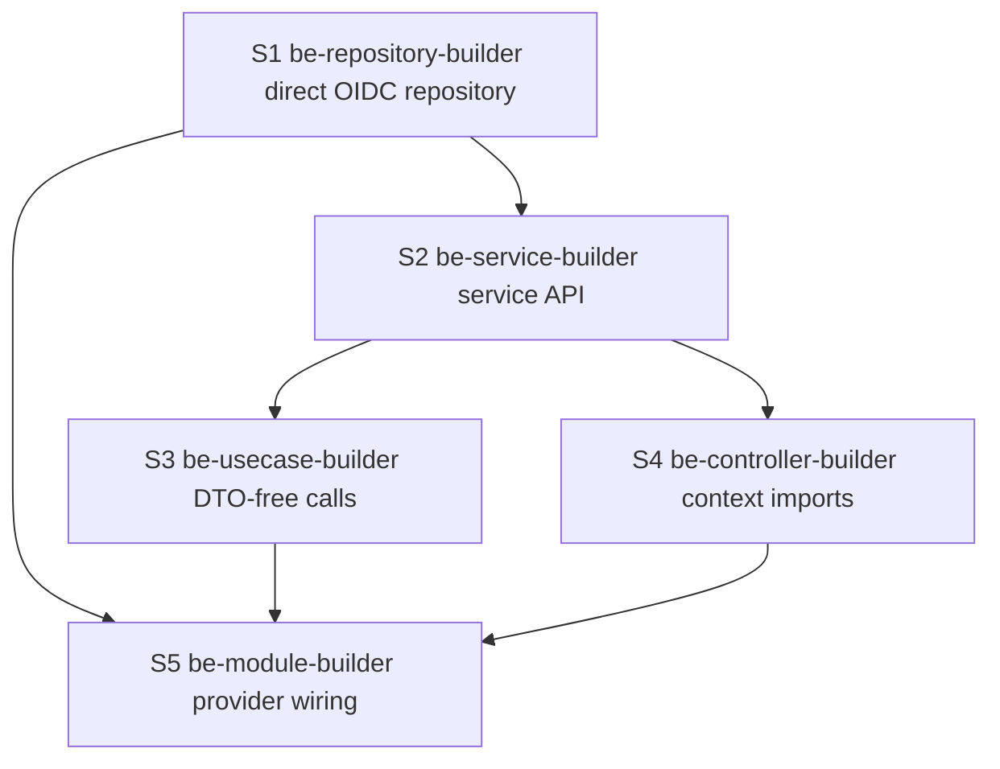

# be-service owner boundary refactor delivery spec

## 서비스 목표

`@cocrepo/service`를 backend support service 패키지로 유지하되, context, strategy, direct repository처럼 다른 owner가 소유해야 하는 책임을 분리한다. 성공 기준은 service public API가 service-owned provider/contract만 노출하고, 소비처가 새 owner package에서 직접 import하며, 하위호환 wrapper나 deprecated export를 남기지 않는 것이다.

## 사용자 / 역할 / 권한

| 사용자/역할 | 목적 | 허용 행동 | 제한/금지 | 관련 route/API | 비고 |
|-------------|------|-----------|-----------|----------------|------|
| backend developer | service package import 경계 이해 | service-owned provider/contract만 `@cocrepo/service`에서 import | context, strategy, constant, direct repository를 service facade로 우회 import 금지 | no route surface | no UI design impact |
| runtime module | provider wiring | owner package에서 직접 provider import | wrapper provider 생성 금지 | app module wiring | module owner 검증 |

## 도메인 모델 / 생명주기

| 도메인 객체 | 책임 | 주요 필드/값 | 상태/lifecycle | 정책/검증 | 소유 패키지 | 비고 |
|-------------|------|--------------|----------------|-----------|-------------|------|
| masking preset protocol | persisted masking preset id | `PRESET_EMAIL` 등 | DB seed와 action config에 저장 | public protocol 값은 `@cocrepo/constant`, 실행 정책은 `MaskingService` | `@cocrepo/constant`, `@cocrepo/service` | 상수 재export 금지 |
| OIDC direct data access | RLS/CLS 우회 runtime 조회 | direct Prisma client, runtime OIDC client/user read | app bootstrap과 OIDC interaction에서 사용 | Prisma query는 repository owner로 이동 | `@cocrepo/repository` | 일반 `OidcClientsRepository`와 구분 |
| JWT strategy | Passport jwt strategy | request token extraction, user lookup | app auth module provider | strategy owner는 common HTTP infrastructure | `@cocrepo/be-common` | service에서 제거 |

## 사용자 여정

| 여정 | 행위자 | 시작점 | 단계 | 완료 조건 | 실패/복구 | 관련 route/API |
|------|--------|--------|------|-----------|-----------|----------------|
| import migration | backend developer | existing imports | owner package로 import 갱신 | type-check 통과 | grep으로 잔여 facade import 확인 | no route surface |
| OIDC bootstrap | runtime module | app startup | direct prisma provider 생성, OIDC provider initialize | provider 초기화 성공 | 기존 fallback DATABASE_URL 유지 | `/oidc/*` runtime |

## 필수 페이지 / 라우트

| 플랫폼 | route | 페이지/화면 | 목적 | 주요 상태 | 주요 행동 | route/page 스펙 경로 | Screen/Feature 스펙 참조 | 소스 담당 `agent_type` | 비고 |
|--------|-------|-------------|------|-----------|-----------|----------------------|---------------------------|--------------------------|------|
| backend | none | none | package boundary refactor | no UI state | no UI action | none | none-current | orch-delivery | no route surface |

## 백엔드 / API / 기반 계약

| 그룹 | 재사용/수정/신규 | 대상 | 소스 담당 `agent_type` | 소비/Wiring `agent_type` | 검증 `agent_type` | 비고 |
|------|------------------|------|--------------------------|---------------------------|---------------------|------|
| Repository | 수정 | `packages/be-repository/src/oidc-direct-prisma.provider.ts`, `oidc-direct-users.repository.ts`, `oidc-runtime-clients.repository.ts` | be-repository-builder | be-service-builder, be-module-builder | be-repository-builder | OIDC direct data access 이동 |
| Service | 수정 | `packages/be-service/src/index.ts`, `src/oidc/**`, `src/idp/**`, `src/masking/**`, `src/user/**`, `src/template/**` | be-service-builder | be-usecase-builder, be-module-builder | be-service-builder | service-owned API만 export |
| Common infrastructure | 수정 | `packages/be-common/src/strategy/**`, `src/index.ts`, `src/interceptor/masking.interceptor.ts` | be-module-builder | be-bootstrap-integrator | be-module-builder | JwtStrategy owner 복구, masking policy 위임 |
| UseCase | 수정 | `packages/be-usecase/src/**` | be-usecase-builder | be-module-builder | be-usecase-builder | DTO to service input 변환 |
| Controller | 수정 | `packages/be-controller/src/**` | be-controller-builder | be-module-builder | be-controller-builder | context import owner 변경 |
| Module / Bootstrap | 수정 | `apps/core/api/src/module/**` | be-module-builder, be-bootstrap-integrator | none-final | be-module-builder | provider wiring 갱신 |

## DESIGN.md 기반 디자인 방향

no UI design impact. 이 작업은 backend package owner 경계와 runtime provider wiring만 변경한다.

## Spec 참조 맵

| 담당 스펙 | 섹션/행 id | 소유 계약 | 소비 spec | 비고 |
|-----------|------------|-----------|-----------|------|
| this file | 백엔드 / API / 기반 계약 | package owner 경계 | none | backend-only refactor |

## 생성된 Route/Page Spec

| route/page 스펙 | 플랫폼 | route 파일 | 역할 | 생성/갱신 | 상위 서비스 스펙 | 담당 `agent_type` | 비고 |
|-----------------|--------|------------|------|-----------|------------------|-------------------|------|
| none | backend | none | no route surface | none | this file | orch-delivery | no UI |

## Screen/Feature Spec 인덱스

| 기획 스펙 | 계층 | 소스/대상 컴포넌트 | 생성/갱신 | 참조 route/page 스펙 | 소스 담당 `agent_type` | 비고 |
|-----------|------|--------------------|-----------|----------------------|--------------------------|------|
| none-current | none | none | none | none | orch-delivery | no UI design impact |

## 산출물 시뮬레이션 / 인계 계약

| 단계 id | 단계 | 담당 `agent_type` | 입력 spec/파일 | 예상 산출물 | 생성/수정 예정 경로 | 소비 단계 / `agent_type` | 인계 조건 | 검증 기준 |
|---------|------|-------------------|----------------|-------------|----------------------|---------------------------|-----------|-----------|
| S1 | direct repository 이동 | be-repository-builder | service OIDC direct files | direct provider/repositories export | `packages/be-repository/src/oidc-*` | S2 / be-service-builder | exported direct classes | repository type-check |
| S2 | service API 정리 | be-service-builder | S1 exports, service source | service-owned barrel and imports | `packages/be-service/src/**` | S3 / be-usecase-builder | no service facade exports | service grep/type-check |
| S3 | usecase import/input 정리 | be-usecase-builder | S2 service API | DTO-free service calls | `packages/be-usecase/src/**` | S5 / be-module-builder | service calls use service input | usecase type-check |
| S4 | controller import 정리 | be-controller-builder | S2 service API | context direct imports | `packages/be-controller/src/**` | S5 / be-module-builder | no context from service | controller compile via core-api |
| S5 | module/bootstrap wiring | be-module-builder | S1-S4 outputs | provider wiring | `apps/core/api/src/module/**` | none-final | runtime providers wired | core-api type-check |

## 에이전트 배정 매트릭스

| 단계 id | 단계 | 담당 `agent_type` | 입력 파일 | 출력 파일 | 수정 허용 파일 | 의존 단계 | 소비 단계 | 산출물 행 id | 병렬 | 완료 조건 |
|---------|------|-------------------|-----------|-----------|----------------|-----------|-----------|--------------|------|-----------|
| S1 | direct repository 이동 | be-repository-builder | `packages/be-service/src/oidc/*direct*`, `*repository.ts` | `packages/be-repository/src/oidc-*` | `packages/be-repository/**` | none | S2,S5 | S1 | false | exports and deps updated |
| S2 | service API 정리 | be-service-builder | `packages/be-service/src/**` | same | `packages/be-service/**` | S1 | S3,S5 | S2 | false | service facade cleaned |
| S3 | usecase 정리 | be-usecase-builder | `packages/be-usecase/src/**` | same | `packages/be-usecase/**` | S2 | S5 | S3 | true | DTO-free service calls |
| S4 | controller 정리 | be-controller-builder | `packages/be-controller/src/**` | same | `packages/be-controller/**` | S2 | S5 | S4 | true | context direct imports |
| S5 | module/bootstrap 정리 | be-module-builder | `apps/core/api/src/module/**` | same | `apps/core/api/src/module/**` | S1,S2,S3,S4 | none | S5 | false | core-api type-check |

## 실행 그래프

## 테스트 인벤토리 / owner 검증

| 검증 항목 | 명령 | 검증 agent_type | 통과 기준 |
|-----------|------|-----------------|-----------|
| repository unit/type | `pnpm --filter=@cocrepo/repository test && pnpm --filter=@cocrepo/repository type-check` | be-repository-builder | pass |
| service unit/type | `pnpm --filter=@cocrepo/service test && pnpm --filter=@cocrepo/service type-check` | be-service-builder | pass |
| common unit/type | `pnpm --filter=@cocrepo/be-common test && pnpm --filter=@cocrepo/be-common type-check` | be-module-builder | pass |
| usecase type | `pnpm --filter=@cocrepo/usecase type-check` | be-usecase-builder | pass |
| api type | `pnpm --filter=core-api type-check` | be-module-builder | pass |
| forbidden service DTO import | `rg '@cocrepo/dto' packages/be-service/src` | be-service-builder | no hits |
| forbidden service facade exports | `rg 'AuthContext|SpaceContext|JwtStrategy|MASKING_PRESETS' packages/be-service/src/index.ts` | be-service-builder | no hits |
| service directory pattern | `find packages/be-service/src -path '*.service/index.ts'` | be-service-builder | no hits |

## 검증 / 승인 기준

- `@cocrepo/service` root export는 service-owned provider/contract만 남긴다.
- `MASKING_PRESETS`는 `@cocrepo/constant` public protocol로 유지하고 `@cocrepo/service`에서 재export하지 않는다.
- `MaskingService`가 masking action mapping, field inference, masking algorithm을 캡슐화한다.
- OIDC direct Prisma query는 `@cocrepo/repository` owner로 이동한다.
- 실행 가능한 테스트와 static grep을 수행하고, 실패가 남으면 owner와 위험을 보고한다.
