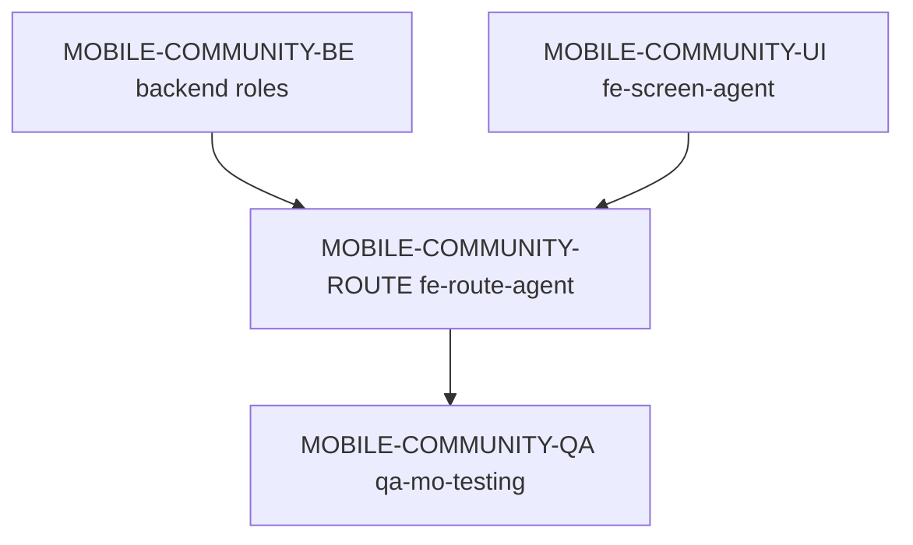

# 모바일 커뮤니티 서비스 딜리버리 Spec

> 생성일: 2026-06-01
> 서비스: 모바일 커뮤니티
> 식별자: `mobile-community`
> 담당 subagent: `orch-delivery`
> 상태: 기존 route spec 기준 문서 보완

## 서비스 목표

모바일 사용자가 선택된 지점의 공지와 회원 소식을 확인하고 짧은 게시글을 작성할 수 있게 한다.

| 항목 | 내용 |
|------|------|
| 사용자 목표 | 예약 전후 지점 소식과 회원 이야기를 빠르게 확인한다. |
| 운영 목표 | mobile route, screen, backend content API, Orval codegen이 하나의 서비스 계약을 따른다. |
| 대상 app/domain/platform | `apps/mobile`, community/content, Expo Router |
| 성공 기준 | `/community` 탭에서 feed 조회, 로딩/empty/오류, 작성 bottom sheet, 작성 후 갱신이 동작한다. |
| 범위 제외 | 댓글, 좋아요, 신고, 파일 첨부, push notification, admin moderation UI |

## 사용자 / 역할 / 권한

| 사용자/역할 | 목적 | 허용 행동 | 제한/금지 | 관련 route/API | 비고 |
|-------------|------|-----------|-----------|----------------|------|
| 로그인 회원 | 커뮤니티 확인/작성 | 게시글 목록 조회, 짧은 글 작성 | 선택된 space 밖 게시글 접근 금지 | `/community`, community APIs | `x-space-id` 필요 |
| 지점 운영자 | 공지 게시 | 공지성 게시글 작성 | mobile moderation은 범위 제외 | community APIs | admin moderation은 별도 service |

## 도메인 모델 / 생명주기

| 도메인 객체 | 책임 | 주요 필드/값 | 상태/lifecycle | 정책/검증 | 소유 패키지 | 비고 |
|-------------|------|--------------|----------------|-----------|-------------|------|
| Community post | feed item | title, text, author, createdAt, isPinned, isMine | created → listed | space scoped, text validation | backend content domain | 댓글/반응 제외 |
| Composer state | route-local 입력 | title, text, errors, pending | open → edit → submit/cancel | 빈 본문 방지 | mobile route | route-local state |

## 사용자 여정

| 여정 | 행위자 | 시작점 | 단계 | 완료 조건 | 실패/복구 | 관련 route/API |
|---------|-------|--------|------|-----------|-----------|----------------|
| feed 확인 | 로그인 회원 | `/community` | tab 진입 → feed 조회 → 게시글 확인 | 목록/empty/오류 중 하나 표시 | 오류 retry | `useGetCommunityPosts` |
| 글 작성 | 로그인 회원 | `/community` | 글쓰기 → 제목/본문 입력 → 등록 | 작성 성공 후 feed 갱신 | validation error 표시 | `useCreateCommunityPost` |

## 필수 페이지 / 라우트

| 플랫폼 | route | 페이지/화면 | 목적 | 주요 상태 | 주요 행동 | route spec 경로 | 소스 담당 `agent_type` | 비고 |
|--------|-------|-------------|------|-----------|----------------|-----------------|---------------------------|------|
| mobile | `/community` | 커뮤니티 탭 | feed 조회/작성 | 로딩/empty/오류/준비/작성 중 | 글쓰기 | `apps/mobile/src/app/community/index.spec.md` | `fe-route-agent` | 하단 탭 등록 필요 |

## 백엔드 / API / 기반 계약

| 영역 | 계약 | 재사용/수정 | 파일/대상 | 담당 `agent_type` | 검증 |
|------|------|-------------|-----------|-------------------|------|
| Prisma/Entity | content/community post model | service spec 기준 확인 | backend content files | `be-prisma-builder`, `be-entity-builder` | backend tests |
| DTO/API | feed 조회, post 작성 DTO와 operationId | service spec 기준 확인 | `@cocrepo/dto`, core controller | `be-dto-builder`, `be-controller-builder` | Swagger/Orval |
| UseCase | 조회/작성 workflow | service spec 기준 확인 | `@cocrepo/usecase`, `@cocrepo/command` | `be-command-builder`, `be-usecase-builder` | unit/type |
| Mobile UI | screen/card/composer | service spec 기준 확인 | `packages/fe-mo-ui` | `fe-screen-agent`, `fe-data-display-agent`, `fe-feedback-agent`, `fe-overlay-agent`, `fe-layout-agent` | unit/story |
| Route | Orval hook wiring, composer state | service spec 기준 확인 | `apps/mobile/src/app/(tabs)/community.tsx` | `fe-route-agent` | mobile route test |

## DESIGN.md 기반 디자인 방향

커뮤니티는 SNS처럼 과하게 시끄럽지 않고 지점 안의 운영 안내와 회원 소식을 부드럽게 이어주는 화면입니다. Mobile 우선으로 safe area, 44px touch target, 하단 탭과 작성 CTA의 겹침 방지를 지키고, `surface` card와 `Text` primitive 중심으로 feed를 읽기 쉽게 유지합니다.

## 생성된 라우트 Spec

| route spec | 플랫폼 | route 파일 | 역할 | 생성/갱신 | 상위 service spec | 담당 `agent_type` | 비고 |
|------------|--------|------------|------|-----------|---------------------|-------------------|------|
| `apps/mobile/src/app/community/index.spec.md` | mobile | `apps/mobile/src/app/(tabs)/community.tsx` | `/community` 실행 slice | 갱신 | 이 문서 | `orch-delivery` | 기존 route spec을 service 체계에 연결 |

## Subagent 배정 매트릭스

| step id | phase | 담당 `agent_type` | 입력 파일 | 출력 파일 | 수정 허용 파일 | 의존 step | parallel | 완료 조건 |
|---------|-------|-------------------|-----------|-----------|----------------|-----------|----------|-----------|
| MOBILE-COMMUNITY-BE | backend | backend roles | 이 문서, route spec | API/foundation | backend owner files | 승인 | false | feed/create API contract 준비 |
| MOBILE-COMMUNITY-UI | mobile | `fe-screen-agent` | 이 문서, screen spec | screen/card UI | `packages/fe-mo-ui/**` | backend contract | true | UI 상태 준비 |
| MOBILE-COMMUNITY-ROUTE | mobile | `fe-route-agent` | 이 문서, route spec | route wiring | `apps/mobile/src/app/**` | API/UI | false | route test 통과 |
| MOBILE-COMMUNITY-QA | qa | `qa-mo-testing` | 테스트 로그 | QA report | test files | route | false | mobile tests 통과 |

## 실행 그래프

## QA / 승인 기준

| 영역 | 명령/검증 | 기준 |
|------|-----------|------|
| Backend/API | backend unit/type/codegen | operationId와 generated hooks 안정 |
| Mobile UI | `pnpm --filter=@cocrepo/mo-ui test` | Community UI 상태별 렌더링 |
| Mobile app | `pnpm --filter=mobile-app test` | `/community` route wiring |
| E2E | `qa-mo-e2e-testing` 판단 | seed/mock 준비 후 tab 진입 + 작성 흐름 |

## 승인 / 실행 로그

| 일시 | 단계 | 결정/결과 | 작성자 | 비고 |
|------|------|-----------|--------|------|
| 2026-06-01 | 문서 보완 | 기존 `/community` route spec을 service delivery 체계에 연결 | Codex | 다음 신규 community 변경 전 사용자 승인 필요 |
