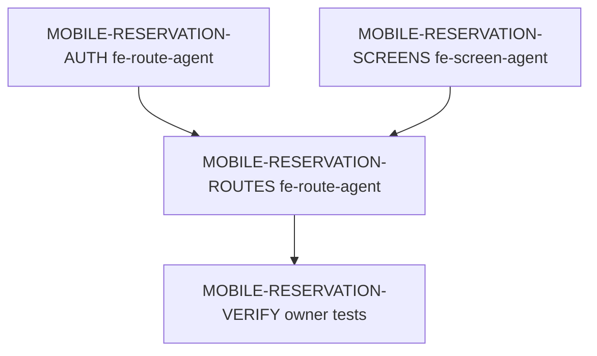

# 모바일 예약 서비스 딜리버리 Spec

> 생성일: 2026-06-01
> 서비스: 모바일 예약
> 식별자: `mobile-reservation`
> 담당 role: `orch-delivery`
> 상태: 기존 mobile route context 기준 문서 보완

## 서비스 목표

모바일 사용자가 지점을 선택하고, 수업 회차를 확인하며, 예약/결제/내 예약/내 정보를 하나의 하단 탭 경험으로 사용할 수 있게 한다.

| 항목 | 내용 |
|------|------|
| 사용자 목표 | 로그인 후 지점 선택, 수업 탐색, 예약/결제, 내 예약 확인, 계정/로그아웃을 모바일에서 완료한다. |
| 운영 목표 | 인증, space scope, 예약 feed, checkout, profile route가 같은 service-level route 목록과 검증 기준을 따른다. |
| 대상 app/domain/platform | `apps/mobile`, reservation/payment/profile/auth, Expo Router |
| 성공 기준 | 핵심 route가 auth/session/space 상태를 공유하고 route-local state와 shared screen 계약이 분리된다. |
| 범위 제외 | admin web 예약 운영 화면, 신규 결제 provider, 신규 push notification |

## 사용자 / 역할 / 권한

| 사용자/역할 | 목적 | 허용 행동 | 제한/금지 | 관련 route/API | 비고 |
|-------------|------|-----------|-----------|----------------|------|
| 모바일 회원 | 예약/결제/내 정보 사용 | login, space 선택, booking feed 조회, 예약/결제, 내 예약 조회, logout | 다른 space 데이터 접근 금지 | `/`, `/reservations`, `/payments/checkout`, `/profile` | native session 필요 |
| IDP/Core API | 인증/예약 데이터 제공 | token 검증, space scoped API | `x-space-id` 누락 보호 resource 허용 금지 | auth/reservation/payment APIs | Orval hook 소비 |

## 도메인 모델 / 생명주기

| 도메인 객체 | 책임 | 주요 필드/값 | 상태/lifecycle | 정책/검증 | 소유 패키지 | 비고 |
|-------------|------|--------------|----------------|-----------|-------------|------|
| Native session | 모바일 인증 | accessToken, refreshToken, sessionId | login → restore/refresh → logout | SecureStore 기반 복원 | `apps/mobile/src/auth` | admin web과 endpoint는 공유하지만 저장소는 분리 |
| Space selection | API scope | spaceId, groundName | select → persist → consume | system space 노출 제한 | mobile auth scope | route header/tab에서 소비 |
| Reservation intent | 예약 진행 | sessionId, programId, pass/payment state | feed → checkout/reserve → my reservations | provider-neutral checkout | reservation domain | 상세 계약은 route spec 참조 |
| Profile summary | 계정 상태 | auth status, current space, quick actions | ready/logout | backend read 없음 | mobile route/store | `/profile` 실행 slice |

## 사용자 여정

| 여정 | 행위자 | 시작점 | 단계 | 완료 조건 | 실패/복구 | 관련 route/API |
|---------|-------|--------|------|-----------|-----------|----------------|
| 앱 시작 | 모바일 회원 | app launch | SecureStore session 복원 → token/space 확인 → route 결정 | 홈 또는 지점 선택 화면 | session 없음 login 이동 | verify-token, my-spaces, current-space |
| 예약 탐색 | 모바일 회원 | `/` | 날짜 선택 → booking feed → 수업 선택 | 예약 CTA 또는 checkout 진입 | empty/오류 상태 표시 | reservation feed APIs |
| 내 예약 확인 | 모바일 회원 | `/reservations` | 내 예약 조회 → 상태 확인 | 목록/empty 표시 | retry | getMyReservations |
| 내 정보/로그아웃 | 모바일 회원 | `/profile` | 계정/space 상태 확인 → logout | `/auth/login` 이동 | logout 실패도 local cleanup | native logout |

## 필수 페이지 / 라우트

| 플랫폼 | route | 페이지/화면 | 목적 | 주요 상태 | 주요 행동 | route spec 경로 | 소스 담당 `agent_type` | 비고 |
|--------|-------|-------------|------|-----------|----------------|-----------------|---------------------------|------|
| mobile | `/` | 예약 홈 | booking feed와 예약 CTA | 로딩/empty/오류/준비 | 예약/대기 | `apps/mobile/src/app/index.spec.md` | `fe-route-agent` | 기존 context spec |
| mobile | `/reservations` | 내 예약 | 내 예약/대기 목록 | 로딩/empty/오류/준비 | 새로고침/상세 이동 | `apps/mobile/src/app/index.spec.md` | `fe-route-agent` | shared screen |
| mobile | `/payments/checkout` | 결제 checkout | 예약 결제 진행 | 로딩/오류/준비/제출 중 | 결제/예약 확정 | `apps/mobile/src/app/payments/index.spec.md` | `fe-route-agent` | 결제 service와 cross reference |
| mobile | `/select-space` | 지점 선택 | 현재 space 확정 | 로딩/오류/empty/준비 | 지점 선택 | `apps/mobile/src/app/index.spec.md` | `fe-route-agent` | auth gate와 연결 |
| mobile | `/profile` | 내 정보 | 계정/space/quick action/logout | 준비/logout pending | 로그아웃 | `apps/mobile/src/app/index.spec.md` | `fe-route-agent` | route-local state |
| mobile | `/auth/login` | native login | first-party 로그인 | 준비/로딩/오류 | 로그인 | `apps/mobile/src/app/index.spec.md` | `fe-route-agent` | IDP native auth |

## 백엔드 / API / 기반 계약

| 영역 | 계약 | 재사용/수정 | 파일/대상 | 담당 `agent_type` | 검증 |
|------|------|-------------|-----------|-------------------|------|
| Auth | native login/restore/refresh/logout | 재사용 | `apps/core/api/src/module/auth`, `apps/mobile/src/auth` | `be-controller-builder`, `fe-route-agent` | mobile auth tests |
| Space | my-spaces/current-space | 재사용 | auth API + mobile scope store | `be-usecase-builder`, `fe-store-agent` | route tests |
| Reservation | booking feed, create reservation, my reservations | 재사용/수정 | reservation backend + Orval | backend roles, `fe-route-agent` | mobile app tests |
| Payment | checkout bootstrap/submit | 재사용/수정 | payment backend + route | backend roles, `fe-route-agent` | checkout tests |
| Mobile UI | shared screens | 재사용/수정 | `packages/fe-mo-ui/src/screen/**` | `fe-screen-agent` | mo-ui tests |

## DESIGN.md 기반 디자인 방향

모바일 예약 서비스는 따뜻한 예약 운영 플랫폼의 daily-use 표면입니다. 첫 화면에서는 사용자가 바로 이해해야 하는 날짜/회차/예약 가능 상태를 먼저 두고, 다음 행동을 카드 가까이에 배치합니다. Admin web보다 여백과 touch target을 더 여유 있게 두며, `ScreenFrame`, `VStack`, `HStack`, `Text`, status/empty/error 패턴을 공유합니다.

## 생성된 라우트 Spec

| route spec | 플랫폼 | route 파일 | 역할 | 생성/갱신 | 상위 service spec | 담당 `agent_type` | 비고 |
|------------|--------|------------|------|-----------|---------------------|-------------------|------|
| `apps/mobile/src/app/index.spec.md` | mobile | multiple mobile routes | 모바일 예약 route context와 profile slice | 갱신 | 이 문서 | `orch-delivery` | 기존 route context를 service 체계에 연결 |
| `apps/mobile/src/app/payments/index.spec.md` | mobile | `/payments/checkout` | checkout 실행 slice | 기존 | 이 문서 | `orch-delivery` | 결제 service 상세와 cross-reference 필요 |

## 에이전트 배정 매트릭스

| step id | phase | 담당 `agent_type` | 입력 파일 | 출력 파일 | 수정 허용 파일 | 의존 step | parallel | 완료 조건 |
|---------|-------|-------------------|-----------|-----------|----------------|-----------|----------|-----------|
| MOBILE-RESERVATION-AUTH | mobile | `fe-route-agent` | 이 문서, route spec | auth wiring | `apps/mobile/src/auth/**` | 승인 | false | session restore/login/logout tests |
| MOBILE-RESERVATION-SCREENS | mobile | `fe-screen-agent` | 이 문서, screen specs | shared screens | `packages/fe-mo-ui/src/screen/**` | 승인 | true | screen unit/story 통과 |
| MOBILE-RESERVATION-ROUTES | mobile | `fe-route-agent` | 이 문서, route specs | route wiring, route tests | `apps/mobile/src/app/**` | auth/screens | false | route tests 통과 |

## 실행 그래프

## 검증 / 승인 기준

| 영역 | 명령/검증 | 기준 |
|------|-----------|------|
| Mobile route unit | `pnpm --filter=mobile-app test` | auth, tabs, home, reservations, profile route tests pass |
| Mobile UI unit | `pnpm --filter=@cocrepo/mo-ui test` | shared screen states pass |
| Type check | `pnpm --filter=mobile-app type-check` | 타입 오류 없음 |
| E2E | `fe-route-agent` 판단/작성 | native device/simulator 준비 시 launch/login/reservation smoke |

## 승인 / 실행 로그

| 일시 | 단계 | 결정/결과 | 작성자 | 비고 |
|------|------|-----------|--------|------|
| 2026-06-01 | 문서 보완 | 기존 mobile route context를 service delivery 체계에 연결 | Codex | 다음 mobile reservation 변경 전 사용자 승인 필요 |
