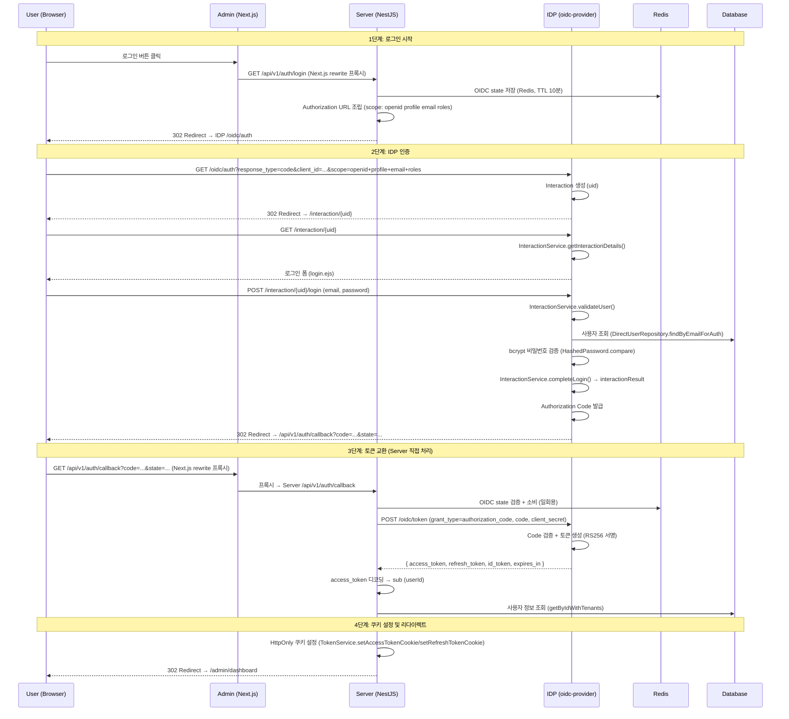
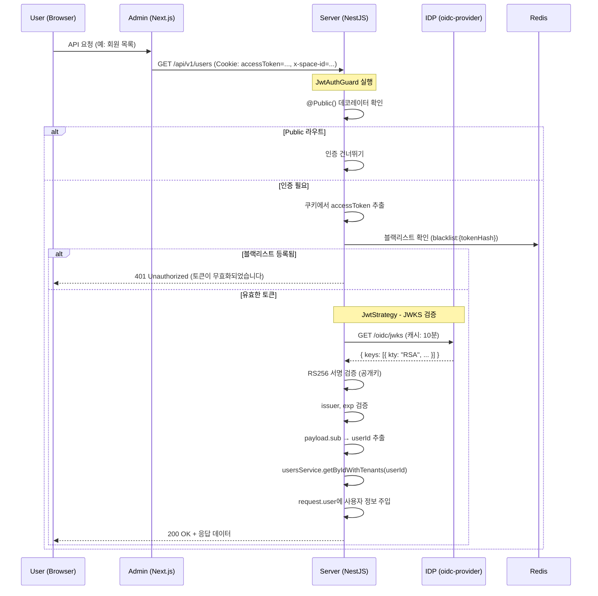
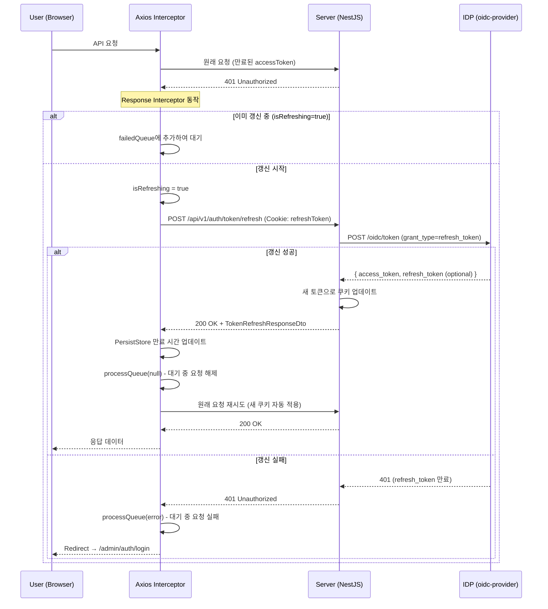
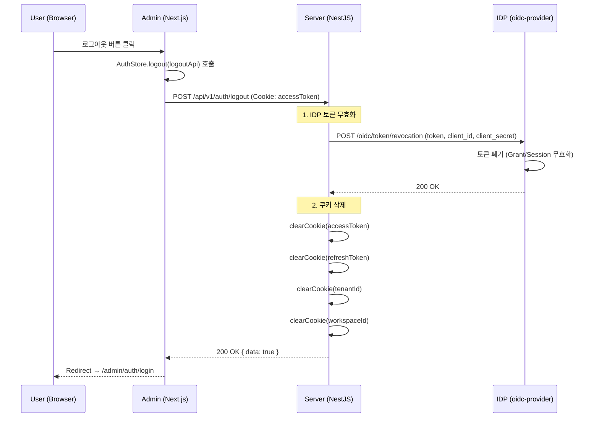
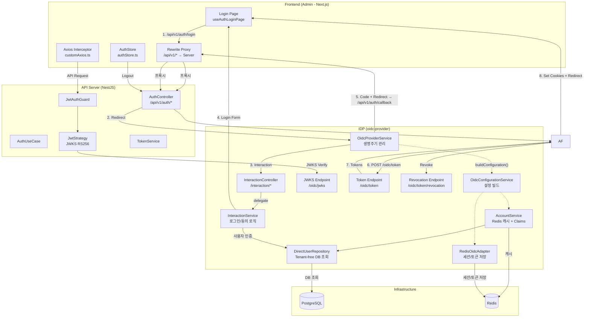

# OIDC 인증 플로우

## 개요

본 프로젝트는 **OpenID Connect (OIDC) Authorization Code Flow**를 사용하여 인증을 처리합니다.

| 구성 요소 | 역할 | 포트 (개발 환경) |
|-----------|------|-----------------|
| **Admin (Next.js)** | 프론트엔드 SPA + API 프록시 (rewrite) | `localhost:3000` |
| **Server (NestJS)** | API 서버, OIDC Relying Party | `localhost:3006` |
| **IDP API (NestJS + oidc-provider)** | OIDC Provider, 토큰 발급/검증 | `localhost:3006` |
| **Redis** | OIDC 세션/토큰 저장, 토큰 블랙리스트, Account 캐시 | `localhost:6379` |

### OIDC 클라이언트 설정

| 클라이언트 | `client_id` | Auth Method | PKCE |
|-----------|-------------|-------------|------|
| Admin Web | `admin-web` | `client_secret_basic` | 선택적 |
| Mobile App | `user-mobile` | `none` (Public) | **필수** |
| Swagger UI | `swagger-web` | `none` (Public) | **필수** |

---

## 1. 로그인 플로우 (Authorization Code Flow)



### 관련 코드

| 단계 | 파일 | 핵심 로직 |
|------|------|----------|
| 로그인 시작 | `apps/admin/src/app/auth/login/hooks/useAuthLoginPage.tsx:28` | `window.location.href = "/api/v1/auth/login"` |
| Authorization URL 생성 | `packages/be-usecase/src/auth/get-auth-login-redirect.usecase.ts` | `GetAuthLoginRedirectUseCase` - scope: `openid profile email roles` |
| State 저장 (Redis) | `packages/be-service/src/auth/token-storage.service.ts:140-143` | `saveOidcState()` - TTL 10분, 일회용 |
| IDP 리다이렉트 | `apps/server/src/module/auth/auth.controller.ts:64-67` | `login()` - Authorization URL로 redirect |
| Interaction 화면 | `apps/idp/src/module/interaction/interaction.controller.ts:58-93` | `getInteraction()` - prompt에 따라 login/consent 분기 |
| 사용자 인증 | `apps/idp/src/module/interaction/interaction.service.ts:67-94` | `validateUser()` - bcrypt 비밀번호 검증 |
| 로그인 완료 | `apps/idp/src/module/interaction/interaction.service.ts:100-116` | `completeLogin()` - interactionResult 호출 |
| 동의 처리 | `apps/idp/src/module/interaction/interaction.service.ts:122-169` | `processConsent()` - Grant 생성/업데이트 |
| Claims 조회 | `apps/idp/src/module/oidc/account.service.ts:48-64` | `findAccount()` - Redis 캐시 활용 |
| Claims 빌드 | `apps/idp/src/module/oidc/account.service.ts:107-140` | `buildFullClaims()` - 전체 claims 빌드 후 캐시 |
| Claims 필터 | `apps/idp/src/module/oidc/account.service.ts:145-173` | `filterClaimsByScope()` - scope별 claims 필터링 |
| Callback 처리 | `apps/server/src/module/auth/auth.controller.ts:78-100` | `handleCallback()` - 에러 처리 + 쿠키 설정 + 리다이렉트 |
| State 검증 + 토큰 교환 | `packages/be-usecase/src/auth/handle-oidc-callback.usecase.ts` | `HandleOidcCallbackUseCase` - state 검증 → code 교환 → 쿠키 설정 |
| IDP 토큰 교환 | `packages/be-gateway/src/oidc.gateway.ts` | `exchangeCodeForTokens()` - IDP token endpoint 호출 |

---

## 2. API 요청 인증 플로우 (JwtAuthGuard + JWKS)



### JWT 토큰 추출 우선순위

`JwtStrategy`는 다음 순서로 Access Token을 추출합니다:

1. **Authorization 헤더**: `Bearer {token}` (Swagger UI, Mobile App)
2. **쿠키**: `req.cookies.accessToken` (Admin Web 기본)

쿠키에서 추출 시 RS256 알고리즘 헤더만 허용합니다 (JWT 헤더의 `alg` 필드를 검증).

### 관련 코드

| 구성 요소 | 파일 | 핵심 로직 |
|-----------|------|----------|
| JwtAuthGuard | `packages/be-common/src/guard/jwt.auth-guard.ts:13-73` | 블랙리스트 확인 + Passport 인증 |
| JwtStrategy | `packages/be-common/src/strategy/jwt.strategy.ts:25-90` | JWKS 기반 RS256 검증, Bearer/쿠키 추출, 사용자 조회 |
| Request 인터셉터 | `packages/fe-api/src/libs/customAxios.ts:31-42` | `x-space-id` 헤더 자동 추가 |

---

## 3. 토큰 자동 갱신 플로우 (401 Interceptor)



### 동시 요청 처리 (Queue 패턴)

여러 API 요청이 동시에 401을 받았을 때 토큰 갱신이 한 번만 실행되도록 Queue 패턴을 사용합니다:

```
요청 A → 401 → 갱신 시작 (isRefreshing=true)
요청 B → 401 → 큐에 대기
요청 C → 401 → 큐에 대기
         ↓
     갱신 완료 → PersistStore 업데이트 → 큐 해제
         ↓
요청 A → 재시도 → 성공
요청 B → 재시도 → 성공
요청 C → 재시도 → 성공
```

### 관련 코드

| 구성 요소 | 파일 | 핵심 로직 |
|-----------|------|----------|
| 401 인터셉터 | `packages/fe-api/src/libs/customAxios.ts:63-124` | 토큰 갱신 + 큐 패턴 + PersistStore 업데이트 |
| Refresh 엔드포인트 | `apps/server/src/module/auth/auth.controller.ts:102-124` | 쿠키에서 refreshToken 추출 |
| IDP 토큰 갱신 | `packages/be-gateway/src/oidc.gateway.ts` | `refreshTokens()` |

---

## 4. 로그아웃 플로우



### 관련 코드

| 구성 요소 | 파일 | 핵심 로직 |
|-----------|------|----------|
| 프론트엔드 로그아웃 | `packages/fe-store/src/stores/authStore.ts:27-42` | `logout(logoutApi?)` - API 호출 후 리다이렉트 |
| 로그아웃 컨트롤러 | `apps/server/src/module/auth/auth.controller.ts:163-184` | 쿠키에서 accessToken 추출 |
| IDP 토큰 폐기 | `packages/be-gateway/src/oidc.gateway.ts` | `revokeToken()` - revocation endpoint 호출 |
| 쿠키 삭제 | `packages/be-usecase/src/auth/logout-with-cookie.usecase.ts` | `LogoutWithCookieUseCase` |
| 토큰 쿠키 관리 | `packages/be-service/src/auth/token.service.ts:64-75` | `clearTokenCookies()` |

---

## 5. 보안 특성

| 항목 | 설정 | 설명 |
|------|------|------|
| **서명 알고리즘** | RS256 (RSA + SHA-256) | 비대칭 키 - IDP만 서명, Server는 공개키로 검증 |
| **토큰 형식** | JWT (Resource Indicators) | `resourceIndicators` 기능으로 JWT Access Token 강제 발급 |
| **토큰 검증** | JWKS Endpoint | `{issuer}/oidc/jwks` 에서 공개키 조회 (캐시 10분) |
| **쿠키 보안** | HttpOnly, Secure, SameSite=Lax | XSS 방어, CSRF 완화 |
| **토큰 저장** | HttpOnly Cookie | JavaScript 접근 불가 |
| **블랙리스트** | Redis (SHA-256 해시, 앞 32자) | 로그아웃/무효화된 토큰 차단 |
| **PKCE** | Public Client 필수 | Mobile App, Swagger 등 client_secret 없는 클라이언트 보호 |
| **State 파라미터** | crypto.randomBytes(32) + Redis 일회용 | CSRF 방어, 검증 후 즉시 소비 |
| **Issuer 검증** | JwtStrategy | 토큰의 issuer가 설정된 IDP와 일치하는지 확인 |
| **JWKS Rate Limit** | 10 requests/min | IDP 과부하 방지 |
| **토큰 폐기** | IDP Revocation Endpoint | RFC 7009 - 로그아웃 시 토큰 즉시 무효화 |
| **RP-Initiated Logout** | rpInitiatedLogout 활성화 | End Session 엔드포인트 (`/oidc/session/end`) |
| **Account 캐시** | Redis (TTL 5분) | AccountService에서 반복 DB 조회 방지 |
| **RS256 전용 쿠키** | JwtStrategy 헤더 검증 | 쿠키에서 추출한 토큰의 `alg` 헤더가 RS256인지 확인 |

---

## 6. 토큰 TTL 정리

IDP에서 설정하는 토큰 수명 (`apps/idp/src/module/oidc/oidc-configuration.service.ts:122-132`):

| 토큰 유형 | TTL | 설명 |
|-----------|-----|------|
| **AccessToken** | 1시간 (3600s) | API 인증용, 짧은 수명 |
| **RefreshToken** | 30일 (2,592,000s) | Access Token 갱신용 |
| **AuthorizationCode** | 10분 (600s) | Code → Token 교환 제한 시간 |
| **IdToken** | 1시간 (3600s) | 사용자 identity 정보 |
| **Session** | 14일 (1,209,600s) | IDP 세션 유지 |
| **Grant** | 14일 (1,209,600s) | 사용자 동의(grant) 유지 |
| **Interaction** | 1시간 (3600s) | 로그인/동의 화면 유효 시간 |
| **DeviceCode** | 10분 (600s) | Device Authorization Flow |
| **ClientCredentials** | 1시간 (3600s) | M2M 인증용 |

### 쿠키 만료 시간

Server의 `TokenService`에서 설정 (`packages/be-service/src/auth/token.service.ts:34-45`):

쿠키 만료 시간은 `auth` 설정의 `expires`/`refresh` 값에 따라 `Cookie.forToken()` (Value Object)으로 생성됩니다.

| 쿠키 | 설정 키 | 비고 |
|-------|---------|------|
| `accessToken` | `auth.expires` | IDP AccessToken TTL과 동기화 |
| `refreshToken` | `auth.refresh` | IDP RefreshToken TTL과 동기화 |

---

## 7. OIDC Claims 매핑

IDP의 `AccountService`가 scope에 따라 반환하는 claims.
전체 claims를 빌드 후 Redis에 캐시(5분)하고, 요청된 scope에 따라 필터링하여 반환합니다.

### Claims 정의 (`OidcConfigurationService`)

`apps/idp/src/module/oidc/oidc-configuration.service.ts:77-83`:

```typescript
claims: {
    openid: ["sub"],
    profile: ["name", "updated_at"],
    email: ["email", "email_verified"],
    phone: ["phone_number", "phone_number_verified"],
    roles: ["roles", "spaces"],
},
```

### Scope별 Claims 매핑 (`AccountService`)

| Scope | Claims | 데이터 소스 |
|-------|--------|------------|
| `openid` | `sub` | `user.id` |
| `profile` | `name`, `updated_at` | `user.name`, `user.updatedAt` |
| `email` | `email`, `email_verified` | `user.email`, `true` (항상) |
| `phone` | `phone_number`, `phone_number_verified` | `user.phone`, `true` (항상) |
| `roles` | `roles[]`, `spaces[]` | `user.tenants` (spaceId, roleId, roleName 등) |

### `roles` scope 응답 구조

```json
{
  "roles": [
    {
      "spaceId": "space-uuid",
      "roleId": "role-uuid",
      "roleName": "SUPER_ADMIN",
      "roleDisplayName": "슈퍼 관리자",
      "isSystemRole": true
    }
  ],
  "spaces": [
    {
      "spaceId": "space-uuid",
      "groundName": "System Ground"
    }
  ]
}
```

### Claims 흐름

```
findAccount(id) → account.claims(scope)
    ↓
getClaims(userId, scope)
    ↓
Redis 캐시 확인 (oidc:account:{userId})
    ├─ 캐시 히트 → filterClaimsByScope(cached, scope)
    └─ 캐시 미스 → DB 조회 (DirectUserRepository) → buildFullClaims() → Redis 저장 (5분) → filterClaimsByScope()
```

---

## 8. 아키텍처 전체 구조도



---

## 9. IDP 모듈 구조

IDP의 OIDC 모듈은 책임별로 분리되어 있습니다:

```
apps/idp/src/module/
├── oidc/
│   ├── types/
│   │   ├── index.ts                       # 타입 re-export
│   │   └── oidc-provider.types.ts         # oidc-provider 라이브러리 타입 정의
│   ├── oidc-provider.service.ts           # Provider 생명주기 관리 (초기화, 이벤트)
│   ├── oidc-configuration.service.ts      # 설정 빌드 (clients, claims, TTL, PKCE, renderError)
│   ├── account.service.ts                 # 사용자 계정 조회 + Redis 캐시 + Claims 빌드
│   ├── direct-user.repository.ts          # IDP 전용 사용자 DB 조회 (Tenant-free)
│   ├── oidc.adapter.ts                    # Redis 기반 OIDC Adapter (세션/토큰/Grant 저장)
│   ├── oidc-client.repository.ts          # OIDC 클라이언트 DB 조회
│   ├── oidc.controller.ts                 # oidc-provider 미들웨어 라우팅
│   └── oidc.module.ts                     # 모듈 정의
└── interaction/
    ├── interaction.controller.ts           # HTTP 라우팅 + 뷰 렌더링
    └── interaction.service.ts             # 로그인/동의/취소 비즈니스 로직
```

| 서비스 | 역할 |
|--------|------|
| `OidcProviderService` | oidc-provider 인스턴스 생명주기 관리 (초기화, 이벤트 핸들러) |
| `OidcConfigurationService` | oidc-provider 설정 빌드 (클라이언트, claims, features, TTL, PKCE, JWKS, resourceIndicators) |
| `AccountService` | `findAccount()` 구현, Redis 캐시(5분) 활용, scope별 claims 필터링 |
| `DirectUserRepository` | IDP 전용 사용자 조회 (Global PrismaClient 직접 사용, Tenant 컨텍스트 없이 동작) |
| `OidcClientRepository` | OIDC 클라이언트 DB 조회 (Global PrismaClient 직접 사용) |
| `RedisOidcAdapter` | oidc-provider 데이터 저장소 (Redis), 보조 인덱스(uid, grantId, userCode) 관리 |
| `InteractionService` | 로그인 검증, Grant 생성, Interaction 결과 처리 (Controller에서 분리) |

---

## 10. 관련 파일 경로 참조

### IDP (Identity Provider)

| 파일 | 역할 |
|------|------|
| `apps/idp/src/config/oidc.config.ts` | OIDC Provider 설정 (issuer, cookie, JWKS) |
| `apps/idp/src/module/oidc/oidc-provider.service.ts` | OIDC Provider 생명주기 관리 (초기화, 이벤트) |
| `apps/idp/src/module/oidc/oidc-configuration.service.ts` | OIDC Provider 설정 빌드 (clients, claims, TTL, PKCE, resourceIndicators) |
| `apps/idp/src/module/oidc/account.service.ts` | 사용자 계정 조회 + Redis 캐시 + Claims 매핑 |
| `apps/idp/src/module/oidc/direct-user.repository.ts` | IDP 전용 사용자 DB 조회 (Tenant-free, Global PrismaClient) |
| `apps/idp/src/module/oidc/oidc.adapter.ts` | Redis 기반 OIDC Adapter (세션/토큰/Grant 저장) |
| `apps/idp/src/module/oidc/oidc-client.repository.ts` | OIDC 클라이언트 DB 조회 |
| `apps/idp/src/module/oidc/oidc.controller.ts` | oidc-provider 미들웨어 라우팅 (모든 /oidc/* 엔드포인트 위임) |
| `apps/idp/src/module/oidc/types/oidc-provider.types.ts` | oidc-provider 타입 정의 |
| `apps/idp/src/module/interaction/interaction.controller.ts` | Interaction HTTP 라우팅 + 뷰 렌더링 |
| `apps/idp/src/module/interaction/interaction.service.ts` | 로그인/동의/취소 비즈니스 로직 |
| `apps/idp/src/views/login.ejs` | 로그인 폼 템플릿 |
| `apps/idp/src/views/consent.ejs` | 동의 화면 템플릿 |
| `apps/idp/src/views/error.ejs` | 에러 페이지 템플릿 |

### Server (API)

| 파일 | 역할 |
|------|------|
| `apps/server/src/config/oidc.config.ts` | Server측 OIDC 설정 (issuer, jwksUri, clientId/Secret, redirectUri) |
| `apps/server/src/module/auth/auth.controller.ts` | 인증 엔드포인트 (login, callback, refresh, sign-up, verify-token, logout) |

### 공용 패키지

| 파일 | 역할 |
|------|------|
| `packages/be-usecase/src/auth/*.usecase.ts` | OIDC 인증 유즈케이스 로직 (회원가입, 세션, 쿠키, 내부 조합) |
| `packages/be-service/src/auth/token.service.ts` | 토큰 쿠키 관리 (설정/삭제), Cookie VO 활용 |
| `packages/be-service/src/auth/token-storage.service.ts` | Redis 기반 토큰 블랙리스트, OIDC State 관리 |
| `packages/be-common/src/strategy/jwt.strategy.ts` | JWKS 기반 JWT 검증 전략 (Bearer → 쿠키 순서) |
| `packages/be-common/src/guard/jwt.auth-guard.ts` | 인증 Guard (블랙리스트 + JWT 검증) |

### Frontend (Admin)

| 파일 | 역할 |
|------|------|
| `apps/admin/src/app/auth/login/hooks/useAuthLoginPage.tsx` | 로그인 페이지 훅 (OIDC 리다이렉트) |
| `apps/admin/next.config.ts` | API 프록시 설정 (rewrite: `/api/v1/*` → Server) |
| `packages/fe-api/src/libs/customAxios.ts` | Axios 인터셉터 (401 토큰 갱신, x-space-id 헤더, PersistStore 업데이트) |
| `packages/fe-store/src/stores/authStore.ts` | 인증 상태 관리 Store (로그아웃 처리) |
