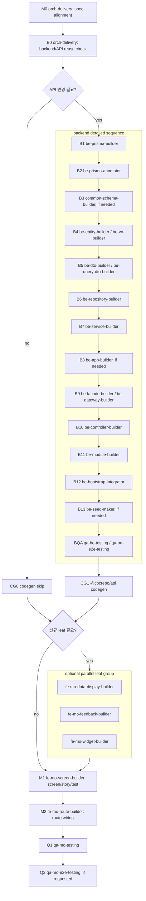

# MyReservationsScreen 계약서

## 대상

- `packages/fe-mo-ui/src/screen/MyReservationsScreen/MyReservationsScreen.tsx`
- `packages/fe-mo-ui/src/screen/MyReservationsScreen/MyReservationsScreen.stories.tsx`
- `packages/fe-mo-ui/src/screen/MyReservationsScreen/MyReservationsScreen.test.tsx`

## 목적

모바일 `/reservations` 탭의 내 예약/대기 목록 visual composition을 소유한다. route file은 `getMyReservations` API 연동과 `ReservationDto -> MyReservationCardItem` mapping만 담당한다.

## Props 계약

| Prop | 타입 | 책임 |
| --- | --- | --- |
| `items` | `readonly MyReservationCardItem[]` | screen 전용 표시 모델. route가 `ReservationDto`에서 변환한다. |
| `status` | `loading` / `error` / `empty` / `ready` | 목록 상태. route가 API 상태와 빈 목록을 판정한다. |
| `errorDescription` | `ReactNode` | error 상태에서 노출할 사용자 메시지. |
| `onPressRetry` | `() => void` | error/empty 상태의 재조회 이벤트. route가 React Query `refetch`를 연결한다. |

## 화면 러프

### Visual Snapshot

component명 없이 사용자가 보게 될 밀도와 분위기만 그린다.

```text
┌────────────────────────────────────┐
│ 내 예약                              │
│ 예약 확정과 대기 상태를 실제 기준으로 확인 │
│                                    │
│  5월 9일                 예약 확정  │
│  Morning Reformer                  │
│  09:30 · Studio A · Coach Hana     │
│  상체 강도는 낮춰 주세요.              │
│                                    │
│  5월 16일                  대기 2번 │
│  Weekend Barre                     │
│  11:00 · Studio B · Coach Jin      │
└────────────────────────────────────┘

loading
┌────────────────────────────────────┐
│ 내 예약을 불러오는 중                  │
│ 예약과 대기 목록을 확인하고 있습니다.     │
└────────────────────────────────────┘

empty/error
┌────────────────────────────────────┐
│ 아직 예약이 없습니다                    │
│ 홈에서 수업을 선택하면 이곳에 표시됩니다.  │
│ [목록 새로고침]                       │
└────────────────────────────────────┘
```

### Annotated Wireframe

component와 계층을 표시해 개발자가 바로 구현 경계를 읽을 수 있게 한다.

```text
Route Layout
┌────────────────────────────────────┐
│ CustomHeader: 상단 safe-area/header │  A
└────────────────────────────────────┘

Screen Owner
┌────────────────────────────────────┐
│ ScreenFrame(edges: right,left)      │  B
│ ┌────────────────────────────────┐ │
│ │ Header copy                    │ │  C
│ │ "내 예약" + 설명                  │ │
│ └────────────────────────────────┘ │
│ ┌────────────────────────────────┐ │
│ │ Reservation card block         │ │  D
│ │ Icon(calendarCheck) + date      │ │
│ │ Icon(badgeCheck) + status badge │ │
│ │ title / meta / memo             │ │
│ └────────────────────────────────┘ │
│ StatusFeedback                     │  E: loading/empty/error
└────────────────────────────────────┘
```

## 렌더링 계약

- Expo Router의 `CustomHeader`가 상단 safe-area와 header를 소유하고, screen은 본문 safe-area shell만 적용한다.
- `ScreenFrame`으로 본문 safe-area shell을 적용한다.
- 시각 스타일은 `StyleSheet`가 아니라 uniwind `className`과 `tailwind-variants` slot/variant로 정의한다.
- render tree는 JSX로 작성하고 `createElement` 기반 visual composition을 사용하지 않는다.
- 상태별 feedback과 예약 카드 반복 JSX는 별도 `render*` helper나 재사용 목적 없는 조각 컴포넌트로 분리하지 않고 `MyReservationsScreen` 본문 안에서 직접 조합한다.
- `MyReservationsScreen.tsx`는 하나의 owner component만 가진다. 예약 카드가 재사용 component로 승격되면 별도 파일로 분리하고 `fe-mo-widget-builder`가 story/test까지 함께 소유한다.
- 색상은 heroui-native semantic token(`background`, `surface`, `foreground`, `muted`, `accent`, `border`)을 사용한다.
- 내 예약 목록은 Linear/Stripe 계열의 dense premium 톤을 따른다. 본문은 muted neutral 배경 위에 shadow 없는 subtle border 카드, 8pt 리듬(`px-4`, `gap-4`, `gap-2`, `p-4`)과 `rounded-lg` 중심으로 표현한다.
- 아이콘은 예약일(`calendarCheck`)과 예약 상태 badge(`badgeCheck`)처럼 목록 scan 속도를 높이는 semantic cue로만 사용한다.
- ready 상태에서는 예약일, 상태, 제목, 메타, memo를 카드로 표시한다.
- loading/empty/error 상태는 `StatusFeedback`으로 표시한다.
- API hook, router, route params, app alias, backend DTO를 직접 import하지 않는다.

## Required Elements

| 분류 | 필요한 요소 | 재사용/신규 | 소스/대상 | 담당 `agent_type` | 비고 |
| --- | --- | --- | --- | --- | --- |
| Mobile Screen | `MyReservationsScreen` | modify | `packages/fe-mo-ui/src/screen/MyReservationsScreen/MyReservationsScreen.tsx` | `fe-mo-screen-builder` | visual owner. API/route import 금지. |
| Mobile Route | `/reservations` route wiring | reuse | `apps/mobile/src/app/(tabs)/reservations.tsx` | `fe-mo-route-builder` | Orval hook, DTO mapping, retry 연결만 소유. |
| API Client | `useGetMyReservations` | reuse | `packages/fe-api/src/core/reservations/reservations.ts` | `none` | API 변경이 없으면 codegen 생략. |
| Backend API | `GET /api/v1/reservations/me` | reuse | `apps/core/api/src/module/reservations/reservations.controller.ts` | `none` | 현재 화면 변경은 backend 수정 없음. |
| Storybook | screen 상태 story | modify | `MyReservationsScreen.stories.tsx` | `fe-mo-screen-builder` | 다음 source 변경 시 loading/error/long text variant까지 보강. |
| Unit Test | screen 상태/이벤트 테스트 | modify | `MyReservationsScreen.test.tsx` | `fe-mo-screen-builder` | qa role은 검증과 보강 요청을 담당. |
| E2E Test | 하단 탭 `/reservations` smoke | new, if requested | `apps/mobile/e2e/reservations.e2e.ts` | `qa-mo-e2e-testing` | 현재 Detox 스크립트는 있으나 예약 탭 전용 E2E 파일은 없음. flow 변경 시 생성한다. |

## Component Inventory

| 영역 | 컴포넌트 | 계층 | 재사용/신규 | 소스/대상 | Props/이벤트 | 소스 담당 `agent_type` | 소비/Wiring `agent_type` |
| --- | --- | --- | --- | --- | --- | --- | --- |
| A. 상단 헤더 | `CustomHeader` | Route Layout | reuse | `apps/mobile/src/app/(tabs)/_layout.tsx` | route title, safe-area top | `fe-mo-route-layout-builder` | `fe-mo-route-builder` |
| B. 본문 shell | `ScreenFrame` | Layout primitive | reuse | `packages/fe-mo-ui/src/layout/ScreenFrame/index.tsx` | `edges`, `className`, `contentClassName` | `fe-mo-data-display-builder` | `fe-mo-screen-builder` |
| C. 화면 제목 | screen-local header copy | Screen block | modify | `MyReservationsScreen.tsx` | title, description | `fe-mo-screen-builder` | `fe-mo-screen-builder` |
| D. 예약 카드 반복 | screen-local card block | Screen block | modify | `MyReservationsScreen.tsx` | `MyReservationCardItem` fields | `fe-mo-screen-builder` | `fe-mo-screen-builder` |
| D-1. 날짜/상태 cue | `Icon` | Data display | reuse | `packages/fe-mo-ui/src/icon` | `calendarCheck`, `badgeCheck`, tone | `fe-mo-data-display-builder` | `fe-mo-screen-builder` |
| E. 상태 feedback | `StatusFeedback` | Feedback | reuse | `packages/fe-mo-ui/src/feedback/StatusFeedback/index.tsx` | `status`, title, description, primary action | `fe-mo-feedback-builder` | `fe-mo-screen-builder` |
| Route mapping | `toMyReservationCardItem` | Route-local adapter | reuse | `apps/mobile/src/app/(tabs)/reservations.tsx` | `ReservationDto -> MyReservationCardItem` | `fe-mo-route-builder` | `fe-mo-screen-builder` |

## Storybook / Test Contract

### Storybook

| 대상 | Story 파일 | 필수 상태/Variant | Fixture/데이터 | 작성 담당 `agent_type` | 검증 담당 `agent_type` | 비고 |
| --- | --- | --- | --- | --- | --- | --- |
| `MyReservationsScreen` | `MyReservationsScreen.stories.tsx` | ready, loading, empty, error, long text | 예약 확정, 대기, memo 있음/없음, 긴 지점/수업명 | `fe-mo-screen-builder` | `qa-mo-testing` | 현재 ready/empty가 있으며, 다음 source 변경 시 나머지 variant를 함께 추가한다. |

### Unit Test

| 대상 | Test 파일 | 검증 관점 | 주요 케이스 | 작성 담당 `agent_type` | 검증 담당 `agent_type` | 비고 |
| --- | --- | --- | --- | --- | --- | --- |
| `MyReservationsScreen` | `MyReservationsScreen.test.tsx` | 상태 분기, 카드 필드, retry 위임 | ready card, loading, empty retry, error retry, optional memo/meta | `fe-mo-screen-builder` | `qa-mo-testing` | 현재 ready/empty/error retry가 있으며, loading과 optional field 회귀를 보강한다. |
| `/reservations` route | `apps/mobile/src/route-tests/reservations.test.tsx` | API hook wiring, DTO mapping | `useGetMyReservations`, empty/error, dummy data 금지 | `fe-mo-route-builder` | `qa-mo-testing` | route 변경 시 같이 갱신한다. |

### E2E Test

| 대상 Flow | E2E 파일 | 사용자 흐름 | Setup/데이터 | 주요 assertion | 작성 담당 `agent_type` | 검증 담당 `agent_type` | 비고 |
| --- | --- | --- | --- | --- | --- | --- | --- |
| `/reservations` 하단 탭 smoke | `apps/mobile/e2e/reservations.e2e.ts` | 로그인/공간 선택 완료 상태에서 예약 탭 진입 | 인증 fixture, 선택된 space, `GET /api/v1/reservations/me` 응답 | 하단 탭 전환, "내 예약" 제목, 예약 카드 또는 empty 상태, error 없이 표시 | `qa-mo-e2e-testing` | `qa-mo-e2e-testing` | 현재 전용 Detox E2E 파일은 없으므로 flow/route 변경이 발생하거나 E2E 요청 시 생성한다. |
| 예약 생성 후 목록 이동 | `apps/mobile/e2e/reservation-checkout-to-list.e2e.ts` | 홈/결제에서 예약 성공 후 `/reservations`로 이동 | 예약 가능 회차, 결제/수강권 fixture | 완료 후 목록 화면 진입, 새 예약 항목 노출 | `qa-mo-e2e-testing` | `qa-mo-e2e-testing` | checkout flow를 수정할 때만 필요하다. |

## Backend / API Contract

이 화면은 기존 예약 API를 소비한다. 아래 표에서 `reuse`는 변경 금지라기보다 "현재 delivery에서는 수정하지 않음"을 뜻한다. API 응답 필드가 바뀌면 같은 행의 담당 `agent_type`으로 re-entry한다.

### Prisma / Database

| 필요 | 모델/Enum/마이그레이션 | Prisma 파일 | DB/인덱스 영향 | 재사용/신규 | 소스/대상 | 소스 담당 `agent_type` | 소비 `agent_type` |
| --- | --- | --- | --- | --- | --- | --- | --- |
| no | `Reservation`, `ReservationStatus` | `packages/be-prisma/schema/scheduling/reservation.prisma` | 없음 | reuse | 기존 예약 모델 | `be-prisma-builder` | `be-repository-builder` |

### Prisma Annotation

| 필요 | 대상 모델/필드 | 주석/표시명 | 재사용/신규 | 소스/대상 | 소스 담당 `agent_type` | 소비 `agent_type` |
| --- | --- | --- | --- | --- | --- | --- |
| no | `Reservation` | 기존 표시명 유지 | reuse | Prisma schema 주석 | `be-prisma-annotator` | `be-prisma-builder` |

### Common Schema

| 필요 | Schema/검증 계약 | Validation 메시지/i18n | 재사용/신규 | 소스/대상 | 의존 요소 | 소스 담당 `agent_type` | 소비 `agent_type` |
| --- | --- | --- | --- | --- | --- | --- | --- |
| no | 목록 조회 화면이라 form 검증 없음 | 없음 | none | none | none | `common-schema-builder` | `none` |

### Entity / VO

| 도메인 객체 | 구조 | 책임 | 재사용/신규 | 소스/대상 | 의존 요소 | 소스 담당 `agent_type` | 소비 `agent_type` |
| --- | --- | --- | --- | --- | --- | --- | --- |
| `Reservation` | Entity | 예약 상태, 발생 시각, 관계 필드 표현 | reuse | `packages/be-entity/src/reservation.entity.ts` | Prisma `Reservation` | `be-entity-builder` | `be-service-builder` |
| none | VO | 화면 전용 VO 없음 | none | none | none | `be-vo-builder` | `none` |

### DTO / Query DTO

| API/유즈케이스 | DTO/Query DTO | 요청/응답/쿼리 | 재사용/신규 | 소스/대상 | Schema/Entity 의존 | 소스 담당 `agent_type` | 소비 `agent_type` |
| --- | --- | --- | --- | --- | --- | --- | --- |
| 내 예약 목록 | `ReservationDto` | 응답 item | reuse | `packages/be-dto/src/reservations/reservation.dto.ts` | `Reservation` | `be-dto-builder` | `be-controller-builder` |
| 내 예약 목록 | `QueryMyReservationsDto` | `skip`, `take`, optional filter | reuse | `packages/be-dto/src/reservations` | `ReservationStatus` | `be-query-dto-builder` | `be-controller-builder` |

### Repository

| 영속성 필요 | Repository | 모델/Aggregate | 메서드 | 재사용/신규 | 소스/대상 | 소스 담당 `agent_type` | 소비 `agent_type` |
| --- | --- | --- | --- | --- | --- | --- | --- |
| yes | `ReservationsRepository` | `Reservation` | `findMine` | reuse | `packages/be-repository/src/reservations.repository.ts` | `be-repository-builder` | `be-service-builder` |

### Service

| 도메인 기능 | Service | 메서드 | 재사용/신규 | 소스/대상 | 의존 요소 | 소스 담당 `agent_type` | 소비 `agent_type` |
| --- | --- | --- | --- | --- | --- | --- | --- |
| 내 예약 목록 | `ReservationService` | `getMine` | reuse | `packages/be-service/src/reservation.service.ts` | `ReservationsRepository.findMine` | `be-service-builder` | `be-facade-builder` |

### ApplicationService

| 유즈케이스/워크플로 | ApplicationService | 메서드 | 재사용/신규 | 소스/대상 | 의존 요소 | 소스 담당 `agent_type` | 소비 `agent_type` |
| --- | --- | --- | --- | --- | --- | --- | --- |
| none | none | none | none | none | Controller가 Facade를 직접 호출 | `be-app-builder` | `none` |

### Facade / Gateway

| 경계/외부 연동 | 구조 | 클래스/메서드 | 재사용/신규 | 소스/대상 | 의존 요소 | 소스 담당 `agent_type` | 소비 `agent_type` |
| --- | --- | --- | --- | --- | --- | --- | --- |
| Controller boundary | Facade | `ReservationFacade.getMine` | reuse | `packages/be-facade/src/reservation.facade.ts` | `ReservationService`, `AuthContext`, `SpaceContext` | `be-facade-builder` | `be-controller-builder` |
| External system | Gateway | none | none | none | 외부 결제/저장소 연동 없음 | `be-gateway-builder` | `none` |

### Endpoint

| 필요 | Method/Path | operationId | Controller | DTO/Schema | 재사용/신규 | 소스/대상 | 소스 담당 `agent_type` | 소비/Wiring `agent_type` | codegen |
| --- | --- | --- | --- | --- | --- | --- | --- | --- | --- |
| yes | `GET /api/v1/reservations/me` | `getMyReservations` | `ReservationsController.getMine` | `QueryMyReservationsDto`, `ReservationDto[]` | reuse | `apps/core/api/src/module/reservations/reservations.controller.ts` | `be-controller-builder` | `fe-mo-route-builder` | skip unless endpoint changes |

### Module / Bootstrap

| 필요 | Module/Provider | Router/Wiring | 재사용/신규 | 소스/대상 | 의존 요소 | 소스 담당 `agent_type` | 소비 `agent_type` |
| --- | --- | --- | --- | --- | --- | --- | --- |
| yes | `ReservationsModule` | controller/provider 등록 | reuse | `apps/core/api/src/module/reservations/reservations.module.ts` | `ReservationFacade`, `ReservationService`, repositories | `be-module-builder` | `be-bootstrap-integrator` |

### Seed

| 필요 | Seed 데이터 | 목적 | 재사용/신규 | 소스/대상 | 의존 요소 | 소스 담당 `agent_type` | 검증 `agent_type` |
| --- | --- | --- | --- | --- | --- | --- | --- |
| no | none | 화면은 API 응답 fixture로 테스트 | none | none | none | `be-seed-maker` | `qa-be-testing` |

### Codegen / API Client

| 필요 | Trigger | 생성 대상 | 영향 Hook/Client | 실행 명령 | 소비 `agent_type` | 검증 `agent_type` |
| --- | --- | --- | --- | --- | --- | --- |
| no | endpoint 변경 없음 | 기존 Orval output | `useGetMyReservations` | skip | `fe-mo-route-builder` | `qa-mo-testing` |
| yes, API 변경 시 | Swagger contract 변경 | `packages/fe-api/src/core/**` | `getMyReservations`, `useGetMyReservations`, model types | `pnpm --filter=@cocrepo/api codegen` | `fe-mo-route-builder` | `qa-type-checker` |

## Agent Assignment Matrix

| step id | phase | 담당 `agent_type` | 입력 파일 | 출력 파일 | 수정 허용 파일 | 의존 step | 병렬 가능 | 완료 조건 |
| --- | --- | --- | --- | --- | --- | --- | --- | --- |
| M0 | spec alignment | `orch-delivery` | 기존 screen/spec/route/API 계약 | `MyReservationsScreen.spec.md` | `MyReservationsScreen.spec.md` | none | no | 화면 러프, component/API 표, 실행 그래프 갱신 |
| B0 | backend reuse check | `orch-delivery` | controller/facade/service/repository/DTO | none | none | M0 | no | backend 변경 없음 또는 re-entry 필요 항목 식별 |
| B1 | Prisma model, if needed | `be-prisma-builder` | Backend / API Contract의 Prisma / Database 표 | Prisma schema/model/enum | `packages/be-prisma/schema/**` | B0 | no | 모델/Enum/마이그레이션 영향 확정 |
| B2 | Prisma annotation, if needed | `be-prisma-annotator` | B1 output | Prisma display comment | `packages/be-prisma/schema/**` | B1 | no | 한글 표시명/주석 반영 |
| B3 | Common schema, if needed | `common-schema-builder` | API/form validation 요구 | shared schema/message | `packages/common-schema/**` | B1 | no | FE/BE 공용 검증 계약 확정 |
| B4 | Entity / VO, if needed | `be-entity-builder` / `be-vo-builder` | B1 output, domain contract | entity/vo source | `packages/be-entity/**`, `packages/be-vo/**` | B1 | no | 도메인 객체와 값 객체 확정 |
| B5 | DTO / Query DTO, if needed | `be-dto-builder` / `be-query-dto-builder` | B3/B4 output, endpoint 요구 | DTO/query DTO | `packages/be-dto/**` | B3, B4 | no | Swagger 요청/응답 타입 확정 |
| B6 | Repository, if needed | `be-repository-builder` | B1/B4 output | repository source | `packages/be-repository/**` | B1, B4 | no | Prisma query와 aggregate 조회/저장 계약 확정 |
| B7 | Service, if needed | `be-service-builder` | B5/B6 output | service source | `packages/be-service/**` | B5, B6 | no | 도메인 로직과 repository 호출 확정 |
| B8 | ApplicationService, if needed | `be-app-builder` | B7 output, workflow 요구 | application service | `packages/be-app/**` | B7 | no | controller workflow 유즈케이스 확정 |
| B9 | Facade / Gateway, if needed | `be-facade-builder` / `be-gateway-builder` | B7/B8 output, boundary 요구 | facade/gateway source | `packages/be-facade/**`, `packages/be-gateway/**` | B7, B8 | no | 응답 조립, protocol boundary, 외부 연동 경계 확정 |
| B10 | Controller, if needed | `be-controller-builder` | B5/B9 output | controller source | `apps/core/api/src/module/reservations/**` | B5, B9 | no | endpoint, Swagger, response contract 확정 |
| B11 | Module, if needed | `be-module-builder` | B6-B10 output | Nest module | `apps/core/api/src/module/reservations/**` | B10 | no | provider/controller 등록 확정 |
| B12 | Bootstrap, if needed | `be-bootstrap-integrator` | B11 output | app module/router wiring | app bootstrap/module 파일 | B11 | no | 앱 부트스트랩 연결 확정 |
| B13 | Seed, if needed | `be-seed-maker` | B1-B12 output | seed data | seed 파일 | B12 | no | 수동/테스트 데이터 준비 |
| BQA | backend QA, if backend changed | `qa-be-testing` / `qa-be-e2e-testing` | B1-B13 output | test patch or finding | backend test 파일 | B10-B13 | no | backend unit/E2E 통과 또는 finding 보고 |
| CG1 | codegen, if API changed | `fe-mo-route-builder` | Swagger output | Orval client/model | `packages/fe-api/src/core/**` | BQA | no | `useGetMyReservations` 타입 갱신 |
| L1 | optional reusable leaf | `fe-mo-data-display-builder` / `fe-mo-feedback-builder` / `fe-mo-widget-builder` | Component Inventory | primitive/widget source/story/test | 해당 component 폴더 | M0 | yes, 파일 겹침 없을 때만 | 신규 component는 one component per file + story/test |
| M1 | screen implementation | `fe-mo-screen-builder` | 이 spec, leaf component, route display model | screen/story/test | `packages/fe-mo-ui/src/screen/MyReservationsScreen/**` | M0, L1 | no | ready/loading/empty/error UI와 story/test 동기화 |
| M2 | route wiring | `fe-mo-route-builder` | route spec, Orval hook, screen props | route/test | `apps/mobile/src/app/(tabs)/reservations.tsx`, route tests | M1, CG1 if used | no | API 상태와 `MyReservationCardItem` mapping 일치 |
| Q1 | mobile unit QA | `qa-mo-testing` | screen/route/test | test patch or finding | 관련 test 파일 | M1, M2 | no | screen + route unit test 통과 |
| Q2 | mobile E2E QA, if requested | `qa-mo-e2e-testing` | route flow | E2E test patch or finding | mobile E2E 파일 | Q1 | no | 하단 탭 `/reservations` smoke 통과 |

## Execution Graph

### Visual Execution Flow



### Parallel Group Table

| group id | 병렬 step | 허용 조건 | shared file lock | 완료 조건 |
| --- | --- | --- | --- | --- |
| P1 | `fe-mo-data-display-builder`, `fe-mo-feedback-builder`, `fe-mo-widget-builder` | 신규 leaf component가 필요하고 각 component 폴더가 겹치지 않을 때만 | 각 component owner 폴더 | component source/story/test가 독립 통과 |
| none-current | 없음 | 현재 delivery는 spec 업데이트이며 source 변경 없음 | `MyReservationsScreen.spec.md` | spec만 갱신 |

### Step Order Table

| 순서 | step id | phase | `agent_type` | 직렬/병렬 | 의존 step | 산출물 | 완료 조건 |
| --- | --- | --- | --- | --- | --- | --- | --- |
| 1 | M0 | spec | `orch-delivery` | 직렬 | none | updated spec | 실행 기준 확정 |
| 2 | B0 | backend/API audit | `orch-delivery` | 직렬 | M0 | reuse/skip 판정 | backend 변경 여부 확정 |
| 3 | B1 | Prisma model | `be-prisma-builder` | 직렬 | B0 | Prisma schema/model/enum | API 변경이 있을 때만 |
| 4 | B2 | Prisma annotation | `be-prisma-annotator` | 직렬 | B1 | Prisma 주석/표시명 | 필요 시 |
| 5 | B3 | Common schema | `common-schema-builder` | 직렬 | B1 | shared schema/message | 필요 시 |
| 6 | B4 | Entity / VO | `be-entity-builder` / `be-vo-builder` | 직렬 | B1 | entity/vo source | 필요 시 |
| 7 | B5 | DTO / Query DTO | `be-dto-builder` / `be-query-dto-builder` | 직렬 | B3, B4 | DTO/query DTO | API 요청/응답 변경 시 |
| 8 | B6 | Repository | `be-repository-builder` | 직렬 | B1, B4 | repository source | 영속성 변경 시 |
| 9 | B7 | Service | `be-service-builder` | 직렬 | B5, B6 | service source | 도메인 로직 변경 시 |
| 10 | B8 | ApplicationService | `be-app-builder` | 직렬 | B7 | application service | workflow가 필요할 때 |
| 11 | B9 | Facade / Gateway | `be-facade-builder` / `be-gateway-builder` | 직렬 | B7, B8 | facade/gateway source | boundary/external integration 변경 시 |
| 12 | B10 | Controller | `be-controller-builder` | 직렬 | B5, B9 | controller source | endpoint/Swagger 변경 시 |
| 13 | B11 | Module | `be-module-builder` | 직렬 | B10 | Nest module | provider/controller wiring 변경 시 |
| 14 | B12 | Bootstrap | `be-bootstrap-integrator` | 직렬 | B11 | app bootstrap/module wiring | 앱 wiring 변경 시 |
| 15 | B13 | Seed | `be-seed-maker` | 직렬 | B12 | seed data | 시드 데이터 필요 시 |
| 16 | BQA | backend QA | `qa-be-testing` / `qa-be-e2e-testing` | 직렬 | B10-B13 | test result/patch | backend 변경 시 |
| 17 | CG1 | codegen | `fe-mo-route-builder` | 직렬 | BQA | Orval client/model | API 변경이 있을 때만 |
| 18 | L1 | leaf components | `fe-mo-data-display-builder` / `fe-mo-feedback-builder` / `fe-mo-widget-builder` | 병렬 가능 | M0 | primitive/widget source/story/test | 신규 leaf가 있을 때만 |
| 19 | M1 | screen | `fe-mo-screen-builder` | 직렬 | L1 or M0 | screen/story/test | visual owner 동기화 |
| 20 | M2 | route | `fe-mo-route-builder` | 직렬 | M1, CG1 if used | route/test | API hook과 display model 연결 |
| 21 | Q1 | unit QA | `qa-mo-testing` | 직렬 | M2 | test result/patch | unit 통과 |
| 22 | Q2 | E2E QA | `qa-mo-e2e-testing` | 직렬 | Q1 | E2E result/patch | 요청 시 smoke 통과 |

### Canonical Phase Order

```text
backend reuse/change
  → be-prisma-builder
  → be-prisma-annotator
  → common-schema-builder, 필요한 경우
  → be-entity-builder / be-vo-builder
  → be-dto-builder / be-query-dto-builder
  → be-repository-builder
  → be-service-builder
  → be-app-builder, 필요한 경우
  → be-facade-builder / be-gateway-builder
  → be-controller-builder
  → be-module-builder
  → be-bootstrap-integrator
  → be-seed-maker, 필요한 경우
  → qa-be-testing / qa-be-e2e-testing, backend 변경 시
→ codegen, API 변경 시
→ mobile leaf builders, 필요한 것만 병렬
→ fe-mo-screen-builder
→ fe-mo-route-builder
→ qa-mo-testing / qa-mo-e2e-testing
```

## Shared File Locks

| lock | 파일/범위 | owner | 규칙 |
| --- | --- | --- | --- |
| screen owner | `packages/fe-mo-ui/src/screen/MyReservationsScreen/**` | `fe-mo-screen-builder` | screen/story/test/spec 동기화. route/API import 금지. |
| mobile route | `apps/mobile/src/app/(tabs)/reservations.tsx` | `fe-mo-route-builder` | Orval hook, DTO mapping, retry만 수정. |
| route contract | `apps/mobile/src/app/index.spec.md` | `orch-delivery` / `fe-mo-route-builder` | `/reservations` route 계약 변경 시에만 갱신. |
| route tests | `apps/mobile/src/route-tests/reservations.test.tsx`, `apps/mobile/src/route-tests/index.test.tsx` | `qa-mo-testing` | route wiring 변경 시 갱신. |
| API client | `packages/fe-api/src/core/**` | codegen output | API 변경 시 `pnpm --filter=@cocrepo/api codegen`으로만 갱신. |
| backend API | 예약 controller/facade/service/repository/DTO | B1-B13 상세 backend step | API 변경 전까지 수정하지 않음. |

## QA / Acceptance

- screen source를 수정하면 `MyReservationsScreen.stories.tsx`와 `MyReservationsScreen.test.tsx`를 같은 작업에서 갱신한다.
- Storybook은 ready, loading, empty, error, long text/memo variant를 확인 가능해야 한다.
- Unit test는 ready card, loading feedback, empty retry, error retry, optional memo/meta 렌더링을 검증한다.
- route 변경 시 `apps/mobile/src/route-tests/reservations.test.tsx`에서 `useGetMyReservations` hook, dummy 예약 미노출, error/empty/retry를 검증한다.
- API 변경 시 `pnpm --filter=@cocrepo/api codegen` 후 mobile route type-check를 수행한다.
- 권장 검증 명령:
  - `pnpm --filter=@cocrepo/mo-ui test -- MyReservationsScreen.test.tsx`
  - `pnpm --filter=mobile-app test -- reservations.test.tsx`
  - `pnpm --filter=mobile-app type-check`

## Blocked / Re-entry Rules

| 조건 | blocked 사유 | re-entry `agent_type` | 처리 |
| --- | --- | --- | --- |
| `ReservationDto`에 필요한 표시 필드가 없음 | route가 `MyReservationCardItem`을 만들 수 없음 | `be-dto-builder` -> `be-controller-builder` -> `fe-mo-route-builder` | API contract와 codegen부터 갱신 |
| 예약 목록 query 조건이 바뀜 | route params와 backend query DTO 불일치 | `be-query-dto-builder` -> `be-controller-builder` -> `fe-mo-route-builder` | query DTO, Swagger, Orval 순서로 처리 |
| 카드 UI가 다른 화면에서도 필요 | screen-local JSX가 재사용 component가 됨 | `fe-mo-widget-builder` | 별도 widget 파일로 분리하고 story/test 작성 |
| loading/error/empty 표현이 공통 feedback으로 부족 | reusable feedback 수정 필요 | `fe-mo-feedback-builder` | `StatusFeedback` 계약을 먼저 갱신 |
| route test 실패 | API hook 또는 DTO mapping 회귀 | `qa-mo-testing` -> `fe-mo-route-builder` | failure를 route wiring owner에게 재배치 |
| shared file lock 충돌 | 같은 파일을 여러 role이 수정하려 함 | `orch-delivery` | step을 직렬화하고 owner를 하나로 확정 |

## 변경 이력

| 날짜 | 변경 내용 |
| --- | --- |
| 2026-05-24 | Storybook/Test Contract에 E2E Test 인벤토리를 추가하고, `/reservations` 하단 탭 smoke와 예약 생성 후 목록 이동 E2E 흐름을 명시했습니다. |
| 2026-05-24 | backend 변경 시 실행 순서를 Prisma, annotation, schema, entity/VO, DTO, repository, service, app, facade/gateway, controller, module, bootstrap, seed, QA 순으로 세분화했습니다. |
| 2026-05-24 | 단일 Delivery 기준에 맞춰 화면 러프를 visual/annotated로 분리하고, component inventory, backend/API contract table, agent assignment matrix, execution graph, story/test 강화 기준을 추가했습니다. |
| 2026-05-13 | 내 예약 카드의 날짜/상태 영역에 semantic icon cue를 추가하는 계약을 반영했습니다. |
| 2026-05-13 | Linear/Stripe 계열의 조밀한 프리미엄 모바일 톤을 반영해 shadow 제거, subtle border, 8pt 리듬, 작은 radius 계약을 추가했습니다. |
| 2026-05-11 | 예약 목록 상태/카드 JSX를 screen 본문 안으로 인라인하고 `render*` helper 및 일회성 조각 컴포넌트 금지 계약을 추가했습니다. |
| 2026-05-11 | screen render tree를 JSX로 전환하고 `createElement` 기반 visual composition 금지 계약을 추가했습니다. |
| 2026-05-10 | Expo Router `CustomHeader` 아래에서 본문 safe-area만 소유하고 heroui-native semantic token을 쓰도록 렌더링 계약을 갱신했습니다. |
| 2026-05-09 | screen 스타일 계약을 uniwind className과 tailwind-variants slot 기반으로 정리했습니다. |
| 2026-05-09 | screen visual owner spec에 Markdown 화면 스케치를 추가했습니다. |
| 2026-05-09 | `/reservations` route의 visual owner를 route file에서 shared screen component로 복구했습니다. |
